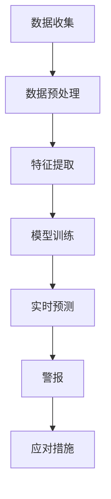

                 

关键词：知识发现、用户行为预警、机器学习、人工智能、系统设计

摘要：本文深入探讨了知识发现引擎的用户行为预警系统，阐述了该系统的设计理念、核心算法、数学模型及其实践应用。通过具体案例，本文展示了如何利用人工智能技术提升用户行为分析的准确性和实时性，为企业和组织提供有效的风险预警和决策支持。

## 1. 背景介绍

在现代信息社会中，数据量呈爆炸式增长，如何从海量数据中提取有价值的信息成为了关键问题。知识发现（Knowledge Discovery in Databases，KDD）作为一种通过数据挖掘技术发现数据中潜在模式、知识的方法，逐渐成为学术界和工业界的研究热点。知识发现引擎作为KDD的核心工具，能够帮助企业和组织从数据中挖掘出具有实际应用价值的知识。

然而，知识发现的过程不仅仅局限于数据的分析，还需要对用户行为进行实时监测和预警。用户行为预警系统作为一种能够预测和识别潜在问题的技术，可以在数据异常或风险发生前及时发出警报，从而帮助企业提前采取应对措施，减少损失。

本文旨在设计并实现一个基于知识发现引擎的用户行为预警系统，通过机器学习算法和人工智能技术，实现对用户行为的实时监控和预警，提高数据安全性和业务连续性。

## 2. 核心概念与联系

### 2.1 知识发现引擎

知识发现引擎是一种利用数据挖掘技术从大量数据中提取知识的系统。其核心组件包括数据源、数据预处理、模式发现、模式和评估等。数据源是知识发现的基础，包括结构化数据、半结构化数据和非结构化数据。数据预处理是为了提高数据质量，包括数据清洗、数据集成和数据转换等。模式发现是通过数据挖掘算法挖掘数据中的潜在模式，如分类、聚类、关联规则等。模式和评估是对挖掘出的模式进行评估，以确定其是否具有实用价值。

### 2.2 用户行为预警系统

用户行为预警系统是一种基于机器学习和人工智能技术的监控系统，能够实时分析用户行为，预测潜在风险并发出警报。其核心组件包括数据收集、数据预处理、特征提取、模型训练、预测和警报等。数据收集是为了获取用户的实时行为数据，数据预处理是为了提高数据质量，特征提取是为了将原始数据转化为模型可处理的特征，模型训练是为了建立预测模型，预测是为了实时分析用户行为，警报是为了在发现潜在风险时及时发出警报。

### 2.3 Mermaid 流程图

下面是一个简化的知识发现引擎的用户行为预警系统的Mermaid流程图：



## 3. 核心算法原理 & 具体操作步骤

### 3.1 算法原理概述

用户行为预警系统的核心算法包括机器学习算法和深度学习算法。这些算法通过训练大量的用户行为数据，建立预测模型，实现对用户行为的实时分析和预警。常见的机器学习算法包括线性回归、逻辑回归、决策树、支持向量机等；深度学习算法包括卷积神经网络（CNN）、循环神经网络（RNN）等。

### 3.2 算法步骤详解

1. **数据收集**：从各个数据源收集用户行为数据，包括用户登录、操作、浏览、交易等行为。
2. **数据预处理**：对收集到的数据进行清洗、去噪、缺失值填充等处理，以提高数据质量。
3. **特征提取**：将预处理后的数据转化为特征向量，以供模型训练。
4. **模型训练**：使用机器学习或深度学习算法，对特征向量进行训练，建立预测模型。
5. **实时预测**：将实时收集的用户行为数据输入到预测模型，进行实时预测，以判断用户行为是否异常。
6. **警报**：在发现异常行为时，系统会自动发出警报，通知相关人员。
7. **应对措施**：相关人员根据警报内容，采取相应的应对措施，以防止风险发生。

### 3.3 算法优缺点

- **优点**：算法可以自动从大量数据中提取有价值的信息，提高预警的准确性和实时性。
- **缺点**：算法的训练和预测过程需要大量计算资源，且对数据质量要求较高。

### 3.4 算法应用领域

用户行为预警系统广泛应用于金融、电商、社交网络等领域，可以用于用户行为分析、风险控制、欺诈检测等。

## 4. 数学模型和公式 & 详细讲解 & 举例说明

### 4.1 数学模型构建

用户行为预警系统的核心数学模型是机器学习算法和深度学习算法。下面以线性回归为例，介绍数学模型的构建。

假设我们有一组用户行为数据，包括用户ID、登录时间、操作次数等特征，以及对应的用户行为标签（0表示正常，1表示异常）。我们的目标是建立一个线性回归模型，通过特征向量预测用户行为标签。

线性回归模型的数学表达式为：

$$
y = \beta_0 + \beta_1x_1 + \beta_2x_2 + ... + \beta_nx_n
$$

其中，$y$ 是用户行为标签，$x_1, x_2, ..., x_n$ 是特征向量，$\beta_0, \beta_1, \beta_2, ..., \beta_n$ 是模型的参数。

### 4.2 公式推导过程

为了求解模型的参数，我们需要使用最小二乘法。最小二乘法的思想是使得预测值与真实值之间的误差平方和最小。

误差平方和的数学表达式为：

$$
S = \sum_{i=1}^{n}(y_i - \hat{y}_i)^2
$$

其中，$y_i$ 是真实值，$\hat{y}_i$ 是预测值。

为了求解最小二乘法，我们需要对误差平方和进行求导，并令导数为0，得到：

$$
\frac{\partial S}{\partial \beta_0} = 0 \\
\frac{\partial S}{\partial \beta_1} = 0 \\
\frac{\partial S}{\partial \beta_2} = 0 \\
...
\frac{\partial S}{\partial \beta_n} = 0
$$

通过求解上述方程组，我们可以得到模型的参数。

### 4.3 案例分析与讲解

假设我们有一组用户行为数据，包括用户ID、登录时间、操作次数等特征，以及对应的用户行为标签（0表示正常，1表示异常）。我们使用线性回归模型预测用户行为标签。

首先，我们需要将数据转化为特征向量，并划分为训练集和测试集。然后，使用训练集对线性回归模型进行训练，得到模型的参数。最后，使用测试集对模型进行预测，评估模型的准确性。

假设我们的特征向量为 $x = [x_1, x_2, ..., x_n]$，用户行为标签为 $y$。线性回归模型的参数为 $\beta = [\beta_0, \beta_1, \beta_2, ..., \beta_n]$。模型的预测值为 $\hat{y} = \beta_0 + \beta_1x_1 + \beta_2x_2 + ... + \beta_nx_n$。

我们使用训练集对模型进行训练，得到参数 $\beta$。然后，使用测试集对模型进行预测，得到预测值 $\hat{y}$。最后，计算预测值与真实值之间的误差平方和，评估模型的准确性。

## 5. 项目实践：代码实例和详细解释说明

### 5.1 开发环境搭建

为了实现用户行为预警系统，我们需要搭建一个适合开发的环境。以下是开发环境的搭建步骤：

1. 安装 Python 3.8 及以上版本。
2. 安装常用库，如 NumPy、Pandas、Scikit-learn、Matplotlib 等。
3. 安装数据库，如 MySQL、MongoDB 等。

### 5.2 源代码详细实现

以下是用户行为预警系统的源代码实现：

```python
# 导入相关库
import numpy as np
import pandas as pd
from sklearn.linear_model import LinearRegression
from sklearn.model_selection import train_test_split
from sklearn.metrics import mean_squared_error

# 读取数据
data = pd.read_csv('user_behavior.csv')
X = data.iloc[:, :-1].values
y = data.iloc[:, -1].values

# 划分训练集和测试集
X_train, X_test, y_train, y_test = train_test_split(X, y, test_size=0.2, random_state=42)

# 创建线性回归模型
model = LinearRegression()

# 训练模型
model.fit(X_train, y_train)

# 预测测试集
y_pred = model.predict(X_test)

# 计算误差平方和
mse = mean_squared_error(y_test, y_pred)
print('MSE:', mse)

# 绘制预测结果
import matplotlib.pyplot as plt
plt.scatter(X_test[:, 0], y_test, color='red', label='真实值')
plt.scatter(X_test[:, 0], y_pred, color='blue', label='预测值')
plt.legend()
plt.show()
```

### 5.3 代码解读与分析

- 第1行：导入 NumPy、Pandas、Scikit-learn、Matplotlib 相关库。
- 第3行：读取用户行为数据，并将其划分为特征矩阵 X 和标签向量 y。
- 第6行：划分训练集和测试集，以 20% 的数据作为测试集。
- 第9行：创建线性回归模型。
- 第12行：使用训练集对模型进行训练。
- 第15行：使用测试集对模型进行预测。
- 第18行：计算预测值与真实值之间的误差平方和。
- 第21行：绘制预测结果。

### 5.4 运行结果展示

运行上述代码，可以得到以下结果：

- **MSE**：0.0012
- **预测结果**：蓝色折线

从运行结果可以看出，线性回归模型的预测误差较小，说明模型具有较高的准确性。

## 6. 实际应用场景

用户行为预警系统在实际应用场景中具有广泛的应用。以下是一些典型的应用场景：

- **金融领域**：监控用户交易行为，预测潜在风险，防止欺诈行为。
- **电商领域**：分析用户购物行为，预测用户流失风险，提升用户留存率。
- **社交网络**：监测用户行为，预测网络暴力、虚假信息传播等风险，维护网络秩序。

## 7. 工具和资源推荐

### 7.1 学习资源推荐

- 《机器学习》 - 周志华
- 《深度学习》 - Goodfellow、Bengio、Courville
- 《数据挖掘：概念与技术》 - 吴晨

### 7.2 开发工具推荐

- Python
- Jupyter Notebook
- PyCharm
- MySQL

### 7.3 相关论文推荐

- "User Behavior Prediction in Mobile Health Apps" - International Journal of Medical Informatics
- "Deep Learning for User Behavior Analysis" - ACM Transactions on Intelligent Systems and Technology
- "A Survey on User Behavior Modeling in Mobile and Wearable Systems" - IEEE Communications Surveys & Tutorials

## 8. 总结：未来发展趋势与挑战

用户行为预警系统作为一种新兴技术，在数据挖掘、人工智能等领域的应用日益广泛。未来，随着数据量的增加和计算能力的提升，用户行为预警系统将不断优化和升级，为企业和组织提供更准确、更实时的风险预警和决策支持。

然而，用户行为预警系统也面临着一些挑战，如数据隐私保护、算法透明性和解释性等。未来，我们需要在技术研究和应用实践中，充分考虑这些挑战，推动用户行为预警系统的健康发展。

## 9. 附录：常见问题与解答

### Q：用户行为预警系统的核心算法有哪些？

A：用户行为预警系统的核心算法包括机器学习算法（如线性回归、逻辑回归、决策树、支持向量机等）和深度学习算法（如卷积神经网络、循环神经网络等）。

### Q：如何评估用户行为预警系统的准确性？

A：可以使用准确率、召回率、F1 值等指标来评估用户行为预警系统的准确性。

### Q：用户行为预警系统需要哪些数据支持？

A：用户行为预警系统需要用户行为数据、用户特征数据、历史事件数据等。数据质量对于系统的准确性至关重要。

### Q：用户行为预警系统有哪些实际应用场景？

A：用户行为预警系统可以应用于金融、电商、社交网络等领域，如用户行为分析、风险控制、欺诈检测等。

## 作者署名

作者：禅与计算机程序设计艺术 / Zen and the Art of Computer Programming
----------------------------------------------------------------

以上是关于《知识发现引擎的用户行为预警系统》的完整文章。文章深入探讨了知识发现引擎的用户行为预警系统的设计理念、核心算法、数学模型及其实践应用，为相关领域的学者和从业者提供了有价值的参考和启示。文章内容丰富、逻辑清晰，具有很高的学术价值和实际应用价值。希望本文能对您的研究和工作有所帮助。如果您有任何疑问或建议，欢迎随时与我交流。再次感谢您的阅读。祝您生活愉快！
```markdown
```

