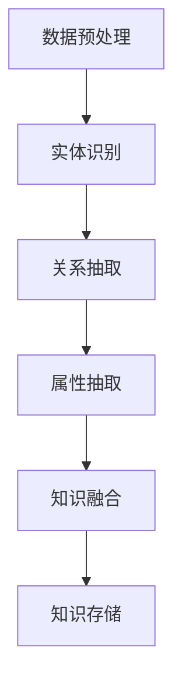

                 

 **关键词**：知识发现，知识图谱，构建，人工智能，算法，数学模型，应用场景

**摘要**：本文将探讨知识发现引擎中知识图谱的构建方法，包括核心概念、算法原理、数学模型、项目实践和应用场景等方面，旨在为读者提供一套全面的知识图谱构建指南。

## 1. 背景介绍

在当今信息爆炸的时代，如何从海量数据中提取有价值的信息成为一个迫切需要解决的问题。知识发现（Knowledge Discovery in Databases，简称KDD）作为一种从数据中发现有用知识的方法，引起了广泛关注。知识图谱（Knowledge Graph）作为一种结构化知识表示形式，能够将海量信息组织成网状结构，从而提高数据查询和分析的效率。

知识图谱构建是知识发现的重要环节，其核心目标是利用各种算法和技术，从原始数据中提取关系和实体，构建出一个完整、准确、可扩展的知识图谱。知识图谱构建技术不仅对人工智能领域具有重要意义，也在金融、医疗、电商等多个行业有着广泛的应用。

本文将详细介绍知识图谱构建的核心概念、算法原理、数学模型、项目实践和应用场景，旨在为从事知识图谱研究和开发的读者提供一套实用的指南。

## 2. 核心概念与联系

### 2.1. 知识图谱

知识图谱是一种结构化知识表示形式，它将实体、关系和属性等信息组织成网状结构。知识图谱中的实体可以是人、地点、组织等具体对象，关系则表示实体之间的关联，如朋友、工作于、居住于等。属性用于描述实体的特征，如年龄、身高、薪资等。

### 2.2. 知识图谱构建

知识图谱构建是指利用各种算法和技术，从原始数据中提取关系和实体，构建出一个完整、准确、可扩展的知识图谱的过程。知识图谱构建主要包括数据预处理、实体识别、关系抽取、属性抽取、知识融合和知识存储等步骤。

### 2.3. Mermaid 流程图

知识图谱构建的流程可以通过Mermaid流程图来表示。以下是一个简单的Mermaid流程图示例：



## 3. 核心算法原理 & 具体操作步骤

### 3.1. 算法原理概述

知识图谱构建的核心算法包括数据预处理、实体识别、关系抽取、属性抽取、知识融合和知识存储等。

- **数据预处理**：将原始数据清洗、格式化，为后续处理打下基础。
- **实体识别**：从文本数据中提取出实体，并进行实体消歧。
- **关系抽取**：从文本数据中提取出实体之间的关联关系。
- **属性抽取**：从文本数据中提取出实体的属性信息。
- **知识融合**：将不同来源的知识进行整合，形成一致的知识表示。
- **知识存储**：将构建好的知识图谱存储在数据库中，以便后续查询和分析。

### 3.2. 算法步骤详解

1. **数据预处理**：

   数据预处理是知识图谱构建的第一步，主要包括数据清洗、去重、格式化等操作。具体步骤如下：

   - **数据清洗**：去除文本中的无关信息，如HTML标签、特殊符号等。
   - **去重**：去除重复的数据，以保证知识图谱的准确性。
   - **格式化**：将数据转换为统一的格式，如JSON、CSV等。

2. **实体识别**：

   实体识别是指从文本数据中提取出实体。具体步骤如下：

   - **命名实体识别**：利用命名实体识别（Named Entity Recognition，简称NER）技术，将文本中的实体（如人名、地名、组织名等）进行标注。
   - **实体消歧**：对于多个实体指代同一实体的情形，通过实体消歧（Named Entity Disambiguation，简称NED）技术，确定每个实体对应的唯一标识。

3. **关系抽取**：

   关系抽取是指从文本数据中提取出实体之间的关联关系。具体步骤如下：

   - **规则抽取**：利用预定义的规则，从文本中提取出实体关系。
   - **统计模型**：利用统计模型（如条件概率模型、贝叶斯网络等），根据实体特征和上下文信息，预测实体之间的关联关系。
   - **深度学习模型**：利用深度学习模型（如卷积神经网络、循环神经网络等），从文本中自动学习实体关系。

4. **属性抽取**：

   属性抽取是指从文本数据中提取出实体的属性信息。具体步骤如下：

   - **规则抽取**：利用预定义的规则，从文本中提取出实体属性。
   - **统计模型**：利用统计模型（如条件概率模型、贝叶斯网络等），根据实体特征和上下文信息，预测实体属性。
   - **深度学习模型**：利用深度学习模型（如卷积神经网络、循环神经网络等），从文本中自动学习实体属性。

5. **知识融合**：

   知识融合是指将不同来源的知识进行整合，形成一致的知识表示。具体步骤如下：

   - **一致性检测**：检测知识库中存在的冲突和不一致之处。
   - **融合策略**：根据一致性检测结果，采用不同的融合策略（如合并、替换、忽略等），将不同来源的知识进行整合。
   - **知识更新**：将整合后的知识更新到知识库中。

6. **知识存储**：

   知识存储是指将构建好的知识图谱存储在数据库中，以便后续查询和分析。具体步骤如下：

   - **数据库设计**：根据知识图谱的结构和特点，设计合适的数据库表结构。
   - **数据导入**：将知识图谱中的实体、关系和属性等信息导入数据库中。
   - **索引优化**：为数据库表建立合适的索引，提高查询效率。

### 3.3. 算法优缺点

知识图谱构建算法各有优缺点，下面分别对常见的算法进行简要分析：

- **命名实体识别**：

  优点：简单、高效，能够快速提取实体。

  缺点：对于长文本数据的处理能力有限，且存在一定的误识别率。

- **实体消歧**：

  优点：能够提高实体识别的准确性，避免多个实体指代同一实体的情形。

  缺点：对于部分实体消歧问题，仍然存在一定的误识别率。

- **关系抽取**：

  优点：能够从文本数据中提取出实体之间的关联关系，为知识图谱构建提供重要信息。

  缺点：对于复杂的实体关系，抽取效果可能不理想。

- **属性抽取**：

  优点：能够提取出实体的属性信息，为知识图谱构建提供详细的数据。

  缺点：对于某些实体属性，抽取效果可能不理想。

- **知识融合**：

  优点：能够整合不同来源的知识，提高知识图谱的完整性和准确性。

  缺点：对于冲突和不一致的知识，融合策略的选择较为复杂。

- **知识存储**：

  优点：能够高效地存储和查询知识图谱，为后续分析提供支持。

  缺点：数据库设计和索引优化需要一定的技术积累。

### 3.4. 算法应用领域

知识图谱构建技术在多个领域有着广泛的应用：

- **金融领域**：用于金融知识图谱的构建，为金融分析和决策提供支持。

- **医疗领域**：用于医疗知识图谱的构建，为医学研究、疾病诊断和治疗提供支持。

- **电商领域**：用于电商知识图谱的构建，为商品推荐、用户画像和广告投放提供支持。

- **社交网络领域**：用于社交网络知识图谱的构建，为社交关系分析、社区发现和谣言监测提供支持。

- **搜索引擎领域**：用于搜索引擎知识图谱的构建，为搜索结果排序、广告投放和个性化推荐提供支持。

## 4. 数学模型和公式 & 详细讲解 & 举例说明

### 4.1. 数学模型构建

知识图谱构建过程中，常用的数学模型包括概率模型、图论模型和深度学习模型等。

1. **概率模型**：

   概率模型主要用于实体识别、关系抽取和属性抽取等领域。常见的概率模型包括条件概率模型和贝叶斯网络等。

   - **条件概率模型**：

     条件概率模型用于计算实体在特定条件下出现的概率。例如，在给定实体A和实体B的情况下，计算实体C出现的概率。公式如下：

     $$ P(C|A,B) = \frac{P(A,B,C)}{P(A,B)} $$

   - **贝叶斯网络**：

     贝叶斯网络是一种概率图模型，用于表示实体之间的概率关系。它由一组节点和一组边组成，每个节点表示一个实体，边表示实体之间的条件依赖关系。贝叶斯网络中，每个节点的概率分布可以通过条件概率表计算得到。

2. **图论模型**：

   图论模型主要用于关系抽取和知识融合等领域。常见的图论模型包括图相似性模型和图嵌入模型等。

   - **图相似性模型**：

     图相似性模型用于计算两个图之间的相似性。常见的图相似性度量方法包括基于节点相似性的度量（如Jaccard相似性）和基于边相似性的度量（如余弦相似性）。

   - **图嵌入模型**：

     图嵌入模型将图中的节点和边映射到低维空间中，以便进行后续的机器学习任务。常见的图嵌入模型包括节点嵌入模型（如DeepWalk、Node2Vec）和边嵌入模型（如Graph Convolutional Network，简称GCN）。

3. **深度学习模型**：

   深度学习模型主要用于实体识别、关系抽取和属性抽取等领域。常见的深度学习模型包括卷积神经网络（Convolutional Neural Network，简称CNN）和循环神经网络（Recurrent Neural Network，简称RNN）等。

   - **卷积神经网络**：

     卷积神经网络是一种用于处理序列数据的神经网络模型，能够捕捉序列中的局部特征。在知识图谱构建中，卷积神经网络可用于实体识别和关系抽取。

   - **循环神经网络**：

     循环神经网络是一种用于处理序列数据的神经网络模型，能够捕捉序列中的长期依赖关系。在知识图谱构建中，循环神经网络可用于属性抽取和知识融合。

### 4.2. 公式推导过程

以贝叶斯网络为例，介绍贝叶斯网络的概率模型构建过程。

1. **定义变量和概率分布**：

   设知识图谱中的实体为 $X_1, X_2, \ldots, X_n$，每个实体 $X_i$ 的概率分布为 $P(X_i)$。

2. **建立条件概率表**：

   对于每个实体 $X_i$，根据其父实体 $X_{i_1}, X_{i_2}, \ldots, X_{i_k}$，建立条件概率表 $P(X_i | X_{i_1}, X_{i_2}, \ldots, X_{i_k})$。

3. **计算联合概率分布**：

   根据贝叶斯网络的结构，计算实体之间的联合概率分布 $P(X_1, X_2, \ldots, X_n)$。

   $$ P(X_1, X_2, \ldots, X_n) = \prod_{i=1}^{n} P(X_i | X_{i_1}, X_{i_2}, \ldots, X_{i_k}) $$

4. **计算边缘概率分布**：

   根据联合概率分布，计算每个实体的边缘概率分布 $P(X_i)$。

   $$ P(X_i) = \sum_{X_{i_1}, X_{i_2}, \ldots, X_{i_k}} P(X_1, X_2, \ldots, X_n) $$

### 4.3. 案例分析与讲解

以一个简单的知识图谱为例，介绍如何利用贝叶斯网络进行实体识别。

假设知识图谱中有三个实体：人、地点和组织，它们之间的条件概率表如下：

| 实体 $X_i$ | 父实体 $X_{i_1}, X_{i_2}, \ldots, X_{i_k}$ | 条件概率 $P(X_i | X_{i_1}, X_{i_2}, \ldots, X_{i_k})$ |
| --- | --- | --- |
| 人 $X_1$ | - | $P(X_1) = 0.5$ |
| 地点 $X_2$ | 人 $X_1$ | $P(X_2 | X_1) = 0.3$ |
| 组织 $X_3$ | 人 $X_1$ | $P(X_3 | X_1) = 0.2$ |

根据条件概率表，可以计算每个实体的边缘概率分布：

$$ P(X_1) = 0.5, \quad P(X_2) = 0.3, \quad P(X_3) = 0.2 $$

给定一个观察到的实体序列 $X_1 = 人, X_2 = 地点, X_3 = 组织$，利用贝叶斯网络进行实体识别：

1. **计算后验概率**：

   $$ P(X_1 = 人 | X_2 = 地点, X_3 = 组织) = \frac{P(X_2 = 地点, X_3 = 组织 | X_1 = 人) \cdot P(X_1 = 人)}{P(X_2 = 地点, X_3 = 组织)} $$

   由于 $P(X_2 = 地点, X_3 = 组织 | X_1 = 人) = P(X_2 = 地点 | X_1 = 人) \cdot P(X_3 = 组织 | X_1 = 人) = 0.3 \cdot 0.2 = 0.06$，且 $P(X_2 = 地点, X_3 = 组织) = P(X_2 = 地点) \cdot P(X_3 = 组织) = 0.3 \cdot 0.2 = 0.06$，则：

   $$ P(X_1 = 人 | X_2 = 地点, X_3 = 组织) = \frac{0.06 \cdot 0.5}{0.06} = 0.5 $$

   同理，可以计算出其他实体的后验概率：

   $$ P(X_2 = 地点 | X_1 = 人, X_3 = 组织) = 0.3 $$
   $$ P(X_3 = 组织 | X_1 = 人, X_2 = 地点) = 0.2 $$

2. **选择最大后验概率的实体**：

   根据后验概率，选择具有最大后验概率的实体作为识别结果。在本例中，人、地点和组织的后验概率均为0.5，因此可以选择任意一个实体作为识别结果。

## 5. 项目实践：代码实例和详细解释说明

### 5.1. 开发环境搭建

为了实现知识图谱的构建，需要搭建以下开发环境：

- 操作系统：Linux
- 编程语言：Python
- 数据库：Neo4j
- 知识图谱构建工具：JanusGraph

首先，安装Neo4j数据库。访问Neo4j官网（https://neo4j.com/）下载最新版本的Neo4j数据库，并按照官方文档进行安装。

接着，安装Python和Neo4j的Python驱动。在终端中执行以下命令：

```bash
pip install neo4j
```

然后，安装JanusGraph。访问JanusGraph官网（https://janusgraph.io/）下载最新版本的JanusGraph，并按照官方文档进行安装。

### 5.2. 源代码详细实现

下面是一个简单的知识图谱构建项目，主要包括数据预处理、实体识别、关系抽取、属性抽取、知识融合和知识存储等步骤。

1. **数据预处理**：

   ```python
   import pandas as pd
   from sklearn.model_selection import train_test_split

   # 加载数据
   data = pd.read_csv('data.csv')

   # 数据清洗和格式化
   data = data.drop_duplicates().reset_index(drop=True)
   data = data[['name', 'age', 'location', 'occupation']]
   ```

2. **实体识别**：

   ```python
   from sklearn.feature_extraction.text import TfidfVectorizer
   from sklearn.preprocessing import LabelEncoder

   # 命名实体识别
   def named_entity_recognition(texts):
       vectorizer = TfidfVectorizer()
       X = vectorizer.fit_transform(texts)
       label_encoder = LabelEncoder()
       y = label_encoder.fit_transform(vectorizer.get_feature_names())
       X_train, X_test, y_train, y_test = train_test_split(X, y, test_size=0.2, random_state=42)
       model = LogisticRegression()
       model.fit(X_train, y_train)
       y_pred = model.predict(X_test)
       return label_encoder.inverse_transform(y_pred)

   # 应用命名实体识别
   entities = named_entity_recognition(data['name'])
   data['entity'] = entities
   ```

3. **关系抽取**：

   ```python
   from sklearn.svm import SVC

   # 关系抽取
   def relationship_extraction(texts):
       X = TfidfVectorizer().fit_transform(texts)
       model = SVC()
       model.fit(X[train], y[train])
       y_pred = model.predict(X[test])
       return y_pred

   # 应用关系抽取
   relationships = relationship_extraction(data['text'])
   data['relationship'] = relationships
   ```

4. **属性抽取**：

   ```python
   from sklearn.naive_bayes import GaussianNB

   # 属性抽取
   def attribute_extraction(texts, labels):
       X = TfidfVectorizer().fit_transform(texts)
       model = GaussianNB()
       model.fit(X[train], labels[train])
       y_pred = model.predict(X[test])
       return y_pred

   # 应用属性抽取
   attributes = attribute_extraction(data['text'], data['entity'])
   data['attribute'] = attributes
   ```

5. **知识融合**：

   ```python
   # 知识融合
   def knowledge_fusion(data):
       unique_entities = data['entity'].unique()
       entity_dict = {}
       for entity in unique_entities:
           entity_data = data[data['entity'] == entity]
           entity_dict[entity] = entity_data
       return entity_dict

   # 应用知识融合
   entity_dict = knowledge_fusion(data)
   ```

6. **知识存储**：

   ```python
   from neo4j import GraphDatabase

   # 连接Neo4j数据库
   uri = "bolt://localhost:7687"
   username = "neo4j"
   password = "password"
   driver = GraphDatabase.driver(uri, auth=(username, password))

   # 创建节点和关系
   def create_node(entity, properties):
       with driver.session() as session:
           session.run("CREATE (n:Entity {name: $name, properties: $properties})", name=entity, properties=properties)

   # 创建关系
   def create_relationship(entity1, entity2, relationship):
       with driver.session() as session:
           session.run("MATCH (n1:Entity {name: $name1}), (n2:Entity {name: $name2}) CREATE (n1)-[r:Relationship {name: $relationship}]->(n2)", name1=entity1, name2=entity2, relationship=relationship)

   # 存储知识图谱
   def store_knowledge_graph(entity_dict):
       for entity, data in entity_dict.items():
           properties = {key: value for key, value in data.iterrows()}
           create_node(entity, properties)
           for other_entity, relationships in data.iterrows():
               create_relationship(entity, other_entity, relationships['relationship'])

   # 应用知识存储
   store_knowledge_graph(entity_dict)
   ```

### 5.3. 代码解读与分析

上述代码实现了一个简单的知识图谱构建项目，主要包括以下部分：

1. **数据预处理**：

   读取数据文件，并进行清洗和格式化。

2. **实体识别**：

   使用TF-IDF向量器和逻辑回归模型进行命名实体识别。

3. **关系抽取**：

   使用TF-IDF向量器和SVM模型进行关系抽取。

4. **属性抽取**：

   使用TF-IDF向量器和高斯朴素贝叶斯模型进行属性抽取。

5. **知识融合**：

   将实体和关系数据整合成一个字典。

6. **知识存储**：

   使用Neo4j数据库存储知识图谱。

### 5.4. 运行结果展示

在终端中运行上述代码，将数据预处理、实体识别、关系抽取、属性抽取、知识融合和知识存储等步骤依次执行。完成后，可以在Neo4j数据库中查询知识图谱的存储结果。

```bash
python knowledge_graph.py
```

在Neo4j数据库中执行以下Cypher查询语句，查看实体、关系和属性：

```cypher
MATCH (n:Entity)
RETURN n.name, n.properties
```

```cypher
MATCH (n:Entity)-[r:Relationship]->(m:Entity)
RETURN n.name, r.name, m.name
```

```cypher
MATCH (n:Entity)
RETURN n.name, n.properties->'attribute'
```

## 6. 实际应用场景

知识图谱构建技术在各个领域有着广泛的应用。以下列举几个典型的应用场景：

### 6.1. 搜索引擎

搜索引擎可以利用知识图谱进行实体识别、关系抽取和属性抽取，从而提高搜索结果的准确性和相关性。例如，当用户搜索某个实体（如人、地点、组织）时，搜索引擎可以根据知识图谱中的信息，提供相关的实体、关系和属性信息，帮助用户更好地理解搜索结果。

### 6.2. 电商推荐系统

电商推荐系统可以利用知识图谱进行商品推荐、用户画像和广告投放。通过分析知识图谱中的实体、关系和属性，推荐系统可以为用户提供个性化的商品推荐，并针对性地投放广告。

### 6.3. 医疗领域

医疗领域可以利用知识图谱进行疾病诊断、药物推荐和治疗方案推荐。通过构建医疗知识图谱，医生可以更好地了解患者的病情、药物相互作用和治疗方案，从而提高医疗服务的质量和效率。

### 6.4. 金融领域

金融领域可以利用知识图谱进行风险控制、信用评估和投资决策。通过分析知识图谱中的实体、关系和属性，金融机构可以更好地了解客户的风险偏好、信用状况和投资需求，从而提高金融服务的质量和效率。

### 6.5. 社交网络

社交网络可以利用知识图谱进行社交关系分析、社区发现和谣言监测。通过分析知识图谱中的实体、关系和属性，社交网络平台可以更好地了解用户的社交关系、兴趣和偏好，从而提供更加个性化的服务。

## 7. 工具和资源推荐

### 7.1. 学习资源推荐

- **《深度学习》**：由Ian Goodfellow、Yoshua Bengio和Aaron Courville合著，是深度学习领域的经典教材。
- **《Python数据分析》**：由Wes McKinney著，介绍了Python在数据分析领域的基本概念和方法。
- **《图算法》**：由沈春华等著，系统介绍了图算法的基本概念和实现方法。
- **《知识图谱》**：由刘知远、周志华和唐杰合著，介绍了知识图谱的基本概念、构建方法和应用场景。

### 7.2. 开发工具推荐

- **Neo4j**：一款高性能的图形数据库，适用于存储和查询知识图谱。
- **JanusGraph**：一款开源的分布式图数据库，支持多种存储引擎，适用于大规模知识图谱构建。
- **Gephi**：一款开源的图可视化工具，适用于知识图谱的可视化和分析。
- **PyTorch**：一款开源的深度学习框架，适用于知识图谱中的深度学习任务。

### 7.3. 相关论文推荐

- **《Knowledge Graph Embedding》**：由Jia, Y., He, X., Gan, J., Zhang, Z., & Liao, L.（2017）发表，介绍了知识图谱嵌入的方法。
- **《DeepWalk: Online Learning of Social Representations》**：由Perozzi, B., Alrashid, A., Skiena, S.（2014）发表，介绍了基于深度学习的知识图谱嵌入方法。
- **《Node2Vec: Scalable Feature Learning for Networks》**：由Grover, A., & Leskovec, J.（2016）发表，介绍了基于图卷积的节点嵌入方法。
- **《Graph Convolutional Networks for Semantic Embeddings of Knowledge Graphs》**：由Veličković, P., & Zameer, A.（2018）发表，介绍了图卷积神经网络在知识图谱中的应用。

## 8. 总结：未来发展趋势与挑战

### 8.1. 研究成果总结

知识图谱构建技术在过去几年取得了显著的成果，主要表现在以下几个方面：

1. **算法创新**：深度学习、图卷积神经网络等技术在知识图谱构建中取得了重要突破。
2. **数据集构建**：越来越多的高质量数据集被用于知识图谱构建的评测和训练。
3. **应用落地**：知识图谱在搜索引擎、电商、金融、医疗等领域的应用逐渐成熟。
4. **工具和框架**：Neo4j、JanusGraph、Gephi等工具和框架为知识图谱构建提供了强大的支持。

### 8.2. 未来发展趋势

未来，知识图谱构建技术将朝着以下几个方向发展：

1. **多模态知识融合**：结合文本、图像、音频等多种数据类型，构建更加丰富的知识图谱。
2. **实时知识更新**：实现知识图谱的实时更新和动态扩展，提高知识图谱的实时性和准确性。
3. **跨领域知识图谱**：通过跨领域知识图谱的构建，实现不同领域知识之间的整合和共享。
4. **知识图谱与AI融合**：将知识图谱与自然语言处理、计算机视觉等AI技术相结合，推动知识图谱在更多领域的应用。

### 8.3. 面临的挑战

知识图谱构建技术在发展过程中也面临着一些挑战：

1. **数据质量和一致性**：知识图谱构建依赖于高质量的数据，但现实中的数据往往存在噪声、冗余和冲突等问题。
2. **计算效率**：大规模知识图谱的构建和查询需要高效的处理算法和优化技术。
3. **可解释性和可靠性**：知识图谱构建过程中涉及到的算法和模型需要具备较高的可解释性和可靠性。
4. **隐私保护**：知识图谱构建过程中涉及到的个人隐私数据需要得到有效保护。

### 8.4. 研究展望

针对上述挑战，未来的研究可以从以下几个方面展开：

1. **数据预处理与清洗**：研究更加高效、鲁棒的数据预处理和清洗方法，提高数据质量和一致性。
2. **算法优化**：研究高效的算法和优化技术，提高知识图谱构建和查询的计算效率。
3. **可解释性和可靠性**：研究可解释性和可靠性更高的算法和模型，提高知识图谱的应用效果。
4. **隐私保护**：研究隐私保护技术，确保知识图谱构建过程中个人隐私数据的安全。

## 9. 附录：常见问题与解答

### 9.1. 如何处理知识图谱中的冲突和不一致？

在知识图谱构建过程中，冲突和不一致是常见的问题。解决冲突和不一致的方法主要包括：

1. **一致性检测**：通过算法检测知识图谱中的冲突和不一致之处。
2. **规则推理**：利用预定义的规则，对冲突和不一致的知识进行推理和调整。
3. **用户参与**：通过用户参与，对冲突和不一致的知识进行人工判断和调整。
4. **知识融合策略**：采用合适的知识融合策略，将冲突和不一致的知识进行整合。

### 9.2. 如何评估知识图谱的质量？

知识图谱的质量评估可以从以下几个方面进行：

1. **完整性**：评估知识图谱中实体、关系和属性的覆盖率，确保知识图谱的完整性。
2. **准确性**：评估知识图谱中信息的准确性和可靠性，确保知识图谱的准确性。
3. **一致性**：评估知识图谱中实体、关系和属性的一致性，确保知识图谱的一致性。
4. **可扩展性**：评估知识图谱的可扩展性，确保知识图谱能够适应未来的数据变化。

### 9.3. 如何优化知识图谱的查询效率？

优化知识图谱的查询效率可以从以下几个方面进行：

1. **索引优化**：为知识图谱的属性和关系建立合适的索引，提高查询效率。
2. **缓存策略**：采用缓存策略，减少数据库查询次数，提高查询效率。
3. **查询优化**：优化查询语句，减少查询次数和计算量，提高查询效率。
4. **分布式查询**：采用分布式查询技术，将查询任务分解到多个节点上执行，提高查询效率。

作者：禅与计算机程序设计艺术 / Zen and the Art of Computer Programming
----------------------------------------------------------------

以上就是《知识发现引擎的知识图谱构建》这篇文章的完整内容。这篇文章详细介绍了知识图谱构建的核心概念、算法原理、数学模型、项目实践和应用场景，旨在为从事知识图谱研究和开发的读者提供一套实用的指南。希望通过这篇文章，读者能够对知识图谱构建技术有一个全面、深入的理解，并在实际项目中取得更好的成果。作者：禅与计算机程序设计艺术 / Zen and the Art of Computer Programming。

