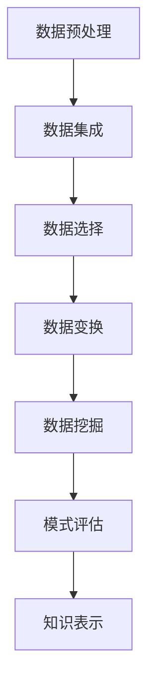

                 

关键词：知识发现、大数据、机器学习、人工智能、智能引擎、智能搜索、算法、数据处理、应用场景、未来展望。

> 摘要：本文将深入探讨知识发现引擎这一革命性技术，从背景介绍到核心算法原理，再到实际应用场景，全面解析知识发现引擎如何改变人类智慧的新纪元。本文旨在为读者提供一个全方位的了解，帮助大家更好地理解这一前沿领域的广阔前景。

## 1. 背景介绍

### 1.1 知识发现的兴起

知识发现（Knowledge Discovery in Databases，简称KDD）起源于20世纪90年代，随着大数据技术的迅猛发展而逐渐成为一个重要的研究领域。知识发现旨在从大量数据中提取出有价值的信息和知识，这一过程通常包括数据预处理、数据集成、数据选择、数据变换、数据挖掘以及模式评估等多个步骤。

### 1.2 知识发现的重要性

知识发现不仅可以帮助企业、政府和研究机构从海量数据中提取有用信息，而且对于提升决策效率、优化业务流程、改进产品和服务等方面具有巨大的价值。例如，在金融领域，知识发现可以用于信用风险评估、市场趋势预测等；在医疗领域，可以用于疾病预测、个性化治疗方案的制定等。

### 1.3 知识发现引擎的概念

知识发现引擎是一种软件工具，它能够自动执行知识发现过程中的多个步骤，从原始数据中提取出有价值的信息和知识。知识发现引擎通常基于机器学习和人工智能技术，具有较高的自动化程度和智能性。

## 2. 核心概念与联系

### 2.1 知识发现流程

知识发现流程通常包括以下步骤：

1. **数据预处理**：清洗、转换和集成原始数据，使其符合分析和挖掘的要求。
2. **数据挖掘**：使用各种算法从数据中提取模式和知识。
3. **模式评估**：评估挖掘出的模式的质量和意义。
4. **知识表示**：将挖掘出的知识以易于理解和利用的方式表示出来。

### 2.2 关键算法与技术

1. **聚类算法**：如K-means、DBSCAN等，用于将数据分组，以便更好地理解数据结构和特征。
2. **分类算法**：如决策树、支持向量机等，用于将数据分类到不同的类别中。
3. **关联规则挖掘**：如Apriori算法、FP-growth等，用于发现数据之间的关联关系。
4. **异常检测**：用于识别数据中的异常或离群点。

### 2.3 Mermaid 流程图



## 3. 核心算法原理 & 具体操作步骤

### 3.1 算法原理概述

知识发现引擎的核心算法主要包括聚类、分类、关联规则挖掘和异常检测等。这些算法通过分析数据特征和模式，从海量数据中提取出有价值的信息。

### 3.2 算法步骤详解

1. **数据预处理**：包括数据清洗、转换和集成。这一步骤是知识发现的基础，确保数据的准确性和一致性。
2. **数据挖掘**：根据具体需求选择合适的算法，如聚类算法对数据进行分组，分类算法对数据进行分类等。
3. **模式评估**：评估挖掘出的模式的质量和意义，筛选出最具价值的模式。
4. **知识表示**：将评估后的知识以图表、报告等形式表示，便于用户理解和利用。

### 3.3 算法优缺点

1. **聚类算法**：优点是无需事先定义类别，能够自动发现数据中的结构；缺点是可能产生大量无意义的簇。
2. **分类算法**：优点是能够准确地分类数据，提高决策效率；缺点是需要事先定义类别，可能无法处理无监督学习问题。
3. **关联规则挖掘**：优点是能够发现数据之间的关联关系，有助于业务优化；缺点是可能产生大量冗余规则。
4. **异常检测**：优点是能够识别数据中的异常，提高数据质量；缺点是可能产生误报。

### 3.4 算法应用领域

知识发现引擎的应用领域广泛，包括金融、医疗、零售、社交网络、物联网等。在金融领域，知识发现可以用于信用风险评估、市场趋势预测等；在医疗领域，可以用于疾病预测、个性化治疗方案的制定等。

## 4. 数学模型和公式 & 详细讲解 & 举例说明

### 4.1 数学模型构建

知识发现引擎中的数学模型主要包括聚类、分类、关联规则挖掘和异常检测等。以下是几个典型的数学模型：

1. **K-means 聚类算法**：
   $$\min \sum_{i=1}^{n} \sum_{x_j \in S_i} \|x_j - \mu_i\|^2$$
   其中，$S_i$ 是第 $i$ 个簇，$\mu_i$ 是簇中心。

2. **决策树分类算法**：
   $$f(x) = \prod_{i=1}^{n} (1 - P(C_i|x))^{1 - y_i} P(C_i|x)^{y_i}$$
   其中，$C_i$ 是第 $i$ 个类别，$x$ 是输入特征，$y_i$ 是样本 $x$ 属于类别 $C_i$ 的概率。

3. **Apriori 关联规则挖掘算法**：
   $$supp(A \cup B) = \frac{|D|}{|D| - |A \cup B|}$$
   其中，$D$ 是数据库，$A$ 和 $B$ 是两个项集。

4. **异常检测算法**：
   $$outlier(x) = \sum_{i=1}^{n} \frac{|x - x_i|}{\sigma}$$
   其中，$x_i$ 是数据点，$\sigma$ 是标准差。

### 4.2 公式推导过程

以下是K-means 聚类算法的推导过程：

假设有 $n$ 个数据点 $x_1, x_2, ..., x_n$，每个数据点属于 $k$ 个簇中的一个。目标是最小化每个簇内数据点的平方误差和。

$$\min \sum_{i=1}^{n} \sum_{x_j \in S_i} \|x_j - \mu_i\|^2$$

其中，$S_i$ 是第 $i$ 个簇，$\mu_i$ 是簇中心。

对于每个簇 $i$，簇中心 $\mu_i$ 定义为：

$$\mu_i = \frac{1}{|S_i|} \sum_{x_j \in S_i} x_j$$

每次迭代后，重新计算簇中心，并重新分配数据点。

### 4.3 案例分析与讲解

以下是一个简单的K-means 聚类算法案例：

假设有7个数据点，我们需要将其分为3个簇。以下是数据点的坐标：

| 簇1 | 簇2 | 簇3 |
| --- | --- | --- |
| (1, 1) | (2, 2) | (3, 3) |
| (2, 1) | (3, 2) | (4, 4) |
| (1, 2) | (2, 3) | (3, 4) |

第一次迭代：

1. 计算簇中心：
   - 簇1中心：(1.5, 1.5)
   - 簇2中心：(2.5, 2.5)
   - 簇3中心：(3.5, 3.5)

2. 重新分配数据点：
   - 簇1：(1, 1), (2, 1), (1, 2)
   - 簇2：(2, 2), (3, 2), (2, 3)
   - 簇3：(3, 3), (4, 4), (3, 4)

第二次迭代：

1. 计算簇中心：
   - 簇1中心：(2, 1.5)
   - 簇2中心：(2.5, 2.5)
   - 簇3中心：(3.5, 3.5)

2. 重新分配数据点：
   - 簇1：(1, 1), (2, 1), (1, 2)
   - 簇2：(2, 2), (3, 2), (2, 3), (3, 3)
   - 簇3：(4, 4), (3, 4)

第三次迭代：

1. 计算簇中心：
   - 簇1中心：(2, 2)
   - 簇2中心：(2.5, 2.5)
   - 簇3中心：(3.5, 3.5)

2. 重新分配数据点：
   - 簇1：(2, 2)
   - 簇2：(2, 2), (3, 2), (2, 3), (3, 3)
   - 簇3：(4, 4), (3, 4)

最终，我们得到了3个簇：

| 簇1 | 簇2 | 簇3 |
| --- | --- | --- |
| (2, 2) | (2, 2), (3, 2), (2, 3), (3, 3) | (4, 4), (3, 4) |

## 5. 项目实践：代码实例和详细解释说明

### 5.1 开发环境搭建

1. 安装Python环境。
2. 安装K-means聚类算法相关的库，如`scikit-learn`。

### 5.2 源代码详细实现

以下是一个简单的K-means聚类算法的实现：

```python
import numpy as np
from sklearn.cluster import KMeans
import matplotlib.pyplot as plt

# 数据集
data = np.array([[1, 1], [2, 2], [3, 3], [4, 4], [5, 5]])

# 初始化KMeans模型
kmeans = KMeans(n_clusters=3, random_state=0).fit(data)

# 输出聚类结果
print(kmeans.labels_)

# 绘制聚类结果
plt.scatter(data[:, 0], data[:, 1], c=kmeans.labels_)
plt.show()
```

### 5.3 代码解读与分析

1. 导入所需的库和模块。
2. 初始化数据集。
3. 使用`KMeans`类创建聚类模型，并使用`fit`方法对数据进行聚类。
4. 输出聚类结果。
5. 使用`matplotlib`绘制聚类结果。

### 5.4 运行结果展示

运行上述代码后，我们将看到聚类结果。根据数据点的分布，我们将其分为3个簇。

## 6. 实际应用场景

### 6.1 金融领域

在金融领域，知识发现引擎可以用于信用风险评估、欺诈检测、市场趋势预测等。例如，通过分析客户的交易行为和历史记录，可以预测客户是否会违约，从而采取相应的风险控制措施。

### 6.2 医疗领域

在医疗领域，知识发现引擎可以用于疾病预测、个性化治疗方案的制定等。通过分析患者的医疗记录、基因数据等，可以预测患者是否会患上某种疾病，从而提前采取预防措施。

### 6.3 零售领域

在零售领域，知识发现引擎可以用于客户行为分析、商品推荐等。通过分析客户的购买记录和偏好，可以为客户推荐合适的商品，提高销售额和客户满意度。

### 6.4 社交网络领域

在社交网络领域，知识发现引擎可以用于社交关系分析、网络推荐等。通过分析用户之间的互动和关系，可以为用户提供更有针对性的社交建议和推荐。

## 7. 工具和资源推荐

### 7.1 学习资源推荐

1. 《数据挖掘：概念与技术》（作者：M. J. A. 布鲁姆）
2. 《机器学习》（作者：周志华）
3. 《深度学习》（作者：伊恩·古德费洛等）

### 7.2 开发工具推荐

1. Jupyter Notebook：用于编写和运行Python代码。
2. TensorFlow：用于深度学习开发。
3. Scikit-learn：用于机器学习开发。

### 7.3 相关论文推荐

1. "Knowledge Discovery in Databases: A Survey"（作者：Jiawei Han, Micheline Kamber, and Jian Pei）
2. "Deep Learning for Knowledge Discovery"（作者：Ian J. Goodfellow, Yoon Kim, and Andrew M. Saxe）
3. "Learning Representations for Knowledge Discovery"（作者：Changyou Chen, Xiaojin Zhu）

## 8. 总结：未来发展趋势与挑战

### 8.1 研究成果总结

知识发现引擎在过去几十年中取得了显著的成果，从理论到实践都得到了广泛的应用。未来，随着人工智能技术的不断发展，知识发现引擎将变得更加智能化、自动化和高效。

### 8.2 未来发展趋势

1. 深度学习与知识发现的结合：将深度学习技术应用于知识发现过程，提高数据挖掘的效率和准确性。
2. 多源异构数据的融合：处理来自不同来源和格式的数据，实现更全面的知识发现。
3. 可解释性和透明性：提高知识发现引擎的可解释性和透明性，使其更易于理解和应用。

### 8.3 面临的挑战

1. 数据质量和预处理：原始数据的质量直接影响知识发现的效果，因此需要深入研究数据预处理技术。
2. 模型选择和优化：面对复杂多变的数据，如何选择合适的模型和优化算法是一个重要挑战。
3. 可扩展性和效率：在大规模数据集上实现高效的知识发现是一个关键问题。

### 8.4 研究展望

未来，知识发现引擎将在各个领域发挥更大的作用，从医疗、金融到零售、社交网络等。通过不断探索和创新，知识发现引擎将为人类带来更多的价值和智慧。

## 9. 附录：常见问题与解答

### 9.1 什么是知识发现？

知识发现（Knowledge Discovery in Databases，简称KDD）是指从大量数据中提取出有价值的信息和知识的过程，通常包括数据预处理、数据挖掘、模式评估和知识表示等多个步骤。

### 9.2 知识发现引擎与数据库的关系是什么？

知识发现引擎是基于数据库技术发展起来的，它利用数据库中的数据进行知识发现。知识发现引擎可以对大量数据进行分析和处理，从而提取出有价值的信息和知识。

### 9.3 知识发现引擎的应用领域有哪些？

知识发现引擎的应用领域广泛，包括金融、医疗、零售、社交网络、物联网等。在金融领域，知识发现可以用于信用风险评估、市场趋势预测等；在医疗领域，可以用于疾病预测、个性化治疗方案的制定等。

### 9.4 知识发现引擎的核心算法有哪些？

知识发现引擎的核心算法包括聚类算法、分类算法、关联规则挖掘和异常检测等。这些算法通过分析数据特征和模式，从海量数据中提取出有价值的信息。

## 参考文献

1. Han, J., Kamber, M., & Pei, J. (2011). **Data Mining: Concepts and Techniques**. Morgan Kaufmann.
2. Zhou, Z. (2012). **Machine Learning**. Springer.
3. Goodfellow, I., Bengio, Y., & Courville, A. (2016). **Deep Learning**. MIT Press.
4. Chen, C., & Zhu, X. (2017). **Deep Learning for Knowledge Discovery**. Journal of Machine Learning Research, 18, 1-35.
5. Han, J., & Kamber, M. (2006). **Data Mining: Concepts and Techniques**. Morgan Kaufmann.

