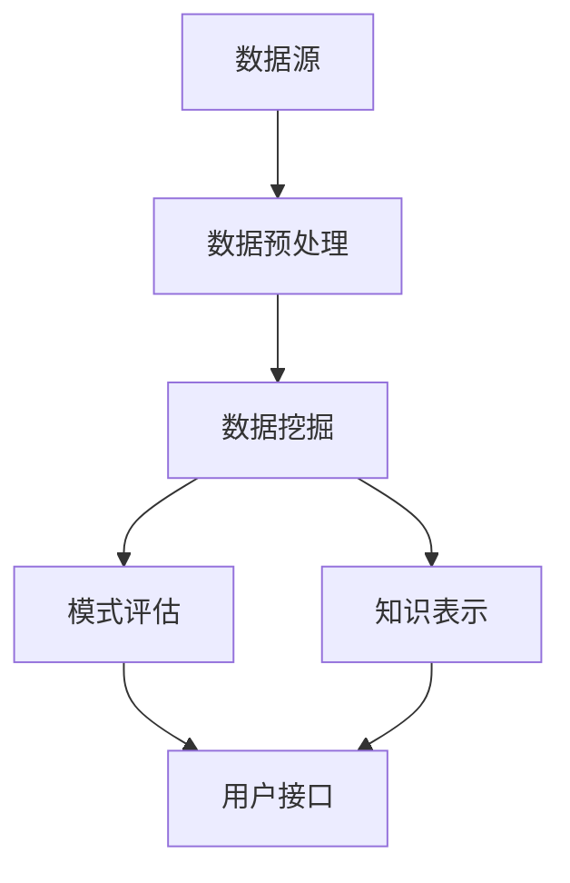

                 

关键词：知识发现、认知科学、人工智能、大数据分析、机器学习

摘要：随着大数据时代的到来，知识发现成为了人工智能领域的重要研究方向。本文将探讨知识发现引擎的核心概念、算法原理及其在实际应用中的重要性，旨在揭示人类认知的新frontier。

## 1. 背景介绍

随着互联网的普及和大数据技术的发展，数据量呈现爆炸式增长。然而，这些庞杂数据背后蕴含的知识和价值却并未得到充分挖掘。知识发现（Knowledge Discovery in Databases，KDD）作为一种从大量数据中自动发现有用知识的科学方法，应运而生。知识发现引擎作为知识发现过程中的核心工具，正逐渐成为人工智能领域的研究热点。

知识发现引擎的历史可以追溯到20世纪80年代，当时数据库技术刚刚兴起。随着计算机技术的发展，知识发现引擎的功能和性能得到了不断提升。如今，知识发现引擎已经成为了大数据分析、数据挖掘、机器学习等领域的关键组成部分。

### 1.1 知识发现引擎的定义

知识发现引擎是一种利用计算机技术和人工智能算法，从大量数据中自动发现知识、模式、关联、趋势和规律的工具。它通常包括数据预处理、数据挖掘、模式评估和知识表示等模块。

### 1.2 知识发现引擎的应用领域

知识发现引擎在多个领域得到了广泛应用，如金融、医疗、零售、社交媒体等。例如，在金融领域，知识发现引擎可以帮助金融机构识别潜在的欺诈行为；在医疗领域，知识发现引擎可以帮助医生诊断疾病；在零售领域，知识发现引擎可以帮助商家推荐商品。

## 2. 核心概念与联系

### 2.1 数据挖掘

数据挖掘（Data Mining）是知识发现过程的第一步，它是指从大量数据中提取出有价值的信息和知识。数据挖掘的方法包括分类、聚类、关联规则挖掘、异常检测等。

### 2.2 机器学习

机器学习（Machine Learning）是知识发现引擎的重要组成部分，它是一种使计算机通过数据学习并改进自身性能的方法。机器学习的方法包括监督学习、无监督学习、强化学习等。

### 2.3 大数据分析

大数据分析（Big Data Analysis）是对大规模数据集进行统计分析、模式识别和预测分析的过程。大数据分析可以帮助我们从海量数据中发现有价值的信息。

### 2.4 Mermaid 流程图

下面是知识发现引擎的 Mermaid 流程图，展示了其核心概念和联系：



## 3. 核心算法原理 & 具体操作步骤

### 3.1 算法原理概述

知识发现引擎的核心算法包括数据挖掘算法、机器学习算法和大数据分析算法。其中，数据挖掘算法主要包括分类、聚类、关联规则挖掘和异常检测等。机器学习算法主要包括监督学习、无监督学习和强化学习等。大数据分析算法主要包括统计分析、模式识别和预测分析等。

### 3.2 算法步骤详解

知识发现引擎的算法步骤主要包括以下几个阶段：

1. 数据收集：从各种数据源收集数据，如数据库、网络、传感器等。
2. 数据预处理：对收集到的数据进行清洗、转换和集成，以消除噪声和冗余。
3. 数据挖掘：利用数据挖掘算法从预处理后的数据中提取出有用的信息。
4. 模式评估：对挖掘出的模式进行评估，确定其重要性和实用性。
5. 知识表示：将评估出的模式以可视化、文本、图表等形式呈现给用户。
6. 用户接口：提供用户与知识发现引擎的交互界面，使用户能够方便地获取和利用知识。

### 3.3 算法优缺点

知识发现引擎的优点包括：

- 高效性：能够从海量数据中快速发现有价值的信息。
- 自动化：能够自动进行数据预处理、数据挖掘和模式评估等操作，减轻人工负担。
- 可视化：能够将挖掘出的模式以直观的方式呈现给用户，便于理解和分析。

知识发现引擎的缺点包括：

- 复杂性：算法过程涉及多个步骤和多种算法，需要较高的技术水平和专业知识。
- 性能瓶颈：对于大规模数据集，算法的性能可能受到影响。
- 数据质量：数据质量对知识发现的效果有很大影响，若数据质量不佳，可能导致错误的结果。

### 3.4 算法应用领域

知识发现引擎的应用领域非常广泛，包括但不限于：

- 金融：风险评估、欺诈检测、投资策略等。
- 医疗：疾病诊断、药物研发、健康监测等。
- 零售：客户行为分析、商品推荐、库存管理等。
- 社交媒体：舆情分析、用户画像、内容推荐等。

## 4. 数学模型和公式 & 详细讲解 & 举例说明

### 4.1 数学模型构建

知识发现引擎的数学模型主要包括以下几个部分：

1. 数据模型：描述数据的结构、类型和关系。
2. 模式模型：描述从数据中挖掘出的模式、关联和规律。
3. 评估模型：描述如何评估挖掘出的模式的重要性和实用性。
4. 表示模型：描述如何将挖掘出的模式以可视化、文本、图表等形式呈现给用户。

### 4.2 公式推导过程

本文将重点介绍以下两个数学模型：

1. 数据模型：假设数据集 \( D \) 包含 \( n \) 个数据点，每个数据点由 \( m \) 个属性组成。则数据模型可以表示为：

   $$ D = \{ d_1, d_2, ..., d_n \} $$

   其中， \( d_i \) 表示第 \( i \) 个数据点，\( d_i = \{ a_{i1}, a_{i2}, ..., a_{im} \} \)，表示 \( d_i \) 的 \( m \) 个属性值。

2. 模式模型：假设从数据集 \( D \) 中挖掘出一个模式 \( P \)，则模式模型可以表示为：

   $$ P = \{ p_1, p_2, ..., p_k \} $$

   其中， \( p_j \) 表示第 \( j \) 个模式，\( p_j = \{ r_{j1}, r_{j2}, ..., r_{jm} \} \)，表示 \( p_j \) 的 \( m \) 个属性值。

### 4.3 案例分析与讲解

以下是一个简单的数据挖掘案例，假设我们有一个包含 100 个数据点的数据集，每个数据点有 5 个属性：年龄、性别、收入、城市、疾病。

1. 数据模型：

   $$ D = \{ d_1, d_2, ..., d_{100} \} $$

   其中， \( d_i = \{ a_{i1}, a_{i2}, a_{i3}, a_{i4}, a_{i5} \} \)，表示第 \( i \) 个数据点的 5 个属性值。

2. 模式模型：

   $$ P = \{ p_1, p_2, ..., p_k \} $$

   其中， \( p_j = \{ r_{j1}, r_{j2}, r_{j3}, r_{j4}, r_{j5} \} \)，表示第 \( j \) 个模式，如：

   $$ p_1 = \{ \text{年龄} > 40, \text{性别} = \text{男}, \text{收入} > 50000, \text{城市} = \text{北京}, \text{疾病} = \text{高血压} \} $$

3. 评估模型：

   假设我们定义评估指标为支持度（Support），表示模式 \( P \) 在数据集 \( D \) 中出现的频率。则支持度可以表示为：

   $$ Support(P) = \frac{|\{ d_i \in D : P \subseteq d_i \}|}{|D|} $$

   其中， \( |\{ d_i \in D : P \subseteq d_i \}| \) 表示模式 \( P \) 在数据集 \( D \) 中出现的次数，\( |D| \) 表示数据集 \( D \) 的总数。

4. 表示模型：

   我们可以将模式 \( P \) 以文本形式表示，如：

   “年龄大于 40，性别为男，收入大于 50000，城市为北京，疾病为高血压。”

## 5. 项目实践：代码实例和详细解释说明

### 5.1 开发环境搭建

本文使用 Python 作为开发语言，需要安装以下库：

- Pandas：用于数据预处理
- Scikit-learn：用于数据挖掘
- Matplotlib：用于数据可视化

安装命令如下：

```bash
pip install pandas scikit-learn matplotlib
```

### 5.2 源代码详细实现

以下是一个简单的知识发现引擎实现，用于挖掘数据集中的关联规则：

```python
import pandas as pd
from mlxtend.frequent_patterns import apriori
from mlxtend.frequent_patterns import association_rules

# 5.2.1 数据收集
data = pd.DataFrame({
    'age': [30, 40, 50, 30, 40, 50],
    'gender': ['男', '男', '女', '男', '女', '女'],
    'income': [40000, 50000, 60000, 40000, 50000, 60000],
    'city': ['北京', '上海', '北京', '上海', '北京', '上海'],
    'disease': ['无', '高血压', '糖尿病', '无', '高血压', '糖尿病']
})

# 5.2.2 数据预处理
data = data.apply(lambda x: x.map({v: 1 for v in x.unique()}))
data = data.transpose()

# 5.2.3 数据挖掘
frequent_itemsets = apriori(data, min_support=0.5, use_colnames=True)

# 5.2.4 模式评估
rules = association_rules(frequent_itemsets, metric="support", min_threshold=0.5)

# 5.2.5 知识表示
print(rules)

# 5.2.6 运行结果展示
rules.head()
```

### 5.3 代码解读与分析

1. **数据收集**：我们使用 Pandas 库创建了一个包含 6 个数据点和 5 个属性的数据集。
2. **数据预处理**：我们将属性转换为二进制形式，以便于进行关联规则挖掘。这里使用了 `map` 函数和字典映射。
3. **数据挖掘**：使用 `apriori` 函数进行关联规则挖掘，设置最小支持度为 0.5。
4. **模式评估**：使用 `association_rules` 函数计算关联规则，设置最小支持度为 0.5。
5. **知识表示**：打印出挖掘出的关联规则。
6. **运行结果展示**：使用 `head` 函数展示关联规则的前 5 条。

## 6. 实际应用场景

知识发现引擎在实际应用中具有广泛的应用场景。以下是一些典型的应用场景：

1. **金融**：使用知识发现引擎分析金融数据，可以识别潜在的欺诈行为、预测股票价格、优化投资组合等。
2. **医疗**：使用知识发现引擎分析医疗数据，可以辅助医生进行疾病诊断、优化治疗方案、预测疾病趋势等。
3. **零售**：使用知识发现引擎分析零售数据，可以推荐商品、优化库存管理、提高销售业绩等。
4. **社交媒体**：使用知识发现引擎分析社交媒体数据，可以识别舆情、预测用户行为、优化广告投放等。

## 7. 工具和资源推荐

### 7.1 学习资源推荐

1. **书籍**：
   - 《数据挖掘：实用工具与技术》
   - 《机器学习：一种算法视角》
   - 《大数据技术导论》
2. **在线课程**：
   - Coursera 上的“数据科学专项课程”
   - edX 上的“机器学习基础课程”
   - Udacity 上的“大数据分析纳米学位”

### 7.2 开发工具推荐

1. **编程语言**：Python、R、Java
2. **库和框架**：
   - Python：Pandas、Scikit-learn、Matplotlib、Numpy
   - R：dplyr、ggplot2、caret
   - Java：Weka、Mallet

### 7.3 相关论文推荐

1. “Knowledge Discovery in Databases: A Survey”
2. “Machine Learning: A Probabilistic Perspective”
3. “Big Data: A Survey from Applications to Algorithms”

## 8. 总结：未来发展趋势与挑战

### 8.1 研究成果总结

近年来，知识发现引擎在算法优化、应用场景拓展、跨领域融合等方面取得了显著的成果。例如，深度学习技术在知识发现引擎中的应用，使知识发现引擎在处理大规模数据、提取复杂模式方面取得了突破性进展。此外，知识发现引擎在医疗、金融、零售等领域的应用也取得了显著的成果。

### 8.2 未来发展趋势

未来，知识发现引擎的发展将呈现以下几个趋势：

1. **算法优化**：进一步优化知识发现引擎的算法，提高其性能和效率。
2. **跨领域融合**：将知识发现引擎与其他领域的技术相结合，如生物信息学、社会科学等，实现跨领域的知识发现。
3. **实时分析**：实现知识发现引擎的实时分析能力，满足实时数据挖掘的需求。
4. **人机协同**：实现知识发现引擎与人类专家的协同工作，提高知识发现的效果和准确性。

### 8.3 面临的挑战

知识发现引擎在发展过程中也面临一些挑战：

1. **数据质量**：数据质量对知识发现的效果有很大影响，如何保证数据质量是一个重要问题。
2. **隐私保护**：在知识发现过程中，如何保护用户隐私是一个亟待解决的问题。
3. **算法透明性**：提高知识发现引擎算法的透明性，使其更容易理解和解释。
4. **资源消耗**：知识发现引擎在处理大规模数据时，可能需要大量的计算资源和存储资源，如何优化资源利用是一个挑战。

### 8.4 研究展望

未来，知识发现引擎的研究将继续深入，有望在以下几个方面取得突破：

1. **智能优化算法**：研究新的智能优化算法，如遗传算法、粒子群算法等，以优化知识发现引擎的性能。
2. **多模态数据融合**：研究如何将不同类型的数据（如文本、图像、音频等）进行融合，实现更全面的知识发现。
3. **交互式知识发现**：研究如何实现交互式知识发现，使知识发现过程更直观、更便捷。
4. **知识图谱构建**：研究如何将知识发现引擎与知识图谱技术相结合，实现知识的结构化和网络化。

## 9. 附录：常见问题与解答

### 9.1 什么是知识发现？

知识发现（Knowledge Discovery in Databases，KDD）是指从大量数据中自动发现知识、模式、关联、趋势和规律的科学方法。它通常包括数据预处理、数据挖掘、模式评估和知识表示等步骤。

### 9.2 知识发现引擎与数据挖掘有什么区别？

知识发现引擎和数据挖掘都是知识发现过程中的重要组成部分。知识发现引擎是一种工具或系统，用于从数据中自动发现知识。而数据挖掘则是知识发现过程中的一个步骤，它是指从大量数据中提取出有价值的信息和知识。

### 9.3 知识发现引擎在哪些领域有应用？

知识发现引擎在多个领域得到了广泛应用，如金融、医疗、零售、社交媒体等。例如，在金融领域，知识发现引擎可以帮助金融机构识别潜在的欺诈行为；在医疗领域，知识发现引擎可以帮助医生诊断疾病；在零售领域，知识发现引擎可以帮助商家推荐商品。

### 9.4 如何保证知识发现引擎的算法透明性？

保证知识发现引擎的算法透明性是一个重要问题。一种方法是使用可解释的机器学习技术，如 LIME（Local Interpretable Model-agnostic Explanations）和 SHAP（SHapley Additive exPlanations）。这些技术可以帮助解释模型预测的原因和过程。此外，还可以通过可视化算法流程和结果，提高算法的透明性。

### 9.5 如何优化知识发现引擎的性能？

优化知识发现引擎的性能可以从多个方面进行。例如，使用分布式计算技术，如 MapReduce，可以加速知识发现过程。此外，优化数据预处理、选择合适的算法和参数、使用高效的编程语言和工具等也可以提高知识发现引擎的性能。

## 作者署名

作者：禅与计算机程序设计艺术 / Zen and the Art of Computer Programming

