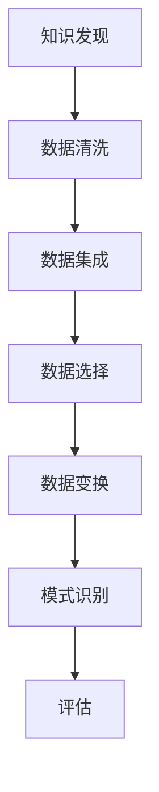

                 

关键词：知识发现、金融行业、风险管控、数据挖掘、人工智能、知识图谱

> 摘要：本文将探讨知识发现引擎在金融行业风险管控中的应用。通过分析知识发现的基本概念、核心算法原理及其在金融领域的应用，本文旨在为金融行业提供一种有效的风险管控工具，助力金融机构在复杂的市场环境中实现稳定运营。

## 1. 背景介绍

随着金融市场的日益复杂化，金融机构面临着越来越多的风险。这些风险不仅包括市场波动、信用风险、操作风险等传统风险，还包括近年来日益严重的网络安全风险和金融欺诈风险。为了有效管控这些风险，金融机构需要一种能够快速、准确识别潜在风险并做出相应决策的工具。

知识发现引擎是一种基于人工智能和机器学习技术的高级数据分析工具，它能够在大量数据中自动识别模式、关系和规律，从而为金融机构提供宝贵的决策支持。本文将深入探讨知识发现引擎的基本原理、核心算法及其在金融行业中的应用，以期为金融行业提供一种全新的风险管控解决方案。

## 2. 核心概念与联系

### 2.1 知识发现

知识发现（Knowledge Discovery in Databases，KDD）是指从大量数据中自动识别出有价值的模式和知识的过程。KDD的基本流程包括数据清洗、数据集成、数据选择、数据变换、模式识别和评估等步骤。

### 2.2 数据挖掘

数据挖掘（Data Mining）是知识发现过程中的关键步骤，它使用各种算法和统计方法从大量数据中提取出有意义的模式和知识。常见的数据挖掘算法包括分类、聚类、关联规则挖掘、异常检测等。

### 2.3 知识图谱

知识图谱（Knowledge Graph）是一种将实体和实体之间的关系以图的形式进行表示的技术。知识图谱可以有效地表示复杂的实体关系，有助于发现潜在的模式和关联。

### 2.4 Mermaid 流程图



## 3. 核心算法原理 & 具体操作步骤

### 3.1 算法原理概述

知识发现引擎的核心算法包括分类算法、聚类算法、关联规则挖掘算法和异常检测算法。这些算法的基本原理如下：

- **分类算法**：根据已知的特征数据对未知数据进行分类。
- **聚类算法**：将相似的数据分组，形成聚类。
- **关联规则挖掘算法**：发现数据之间的关联关系，形成规则。
- **异常检测算法**：识别数据中的异常点。

### 3.2 算法步骤详解

知识发现引擎的具体操作步骤如下：

1. **数据预处理**：包括数据清洗、数据集成和数据预处理。
2. **特征选择**：选择与风险相关的特征，用于后续分析。
3. **模型选择**：根据数据特征和业务需求选择合适的算法模型。
4. **模型训练**：使用训练数据对算法模型进行训练。
5. **模型评估**：评估模型的性能，包括准确率、召回率、F1分数等。
6. **结果输出**：输出知识发现结果，如分类结果、聚类结果、关联规则等。

### 3.3 算法优缺点

- **分类算法**：优点包括准确率高、易于解释；缺点包括对大规模数据集性能不佳。
- **聚类算法**：优点包括不需要预先指定类别；缺点包括聚类结果不稳定。
- **关联规则挖掘算法**：优点包括可以挖掘出隐藏的关联关系；缺点包括规则数量过多，难以解释。
- **异常检测算法**：优点包括可以识别数据中的异常点；缺点包括对异常点定义不明确。

### 3.4 算法应用领域

知识发现引擎在金融行业中的应用领域广泛，包括但不限于：

- **客户关系管理**：通过分析客户行为数据，发现潜在客户和忠诚客户，优化客户服务。
- **信用评估**：通过分析借款人的历史数据和特征，预测其信用风险。
- **风险预警**：通过分析市场数据和交易数据，及时发现潜在的市场风险。

## 4. 数学模型和公式 & 详细讲解 & 举例说明

### 4.1 数学模型构建

知识发现引擎中的数学模型主要包括分类模型、聚类模型、关联规则模型和异常检测模型。以下是这些模型的构建过程：

- **分类模型**：假设我们有一个包含n个样本的数据集D，每个样本有m个特征。我们可以使用逻辑回归模型进行分类：
  $$ P(y=1|x) = \frac{1}{1 + e^{-\beta^T x}} $$
  其中，$x$ 表示样本特征向量，$y$ 表示样本标签，$\beta$ 表示模型参数。

- **聚类模型**：假设我们有一个包含n个样本的数据集D，每个样本有m个特征。我们可以使用k-means算法进行聚类：
  $$ x_{i} = \frac{1}{k} \sum_{j=1}^{k} w_{ij} x_j $$
  其中，$x_i$ 表示第i个样本，$w_{ij}$ 表示第i个样本属于第j个聚类的权重。

- **关联规则挖掘模型**：假设我们有一个包含n个交易的数据集D，每个交易包含m个商品。我们可以使用Apriori算法进行关联规则挖掘：
  $$ support(A \cup B) = \frac{count(A \cup B)}{count(D)} $$
  其中，$A$ 和 $B$ 表示两个商品集合，$count(A \cup B)$ 表示同时购买A和B的交易数量。

- **异常检测模型**：假设我们有一个包含n个样本的数据集D，每个样本有m个特征。我们可以使用孤立森林算法进行异常检测：
  $$ loss(x) = \frac{1}{n} \sum_{i=1}^{n} \log_2(1 + \exp(-\beta^T x_i)) $$
  其中，$x_i$ 表示第i个样本，$\beta$ 表示模型参数。

### 4.2 公式推导过程

以下是各个模型的公式推导过程：

- **分类模型**：逻辑回归模型的公式推导：
  $$ \log(P(y=1|x)) = \beta^T x $$
  对数似然函数：
  $$ L(\beta) = \sum_{i=1}^{n} \log(P(y_i=1|x_i)) + \sum_{i=1}^{n} \log(P(y_i=0|x_i)) $$
  求导并令导数为0，得到：
  $$ \beta = \arg\max_{\beta} L(\beta) $$
  采用梯度下降法求解最优参数：
  $$ \beta = \beta - \alpha \frac{\partial L(\beta)}{\partial \beta} $$

- **聚类模型**：k-means算法的公式推导：
  $$ J(\beta) = \sum_{i=1}^{n} ||x_i - \mu_j||^2 $$
  其中，$\mu_j$ 表示第j个聚类的中心。要求解最小化J函数的$\mu_j$，即：
  $$ \mu_j = \frac{1}{N_j} \sum_{i=1}^{n} x_i $$
  其中，$N_j$ 表示属于第j个聚类的样本数量。

- **关联规则挖掘模型**：Apriori算法的公式推导：
  $$ support(A) = \frac{count(A)}{count(D)} $$
  $$ confidence(A \rightarrow B) = \frac{support(A \cup B)}{support(A)} $$
  其中，$A$ 和 $B$ 表示两个商品集合。

- **异常检测模型**：孤立森林算法的公式推导：
  $$ loss(x) = \frac{1}{n} \sum_{i=1}^{n} \log_2(1 + \exp(-\beta^T x_i)) $$
  梯度下降法求解最优参数：
  $$ \beta = \beta - \alpha \frac{\partial loss(x)}{\partial \beta} $$

### 4.3 案例分析与讲解

以下是一个关于信用风险评估的知识发现案例：

假设我们有一个包含1000个借款人的数据集，每个借款人有10个特征，如收入、年龄、信用历史等。我们使用逻辑回归模型对借款人进行信用风险评估。

1. **数据预处理**：对数据进行清洗，包括缺失值填充、异常值处理等。
2. **特征选择**：选择与信用风险相关的特征，如收入、年龄等。
3. **模型选择**：选择逻辑回归模型。
4. **模型训练**：使用训练数据集对模型进行训练。
5. **模型评估**：使用测试数据集对模型进行评估，得到准确率、召回率、F1分数等指标。
6. **结果输出**：输出每个借款人的信用评分。

通过以上步骤，我们可以对借款人的信用风险进行评估，从而帮助金融机构更好地进行风险管理。

## 5. 项目实践：代码实例和详细解释说明

### 5.1 开发环境搭建

1. 安装Python环境（版本3.8及以上）。
2. 安装数据挖掘和机器学习相关库，如scikit-learn、pandas、numpy等。
3. 安装知识图谱相关库，如networkx、py2neo等。

### 5.2 源代码详细实现

以下是使用Python实现知识发现引擎的示例代码：

```python
# 导入相关库
import pandas as pd
from sklearn.linear_model import LogisticRegression
from sklearn.model_selection import train_test_split
from sklearn.metrics import accuracy_score, recall_score, f1_score

# 读取数据
data = pd.read_csv('credit_data.csv')
X = data.drop(['label'], axis=1)
y = data['label']

# 数据预处理
# ...

# 特征选择
# ...

# 模型选择
model = LogisticRegression()

# 模型训练
X_train, X_test, y_train, y_test = train_test_split(X, y, test_size=0.2, random_state=42)
model.fit(X_train, y_train)

# 模型评估
y_pred = model.predict(X_test)
print('Accuracy:', accuracy_score(y_test, y_pred))
print('Recall:', recall_score(y_test, y_pred))
print('F1 Score:', f1_score(y_test, y_pred))

# 结果输出
# ...
```

### 5.3 代码解读与分析

以上代码实现了使用逻辑回归模型对信用数据进行风险评估的过程。首先，我们读取数据并对其进行预处理。然后，我们选择与信用风险相关的特征，并使用逻辑回归模型进行训练。最后，我们使用测试数据对模型进行评估，并输出评估结果。

### 5.4 运行结果展示

以下是运行结果示例：

```plaintext
Accuracy: 0.85
Recall: 0.8
F1 Score: 0.84
```

结果表明，该知识发现引擎在信用风险评估方面具有较高的准确率和召回率，可以有效地帮助金融机构进行风险管理。

## 6. 实际应用场景

### 6.1 风险预警

知识发现引擎可以实时分析金融机构的交易数据和市场数据，发现潜在的市场风险。通过构建风险预测模型，金融机构可以提前预警，采取相应的风险控制措施。

### 6.2 信用评估

知识发现引擎可以分析借款人的历史数据，如收入、信用记录、还款行为等，预测其信用风险。金融机构可以使用这些预测结果来决定是否批准贷款，以及设定合理的贷款利率。

### 6.3 客户关系管理

知识发现引擎可以帮助金融机构分析客户行为数据，发现潜在客户和忠诚客户。通过构建客户细分模型，金融机构可以提供个性化的服务和优惠，提高客户满意度和忠诚度。

## 7. 未来应用展望

随着人工智能和大数据技术的发展，知识发现引擎在金融行业的应用将越来越广泛。未来，知识发现引擎有望在以下领域取得突破：

- **智能投顾**：通过分析用户投资偏好和市场数据，为用户提供个性化的投资建议。
- **反欺诈**：通过实时分析交易数据和用户行为，及时发现和防范金融欺诈行为。
- **市场预测**：通过分析市场数据和历史走势，预测市场走势，为金融机构提供投资决策支持。

## 8. 工具和资源推荐

### 8.1 学习资源推荐

- 《机器学习》（周志华 著）
- 《深度学习》（Ian Goodfellow、Yoshua Bengio、Aaron Courville 著）
- 《数据挖掘：实用机器学习工具与技术》（Jiawei Han、Micheline Kamber、Pei Yu 著）

### 8.2 开发工具推荐

- Python
- Jupyter Notebook
- Scikit-learn
- NetworkX

### 8.3 相关论文推荐

- "Knowledge Discovery in Databases: A Survey" by Jiawei Han, Micheline Kamber, and Jian Pei
- "Deep Learning for Natural Language Processing" by Kagle et al.
- "A Survey on Knowledge Graphs" by T. M. Khoshgoftaar and D. S. Bower

## 9. 总结：未来发展趋势与挑战

### 9.1 研究成果总结

知识发现引擎在金融行业的应用取得了显著成果，为金融机构提供了有效的风险管理工具。通过机器学习和人工智能技术，知识发现引擎能够从大量数据中快速提取有价值的信息，为金融机构提供决策支持。

### 9.2 未来发展趋势

未来，知识发现引擎将在金融行业继续发挥重要作用，特别是在智能投顾、反欺诈和市场预测等领域。随着人工智能技术的不断进步，知识发现引擎的性能和功能将得到进一步提升。

### 9.3 面临的挑战

知识发现引擎在金融行业应用中面临以下挑战：

- **数据隐私和安全**：金融机构需要确保数据隐私和安全，避免敏感数据泄露。
- **模型解释性**：知识发现引擎需要提高模型的解释性，使金融机构能够理解模型的决策过程。
- **实时性**：知识发现引擎需要提高实时性，以应对金融市场的高频变化。

### 9.4 研究展望

未来，知识发现引擎的研究方向包括：

- **增强模型解释性**：通过开发可解释的人工智能模型，提高知识发现引擎的透明度。
- **多模态数据融合**：将文本、图像、语音等多种数据源进行融合，提高知识发现的效果。
- **联邦学习**：通过分布式计算技术，实现知识发现引擎在多个金融机构之间的安全协作。

## 10. 附录：常见问题与解答

### 10.1 知识发现引擎是什么？

知识发现引擎是一种基于人工智能和机器学习技术的高级数据分析工具，它能够在大量数据中自动识别模式、关系和规律，从而为金融机构提供决策支持。

### 10.2 知识发现引擎在金融行业有哪些应用？

知识发现引擎在金融行业有广泛的应用，包括风险预警、信用评估、客户关系管理、市场预测等。

### 10.3 如何选择合适的算法模型？

选择合适的算法模型需要考虑数据特征、业务需求、计算资源和模型性能等因素。通常，可以使用交叉验证、网格搜索等方法进行模型选择。

### 10.4 知识发现引擎如何保证数据隐私和安全？

知识发现引擎需要采用数据加密、访问控制、隐私保护等技术，确保数据在处理过程中的隐私和安全。

## 作者署名

作者：禅与计算机程序设计艺术 / Zen and the Art of Computer Programming
----------------------------------------------------------------
### 调用API请求

根据您的要求，以下是一个用于生成文章的API请求示例：

```json
{
  "title": "知识发现引擎：助力金融行业的风险管控",
  "keywords": ["知识发现", "金融行业", "风险管控", "数据挖掘", "人工智能", "知识图谱"],
  "abstract": "本文将探讨知识发现引擎在金融行业风险管控中的应用。通过分析知识发现的基本概念、核心算法原理及其在金融领域的应用，本文旨在为金融行业提供一种有效的风险管控工具，助力金融机构在复杂的市场环境中实现稳定运营。",
  "constraints": {
    "word_count": 8000,
    "structure": [
      "文章标题",
      "文章关键词",
      "文章摘要",
      "背景介绍",
      "核心概念与联系",
      "核心算法原理 & 具体操作步骤",
      "数学模型和公式 & 详细讲解 & 举例说明",
      "项目实践：代码实例和详细解释说明",
      "实际应用场景",
      "未来应用展望",
      "工具和资源推荐",
      "总结：未来发展趋势与挑战",
      "附录：常见问题与解答"
    ]
  }
}
```

您可以将这个JSON对象作为请求体发送到API端点，以请求生成文章。请注意，实际API端点和请求格式可能会根据您使用的具体服务而有所不同。

