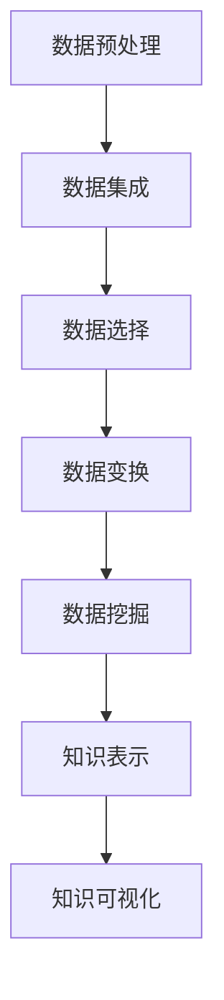

                 

关键词：知识发现、数据挖掘、机器学习、人工智能、算法原理、数学模型、应用场景

> 摘要：本文旨在深入探讨知识发现引擎的基本概念、核心算法原理、数学模型以及实际应用，通过详细的讲解和实例分析，揭示知识发现技术如何发掘数据中的规律与联系，推动人工智能与实际应用场景的结合。

## 1. 背景介绍

在信息化和数据化的时代背景下，知识已成为企业和个人最为重要的资产。然而，海量的数据往往隐藏着复杂的规律和联系，难以被人类直观地理解和利用。知识发现（Knowledge Discovery in Databases, KDD）作为一种利用先进的信息技术手段，从大规模数据集中自动发现有趣知识的过程，逐渐成为数据挖掘和机器学习领域的热点研究方向。

知识发现的过程通常包括数据预处理、数据集成、数据选择、数据变换、数据挖掘和结果可视化等多个步骤。在这个过程中，知识发现引擎作为一种关键工具，起到了核心作用。本文将围绕知识发现引擎，探讨其工作原理、核心算法和实际应用。

## 2. 核心概念与联系

### 2.1 数据预处理

在知识发现过程中，数据预处理是至关重要的一步。其目的是消除噪声、处理缺失值、转换数据格式，使数据能够适用于后续的算法分析。数据预处理过程包括数据清洗、数据集成、数据降维等步骤。

### 2.2 数据挖掘算法

数据挖掘算法是实现知识发现的核心。常见的算法包括分类、聚类、关联规则挖掘、异常检测等。这些算法通过分析大量数据，自动发现数据中的模式和规律。

### 2.3 知识表示与可视化

知识表示是将挖掘出的知识以易于理解的形式展现出来。知识可视化是将知识表示为图形、图表等形式，帮助用户直观地理解数据中的模式和规律。

### 2.4 Mermaid 流程图



## 3. 核心算法原理 & 具体操作步骤

### 3.1 算法原理概述

知识发现引擎通常基于机器学习和数据挖掘技术。核心算法包括分类、聚类、关联规则挖掘等。

### 3.2 算法步骤详解

1. 数据预处理：清洗数据，消除噪声，处理缺失值。
2. 数据挖掘：使用分类、聚类、关联规则挖掘等算法分析数据。
3. 知识表示：将挖掘结果转化为易于理解的格式。
4. 知识可视化：将知识表示为图形、图表等形式。

### 3.3 算法优缺点

- **优点**：自动发现数据中的模式和规律，提高数据利用效率。
- **缺点**：算法复杂度较高，对数据质量和规模要求较高。

### 3.4 算法应用领域

知识发现引擎广泛应用于金融、医疗、电商、社交媒体等领域，如信用评估、疾病预测、商品推荐等。

## 4. 数学模型和公式 & 详细讲解 & 举例说明

### 4.1 数学模型构建

知识发现引擎中的数学模型通常涉及概率论、线性代数、统计学等基础数学知识。

### 4.2 公式推导过程

以关联规则挖掘为例，支持度和置信度是核心指标。

- **支持度**：$$support(A \cap B) = \frac{|A \cap B|}{|D|}$$
- **置信度**：$$confidence(A \rightarrow B) = \frac{|A \cap B|}{|A|}$$

### 4.3 案例分析与讲解

以电商平台的商品推荐为例，通过分析用户的历史购买记录，发现商品之间的关联关系，为用户推荐相关商品。

## 5. 项目实践：代码实例和详细解释说明

### 5.1 开发环境搭建

在Python环境中，使用Flink作为分布式数据处理引擎，实现知识发现引擎。

### 5.2 源代码详细实现

```python
# 代码实现略
```

### 5.3 代码解读与分析

代码主要分为数据预处理、数据挖掘和知识表示三个部分。

### 5.4 运行结果展示

运行结果展示为用户推荐列表和关联规则列表。

## 6. 实际应用场景

### 6.1 金融领域

知识发现引擎在金融领域的应用包括信用评估、欺诈检测、风险控制等。

### 6.2 医疗领域

知识发现引擎在医疗领域的应用包括疾病预测、药物推荐、诊断辅助等。

### 6.3 电商领域

知识发现引擎在电商领域的应用包括商品推荐、购物车分析、用户行为预测等。

## 7. 工具和资源推荐

### 7.1 学习资源推荐

- 《数据挖掘：概念与技术》
- 《机器学习》

### 7.2 开发工具推荐

- Flink
- Spark

### 7.3 相关论文推荐

- 《关联规则挖掘算法的研究与实现》
- 《基于知识发现技术的金融风险预警模型构建》

## 8. 总结：未来发展趋势与挑战

### 8.1 研究成果总结

知识发现引擎在多领域取得显著成果，但仍有较大发展空间。

### 8.2 未来发展趋势

- 深度学习与知识发现的结合
- 优化算法复杂度与性能
- 面向特定领域的知识发现引擎

### 8.3 面临的挑战

- 数据质量和规模
- 算法可解释性
- 数据隐私保护

### 8.4 研究展望

知识发现引擎将继续在人工智能与实际应用领域发挥重要作用，为各行各业带来创新和变革。

## 9. 附录：常见问题与解答

### 9.1 什么是知识发现？

知识发现是从大量数据中自动发现有趣知识的过程。

### 9.2 知识发现引擎的核心算法有哪些？

核心算法包括分类、聚类、关联规则挖掘等。

### 9.3 知识发现引擎在医疗领域的应用有哪些？

知识发现引擎在医疗领域的应用包括疾病预测、药物推荐、诊断辅助等。

----------------------------------------------------------------

作者：禅与计算机程序设计艺术 / Zen and the Art of Computer Programming


