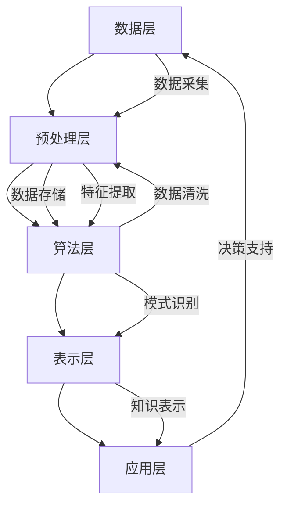

                 

 关键词：知识发现引擎、大数据、人工智能、知识图谱、深度学习、智能推荐、智能决策、数据挖掘

> 摘要：本文探讨了知识发现引擎在现代信息技术中的重要地位，分析了其核心概念、架构设计、算法原理以及数学模型。通过具体项目和案例，本文深入阐述了知识发现引擎在实际应用中的操作步骤、效果和前景，为推动人类知识的新时代发展提供了有力支持。

## 1. 背景介绍

随着互联网的迅猛发展，人类生产和生活过程中产生的数据量呈现出爆炸式增长。大数据技术的出现，为海量数据的存储、处理和分析提供了强有力的工具。然而，面对如此庞大的数据量，如何从中挖掘出有价值的信息，实现数据的深度利用，成为了当前信息技术领域的重要挑战。知识发现引擎作为一种新兴的技术，应运而生，旨在通过智能化的方法，从大规模数据中发现潜在的知识模式，为人类提供更高效、更精准的信息服务。

知识发现引擎的概念最早由美国科学家Dr. J. Han和Dr. J. Pei在2004年提出，其主要目标是利用人工智能、机器学习和数据挖掘等技术，实现数据的自动分析和知识发现。知识发现引擎的核心功能包括数据预处理、特征提取、模式识别和知识表示等。通过这些功能，知识发现引擎能够从海量的数据中提取出有价值的信息，为决策支持、智能推荐、风险控制等领域提供支持。

知识发现引擎的出现，不仅改变了传统的数据处理方式，也为人类的知识积累和创新提供了新的动力。随着技术的不断进步，知识发现引擎在各个领域得到了广泛应用，如金融、医疗、教育、电商等，取得了显著的成效。本文将围绕知识发现引擎的核心概念、架构设计、算法原理、数学模型、实际应用和未来展望等方面进行深入探讨，旨在为读者提供一幅完整的知识发现引擎全景图。

## 2. 核心概念与联系

### 2.1 知识发现引擎的概念

知识发现引擎（Knowledge Discovery Engine，KDE）是一种基于大数据和人工智能技术的智能系统，其核心目的是从海量数据中自动发现潜在的模式、规律和知识。知识发现引擎的主要功能包括数据预处理、特征提取、模式识别、知识表示和推理等。与传统的大数据处理技术相比，知识发现引擎更加注重对数据的深度理解和智能分析，从而实现数据价值的最大化。

### 2.2 知识发现引擎的架构

知识发现引擎的架构可以分为以下几个层次：

1. **数据层**：包括数据采集、数据存储和数据清洗等模块。数据采集主要负责从各种数据源获取数据，数据存储则负责将数据存储到数据仓库或数据库中，数据清洗则是对采集到的数据进行去噪、去重、格式转换等预处理操作。

2. **预处理层**：对原始数据进行特征提取、降维、数据变换等操作，以提高数据质量和数据利用率。

3. **算法层**：包括聚类、分类、回归、关联规则挖掘、异常检测等多种数据挖掘算法。这些算法用于发现数据中的潜在模式和知识。

4. **表示层**：将挖掘出的知识表示为各种形式，如知识图谱、表格、报告等，以便于用户理解和应用。

5. **应用层**：根据具体业务需求，将知识发现引擎应用于决策支持、智能推荐、风险控制、个性化服务等领域。

### 2.3 知识发现引擎的核心概念

1. **数据挖掘**：数据挖掘是从大量数据中提取有价值信息的过程，包括关联分析、聚类、分类、异常检测等。

2. **特征提取**：特征提取是将原始数据转换为更适合进行数据挖掘的形式，以提高数据挖掘的效果。

3. **模式识别**：模式识别是数据挖掘的一个重要分支，旨在发现数据中的规律和模式。

4. **知识表示**：知识表示是将挖掘出的知识以各种形式呈现给用户，以便于理解和应用。

5. **推理引擎**：推理引擎用于基于已知知识和规则进行推理，以发现新的知识。

### 2.4 知识发现引擎与相关技术的联系

1. **大数据技术**：知识发现引擎依赖于大数据技术进行数据存储、处理和分析。

2. **人工智能技术**：人工智能技术为知识发现引擎提供了强大的计算能力和智能分析能力。

3. **机器学习技术**：机器学习技术是知识发现引擎的核心算法，用于实现数据挖掘和模式识别。

4. **知识图谱**：知识图谱是知识发现引擎的一种重要表示形式，用于表示和存储知识。

5. **深度学习技术**：深度学习技术为知识发现引擎提供了更强大的特征提取和模式识别能力。

### 2.5 Mermaid 流程图

下面是一个简单的Mermaid流程图，展示了知识发现引擎的核心组件和流程：



## 3. 核心算法原理 & 具体操作步骤

### 3.1 算法原理概述

知识发现引擎的核心算法主要包括聚类、分类、回归、关联规则挖掘和异常检测等。这些算法的基本原理如下：

1. **聚类**：将数据集划分为若干个类别，使得同一个类别的数据点之间相似度较高，不同类别的数据点之间相似度较低。常用的聚类算法有K-means、层次聚类等。

2. **分类**：根据已有的数据集，将新的数据点分类到不同的类别中。常用的分类算法有决策树、支持向量机、神经网络等。

3. **回归**：预测一个或多个变量与另一个变量之间的关系。常用的回归算法有线性回归、多项式回归、神经网络回归等。

4. **关联规则挖掘**：发现数据集中不同变量之间的关联关系。常用的算法有Apriori算法、FP-growth算法等。

5. **异常检测**：识别数据集中的异常值或异常模式。常用的算法有基于统计的方法、基于聚类的方法、基于邻近度的方法等。

### 3.2 算法步骤详解

下面以K-means聚类算法为例，详细解释其操作步骤：

1. **初始化**：随机选择K个数据点作为初始聚类中心。

2. **分配数据点**：将每个数据点分配到与其最近的聚类中心所在的类别中。

3. **更新聚类中心**：计算每个类别中所有数据点的平均值，作为新的聚类中心。

4. **迭代**：重复步骤2和步骤3，直到聚类中心不再发生变化，或者达到预设的迭代次数。

5. **评估**：计算聚类效果，常用的评估指标有轮廓系数、内切球半径等。

### 3.3 算法优缺点

1. **聚类算法**：
   - 优点：简单高效，易于实现。
   - 缺点：对初始聚类中心的敏感度较高，可能陷入局部最优解。

2. **分类算法**：
   - 优点：准确性较高，适用于分类任务。
   - 缺点：训练过程较复杂，对大量样本数据的需求较高。

3. **回归算法**：
   - 优点：可以预测连续变量的值。
   - 缺点：对异常值敏感，可能产生过拟合。

4. **关联规则挖掘算法**：
   - 优点：可以挖掘数据中的隐藏关联关系。
   - 缺点：计算复杂度较高，对稀疏数据的处理能力有限。

5. **异常检测算法**：
   - 优点：可以识别数据中的异常值或异常模式。
   - 缺点：对噪声数据的敏感度较高，可能误判。

### 3.4 算法应用领域

知识发现引擎的算法广泛应用于各个领域：

1. **金融领域**：用于风险控制、信用评分、投资决策等。

2. **医疗领域**：用于疾病诊断、治疗方案推荐、医疗数据挖掘等。

3. **教育领域**：用于个性化教学、学习评估、教育资源优化等。

4. **电商领域**：用于推荐系统、用户行为分析、销售预测等。

5. **智能制造领域**：用于故障预测、生产优化、质量检测等。

## 4. 数学模型和公式 & 详细讲解 & 举例说明

### 4.1 数学模型构建

知识发现引擎中的数学模型主要用于描述数据挖掘过程中的各种关系和计算方法。以下是一些常见的数学模型：

1. **K-means聚类模型**：
   $$ \text{目标函数} = \sum_{i=1}^{k} \sum_{x \in S_i} \| x - \mu_i \|^2 $$
   其中，$k$ 为聚类个数，$S_i$ 为第 $i$ 个聚类类别，$\mu_i$ 为聚类中心。

2. **线性回归模型**：
   $$ y = \beta_0 + \beta_1x_1 + \beta_2x_2 + \cdots + \beta_nx_n $$
   其中，$y$ 为因变量，$x_1, x_2, \cdots, x_n$ 为自变量，$\beta_0, \beta_1, \beta_2, \cdots, \beta_n$ 为回归系数。

3. **支持向量机模型**：
   $$ \text{目标函数} = \frac{1}{2} \| \omega \|^2 - C \sum_{i=1}^{n} \xi_i $$
   其中，$\omega$ 为法向量，$\xi_i$ 为松弛变量，$C$ 为惩罚参数。

4. **关联规则挖掘模型**：
   $$ \text{支持度} = \frac{\text{满足条件的交易次数}}{\text{总交易次数}} $$
   $$ \text{置信度} = \frac{\text{满足条件的交易次数}}{\text{总交易次数}} $$
   其中，支持度和置信度分别为关联规则的重要指标。

### 4.2 公式推导过程

以线性回归模型为例，详细讲解公式的推导过程：

1. **最小二乘法**：
   线性回归模型的目标是最小化误差平方和，即：
   $$ \text{目标函数} = \sum_{i=1}^{n} (y_i - \hat{y}_i)^2 $$
   其中，$y_i$ 为实际观测值，$\hat{y}_i$ 为预测值。

2. **求导**：
   对目标函数关于回归系数 $\beta_1, \beta_2, \cdots, \beta_n$ 求导，得到偏导数为0的条件：
   $$ \frac{\partial}{\partial \beta_j} \text{目标函数} = -2 \sum_{i=1}^{n} (y_i - \hat{y}_i) x_{ij} = 0 $$
   其中，$x_{ij}$ 为第 $i$ 个样本在第 $j$ 个特征上的取值。

3. **解方程组**：
   将上述偏导数方程组化简，得到正规方程：
   $$ X'X\beta = X'y $$
   其中，$X$ 为自变量矩阵，$y$ 为因变量向量。

4. **求解回归系数**：
   解上述方程组，得到回归系数 $\beta$ 的估计值。

### 4.3 案例分析与讲解

以某电商平台用户行为数据为例，分析用户购买行为与产品推荐之间的关系。

1. **数据集准备**：
   - 用户ID：每个用户的唯一标识。
   - 产品ID：每个产品的唯一标识。
   - 购买时间：用户购买产品的日期。
   - 产品类别：产品的分类标签。

2. **特征工程**：
   - 构建用户行为特征：如最近30天购买次数、最近30天购买金额、购买产品类别分布等。
   - 构建产品特征：如产品销量、产品评价分数、产品类别等。

3. **数据预处理**：
   - 数据清洗：去除重复数据和缺失值。
   - 数据标准化：对数值型特征进行归一化处理。

4. **模型训练**：
   - 选择线性回归模型进行训练。
   - 训练过程：使用训练集进行模型训练，得到回归系数。

5. **模型评估**：
   - 使用测试集对模型进行评估，计算预测误差。

6. **结果分析**：
   - 分析用户购买行为与产品推荐之间的关系。
   - 优化推荐策略，提高推荐准确性。

## 5. 项目实践：代码实例和详细解释说明

### 5.1 开发环境搭建

1. **Python环境**：
   - 安装Python 3.8及以上版本。
   - 安装常用库：NumPy、Pandas、Scikit-learn、Matplotlib等。

2. **Jupyter Notebook**：
   - 安装Jupyter Notebook。
   - 启动Jupyter Notebook，创建一个新的笔记本。

### 5.2 源代码详细实现

以下是一个简单的用户行为数据分析的示例代码：

```python
import numpy as np
import pandas as pd
from sklearn.linear_model import LinearRegression
import matplotlib.pyplot as plt

# 读取数据
data = pd.read_csv('user_behavior_data.csv')

# 数据预处理
data['days_since_last_purchase'] = (pd.to_datetime('now') - pd.to_datetime(data['purchase_time'])).dt.days
data = data[['user_id', 'product_id', 'days_since_last_purchase', 'product_category']]

# 构建特征
data['avg_days_since_last_purchase'] = data.groupby('user_id')['days_since_last_purchase'].mean()
data['num_categories'] = data.groupby('user_id')['product_category'].nunique()

# 模型训练
X = data[['avg_days_since_last_purchase', 'num_categories']]
y = data['purchase_count']
model = LinearRegression()
model.fit(X, y)

# 模型评估
score = model.score(X, y)
print(f'Model R^2 score: {score}')

# 预测
new_user_data = pd.DataFrame({'avg_days_since_last_purchase': [10], 'num_categories': [3]})
new_user_prediction = model.predict(new_user_data)
print(f'Predicted purchase count: {new_user_prediction[0]}')

# 可视化
plt.scatter(data['avg_days_since_last_purchase'], data['purchase_count'])
plt.plot(new_user_data['avg_days_since_last_purchase'], new_user_prediction, 'ro')
plt.xlabel('Average Days Since Last Purchase')
plt.ylabel('Purchase Count')
plt.show()
```

### 5.3 代码解读与分析

1. **数据读取与预处理**：
   - 读取用户行为数据，处理时间序列数据，计算用户最近一次购买时间与当前时间的天数差。

2. **特征构建**：
   - 构建用户平均购买天数和购买产品类别数量等特征。

3. **模型训练**：
   - 使用线性回归模型对用户购买行为进行建模。

4. **模型评估**：
   - 计算模型的决定系数（R^2），评估模型效果。

5. **预测与可视化**：
   - 对新用户进行购买行为预测，并绘制散点图，展示预测结果。

## 6. 实际应用场景

### 6.1 金融领域

在金融领域，知识发现引擎被广泛应用于风险控制、信用评分、投资决策等方面。例如，通过分析用户的消费行为、还款记录等数据，银行可以利用知识发现引擎评估用户的信用风险，为贷款审批提供依据。同时，投资机构可以利用知识发现引擎分析市场趋势，优化投资组合，提高投资收益。

### 6.2 医疗领域

在医疗领域，知识发现引擎可以帮助医生进行疾病诊断、治疗方案推荐等。例如，通过对患者病史、体检数据、实验室检查结果等进行分析，知识发现引擎可以发现患者之间的相似性和差异性，为医生提供诊断建议。此外，知识发现引擎还可以用于医疗数据的挖掘，发现新的疾病关联和治疗方案，提高医疗水平。

### 6.3 教育领域

在教育领域，知识发现引擎可以用于个性化教学、学习评估、教育资源优化等方面。例如，通过对学生的学习行为、考试成绩等进行分析，知识发现引擎可以为教师提供个性化教学建议，提高教学效果。同时，知识发现引擎还可以用于评估学生的学习效果，优化教育资源分配，提高教育质量。

### 6.4 电商领域

在电商领域，知识发现引擎被广泛应用于推荐系统、用户行为分析、销售预测等方面。例如，通过对用户的历史购买记录、浏览记录等进行分析，知识发现引擎可以推荐用户可能感兴趣的商品，提高用户满意度。同时，知识发现引擎还可以用于分析用户行为，预测销售趋势，优化库存管理，提高销售业绩。

## 7. 工具和资源推荐

### 7.1 学习资源推荐

1. **书籍**：
   - 《大数据之路：阿里巴巴大数据实践》
   - 《深度学习》
   - 《Python数据科学手册》

2. **在线课程**：
   - Coursera上的《机器学习》
   - edX上的《数据挖掘基础》

### 7.2 开发工具推荐

1. **编程环境**：
   - Jupyter Notebook
   - PyCharm

2. **数据可视化工具**：
   - Matplotlib
   - Seaborn

3. **大数据处理工具**：
   - Hadoop
   - Spark

### 7.3 相关论文推荐

1. **知识发现引擎**：
   - "Knowledge Discovery from Data" by J. Han and M. Kamber
   - "A Survey of Data Mining in Finance" by S. B. Kotsiantis and D. Kanellos

2. **数据挖掘算法**：
   - "Clustering Algorithms in Data Mining: A Review" by A. K. Singh et al.
   - "Support Vector Machines for Classification and Regression" by N. Cristianini and J. Shawe-Taylor

## 8. 总结：未来发展趋势与挑战

### 8.1 研究成果总结

知识发现引擎作为一种重要的信息技术，已经在金融、医疗、教育、电商等领域取得了显著成果。通过大数据和人工智能技术的结合，知识发现引擎实现了对海量数据的深度挖掘和智能分析，为决策支持、智能推荐、风险控制等领域提供了有力支持。研究成果表明，知识发现引擎在提高数据利用效率、优化业务流程、提升服务质量等方面具有巨大的潜力。

### 8.2 未来发展趋势

1. **算法创新**：随着人工智能技术的不断发展，知识发现引擎的算法将更加智能化、自适应化，能够更好地应对复杂多变的业务场景。

2. **多模态数据处理**：知识发现引擎将逐步扩展到多模态数据（如文本、图像、音频等）的处理，实现跨模态的知识发现。

3. **边缘计算与云计算**：知识发现引擎将逐步实现边缘计算与云计算的融合，提高数据处理效率和实时性。

4. **自适应优化**：知识发现引擎将具备自适应优化能力，能够根据业务需求和数据特点，动态调整算法和参数。

### 8.3 面临的挑战

1. **数据隐私与安全**：知识发现引擎在处理海量数据时，需要确保数据隐私和安全，避免数据泄露和滥用。

2. **算法透明性与可解释性**：随着算法的复杂化，如何保证算法的透明性和可解释性，使业务人员能够理解和信任算法结果，是一个重要挑战。

3. **数据质量**：数据质量对知识发现引擎的效果具有重要影响，如何处理噪声数据、缺失数据等，提高数据质量，是一个亟待解决的问题。

4. **计算资源消耗**：知识发现引擎需要大量的计算资源，如何优化算法，降低计算资源消耗，提高处理效率，是一个重要的挑战。

### 8.4 研究展望

知识发现引擎在未来的发展过程中，需要关注以下几个方面：

1. **跨学科研究**：加强知识发现引擎与经济学、社会学、心理学等学科的交叉研究，提高算法的实用性和可解释性。

2. **开源生态**：推动知识发现引擎的开源，建立良好的开源生态，促进技术共享和创新。

3. **人才培养**：加强知识发现领域的人才培养，提高技术人员的专业水平和创新能力。

4. **标准化与规范化**：制定知识发现引擎的标准化与规范化技术规范，提高算法的可靠性和互操作性。

## 9. 附录：常见问题与解答

### 9.1 知识发现引擎是什么？

知识发现引擎是一种基于大数据和人工智能技术的智能系统，旨在从海量数据中自动发现潜在的模式、规律和知识。

### 9.2 知识发现引擎的核心算法有哪些？

知识发现引擎的核心算法包括聚类、分类、回归、关联规则挖掘和异常检测等。

### 9.3 知识发现引擎在哪些领域有应用？

知识发现引擎在金融、医疗、教育、电商等领域有广泛应用，如风险控制、疾病诊断、个性化教学、推荐系统等。

### 9.4 如何优化知识发现引擎的性能？

优化知识发现引擎的性能可以从以下几个方面入手：算法优化、数据预处理、硬件升级、并行计算等。

### 9.5 知识发现引擎面临的挑战有哪些？

知识发现引擎面临的挑战包括数据隐私与安全、算法透明性与可解释性、数据质量、计算资源消耗等。

### 9.6 知识发现引擎的未来发展趋势是什么？

知识发现引擎的未来发展趋势包括算法创新、多模态数据处理、边缘计算与云计算融合、自适应优化等。

