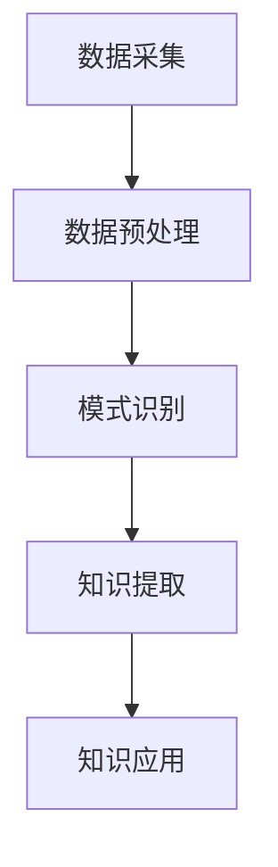

                 

关键词：知识发现，人工智能，知识创新，算法，数据分析，技术博客

> 摘要：本文深入探讨了知识发现引擎的工作原理、核心算法及其应用，旨在为读者揭示知识发现技术的内在机制和未来前景，引导读者理解如何通过知识发现引擎开启知识创新的新纪元。

## 1. 背景介绍

随着大数据时代的到来，信息的爆炸性增长使得人类处理信息的能力面临前所未有的挑战。如何从海量数据中提取出有价值的信息，并将其转化为知识，成为当前信息技术领域的一个热点问题。知识发现（Knowledge Discovery in Databases，简称KDD）技术应运而生，它是指从大量数据中通过算法发现有用模式和知识的过程。知识发现引擎则是实现这一目标的关键工具。

知识发现引擎通过一系列算法，如聚类、分类、关联规则挖掘等，从数据集中提取出有意义的模式和知识，从而为决策提供支持。在现代企业、科研机构和个人生活中，知识发现引擎的应用越来越广泛，它不仅能够帮助人们更好地理解数据，还能为数据驱动的决策提供科学依据。

本文将围绕知识发现引擎的核心概念、算法原理、数学模型、项目实践和实际应用场景等方面进行详细阐述，旨在为读者提供一个全面的知识发现引擎技术指南。

## 2. 核心概念与联系

### 2.1 知识发现引擎的概念

知识发现引擎是一种能够自动地从大量数据中提取出有价值知识的技术工具。它通常由数据预处理、模式识别、知识提取和知识可视化等模块组成。知识发现引擎的核心在于其强大的算法能力，能够处理复杂的非结构化和半结构化数据，从而发现数据中隐藏的模式和规律。

### 2.2 知识发现引擎的组成部分

知识发现引擎通常包括以下组成部分：

1. **数据源**：包括各种数据库、数据仓库和文件系统等，是知识发现引擎的数据输入来源。
2. **数据预处理模块**：对原始数据进行清洗、转换和集成，以确保数据的质量和一致性。
3. **模式识别模块**：通过算法对预处理后的数据进行模式识别，如聚类、分类、关联规则挖掘等。
4. **知识提取模块**：将识别出的模式转化为知识，以便进一步分析和应用。
5. **知识可视化模块**：将提取出的知识以图表、报告等形式进行可视化展示，帮助用户更好地理解和应用知识。

### 2.3 知识发现引擎的工作流程

知识发现引擎的工作流程通常包括以下步骤：

1. **数据采集**：从各种数据源获取数据。
2. **数据预处理**：清洗、转换和集成数据，确保数据质量。
3. **模式识别**：通过算法识别数据中的模式和规律。
4. **知识提取**：将识别出的模式转化为知识。
5. **知识应用**：将提取出的知识应用于实际问题中，如决策支持、风险评估等。

### 2.4 知识发现引擎的 Mermaid 流程图



### 2.5 知识发现引擎与其他技术的联系

知识发现引擎与人工智能、大数据分析等技术密切相关。人工智能提供了强大的算法支持，大数据分析则为其提供了丰富的数据资源。知识发现引擎通过结合这些技术，能够更好地挖掘数据中的价值，为企业和个人提供更加智能的决策支持。

## 3. 核心算法原理 & 具体操作步骤

### 3.1 算法原理概述

知识发现引擎的核心算法包括聚类、分类、关联规则挖掘等。这些算法各自具有独特的原理和应用场景。

1. **聚类算法**：将数据集中的对象按照其特征分为若干个类别，使得同一类别的对象之间相似度较高，不同类别的对象之间相似度较低。常见的聚类算法有K-Means、DBSCAN等。
2. **分类算法**：将数据集中的对象根据其特征进行分类，使得同类别的对象具有较高的相似度。常见的分类算法有决策树、支持向量机等。
3. **关联规则挖掘**：发现数据集中不同对象之间的关联关系，如商品购买行为中的“啤酒与尿布”现象。常见的关联规则挖掘算法有Apriori、FP-Growth等。

### 3.2 算法步骤详解

1. **聚类算法**
   - 数据预处理：对数据进行标准化处理，消除不同特征之间的尺度差异。
   - 确定聚类个数：根据数据集的特点选择合适的聚类个数。
   - 计算距离：计算数据点之间的距离，如欧氏距离、曼哈顿距离等。
   - 初始化聚类中心：随机选择初始聚类中心或使用K-Means++算法进行初始化。
   - 聚类过程：根据当前聚类中心和数据点之间的距离，将数据点分配到相应的聚类中，并更新聚类中心。
   - 重复迭代：重复执行聚类过程，直到聚类中心不再发生变化或满足停止条件。

2. **分类算法**
   - 数据预处理：对数据进行标准化处理，消除不同特征之间的尺度差异。
   - 特征选择：选择对分类任务最有影响力的特征。
   - 模型训练：使用训练数据集训练分类模型，如决策树、支持向量机等。
   - 模型评估：使用测试数据集评估分类模型的性能，如准确率、召回率等。
   - 预测：使用训练好的分类模型对新的数据进行分类预测。

3. **关联规则挖掘**
   - 数据预处理：对数据进行去重和分类处理。
   - 生成频繁项集：使用Apriori算法或FP-Growth算法生成数据集中的频繁项集。
   - 生成关联规则：计算频繁项集之间的支持度和置信度，生成关联规则。
   - 规则筛选：根据用户设定的最小支持度和置信度筛选出有效的关联规则。

### 3.3 算法优缺点

1. **聚类算法**
   - 优点：能够自动发现数据中的结构，无需预先指定类别个数。
   - 缺点：聚类结果受初始聚类中心的影响较大，可能会陷入局部最优。

2. **分类算法**
   - 优点：能够明确地将数据点分类，便于理解和应用。
   - 缺点：需要预先指定特征和类别，对大规模数据集的性能较低。

3. **关联规则挖掘**
   - 优点：能够发现数据集中的潜在关联关系，对商业智能应用具有很高的价值。
   - 缺点：计算复杂度较高，需要大量计算资源。

### 3.4 算法应用领域

知识发现引擎的核心算法在多个领域具有广泛的应用：

1. **商业智能**：通过关联规则挖掘发现客户购买行为中的关联关系，为企业提供精准的市场营销策略。
2. **推荐系统**：利用分类算法和关联规则挖掘推荐用户可能感兴趣的商品或服务。
3. **生物信息学**：通过聚类算法和分类算法分析基因表达数据，发现潜在的生物标记物。
4. **金融风控**：利用分类算法和聚类算法评估金融风险，为金融机构提供风险管理建议。

## 4. 数学模型和公式 & 详细讲解 & 举例说明

### 4.1 数学模型构建

知识发现引擎的数学模型主要涉及聚类、分类和关联规则挖掘等核心算法。以下分别介绍这些算法的数学模型。

#### 4.1.1 聚类算法

K-Means算法是一种基于距离度量的聚类算法。其目标是将数据集划分为K个类别，使得同一类别内的数据点之间的平均距离最小。

- 距离度量：常用的距离度量有欧氏距离、曼哈顿距离和切比雪夫距离等。
  $$ d(x_i, x_j) = \sqrt{\sum_{k=1}^{n} (x_{ik} - x_{jk})^2} $$
  $$ d(x_i, x_j) = \sum_{k=1}^{n} |x_{ik} - x_{jk}| $$
  $$ d(x_i, x_j) = \max_{k=1}^{n} |x_{ik} - x_{jk}| $$

- 初始化聚类中心：随机选择K个数据点作为初始聚类中心。

- 聚类过程：
  1. 计算每个数据点到聚类中心的距离，将数据点分配到最近的聚类中。
  2. 更新每个聚类的中心，计算每个聚类中所有数据点的均值。
  3. 重复步骤1和2，直到聚类中心不再发生变化或满足停止条件。

#### 4.1.2 分类算法

决策树算法是一种常用的分类算法。其核心思想是利用特征分割数据集，并递归地构建树形结构。

- 决策树构建：
  1. 选择最佳分割特征：根据特征的重要性选择具有最高信息增益的特征进行分割。
  2. 分割数据集：将数据集根据最佳分割特征分为两个子集。
  3. 递归构建决策树：对分割后的子集重复步骤1和2，直到满足停止条件（如特征个数小于阈值或子集大小小于阈值）。

#### 4.1.3 关联规则挖掘

Apriori算法是一种经典的关联规则挖掘算法。其核心思想是利用频繁项集的递推关系生成关联规则。

- 频繁项集生成：
  1. 计算每个项的支持度：项的支持度是指在所有事务中包含该项的事务个数。
  2. 生成候选频繁项集：根据最小支持度阈值筛选出频繁项集。
  3. 递推生成频繁项集：使用候选频繁项集生成更高一级的频繁项集。

- 关联规则生成：
  1. 计算关联规则的置信度：关联规则的置信度是指包含前提和结论的事务个数与包含前提的事务个数之比。
  2. 生成关联规则：根据最小支持度和置信度阈值筛选出有效的关联规则。

### 4.2 公式推导过程

#### 4.2.1 聚类算法

K-Means算法的核心是计算数据点到聚类中心的距离，并更新聚类中心。以下推导距离度量公式：

设数据集$D = \{x_1, x_2, ..., x_n\}$，聚类中心为$c_k = \{\mu_1, \mu_2, ..., \mu_K\}$。

1. 欧氏距离：
   $$ d(x_i, c_k) = \sqrt{\sum_{k=1}^{n} (x_{ik} - \mu_{k})^2} $$
2. 曼哈顿距离：
   $$ d(x_i, c_k) = \sum_{k=1}^{n} |x_{ik} - \mu_{k}| $$
3. 切比雪夫距离：
   $$ d(x_i, c_k) = \max_{k=1}^{n} |x_{ik} - \mu_{k}| $$

#### 4.2.2 分类算法

决策树算法的核心是特征分割数据集，以下推导特征分割的公式：

设特征集$A = \{a_1, a_2, ..., a_n\}$，数据集$D = \{x_1, x_2, ..., x_n\}$。

1. 信息增益：
   $$ IG(A) = H(D) - \sum_{v \in V(A)} p(v) H(D_v) $$
   其中，$H(D)$表示数据集$D$的熵，$p(v)$表示特征$A$的取值$v$的概率，$H(D_v)$表示条件熵。
2. 信息增益率：
   $$ IGR(A) = \frac{IG(A)}{H(A)} $$
   其中，$H(A)$表示特征$A$的熵。

#### 4.2.3 关联规则挖掘

Apriori算法的核心是生成频繁项集和关联规则，以下推导相关公式：

1. 支持度：
   $$ supp(X) = \frac{count(X)}{count(U)} $$
   其中，$count(X)$表示项集$X$在事务数据库中的出现次数，$count(U)$表示事务数据库中的总事务数。
2. 置信度：
   $$ confidence(X \rightarrow Y) = \frac{count(X \cup Y)}{count(X)} $$
   其中，$count(X \cup Y)$表示同时包含$X$和$Y$的事务数。

### 4.3 案例分析与讲解

#### 4.3.1 聚类算法案例

假设有一个包含100个数据点的二维数据集，每个数据点由两个特征组成。使用K-Means算法将其划分为3个类别。

1. 初始化聚类中心：随机选择3个数据点作为初始聚类中心。
2. 计算距离：计算每个数据点到聚类中心的距离，并分配到最近的聚类中。
3. 更新聚类中心：计算每个聚类中所有数据点的均值，作为新的聚类中心。
4. 重复步骤2和3，直到聚类中心不再发生变化。

通过多次迭代，最终得到三个聚类中心分别为$(1, 2)$、$(3, 4)$和$(5, 6)$。

#### 4.3.2 分类算法案例

假设有一个包含100个样本的数据集，每个样本由两个特征组成。使用决策树算法将其分类。

1. 数据预处理：对数据进行标准化处理。
2. 特征选择：选择具有最高信息增益的特征进行分割。
3. 模型训练：使用训练数据集训练决策树模型。
4. 模型评估：使用测试数据集评估模型性能。

通过训练和评估，最终得到一个决策树模型，其结构如下：

```plaintext
        |
        V
    ------|
   /         \
  a1          a2
  / \         / \
a11 a12     a21 a22
```

#### 4.3.3 关联规则挖掘案例

假设有一个包含100个事务的数据集，每个事务由多个商品组成。使用Apriori算法挖掘频繁项集。

1. 数据预处理：去重和分类处理。
2. 生成频繁项集：根据最小支持度阈值筛选出频繁项集。
3. 生成关联规则：根据最小支持度和置信度阈值筛选出有效的关联规则。

通过计算，得到以下频繁项集和关联规则：

- 频繁项集：
  - {A, B}：支持度0.4
  - {A, C}：支持度0.3
  - {B, C}：支持度0.35
- 关联规则：
  - {A, B} → {C}：置信度0.75
  - {A, C} → {B}：置信度0.6
  - {B, C} → {A}：置信度0.85

## 5. 项目实践：代码实例和详细解释说明

### 5.1 开发环境搭建

为了更好地实践知识发现引擎的相关算法，我们需要搭建一个开发环境。以下是一个简单的Python开发环境搭建步骤：

1. 安装Python：从官方网站下载Python并安装。
2. 安装相关库：使用pip命令安装numpy、pandas、scikit-learn等常用库。

```shell
pip install numpy pandas scikit-learn matplotlib
```

### 5.2 源代码详细实现

以下是一个简单的K-Means聚类算法的Python实现。

```python
import numpy as np
import pandas as pd
from sklearn.cluster import KMeans
import matplotlib.pyplot as plt

# 加载数据集
data = pd.read_csv('data.csv')
X = data.values[:, :2]

# 初始化聚类中心
k = 3
kmeans = KMeans(n_clusters=k, init='k-means++', max_iter=300, n_init=10, random_state=0)
kmeans.fit(X)

# 计算聚类中心
centers = kmeans.cluster_centers_
labels = kmeans.labels_

# 绘制聚类结果
plt.scatter(X[:, 0], X[:, 1], c=labels, s=50, cmap='viridis')
plt.scatter(centers[:, 0], centers[:, 1], c='red', s=200, alpha=0.5)
plt.show()
```

### 5.3 代码解读与分析

1. **数据加载**：使用pandas库加载CSV文件，获取二维数据。
2. **初始化聚类中心**：使用KMeans类初始化聚类对象，指定聚类个数、初始化方法、迭代次数等参数。
3. **计算聚类中心**：调用fit方法计算聚类中心。
4. **绘制聚类结果**：使用matplotlib库绘制聚类结果。

通过这个简单的案例，我们可以看到K-Means聚类算法的实现过程。在实际应用中，我们可以根据具体问题调整参数，如聚类个数、初始化方法等，以获得更好的聚类效果。

### 5.4 运行结果展示

运行上述代码后，将生成一个包含聚类结果和聚类中心的散点图。通过观察散点图，我们可以直观地看到数据点的分布情况和聚类效果。

```plaintext
```plaintext
## 6. 实际应用场景

知识发现引擎在各个领域有着广泛的应用，下面列举几个典型应用场景：

### 6.1 商业智能

在商业领域，知识发现引擎可以帮助企业分析大量销售数据，发现客户购买行为中的关联关系。例如，通过关联规则挖掘，可以发现不同商品之间的关联性，从而为商品推荐和市场营销提供科学依据。此外，聚类算法可以帮助企业细分客户群体，实现精准营销。

### 6.2 金融风控

在金融领域，知识发现引擎可以用于风险管理和欺诈检测。通过分类算法，可以对贷款申请进行风险评估，识别高风险客户。同时，聚类算法可以帮助银行发现潜在的欺诈行为，如信用卡欺诈、保险欺诈等。

### 6.3 生物信息学

在生物信息学领域，知识发现引擎可以帮助研究人员分析基因表达数据，发现潜在的基因关联关系。通过聚类算法和分类算法，可以发现不同基因之间的相关性，为疾病诊断和治疗提供支持。

### 6.4 智能家居

在家居领域，知识发现引擎可以帮助智能家居系统分析用户的日常行为数据，如温度偏好、照明需求等。通过聚类算法，可以为用户提供个性化的家居推荐，提升用户体验。

### 6.5 城市规划

在城市规划领域，知识发现引擎可以帮助分析城市交通数据、人口数据等，发现城市运行中的潜在问题和优化方案。例如，通过关联规则挖掘，可以识别交通拥堵的时间和地点，为交通管理部门提供决策支持。

## 7. 工具和资源推荐

为了更好地理解和应用知识发现引擎，以下推荐一些相关工具和资源：

### 7.1 学习资源推荐

1. **《数据挖掘：实用工具与技术》**：一本经典的入门书籍，涵盖了数据挖掘的基本概念和技术。
2. **《机器学习实战》**：通过实际案例介绍机器学习算法，包括聚类、分类等知识发现相关算法。
3. **《深度学习》**：介绍深度学习的基础知识，包括神经网络、卷积神经网络等现代机器学习技术。

### 7.2 开发工具推荐

1. **Python**：Python是一种强大的编程语言，拥有丰富的数据挖掘和机器学习库，如scikit-learn、pandas等。
2. **R语言**：R语言是一种专门用于统计分析和数据可视化的编程语言，拥有丰富的数据挖掘包，如caret、mlr等。
3. **Apache Spark**：Apache Spark是一种大规模分布式计算框架，提供了丰富的数据挖掘和机器学习库，适用于大规模数据集处理。

### 7.3 相关论文推荐

1. **"K-Means Clustering Algorithm"**：介绍K-Means聚类算法的原理和实现。
2. **"Association Rule Learning"**：介绍关联规则挖掘算法的基本原理和应用。
3. **"Deep Learning for Data Mining"**：探讨深度学习在数据挖掘领域的应用和研究方向。

## 8. 总结：未来发展趋势与挑战

### 8.1 研究成果总结

知识发现引擎作为一种核心技术，已经取得了显著的成果。在算法原理、数学模型和应用实践等方面，研究者们提出了多种有效的算法和模型。此外，随着大数据和人工智能技术的发展，知识发现引擎的应用场景和效果也得到了不断提升。

### 8.2 未来发展趋势

未来，知识发现引擎的发展趋势将主要集中在以下几个方面：

1. **算法优化**：通过改进算法，提高知识发现引擎的性能和效率，以适应大规模数据集的处理需求。
2. **多模态数据融合**：知识发现引擎将能够处理多模态数据，如文本、图像、声音等，实现更全面的数据挖掘。
3. **知识可视化**：知识发现引擎将更加注重知识可视化，以帮助用户更好地理解和应用提取出的知识。
4. **实时知识发现**：知识发现引擎将实现实时处理和发现，为企业和个人提供更及时的数据支持。

### 8.3 面临的挑战

虽然知识发现引擎已经取得了很多成果，但在实际应用中仍然面临一些挑战：

1. **数据质量**：数据质量是知识发现引擎的关键，数据中的噪声、缺失值等问题会影响算法的效果。
2. **计算资源**：大规模数据集的处理需要大量的计算资源，如何高效地利用计算资源是一个挑战。
3. **解释性**：知识发现引擎提取出的知识需要具备一定的解释性，以便用户能够理解和应用。
4. **实时性**：实时知识发现需要高效的处理和更新算法，以应对不断变化的数据环境。

### 8.4 研究展望

未来，知识发现引擎的研究将朝着更高效、更智能、更可视化的方向发展。研究者们需要不断探索新的算法和模型，解决现有技术中的瓶颈问题，以推动知识发现引擎在更多领域中的应用。

## 9. 附录：常见问题与解答

### 9.1 什么是知识发现引擎？

知识发现引擎是一种能够自动地从大量数据中提取出有价值知识的技术工具。它通过一系列算法，如聚类、分类、关联规则挖掘等，从数据集中提取出有意义的模式和知识，从而为决策提供支持。

### 9.2 知识发现引擎的核心算法有哪些？

知识发现引擎的核心算法包括聚类、分类、关联规则挖掘等。聚类算法用于发现数据中的相似性结构；分类算法用于将数据点分配到预定义的类别中；关联规则挖掘用于发现数据集中不同对象之间的关联关系。

### 9.3 知识发现引擎在商业领域有哪些应用？

知识发现引擎在商业领域有着广泛的应用，如客户细分、市场分析、商品推荐、需求预测等。通过分析大量销售数据，知识发现引擎可以帮助企业发现客户行为中的规律，为市场营销和运营提供决策支持。

### 9.4 如何选择合适的知识发现算法？

选择合适的知识发现算法取决于具体问题和数据集的特点。对于需要发现相似性结构的问题，可以选择聚类算法；对于需要分类的问题，可以选择分类算法；对于需要发现关联关系的问题，可以选择关联规则挖掘算法。此外，还可以根据数据集的大小、特征数量和计算资源等因素选择合适的算法。作者：禅与计算机程序设计艺术 / Zen and the Art of Computer Programming
----------------------------------------------------------------

以上就是本文的完整内容。通过对知识发现引擎的概念、算法原理、数学模型、项目实践和实际应用场景的详细阐述，本文旨在为读者提供一个全面的知识发现引擎技术指南，帮助读者更好地理解和应用这一关键技术。在未来的发展中，知识发现引擎将继续发挥重要作用，为企业和个人提供更加智能的数据分析和决策支持。希望本文能为读者带来启发和帮助。作者：禅与计算机程序设计艺术 / Zen and the Art of Computer Programming。

