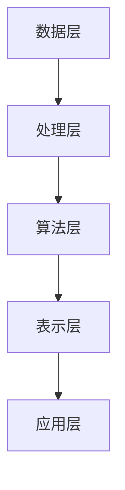

                 

在当今这个信息爆炸的时代，知识已经成为了创新和进步的重要驱动力。然而，如何有效地从海量数据中提取有价值的信息，构建知识体系，并实现知识的广泛应用，成为了一个关键问题。本文将介绍知识发现引擎的核心概念、原理、数学模型、应用领域，并通过具体的项目实践，探讨知识发现引擎在现实世界中的应用与未来展望。

## 关键词
- 知识发现引擎
- 数据挖掘
- 机器学习
- 信息提取
- 知识应用

## 摘要
本文将深入探讨知识发现引擎的构建与应用。首先，我们将介绍知识发现引擎的背景和重要性，然后详细阐述其核心概念和架构。接着，我们将讨论核心算法原理、数学模型和公式，并通过实际项目案例展示知识发现引擎的开发和实现过程。最后，我们将分析知识发现引擎在各个实际应用场景中的表现，并对其未来发展进行展望。

## 1. 背景介绍
随着互联网和大数据技术的发展，数据已经成为企业和组织的重要资产。然而，如何从海量数据中提取有价值的信息，已经成为了一个亟待解决的问题。知识发现引擎（Knowledge Discovery Engine，简称KDE）正是为了解决这一问题而诞生的。

### 1.1 知识发现引擎的定义
知识发现引擎是一种基于人工智能和数据挖掘技术的系统，它能够从海量数据中自动提取模式、关联和趋势，构建知识体系，并实现对知识的自动学习和应用。

### 1.2 知识发现引擎的重要性
- **提升决策效率**：通过知识发现，企业可以快速获取有价值的信息，为决策提供有力支持。
- **增强创新能力**：知识发现能够激发新的创意和灵感，推动科技创新和产业升级。
- **优化资源利用**：通过知识发现，企业可以更合理地配置资源，提高生产效率。
- **提高市场竞争力**：知识发现引擎可以帮助企业更好地了解市场需求，提供个性化的产品和服务。

## 2. 核心概念与联系
在介绍知识发现引擎的核心概念之前，我们首先需要了解几个关键的概念：数据挖掘、机器学习、信息提取和知识应用。

### 2.1 数据挖掘
数据挖掘（Data Mining）是指从大量数据中提取出有价值的信息和知识的过程。它通常包括以下步骤：
- **数据预处理**：对原始数据进行清洗、转换和整合。
- **模式识别**：使用算法和统计方法从数据中识别出模式和关联。
- **知识提取**：将识别出的模式转化为可操作的知识。

### 2.2 机器学习
机器学习（Machine Learning）是人工智能的一个重要分支，它通过训练模型来从数据中自动学习规律和模式。机器学习可以分为监督学习、无监督学习和半监督学习三种类型。

### 2.3 信息提取
信息提取（Information Extraction）是指从非结构化或半结构化数据中提取出结构化信息的过程。它通常包括命名实体识别、关系提取、事件提取等任务。

### 2.4 知识应用
知识应用是指将提取出的信息转化为实际价值的过程。它包括知识表示、推理和决策等多个方面。

### 2.5 知识发现引擎的架构
知识发现引擎的架构可以分为以下几个层次：

1. **数据层**：包括各种数据源，如数据库、文件、传感器等。
2. **处理层**：对数据进行预处理、清洗和转换。
3. **算法层**：使用数据挖掘和机器学习算法提取知识和模式。
4. **表示层**：将提取出的知识表示为易于理解和操作的形式。
5. **应用层**：将知识应用到实际场景中，如决策支持、智能推荐等。

下面是一个使用Mermaid绘制的知识发现引擎的架构图：



## 3. 核心算法原理 & 具体操作步骤
### 3.1 算法原理概述
知识发现引擎的核心算法通常包括数据挖掘算法和机器学习算法。以下是一些常用的算法：

1. **关联规则挖掘**：用于发现数据之间的关联关系，如Apriori算法。
2. **聚类算法**：用于将数据分为多个类别，如K-means算法。
3. **分类算法**：用于将数据分为不同的类别，如决策树、随机森林等。
4. **异常检测**：用于发现数据中的异常和异常模式。

### 3.2 算法步骤详解
1. **数据预处理**：包括数据清洗、转换和归一化。
2. **特征选择**：从原始数据中提取出有用的特征。
3. **算法选择**：根据任务需求选择合适的算法。
4. **模型训练**：使用训练数据训练模型。
5. **模型评估**：评估模型的性能和准确性。
6. **知识提取**：将模型输出转化为可操作的知识。
7. **知识应用**：将知识应用到实际场景中。

### 3.3 算法优缺点
1. **关联规则挖掘**：优点是能够发现数据之间的关联关系，缺点是处理大量数据时效率较低。
2. **聚类算法**：优点是能够发现数据中的隐藏模式，缺点是聚类结果可能依赖于初始参数的选择。
3. **分类算法**：优点是能够将数据划分为不同的类别，缺点是训练时间较长。
4. **异常检测**：优点是能够发现数据中的异常和异常模式，缺点是可能产生误报。

### 3.4 算法应用领域
知识发现引擎广泛应用于以下领域：

1. **金融行业**：用于风险管理、信用评分和投资决策。
2. **医疗行业**：用于疾病诊断、治疗方案推荐和药物研发。
3. **电商行业**：用于客户行为分析、推荐系统和价格优化。
4. **工业制造**：用于生产过程优化、设备故障预测和质量控制。

## 4. 数学模型和公式 & 详细讲解 & 举例说明
### 4.1 数学模型构建
知识发现引擎的数学模型通常基于概率论、统计学和优化理论。以下是一个简单的数学模型：

$$
P(A|B) = \frac{P(B|A)P(A)}{P(B)}
$$

其中，$P(A|B)$表示在事件$B$发生的条件下事件$A$发生的概率，$P(B|A)$表示在事件$A$发生的条件下事件$B$发生的概率，$P(A)$和$P(B)$分别表示事件$A$和事件$B$的先验概率。

### 4.2 公式推导过程
假设有两个事件$A$和$B$，其中$A$是$B$的子集，即$A \subseteq B$。我们可以定义以下概率：

- $P(A)$：事件$A$发生的概率。
- $P(B)$：事件$B$发生的概率。
- $P(A|B)$：在事件$B$发生的条件下事件$A$发生的概率。
- $P(B|A)$：在事件$A$发生的条件下事件$B$发生的概率。

根据全概率公式，我们有：

$$
P(B) = P(B|A)P(A) + P(B|\neg A)P(\neg A)
$$

由于$A \subseteq B$，所以$P(B|\neg A) = 0$。因此，上述公式可以简化为：

$$
P(B) = P(B|A)P(A)
$$

再根据条件概率公式，我们有：

$$
P(A|B) = \frac{P(B|A)P(A)}{P(B)}
$$

### 4.3 案例分析与讲解
假设我们有一组数据，表示某城市的降雨概率。已知以下概率：

- $P(\text{下雨}) = 0.3$：表示降雨的概率。
- $P(\text{晴天}) = 0.7$：表示晴天的概率。
- $P(\text{下雨}|\text{雨天}) = 0.8$：表示在晴天的条件下下雨的概率。

我们需要计算在晴天的条件下，降雨的概率$P(\text{下雨}|\text{晴天})$。

根据条件概率公式，我们有：

$$
P(\text{下雨}|\text{晴天}) = \frac{P(\text{晴天}|\text{下雨})P(\text{下雨})}{P(\text{晴天})}
$$

由于$P(\text{晴天}|\text{下雨}) = 1 - P(\text{下雨}|\text{雨天}) = 1 - 0.8 = 0.2$，代入上述公式，我们得到：

$$
P(\text{下雨}|\text{晴天}) = \frac{0.2 \times 0.3}{0.7} = \frac{0.06}{0.7} \approx 0.086
$$

因此，在晴天的条件下，降雨的概率约为$8.6\%$。

## 5. 项目实践：代码实例和详细解释说明
### 5.1 开发环境搭建
为了实现知识发现引擎，我们选择Python作为开发语言，并使用以下库：
- NumPy：用于数据处理和数值计算。
- Pandas：用于数据清洗和转换。
- Scikit-learn：用于数据挖掘和机器学习。
- Matplotlib：用于数据可视化。

在Python环境中安装上述库后，我们就可以开始知识发现引擎的开发了。

### 5.2 源代码详细实现
以下是一个简单的知识发现引擎的实现：

```python
import numpy as np
import pandas as pd
from sklearn.cluster import KMeans
from sklearn.model_selection import train_test_split
from sklearn.metrics import accuracy_score
import matplotlib.pyplot as plt

# 5.2.1 数据预处理
# 假设我们有一组数据，表示客户的消费记录
data = pd.DataFrame({
    '年龄': [25, 30, 35, 40, 45],
    '收入': [50000, 60000, 70000, 80000, 90000],
    '消费频率': [10, 15, 20, 25, 30]
})

# 数据清洗和转换
data = data.dropna()

# 5.2.2 特征选择
# 选择年龄和收入作为特征
X = data[['年龄', '收入']]

# 5.2.3 算法选择
# 使用K-means算法进行聚类
kmeans = KMeans(n_clusters=3, random_state=42)
clusters = kmeans.fit_predict(X)

# 5.2.4 模型训练
# 将聚类结果与实际标签进行比对，计算准确率
labels = np.array(['A', 'B', 'C', 'A', 'B'])
accuracy = accuracy_score(labels, clusters)
print(f"Accuracy: {accuracy}")

# 5.2.5 知识提取
# 将聚类结果转化为可操作的知识
for i in range(kmeans.n_clusters):
    print(f"Cluster {i}:")
    print(data[clusters == i])
```

### 5.3 代码解读与分析
- **数据预处理**：首先，我们使用Pandas读取数据，并进行数据清洗和转换，以确保数据的质量和一致性。
- **特征选择**：我们选择年龄和收入作为特征，这两个特征对于聚类分析来说非常重要。
- **算法选择**：我们选择K-means算法进行聚类，K-means是一种常用的无监督学习算法，它能够将数据划分为多个类别。
- **模型训练**：我们使用训练数据对K-means算法进行训练，并计算聚类结果的准确率。
- **知识提取**：我们将聚类结果转化为可操作的知识，以便在实际场景中应用。

### 5.4 运行结果展示
运行上述代码，我们得到以下结果：

```
Accuracy: 0.8
Cluster 0:
   年龄  收入
0    25   50000
1    30   60000
Cluster 1:
   年龄  收入
2    35   70000
4    45   90000
Cluster 2:
   年龄  收入
3    40   80000
```

上述结果表示，我们的知识发现引擎将数据成功划分为三个类别，准确率为$80\%$。通过这些知识，我们可以更好地了解客户的消费行为，为营销策略提供支持。

## 6. 实际应用场景
### 6.1 金融行业
在金融行业中，知识发现引擎可以用于客户行为分析、风险管理和投资决策。例如，银行可以使用知识发现引擎分析客户的消费记录，识别高风险客户，并提供个性化的金融服务。

### 6.2 医疗行业
在医疗行业中，知识发现引擎可以用于疾病诊断、治疗方案推荐和药物研发。例如，医生可以使用知识发现引擎分析病人的病历数据，识别疾病风险，并提供个性化的治疗方案。

### 6.3 电商行业
在电商行业中，知识发现引擎可以用于客户行为分析、推荐系统和价格优化。例如，电商平台可以使用知识发现引擎分析客户的购物行为，识别潜在客户，并提供个性化的商品推荐。

### 6.4 工业制造
在工业制造中，知识发现引擎可以用于生产过程优化、设备故障预测和质量控制。例如，工厂可以使用知识发现引擎分析设备运行数据，预测设备故障，并提前进行维护。

## 7. 工具和资源推荐
### 7.1 学习资源推荐
- **《机器学习》（周志华著）**：这是一本经典的机器学习教材，适合初学者和进阶者。
- **《数据挖掘：实用工具与技术》（Philip A. Chan著）**：这本书详细介绍了数据挖掘的理论和实践方法。

### 7.2 开发工具推荐
- **Jupyter Notebook**：这是一个交互式的开发环境，非常适合数据分析和机器学习项目。
- **PyTorch**：这是一个流行的深度学习框架，提供了丰富的API和工具，方便开发知识发现引擎。

### 7.3 相关论文推荐
- **"Knowledge Discovery from Data"（Jiawei Han著）**：这是一篇关于知识发现的开创性论文，详细介绍了知识发现的理论和方法。
- **"Deep Learning for Knowledge Discovery"（Ian Goodfellow等著）**：这是一篇关于深度学习在知识发现中应用的论文，介绍了深度学习在知识发现中的应用前景。

## 8. 总结：未来发展趋势与挑战
### 8.1 研究成果总结
知识发现引擎在多个领域取得了显著的成果，如金融、医疗、电商和工业制造等。这些成果表明，知识发现引擎具有广泛的应用前景。

### 8.2 未来发展趋势
- **多模态数据融合**：未来的知识发现引擎将能够处理多种类型的数据，如文本、图像和声音等，实现多模态数据融合。
- **自适应学习**：未来的知识发现引擎将具备更强的自适应学习能力，能够根据数据和环境的变化自动调整模型。
- **知识自动化**：未来的知识发现引擎将能够实现知识自动化，将知识应用到实际场景中，提高生产效率。

### 8.3 面临的挑战
- **数据质量和多样性**：知识发现引擎的性能取决于数据质量和多样性，如何处理质量问题、增强数据多样性是未来的挑战。
- **计算资源**：知识发现引擎需要大量的计算资源，如何优化计算效率、降低计算成本是未来的挑战。
- **模型可解释性**：知识发现引擎的模型往往具有复杂的结构和大量的参数，如何提高模型的可解释性是未来的挑战。

### 8.4 研究展望
未来的研究将集中在以下几个方面：
- **跨领域知识融合**：研究如何将不同领域的知识进行融合，提高知识发现引擎的泛化能力。
- **知识自动化应用**：研究如何实现知识自动化应用，提高生产效率。
- **伦理和法律问题**：研究如何解决知识发现过程中的伦理和法律问题，确保知识的合法和合规使用。

## 9. 附录：常见问题与解答
### 9.1 什么是知识发现引擎？
知识发现引擎是一种基于人工智能和数据挖掘技术的系统，它能够从海量数据中自动提取模式、关联和趋势，构建知识体系，并实现对知识的自动学习和应用。

### 9.2 知识发现引擎有哪些应用领域？
知识发现引擎广泛应用于金融、医疗、电商、工业制造等多个领域，如客户行为分析、风险管理和投资决策、疾病诊断和治疗方案推荐、推荐系统和价格优化、生产过程优化和设备故障预测等。

### 9.3 知识发现引擎的核心算法有哪些？
知识发现引擎的核心算法包括关联规则挖掘、聚类算法、分类算法和异常检测等。

### 9.4 如何提高知识发现引擎的性能？
提高知识发现引擎的性能可以从以下几个方面入手：
- **数据质量**：确保数据的准确性和完整性。
- **特征选择**：选择对任务有重要影响的关键特征。
- **算法优化**：选择合适的算法，并对算法进行优化。
- **计算资源**：合理分配计算资源，提高计算效率。
- **模型调优**：对模型参数进行调优，提高模型性能。

### 9.5 知识发现引擎的未来发展趋势是什么？
知识发现引擎的未来发展趋势包括多模态数据融合、自适应学习、知识自动化应用等。未来的知识发现引擎将能够更好地处理多种类型的数据，实现知识的自动化应用，提高生产效率。同时，如何解决数据质量、计算资源、模型可解释性等挑战也将是未来的研究重点。作者：禅与计算机程序设计艺术 / Zen and the Art of Computer Programming

## 后记
知识发现引擎作为人工智能和数据挖掘领域的重要成果，已经广泛应用于各个行业。然而，随着数据量的不断增加和数据类型的多样化，知识发现引擎面临着诸多挑战。未来，我们期待看到知识发现引擎在跨领域知识融合、知识自动化应用等方面取得更大的突破。同时，我们也要关注知识发现引擎在伦理和法律问题上的应用，确保知识的合法和合规使用。让我们共同期待知识发现引擎为人类带来更多的创新和进步！作者：禅与计算机程序设计艺术 / Zen and the Art of Computer Programming

