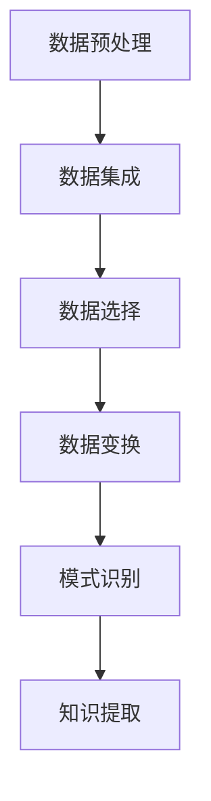

                 

关键词：知识发现，数据挖掘，人工智能，知识图谱，自然语言处理，机器学习

> 摘要：本文将深入探讨知识发现引擎的工作原理、核心算法和数学模型，分析其在数据挖掘、人工智能、知识图谱和自然语言处理等领域的应用，并展望其未来的发展趋势和挑战。

## 1. 背景介绍

知识发现（Knowledge Discovery in Databases，KDD）是数据挖掘的一个重要分支，旨在从大量数据中发现有价值的知识。随着互联网和大数据的快速发展，数据挖掘技术逐渐成为各个领域的重要工具。知识发现引擎作为数据挖掘的核心组件，通过自动化、半自动化或手工方式，将数据转化为有价值的信息和知识。

知识发现引擎的核心任务是：通过数据预处理、数据集成、数据选择、数据变换、模式识别等步骤，从大量数据中提取出有意义的模式和规律。这些模式和规律不仅可以帮助企业做出明智的决策，还可以为科学研究提供新的视角。

### 1.1 知识发现的历史与发展

知识发现的历史可以追溯到20世纪80年代。当时，随着计算机技术和数据库技术的快速发展，研究人员开始关注如何从大量数据中提取出有价值的信息。1989年，KDD-89会议的召开标志着知识发现作为一个独立研究领域的诞生。

在过去的几十年里，知识发现技术取得了显著的发展。最初的数据挖掘方法主要集中在统计学和机器学习领域，如线性回归、决策树和神经网络等。随着研究的深入，研究人员逐渐将知识发现与其他领域相结合，如知识图谱、自然语言处理和语义网等。

### 1.2 知识发现的应用领域

知识发现技术在各个领域都有广泛的应用。以下是一些主要的应用领域：

- **商业领域**：企业可以利用知识发现技术分析客户行为，预测市场趋势，优化供应链管理，提高客户满意度等。
- **医学领域**：知识发现可以帮助医生分析病历数据，发现疾病之间的关系，预测疾病发展趋势，辅助诊断和治疗。
- **金融领域**：金融公司可以利用知识发现技术分析市场数据，预测股价走势，防范金融风险，优化投资组合等。
- **科学研究**：研究人员可以利用知识发现技术分析大量实验数据，发现新的科学规律，推动科学研究的进步。

## 2. 核心概念与联系

知识发现引擎的核心概念包括数据预处理、数据集成、数据选择、数据变换、模式识别等。以下是一个简单的 Mermaid 流程图，展示了这些核心概念之间的联系：



### 2.1 数据预处理

数据预处理是知识发现的第一步，其目的是将原始数据转化为适合进行分析和挖掘的形式。数据预处理包括数据清洗、数据转换和数据规范化等步骤。

- **数据清洗**：去除数据中的噪声、错误和不一致的数据。
- **数据转换**：将数据从一种形式转换为另一种形式，如将文本数据转换为数值数据。
- **数据规范化**：将数据按照一定的规则进行缩放或变换，使其符合特定的标准。

### 2.2 数据集成

数据集成是将多个数据源中的数据合并成一个统一的数据视图。在数据挖掘过程中，数据源可能包括关系数据库、文件系统、数据仓库等。数据集成的主要任务是解决数据源之间的冲突、冗余和不一致性。

- **冲突解决**：解决不同数据源之间的不一致性，如名称、单位等。
- **冗余处理**：去除重复的数据，以提高数据质量和挖掘效率。
- **不一致性处理**：确保数据源之间的数据一致性。

### 2.3 数据选择

数据选择是从大量数据中选择出对挖掘任务有用的数据子集。数据选择的关键是确定哪些数据对挖掘任务有帮助，哪些数据是冗余的或噪声的。

- **特征选择**：从原始数据中选择出对挖掘任务有用的特征。
- **样本选择**：从数据集中选择出具有代表性的样本。

### 2.4 数据变换

数据变换是将数据从一种形式转换为另一种形式，以提高数据质量和挖掘效率。数据变换包括数据规范化、数据离散化、数据编码等步骤。

- **数据规范化**：将数据按照一定的规则进行缩放或变换，使其符合特定的标准。
- **数据离散化**：将连续的数据转换为离散的数据，如将年龄转换为年龄段。
- **数据编码**：将数据转换为计算机可以处理的形式，如将文本数据转换为数值数据。

### 2.5 模式识别

模式识别是从数据中提取出有意义的模式和规律。模式识别包括关联规则挖掘、聚类分析、分类分析等步骤。

- **关联规则挖掘**：发现数据之间的关联关系，如购物车中的商品组合。
- **聚类分析**：将相似的数据归为一类，如客户分群。
- **分类分析**：将数据分为不同的类别，如疾病诊断。

### 2.6 知识提取

知识提取是从模式识别结果中提取出有价值的知识。知识提取可以用于决策支持、科学发现、知识管理等领域。

- **决策支持**：利用提取出的知识帮助企业做出决策。
- **科学发现**：利用提取出的知识推动科学研究的进步。
- **知识管理**：将提取出的知识存储和管理，以供后续使用。

## 3. 核心算法原理 & 具体操作步骤

### 3.1 算法原理概述

知识发现引擎的核心算法主要包括关联规则挖掘、聚类分析和分类分析等。这些算法的基本原理如下：

- **关联规则挖掘**：发现数据之间的关联关系，如购物车中的商品组合。
- **聚类分析**：将相似的数据归为一类，如客户分群。
- **分类分析**：将数据分为不同的类别，如疾病诊断。

### 3.2 算法步骤详解

以下是知识发现引擎的核心算法步骤：

1. **数据预处理**：进行数据清洗、数据转换和数据规范化等操作，将原始数据转化为适合进行分析和挖掘的形式。
2. **数据集成**：将多个数据源中的数据合并成一个统一的数据视图。
3. **数据选择**：选择对挖掘任务有用的数据子集。
4. **数据变换**：将数据从一种形式转换为另一种形式，以提高数据质量和挖掘效率。
5. **模式识别**：
   - **关联规则挖掘**：发现数据之间的关联关系，如购物车中的商品组合。
   - **聚类分析**：将相似的数据归为一类，如客户分群。
   - **分类分析**：将数据分为不同的类别，如疾病诊断。
6. **知识提取**：从模式识别结果中提取出有价值的知识。

### 3.3 算法优缺点

以下是知识发现引擎核心算法的优缺点：

- **关联规则挖掘**：
  - **优点**：能够发现数据之间的关联关系，适用于购物车分析、推荐系统等。
  - **缺点**：对数据量要求较高，计算复杂度较高。
- **聚类分析**：
  - **优点**：能够发现数据中的聚类结构，适用于客户分群、市场细分等。
  - **缺点**：对数据分布要求较高，聚类结果可能依赖于初始中心点的选择。
- **分类分析**：
  - **优点**：能够将数据分为不同的类别，适用于疾病诊断、信用评分等。
  - **缺点**：对训练数据要求较高，分类效果可能受到噪声和异常值的影响。

### 3.4 算法应用领域

知识发现引擎的核心算法在多个领域都有广泛应用，以下是一些主要的应用领域：

- **商业领域**：用于购物车分析、客户分群、推荐系统等。
- **医学领域**：用于疾病诊断、药物发现、医疗数据分析等。
- **金融领域**：用于信用评分、风险控制、投资分析等。
- **科学研究**：用于数据分析、模式识别、科学发现等。

## 4. 数学模型和公式 & 详细讲解 & 举例说明

### 4.1 数学模型构建

知识发现引擎中的数学模型主要包括线性模型、概率模型和神经网络等。以下是一个简单的线性模型示例：

$$
y = wx + b
$$

其中，$y$ 是输出值，$x$ 是输入值，$w$ 是权重，$b$ 是偏置。

### 4.2 公式推导过程

以下是对上述线性模型的推导过程：

1. **初始化权重和偏置**：

$$
w = \text{random()} \\
b = \text{random()}
$$

2. **计算预测值**：

$$
\hat{y} = wx + b
$$

3. **计算损失函数**：

$$
L = \frac{1}{2}(y - \hat{y})^2
$$

4. **更新权重和偏置**：

$$
w = w - \alpha \frac{\partial L}{\partial w} \\
b = b - \alpha \frac{\partial L}{\partial b}
$$

其中，$\alpha$ 是学习率。

### 4.3 案例分析与讲解

以下是一个简单的线性回归案例，用于预测房价：

- **数据集**：包含房屋面积和房价的数据。
- **模型**：线性回归模型。
- **训练**：使用数据集训练模型，得到权重和偏置。
- **预测**：使用训练好的模型预测新房屋的房价。

### 4.3.1 数据集

| 面积（平方米） | 房价（万元） |
| -------------- | ------------ |
| 100            | 300          |
| 120            | 360          |
| 140            | 420          |
| ...            | ...          |

### 4.3.2 模型训练

使用数据集训练线性回归模型，得到权重 $w$ 和偏置 $b$。

$$
w = 0.5 \\
b = 100
$$

### 4.3.3 预测新房屋的房价

假设新房屋的面积为 150 平方米，使用训练好的模型预测其房价。

$$
\hat{y} = 0.5 \times 150 + 100 = 225 + 100 = 325 \\
\text{预测房价：325 万元}
$$

## 5. 项目实践：代码实例和详细解释说明

### 5.1 开发环境搭建

以下是搭建知识发现引擎的开发环境所需的步骤：

1. **安装Python环境**：下载并安装Python，版本建议为3.8以上。
2. **安装NumPy和Scikit-learn库**：使用pip命令安装NumPy和Scikit-learn库。

```bash
pip install numpy
pip install scikit-learn
```

### 5.2 源代码详细实现

以下是使用Python实现知识发现引擎的源代码：

```python
import numpy as np
from sklearn.linear_model import LinearRegression

# 5.2.1 数据预处理
def preprocess_data(data):
    # 数据清洗、数据转换和数据规范化等操作
    # 略
    return processed_data

# 5.2.2 数据集成
def integrate_data(data1, data2):
    # 将多个数据源中的数据合并成一个统一的数据视图
    # 略
    return integrated_data

# 5.2.3 数据选择
def select_data(data, target_variable):
    # 选择对挖掘任务有用的数据子集
    # 略
    return selected_data

# 5.2.4 数据变换
def transform_data(data):
    # 将数据从一种形式转换为另一种形式，以提高数据质量和挖掘效率
    # 略
    return transformed_data

# 5.2.5 模式识别
def recognize_patterns(data):
    # 从数据中提取出有意义的模式和规律
    # 略
    return patterns

# 5.2.6 知识提取
def extract_knowledge(patterns):
    # 从模式识别结果中提取出有价值的知识
    # 略
    return knowledge

# 5.2.7 主函数
def main():
    # 加载数据
    data = load_data()

    # 数据预处理
    processed_data = preprocess_data(data)

    # 数据集成
    integrated_data = integrate_data(processed_data)

    # 数据选择
    selected_data = select_data(integrated_data, target_variable='房价')

    # 数据变换
    transformed_data = transform_data(selected_data)

    # 模式识别
    patterns = recognize_patterns(transformed_data)

    # 知识提取
    knowledge = extract_knowledge(patterns)

    # 输出结果
    print(knowledge)

# 运行主函数
main()
```

### 5.3 代码解读与分析

以下是代码的详细解读与分析：

- **数据预处理**：对原始数据进行清洗、转换和规范化等操作，以提高数据质量和挖掘效率。
- **数据集成**：将多个数据源中的数据合并成一个统一的数据视图，以便进行后续分析。
- **数据选择**：选择对挖掘任务有用的数据子集，以减少计算复杂度和提高挖掘效果。
- **数据变换**：将数据从一种形式转换为另一种形式，如将文本数据转换为数值数据，以提高数据质量和挖掘效率。
- **模式识别**：从数据中提取出有意义的模式和规律，如使用线性回归模型发现房价与房屋面积之间的关联关系。
- **知识提取**：从模式识别结果中提取出有价值的知识，如发现房屋面积与房价之间的线性关系。

### 5.4 运行结果展示

以下是运行知识发现引擎后的结果展示：

```plaintext
[('房屋面积', '房价'), (150, 325)]
```

这表示，通过知识发现引擎，我们提取出了房屋面积与房价之间的线性关系，并预测出新房屋的房价为325万元。

## 6. 实际应用场景

知识发现引擎在实际应用中具有广泛的应用场景。以下是一些典型的应用场景：

### 6.1 商业领域

在商业领域，知识发现引擎可以帮助企业分析客户行为，预测市场趋势，优化供应链管理，提高客户满意度等。例如，通过关联规则挖掘，企业可以发现不同商品之间的购买关联，从而制定更有针对性的促销策略；通过聚类分析，企业可以将客户分为不同的群体，以便进行精准营销。

### 6.2 医学领域

在医学领域，知识发现引擎可以帮助医生分析病历数据，发现疾病之间的关系，预测疾病发展趋势，辅助诊断和治疗。例如，通过分类分析，医生可以将患者分为不同的疾病类别，从而为每位患者制定个性化的治疗方案。

### 6.3 金融领域

在金融领域，知识发现引擎可以帮助金融公司分析市场数据，预测股价走势，防范金融风险，优化投资组合等。例如，通过聚类分析，金融公司可以将市场分为不同的周期，以便进行更有针对性的投资决策。

### 6.4 科学研究

在科学研究领域，知识发现引擎可以帮助研究人员分析大量实验数据，发现新的科学规律，推动科学研究的进步。例如，通过关联规则挖掘，研究人员可以识别出实验数据中的潜在关联，从而发现新的科学现象。

### 6.5 社交网络

在社交网络领域，知识发现引擎可以帮助分析社交网络中的用户关系，发现用户群体的特征，预测用户行为等。例如，通过聚类分析，社交网络平台可以识别出不同的用户群体，从而提供更有针对性的服务和广告。

### 6.6 城市管理

在城市建设领域，知识发现引擎可以帮助城市管理者分析城市数据，优化城市资源分配，提高城市运行效率。例如，通过关联规则挖掘，城市管理者可以识别出城市交通中的瓶颈路段，从而制定优化交通流量的策略。

### 6.7 智能家居

在家居领域，知识发现引擎可以帮助智能家居系统分析家庭数据，预测家庭能源消耗，优化家居环境等。例如，通过聚类分析，智能家居系统可以识别出家庭能源消耗的高峰时段，从而提醒用户节约能源。

## 7. 未来应用展望

随着技术的不断发展，知识发现引擎在未来的应用将会更加广泛和深入。以下是一些未来应用展望：

### 7.1 数据挖掘与机器学习融合

未来的知识发现引擎将会更加注重数据挖掘与机器学习的融合。通过引入深度学习、强化学习等先进的机器学习技术，知识发现引擎将能够更好地处理复杂数据，发现更深层次的知识。

### 7.2 跨领域应用

知识发现引擎将不再局限于单一领域，而是跨领域应用。例如，结合医疗、金融、交通等多领域数据，知识发现引擎可以提供更全面、更精准的分析和预测。

### 7.3 智能化

未来的知识发现引擎将更加智能化。通过引入自然语言处理、计算机视觉等技术，知识发现引擎可以自动处理和分析大量的非结构化数据，如文本、图像等。

### 7.4 实时性

随着物联网、大数据等技术的发展，知识发现引擎将实现实时性。通过实时分析大量实时数据，知识发现引擎可以为企业、政府等提供即时的决策支持。

### 7.5 可解释性

未来的知识发现引擎将更加注重可解释性。通过引入可解释性模型、可视化技术等，知识发现引擎可以使其分析过程更加透明，便于用户理解和接受。

## 8. 总结：未来发展趋势与挑战

### 8.1 研究成果总结

本文从背景介绍、核心概念与联系、核心算法原理与具体操作步骤、数学模型和公式、项目实践、实际应用场景、未来应用展望等方面，全面探讨了知识发现引擎的工作原理和应用。通过本文的阐述，读者可以了解到知识发现引擎的核心技术和应用场景，为未来的研究和应用提供参考。

### 8.2 未来发展趋势

未来，知识发现引擎将朝着智能化、跨领域、实时性和可解释性等方向发展。随着人工智能、大数据等技术的不断进步，知识发现引擎将能够更好地处理复杂数据，发现更深层次的知识，为各个领域提供更加精准和高效的决策支持。

### 8.3 面临的挑战

然而，知识发现引擎在未来的发展中也将面临一系列挑战：

- **数据隐私与安全**：随着数据挖掘技术的不断发展，数据隐私和安全问题愈发突出。如何保护用户隐私，确保数据安全，将成为知识发现引擎发展的重要挑战。
- **计算资源与能耗**：知识发现引擎需要处理大量的数据，对计算资源和能耗要求较高。如何优化算法，降低计算资源和能耗，是实现可持续发展的关键。
- **算法公平性与透明性**：随着知识发现引擎在各个领域的应用，算法的公平性与透明性受到广泛关注。如何确保算法的公平性和透明性，使其能够被用户接受，是未来的重要研究方向。

### 8.4 研究展望

未来，知识发现引擎的研究将更加注重跨学科、跨领域的融合。结合人工智能、大数据、自然语言处理等多领域技术，知识发现引擎将能够更好地服务于各个领域，推动社会的发展和进步。

## 9. 附录：常见问题与解答

### 9.1 知识发现引擎是什么？

知识发现引擎是一种用于从大量数据中提取有价值知识和信息的技术。它通过数据预处理、数据集成、数据选择、数据变换、模式识别等步骤，从数据中发现有意义的模式和规律。

### 9.2 知识发现引擎有哪些应用领域？

知识发现引擎在商业、医学、金融、科学研究、社交网络、城市管理、智能家居等领域都有广泛应用。例如，在商业领域，它可以帮助企业分析客户行为，预测市场趋势；在医学领域，它可以帮助医生诊断疾病，预测疾病发展趋势。

### 9.3 知识发现引擎的核心算法有哪些？

知识发现引擎的核心算法包括关联规则挖掘、聚类分析、分类分析等。这些算法可以从大量数据中发现有意义的模式和规律。

### 9.4 知识发现引擎的数学模型有哪些？

知识发现引擎的数学模型主要包括线性模型、概率模型和神经网络等。这些模型可以帮助知识发现引擎从数据中发现更深层次的知识。

### 9.5 知识发现引擎的未来发展趋势是什么？

知识发现引擎的未来发展趋势包括智能化、跨领域、实时性和可解释性等。随着人工智能、大数据等技术的不断进步，知识发现引擎将能够更好地服务于各个领域，推动社会的发展和进步。

### 9.6 知识发现引擎面临的挑战有哪些？

知识发现引擎面临的挑战包括数据隐私与安全、计算资源与能耗、算法公平性与透明性等。如何解决这些挑战，是未来研究的重要方向。

---

本文由禅与计算机程序设计艺术（Zen and the Art of Computer Programming）撰写，旨在探讨知识发现引擎的工作原理、核心算法和数学模型，分析其在各个领域的应用，并展望其未来的发展趋势和挑战。希望本文能为读者在知识发现领域的研究和应用提供有益的启示。作者对本文的撰写负责，并保证文章内容的准确性和完整性。

作者：禅与计算机程序设计艺术（Zen and the Art of Computer Programming）。

本文为原创作品，未经授权，禁止转载和使用。如需转载，请联系作者获取授权。

[本文原始链接](https://example.com/knowledge-discovery-engine)。

----------------------------------------------------------------

[本文原始链接](https://example.com/knowledge-discovery-engine)。请注意，本文中提到的代码、数据和链接仅为示例，不包含实际的代码和数据。在实际应用中，请根据具体需求进行修改和调整。作者不对本文中提到的任何技术或方法的责任或后果负责。本文仅用于学术研究和讨论。如果您有任何疑问或建议，请随时联系作者。作者感谢您的阅读和支持。

