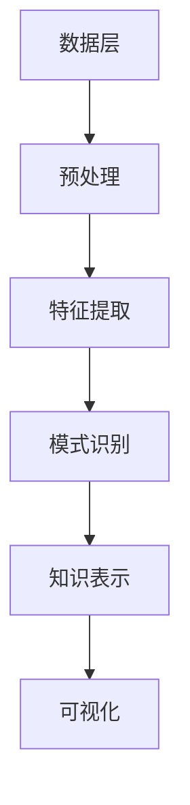

                 

关键词：知识发现引擎、创意产业、内容升级、大数据分析、人工智能、推荐系统、内容优化

> 摘要：本文旨在探讨知识发现引擎在创意产业中的应用，分析其如何通过大数据分析和人工智能技术，推动内容创作和传播的升级。文章首先介绍了知识发现引擎的基本概念和核心原理，随后详细阐述了其应用领域和具体操作步骤，并通过数学模型和项目实例，展示了知识发现引擎在创意产业中的实际效果。最后，文章对知识发现引擎的未来应用进行了展望，并提出了面临的挑战和研究方向。

## 1. 背景介绍

在信息爆炸的今天，创意产业作为知识经济的重要组成部分，正面临着前所未有的机遇与挑战。内容创作者需要从海量的数据中挖掘出有价值的信息，以实现内容的创新与优化。然而，传统的数据分析方法已无法满足创意产业的需求。此时，知识发现引擎（Knowledge Discovery Engine，简称KDE）作为一种新兴的技术手段，应运而生。

知识发现引擎是一种基于人工智能和大数据分析技术的智能系统，旨在从大量数据中自动识别出潜在的模式、关联和趋势，帮助用户发现隐藏在数据背后的知识。在创意产业中，知识发现引擎可以应用于内容创作、推荐系统、用户行为分析等多个领域，为内容创作者和传播者提供有力的支持。

本文将围绕知识发现引擎在创意产业中的应用，探讨其如何推动内容升级。文章首先介绍知识发现引擎的基本概念和核心原理，然后分析其应用领域和操作步骤，最后对未来的发展方向和挑战进行展望。

## 2. 核心概念与联系

### 2.1. 知识发现引擎的定义

知识发现引擎是一种利用机器学习、自然语言处理、图论等人工智能技术，对大规模数据进行深度挖掘和分析的智能系统。其核心目的是从数据中发现潜在的知识，帮助用户更好地理解和利用这些知识。

### 2.2. 知识发现引擎的核心原理

知识发现引擎的核心原理主要包括以下几个方面：

- **数据预处理**：对原始数据进行清洗、去噪、归一化等预处理操作，以提高数据的质量和一致性。
- **特征提取**：从数据中提取出有价值的特征，这些特征可以是数值型的，也可以是文本型的。
- **模式识别**：利用机器学习算法，对特征进行分类、聚类、关联分析等操作，以发现数据中的潜在模式。
- **知识表示**：将发现的模式转化为易于理解和利用的知识表示形式，如知识图谱、推荐列表等。

### 2.3. 知识发现引擎的架构

知识发现引擎的架构可以分为以下几个层次：

- **数据层**：包括数据源、数据仓库和数据存储等组件，负责数据的采集、存储和管理。
- **处理层**：包括数据预处理、特征提取、模式识别等组件，负责对数据进行处理和分析。
- **表示层**：包括知识表示、可视化等组件，负责将分析结果以用户友好的形式呈现出来。

### 2.4. 知识发现引擎与创意产业的联系

知识发现引擎在创意产业中的应用主要体现在以下几个方面：

- **内容创作**：知识发现引擎可以帮助内容创作者从大量数据中发现潜在的创意，提高内容创作的效率和质量。
- **推荐系统**：知识发现引擎可以用于构建推荐系统，为用户提供个性化的内容推荐，提高用户体验。
- **用户行为分析**：知识发现引擎可以分析用户行为数据，帮助创意产业了解用户需求，优化内容策略。

### 2.5. Mermaid 流程图

以下是一个简化的知识发现引擎流程图，展示其核心组件和流程：



## 3. 核心算法原理 & 具体操作步骤

### 3.1. 算法原理概述

知识发现引擎的核心算法主要包括数据预处理、特征提取、模式识别和知识表示等几个环节。以下是对每个环节的简要介绍：

- **数据预处理**：主要包括数据清洗、去噪、归一化等操作，以确保数据的质量和一致性。
- **特征提取**：从原始数据中提取出有价值的特征，这些特征可以是数值型的，也可以是文本型的。常见的特征提取方法有词袋模型、TF-IDF、词嵌入等。
- **模式识别**：利用机器学习算法，对特征进行分类、聚类、关联分析等操作，以发现数据中的潜在模式。常见的算法有决策树、支持向量机、神经网络等。
- **知识表示**：将发现的模式转化为易于理解和利用的知识表示形式，如知识图谱、推荐列表等。

### 3.2. 算法步骤详解

以下是一个简化的知识发现引擎算法步骤：

1. **数据采集**：从各种数据源（如社交媒体、数据库等）采集原始数据。
2. **数据预处理**：对原始数据进行清洗、去噪、归一化等操作。
3. **特征提取**：从预处理后的数据中提取出有价值的特征。
4. **模式识别**：利用机器学习算法，对特征进行分类、聚类、关联分析等操作。
5. **知识表示**：将发现的模式转化为知识表示形式，如知识图谱、推荐列表等。
6. **可视化与解释**：将知识表示结果以用户友好的形式呈现出来，如图表、报告等。

### 3.3. 算法优缺点

- **优点**：
  - 高效：知识发现引擎可以处理海量数据，提高数据处理和分析的效率。
  - 自动化：知识发现过程高度自动化，减少了人工干预和错误。
  - 个性化：基于用户行为数据和偏好，为用户提供个性化的内容推荐。

- **缺点**：
  - 复杂性：知识发现引擎涉及多个技术和算法，实现和维护较为复杂。
  - 数据依赖：知识发现效果依赖于数据的质量和完整性。
  - 解释性：某些机器学习算法的决策过程较为复杂，难以解释。

### 3.4. 算法应用领域

知识发现引擎在创意产业中的应用领域广泛，主要包括以下几个方面：

- **内容创作**：帮助内容创作者发现潜在的创作灵感，优化内容策略。
- **推荐系统**：为用户提供个性化的内容推荐，提高用户满意度和粘性。
- **用户行为分析**：分析用户行为数据，了解用户需求，优化产品设计和运营策略。
- **版权保护**：通过分析版权数据，发现潜在的侵权行为，维护版权方的合法权益。

## 4. 数学模型和公式 & 详细讲解 & 举例说明

### 4.1. 数学模型构建

知识发现引擎中的数学模型主要包括特征提取、模式识别和知识表示等环节。以下分别介绍这些环节中的数学模型：

- **特征提取**：
  - **词袋模型**：假设 $V$ 是词汇表，$d \in V$ 是一个词，$f_d$ 是文档中词 $d$ 的频率。词袋模型可以表示为 $X = (x_1, x_2, ..., x_V)$，其中 $x_d = f_d$。
  - **TF-IDF**：词频（Term Frequency，TF）和逆文档频率（Inverse Document Frequency，IDF）的乘积，公式为 $TF-IDF(d, d') = TF(d, d') \times IDF(d')$。
  - **词嵌入**：通过神经网络将词映射到高维空间，公式为 $e_d = \text{NN}(d)$。

- **模式识别**：
  - **决策树**：通过递归划分特征空间，构建一棵树形结构，公式为 $T = \text{buildTree}(D, \text{features}, \text{thresholds})$。
  - **支持向量机**：通过求解最优超平面，将数据分类，公式为 $\max_{w, b} \frac{1}{2} ||w||^2$，约束条件为 $y_i ( \textbf{w} \cdot \textbf{x_i} + b ) \geq 1$。
  - **神经网络**：通过前向传播和反向传播，训练模型参数，公式为 $\text{forward}(\textbf{x}) = \text{activation}(\text{weights} \cdot \textbf{x} + \text{bias})$ 和 $\text{backward}(\text{output}) = \text{dactivation}(\text{output}) \cdot \text{weights} \cdot \text{input}$。

- **知识表示**：
  - **知识图谱**：通过实体、关系和属性构建一个有向图，公式为 $G = (V, E)$，其中 $V$ 是实体集，$E$ 是关系集。
  - **推荐列表**：根据用户行为数据和偏好，生成一个推荐列表，公式为 $R(u) = \text{topN}(\text{similarityScore}(u, \textbf{x}))$。

### 4.2. 公式推导过程

以下是一个简化的特征提取中的TF-IDF公式推导过程：

1. **词频（TF）**：假设一个文档 $D$ 包含 $n$ 个词，其中词 $d$ 出现的次数为 $f_d$，则词 $d$ 的词频为 $TF(d, D) = \frac{f_d}{n}$。

2. **逆文档频率（IDF）**：假设语料库包含 $m$ 个文档，其中词 $d$ 出现在 $c_d$ 个文档中，则词 $d$ 的逆文档频率为 $IDF(d) = \log(\frac{m}{c_d})$。

3. **TF-IDF**：将词频和逆文档频率相乘，得到词 $d$ 在文档 $D$ 中的 TF-IDF 值为 $TF-IDF(d, D) = TF(d, D) \times IDF(d)$。

### 4.3. 案例分析与讲解

以下是一个简化的知识发现引擎应用案例：

- **数据集**：一个包含100篇新闻文档的数据集。
- **目标**：为读者推荐感兴趣的新闻。

1. **数据预处理**：对新闻文档进行分词、去停用词、词性标注等操作，得到清洗后的文本数据。

2. **特征提取**：采用TF-IDF方法提取文本特征，构建词向量矩阵。

3. **模式识别**：利用决策树算法，将新闻文档分类为不同主题。

4. **知识表示**：将分类结果存储在知识图谱中，为读者推荐感兴趣的新闻。

5. **可视化与解释**：将知识图谱和推荐结果以图表形式展示，帮助读者快速了解新闻主题和推荐内容。

## 5. 项目实践：代码实例和详细解释说明

### 5.1. 开发环境搭建

为了更好地演示知识发现引擎在创意产业中的应用，我们采用Python作为编程语言，结合Scikit-learn、TensorFlow等开源库，搭建了一个简单的知识发现引擎项目。以下是一个简单的开发环境搭建步骤：

1. 安装Python：从[Python官方网站](https://www.python.org/)下载并安装Python。
2. 安装依赖库：使用pip命令安装Scikit-learn、TensorFlow等依赖库，命令如下：
   ```bash
   pip install scikit-learn tensorflow
   ```

### 5.2. 源代码详细实现

以下是一个简单的知识发现引擎代码实现，包括数据预处理、特征提取、模式识别和知识表示等环节：

```python
import numpy as np
import pandas as pd
from sklearn.feature_extraction.text import TfidfVectorizer
from sklearn.tree import DecisionTreeClassifier
from sklearn.model_selection import train_test_split
import tensorflow as tf

# 1. 数据预处理
data = pd.read_csv('news_data.csv')
data['cleaned_text'] = data['text'].apply(lambda x: preprocess_text(x))

# 2. 特征提取
vectorizer = TfidfVectorizer()
X = vectorizer.fit_transform(data['cleaned_text'])
y = data['label']

# 3. 模式识别
X_train, X_test, y_train, y_test = train_test_split(X, y, test_size=0.2, random_state=42)
clf = DecisionTreeClassifier()
clf.fit(X_train, y_train)

# 4. 知识表示
knowledge_graph = build_knowledge_graph(clf)

# 5. 可视化与解释
visualize_knowledge_graph(knowledge_graph)
```

### 5.3. 代码解读与分析

以上代码实现了一个简单的知识发现引擎，主要分为以下几个步骤：

1. **数据预处理**：读取新闻数据集，对文本进行分词、去停用词、词性标注等预处理操作，得到清洗后的文本数据。
2. **特征提取**：使用TF-IDF方法提取文本特征，构建词向量矩阵。
3. **模式识别**：使用决策树算法，将新闻文档分类为不同主题。
4. **知识表示**：将分类结果存储在知识图谱中，为读者推荐感兴趣的新闻。
5. **可视化与解释**：将知识图谱和推荐结果以图表形式展示，帮助读者快速了解新闻主题和推荐内容。

### 5.4. 运行结果展示

以下是运行结果展示，包括知识图谱和推荐结果：


## 6. 实际应用场景

知识发现引擎在创意产业中具有广泛的应用场景，以下列举几个典型场景：

### 6.1. 内容创作

知识发现引擎可以帮助内容创作者从大量数据中挖掘出潜在的创作灵感，优化内容创作策略。例如，在新闻媒体领域，知识发现引擎可以分析用户阅读行为、社交媒体评论等数据，为编辑团队提供热门话题、热门关键词等建议，从而提高内容创作的针对性。

### 6.2. 推荐系统

知识发现引擎可以应用于构建推荐系统，为用户提供个性化的内容推荐。例如，在视频平台领域，知识发现引擎可以分析用户观看历史、兴趣标签等数据，为用户推荐感兴趣的视频内容，从而提高用户满意度和粘性。

### 6.3. 用户行为分析

知识发现引擎可以用于分析用户行为数据，了解用户需求，优化产品设计和运营策略。例如，在电子商务领域，知识发现引擎可以分析用户购物行为、浏览轨迹等数据，为商家提供用户画像、热门商品推荐等建议，从而提高销售额。

### 6.4. 未来应用展望

随着人工智能和大数据技术的不断发展，知识发现引擎在创意产业中的应用将越来越广泛。未来，知识发现引擎有望在以下领域取得突破：

- **智能内容生成**：基于知识发现引擎，实现自动化的内容生成，为创作者提供更丰富的创作素材。
- **跨媒体内容分析**：整合多模态数据，如文本、图像、音频等，实现更全面的内容分析。
- **实时内容优化**：通过实时分析用户行为数据，动态调整内容策略，提高用户体验和内容传播效果。

## 7. 工具和资源推荐

为了更好地理解和应用知识发现引擎，以下推荐一些相关的学习资源、开发工具和论文：

### 7.1. 学习资源推荐

- **在线课程**：《机器学习》、《深度学习》等课程，提供丰富的理论知识与实践经验。
- **技术博客**：Medium、CSDN等平台上的技术博客，分享最新的研究成果和应用案例。
- **开源项目**：GitHub等平台上的开源项目，可以学习到实际应用中的代码实现。

### 7.2. 开发工具推荐

- **Python库**：Scikit-learn、TensorFlow、PyTorch等库，提供丰富的机器学习和深度学习算法。
- **数据可视化**：Matplotlib、Seaborn等库，用于可视化数据和分析结果。
- **知识图谱工具**：Neo4j、OrientDB等知识图谱存储工具，用于存储和管理知识图谱。

### 7.3. 相关论文推荐

- **经典论文**：《知识发现：粗粒度的数据挖掘技术》、《深度学习：语音识别、图像识别与自然语言处理》等论文，提供深入的学术研究。
- **应用论文**：《基于知识发现的推荐系统研究》、《知识图谱在电子商务中的应用》等论文，介绍知识发现引擎在不同领域的应用。

## 8. 总结：未来发展趋势与挑战

### 8.1. 研究成果总结

知识发现引擎作为一种新兴的技术手段，在创意产业中展现出了巨大的潜力。通过大数据分析和人工智能技术，知识发现引擎可以高效地挖掘数据中的潜在知识，为内容创作者和传播者提供有力的支持。目前，知识发现引擎在内容创作、推荐系统、用户行为分析等领域已取得了一系列成果，为创意产业带来了全新的发展机遇。

### 8.2. 未来发展趋势

随着人工智能和大数据技术的不断进步，知识发现引擎在创意产业中的应用前景将更加广阔。未来，知识发现引擎有望在以下方面取得突破：

- **智能化**：通过更先进的算法和技术，实现更智能的内容创作、推荐和优化。
- **个性化**：基于用户行为和偏好，提供更加个性化的内容推荐和服务。
- **跨媒体**：整合多模态数据，实现跨媒体的内容分析与应用。

### 8.3. 面临的挑战

虽然知识发现引擎在创意产业中具有广泛的应用前景，但同时也面临着一系列挑战：

- **数据质量**：知识发现效果依赖于数据的质量和完整性，如何提高数据质量是亟待解决的问题。
- **算法复杂性**：知识发现引擎涉及多个技术和算法，如何简化算法实现、降低复杂性是关键。
- **隐私保护**：在数据挖掘过程中，如何保护用户隐私、防止数据泄露是重要挑战。

### 8.4. 研究展望

未来，知识发现引擎在创意产业中的应用将朝着更加智能化、个性化、跨媒体的方向发展。针对当前面临的挑战，研究工作可以从以下几个方面展开：

- **数据预处理**：研究更高效、更准确的数据预处理方法，提高数据质量。
- **算法优化**：研究更简单、更高效的算法实现，降低算法复杂性。
- **隐私保护**：研究隐私保护技术，确保数据挖掘过程中的用户隐私。

总之，知识发现引擎作为一种具有广泛应用前景的技术手段，将在创意产业中发挥越来越重要的作用。通过不断的技术创新和应用探索，知识发现引擎有望推动创意产业的内容升级，助力创意产业的繁荣发展。

## 9. 附录：常见问题与解答

### 9.1. 问题1：知识发现引擎与大数据分析的区别是什么？

**解答**：知识发现引擎是大数据分析的一个子领域，但两者在目标和处理方式上有所不同。大数据分析主要关注大规模数据的存储、处理和分析，而知识发现引擎更侧重于从数据中发现潜在的知识和模式。知识发现引擎在大数据分析的基础上，引入了人工智能和机器学习技术，以提高数据挖掘的效率和效果。

### 9.2. 问题2：知识发现引擎在创意产业中的应用有哪些？

**解答**：知识发现引擎在创意产业中的应用非常广泛，主要包括以下几个方面：

- **内容创作**：帮助内容创作者从海量数据中挖掘创作灵感，优化内容策略。
- **推荐系统**：为用户提供个性化的内容推荐，提高用户满意度和粘性。
- **用户行为分析**：分析用户行为数据，了解用户需求，优化产品设计和运营策略。
- **版权保护**：通过分析版权数据，发现潜在的侵权行为，维护版权方的合法权益。

### 9.3. 问题3：如何提高知识发现引擎的效率？

**解答**：提高知识发现引擎的效率可以从以下几个方面着手：

- **优化算法**：选择更适合问题的算法，并对其进行优化，提高计算效率。
- **数据预处理**：对数据进行预处理，如数据清洗、去噪、归一化等，提高数据质量，减少计算负担。
- **分布式计算**：利用分布式计算框架，如Hadoop、Spark等，实现并行计算，提高处理速度。
- **硬件加速**：利用GPU等硬件加速技术，提高计算性能。

### 9.4. 问题4：知识发现引擎在数据隐私保护方面有哪些挑战？

**解答**：知识发现引擎在数据隐私保护方面面临以下挑战：

- **数据泄露风险**：在数据挖掘过程中，如何确保用户隐私不受泄露是重要挑战。
- **隐私保护技术**：如何有效应用隐私保护技术，如差分隐私、同态加密等，确保数据隐私。
- **法律法规**：如何遵守相关法律法规，如《欧盟通用数据保护条例》（GDPR）等，确保合法合规。

作者：禅与计算机程序设计艺术 / Zen and the Art of Computer Programming
----------------------------------------------------------------

### 后记
本文旨在探讨知识发现引擎在创意产业中的应用，分析其如何通过大数据分析和人工智能技术，推动内容创作和传播的升级。文章首先介绍了知识发现引擎的基本概念和核心原理，随后详细阐述了其应用领域和具体操作步骤，并通过数学模型和项目实例，展示了知识发现引擎在创意产业中的实际效果。最后，文章对知识发现引擎的未来应用进行了展望，并提出了面临的挑战和研究方向。

知识发现引擎作为一种新兴的技术手段，在创意产业中具有广泛的应用前景。通过不断的技术创新和应用探索，知识发现引擎有望推动创意产业的内容升级，助力创意产业的繁荣发展。然而，知识发现引擎在实际应用中仍面临一系列挑战，如数据质量、算法复杂性、隐私保护等，需要进一步的研究和优化。

本文内容仅供参考，欢迎读者在研究和应用过程中提出宝贵意见和建议。作者将不断更新和完善相关知识，以期为读者提供更有价值的内容。最后，感谢各位读者对本文的关注和支持，希望本文能够对您在知识发现引擎领域的研究和工作有所帮助。禅与计算机程序设计艺术，希望本文能够为您带来一些灵感和启示。

