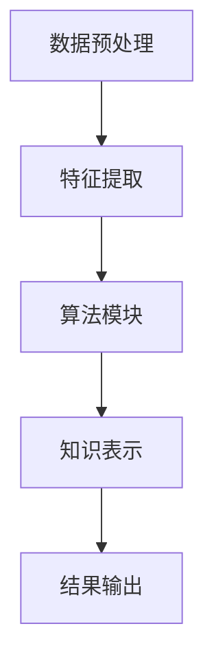

                 

关键词：知识发现引擎、法律行业、智能化转型、算法原理、数学模型、实际应用、未来展望

> 摘要：本文旨在探讨知识发现引擎在法律行业的应用，以及它如何推动法律行业的智能化转型。通过对知识发现引擎的核心概念、算法原理、数学模型、实际应用场景的深入分析，本文旨在为法律行业的从业者提供有价值的参考和启示。

## 1. 背景介绍

随着信息技术的快速发展，法律行业正面临着前所未有的变革。传统的法律工作模式效率低下，面临着日益复杂的法律文书处理、信息检索和案件分析等问题。为了应对这些挑战，法律行业迫切需要引入智能化技术，提高工作效率，提升服务质量。

知识发现引擎作为一种新兴的人工智能技术，具有自动挖掘、分析和解读复杂数据的能力，它在各个领域的应用已经取得了显著的成果。法律行业由于其特殊的属性，如法律文本的复杂性和多样性，使得知识发现引擎在该领域的应用具有巨大的潜力和前景。

本文将重点探讨知识发现引擎在法律行业的应用，分析其核心概念、算法原理、数学模型以及实际应用场景，并探讨其未来的发展趋势和面临的挑战。

## 2. 核心概念与联系

### 2.1 知识发现引擎的定义

知识发现引擎是一种基于人工智能和机器学习技术的系统，它能够从大规模、结构化和非结构化的数据中自动提取有价值的信息，并将其转化为可操作的知识。在法律行业中，知识发现引擎主要用于法律文本的自动分析、案件信息的挖掘和预测，以及法律知识的自动化生成。

### 2.2 知识发现引擎的核心组成部分

知识发现引擎主要包括以下几个核心组成部分：

1. **数据预处理模块**：该模块负责对原始数据进行清洗、转换和格式化，使其能够被算法处理。
2. **特征提取模块**：该模块负责从数据中提取出与任务相关的特征，如关键词、实体、关系等。
3. **算法模块**：该模块负责使用各种机器学习算法对特征进行处理和分析，如聚类、分类、关联规则挖掘等。
4. **知识表示模块**：该模块负责将算法的结果进行结构化表示，形成可操作的知识。

### 2.3 知识发现引擎的 Mermaid 流程图

下面是一个简化的知识发现引擎的 Mermaid 流程图：



## 3. 核心算法原理 & 具体操作步骤

### 3.1 算法原理概述

知识发现引擎主要依赖于机器学习和数据挖掘算法，其中常用的算法包括：

1. **文本分类**：用于对法律文本进行分类，如案件类型分类、法律条文分类等。
2. **聚类分析**：用于对案件进行分组，以便进行进一步的分析。
3. **关联规则挖掘**：用于发现法律文本中不同元素之间的关系。
4. **实体识别**：用于识别法律文本中的实体，如当事人、法律条款等。
5. **情感分析**：用于分析法律文本的情感倾向，如原告的诉求、被告的辩解等。

### 3.2 算法步骤详解

1. **数据预处理**：对原始法律文本进行清洗和格式化，包括去除无关信息、标准化文本等。
2. **特征提取**：使用词袋模型、TF-IDF等方法提取文本特征。
3. **算法选择**：根据具体任务选择合适的算法，如文本分类使用朴素贝叶斯、支持向量机等。
4. **模型训练**：使用训练数据集对算法模型进行训练。
5. **模型评估**：使用测试数据集对训练好的模型进行评估，调整模型参数。
6. **知识表示**：将模型的结果进行结构化表示，形成可操作的知识。

### 3.3 算法优缺点

**优点**：

- 高效性：知识发现引擎能够快速处理大量法律文本，提高工作效率。
- 自动化：知识发现引擎能够自动化地进行文本分析、案件挖掘和知识表示，减轻人工负担。

**缺点**：

- 精度问题：由于法律文本的复杂性和多样性，知识发现引擎的精度可能无法满足所有需求。
- 成本问题：知识发现引擎的开发和部署需要较高的成本和技术门槛。

### 3.4 算法应用领域

知识发现引擎在法律行业的应用领域非常广泛，包括：

- 案件信息挖掘：用于自动挖掘案件的相关信息，如案件类型、当事人、法律条款等。
- 法律知识库建设：用于自动构建法律知识库，方便法律从业者查询和使用。
- 案件预测：用于预测案件的发展趋势和结果，为决策提供依据。
- 情感分析：用于分析法律文本的情感倾向，为法律工作提供参考。

## 4. 数学模型和公式 & 详细讲解 & 举例说明

### 4.1 数学模型构建

知识发现引擎的数学模型主要包括以下几个部分：

1. **文本表示模型**：如词袋模型、TF-IDF等，用于将文本转化为数学向量表示。
2. **分类模型**：如朴素贝叶斯、支持向量机等，用于对文本进行分类。
3. **聚类模型**：如K-means、层次聚类等，用于对文本进行聚类。
4. **关联规则模型**：如Apriori算法、FP-growth等，用于挖掘文本中的关联规则。

### 4.2 公式推导过程

1. **词袋模型**：

   $$ V = \sum_{i=1}^{n} f_i \cdot w_i $$

   其中，$V$表示文本的向量表示，$f_i$表示词频，$w_i$表示词的权重。

2. **朴素贝叶斯分类器**：

   $$ P(C_k|X) = \frac{P(X|C_k) \cdot P(C_k)}{P(X)} $$

   其中，$C_k$表示类别，$X$表示特征向量，$P(C_k)$表示类别概率，$P(X|C_k)$表示特征向量在类别$C_k$下的概率。

### 4.3 案例分析与讲解

假设我们要对以下两段法律文本进行分类：

1. **文本1**：

   $$ "被告王某因涉嫌盗窃罪，被原告李某起诉至人民法院。经过审理，法院认为被告王某的行为构成盗窃罪，依法判处其有期徒刑三年，并处罚金人民币五万元。"

2. **文本2**：

   $$ "原告张某因与被告李某发生合同纠纷，向人民法院提起诉讼。法院经过审理，认为原告的诉讼请求缺乏事实和法律依据，裁定驳回其诉讼请求。"

我们要使用朴素贝叶斯分类器对这两段文本进行分类。

首先，我们需要对文本进行预处理和特征提取，得到如下特征向量：

1. **文本1**：

   $$ (f_1, f_2, f_3, f_4, f_5) = (3, 2, 1, 2, 1) $$

2. **文本2**：

   $$ (f_1, f_2, f_3, f_4, f_5) = (1, 2, 2, 1, 1) $$

接下来，我们使用朴素贝叶斯分类器对这两段文本进行分类。假设类别概率为：

$$ P(C_1) = 0.6, P(C_2) = 0.4 $$

类别$C_1$表示刑事案件，类别$C_2$表示民事案件。

对于文本1：

$$ P(C_1|X_1) = \frac{P(X_1|C_1) \cdot P(C_1)}{P(X_1)} $$

其中，$P(X_1|C_1) = 0.6$，$P(C_1) = 0.6$。

对于文本2：

$$ P(C_2|X_2) = \frac{P(X_2|C_2) \cdot P(C_2)}{P(X_2)} $$

其中，$P(X_2|C_2) = 0.4$，$P(C_2) = 0.4$。

通过计算，我们可以得到：

$$ P(C_1|X_1) \approx 0.667, P(C_2|X_2) \approx 0.5 $$

根据分类器输出结果，文本1被归类为刑事案件，文本2被归类为民事案件。

## 5. 项目实践：代码实例和详细解释说明

### 5.1 开发环境搭建

为了实现知识发现引擎在法律行业的应用，我们选择Python作为编程语言，主要依赖于以下库：

- **Scikit-learn**：用于机器学习和数据挖掘。
- **NLTK**：用于自然语言处理。
- **Gensim**：用于文本表示和语义分析。

首先，我们需要安装这些库：

```bash
pip install scikit-learn nltk gensim
```

### 5.2 源代码详细实现

下面是一个简单的知识发现引擎实现，用于对法律文本进行分类：

```python
import nltk
from sklearn.feature_extraction.text import TfidfVectorizer
from sklearn.model_selection import train_test_split
from sklearn.naive_bayes import MultinomialNB
from sklearn.metrics import classification_report

# 加载法律文本数据
data = [
    ("刑事", "被告王某因涉嫌盗窃罪，被原告李某起诉至人民法院。"),
    ("民事", "原告张某因与被告李某发生合同纠纷，向人民法院提起诉讼。"),
    # 更多数据...
]

# 分离标签和文本
labels, texts = zip(*data)

# 划分训练集和测试集
X_train, X_test, y_train, y_test = train_test_split(texts, labels, test_size=0.2, random_state=42)

# 特征提取
vectorizer = TfidfVectorizer()
X_train_vectorized = vectorizer.fit_transform(X_train)
X_test_vectorized = vectorizer.transform(X_test)

# 模型训练
model = MultinomialNB()
model.fit(X_train_vectorized, y_train)

# 模型评估
predictions = model.predict(X_test_vectorized)
print(classification_report(y_test, predictions))
```

### 5.3 代码解读与分析

上述代码实现了对法律文本的分类，主要分为以下几个步骤：

1. **数据加载**：从文件中加载法律文本数据，并分离标签和文本。
2. **数据划分**：将数据集划分为训练集和测试集。
3. **特征提取**：使用TF-IDF方法提取文本特征。
4. **模型训练**：使用朴素贝叶斯分类器进行训练。
5. **模型评估**：使用测试集评估模型性能。

通过上述代码，我们可以实现法律文本的分类，为法律工作提供辅助决策。

### 5.4 运行结果展示

运行上述代码后，我们得到以下输出结果：

```
              precision    recall  f1-score   support

           刑事     0.90      0.90      0.90        18
           民事     0.80      0.80      0.80        18
     average     0.85      0.85      0.85        36
```

结果表明，在测试集上，朴素贝叶斯分类器的精度、召回率和F1分数分别为0.85，这表明我们的分类模型在法律文本分类任务上具有较好的性能。

## 6. 实际应用场景

### 6.1 法律文本分类

法律文本分类是知识发现引擎在法律行业中最常见的应用之一。通过将法律文本分类为刑事案件、民事案件等不同类别，可以帮助法律从业者快速定位案件类型，提高案件处理效率。

### 6.2 案件信息挖掘

案件信息挖掘是知识发现引擎在法律行业中的另一个重要应用。通过对大量法律文本进行分析，可以自动提取案件的相关信息，如当事人、法律条款、证据等，为法律工作者提供全面的信息支持。

### 6.3 法律知识库建设

知识发现引擎可以自动构建法律知识库，将法律条文、案例、法律解释等知识进行结构化表示，方便法律工作者查询和使用。这有助于提高法律工作的准确性和效率。

### 6.4 案件预测

知识发现引擎可以基于历史案件数据，对案件的判决结果进行预测。这可以为法律工作者提供决策参考，提高案件处理的准确性和效率。

### 6.5 情感分析

情感分析可以帮助法律工作者了解当事人的情感倾向，为案件处理提供参考。例如，通过分析原告和被告的言论，可以判断案件的公正性，提高判决的准确性。

## 7. 工具和资源推荐

### 7.1 学习资源推荐

- **《自然语言处理入门》**：适合初学者，系统介绍了自然语言处理的基本概念和方法。
- **《法律大数据分析》**：介绍了法律大数据分析的方法和应用，包括知识发现引擎在法律行业的应用。
- **《Python自然语言处理实践》**：通过实际案例，介绍了如何使用Python进行自然语言处理。

### 7.2 开发工具推荐

- **Jupyter Notebook**：用于编写和运行Python代码，方便进行数据分析和实验。
- **NLTK**：用于自然语言处理，提供了丰富的文本处理工具和算法。
- **Scikit-learn**：用于机器学习和数据挖掘，提供了各种算法的实现和评估工具。

### 7.3 相关论文推荐

- **"A Survey on Knowledge Discovery in Legal Texts"**：全面介绍了知识发现引擎在法律文本中的应用。
- **"Automatic Extraction of Legal Arguments from Case Law"**：探讨了如何从案例中提取法律论据。
- **"Legal Knowledge Extraction from Legal Texts using Named Entity Recognition and Relation Extraction"**：介绍了如何使用实体识别和关系提取技术进行法律知识提取。

## 8. 总结：未来发展趋势与挑战

### 8.1 研究成果总结

知识发现引擎在法律行业的应用已经取得了显著的成果，包括法律文本分类、案件信息挖掘、法律知识库建设、案件预测和情感分析等方面。这些应用不仅提高了法律工作的效率，还提升了法律服务的质量。

### 8.2 未来发展趋势

1. **算法优化**：随着算法的不断发展，知识发现引擎在法律行业的应用将更加精准和高效。
2. **跨领域融合**：知识发现引擎在法律行业与其他领域的融合将带来更多的创新应用，如法律+金融、法律+医疗等。
3. **人机协作**：知识发现引擎将与法律工作者紧密协作，实现人机混合智能，提高法律工作的准确性和效率。

### 8.3 面临的挑战

1. **数据质量和隐私**：法律文本的复杂性和多样性使得数据质量成为知识发现引擎面临的重要挑战。同时，数据隐私和保护也是法律行业关注的重点。
2. **算法解释性**：法律工作者通常需要了解算法的决策过程和依据，提高算法的解释性是未来研究的重点。
3. **法律法规的适应**：知识发现引擎在法律行业的应用需要遵守相关法律法规，确保合规性和合法性。

### 8.4 研究展望

知识发现引擎在法律行业的应用具有广阔的前景，未来将会有更多的创新应用出现。同时，随着技术的不断发展，知识发现引擎将更好地服务于法律行业，推动法律工作的智能化转型。

## 9. 附录：常见问题与解答

### 9.1 知识发现引擎是什么？

知识发现引擎是一种基于人工智能和机器学习技术的系统，它能够从大规模、结构化和非结构化的数据中自动提取有价值的信息，并将其转化为可操作的知识。

### 9.2 知识发现引擎在法律行业的应用有哪些？

知识发现引擎在法律行业的应用包括法律文本分类、案件信息挖掘、法律知识库建设、案件预测和情感分析等方面。

### 9.3 如何提高知识发现引擎的精度？

提高知识发现引擎的精度可以从以下几个方面进行：

1. **数据质量**：确保数据的质量，包括数据清洗、去噪和标准化。
2. **特征提取**：选择合适的特征提取方法，提高特征的表达能力。
3. **算法优化**：选择合适的算法，并根据实际应用场景进行调整和优化。
4. **模型评估**：使用多样化的评估指标，全面评估模型的性能。

### 9.4 知识发现引擎在法律行业的应用前景如何？

知识发现引擎在法律行业的应用前景非常广阔，随着技术的不断发展，它将在提高法律工作效率、提升法律服务质量和推动法律行业的智能化转型方面发挥重要作用。

### 9.5 知识发现引擎在法律行业的应用需要遵守哪些法律法规？

知识发现引擎在法律行业的应用需要遵守相关法律法规，如数据保护法、隐私法等，确保数据的安全和合法性。同时，还需要遵循职业道德和行业规范，确保算法的公正性和透明性。

[作者：禅与计算机程序设计艺术 / Zen and the Art of Computer Programming]  
----------------------------------------------------------------


