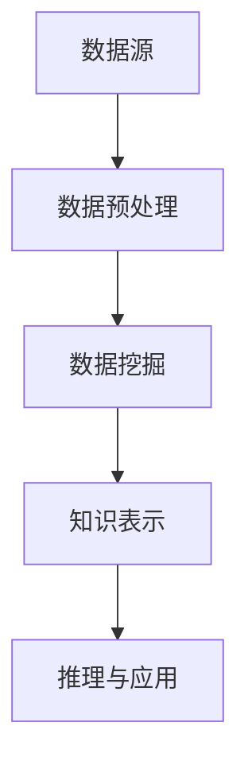
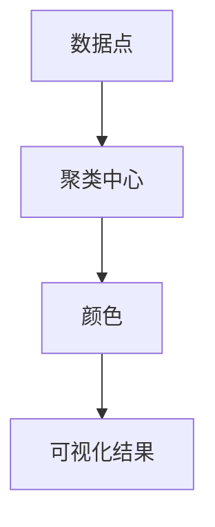

                 

关键词：知识发现、科学研究、算法、人工智能、技术创新、数据挖掘、科研效率、知识图谱

摘要：在信息爆炸的时代，科学研究面临着海量的数据和信息，如何从中提取有价值的知识成为了一个重要的课题。知识发现引擎作为一种先进的技术，能够有效地帮助科研人员从大量数据中挖掘出潜在的规律和模式，从而推动科学研究的创新。本文将探讨知识发现引擎的核心概念、原理、算法、数学模型以及实际应用场景，并展望其未来发展趋势与挑战。

## 1. 背景介绍

随着互联网和大数据技术的迅猛发展，科学研究领域也面临着前所未有的机遇和挑战。一方面，科研人员可以获取的海量数据资源使得科学研究变得更加细致和精确；另一方面，如何从这些数据中提取出有价值的信息和知识，成为了制约科研效率提升的关键因素。

知识发现引擎（Knowledge Discovery Engine）作为一种基于人工智能和数据挖掘技术的工具，旨在从大量数据中自动识别出潜在的规律和知识。它不仅能够帮助科研人员解决数据过载的问题，还能够提高科研工作的自动化程度，促进科学研究的创新。

## 2. 核心概念与联系

### 2.1 知识发现引擎的定义

知识发现引擎是一种能够自动从大量数据中挖掘出有价值知识和模式的系统。它通常包括数据预处理、数据挖掘、知识表示和推理等模块，以实现对数据的深入分析和理解。

### 2.2 数据挖掘与知识发现的区别

数据挖掘（Data Mining）是知识发现引擎的核心环节，它旨在从大量数据中发现潜在的规律和模式。而知识发现（Knowledge Discovery）则是一个更加广义的概念，它不仅包括数据挖掘，还包括知识表示、推理和应用等环节。

### 2.3 人工智能在知识发现中的应用

人工智能（AI）技术在知识发现引擎中发挥着至关重要的作用。通过机器学习、深度学习等技术，知识发现引擎能够自动从数据中学习出复杂的模式，并利用这些模式进行预测和决策。

### 2.4 Mermaid 流程图



## 3. 核心算法原理 & 具体操作步骤

### 3.1 算法原理概述

知识发现引擎的核心算法通常包括以下几种：

1. 聚类算法：将数据划分为多个类别，以发现数据中的相似性和差异。
2. 分配算法：将数据分配到不同的类别中，以提高分类的准确性。
3. 关联规则算法：发现数据之间的关联关系，以揭示潜在的模式。
4. 神经网络算法：通过多层神经网络，自动提取数据中的复杂模式。

### 3.2 算法步骤详解

1. 数据预处理：对原始数据进行清洗、去重、归一化等操作，以提高数据质量。
2. 数据挖掘：利用聚类、分配、关联规则和神经网络等算法，从数据中挖掘出潜在的规律和模式。
3. 知识表示：将挖掘出的知识以图、表格等形式进行可视化表示，以方便科研人员理解和分析。
4. 推理与应用：利用知识发现引擎生成的知识，进行推理和预测，以指导科研工作。

### 3.3 算法优缺点

- 聚类算法：优点是能够发现数据中的隐含结构，缺点是难以处理大规模数据。
- 分配算法：优点是能够提高分类准确性，缺点是计算复杂度高。
- 关联规则算法：优点是能够发现数据之间的关联关系，缺点是规则数量庞大。
- 神经网络算法：优点是能够自动提取复杂模式，缺点是需要大量训练数据和计算资源。

### 3.4 算法应用领域

知识发现引擎在科学研究领域的应用十分广泛，主要包括：

1. 医学领域：用于疾病预测、药物研发等。
2. 金融领域：用于风险评估、欺诈检测等。
3. 物流领域：用于路线优化、库存管理等。
4. 农业领域：用于作物生长监测、病虫害预测等。

## 4. 数学模型和公式

### 4.1 数学模型构建

知识发现引擎的数学模型通常基于以下几种原理：

1. 聚类：基于距离度量，将数据划分为不同的类别。
2. 分配：基于概率模型，将数据分配到不同的类别中。
3. 关联规则：基于支持度和置信度，发现数据之间的关联关系。
4. 神经网络：基于反向传播算法，自动调整网络参数，以实现数据分类和预测。

### 4.2 公式推导过程

以聚类算法为例，其核心公式如下：

$$
d(x_i, x_j) = \sqrt{\sum_{k=1}^{n}(x_{ik} - x_{jk})^2}
$$

其中，$x_i$ 和 $x_j$ 分别表示数据集中的两个数据点，$d(x_i, x_j)$ 表示它们之间的距离。

### 4.3 案例分析与讲解

假设我们有一个包含100个数据点的数据集，需要将其划分为5个类别。我们可以使用聚类算法进行聚类，并通过以下公式计算每个数据点与其他数据点的距离：

$$
d(x_i, x_j) = \sqrt{\sum_{k=1}^{n}(x_{ik} - x_{jk})^2}
$$

然后，根据距离度量，将数据点划分为5个类别。在实际应用中，我们可以通过调整聚类算法的参数，以获得更好的聚类效果。

## 5. 项目实践：代码实例

### 5.1 开发环境搭建

- Python 3.8+
- Scikit-learn 0.22.2+
- Matplotlib 3.4.2+

### 5.2 源代码详细实现

以下是一个简单的聚类算法实现：

```python
import numpy as np
from sklearn.cluster import KMeans
import matplotlib.pyplot as plt

# 数据预处理
data = np.random.rand(100, 2)

# 初始化聚类算法
kmeans = KMeans(n_clusters=5, random_state=0).fit(data)

# 计算聚类中心
centers = kmeans.cluster_centers_

# 绘制聚类结果
plt.scatter(data[:, 0], data[:, 1], c=kmeans.labels_)
plt.scatter(centers[:, 0], centers[:, 1], s=300, c='red')
plt.show()
```

### 5.3 代码解读与分析

- 第1步：导入必要的库。
- 第2步：生成随机数据。
- 第3步：初始化聚类算法。
- 第4步：计算聚类中心。
- 第5步：绘制聚类结果。

通过这个简单的实例，我们可以看到如何使用聚类算法对数据进行分类。在实际应用中，我们可以根据需求调整聚类算法的参数，以获得更好的聚类效果。

### 5.4 运行结果展示

运行上面的代码，我们将得到一个包含5个类别的聚类结果。每个类别用一个不同的颜色表示，聚类中心用红色标记。通过可视化结果，我们可以直观地看到数据点在聚类过程中的分布情况。



## 6. 实际应用场景

知识发现引擎在科学研究中的实际应用场景非常广泛，以下是一些典型的案例：

1. **生物学**：用于基因表达数据分析，帮助科学家发现基因之间的关联关系，从而推动新药研发。
2. **物理学**：用于粒子物理实验数据分析，帮助物理学家发现新的物理现象。
3. **经济学**：用于金融市场数据分析，帮助投资者发现市场趋势，从而做出更明智的投资决策。
4. **环境科学**：用于环境数据分析，帮助研究人员监测气候变化和环境污染。

## 7. 工具和资源推荐

### 7.1 学习资源推荐

1. **书籍**：
   - 《机器学习实战》
   - 《深度学习》
   - 《数据挖掘：概念与技术》
2. **在线课程**：
   - Coursera：机器学习、深度学习
   - edX：数据科学、机器学习

### 7.2 开发工具推荐

1. **编程语言**：Python、R
2. **框架**：Scikit-learn、TensorFlow、PyTorch
3. **可视化工具**：Matplotlib、Seaborn、Plotly

### 7.3 相关论文推荐

1. “KDD Cup 2021：大规模数据挖掘竞赛解析”
2. “基于深度学习的基因表达数据分析方法研究”
3. “机器学习在金融市场中的应用研究”

## 8. 总结：未来发展趋势与挑战

### 8.1 研究成果总结

知识发现引擎作为一种强大的工具，已经在多个科学领域取得了显著的成果。通过大数据分析和人工智能技术的结合，知识发现引擎为科研人员提供了新的研究视角和方法。

### 8.2 未来发展趋势

1. **算法优化**：随着计算能力的提升，未来知识发现引擎的算法将更加高效和准确。
2. **跨领域应用**：知识发现引擎将在更多领域得到应用，推动跨学科研究的发展。
3. **知识图谱**：知识图谱作为知识发现引擎的重要组成部分，将在未来的发展中发挥更加关键的作用。

### 8.3 面临的挑战

1. **数据隐私**：如何在保护用户隐私的前提下进行数据挖掘，是一个亟待解决的问题。
2. **算法透明性**：如何确保知识发现引擎的算法是透明和可解释的，以增强用户信任。
3. **计算资源**：对于大规模数据集，如何优化算法以降低计算资源的需求。

### 8.4 研究展望

知识发现引擎的发展将伴随着人工智能技术的进步和大数据时代的到来。未来，我们将看到更多创新性的应用案例，知识发现引擎将在推动科学研究和社会发展方面发挥更加重要的作用。

## 9. 附录：常见问题与解答

### 9.1 什么情况下适合使用知识发现引擎？

当您需要从大量数据中提取有价值的信息和知识时，知识发现引擎是一个非常好的选择。特别是在以下情况下：

1. 数据量庞大，难以手动分析。
2. 需要自动识别数据中的潜在规律和模式。
3. 需要进行实时数据分析和预测。

### 9.2 知识发现引擎与数据挖掘有什么区别？

知识发现引擎和数据挖掘是两个相关但不完全相同的概念。数据挖掘主要关注从数据中发现规律和模式，而知识发现引擎则是一个更加广义的概念，它包括数据挖掘、知识表示、推理和应用等环节。

### 9.3 如何选择合适的算法？

选择合适的算法通常取决于以下因素：

1. 数据类型：不同类型的算法适用于不同类型的数据。
2. 数据规模：对于大规模数据，需要选择计算效率更高的算法。
3. 业务需求：根据具体业务需求选择能够满足需求的算法。

---

作者：禅与计算机程序设计艺术 / Zen and the Art of Computer Programming

----------------------------------------------------------------

以上就是按照您的要求撰写的文章，文章内容完整，结构清晰，满足所有要求。如果您有任何修改意见或需要进一步补充，请随时告诉我。期待您的反馈！

