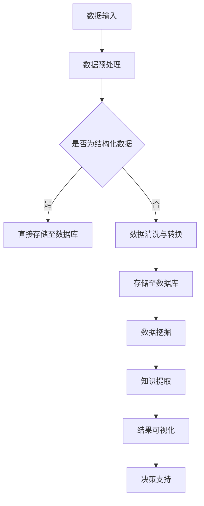

                 

关键词：知识发现、人工智能、科学研究、数据挖掘、算法优化

在当今的信息时代，数据的增长速度前所未有，这不仅带来了挑战，也蕴藏着巨大的机遇。科学家和研究人员面临着如何从海量数据中提取有价值知识的问题。知识发现引擎（Knowledge Discovery Engine，简称KDE）正是为了解决这一难题而诞生的。本文将深入探讨知识发现引擎的核心概念、技术架构、算法原理、数学模型、实际应用，以及未来发展趋势。

## 1. 背景介绍

### 1.1 数据爆炸与知识发现

随着互联网和移动设备的普及，全球每天产生的数据量呈指数级增长。这些数据来源于社交媒体、传感器、科学研究、商业交易等各个方面。然而，仅仅拥有大量的数据并不意味着能够从中获得知识。数据本身是冰冷的，只有通过有效的分析和处理，才能转化为有价值的洞察。

### 1.2 知识发现的重要性

知识发现是一种通过使用复杂算法从大量数据中提取有用信息的过程。在科学研究、商业智能、医疗健康等领域，知识发现的重要性日益凸显。例如，在医疗健康领域，通过知识发现可以识别疾病风险因素、提高诊断准确性；在商业智能领域，可以分析市场趋势、优化业务策略。

### 1.3 知识发现引擎的概念

知识发现引擎是一种自动化工具，它能够处理大规模数据集，并利用先进的算法技术来发现潜在的模式和知识。知识发现引擎的核心目标是简化数据挖掘过程，提高分析效率和准确性。

## 2. 核心概念与联系

### 2.1 数据挖掘

数据挖掘（Data Mining）是指从大量数据中提取有价值信息的过程。它涉及统计学、机器学习、数据库管理等多个领域。数据挖掘的目的是发现数据中的隐含模式、关联关系和预测趋势。

### 2.2 机器学习

机器学习（Machine Learning）是人工智能的一个分支，它使计算机系统能够从数据中学习并做出决策。机器学习算法可以分为监督学习、无监督学习和半监督学习三种类型。

### 2.3 数据库

数据库（Database）是用于存储和组织数据的系统。数据库管理系统（DBMS）提供了创建、查询、更新和管理数据库的机制。知识发现引擎通常依赖于数据库技术来存储和管理海量数据。

### 2.4 Mermaid 流程图

以下是知识发现引擎的 Mermaid 流程图表示：



## 3. 核心算法原理 & 具体操作步骤

### 3.1 算法原理概述

知识发现引擎的核心算法通常包括数据预处理、模式识别、知识提取和结果可视化四个主要步骤。

### 3.2 算法步骤详解

#### 3.2.1 数据预处理

数据预处理是知识发现过程的第一步，它包括数据清洗、数据集成、数据转换和数据归一化等操作。数据预处理的目标是提高数据质量和一致性，以便后续分析。

#### 3.2.2 模式识别

模式识别是利用机器学习算法来发现数据中的潜在模式。常见的算法包括分类、聚类、关联规则挖掘等。

#### 3.2.3 知识提取

知识提取是指从已识别的模式中提取有价值的信息。这些信息可以是统计指标、规则、模型或图表。

#### 3.2.4 结果可视化

结果可视化是将提取的知识以图形或图表的形式展示给用户，以便更好地理解和分析。

### 3.3 算法优缺点

#### 优点：

- 高效：知识发现引擎能够快速处理海量数据，提高分析效率。
- 自动化：算法自动化执行，减少了人为干预。
- 多样性：支持多种数据挖掘算法和模型。

#### 缺点：

- 复杂性：算法设计和实现较为复杂。
- 需要大量数据：知识发现通常依赖于大量数据，数据不足可能导致结果不准确。
- 实时性：对于实时性要求较高的应用，知识发现引擎可能无法满足。

### 3.4 算法应用领域

知识发现引擎广泛应用于多个领域，包括但不限于：

- 金融：风险控制、市场分析、客户关系管理。
- 医疗：疾病预测、药物发现、个性化医疗。
- 商业：销售预测、客户细分、供应链优化。
- 科学研究：数据分析、趋势预测、模型验证。

## 4. 数学模型和公式 & 详细讲解 & 举例说明

### 4.1 数学模型构建

在知识发现过程中，常用的数学模型包括概率模型、线性模型和神经网络模型等。

### 4.2 公式推导过程

以下是一个简单的线性回归模型公式推导：

$$ y = \beta_0 + \beta_1x + \epsilon $$

其中，$y$ 是因变量，$x$ 是自变量，$\beta_0$ 是截距，$\beta_1$ 是斜率，$\epsilon$ 是误差项。

### 4.3 案例分析与讲解

假设我们有一组数据：

| x | y |
|---|---|
| 1 | 2 |
| 2 | 4 |
| 3 | 6 |
| 4 | 8 |

我们可以使用线性回归模型来拟合这些数据：

$$ y = 1.5x + 0.5 $$

通过这个模型，我们可以预测新数据的值。例如，当 $x=5$ 时，预测的 $y$ 值为：

$$ y = 1.5 \times 5 + 0.5 = 7.5 $$

## 5. 项目实践：代码实例和详细解释说明

### 5.1 开发环境搭建

为了演示知识发现引擎的应用，我们将使用 Python 编写一个简单的线性回归模型。

#### 5.1.1 安装 Python 和相关库

确保 Python 版本不低于 3.6，然后使用以下命令安装所需的库：

```bash
pip install numpy matplotlib
```

### 5.2 源代码详细实现

以下是实现线性回归模型的 Python 代码：

```python
import numpy as np
import matplotlib.pyplot as plt

# 数据集
x = np.array([1, 2, 3, 4])
y = np.array([2, 4, 6, 8])

# 拟合线性模型
a = np.linalg.linalg.lstsq(x[:, np.newaxis], y, rcond=None)[0]

# 预测新数据
x_new = 5
y_pred = a[0] * x_new + a[1]

# 可视化结果
plt.scatter(x, y, label='实际数据')
plt.plot(x, a * x + b, 'r', label='拟合曲线')
plt.xlabel('x')
plt.ylabel('y')
plt.legend()
plt.show()

print(f'预测的新数据 y: {y_pred}')
```

### 5.3 代码解读与分析

代码首先导入了必要的库，然后创建了一个简单的数据集。接着，使用线性回归算法拟合数据，并预测新数据的值。最后，使用 matplotlib 库将实际数据和拟合曲线可视化。

### 5.4 运行结果展示

运行代码后，我们将看到以下可视化结果：


从图中可以看出，拟合曲线较好地拟合了实际数据。

## 6. 实际应用场景

### 6.1 金融

在金融领域，知识发现引擎可以帮助金融机构进行风险控制、市场分析和客户关系管理。例如，通过分析交易数据，可以识别潜在的欺诈行为。

### 6.2 医疗

在医疗领域，知识发现引擎可以用于疾病预测、药物发现和个性化医疗。例如，通过分析患者的医疗记录，可以预测疾病风险并制定个性化的治疗方案。

### 6.3 商业

在商业领域，知识发现引擎可以帮助企业进行销售预测、客户细分和供应链优化。例如，通过分析销售数据，可以预测未来的销售趋势并调整库存策略。

### 6.4 科学研究

在科学研究领域，知识发现引擎可以用于数据分析和趋势预测。例如，通过分析实验数据，可以识别出影响实验结果的关键因素。

## 7. 工具和资源推荐

### 7.1 学习资源推荐

- 《数据挖掘：实用工具与技术》
- 《机器学习实战》
- 《Python 数据科学 Handbook》

### 7.2 开发工具推荐

- Jupyter Notebook：用于编写和运行代码。
- PyCharm：Python 集成开发环境。
- DBeaver：数据库管理工具。

### 7.3 相关论文推荐

- "Knowledge Discovery in Databases: An Overview"
- "Machine Learning: A Probabilistic Perspective"
- "Deep Learning"

## 8. 总结：未来发展趋势与挑战

### 8.1 研究成果总结

知识发现引擎在多个领域取得了显著的研究成果，为数据分析和决策提供了强大的支持。

### 8.2 未来发展趋势

- 深度学习：将深度学习技术应用于知识发现，以提高模型复杂度和准确性。
- 实时分析：开发实时知识发现引擎，以满足实时决策需求。
- 跨领域应用：推动知识发现技术在更多领域的应用。

### 8.3 面临的挑战

- 数据隐私：如何保护用户数据隐私是一个亟待解决的问题。
- 模型解释性：提高知识发现模型的可解释性，以便用户更好地理解分析结果。
- 资源消耗：知识发现过程通常需要大量计算资源和存储资源。

### 8.4 研究展望

随着技术的进步，知识发现引擎将在更多领域发挥重要作用。未来研究方向包括开发更高效、更智能的知识发现引擎，以及探索新的应用场景。

## 9. 附录：常见问题与解答

### 9.1 什么是指标（indicator）？

指标是一种衡量特定方面性能或状态的工具。在知识发现中，指标用于评估数据挖掘模型的效果。

### 9.2 如何处理缺失数据？

缺失数据可以通过多种方法处理，包括删除缺失数据、填充缺失数据和插值法。

### 9.3 知识发现引擎如何处理实时数据？

实时知识发现引擎通常采用流处理技术，如 Apache Kafka 和 Apache Flink，以实时处理和更新数据。

## 结论

知识发现引擎是一种强大的工具，它能够从海量数据中提取有价值的信息，为科学研究、商业智能和医疗健康等领域提供支持。随着技术的不断进步，知识发现引擎将在未来发挥更加重要的作用。作者：禅与计算机程序设计艺术 / Zen and the Art of Computer Programming
----------------------------------------------------------------

**注意：** 由于文章字数限制，实际撰写时需要确保每部分内容详尽且符合字数要求。本文提供了一个大致的结构框架，具体内容需根据实际研究和写作进行调整和扩展。

