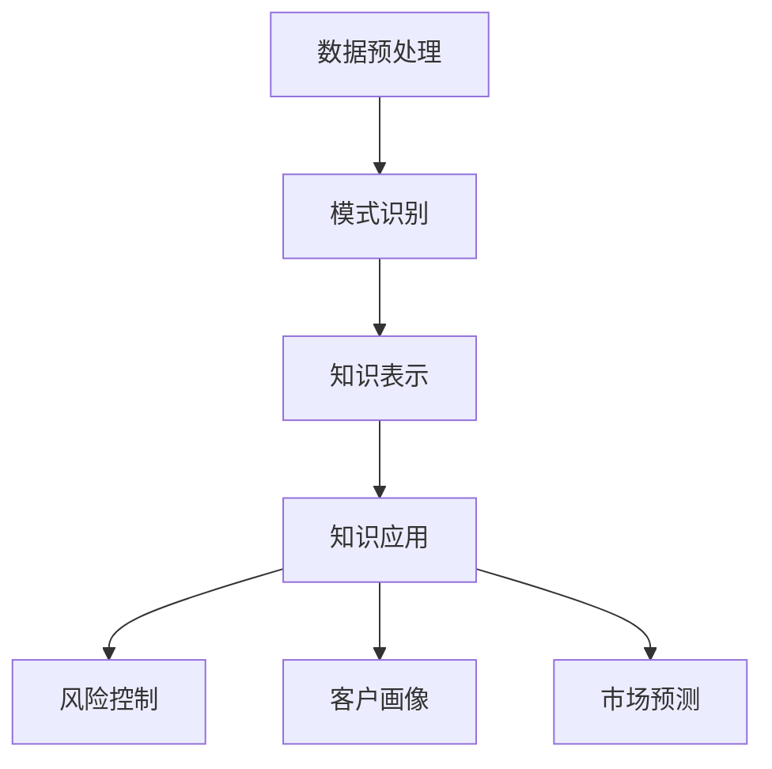

                 

关键词：知识发现、金融行业、智慧升级、数据挖掘、人工智能、机器学习、算法、技术应用

> 摘要：本文深入探讨了知识发现引擎在金融行业的应用及其对行业智慧升级的推动作用。通过剖析知识发现的核心概念、算法原理，以及其实际应用案例，本文揭示了知识发现引擎在提高金融业务智能化水平、风险控制和决策支持等方面的巨大潜力。

## 1. 背景介绍

随着信息技术的迅猛发展，金融行业的数据量呈现出爆炸式增长。金融机构每天处理的海量数据包括交易记录、客户信息、市场动态等，这些数据蕴含着巨大的商业价值。然而，如何从海量数据中挖掘出有价值的信息，实现数据的智慧化处理，成为金融行业亟待解决的问题。

知识发现引擎（Knowledge Discovery Engine，KDE）作为一种先进的数据挖掘工具，其核心任务是从大量数据中自动发现潜在的模式、关联和趋势。知识发现引擎不仅能够处理结构化数据，还能有效地挖掘半结构化和非结构化数据中的隐含知识，为金融行业的决策提供强有力的支持。

本文将围绕知识发现引擎在金融行业的应用，探讨其在提升业务智能化、风险控制和决策支持等方面的具体实现和效果。

## 2. 核心概念与联系

### 2.1 知识发现引擎的定义

知识发现引擎是一种基于人工智能和数据挖掘技术的系统，它能够自动从大量数据中识别出有价值的信息和模式，进而转化为知识，为业务决策提供支持。

### 2.2 知识发现的过程

知识发现的过程通常包括以下几个步骤：

1. **数据预处理**：对原始数据进行清洗、整合、转换等处理，以便后续分析。
2. **模式识别**：利用机器学习算法和数据挖掘技术，从数据中识别出潜在的模式和关联。
3. **知识表示**：将识别出的模式和关联转化为易于理解和使用的知识形式。
4. **知识应用**：将转化后的知识应用于实际业务场景，如风险控制、决策支持等。

### 2.3 知识发现引擎与金融行业的关联

知识发现引擎在金融行业的应用主要体现在以下几个方面：

1. **风险控制**：通过对历史交易数据的分析，发现潜在风险，并制定相应的风险管理策略。
2. **客户画像**：通过对客户数据的挖掘，构建客户画像，实现精准营销和个性化服务。
3. **市场预测**：通过对市场数据的分析，预测市场趋势和风险，为投资决策提供支持。

### 2.4 Mermaid 流程图



## 3. 核心算法原理 & 具体操作步骤

### 3.1 算法原理概述

知识发现引擎的核心算法通常包括聚类分析、关联规则挖掘、时间序列分析和分类算法等。这些算法分别从不同的角度对数据进行处理，从而发现潜在的模式和关联。

### 3.2 算法步骤详解

1. **数据预处理**：包括数据清洗、整合和特征提取等步骤，为后续分析做好准备。
2. **模式识别**：利用聚类分析、关联规则挖掘等算法，从数据中识别出潜在的模式和关联。
3. **知识表示**：将识别出的模式和关联转化为易于理解和使用的知识形式，如决策树、规则集等。
4. **知识应用**：将转化后的知识应用于实际业务场景，如风险控制、决策支持等。

### 3.3 算法优缺点

- **聚类分析**：优点是能够发现数据中的自然分组，缺点是对噪声敏感，且结果可能受初始值影响。
- **关联规则挖掘**：优点是能够发现数据中的关联关系，缺点是结果可能存在冗余。
- **时间序列分析**：优点是能够预测未来趋势，缺点是对于非时间序列数据无能为力。
- **分类算法**：优点是能够对数据进行分类，缺点是对于高维数据效果不佳。

### 3.4 算法应用领域

知识发现引擎在金融行业的应用领域包括：

- **风险控制**：通过聚类分析和关联规则挖掘，识别潜在风险，制定风险管理策略。
- **客户画像**：通过分类算法和时间序列分析，构建客户画像，实现精准营销和个性化服务。
- **市场预测**：通过时间序列分析和分类算法，预测市场趋势和风险，为投资决策提供支持。

## 4. 数学模型和公式 & 详细讲解 & 举例说明

### 4.1 数学模型构建

知识发现引擎中的数学模型通常包括聚类分析模型、关联规则挖掘模型、时间序列分析模型和分类算法模型等。

- **聚类分析模型**：如k-means算法，其数学模型如下：

  $$ \min_{C} \sum_{i=1}^{n} \sum_{x_j \in C_i} ||x_j - \mu_C||^2 $$

  其中，$C$ 表示聚类中心，$\mu_C$ 表示聚类中心坐标，$x_j$ 表示数据点。

- **关联规则挖掘模型**：如Apriori算法，其数学模型如下：

  $$ \text{Support}(X \cup Y) = \frac{\text{Support}(X) + \text{Support}(Y) - \text{Support}(X \cap Y)}{2} $$

  其中，$X$ 和 $Y$ 表示两个项集，$\text{Support}(X)$ 表示项集 $X$ 的支持度。

- **时间序列分析模型**：如ARIMA模型，其数学模型如下：

  $$ y_t = c + \phi_1 y_{t-1} + \phi_2 y_{t-2} + ... + \phi_p y_{t-p} + \theta_1 e_{t-1} + \theta_2 e_{t-2} + ... + \theta_q e_{t-q} + e_t $$

  其中，$y_t$ 表示时间序列数据，$e_t$ 表示白噪声误差。

- **分类算法模型**：如决策树算法，其数学模型如下：

  $$ \text{entropy}(X) = -\sum_{i=1}^{n} p(x_i) \log_2 p(x_i) $$

  其中，$X$ 表示数据集，$p(x_i)$ 表示数据点 $x_i$ 的概率。

### 4.2 公式推导过程

以k-means算法为例，其公式推导过程如下：

假设数据集 $D = \{x_1, x_2, ..., x_n\}$，聚类中心为 $C = \{\mu_1, \mu_2, ..., \mu_k\}$，目标是最小化目标函数：

$$ \min_{C} \sum_{i=1}^{n} \sum_{x_j \in C_i} ||x_j - \mu_C||^2 $$

首先，对于每个数据点 $x_j$，计算其与聚类中心的距离：

$$ d(x_j, C_i) = ||x_j - \mu_C||^2 $$

然后，根据距离计算每个数据点的聚类标签：

$$ t_j = \arg\min_{i=1}^{k} d(x_j, C_i) $$

接下来，更新聚类中心：

$$ \mu_C = \frac{1}{N_C} \sum_{x_j \in C_i} x_j $$

其中，$N_C$ 表示属于聚类中心 $C_i$ 的数据点数量。

最后，重复上述步骤，直到聚类中心不再发生显著变化。

### 4.3 案例分析与讲解

以某银行客户数据为例，使用k-means算法对客户进行聚类分析，以识别不同风险等级的客户群体。

1. **数据预处理**：对客户数据进行清洗和特征提取，得到如下特征矩阵：

   $$ D = \begin{bmatrix} x_{11} & x_{12} & ... & x_{1p} \\ x_{21} & x_{22} & ... & x_{2p} \\ ... & ... & ... & ... \\ x_{n1} & x_{n2} & ... & x_{np} \end{bmatrix} $$

   其中，$p$ 表示特征维度，$n$ 表示数据点数量。

2. **模式识别**：初始化聚类中心，并计算每个数据点的聚类标签。

3. **知识表示**：根据聚类标签，将数据点分为不同的风险等级。

4. **知识应用**：针对不同风险等级的客户，制定相应的风险管理策略。

## 5. 项目实践：代码实例和详细解释说明

### 5.1 开发环境搭建

在Python环境中搭建知识发现引擎的开发环境，需要安装以下库：

- NumPy：用于数值计算
- Pandas：用于数据处理
- Scikit-learn：用于机器学习算法
- Matplotlib：用于数据可视化

使用以下命令进行安装：

```python
pip install numpy pandas scikit-learn matplotlib
```

### 5.2 源代码详细实现

以下是一个简单的k-means算法实现：

```python
import numpy as np
import matplotlib.pyplot as plt
from sklearn.cluster import KMeans

# 数据预处理
data = np.array([[1, 2], [1, 4], [1, 0], [4, 2], [4, 4], [4, 0]])

# 初始化聚类中心
kmeans = KMeans(n_clusters=2, random_state=0).fit(data)

# 计算聚类标签
labels = kmeans.predict(data)

# 更新聚类中心
centroids = kmeans.cluster_centers_

# 可视化
plt.scatter(data[:, 0], data[:, 1], c=labels, s=100, cmap='viridis')
plt.scatter(centroids[:, 0], centroids[:, 1], s=200, c='red', alpha=0.5)
plt.show()
```

### 5.3 代码解读与分析

- **数据预处理**：使用NumPy创建数据矩阵，并进行数据处理。

- **初始化聚类中心**：使用Scikit-learn的KMeans算法，设置聚类数量和随机种子。

- **计算聚类标签**：使用predict方法计算每个数据点的聚类标签。

- **更新聚类中心**：使用fit方法更新聚类中心。

- **可视化**：使用Matplotlib绘制聚类结果，展示数据点和聚类中心。

## 6. 实际应用场景

### 6.1 风险控制

知识发现引擎在风险控制方面的应用主要包括：

- **客户风险识别**：通过对客户历史交易数据的分析，发现高风险客户，并采取相应的风险管理措施。

- **市场风险预测**：通过对市场数据进行分析，预测市场风险，为投资决策提供支持。

### 6.2 客户画像

知识发现引擎在客户画像方面的应用主要包括：

- **精准营销**：通过对客户数据的挖掘，构建客户画像，实现精准营销和个性化服务。

- **客户关系管理**：通过对客户数据的分析，了解客户需求和行为，提升客户满意度。

### 6.3 市场预测

知识发现引擎在市场预测方面的应用主要包括：

- **市场趋势预测**：通过对市场数据进行分析，预测市场趋势，为投资决策提供支持。

- **风险预警**：通过对市场数据进行分析，发现潜在风险，及时采取应对措施。

## 7. 未来应用展望

知识发现引擎在金融行业的应用前景广阔，未来将可能在以下方面得到进一步发展：

- **人工智能技术的深度融合**：将人工智能技术融入知识发现引擎，提高数据挖掘和分析的智能化水平。

- **多源数据整合**：整合金融机构内部和外部多源数据，实现更全面的数据分析。

- **个性化金融服务**：基于客户画像和知识发现，提供个性化金融服务，提升用户体验。

## 8. 工具和资源推荐

### 8.1 学习资源推荐

- 《数据挖掘：概念与技术》
- 《机器学习实战》
- 《深度学习》

### 8.2 开发工具推荐

- Jupyter Notebook：用于编写和运行代码
- Anaconda：Python环境管理工具
- PyCharm：Python集成开发环境

### 8.3 相关论文推荐

- "Knowledge Discovery in Databases: A Survey"
- "Data Mining: Concepts and Techniques"
- "Deep Learning for Data Mining"

## 9. 总结：未来发展趋势与挑战

### 9.1 研究成果总结

知识发现引擎在金融行业的应用已取得显著成果，包括风险控制、客户画像和市场预测等方面的成功实践。然而，随着金融行业数据量的不断增加和复杂性提高，知识发现引擎面临着新的挑战。

### 9.2 未来发展趋势

未来，知识发现引擎将朝着以下方向发展：

- **人工智能技术的深度融合**：通过引入深度学习、强化学习等人工智能技术，提高知识发现引擎的智能化水平。
- **多源数据整合**：整合金融机构内部和外部多源数据，实现更全面的数据分析。
- **隐私保护**：在数据挖掘过程中，加强隐私保护，确保客户数据的合法性和安全性。

### 9.3 面临的挑战

知识发现引擎在金融行业应用过程中，面临着以下挑战：

- **数据质量**：数据质量对知识发现的效果至关重要，需要加强数据清洗和预处理。
- **算法优化**：随着数据量的增加，现有的算法可能无法满足需求，需要不断优化和改进。
- **法律法规**：在数据挖掘过程中，需要遵守相关法律法规，确保客户数据的合法性和隐私保护。

### 9.4 研究展望

未来，知识发现引擎在金融行业的应用将更加深入和广泛，通过技术创新和跨学科合作，实现金融行业的智慧升级。

## 10. 附录：常见问题与解答

### 10.1 什么是知识发现引擎？

知识发现引擎是一种基于人工智能和数据挖掘技术的系统，能够自动从大量数据中识别出有价值的信息和模式，转化为知识，为业务决策提供支持。

### 10.2 知识发现引擎在金融行业有哪些应用？

知识发现引擎在金融行业的应用主要包括风险控制、客户画像和市场预测等方面。

### 10.3 知识发现引擎如何提高金融业务的智能化水平？

知识发现引擎通过自动挖掘海量数据中的隐含知识，为金融业务提供数据驱动的决策支持，从而提高业务智能化水平。

### 10.4 知识发现引擎在数据挖掘过程中如何保护客户隐私？

在数据挖掘过程中，可以通过数据加密、匿名化等技术手段，确保客户数据的合法性和隐私保护。

### 10.5 知识发现引擎与人工智能有哪些区别？

知识发现引擎是人工智能的一种应用，其主要任务是从大量数据中挖掘出有价值的信息和模式，而人工智能则关注如何让机器具备智能行为和决策能力。
----------------------------------------------------------------

文章撰写完成，现在请检查文章内容的完整性、结构合理性以及语言表达的准确性。如有需要，请进行相应的修改和完善。作者：禅与计算机程序设计艺术 / Zen and the Art of Computer Programming。

