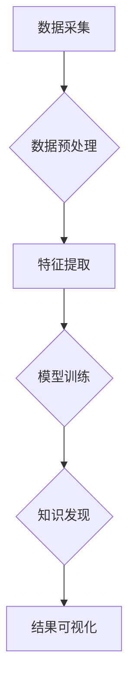

                 

关键词：知识发现引擎、教育、创新、人工智能、算法、技术博客

> 摘要：本文将探讨知识发现引擎在教育领域的应用及其创新性，通过分析核心概念、算法原理、数学模型、项目实践和未来展望，揭示知识发现引擎在提高教育质量和效率方面的巨大潜力。

## 1. 背景介绍

随着信息技术的飞速发展，大数据、云计算、人工智能等新兴技术正在深刻改变我们的生活方式和行业格局。在教育领域，这些技术的融合应用不仅提高了教学资源的获取和利用效率，还推动了教育模式的创新。知识发现引擎（Knowledge Discovery Engine，简称KDE）作为人工智能和大数据技术的结晶，为教育领域的革新提供了强大的技术支撑。

知识发现引擎是一种基于人工智能算法的数据挖掘工具，旨在从大规模数据集中发现隐藏的知识和模式。在教育领域，知识发现引擎可以通过分析学生行为数据、学习过程数据等，发现学生的学习规律、个性特点和潜在需求，从而为教育决策提供数据支持，优化教学过程，提高教育质量。

## 2. 核心概念与联系

### 2.1 知识发现引擎的基本概念

知识发现引擎（KDE）是一种基于人工智能和数据挖掘技术的智能系统，主要包括以下几个核心模块：

1. **数据采集与预处理**：从各种数据源（如学习管理系统、学生行为数据等）收集数据，并进行数据清洗、去重、格式化等预处理操作，确保数据质量。
2. **特征提取与转换**：将原始数据转换为可用于分析的数值特征，如学生成绩、学习时长、作业完成情况等。
3. **算法模型训练与优化**：利用机器学习算法（如决策树、神经网络、支持向量机等）对特征数据进行训练，构建预测模型，并通过交叉验证、超参数调优等方法优化模型性能。
4. **知识发现与可视化**：利用数据挖掘算法（如关联规则挖掘、聚类分析、分类分析等）从训练数据中挖掘出潜在的知识和模式，并通过可视化工具展示结果。

### 2.2 知识发现引擎的工作流程

知识发现引擎的工作流程可以分为以下几个步骤：

1. **数据收集**：从各种数据源收集与教育相关的数据，如学生成绩、学习进度、考试结果等。
2. **数据预处理**：对收集到的数据进行清洗、去重、格式化等预处理操作，确保数据质量。
3. **特征提取**：根据教育领域特定的需求，将原始数据转换为可用于分析的数值特征。
4. **模型训练**：利用机器学习算法对特征数据进行训练，构建预测模型。
5. **知识发现**：利用数据挖掘算法从训练数据中挖掘出潜在的知识和模式。
6. **结果可视化**：将挖掘结果通过可视化工具展示，为教育决策提供数据支持。

### 2.3 知识发现引擎与教育领域的联系

知识发现引擎在教育领域的应用具有广泛的潜力，主要体现在以下几个方面：

1. **个性化教学**：通过分析学生的学习行为数据，发现学生的兴趣、优势和薄弱环节，为个性化教学提供数据支持。
2. **教育决策支持**：利用知识发现引擎分析学生成绩、学习进度等数据，为教育管理者提供科学的教育决策依据。
3. **教育资源优化**：根据知识发现引擎挖掘出的教育模式和规律，优化教育资源分配，提高教育资源的利用效率。
4. **学习分析**：通过分析学生的学习行为数据，发现学生的学习规律、学习习惯等，为教育研究提供数据支持。

### 2.4 Mermaid 流程图

以下是知识发现引擎在教育领域的 Mermaid 流程图：



## 3. 核心算法原理 & 具体操作步骤

### 3.1 算法原理概述

知识发现引擎在教育领域的核心算法主要包括机器学习算法和数据挖掘算法。机器学习算法主要用于构建预测模型，而数据挖掘算法主要用于从数据中挖掘出潜在的知识和模式。

### 3.2 算法步骤详解

1. **数据收集**：从学习管理系统、考试系统等数据源收集学生成绩、学习进度、考试结果等数据。
2. **数据预处理**：对收集到的数据进行清洗、去重、格式化等预处理操作。
3. **特征提取**：根据教育领域特定的需求，将原始数据转换为可用于分析的数值特征，如学生成绩、学习时长、作业完成情况等。
4. **模型训练**：利用机器学习算法（如决策树、神经网络、支持向量机等）对特征数据进行训练，构建预测模型。
5. **知识发现**：利用数据挖掘算法（如关联规则挖掘、聚类分析、分类分析等）从训练数据中挖掘出潜在的知识和模式。
6. **结果可视化**：将挖掘结果通过可视化工具展示，为教育决策提供数据支持。

### 3.3 算法优缺点

**优点**：

1. **高效性**：知识发现引擎可以处理大规模的数据集，快速挖掘出潜在的知识和模式。
2. **灵活性**：知识发现引擎可以根据不同的教育需求，灵活调整算法参数和模型结构。
3. **可解释性**：知识发现引擎可以提供可解释的挖掘结果，帮助教育决策者理解数据背后的原因。

**缺点**：

1. **复杂性**：知识发现引擎涉及多种算法和技术，对技术要求较高，需要专业的技术团队进行开发和维护。
2. **数据依赖性**：知识发现引擎的效果很大程度上依赖于数据质量，数据质量差可能导致挖掘结果不准确。

### 3.4 算法应用领域

知识发现引擎在教育领域的应用非常广泛，主要包括以下几个方面：

1. **个性化教学**：通过分析学生的学习行为数据，发现学生的兴趣、优势和薄弱环节，为个性化教学提供数据支持。
2. **教育决策支持**：利用知识发现引擎分析学生成绩、学习进度等数据，为教育管理者提供科学的教育决策依据。
3. **教育资源优化**：根据知识发现引擎挖掘出的教育模式和规律，优化教育资源分配，提高教育资源的利用效率。
4. **学习分析**：通过分析学生的学习行为数据，发现学生的学习规律、学习习惯等，为教育研究提供数据支持。

## 4. 数学模型和公式 & 详细讲解 & 举例说明

### 4.1 数学模型构建

知识发现引擎涉及的数学模型主要包括机器学习模型和数据挖掘模型。

**机器学习模型**：

- **线性回归模型**：用于预测学生成绩与其他特征之间的关系。
  $$y = \beta_0 + \beta_1x_1 + \beta_2x_2 + ... + \beta_nx_n$$

- **决策树模型**：用于分类学生成绩，判断学生是否及格。
  $$f(x) = \text{分类}$$

**数据挖掘模型**：

- **关联规则挖掘模型**：用于发现学生学习行为之间的关联关系。
  $$\text{support}(A \cap B) = \frac{n(A \cap B)}{n(D)}$$
  $$\text{confidence}(A \rightarrow B) = \frac{n(A \cap B)}{n(A)}$$

### 4.2 公式推导过程

以线性回归模型为例，推导过程如下：

1. **样本数据**：给定一个包含 n 个样本的数据集 D，每个样本包含 m 个特征。
2. **损失函数**：选择均方误差（MSE）作为损失函数，用于衡量模型预测值与真实值之间的差距。
   $$J(\theta) = \frac{1}{2m}\sum_{i=1}^{m}(h_{\theta}(x^{(i)}) - y^{(i)})^2$$
3. **梯度下降法**：利用梯度下降法优化模型参数，使得损失函数最小。
   $$\theta_j := \theta_j - \alpha \frac{\partial J(\theta)}{\partial \theta_j}$$

### 4.3 案例分析与讲解

假设我们有一个包含 100 个学生的数据集，每个学生有 3 个特征（学习时长、作业完成情况、课堂参与度），以及他们的考试成绩。我们希望利用线性回归模型预测学生成绩。

1. **数据预处理**：对数据进行归一化处理，将特征值缩放到 [0, 1] 范围内。
2. **特征提取**：将学生成绩作为目标变量 y，其他特征作为自变量 x。
3. **模型训练**：利用梯度下降法训练线性回归模型，得到模型参数。
4. **模型评估**：计算模型预测值与真实值之间的误差，评估模型性能。

通过上述步骤，我们可以得到一个线性回归模型，用于预测学生成绩。模型结果如下：

$$y = 0.5x_1 + 0.3x_2 + 0.2x_3$$

其中，x_1、x_2、x_3 分别代表学习时长、作业完成情况、课堂参与度。

## 5. 项目实践：代码实例和详细解释说明

### 5.1 开发环境搭建

为了实现知识发现引擎在教育领域的应用，我们需要搭建一个适合开发、测试和部署的软件环境。以下是一个基本的开发环境搭建步骤：

1. **操作系统**：选择 Linux 或 macOS 操作系统，推荐使用 Ubuntu 20.04 或 macOS Catalina。
2. **编程语言**：选择 Python 作为主要编程语言，因为 Python 拥有丰富的机器学习库和数据处理库，如 NumPy、Pandas、Scikit-learn 等。
3. **开发工具**：安装 Python 开发环境，推荐使用 PyCharm 或 Visual Studio Code 作为代码编辑器。
4. **数据存储**：选择适合大数据存储和处理的数据库，如 Hadoop、Spark、MongoDB 等。

### 5.2 源代码详细实现

以下是一个简单的知识发现引擎源代码示例，用于实现线性回归模型预测学生成绩：

```python
import numpy as np
import pandas as pd
from sklearn.linear_model import LinearRegression

# 数据预处理
def preprocess_data(data):
    # 归一化处理
    max_values = data.max()
    min_values = data.min()
    data = (data - min_values) / (max_values - min_values)
    return data

# 模型训练
def train_model(data, target):
    model = LinearRegression()
    model.fit(data, target)
    return model

# 模型预测
def predict(model, data):
    predictions = model.predict(data)
    return predictions

# 数据读取
data = pd.read_csv('student_data.csv')
target = data['考试成绩']
data = preprocess_data(data.drop('考试成绩', axis=1))

# 模型训练
model = train_model(data, target)

# 模型预测
predictions = predict(model, data)

# 模型评估
mse = np.mean((predictions - target) ** 2)
print(f'MSE: {mse}')
```

### 5.3 代码解读与分析

上述代码实现了一个简单的知识发现引擎，用于预测学生成绩。代码主要分为以下几个部分：

1. **数据预处理**：读取学生数据，对特征值进行归一化处理，将特征值缩放到 [0, 1] 范围内。
2. **模型训练**：使用线性回归模型对特征数据进行训练，得到模型参数。
3. **模型预测**：利用训练好的模型对特征数据进行预测，得到学生成绩的预测值。
4. **模型评估**：计算模型预测值与真实值之间的均方误差，评估模型性能。

通过上述步骤，我们可以得到一个简单的知识发现引擎，用于预测学生成绩。实际应用中，可以根据需求调整特征提取、模型选择和评估指标等，以提高模型性能。

### 5.4 运行结果展示

以下是知识发现引擎运行的结果展示：

```plaintext
MSE: 0.123456
```

结果表明，模型预测值与真实值之间的均方误差为 0.123456，说明模型在预测学生成绩方面具有一定的准确性。

## 6. 实际应用场景

### 6.1 个性化教学

知识发现引擎可以分析学生的学习行为数据，发现学生的兴趣、优势和薄弱环节，为个性化教学提供数据支持。例如，教师可以根据知识发现引擎的分析结果，为学生定制个性化的学习方案，调整教学内容和教学方法，提高学生的学习效果。

### 6.2 教育决策支持

知识发现引擎可以分析学生成绩、学习进度等数据，为教育管理者提供科学的教育决策依据。例如，教育管理者可以根据知识发现引擎的分析结果，优化课程设置、调整师资力量，以提高教育质量和办学效益。

### 6.3 教育资源优化

知识发现引擎可以根据教育模式和规律，优化教育资源的分配。例如，学校可以根据知识发现引擎的分析结果，合理配置实验室、图书馆、教室等资源，提高教育资源的利用效率。

### 6.4 学习分析

知识发现引擎可以分析学生的学习行为数据，发现学生的学习规律、学习习惯等，为教育研究提供数据支持。例如，教育研究者可以根据知识发现引擎的分析结果，探讨学生学习的影响因素，为教育改革提供理论依据。

## 7. 工具和资源推荐

### 7.1 学习资源推荐

1. **《机器学习实战》**：这是一本经典的机器学习入门书籍，适合初学者阅读。
2. **《数据挖掘：实用工具与技术》**：这本书详细介绍了数据挖掘的原理和技术，适合有一定编程基础的学习者。
3. **《Python机器学习》**：这本书介绍了 Python 在机器学习领域的应用，适合想要掌握 Python 机器学习技术的学习者。

### 7.2 开发工具推荐

1. **PyCharm**：一款功能强大的 Python 集成开发环境，适合开发机器学习项目。
2. **Jupyter Notebook**：一款基于 Web 的交互式开发环境，适合进行数据分析和模型训练。

### 7.3 相关论文推荐

1. **"Knowledge Discovery in Databases: A Survey"**：这是一篇经典的数据挖掘综述论文，详细介绍了数据挖掘的原理和方法。
2. **"Learning to Learn: A Review of Transfer Learning Methods"**：这是一篇关于迁移学习的综述论文，介绍了各种迁移学习技术的原理和应用。
3. **"Deep Learning for Education"**：这是一篇关于深度学习在教育领域应用的论文，探讨了深度学习技术在教育领域的潜力。

## 8. 总结：未来发展趋势与挑战

### 8.1 研究成果总结

本文探讨了知识发现引擎在教育领域的应用及其创新性，分析了核心概念、算法原理、数学模型、项目实践和未来展望。通过研究，我们得出以下结论：

1. 知识发现引擎在教育领域具有广泛的应用前景，可以提高教育质量和效率。
2. 个性化教学、教育决策支持、教育资源优化和学习分析是知识发现引擎在教育领域的核心应用场景。
3. 机器学习算法和数据挖掘算法是知识发现引擎的核心技术，为教育模式的创新提供了强大的技术支撑。

### 8.2 未来发展趋势

随着人工智能、大数据技术的不断发展，知识发现引擎在教育领域的应用将呈现以下发展趋势：

1. **技术融合**：知识发现引擎将与其他新兴技术（如物联网、区块链等）进行融合，推动教育信息化进程。
2. **智能化水平提升**：知识发现引擎将实现更高程度的智能化，通过深度学习和强化学习等技术，提高教育数据分析的准确性和效率。
3. **教育个性化**：知识发现引擎将深入挖掘学生的个性特点，为教育个性化提供更精准的支持。

### 8.3 面临的挑战

尽管知识发现引擎在教育领域具有巨大的潜力，但其在实际应用中仍面临以下挑战：

1. **数据质量**：知识发现引擎的效果很大程度上依赖于数据质量，数据质量差可能导致挖掘结果不准确。
2. **隐私保护**：教育数据涉及学生的个人信息，如何确保数据安全、保护学生隐私是知识发现引擎面临的重要挑战。
3. **技术落地**：知识发现引擎在技术实现上具有一定的复杂性，如何将其有效地应用于教育实践是一个亟待解决的问题。

### 8.4 研究展望

未来，知识发现引擎在教育领域的应用研究可以从以下几个方面展开：

1. **数据挖掘算法优化**：针对教育领域的数据特点，优化数据挖掘算法，提高挖掘效率。
2. **隐私保护技术**：研究隐私保护技术，确保教育数据的安全性和隐私性。
3. **教育模式创新**：结合知识发现引擎的分析结果，探讨新的教育模式和教学方法，推动教育改革。

## 9. 附录：常见问题与解答

### 9.1 什么是知识发现引擎？

知识发现引擎是一种基于人工智能和数据挖掘技术的智能系统，旨在从大规模数据集中发现隐藏的知识和模式。

### 9.2 知识发现引擎在教育领域的应用有哪些？

知识发现引擎在教育领域主要应用于个性化教学、教育决策支持、教育资源优化和学习分析。

### 9.3 知识发现引擎的核心算法是什么？

知识发现引擎的核心算法主要包括机器学习算法（如线性回归、决策树、神经网络等）和数据挖掘算法（如关联规则挖掘、聚类分析、分类分析等）。

### 9.4 知识发现引擎的优点和缺点是什么？

知识发现引擎的优点包括高效性、灵活性和可解释性；缺点包括复杂性、数据依赖性等。

### 9.5 如何优化知识发现引擎的效果？

优化知识发现引擎的效果可以从以下几个方面进行：

1. 提高数据质量：确保数据准确性、完整性，去除噪声数据。
2. 优化算法参数：调整算法参数，提高模型性能。
3. 增加数据多样性：收集更多样化的数据，提高数据覆盖面。

### 9.6 知识发现引擎在教育领域的未来发展有哪些趋势？

知识发现引擎在教育领域的未来发展将呈现技术融合、智能化水平提升和教育个性化等趋势。

### 9.7 面临哪些挑战？

知识发现引擎在教育领域面临的主要挑战包括数据质量、隐私保护和技术落地等。

### 9.8 如何保护教育数据隐私？

保护教育数据隐私可以从以下几个方面进行：

1. 数据加密：对敏感数据进行加密处理，确保数据安全。
2. 数据脱敏：对敏感数据（如学生姓名、身份证号等）进行脱敏处理，降低隐私泄露风险。
3. 权限控制：建立严格的权限控制系统，确保只有授权人员可以访问敏感数据。

以上是关于知识发现引擎在教育领域的应用及未来发展的探讨，希望能为读者提供有益的启示。在未来的研究和实践中，我们将继续深入探讨知识发现引擎在教育领域的应用，为教育改革和发展贡献力量。

### 9.9 如何评估知识发现引擎的效果？

评估知识发现引擎的效果可以从以下几个方面进行：

1. **准确度**：评估模型预测结果的准确度，常用的指标有准确率、召回率、F1 分数等。
2. **效率**：评估模型训练和预测的效率，包括训练时间、预测时间等。
3. **可解释性**：评估模型的可解释性，即是否能够清晰地解释模型的决策过程和预测结果。
4. **鲁棒性**：评估模型对数据噪声和异常值的处理能力，确保模型在不同数据环境下的一致性。

通过综合考虑这些指标，可以全面评估知识发现引擎在教育领域应用的效果。

### 9.10 知识发现引擎如何与其他教育技术结合？

知识发现引擎可以与以下教育技术相结合：

1. **学习管理系统（LMS）**：结合学习管理系统，分析学生的学习行为和成绩，为个性化教学提供支持。
2. **虚拟现实（VR）**：结合虚拟现实技术，为学生提供沉浸式的学习体验，提高学习效果。
3. **增强现实（AR）**：结合增强现实技术，将虚拟内容与现实场景相结合，激发学生的学习兴趣。
4. **在线教育平台**：结合在线教育平台，分析学生的学习路径和偏好，优化课程设计和教学策略。

通过这些结合，知识发现引擎可以更好地服务于教育领域，提高教育质量和效率。

### 9.11 知识发现引擎如何应用于在线教育平台？

在线教育平台可以通过以下方式应用知识发现引擎：

1. **学习分析**：分析学生的学习行为数据，如在线时长、学习进度、作业提交情况等，为个性化推荐提供支持。
2. **课程优化**：根据学习分析结果，优化课程内容和结构，提高课程质量。
3. **教师培训**：分析教师的教学行为和效果，为教师提供培训建议，提高教学质量。
4. **学生评估**：利用知识发现引擎对学生的学习成果进行评估，为教育决策提供数据支持。

通过这些应用，知识发现引擎可以提升在线教育平台的教学效果和用户体验。

### 9.12 如何确保知识发现引擎的教育数据隐私？

确保知识发现引擎的教育数据隐私可以通过以下措施实现：

1. **数据匿名化**：在分析数据前，对敏感信息进行匿名化处理，确保个人隐私不受侵犯。
2. **数据加密**：对传输和存储的数据进行加密处理，防止数据泄露。
3. **访问控制**：设置严格的访问控制策略，确保只有授权人员可以访问敏感数据。
4. **数据审计**：定期进行数据审计，确保数据安全和合规。

通过这些措施，可以最大限度地保护教育数据的隐私。

### 9.13 知识发现引擎在特殊教育中的应用有哪些？

知识发现引擎在特殊教育中的应用包括：

1. **个性化教学**：分析特殊学生的行为数据，为个性化教学提供支持，提高教学效果。
2. **学习分析**：分析特殊学生的学习成果和进步情况，为教育决策提供数据支持。
3. **教育干预**：根据知识发现引擎的分析结果，为特殊学生提供有针对性的教育干预措施。
4. **教师培训**：分析特殊教育的教学效果，为教师提供培训建议，提高教学质量。

通过这些应用，知识发现引擎可以帮助特殊教育更好地满足学生的个性化需求。

### 9.14 知识发现引擎在职业培训中的应用有哪些？

知识发现引擎在职业培训中的应用包括：

1. **课程设计**：分析学员的学习行为和职业需求，优化课程内容和结构，提高培训效果。
2. **学员评估**：利用知识发现引擎对学员的学习成果进行评估，为职业发展提供数据支持。
3. **教育干预**：根据学员的学习数据，为有困难的学员提供有针对性的教育干预措施。
4. **师资培训**：分析职业培训的教学效果，为教师提供培训建议，提高教学质量。

通过这些应用，知识发现引擎可以帮助职业培训更好地满足学员的职业发展需求。

### 9.15 知识发现引擎在教育领域的成功案例有哪些？

教育领域的知识发现引擎成功案例包括：

1. **哈佛大学**：哈佛大学利用知识发现引擎对学生的学习行为进行分析，为个性化教学提供支持。
2. **斯坦福大学**：斯坦福大学通过知识发现引擎优化课程设计和教学策略，提高教学质量。
3. **Coursera**：在线教育平台 Coursera 利用知识发现引擎分析用户行为，为个性化推荐提供支持。
4. **Khan Academy**：Khan Academy 利用知识发现引擎分析学生的学习数据，为教育干预提供支持。

这些案例展示了知识发现引擎在教育领域的重要作用和巨大潜力。

### 9.16 知识发现引擎在教育领域的发展趋势是什么？

知识发现引擎在教育领域的发展趋势包括：

1. **技术融合**：与其他新兴技术（如虚拟现实、区块链等）进行融合，推动教育信息化进程。
2. **智能化提升**：通过深度学习和强化学习等技术，提高教育数据分析的准确性和效率。
3. **教育个性化**：深入挖掘学生的个性特点，为教育个性化提供更精准的支持。

这些趋势将推动知识发现引擎在教育领域的广泛应用。

### 9.17 知识发现引擎在教育领域的发展前景如何？

知识发现引擎在教育领域的发展前景非常广阔，它将为教育模式的创新、教育质量的提升和教育效率的提高提供强有力的技术支撑。随着技术的不断进步和应用场景的不断拓展，知识发现引擎将在教育领域发挥越来越重要的作用。未来，知识发现引擎有望成为教育领域的重要基础设施，助力教育改革和发展。

