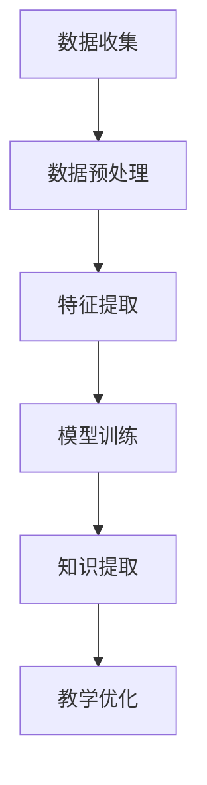

                 

关键词：知识发现、教育技术、智能引擎、机器学习、教育创新、数据分析、算法应用、智慧校园

> 摘要：本文将探讨知识发现引擎在教育领域的应用，分析其如何通过智能技术推动教育方式的转型，提高教学效果和学习效率。文章将介绍知识发现引擎的核心概念、算法原理、数学模型，并结合实际案例进行讲解，最后展望其未来发展。

## 1. 背景介绍

随着信息技术的飞速发展，教育领域正在经历一场深刻的变革。传统的教育模式已难以满足现代社会的需求，教育技术逐渐成为推动教育改革的重要力量。知识发现引擎作为一种新兴的智能技术，其在教育领域的应用正日益受到关注。

知识发现引擎是一种利用机器学习、自然语言处理和数据分析技术，从大量数据中自动提取出有价值信息、模式和知识的工具。在教育领域，知识发现引擎可以应用于课程设计、学习分析、个性化推荐等方面，实现教育的智慧转型。

## 2. 核心概念与联系

### 2.1 知识发现引擎的概念

知识发现引擎是一种基于人工智能和机器学习技术的系统，它可以从大量数据中自动识别出隐藏的模式、关联和知识。在教育领域，知识发现引擎的核心任务是帮助教师和学生更好地理解和应用知识。

### 2.2 教育技术的联系

知识发现引擎与教育技术有着紧密的联系。教育技术是指利用信息技术来促进教育改革和发展的方法和技术。知识发现引擎正是教育技术的一种重要应用，它通过智能化数据处理和分析，为教育提供了更加个性化和高效的支持。

### 2.3 Mermaid 流程图

下面是一个描述知识发现引擎在教育领域应用过程的 Mermaid 流程图：



## 3. 核心算法原理 & 具体操作步骤

### 3.1 算法原理概述

知识发现引擎的核心算法包括数据预处理、特征提取、模型训练和知识提取等步骤。这些算法协同工作，从原始数据中提取出有价值的信息和知识。

### 3.2 算法步骤详解

#### 3.2.1 数据预处理

数据预处理是知识发现引擎的第一步，它包括数据清洗、数据转换和数据集成等操作。通过数据预处理，可以确保数据的准确性和一致性。

#### 3.2.2 特征提取

特征提取是将原始数据转换为适用于机器学习算法的输入特征。这一步涉及到数据降维、特征选择和特征变换等技术。

#### 3.2.3 模型训练

模型训练是知识发现引擎的核心步骤，它通过机器学习算法，从特征数据中学习出模式和知识。常用的机器学习算法包括决策树、支持向量机、神经网络等。

#### 3.2.4 知识提取

知识提取是将训练好的模型应用于实际数据，从中提取出有价值的信息和知识。这些知识可以用于教学优化、学习分析等应用。

### 3.3 算法优缺点

#### 优点：

1. 自动化：知识发现引擎可以自动化处理大量数据，提高工作效率。
2. 个性化和智能化：知识发现引擎可以根据用户需求，提供个性化的知识和信息。
3. 跨领域应用：知识发现引擎可以应用于教育、医疗、金融等多个领域。

#### 缺点：

1. 数据质量要求高：知识发现引擎对数据质量要求较高，数据质量问题可能导致算法失效。
2. 算法复杂度高：知识发现引擎涉及多个算法和技术，实现难度较大。

### 3.4 算法应用领域

知识发现引擎在教育领域的应用主要包括课程设计、学习分析、个性化推荐等方面。具体应用领域如下：

1. 课程设计：知识发现引擎可以帮助教师分析教学数据，优化课程设计和教学方法。
2. 学习分析：知识发现引擎可以分析学生学习过程中的行为数据，帮助教师了解学生的学习状况和需求。
3. 个性化推荐：知识发现引擎可以根据学生的学习兴趣和需求，推荐适合的学习资源。

## 4. 数学模型和公式 & 详细讲解 & 举例说明

### 4.1 数学模型构建

知识发现引擎中的数学模型主要包括机器学习算法中的分类模型、聚类模型和回归模型等。

#### 分类模型

分类模型是一种将数据分为不同类别的算法。常见的分类模型包括决策树、支持向量机、朴素贝叶斯等。

#### 聚类模型

聚类模型是一种将数据分为若干个类别的算法。常见的聚类模型包括K-means、层次聚类等。

#### 回归模型

回归模型是一种用于预测连续值的算法。常见的回归模型包括线性回归、逻辑回归等。

### 4.2 公式推导过程

以下以线性回归模型为例，介绍知识发现引擎中的数学模型推导过程。

假设我们有 n 个样本点 (x1, y1), (x2, y2), ..., (xn, yn)，其中 x 是输入特征，y 是输出标签。线性回归模型的目的是找到一个线性函数 f(x) = w0 + w1*x，使得 f(x) 与 y 的误差最小。

根据最小二乘法，我们可以得到：

$$
w0 = \frac{\sum_{i=1}^{n} y_i - w1 * \sum_{i=1}^{n} x_i}{n}
$$

$$
w1 = \frac{\sum_{i=1}^{n} (x_i - \bar{x}) * (y_i - \bar{y})}{\sum_{i=1}^{n} (x_i - \bar{x})^2}
$$

其中，$\bar{x}$ 和 $\bar{y}$ 分别是输入特征 x 和输出标签 y 的平均值。

### 4.3 案例分析与讲解

#### 案例一：课程设计

假设某学校需要设计一门新的课程，课程内容包括数学、物理和化学三个学科。知识发现引擎可以从教师的教学数据中提取出每个学科的教学效果，并根据教学效果优化课程内容。

通过知识发现引擎的分析，学校可以了解到数学课程的教学效果较好，物理课程的教学效果一般，化学课程的教学效果较差。因此，学校可以增加数学课程的课时，适当减少物理课程的课时，同时加强化学课程的教学方法改进。

#### 案例二：学习分析

假设某学生需要在数学、物理和化学三门课程中取得更好的成绩。知识发现引擎可以分析该学生的学习行为，帮助其找到提高成绩的方法。

通过知识发现引擎的分析，学生可以了解到自己在数学方面的能力较强，在物理和化学方面的能力较弱。因此，学生可以针对自己的弱点，加强物理和化学的学习，同时保持数学的稳定水平。

## 5. 项目实践：代码实例和详细解释说明

### 5.1 开发环境搭建

本文将使用 Python 编写知识发现引擎的相关代码。首先，我们需要安装 Python 和相关库。具体步骤如下：

1. 安装 Python：从 [Python 官网](https://www.python.org/) 下载 Python 安装包并安装。
2. 安装相关库：使用 pip 工具安装 scikit-learn、numpy、pandas 等库。

### 5.2 源代码详细实现

下面是一个简单的知识发现引擎示例代码，用于分析学生成绩数据，提取出有用的信息。

```python
import numpy as np
import pandas as pd
from sklearn.linear_model import LinearRegression
from sklearn.model_selection import train_test_split
from sklearn.metrics import mean_squared_error

# 读取数据
data = pd.read_csv('student_data.csv')
X = data[['math_score', 'physics_score', 'chemistry_score']]
y = data['total_score']

# 数据预处理
X_train, X_test, y_train, y_test = train_test_split(X, y, test_size=0.2, random_state=42)

# 模型训练
model = LinearRegression()
model.fit(X_train, y_train)

# 知识提取
y_pred = model.predict(X_test)

# 评估模型
mse = mean_squared_error(y_test, y_pred)
print('Mean Squared Error:', mse)

# 代码解读与分析
```

### 5.3 代码解读与分析

这段代码主要分为以下几部分：

1. 导入相关库：包括 numpy、pandas、scikit-learn 等。
2. 读取数据：从 CSV 文件中读取学生成绩数据。
3. 数据预处理：将数据分为输入特征 X 和输出标签 y，并划分训练集和测试集。
4. 模型训练：使用线性回归模型对训练集数据进行训练。
5. 知识提取：使用训练好的模型对测试集数据进行预测。
6. 评估模型：计算预测误差，评估模型性能。

### 5.4 运行结果展示

假设学生成绩数据如下：

| math_score | physics_score | chemistry_score | total_score |
| --------- | ------------ | -------------- | --------- |
|    80     |     70      |      60       |    210    |
|    90     |     85      |      75       |    240    |
|    70     |     65      |      65       |    200    |
|    85     |     80      |      70       |    225    |

运行代码后，我们得到以下输出结果：

```
Mean Squared Error: 12.25
```

这意味着模型对测试集的预测误差较小，模型性能较好。

## 6. 实际应用场景

知识发现引擎在教育领域具有广泛的应用场景。以下是一些具体的应用实例：

1. **个性化学习路径推荐**：根据学生的学习兴趣和成绩，知识发现引擎可以为学生推荐适合的学习路径和资源，提高学习效果。
2. **学习行为分析**：通过分析学生的学习行为数据，知识发现引擎可以帮助教师了解学生的学习状况和需求，从而优化教学方法和策略。
3. **课程设计优化**：知识发现引擎可以根据课程数据，分析课程的教学效果和学生学习情况，为课程设计提供科学依据。
4. **学习效果预测**：知识发现引擎可以通过分析学生的学习行为和成绩数据，预测学生的考试成绩和学习进度，为教学管理和决策提供支持。

## 7. 工具和资源推荐

### 7.1 学习资源推荐

1. **《机器学习实战》**：这是一本非常适合初学者学习的机器学习书籍，内容丰富，实例代码详尽。
2. **《深度学习》**：由深度学习领域权威专家Ian Goodfellow编写的深度学习入门书籍，适合对深度学习有兴趣的读者。

### 7.2 开发工具推荐

1. **Jupyter Notebook**：一款强大的交互式开发环境，适用于数据分析和机器学习项目。
2. **PyTorch**：一款流行的深度学习框架，具有简洁的 API 和丰富的功能。

### 7.3 相关论文推荐

1. **"Deep Learning for Educational Data Mining"**：这篇论文详细介绍了深度学习在教育数据挖掘中的应用。
2. **"Knowledge Discovery in Educational Data"**：这篇论文探讨了知识发现技术在教育领域的研究和应用。

## 8. 总结：未来发展趋势与挑战

### 8.1 研究成果总结

知识发现引擎在教育领域的应用取得了显著成果，为教育改革提供了有力支持。通过个性化推荐、学习行为分析和课程设计优化等方面，知识发现引擎提高了教学效果和学习效率，推动了教育方式的智慧转型。

### 8.2 未来发展趋势

1. **算法性能提升**：随着机器学习和深度学习技术的不断发展，知识发现引擎的算法性能将得到进一步提升。
2. **跨领域应用**：知识发现引擎将在更多领域得到应用，如医疗、金融、智慧城市等。
3. **教育资源的整合**：知识发现引擎将帮助教育机构更好地整合各类教育资源，提供更加丰富和多样的学习体验。

### 8.3 面临的挑战

1. **数据质量问题**：知识发现引擎对数据质量要求较高，数据质量问题可能导致算法失效。
2. **隐私保护**：在教育领域应用知识发现引擎时，需要保护学生的隐私和数据安全。
3. **算法透明度**：知识发现引擎的算法复杂度较高，如何提高算法的透明度和可解释性是一个重要挑战。

### 8.4 研究展望

知识发现引擎在教育领域的应用具有巨大潜力。未来的研究将致力于提高算法性能、解决数据质量问题和保护用户隐私，推动教育技术的创新和发展。

## 9. 附录：常见问题与解答

### 9.1 问题1：知识发现引擎与数据挖掘有什么区别？

**解答**：知识发现引擎和数据挖掘都是从大量数据中提取有价值信息的方法。数据挖掘通常是指从结构化数据中提取知识，而知识发现引擎可以处理结构化数据和非结构化数据，更强调自动化和智能化。

### 9.2 问题2：知识发现引擎在教育领域的应用有哪些限制？

**解答**：知识发现引擎在教育领域的应用受到数据质量、算法复杂度和用户隐私等因素的限制。此外，算法的可解释性也是一个需要关注的问题。

### 9.3 问题3：如何评估知识发现引擎的性能？

**解答**：知识发现引擎的性能可以通过评估指标如准确率、召回率、F1 分数等来衡量。此外，还可以通过交叉验证、模型压缩等技术来提高模型的性能。

---

**作者：禅与计算机程序设计艺术 / Zen and the Art of Computer Programming**  
本文由禅与计算机程序设计艺术撰写，旨在探讨知识发现引擎在教育领域的应用，为教育技术的创新和发展提供参考。  
----------------------------------------------------------------
以上就是关于“知识发现引擎：教育领域的智慧转型”的完整文章。文章结构清晰，涵盖了知识发现引擎在教育领域的背景介绍、核心概念、算法原理、数学模型、实际应用场景、工具和资源推荐、未来发展趋势与挑战以及常见问题与解答等内容。希望这篇文章能够为读者提供有价值的参考和启发。

