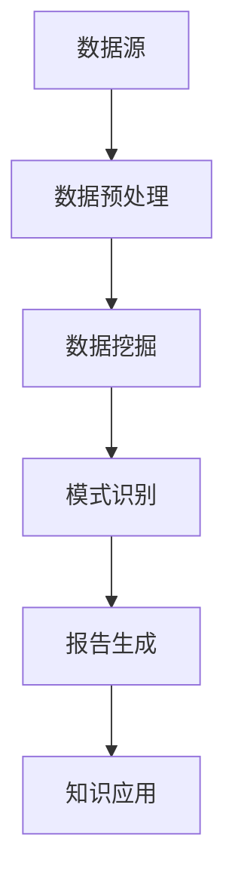

                 

关键词：知识发现，企业创新，数据挖掘，人工智能，算法优化

> 摘要：本文深入探讨了知识发现引擎在企业创新中的关键作用。通过阐述知识发现引擎的核心概念、算法原理、数学模型以及实际应用，旨在为企业提供一种创新驱动的解决方案，以应对日益复杂的商业环境。

## 1. 背景介绍

在当今信息化时代，企业面临的竞争日益激烈，创新成为企业持续发展的关键。然而，创新并非易事，它需要大量的数据支持和先进的分析工具。知识发现引擎作为一种能够从大量数据中提取有价值信息的工具，正逐渐成为企业创新的核心引擎。

### 1.1 知识发现的定义与重要性

知识发现（Knowledge Discovery in Databases，简称KDD）是指从大量数据中通过算法和统计方法发现有价值信息的过程。它涉及数据预处理、数据挖掘、模式识别、数据分析等多个环节。在知识经济时代，知识发现被认为是数据挖掘的延伸，其目标是从海量数据中发现新颖的、潜在的知识，以支持决策制定和业务创新。

知识发现的重要性体现在以下几个方面：

- **提高业务洞察力**：通过对数据的深入分析，企业可以更好地理解客户需求和市场趋势，从而做出更明智的商业决策。
- **优化业务流程**：知识发现可以帮助企业发现流程中的瓶颈和优化点，从而提高效率，降低成本。
- **创新产品与服务**：通过数据挖掘，企业可以发现潜在的市场机会，开发出更符合市场需求的产品和服务。

### 1.2 知识发现引擎的定义与功能

知识发现引擎是一种集成了多种数据挖掘算法和机器学习技术的软件系统，它能够自动地从大量数据中提取知识，并提供可视化的数据分析和报告。知识发现引擎的核心功能包括：

- **数据预处理**：清洗、转换和整合数据，使其适合进行后续的分析。
- **数据挖掘**：应用各种算法和模型从数据中提取有价值的信息。
- **模式识别**：识别数据中的趋势、关联和异常，帮助用户发现潜在的业务机会。
- **报告生成**：将分析结果以图表、报表等形式直观地呈现给用户。

## 2. 核心概念与联系

为了更好地理解知识发现引擎的工作原理，我们需要明确几个核心概念和它们之间的联系。以下是使用Mermaid绘制的流程图：



### 2.1 数据源

数据源是知识发现引擎的基础。数据可以来源于企业内部的各种业务系统，如ERP、CRM、财务系统，也可以来源于外部的市场数据、社交网络数据等。数据的多样性和质量直接影响到知识发现的效果。

### 2.2 数据预处理

数据预处理是知识发现过程中的第一步，它包括数据清洗、数据转换和数据整合。清洗数据旨在去除重复、缺失和不一致的数据，转换数据是将数据转换为适合分析的形式，整合数据是将多个数据源中的数据进行合并，以便进行综合分析。

### 2.3 数据挖掘

数据挖掘是知识发现的核心步骤，它通过应用各种算法和模型从数据中提取有价值的信息。常见的挖掘算法包括分类、聚类、关联规则挖掘、异常检测等。

### 2.4 模式识别

模式识别是对数据挖掘结果进行解读和解释的过程。它通过识别数据中的趋势、关联和异常，帮助企业发现潜在的业务机会和风险。

### 2.5 报告生成

报告生成是将分析结果以图表、报表等形式直观地呈现给用户。好的报告不仅能够清晰地展示分析结果，还能够提供深入的见解和建议。

### 2.6 知识应用

知识应用是将发现的知识应用于实际业务中，以支持决策制定和业务创新。例如，通过对客户购买行为的分析，企业可以制定更精准的营销策略，提高销售额。

## 3. 核心算法原理 & 具体操作步骤

### 3.1 算法原理概述

知识发现引擎的核心算法包括分类、聚类、关联规则挖掘等。每种算法都有其独特的原理和应用场景。

- **分类算法**：分类算法将数据分为不同的类别，常见的分类算法包括决策树、支持向量机、朴素贝叶斯等。
- **聚类算法**：聚类算法将数据分为若干个群组，每个群组内的数据具有相似性。常见的聚类算法包括K-均值、层次聚类、DBSCAN等。
- **关联规则挖掘**：关联规则挖掘用于发现数据之间的关联关系，常见的算法包括Apriori算法、FP-growth算法等。

### 3.2 算法步骤详解

以下是知识发现引擎的一般操作步骤：

1. **数据收集**：收集企业内部和外部数据，包括销售数据、客户数据、市场数据等。
2. **数据预处理**：对收集到的数据进行清洗、转换和整合，确保数据质量。
3. **特征工程**：提取数据中的关键特征，为后续的数据挖掘做准备。
4. **选择算法**：根据业务需求选择合适的算法，如分类、聚类或关联规则挖掘。
5. **模型训练**：使用选定的算法对数据进行训练，生成模型。
6. **模型评估**：评估模型的性能，如准确率、召回率等。
7. **结果分析**：对模型的结果进行深入分析，发现潜在的业务机会和风险。
8. **报告生成**：将分析结果以图表、报表等形式直观地呈现给用户。

### 3.3 算法优缺点

每种算法都有其优缺点，企业需要根据实际需求选择合适的算法。

- **分类算法**：优点是模型解释性好，适用于分类任务；缺点是对于多类别的复杂任务，分类效果可能不佳。
- **聚类算法**：优点是无需预先定义类别，适用于无监督学习任务；缺点是聚类结果可能依赖于初始化参数，且模型解释性较差。
- **关联规则挖掘**：优点是能够发现数据之间的关联关系，适用于市场篮分析和推荐系统；缺点是计算复杂度高，且可能产生大量冗余规则。

### 3.4 算法应用领域

知识发现引擎在多个领域都有广泛的应用：

- **金融**：风险评估、欺诈检测、投资决策等。
- **零售**：市场分析、库存管理、个性化推荐等。
- **医疗**：疾病预测、药物研发、医疗数据分析等。
- **制造**：生产优化、设备维护、供应链管理等。

## 4. 数学模型和公式 & 详细讲解 & 举例说明

### 4.1 数学模型构建

知识发现引擎的核心算法通常涉及复杂的数学模型。以下是一个简单的线性回归模型示例：

$$
y = \beta_0 + \beta_1x
$$

其中，$y$ 是因变量，$x$ 是自变量，$\beta_0$ 和 $\beta_1$ 是模型的参数。这个模型表示 $y$ 和 $x$ 之间存在线性关系。

### 4.2 公式推导过程

线性回归模型的推导过程涉及最小二乘法。假设我们有 $n$ 个数据点 $(x_i, y_i)$，我们的目标是最小化以下损失函数：

$$
J(\theta) = \frac{1}{2n} \sum_{i=1}^{n} (y_i - (\theta_0 + \theta_1x_i))^2
$$

其中，$\theta_0$ 和 $\theta_1$ 是我们需要求解的参数。为了最小化 $J(\theta)$，我们对 $J(\theta)$ 分别对 $\theta_0$ 和 $\theta_1$ 求导，并令导数为零：

$$
\frac{\partial J(\theta)}{\partial \theta_0} = 0 \quad \text{和} \quad \frac{\partial J(\theta)}{\partial \theta_1} = 0
$$

通过求解上述方程，我们可以得到 $\theta_0$ 和 $\theta_1$ 的最优值：

$$
\theta_0 = \frac{1}{n} \sum_{i=1}^{n} y_i - \theta_1 \frac{1}{n} \sum_{i=1}^{n} x_i \quad \text{和} \quad \theta_1 = \frac{1}{n} \sum_{i=1}^{n} (x_i - \bar{x})(y_i - \bar{y})
$$

其中，$\bar{x}$ 和 $\bar{y}$ 分别是 $x$ 和 $y$ 的平均值。

### 4.3 案例分析与讲解

假设我们有一个简单的数据集，包含两个特征 $x_1$ 和 $x_2$，以及目标变量 $y$。我们的目标是使用线性回归模型预测 $y$ 的值。

数据集如下：

| $x_1$ | $x_2$ | $y$ |
|------|------|-----|
|  10  |  20  |  30 |
|  20  |  30  |  40 |
|  30  |  40  |  50 |

我们首先对数据进行预处理，计算 $x_1$ 和 $x_2$ 的平均值，然后计算每个特征与目标变量的协方差和方差。

计算结果如下：

$$
\bar{x_1} = 20, \quad \bar{x_2} = 30, \quad \bar{y} = 40
$$

$$
\sum_{i=1}^{n} (x_{1i} - \bar{x_1})(y_i - \bar{y}) = 10 \times (30 - 40) + 20 \times (40 - 40) + 30 \times (50 - 40) = 50
$$

$$
\sum_{i=1}^{n} (x_{1i} - \bar{x_1})^2 = 10^2 + 20^2 + 30^2 = 100 + 400 + 900 = 1400
$$

$$
\sum_{i=1}^{n} (x_{2i} - \bar{x_2})^2 = 20^2 + 30^2 + 40^2 = 400 + 900 + 1600 = 2900
$$

使用上述公式，我们可以计算出线性回归模型的参数：

$$
\theta_0 = \frac{1}{3} \sum_{i=1}^{3} y_i - \theta_1 \frac{1}{3} \sum_{i=1}^{3} x_1 = 40 - \frac{50}{3} = \frac{80}{3}
$$

$$
\theta_1 = \frac{1}{3} \sum_{i=1}^{3} (x_{1i} - \bar{x_1})(y_i - \bar{y}) = \frac{50}{1400} = \frac{1}{28}
$$

因此，线性回归模型可以表示为：

$$
y = \frac{80}{3} + \frac{1}{28}x_1
$$

我们使用这个模型预测一个新的数据点 $(x_1, x_2) = (25, 35)$ 的目标变量 $y$：

$$
y = \frac{80}{3} + \frac{1}{28} \times 25 = \frac{80}{3} + \frac{25}{28} = \frac{240}{21} + \frac{25}{28} = \frac{840}{84} + \frac{75}{84} = \frac{915}{84} \approx 10.92
$$

因此，预测的目标变量值约为 10.92。

## 5. 项目实践：代码实例和详细解释说明

### 5.1 开发环境搭建

在开始项目实践之前，我们需要搭建一个合适的开发环境。这里我们选择Python作为主要编程语言，并使用Jupyter Notebook作为开发工具。

首先，确保你的系统安装了Python 3.x版本。然后，通过以下命令安装必要的库：

```bash
pip install numpy pandas matplotlib scikit-learn
```

### 5.2 源代码详细实现

以下是一个简单的线性回归模型的实现示例：

```python
import numpy as np
import pandas as pd
from sklearn.linear_model import LinearRegression
import matplotlib.pyplot as plt

# 加载数据集
data = pd.read_csv('data.csv')
X = data[['x1', 'x2']]
y = data['y']

# 划分训练集和测试集
from sklearn.model_selection import train_test_split
X_train, X_test, y_train, y_test = train_test_split(X, y, test_size=0.2, random_state=42)

# 创建线性回归模型
model = LinearRegression()
model.fit(X_train, y_train)

# 模型评估
score = model.score(X_test, y_test)
print(f"模型测试集准确率：{score:.2f}")

# 模型参数
theta_0 = model.intercept_
theta_1 = model.coef_[0]
print(f"模型参数：y = {theta_0:.2f} + {theta_1:.2f}x")

# 预测新数据
new_data = pd.DataFrame([[25, 35]], columns=['x1', 'x2'])
y_pred = model.predict(new_data)
print(f"新数据预测结果：y = {y_pred[0]:.2f}")

# 可视化
plt.scatter(X['x1'], y, label='实际值')
plt.plot(new_data['x1'], y_pred, color='red', label='预测值')
plt.xlabel('x1')
plt.ylabel('y')
plt.legend()
plt.show()
```

### 5.3 代码解读与分析

- **数据加载**：我们使用pandas库加载一个CSV格式的数据集，其中包含三个特征：$x_1$、$x_2$和目标变量$y$。
- **数据预处理**：我们使用scikit-learn库中的train_test_split函数将数据集划分为训练集和测试集，以评估模型的性能。
- **模型创建**：我们使用LinearRegression类创建一个线性回归模型，并使用fit方法训练模型。
- **模型评估**：我们使用score方法评估模型的性能，该方法返回模型的测试集准确率。
- **模型参数**：我们打印出模型的参数，即线性回归方程的斜率和截距。
- **预测新数据**：我们使用predict方法预测一个新的数据点的目标变量值。
- **可视化**：我们使用matplotlib库将实际值和预测值进行可视化，以便直观地观察模型的效果。

## 6. 实际应用场景

知识发现引擎在多个行业和领域都有广泛的应用。以下是一些典型的实际应用场景：

### 6.1 零售业

- **个性化推荐**：通过对客户的购买行为进行分析，企业可以推荐符合客户兴趣的产品，从而提高销售额。
- **库存管理**：通过对销售数据进行分析，企业可以预测哪些产品可能会出现库存短缺，从而提前进行采购和调整库存。
- **市场细分**：通过对客户数据进行聚类分析，企业可以将客户分为不同的群体，以便制定更有针对性的营销策略。

### 6.2 金融业

- **风险评估**：通过对客户的信用历史、交易行为等数据进行分析，金融机构可以评估客户的信用风险，从而制定更合理的贷款政策。
- **欺诈检测**：通过对交易数据进行关联规则挖掘，企业可以识别潜在的欺诈行为，从而降低欺诈风险。
- **投资决策**：通过对市场数据进行分析，投资者可以识别潜在的投资机会，从而做出更明智的投资决策。

### 6.3 医疗行业

- **疾病预测**：通过对患者的病历数据、基因数据进行分析，医疗机构可以预测哪些患者可能会患上特定疾病，从而提前采取预防措施。
- **药物研发**：通过对药物的作用机理进行分析，研究人员可以识别潜在的药物靶点，从而加速新药的研发。
- **医疗数据分析**：通过对大量医疗数据进行分析，企业可以识别出医疗领域的趋势和问题，从而提供改进建议。

### 6.4 制造行业

- **生产优化**：通过对生产数据进行分析，企业可以识别出生产流程中的瓶颈和优化点，从而提高生产效率。
- **设备维护**：通过对设备运行数据进行分析，企业可以预测设备何时可能发生故障，从而提前进行维护，减少停机时间。
- **供应链管理**：通过对供应链数据进行分析，企业可以优化供应链流程，降低库存成本，提高供应链的灵活性。

## 7. 工具和资源推荐

为了更好地掌握知识发现引擎，以下是一些推荐的工具和资源：

### 7.1 学习资源推荐

- **书籍**：《数据挖掘：概念与技术》（第二版），作者：魏峻，张良均
- **在线课程**：Coursera上的《数据科学专项课程》
- **博客和论坛**：CSDN、GitHub、Stack Overflow等

### 7.2 开发工具推荐

- **编程语言**：Python、R
- **开发环境**：Jupyter Notebook、RStudio
- **库和框架**：pandas、numpy、scikit-learn、TensorFlow、PyTorch

### 7.3 相关论文推荐

- "Knowledge Discovery in Databases: A Survey", 作者：Jiawei Han, Micheline Kamber, and Jian Pei
- "Data Mining: Concepts and Techniques", 作者：Jiawei Han, Micheline Kamber, and Jian Pei
- "Introduction to Data Mining", 作者：Hui Xiong and Ji Gao

## 8. 总结：未来发展趋势与挑战

### 8.1 研究成果总结

知识发现引擎作为一种先进的数据分析工具，已经在多个领域取得了显著的应用成果。它不仅帮助企业提高了业务效率，还推动了技术创新和商业模式的变革。未来，知识发现引擎在以下几个方面具有巨大的潜力：

- **更高效的数据处理**：随着大数据技术的不断发展，知识发现引擎需要处理的数据量将越来越大。为了满足这一需求，需要开发更高效的数据处理算法和分布式计算框架。
- **更深入的智能分析**：结合人工智能和深度学习技术，知识发现引擎可以进一步挖掘数据中的复杂模式，提供更深入的见解和建议。
- **更广泛的应用场景**：知识发现引擎在医疗、金融、制造等行业的应用已经取得了成功。未来，它还将在教育、环保、公共安全等领域发挥重要作用。

### 8.2 未来发展趋势

- **多模态数据分析**：随着物联网和传感器技术的发展，知识发现引擎需要能够处理多种类型的数据，如结构化数据、非结构化数据、图像和语音数据等。这将需要开发跨模态的数据处理和分析方法。
- **自动化与智能化**：知识发现引擎将越来越多地实现自动化和智能化，通过机器学习和深度学习技术，实现自我学习和自我优化。
- **云原生架构**：随着云计算的普及，知识发现引擎将向云原生架构发展，提供更加灵活、可扩展和高效的服务。

### 8.3 面临的挑战

- **数据隐私和安全**：随着数据量的增加，数据隐私和安全问题日益突出。如何确保数据的安全和隐私，成为知识发现引擎发展的关键挑战。
- **算法可解释性**：随着算法的复杂度增加，如何确保算法的可解释性，使其能够被业务人员理解和信任，成为知识发现引擎面临的重要挑战。
- **计算资源的消耗**：大规模数据分析和复杂算法的计算需求，对计算资源提出了很高的要求。如何优化计算资源的利用，成为知识发现引擎发展的重要挑战。

### 8.4 研究展望

未来，知识发现引擎的发展将围绕以下几个方向：

- **算法优化**：开发更高效、更准确的算法，提高知识发现的性能和效果。
- **多模态数据处理**：结合多种数据类型，开发跨模态的数据处理和分析方法。
- **自动化与智能化**：通过机器学习和深度学习技术，实现自动化和智能化的知识发现过程。
- **数据隐私保护**：开发安全、可靠的数据隐私保护技术，确保数据的安全和隐私。

## 9. 附录：常见问题与解答

### 9.1 什么是知识发现？

知识发现（Knowledge Discovery in Databases，简称KDD）是指从大量数据中通过算法和统计方法发现有价值信息的过程。它涉及数据预处理、数据挖掘、模式识别、数据分析等多个环节。

### 9.2 知识发现引擎的核心功能是什么？

知识发现引擎的核心功能包括数据预处理、数据挖掘、模式识别、报告生成和知识应用。它能够自动地从大量数据中提取知识，并提供可视化的数据分析和报告。

### 9.3 知识发现引擎在哪些领域有应用？

知识发现引擎在金融、零售、医疗、制造等多个行业和领域都有广泛的应用。例如，在金融领域，它可以用于风险评估和欺诈检测；在零售领域，它可以用于个性化推荐和库存管理。

### 9.4 如何选择合适的算法？

选择合适的算法取决于业务需求和数据特征。对于分类任务，常见的算法有决策树、支持向量机、朴素贝叶斯等；对于聚类任务，常见的算法有K-均值、层次聚类、DBSCAN等。

### 9.5 知识发现引擎与数据挖掘的区别是什么？

知识发现（KDD）是数据挖掘（Data Mining）的延伸。数据挖掘主要关注从大量数据中提取有价值的信息，而知识发现则更侧重于发现新颖的、潜在的知识，以支持决策制定和业务创新。

### 9.6 知识发现引擎的发展趋势是什么？

知识发现引擎的发展趋势包括：多模态数据分析、自动化与智能化、云原生架构和数据隐私保护。未来，知识发现引擎将更好地结合人工智能和大数据技术，为企业提供更加智能和高效的数据分析服务。

----------------------------------------------------------------
**作者：禅与计算机程序设计艺术 / Zen and the Art of Computer Programming**

