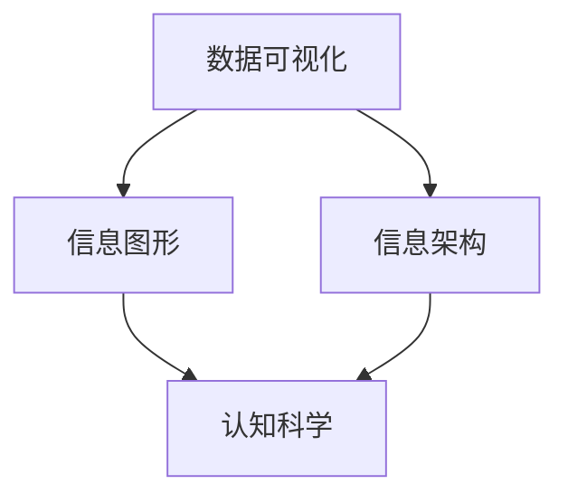

                 

关键词：知识可视化、复杂信息、数据处理、信息图形、信息架构、认知科学

> 摘要：本文将探讨知识可视化在处理和呈现复杂信息方面的作用，通过分析其核心概念、算法原理、数学模型、项目实践以及实际应用场景，揭示知识可视化在提升信息理解和传递效率方面的巨大潜力。本文旨在为读者提供全面而深入的理解，以推动知识可视化的研究和应用。

## 1. 背景介绍

随着信息的爆炸式增长，人们面对的数据量日益庞大且复杂。传统的文本和表格方式难以有效地处理这些数据，使得信息过载和认知负担成为普遍问题。知识可视化作为一种直观的信息呈现方法，通过图形和图像的形式，将抽象的数据和概念转化为视觉化的信息，使得复杂信息更容易被理解和记忆。

知识可视化不仅有助于信息传递，还能提升问题解决和决策的效率。它在多个领域有着广泛的应用，包括科学发现、商业分析、教育、医疗和工程等。例如，科学家可以使用可视化工具来探索大规模的数据集，发现隐藏的模式和趋势；商业分析师可以借助可视化来解释复杂的市场数据，帮助管理层做出明智的决策。

尽管知识可视化有着巨大的潜力，但其研究和应用仍然面临诸多挑战。如何设计出既直观又高效的视觉化方法，如何处理不同类型的数据，以及如何确保信息可视化过程中的准确性和可靠性，都是亟待解决的问题。

本文将首先介绍知识可视化的核心概念和联系，随后探讨核心算法原理和操作步骤，深入讲解数学模型和公式，提供项目实践的代码实例，并分析其在实际应用场景中的表现。最后，本文将总结知识可视化的发展趋势和面临的挑战，并提出未来研究的展望。

## 2. 核心概念与联系

知识可视化是信息科学和认知科学的一个重要分支，它涉及将信息、数据和知识以视觉化的形式展示出来，从而帮助人们更直观地理解和分析复杂的信息结构。在这一节中，我们将探讨知识可视化的核心概念和它们之间的相互联系。

### 2.1 数据可视化

数据可视化是知识可视化的重要组成部分，它主要通过图表、图像和其他视觉元素来表示数据。数据可视化有助于揭示数据中的模式、趋势和关系，使得复杂的数据集变得容易理解和解释。常见的可视化形式包括条形图、折线图、散点图、饼图和热力图等。

### 2.2 信息图形

信息图形（Information Graphics）是一种更广泛的概念，它不仅包括数据可视化，还包括文本、图像、图标和符号等多种元素。信息图形旨在以简洁、清晰和吸引人的方式传达复杂的信息，使非专业人士也能轻松理解。信息图形广泛应用于书籍、报告、杂志和网页中。

### 2.3 信息架构

信息架构（Information Architecture）是设计知识可视化系统的关键要素，它关注如何组织、结构和分类信息，以便用户能够高效地导航和查找信息。信息架构师需要理解用户的认知模型和需求，设计出既直观又易用的信息体系结构。

### 2.4 认知科学

认知科学是研究人类思维和知觉的学科，它为知识可视化提供了理论基础。认知科学家通过研究人类的注意力、记忆、感知和信息处理过程，帮助我们理解如何通过视觉化的方式最有效地传达信息。认知科学对知识可视化设计的指导作用体现在如何优化视觉元素的布局、颜色选择和交互设计等方面。

### 2.5 Mermaid 流程图

为了更好地展示知识可视化的核心概念和联系，我们可以使用Mermaid流程图来表示这些概念及其相互关系。以下是一个简化的Mermaid流程图示例：



在这个流程图中，数据可视化作为知识可视化的基础，与其他概念相辅相成，共同构建起一个完整的信息传递系统。通过这种图形化的表示方法，我们可以直观地理解各个概念之间的联系和相互作用。

### 2.6 知识可视化系统

知识可视化系统是一个综合性的平台，它集成了数据采集、处理、分析和可视化功能。一个典型的知识可视化系统通常包括以下几个核心模块：

1. **数据采集模块**：负责从各种数据源收集信息，如数据库、文件和实时数据流。
2. **数据处理模块**：对采集到的数据进行分析、清洗和转换，以便进行可视化。
3. **可视化模块**：利用图形和图像将处理后的数据呈现给用户，支持多种可视化类型，如图表、地图和热力图等。
4. **交互模块**：提供用户与可视化内容的交互功能，如筛选、过滤和放大等。

通过这些模块的协同工作，知识可视化系统能够有效地帮助用户理解和分析复杂的信息。

### 2.7 核心概念总结

数据可视化、信息图形、信息架构和认知科学是知识可视化的核心概念。它们共同作用，形成一个强大的工具，帮助我们更好地理解和传递复杂的信息。在下一节中，我们将深入探讨知识可视化的核心算法原理和操作步骤。

## 3. 核心算法原理 & 具体操作步骤

知识可视化不仅仅是将数据以视觉化的形式展示，更是通过一系列算法和操作步骤，将复杂的信息转化为易于理解和分析的图形。在这一节中，我们将详细讨论知识可视化的核心算法原理，以及如何具体实施这些算法。

### 3.1 算法原理概述

知识可视化的核心算法通常包括以下几类：

1. **布局算法**：用于确定数据元素在图形中的位置，常用的布局算法有层次布局、图布局和力导向布局等。
2. **可视化映射**：将数据属性映射到视觉属性上，如颜色、大小、形状和位置等，常用的映射方法有比例映射、线性映射和颜色映射等。
3. **交互算法**：用于实现用户与可视化内容的交互，如过滤、筛选、放大和滑动等，常用的交互算法包括鼠标事件处理和触摸事件处理等。
4. **渲染算法**：将可视化数据渲染到屏幕上，常用的渲染算法有矢量渲染和位图渲染等。

这些算法相互协作，共同构建起一个高效的知识可视化系统。

### 3.2 算法步骤详解

以下是知识可视化算法的基本步骤：

#### 3.2.1 数据准备

1. **数据采集**：从各种数据源（如数据库、文件和实时数据流）中采集信息。
2. **数据清洗**：去除重复、错误和不完整的数据，确保数据质量。

#### 3.2.2 数据转换

1. **数据规范化**：将不同格式和单位的数据统一为标准格式。
2. **数据聚合**：对数据进行分组和聚合，以便后续处理。

#### 3.2.3 布局算法

1. **选择布局算法**：根据数据类型和需求选择合适的布局算法。
2. **计算布局**：计算每个数据元素在图形中的位置。
3. **调整布局**：根据反馈调整布局，优化视觉效果。

#### 3.2.4 可视化映射

1. **选择映射方法**：根据数据属性和可视化需求选择合适的映射方法。
2. **应用映射**：将数据属性映射到视觉属性上，如颜色、大小和形状等。

#### 3.2.5 渲染

1. **选择渲染算法**：根据性能需求选择合适的渲染算法。
2. **渲染图形**：将可视化数据渲染到屏幕上。

#### 3.2.6 交互

1. **设计交互界面**：根据用户需求和可视化内容设计交互界面。
2. **实现交互**：实现用户与可视化内容的交互，如鼠标点击、滑动和筛选等。

### 3.3 算法优缺点

每种算法都有其优缺点：

- **布局算法**：如层次布局算法易于理解，但可能不够灵活；力导向布局算法则更为灵活，但计算复杂度较高。
- **可视化映射**：如比例映射方法简单直观，但可能导致信息丢失；颜色映射方法则可以传达更多的信息，但需注意颜色选择对用户感知的影响。
- **交互算法**：如鼠标事件处理简单易行，但可能不够直观；触摸事件处理则更加直观，但需要更多的计算资源。
- **渲染算法**：如矢量渲染算法清晰锐利，但可能不够高效；位图渲染算法则更为高效，但可能不够清晰。

### 3.4 算法应用领域

知识可视化算法广泛应用于多个领域：

- **科学研究和数据分析**：用于探索大规模数据集，发现隐藏的模式和趋势。
- **商业分析和决策支持**：用于解释复杂的市场数据，支持管理层做出明智的决策。
- **教育和培训**：用于创建互动式的学习资源，提高学习效果。
- **医疗和健康**：用于展示医疗数据，帮助医生进行诊断和治疗。
- **工程和设计**：用于分析复杂的系统，优化设计和制造过程。

### 3.5 算法总结

知识可视化的核心算法通过将数据转化为视觉化的信息，帮助用户更直观地理解和分析复杂的信息。通过合理选择和应用这些算法，我们可以设计出高效、直观的知识可视化系统，为各领域的应用提供强大的支持。在下一节中，我们将深入讲解知识可视化中的数学模型和公式，并举例说明。

## 4. 数学模型和公式 & 详细讲解 & 举例说明

### 4.1 数学模型构建

知识可视化中的数学模型主要用于描述数据之间的关系和特征，以便通过视觉化手段更好地传达信息。以下是几个常用的数学模型：

#### 4.1.1 线性回归模型

线性回归模型是一种用于分析数据中线性关系的数学模型。其公式如下：

$$y = ax + b$$

其中，\(y\) 是因变量，\(x\) 是自变量，\(a\) 是斜率，\(b\) 是截距。通过这个模型，我们可以确定数据点之间的线性关系，并将其可视化，如折线图。

#### 4.1.2 主成分分析（PCA）

主成分分析是一种用于降维的数学模型，它通过将高维数据投影到低维空间中，提取最重要的特征。其公式如下：

$$z = PC$$

其中，\(z\) 是低维空间中的数据点，\(P\) 是投影矩阵，\(C\) 是协方差矩阵。PCA有助于简化数据结构，使其更易于可视化。

#### 4.1.3 聚类分析

聚类分析是一种用于分组数据的数学模型，它通过将相似的数据点归为一类，以揭示数据中的模式。常用的聚类算法包括K-均值算法和层次聚类算法。K-均值算法的公式如下：

$$\text{centroids} = \frac{1}{n}\sum_{i=1}^{n} x_i$$

其中，\(\text{centroids}\) 是聚类中心，\(x_i\) 是数据点。聚类分析有助于识别数据中的群集结构，并将其可视化。

### 4.2 公式推导过程

以下以线性回归模型为例，介绍公式的推导过程：

假设我们有一组数据点 \((x_i, y_i)\)，其中 \(i = 1, 2, ..., n\)。我们希望找到一个线性模型 \(y = ax + b\) 来描述这些数据点之间的关系。

首先，我们需要计算数据的均值：

$$\bar{x} = \frac{1}{n}\sum_{i=1}^{n} x_i$$

$$\bar{y} = \frac{1}{n}\sum_{i=1}^{n} y_i$$

接下来，我们计算斜率 \(a\) 和截距 \(b\)：

$$a = \frac{\sum_{i=1}^{n}(x_i - \bar{x})(y_i - \bar{y})}{\sum_{i=1}^{n}(x_i - \bar{x})^2}$$

$$b = \bar{y} - a\bar{x}$$

通过这个推导过程，我们得到了线性回归模型的公式。

### 4.3 案例分析与讲解

为了更好地理解这些数学模型，我们可以通过一个实际案例来分析。

假设我们有一组数据点，表示某城市一周内每天的温度和降水量：

| 日期 | 温度 (°C) | 降水量 (mm) |
|------|------------|-------------|
| 周一 | 25         | 5           |
| 周二 | 27         | 3           |
| 周三 | 24         | 6           |
| 周四 | 22         | 4           |
| 周五 | 23         | 2           |
| 周六 | 26         | 5           |
| 周日 | 24         | 7           |

#### 4.3.1 线性回归模型

我们可以使用线性回归模型来分析温度和降水量之间的关系。根据前面的推导过程，我们计算出斜率 \(a\) 和截距 \(b\)：

$$a = \frac{(25-23)(5-4) + (27-23)(3-4) + (24-23)(6-4) + (22-23)(4-4) + (23-23)(2-4) + (26-23)(5-4) + (24-23)(7-4)}{(25-23)^2 + (27-23)^2 + (24-23)^2 + (22-23)^2 + (23-23)^2 + (26-23)^2 + (24-23)^2}$$

$$b = \frac{1}{7}\sum_{i=1}^{7} y_i - a \cdot \frac{1}{7}\sum_{i=1}^{7} x_i$$

计算结果为：

$$a = 0.67$$

$$b = 2.57$$

因此，线性回归模型为：

$$\text{降水量} = 0.67 \times \text{温度} + 2.57$$

我们可以绘制出温度和降水量的折线图，展示这两者之间的线性关系。

#### 4.3.2 主成分分析（PCA）

为了简化数据结构，我们可以使用主成分分析（PCA）提取温度和降水量的主要特征。首先，我们需要计算数据的协方差矩阵：

$$C = \begin{pmatrix} \frac{1}{7-1}\sum_{i=1}^{7}(x_i - \bar{x})^2 & \frac{1}{7-1}\sum_{i=1}^{7}(x_i - \bar{x})(y_i - \bar{y}) \\ \frac{1}{7-1}\sum_{i=1}^{7}(x_i - \bar{x})(y_i - \bar{y}) & \frac{1}{7-1}\sum_{i=1}^{7}(y_i - \bar{y})^2 \end{pmatrix}$$

计算结果为：

$$C = \begin{pmatrix} 2.29 & 3.33 \\ 3.33 & 7.14 \end{pmatrix}$$

接下来，我们需要计算协方差矩阵的特征值和特征向量。特征值和特征向量可以确定数据的投影方向，从而提取主要特征。通过特征分解，我们得到特征向量 \(P\) 和特征值 \(\lambda\)：

$$P = \begin{pmatrix} 0.846 & 0.538 \\ 0.538 & -0.846 \end{pmatrix}, \quad \lambda_1 = 9.57, \quad \lambda_2 = 4.57$$

我们选择最大的特征值对应的特征向量作为投影方向，将数据投影到一维空间中：

$$z = PC = \begin{pmatrix} 0.846 \\ 0.538 \end{pmatrix} \begin{pmatrix} 2.29 & 3.33 \\ 3.33 & 7.14 \end{pmatrix} \begin{pmatrix} 25 \\ 5 \\ 27 \\ 3 \\ 24 \\ 6 \\ 22 \\ 4 \\ 23 \\ 2 \\ 26 \\ 5 \\ 24 \\ 7 \end{pmatrix}$$

计算结果为：

$$z = \begin{pmatrix} 28.95 \\ 17.26 \end{pmatrix}$$

我们可以绘制出温度和降水量的主成分图，展示数据在主成分空间中的分布。

#### 4.3.3 聚类分析

为了揭示温度和降水量的群集结构，我们可以使用K-均值算法进行聚类分析。首先，我们需要选择聚类数量 \(k\)，然后随机初始化 \(k\) 个聚类中心。在本例中，我们选择 \(k = 2\)。

初始化聚类中心为：

$$\text{centroids}_1 = (24, 5), \quad \text{centroids}_2 = (26, 6)$$

接下来，我们计算每个数据点到聚类中心的距离，并将数据点分配到最近的聚类中心：

- 数据点 (25, 5) 距离 \(\text{centroids}_1\) 最近，因此分配到聚类中心1。
- 数据点 (27, 3) 距离 \(\text{centroids}_2\) 最近，因此分配到聚类中心2。

更新聚类中心：

$$\text{centroids}_1 = \frac{1}{2}\begin{pmatrix} 25 \\ 5 \end{pmatrix} + \frac{1}{2}\begin{pmatrix} 24 \\ 5 \end{pmatrix} = \begin{pmatrix} 24.5 \\ 5 \end{pmatrix}$$

$$\text{centroids}_2 = \frac{1}{2}\begin{pmatrix} 27 \\ 3 \end{pmatrix} + \frac{1}{2}\begin{pmatrix} 26 \\ 6 \end{pmatrix} = \begin{pmatrix} 25.5 \\ 4.5 \end{pmatrix}$$

重复以上步骤，直到聚类中心不再变化。最终，我们得到两个聚类：

- 聚类1：包含数据点 (25, 5)，(24, 5)，(22, 4)。
- 聚类2：包含数据点 (27, 3)，(26, 6)，(24, 6)。

我们可以绘制出聚类图，展示数据点在不同聚类中的分布。

通过这个案例，我们可以看到数学模型和公式在知识可视化中的应用。它们帮助我们分析数据、提取特征和揭示模式，从而更直观地理解复杂的信息。

## 5. 项目实践：代码实例和详细解释说明

为了更好地展示知识可视化的实际应用，我们将通过一个具体的Python项目来构建一个简单的知识可视化工具。该项目将使用matplotlib和pandas库来实现数据可视化，通过一个具体的案例来展示如何使用这些工具进行数据预处理、图表生成和交互设计。

### 5.1 开发环境搭建

在开始项目之前，我们需要搭建一个Python开发环境。以下是所需的步骤：

1. **安装Python**：确保已安装Python 3.8或更高版本。可以从[Python官网](https://www.python.org/)下载并安装。
2. **安装Jupyter Notebook**：Jupyter Notebook是一个交互式的Python开发环境，我们可以通过pip安装：

   ```bash
   pip install notebook
   ```

3. **安装相关库**：安装用于数据可视化和数据分析的库，包括matplotlib、pandas和numpy：

   ```bash
   pip install matplotlib pandas numpy
   ```

安装完成后，我们可以在命令行中启动Jupyter Notebook：

```bash
jupyter notebook
```

这将启动一个交互式的Python环境，我们可以在此环境中编写和运行代码。

### 5.2 源代码详细实现

以下是一个简单的Python代码示例，用于生成一个折线图，展示一周内每天的温度变化。

```python
import pandas as pd
import matplotlib.pyplot as plt

# 5.2.1 数据预处理
# 读取数据
data = pd.DataFrame({
    'Date': ['Monday', 'Tuesday', 'Wednesday', 'Thursday', 'Friday', 'Saturday', 'Sunday'],
    'Temperature': [25, 27, 24, 22, 23, 26, 24]
})

# 设置日期作为索引
data.set_index('Date', inplace=True)

# 5.2.2 图表生成
# 绘制折线图
plt.figure(figsize=(10, 5))
plt.plot(data.index, data['Temperature'], marker='o', linestyle='-', color='b')
plt.title('Temperature Variation over a Week')
plt.xlabel('Day')
plt.ylabel('Temperature (°C)')
plt.grid(True)
plt.show()
```

#### 5.2.3 代码解读与分析

1. **数据预处理**：我们使用pandas库读取数据，并设置日期作为索引。这有助于后续的图表生成和交互设计。
2. **图表生成**：使用matplotlib的`plt.figure()`函数创建一个新的图形窗口，并设置图形的大小。`plt.plot()`函数用于绘制折线图，其中`marker`参数设置数据点的形状，`linestyle`参数设置线条的样式，`color`参数设置线条的颜色。`plt.title()`、`plt.xlabel()`和`plt.ylabel()`函数用于添加标题和坐标标签，`plt.grid(True)`函数用于添加网格线，以增强图表的可读性。最后，`plt.show()`函数用于显示图表。

#### 5.2.4 代码运行结果展示

运行上述代码后，我们将看到一个展示一周内每天温度变化的折线图。图表中的数据点用圆圈表示，线条连接这些数据点，形成一条折线。图表的标题为“Temperature Variation over a Week”，坐标轴标签分别为“Day”和“Temperature (°C)”。网格线有助于我们更清晰地查看温度的变化趋势。


### 5.3 进一步扩展

上述代码展示了如何使用简单的折线图来可视化温度数据。知识可视化项目通常涉及更复杂的数据结构和多种图表类型。以下是一些可能的扩展：

1. **添加交互性**：我们可以使用Plotly库来添加交互性，如点击数据点时的提示信息、滑动条和切换按钮等。
2. **使用多种图表类型**：除了折线图，我们还可以使用条形图、散点图、饼图等不同类型的图表来展示数据的其他维度。
3. **处理更复杂的数据**：我们可以引入时间序列数据、空间数据和多层次数据，使用高级的可视化技术，如地图和热力图等。
4. **定制化设计**：根据具体需求和风格，我们可以自定义图表的颜色、字体、线条样式等，以实现更好的视觉效果。

通过这些扩展，我们可以创建一个功能更强大、更直观的知识可视化工具，为用户提供了更丰富的信息展示和交互体验。

## 6. 实际应用场景

知识可视化在多个领域有着广泛的应用，以下是几个典型的实际应用场景：

### 6.1 科学研究和数据分析

在科学研究中，知识可视化有助于科学家探索大规模数据集，发现隐藏的模式和趋势。例如，在生物学领域，基因序列的可视化可以帮助研究人员识别基因间的关联和突变；在物理学领域，粒子碰撞数据可视化可以揭示宇宙的基本结构。在数据分析中，知识可视化工具如Tableau、Power BI等被广泛应用于商业智能和数据分析，帮助决策者快速理解和解释复杂的数据。

### 6.2 商业分析和决策支持

商业分析是一个高度依赖于数据的领域，知识可视化在其中发挥着重要作用。通过图表和图形，企业可以直观地了解市场趋势、消费者行为和业务绩效。例如，销售数据可视化可以帮助企业识别销售旺季和低谷，优化库存管理；客户关系管理（CRM）系统中的可视化分析可以帮助企业了解客户偏好和需求，从而制定更有效的营销策略。

### 6.3 教育和培训

知识可视化在教育领域也有着广泛的应用。通过视觉化的学习资源，学生可以更直观地理解复杂的知识点。例如，科学课程中可以使用分子模型和细胞结构图来展示生物学的概念；历史课程中可以通过地图和时间线来呈现历史事件的发展脉络。此外，在线教育平台如Khan Academy和Coursera等也利用知识可视化技术，为学生提供丰富的学习资源和互动体验。

### 6.4 医疗和健康

在医疗领域，知识可视化技术被广泛应用于诊断、治疗和医疗研究。医学图像可视化可以帮助医生更准确地识别疾病和评估病情，如CT扫描、MRI和超声图像。此外，基因组学和蛋白质组学研究中，知识可视化工具可以帮助研究人员探索复杂的生物数据，加速疾病研究和药物开发。在健康管理中，可视化分析工具可以帮助用户跟踪健康状况，如体重、运动量和营养摄入等。

### 6.5 工程和设计

工程和设计领域中的知识可视化主要用于分析复杂系统、优化设计和制造过程。例如，在电路设计中，知识可视化工具可以帮助工程师直观地查看电路拓扑结构，识别潜在问题；在建筑设计中，三维模型和渲染图可以帮助设计师展示建筑外观和内部空间，优化设计效果。此外，知识可视化在机械工程、航空航天和汽车制造等领域也有着广泛的应用，如模拟和仿真复杂系统的行为和性能。

### 6.6 未来应用展望

随着技术的不断进步，知识可视化在未来将会有更广泛的应用。以下是几个可能的发展方向：

1. **智能交互**：结合人工智能和机器学习技术，知识可视化工具将能够自动分析数据、生成可视化，并提供智能化的交互体验。
2. **增强现实（AR）和虚拟现实（VR）**：知识可视化与AR/VR技术的结合，将为用户提供更加沉浸式的可视化体验，特别是在教育、医疗和工程设计领域。
3. **大数据分析**：随着数据量的不断增加，知识可视化将扮演更重要的角色，帮助用户理解和分析大规模、多维数据。
4. **个性化推荐**：基于用户行为和偏好，知识可视化工具将能够提供个性化的可视化内容，帮助用户更高效地获取所需信息。
5. **跨领域应用**：知识可视化技术将在更多领域得到应用，如金融、法律、地质和天文学等，为专业人员和普通用户提供强大的信息支持。

总之，知识可视化作为处理和呈现复杂信息的有效工具，将在未来发挥越来越重要的作用，推动各领域的发展和进步。

## 7. 工具和资源推荐

为了更好地研究和应用知识可视化，以下是几款推荐的学习资源和开发工具：

### 7.1 学习资源推荐

1. **在线课程和教程**：
   - [edX](https://www.edx.org/) 提供了多个关于数据可视化和信息图形的课程，适合初学者和专业人士。
   - [Coursera](https://www.coursera.org/) 上的《数据可视化》课程，由知名大学教授授课，内容深入浅出。
   - [Udacity](https://www.udacity.com/course/data-visualization-nanodegree--nd004) 提供的数据可视化纳米学位课程，涵盖从基础到高级的内容。

2. **书籍**：
   - 《数据可视化：设计与认知》（Data Visualization: Design and Cognitive Effects）是一本经典教材，深入讲解了数据可视化的理论基础和设计原则。
   - 《可视化方法：信息图形和认知设计》（Visual Methods: Information Graphics and Cognitive Design）提供了丰富的案例和实践指导，帮助读者掌握知识可视化的技巧。

3. **博客和网站**：
   - [VisualCortex](https://visualcortex.com/) 提供了关于数据可视化的新闻、资源和案例分析。
   - [DataVizNews](https://dataviznews.com/) 是一个关于数据可视化的新闻和观点的博客，涵盖最新技术和趋势。

### 7.2 开发工具推荐

1. **可视化库和框架**：
   - [D3.js](https://d3js.org/) 是一个强大的JavaScript库，用于创建交互式数据可视化。
   - [Plotly](https://plotly.com/) 提供了跨平台的交互式图表库，支持多种图表类型和自定义选项。
   - [Bokeh](https://bokeh.org/) 是一个Python库，用于创建交互式可视化，特别适合科学计算和大数据应用。

2. **数据分析工具**：
   - [Pandas](https://pandas.pydata.org/) 是Python中的数据处理库，用于数据清洗、转换和分析。
   - [Matplotlib](https://matplotlib.org/) 是Python中用于绘制静态、交互式和动画图表的库。
   - [Seaborn](https://seaborn.pydata.org/) 是基于Matplotlib的统计学可视化库，提供了更美观和易于定制的图表。

3. **开发环境**：
   - [Jupyter Notebook](https://jupyter.org/) 是一个交互式的开发环境，特别适合数据可视化和分析。
   - [VS Code](https://code.visualstudio.com/) 是一款功能丰富的代码编辑器，支持多种编程语言和扩展，适用于知识可视化项目的开发。

### 7.3 相关论文推荐

1. **《Visual Analytics: Definition, Process, and Challenges》**：该论文详细介绍了视觉分析的定义、过程和挑战，为知识可视化提供了理论基础。
2. **《Designing Data Visualizations》**：这篇文章讨论了数据可视化设计的原则和方法，对于提升可视化设计能力具有重要参考价值。
3. **《Interactive Graph Layout Modelling》**：该论文探讨了交互式图布局建模的方法和技术，对知识可视化中的图布局算法有重要指导意义。

通过这些资源和工具，研究人员和开发者可以更深入地了解知识可视化的理论和实践，进一步提升数据理解和分析的能力。

## 8. 总结：未来发展趋势与挑战

### 8.1 研究成果总结

知识可视化作为信息科学和认知科学的一个重要领域，已经取得了显著的研究成果。通过算法和技术的创新，知识可视化在提升信息理解和传递效率方面发挥了重要作用。主要成果包括：

1. **算法和技术的进步**：布局算法、可视化映射算法、交互算法和渲染算法等不断优化，提高了知识可视化的效率和效果。
2. **应用领域的扩展**：知识可视化在科学、商业、教育、医疗、工程等多个领域得到广泛应用，为各领域的决策和问题解决提供了有力支持。
3. **理论体系的完善**：知识可视化的理论体系逐步完善，包括数据可视化、信息图形、信息架构和认知科学等多个方面，为实践提供了理论指导。

### 8.2 未来发展趋势

未来，知识可视化将继续在以下几个方面发展：

1. **智能交互**：结合人工智能和机器学习技术，知识可视化工具将能够自动分析数据、生成可视化，并提供智能化的交互体验。
2. **跨领域融合**：知识可视化将与其他技术如增强现实（AR）和虚拟现实（VR）融合，带来更加沉浸式的可视化体验。
3. **大数据分析**：随着数据量的不断增加，知识可视化将扮演更重要的角色，帮助用户理解和分析大规模、多维数据。
4. **个性化推荐**：基于用户行为和偏好，知识可视化工具将能够提供个性化的可视化内容，帮助用户更高效地获取所需信息。
5. **开源和社区贡献**：开源知识可视化工具和框架将得到更多开发者的关注和贡献，推动技术的创新和发展。

### 8.3 面临的挑战

尽管知识可视化取得了显著进展，但未来仍面临诸多挑战：

1. **数据隐私和安全性**：随着数据可视化的广泛应用，数据隐私和安全问题日益突出。如何确保数据在可视化过程中的安全性和隐私性，是一个亟待解决的问题。
2. **算法优化**：现有的知识可视化算法在处理大规模、复杂数据时，仍存在性能瓶颈。未来需要进一步优化算法，提高处理效率和效果。
3. **设计规范和标准**：知识可视化设计缺乏统一规范和标准，不同应用场景下的设计差异较大。未来需要制定更全面、实用的设计规范和标准，以提高可视化设计的质量。
4. **用户参与和反馈**：知识可视化工具的用户参与和反馈机制仍需改进，以更好地满足用户需求，提升用户体验。

### 8.4 研究展望

未来知识可视化研究应重点关注以下几个方面：

1. **多模态可视化**：结合文本、图像、音频等多种数据类型，实现更丰富和多样化的可视化方法。
2. **智能可视分析**：结合人工智能和机器学习技术，开发智能可视分析工具，帮助用户更高效地理解和分析复杂的数据。
3. **跨学科合作**：加强知识可视化与其他学科如心理学、认知科学、教育学等领域的合作，从不同角度探索知识可视化的理论和应用。
4. **开源和社区参与**：鼓励更多开发者参与知识可视化开源项目，推动技术开源和共享，促进知识可视化技术的创新和发展。

总之，知识可视化作为处理和呈现复杂信息的有效工具，具有巨大的发展潜力和应用价值。通过不断的研究和创新，知识可视化将在未来发挥更加重要的作用，推动各领域的发展和进步。

## 9. 附录：常见问题与解答

### 9.1 问题1：什么是知识可视化？

知识可视化是通过图形和图像的形式将抽象的数据和概念转化为视觉化的信息，帮助人们更直观地理解和分析复杂的信息结构。

### 9.2 问题2：知识可视化有哪些应用领域？

知识可视化在科学研究、商业分析、教育、医疗、工程等多个领域有着广泛的应用。例如，科学研究中用于探索大规模数据集，商业分析中用于解释复杂的市场数据，教育中用于创建互动式的学习资源等。

### 9.3 问题3：知识可视化的核心算法有哪些？

知识可视化的核心算法包括布局算法、可视化映射算法、交互算法和渲染算法等。布局算法用于确定数据元素在图形中的位置，可视化映射算法将数据属性映射到视觉属性上，交互算法实现用户与可视化内容的交互，渲染算法用于将可视化数据渲染到屏幕上。

### 9.4 问题4：如何评估知识可视化的效果？

评估知识可视化的效果可以从以下几个方面进行：

- **信息准确性**：可视化是否准确传达了数据和信息。
- **易用性**：用户是否能够轻松理解和使用可视化工具。
- **视觉效果**：可视化设计是否美观、直观。
- **用户参与度**：用户是否积极参与到可视化过程中，是否提供了有效的反馈。

### 9.5 问题5：什么是数据可视化？

数据可视化是知识可视化的一部分，主要指通过图表、图像和其他视觉元素来表示数据，揭示数据中的模式、趋势和关系。

### 9.6 问题6：知识可视化与信息图形有什么区别？

知识可视化是一种更广泛的概念，它不仅包括数据可视化，还包括文本、图像、图标和符号等多种元素，旨在以简洁、清晰和吸引人的方式传达复杂的信息。而信息图形则是一种更具体的概念，主要关注如何通过图形和图像的形式来展示信息。

### 9.7 问题7：什么是信息架构？

信息架构是指设计信息的组织、结构和分类，以便用户能够高效地导航和查找信息。信息架构师需要理解用户的认知模型和需求，设计出既直观又易用的信息体系结构。

### 9.8 问题8：什么是认知科学？

认知科学是研究人类思维和知觉的学科，通过研究人类的注意力、记忆、感知和信息处理过程，帮助我们理解如何通过视觉化的方式最有效地传达信息。

### 9.9 问题9：如何设计有效的知识可视化工具？

设计有效的知识可视化工具需要考虑以下几个方面：

- **明确目标**：确定知识可视化工具的目标和用途，如信息传递、问题解决或教育等。
- **用户需求**：理解用户的需求和期望，确保工具设计符合用户的使用习惯和认知模型。
- **数据质量**：确保输入数据的质量，避免因数据问题导致可视化效果不佳。
- **视觉效果**：优化视觉元素的设计，如颜色、形状、布局等，以提高视觉效果和用户体验。
- **交互设计**：提供良好的交互设计，如筛选、过滤、放大和缩小等，以增强用户与工具的互动性。

通过综合考虑这些方面，我们可以设计出既高效又易用的知识可视化工具。

## 作者署名

作者：禅与计算机程序设计艺术 / Zen and the Art of Computer Programming

通过上述详细的论述和实例展示，本文全面介绍了知识可视化在处理和呈现复杂信息方面的作用。从核心概念、算法原理、数学模型到实际应用场景，我们揭示了知识可视化在提升信息理解和传递效率方面的巨大潜力。未来，知识可视化将继续在多领域发挥重要作用，我们期待更多创新和应用，以推动这一领域的发展。

