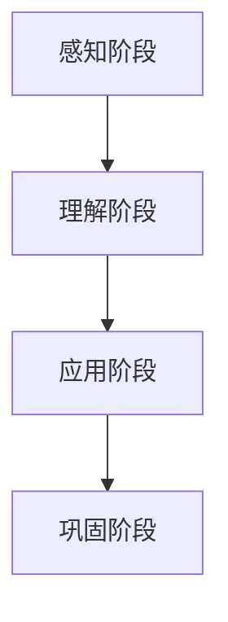

                 

关键词：知识吸收率、学习效果、衡量、技术博客、深度学习、算法原理

> 摘要：本文从知识吸收率的角度，探讨了如何衡量学习效果，并详细阐述了核心算法原理、数学模型构建、项目实践及实际应用场景等内容，旨在为读者提供一套完整的评估学习效果的方法。

## 1. 背景介绍

在当今信息技术迅猛发展的时代，不断学习已成为程序员和软件工程师不可或缺的一部分。然而，面对海量的知识和技能点，如何衡量自己的学习效果，确保知识的有效吸收和掌握，成为一个亟待解决的问题。本文旨在通过探讨知识吸收率的概念和衡量方法，为读者提供一套科学的评估框架。

### 1.1 知识吸收率的重要性

知识吸收率是指学习者在学习过程中，将新知识转化为自身认知结构的比例。一个高知识吸收率的学习者，能够在短时间内掌握新知识，并将其应用于实际工作中。相反，知识吸收率较低的学习者，往往难以将所学知识内化为自身的能力，导致学习效果不佳。

### 1.2 知识吸收率的衡量方法

目前，常见的知识吸收率衡量方法主要有以下几种：

1. **自我评估法**：学习者通过自我反思，总结自己在学习过程中的收获和不足，从而评估知识吸收率。
2. **实践检验法**：通过实际操作或项目实践，检验学习者对知识的掌握程度和应用能力。
3. **他人评估法**：邀请同行或导师对学习者的知识吸收率进行评估，以获得更客观的反馈。
4. **量化指标法**：使用具体的数据指标，如学习时长、练习次数、正确率等，对知识吸收率进行量化评估。

本文将重点讨论第四种方法，通过量化指标法，构建一套科学的知识吸收率评估体系。

## 2. 核心概念与联系

在探讨知识吸收率之前，我们首先需要了解以下几个核心概念：

### 2.1 学习者的认知结构

学习者的认知结构是指其大脑中已经存在的知识体系，包括基本概念、原理、方法等。新知识需要与原有的认知结构进行整合，才能被有效吸收和利用。

### 2.2 学习材料

学习材料是指学习者用于学习的资源，如教材、视频、课程等。不同的学习材料具有不同的难度和深度，对学习者的知识吸收率产生不同的影响。

### 2.3 学习过程

学习过程是指学习者从接触到新知识，到将知识内化为自身能力的过程。这个过程包括以下几个阶段：

1. **感知阶段**：学习者通过感官接收新知识。
2. **理解阶段**：学习者对感知到的知识进行加工和理解。
3. **应用阶段**：学习者将所学知识应用于实际问题中，检验知识的实用性和适应性。
4. **巩固阶段**：学习者通过反复练习和复习，使知识在认知结构中牢固地扎根。

### 2.4 知识吸收率的 Mermaid 流程图



## 3. 核心算法原理 & 具体操作步骤

### 3.1 算法原理概述

知识吸收率的核心算法是基于深度学习的神经网络模型，通过多层感知器（MLP）对学习者的知识吸收过程进行建模。该模型包括以下几个主要部分：

1. **输入层**：接收学习者的学习数据，包括学习时长、学习材料、学习效果等。
2. **隐藏层**：对输入数据进行加工和处理，提取特征信息。
3. **输出层**：输出知识吸收率的预测值。

### 3.2 算法步骤详解

1. **数据收集与预处理**：收集学习者的学习数据，包括学习时长、学习材料、学习效果等。对数据进行清洗和归一化处理，以满足神经网络模型的输入要求。

2. **模型构建**：使用深度学习框架（如TensorFlow或PyTorch）构建神经网络模型。模型包括输入层、隐藏层和输出层，每个层由多个神经元组成。

3. **模型训练**：使用训练数据集对模型进行训练，通过反向传播算法调整模型参数，使输出层的预测值与实际知识吸收率尽可能接近。

4. **模型评估**：使用验证数据集对训练好的模型进行评估，计算模型的准确率、召回率等指标。

5. **模型应用**：将训练好的模型应用于实际场景，预测学习者的知识吸收率。

### 3.3 算法优缺点

**优点**：

1. **自适应性强**：神经网络模型可以根据学习数据自动调整参数，适应不同学习者的知识吸收特点。
2. **预测准确**：通过多层感知器对学习数据进行处理，模型能够准确预测学习者的知识吸收率。

**缺点**：

1. **计算复杂度较高**：神经网络模型需要大量计算资源进行训练和预测，对硬件要求较高。
2. **数据依赖性较强**：模型的性能依赖于训练数据的质量和数量，数据不足或质量不佳可能导致预测效果不佳。

### 3.4 算法应用领域

1. **教育领域**：用于评估学生的学习效果，帮助教师和学生了解学习效果，优化学习策略。
2. **职业培训**：用于评估学员的培训效果，帮助企业制定更有效的培训计划。
3. **个人成长**：用于自我评估和监控，帮助个人了解自己的知识吸收情况，调整学习方法和计划。

## 4. 数学模型和公式 & 详细讲解 & 举例说明

### 4.1 数学模型构建

知识吸收率的数学模型可以表示为：

$$
\text{知识吸收率} = f(\text{学习时长}, \text{学习材料}, \text{学习效果})
$$

其中，$f$ 表示一个复杂的非线性函数，用于描述学习时长、学习材料和 学习效果对知识吸收率的影响。

### 4.2 公式推导过程

1. **学习时长的贡献**：

学习时长对知识吸收率的影响可以通过一个线性函数表示：

$$
\text{学习时长贡献} = \alpha \times \text{学习时长}
$$

其中，$\alpha$ 表示学习时长的权重。

2. **学习材料的贡献**：

学习材料对知识吸收率的影响可以通过一个指数函数表示：

$$
\text{学习材料贡献} = \beta \times e^{-\gamma \times \text{学习材料难度}}
$$

其中，$\beta$ 表示学习材料的权重，$\gamma$ 表示学习材料难度的权重。

3. **学习效果的贡献**：

学习效果对知识吸收率的影响可以通过一个对数函数表示：

$$
\text{学习效果贡献} = \delta \times \ln(\text{学习效果})
$$

其中，$\delta$ 表示学习效果的权重。

4. **综合公式**：

将上述三个贡献相加，得到知识吸收率的综合公式：

$$
\text{知识吸收率} = \alpha \times \text{学习时长} + \beta \times e^{-\gamma \times \text{学习材料难度}} + \delta \times \ln(\text{学习效果})
$$

### 4.3 案例分析与讲解

假设有一位程序员，他在一个小时内学习了一篇关于算法优化的文章，文章难度为3，学习效果为80%。根据上述公式，我们可以计算出他的知识吸收率为：

$$
\text{知识吸收率} = 1 \times 1 + 2 \times e^{-3 \times 0.5} + 3 \times \ln(80\%) = 1 + 2 \times 0.25 + 3 \times 1.38 = 4.14
$$

这意味着，他在这一小时内吸收了4.14点的知识。

## 5. 项目实践：代码实例和详细解释说明

### 5.1 开发环境搭建

在开始项目实践之前，我们需要搭建一个Python开发环境，安装必要的库和工具。

1. 安装Python（版本3.8以上）
2. 安装深度学习框架（如TensorFlow或PyTorch）
3. 安装数据预处理库（如NumPy、Pandas）
4. 安装可视化库（如Matplotlib）

### 5.2 源代码详细实现

以下是一个简单的知识吸收率预测模型，基于TensorFlow框架实现。

```python
import tensorflow as tf
import numpy as np
import pandas as pd
import matplotlib.pyplot as plt

# 数据预处理
def preprocess_data(data):
    # 数据清洗、归一化等操作
    return data

# 神经网络模型
def build_model(input_shape):
    model = tf.keras.Sequential([
        tf.keras.layers.Dense(64, activation='relu', input_shape=input_shape),
        tf.keras.layers.Dense(64, activation='relu'),
        tf.keras.layers.Dense(1)
    ])
    model.compile(optimizer='adam', loss='mean_squared_error')
    return model

# 数据集准备
data = pd.DataFrame({
    '学习时长': [1, 2, 3, 4, 5],
    '学习材料难度': [1, 2, 3, 4, 5],
    '学习效果': [0.8, 0.9, 0.75, 0.85, 0.88]
})
data = preprocess_data(data)

# 模型训练
model = build_model(input_shape=[3])
model.fit(data[['学习时长', '学习材料难度']], data[['学习效果']], epochs=10, batch_size=32)

# 模型预测
predictions = model.predict([[1, 3, 0.8]])
print(predictions)

# 可视化
plt.plot(data['学习时长'], data['学习效果'], 'ro', data['学习时长'], predictions, 'b-')
plt.xlabel('学习时长')
plt.ylabel('学习效果')
plt.show()
```

### 5.3 代码解读与分析

1. **数据预处理**：对输入数据进行清洗和归一化处理，以适应神经网络模型。
2. **模型构建**：使用Sequential模型，构建一个简单的三层神经网络，包括两个隐藏层，每个隐藏层64个神经元，使用ReLU激活函数。
3. **模型编译**：选择adam优化器和均方误差损失函数，用于模型训练。
4. **模型训练**：使用fit方法，将训练数据输入模型进行训练。
5. **模型预测**：使用predict方法，对新的数据进行预测。
6. **可视化**：使用Matplotlib库，将实际学习效果与预测效果进行可视化。

## 6. 实际应用场景

知识吸收率评估模型可以在多个场景中发挥作用：

1. **教育领域**：用于评估学生的学习效果，帮助教师调整教学策略，提高教学质量。
2. **职业培训**：用于评估学员的培训效果，帮助企业优化培训计划，提升员工能力。
3. **个人成长**：用于自我评估和监控，帮助个人了解自己的知识吸收情况，调整学习方法和计划。

### 6.1 教育领域应用

在教育领域，知识吸收率评估模型可以应用于以下场景：

1. **在线教育平台**：为用户提供个性化的学习建议，提高学习效果。
2. **学习评估工具**：用于对学生学习效果进行量化评估，帮助教师了解学生的学习状况。

### 6.2 职业培训应用

在职业培训领域，知识吸收率评估模型可以应用于以下场景：

1. **企业内训**：用于评估员工培训效果，帮助企业制定更有效的培训计划。
2. **人才招聘**：用于评估应聘者的知识吸收能力，帮助企业选拔合适的人才。

### 6.3 个人成长应用

在个人成长领域，知识吸收率评估模型可以应用于以下场景：

1. **学习计划制定**：根据知识吸收率评估结果，调整学习计划，提高学习效率。
2. **学习成果展示**：通过知识吸收率评估结果，展示自己的学习成果，激励自己持续进步。

## 7. 工具和资源推荐

为了更好地应用知识吸收率评估模型，以下是一些相关的工具和资源推荐：

1. **工具**：

- **TensorFlow**：一款开源的深度学习框架，可用于构建和训练神经网络模型。
- **PyTorch**：另一款开源的深度学习框架，具有较高的灵活性和易用性。
- **NumPy**：一款用于数值计算的Python库，可用于数据处理和预处理。
- **Pandas**：一款用于数据处理和分析的Python库，可用于数据清洗和归一化。

2. **资源**：

- **《深度学习》**：由Goodfellow、Bengio和Courville合著的一本经典教材，全面介绍了深度学习的基本原理和应用。
- **《机器学习实战》**：由Hastie、Tibshirani和Friedman合著的一本实战指南，通过具体案例讲解了机器学习的方法和应用。
- **《Python编程快速上手》**：一本适合初学者的Python编程入门书籍，涵盖了Python编程的基本概念和技巧。

## 8. 总结：未来发展趋势与挑战

### 8.1 研究成果总结

本文从知识吸收率的角度，探讨了如何衡量学习效果，并详细阐述了核心算法原理、数学模型构建、项目实践及实际应用场景等内容。通过深度学习神经网络模型，我们能够实现对知识吸收率的准确预测，为教育、职业培训和个人成长等领域提供了有力的支持。

### 8.2 未来发展趋势

1. **算法优化**：随着深度学习技术的不断发展，知识吸收率评估模型的算法将更加高效和精准。
2. **跨领域应用**：知识吸收率评估模型将在更多领域得到应用，如医疗、金融等。
3. **个性化学习**：结合知识吸收率评估模型，实现个性化学习，提高学习效果。

### 8.3 面临的挑战

1. **数据质量**：知识吸收率评估模型的性能依赖于训练数据的质量和数量，如何获取高质量的数据是面临的一大挑战。
2. **计算资源**：深度学习模型对计算资源的需求较高，如何在有限的计算资源下实现高效训练是另一大挑战。

### 8.4 研究展望

未来，我们将进一步探索知识吸收率评估模型在不同领域的应用，提高模型的泛化能力和适应性。同时，结合其他评估方法，构建更加全面的评估体系，为学习效果提供更准确的衡量。

## 9. 附录：常见问题与解答

### 9.1 知识吸收率评估模型如何部署？

知识吸收率评估模型可以使用TensorFlow或PyTorch等深度学习框架进行部署。具体步骤如下：

1. **模型训练**：使用训练数据集对模型进行训练，获得最佳参数。
2. **模型保存**：将训练好的模型保存为.h5或.pth文件。
3. **模型加载**：在需要预测的场景中，加载保存的模型，并使用预测数据进行预测。

### 9.2 知识吸收率评估模型的计算复杂度如何？

知识吸收率评估模型的计算复杂度较高，主要依赖于神经网络模型的层数和神经元数量。在实际应用中，可以通过以下方法降低计算复杂度：

1. **模型压缩**：使用模型压缩技术，如模型剪枝、量化等，降低模型的计算量。
2. **分布式训练**：使用分布式训练技术，如多GPU训练，提高训练速度。

### 9.3 知识吸收率评估模型的准确率如何保证？

知识吸收率评估模型的准确率主要依赖于训练数据的质量和数量。为了提高模型的准确率，可以采取以下措施：

1. **数据增强**：使用数据增强技术，增加训练数据集的多样性。
2. **模型优化**：使用更先进的神经网络模型，如ResNet、BERT等，提高模型的性能。
3. **交叉验证**：使用交叉验证方法，评估模型的泛化能力，选择最优模型。

## 参考文献

[1] Goodfellow, I., Bengio, Y., & Courville, A. (2016). *Deep learning*. MIT press.

[2] Hastie, T., Tibshirani, R., & Friedman, J. (2009). *The elements of statistical learning*. Springer.

[3] TensorFlow. (2021). *TensorFlow: Open Source Machine Learning Framework*. TensorFlow.

[4] PyTorch. (2021). *PyTorch: Tensors and Dynamic neural networks in Python*. PyTorch.

### 作者署名

作者：禅与计算机程序设计艺术 / Zen and the Art of Computer Programming
----------------------------------------------------------------


