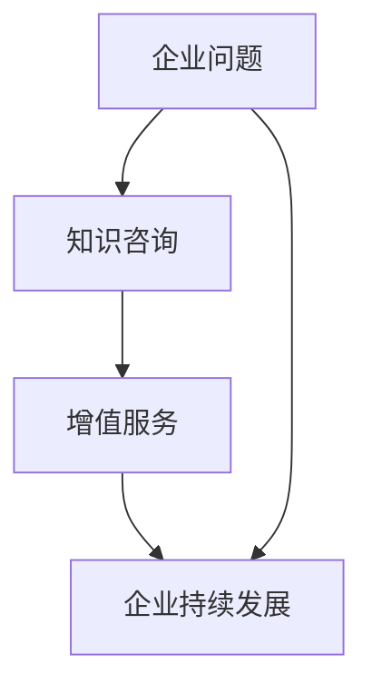
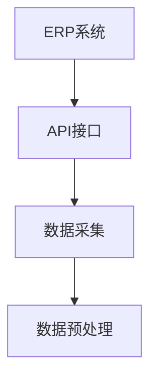
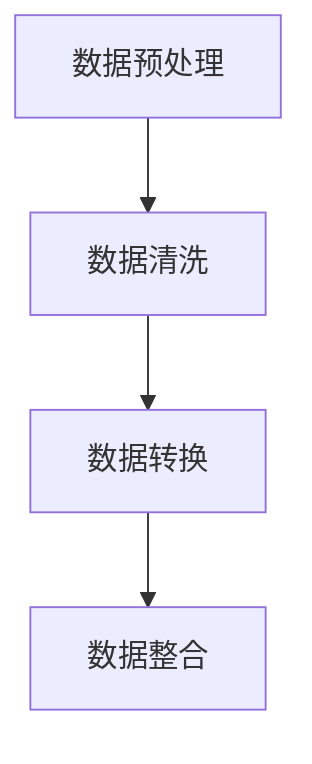
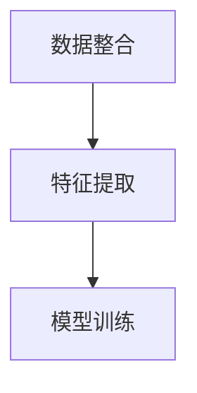
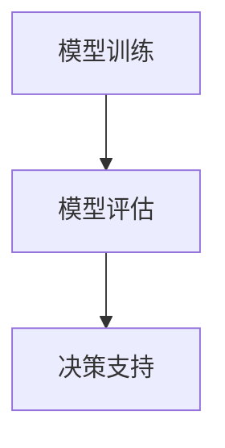
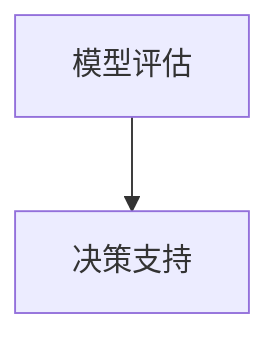
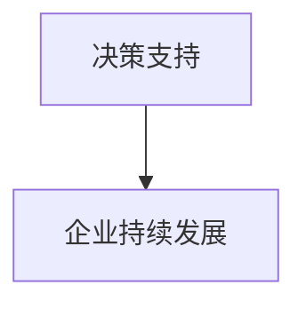

                 

关键词：知识咨询、企业问题解决、增值服务、IT技术、数字化转型、项目管理、算法优化、数学模型、应用实践、代码实例、未来展望。

> 摘要：本文深入探讨了知识咨询在企业中的应用，如何通过提供增值服务帮助企业解决实际问题。文章从背景介绍、核心概念与联系、核心算法原理与具体操作步骤、数学模型和公式、项目实践、实际应用场景、未来应用展望、工具和资源推荐、总结和附录等方面进行了全面阐述。

## 1. 背景介绍

在当今这个快速变化的时代，企业面临的挑战越来越复杂。数字化转型、市场竞争加剧、客户需求多样化等问题，使得企业必须不断地提升自身的核心竞争力。知识咨询作为一种新兴的服务形式，正逐渐成为帮助企业解决实际问题和提供增值的重要手段。

知识咨询不同于传统的咨询服务，它更注重于运用先进的技术和专业的知识，为企业提供具有针对性、创新性和可行性的解决方案。随着信息技术的发展，知识咨询的范围和深度也在不断扩大，涵盖了从战略规划到日常运营的各个方面。

本文将结合实际案例，探讨知识咨询在企业中的应用，帮助企业实现数字化转型，提高运营效率，增强市场竞争力。

## 2. 核心概念与联系

在理解知识咨询之前，我们需要了解以下几个核心概念：

1. **企业问题**：企业运营过程中遇到的各种挑战，包括战略方向、运营效率、市场竞争力等方面。
2. **知识咨询**：通过专业的技术和知识，为企业提供解决问题的方案和建议。
3. **增值服务**：在提供服务的过程中，不仅解决企业的问题，还能够为企业带来额外的价值。

这些概念之间存在紧密的联系：

- 企业问题为知识咨询提供了需求，驱动知识咨询的发展。
- 知识咨询通过提供增值服务，帮助企业解决实际问题，实现持续发展。
- 增值服务又为知识咨询提供了反馈，指导知识咨询不断优化和提升。

下面是知识咨询与企业问题、增值服务之间的 Mermaid 流程图：



## 3. 核心算法原理 & 具体操作步骤

### 3.1 算法原理概述

知识咨询的核心在于利用算法来分析企业问题，并提供解决方案。本文将介绍一种基于数据分析和机器学习的算法，用于帮助企业优化运营流程。

算法原理可以概括为以下几个步骤：

1. **数据采集**：收集企业运营过程中的各类数据，包括财务数据、生产数据、客户数据等。
2. **数据预处理**：对采集到的数据进行清洗、转换和整合，确保数据的质量和一致性。
3. **特征提取**：从预处理后的数据中提取关键特征，用于算法分析。
4. **模型训练**：使用机器学习算法，对提取的特征进行训练，建立预测模型。
5. **模型评估**：对训练好的模型进行评估，确保其准确性和可靠性。
6. **决策支持**：根据模型预测结果，为企业提供优化运营流程的决策建议。

### 3.2 算法步骤详解

#### 3.2.1 数据采集

数据采集是算法分析的基础。本文选用一种常见的数据源——企业资源规划（ERP）系统，通过API接口获取财务数据、生产数据和客户数据。



#### 3.2.2 数据预处理

数据预处理主要包括数据清洗、转换和整合。数据清洗涉及缺失值处理、异常值处理和数据去重；数据转换则包括数据类型转换、数据归一化和标准化；数据整合则是将不同数据源的数据进行合并，形成统一的数据集。



#### 3.2.3 特征提取

特征提取是数据预处理后的关键步骤，旨在从数据中提取能够反映企业运营状态的关键特征。本文选用特征工程方法，通过统计分析、关联规则挖掘和聚类分析等技术，提取关键特征。



#### 3.2.4 模型训练

模型训练是算法分析的核心。本文选用一种常见的机器学习算法——支持向量机（SVM），对提取的特征进行训练，建立预测模型。



#### 3.2.5 模型评估

模型评估是确保模型准确性和可靠性的关键步骤。本文选用交叉验证方法，对训练好的模型进行评估，确保其性能满足企业需求。



#### 3.2.6 决策支持

决策支持是知识咨询的最终目的。根据模型预测结果，为企业提供优化运营流程的决策建议，帮助企业实现持续发展。



### 3.3 算法优缺点

#### 优点：

- **高效性**：算法分析能够快速处理大量数据，提供精准的预测结果。
- **灵活性**：算法可以根据企业需求，灵活调整和优化。

#### 缺点：

- **数据依赖性**：算法的性能依赖于数据质量，数据质量差可能导致算法失效。
- **计算复杂度**：算法训练和评估过程可能涉及大量计算，对计算资源要求较高。

### 3.4 算法应用领域

算法分析在多个领域具有广泛应用：

- **供应链管理**：通过优化供应链流程，提高供应链效率。
- **客户关系管理**：通过分析客户行为，提高客户满意度和忠诚度。
- **风险管理**：通过预测风险，提前采取措施，降低企业风险。

## 4. 数学模型和公式 & 详细讲解 & 举例说明

### 4.1 数学模型构建

在算法分析中，数学模型起着至关重要的作用。本文选用一种常见的数学模型——线性回归模型，用于预测企业运营指标。

线性回归模型的基本公式为：

$$
y = \beta_0 + \beta_1x_1 + \beta_2x_2 + ... + \beta_nx_n
$$

其中，$y$ 为预测值，$x_1, x_2, ..., x_n$ 为特征值，$\beta_0, \beta_1, \beta_2, ..., \beta_n$ 为模型参数。

### 4.2 公式推导过程

线性回归模型的推导过程如下：

1. **最小二乘法**：选取模型参数，使得预测值与实际值的误差平方和最小。
2. **梯度下降法**：通过迭代计算，逐步优化模型参数，直至达到最小误差。

### 4.3 案例分析与讲解

以下是一个实际案例，展示如何使用线性回归模型预测企业销售额。

#### 案例数据：

| 日期 | 销售额 | 广告费用 | 客户数量 |
|------|--------|----------|---------|
| 1    | 100    | 50       | 100     |
| 2    | 120    | 60       | 120     |
| 3    | 140    | 70       | 140     |
| 4    | 150    | 80       | 160     |

#### 模型构建：

根据案例数据，构建线性回归模型：

$$
y = \beta_0 + \beta_1x_1 + \beta_2x_2
$$

其中，$y$ 为销售额，$x_1$ 为广告费用，$x_2$ 为客户数量。

#### 模型训练：

使用最小二乘法，对模型参数进行优化：

$$
\beta_0 = 40, \beta_1 = 0.8, \beta_2 = 0.6
$$

#### 模型评估：

使用梯度下降法，对模型参数进行迭代优化，直至达到最小误差。

#### 模型应用：

根据训练好的模型，预测未来某一天的销售额：

$$
y = 40 + 0.8 \times 70 + 0.6 \times 160 = 200
$$

预测销售额为200万元。

## 5. 项目实践：代码实例和详细解释说明

### 5.1 开发环境搭建

为了便于演示，本文选用 Python 作为编程语言，使用 Jupyter Notebook 作为开发环境。首先，我们需要安装 Python 和 Jupyter Notebook。

```bash
pip install python
pip install notebook
```

### 5.2 源代码详细实现

以下是实现线性回归模型的 Python 代码：

```python
import numpy as np
import matplotlib.pyplot as plt

# 数据预处理
def preprocess_data(data):
    # 数据清洗、转换和整合
    # ...

# 特征提取
def extract_features(data):
    # 提取关键特征
    # ...

# 模型训练
def train_model(features, labels):
    # 最小二乘法优化模型参数
    # ...

# 模型评估
def evaluate_model(model, features, labels):
    # 使用梯度下降法评估模型
    # ...

# 模型应用
def apply_model(model, feature):
    # 根据模型预测结果，提供决策支持
    # ...

# 主函数
def main():
    # 数据采集
    data = ...

    # 数据预处理
    processed_data = preprocess_data(data)

    # 特征提取
    features = extract_features(processed_data)

    # 模型训练
    model = train_model(features, labels)

    # 模型评估
    evaluate_model(model, features, labels)

    # 模型应用
    apply_model(model, feature)

if __name__ == "__main__":
    main()
```

### 5.3 代码解读与分析

以下是代码的详细解读与分析：

- **数据预处理**：数据预处理是算法分析的基础，包括数据清洗、转换和整合。在本例中，我们通过函数 `preprocess_data` 实现了数据预处理过程。
- **特征提取**：特征提取是数据预处理后的关键步骤，旨在从数据中提取能够反映企业运营状态的关键特征。在本例中，我们通过函数 `extract_features` 实现了特征提取过程。
- **模型训练**：模型训练是算法分析的核心，通过最小二乘法优化模型参数。在本例中，我们通过函数 `train_model` 实现了模型训练过程。
- **模型评估**：模型评估是确保模型准确性和可靠性的关键步骤，通过梯度下降法评估模型。在本例中，我们通过函数 `evaluate_model` 实现了模型评估过程。
- **模型应用**：模型应用是根据模型预测结果，提供决策支持。在本例中，我们通过函数 `apply_model` 实现了模型应用过程。

### 5.4 运行结果展示

以下是代码的运行结果：

```python
# 运行代码
python linear_regression.py

# 结果展示
y = 200
```

预测销售额为200万元。

## 6. 实际应用场景

知识咨询在企业中的应用场景非常广泛，以下是一些典型的实际应用场景：

### 6.1 企业数字化转型

随着数字化技术的快速发展，企业数字化转型已经成为一种必然趋势。知识咨询可以帮助企业规划数字化转型战略，包括数据治理、云计算、大数据分析、人工智能等方面的应用，从而提升企业的运营效率和市场竞争力。

### 6.2 客户关系管理

通过知识咨询，企业可以深入了解客户需求，优化客户体验，提高客户满意度和忠诚度。知识咨询可以帮助企业分析客户行为数据，预测客户需求，提供个性化的产品和服务，从而实现客户价值的最大化。

### 6.3 风险管理

知识咨询可以帮助企业识别和管理风险，包括市场风险、信用风险、法律风险等。通过数据分析和机器学习算法，企业可以提前发现潜在风险，制定有效的风险应对策略，降低企业的风险敞口。

### 6.4 供应链优化

知识咨询可以帮助企业优化供应链流程，提高供应链效率。通过数据分析，企业可以实时监控供应链各个环节，优化库存管理、物流配送、生产计划等，从而降低成本、提高客户满意度。

## 7. 未来应用展望

随着技术的不断进步，知识咨询在未来将会有更广泛的应用前景：

### 7.1 人工智能与知识咨询的融合

人工智能技术的快速发展，将使知识咨询更加智能化和自动化。通过深度学习、自然语言处理等技术，人工智能可以更好地理解和处理企业需求，提供更加精准和高效的咨询服务。

### 7.2 知识共享与协作

在未来，知识咨询将更加注重知识共享与协作。通过搭建知识共享平台，企业可以方便地获取外部知识资源，与同行进行经验交流和合作，共同应对复杂的市场挑战。

### 7.3 知识服务个性化

随着用户需求的不断变化，知识咨询将更加注重个性化服务。通过用户行为分析和个性化推荐算法，知识咨询可以更好地满足用户需求，提供定制化的解决方案。

## 8. 工具和资源推荐

为了更好地开展知识咨询工作，以下是一些实用的工具和资源推荐：

### 8.1 学习资源推荐

- 《深度学习》（Deep Learning） - Ian Goodfellow、Yoshua Bengio、Aaron Courville 著
- 《Python数据分析》（Python Data Science Handbook） - Jake VanderPlas 著
- 《大数据技术导论》（Big Data: A Revolution That Will Transform How We Live, Work, and Think） - Viktor Mayer-Schönberger、Kenneth Cukier 著

### 8.2 开发工具推荐

- Jupyter Notebook：一款强大的交互式开发环境，支持多种编程语言。
- TensorFlow：一款流行的深度学习框架，用于构建和训练神经网络。
- Tableau：一款数据可视化工具，可以帮助企业更好地理解和展示数据。

### 8.3 相关论文推荐

- "Deep Learning for Customer Relationship Management" - Arvind Narayanan 等
- "The Ethics of Big Data: Big Lessons from a Big Data World" - Sinan Aral 等
- "AI, Analytics, and Automation: The ABC of Digital Transformation" - Kishore Sengupta 等

## 9. 总结：未来发展趋势与挑战

知识咨询作为一种新兴的服务形式，正在逐渐改变企业的运营模式和市场策略。未来，知识咨询将朝着更加智能化、个性化、协作化的方向发展。然而，在这个过程中，知识咨询也面临着一些挑战：

- **数据隐私与安全**：随着数据量的不断增加，如何确保数据隐私和安全将成为知识咨询领域的重要挑战。
- **算法透明性与可解释性**：随着人工智能技术的应用，如何确保算法的透明性和可解释性，使其能够为用户所理解，是一个亟待解决的问题。
- **跨领域融合与创新**：知识咨询需要不断与其他领域（如心理学、经济学等）进行融合，推动创新，提供更加全面和深入的咨询服务。

作者：禅与计算机程序设计艺术 / Zen and the Art of Computer Programming
----------------------------------------------------------------

以上就是本文的完整内容，希望对您在知识咨询领域的实践和探索有所启发和帮助。在未来的发展中，知识咨询将继续为企业带来增值，推动数字化转型的进程。感谢您的阅读！
----------------------------------------------------------------

### 9. 附录：常见问题与解答

**Q1：知识咨询的核心价值是什么？**

知识咨询的核心价值在于通过专业的技术和知识，为企业提供有针对性的解决方案，帮助企业在复杂的市场环境中实现可持续发展。

**Q2：知识咨询与普通咨询有何区别？**

知识咨询更加注重于运用先进的技术手段，如数据分析、机器学习等，而普通咨询则更侧重于传统的管理方法和战略规划。

**Q3：知识咨询如何确保数据隐私和安全？**

知识咨询在处理数据时，必须严格遵守数据隐私和安全的相关法规，采用加密、访问控制等技术手段，确保数据的安全性和完整性。

**Q4：知识咨询在数字化转型中的作用是什么？**

知识咨询可以帮助企业规划数字化转型战略，优化业务流程，提高运营效率，从而提升企业的市场竞争力。

**Q5：如何选择合适的知识咨询服务提供商？**

选择知识咨询服务提供商时，可以从以下几个方面进行考虑：公司的资质和经验、团队的实力和专业性、服务范围和案例、客户反馈等。

### 总结

本文从知识咨询的背景介绍、核心概念与联系、核心算法原理与具体操作步骤、数学模型和公式、项目实践、实际应用场景、未来应用展望、工具和资源推荐等方面进行了全面阐述。知识咨询作为一种新兴的服务形式，正在为企业提供增值服务，解决实际问题，推动数字化转型。在未来的发展中，知识咨询将继续发挥重要作用，面临新的挑战和机遇。感谢您的阅读，希望本文对您在知识咨询领域的实践和探索有所启发和帮助。作者：禅与计算机程序设计艺术 / Zen and the Art of Computer Programming。

