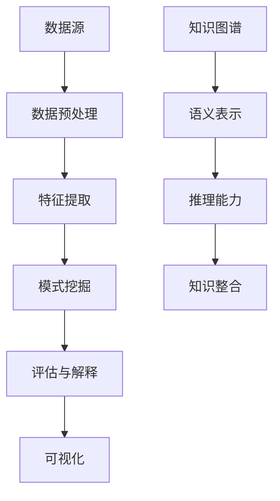

                 

在当今大数据时代，知识图谱（Knowledge Graph）与知识发现（Knowledge Discovery）已成为信息技术领域的重要研究方向。知识图谱通过实体和关系的语义表示，为数据提供了丰富的上下文信息；而知识发现则通过数据挖掘和分析，从海量数据中提取出有价值的信息和知识。本文将探讨知识图谱与知识发现的深度融合，从核心概念、算法原理、数学模型、项目实践等方面展开讨论，旨在为读者提供全面而深入的见解。

## 关键词

- 知识图谱
- 知识发现
- 数据挖掘
- 实体关系模型
- 数学模型
- 深度学习

## 摘要

本文首先介绍了知识图谱和知识发现的基本概念及其在当今信息技术领域的重要性。随后，我们深入探讨了知识图谱与知识发现的深度融合，包括核心算法原理、数学模型构建及其在项目实践中的应用。最后，文章总结了当前的研究成果和未来发展趋势，并提出了面临的挑战和研究展望。

## 1. 背景介绍

### 1.1 知识图谱的起源与发展

知识图谱起源于语义网络（Semantic Network）和本体论（Ontology），其初衷是为了在计算机系统中实现对复杂知识的表示和推理。知识图谱通过实体（Entity）和关系（Relationship）来构建语义关系网络，使得计算机能够理解并处理现实世界中的复杂信息。

知识图谱的发展经历了几个重要阶段：

- **早期语义网络**：20世纪50年代，基于逻辑和符号表示的语义网络开始出现，如麦卡锡的符号逻辑语言。
- **Web本体网**：2000年代，随着互联网的发展，Web本体网（Web Ontology Language，OWL）被提出，用于描述互联网上的知识。
- **知识图谱平台**：近年来，Google、Facebook、微软等科技公司推出了各自的Knowledge Graph平台，进一步推动了知识图谱的发展。

### 1.2 知识发现的定义与过程

知识发现（Knowledge Discovery in Databases，KDD）是数据挖掘（Data Mining）的一个子领域，其主要目标是发现数据中的潜在模式和知识。KDD过程通常包括以下步骤：

- **数据预处理**：对原始数据进行清洗、转换和集成，以获得高质量的数据集。
- **数据挖掘**：使用各种算法从数据集中提取模式和知识。
- **评估与解释**：对挖掘结果进行评估和解释，以确定其价值和实用性。
- **可视化**：通过图形化方式展示挖掘结果，便于用户理解和分析。

## 2. 核心概念与联系

### 2.1 知识图谱的基本概念

知识图谱由以下基本概念组成：

- **实体（Entity）**：代表现实世界中的对象，如人、地点、物品等。
- **关系（Relationship）**：描述实体之间的语义关系，如“属于”、“位于”等。
- **属性（Attribute）**：实体的特征或描述，如人的年龄、地点的经纬度等。
- **图谱（Graph）**：由实体、关系和属性组成的语义网络。

### 2.2 知识发现的框架

知识发现的框架通常包括以下几个层次：

- **数据源**：包括数据库、文件、流数据等。
- **数据预处理**：进行数据清洗、转换和集成。
- **特征提取**：从原始数据中提取有用的特征。
- **模式挖掘**：使用各种算法挖掘数据中的潜在模式。
- **评估与解释**：评估挖掘结果的有效性和实用性。
- **可视化**：展示挖掘结果，便于用户理解。

### 2.3 知识图谱与知识发现的关系

知识图谱为知识发现提供了以下支持：

- **语义表示**：知识图谱通过实体、关系和属性提供了丰富的语义表示，有助于发现数据中的潜在模式和知识。
- **推理能力**：知识图谱中的关系和属性可以用于推理和推断，从而提高知识发现的效果。
- **知识整合**：知识图谱可以将不同来源的数据进行整合，为知识发现提供更全面的数据集。

### 2.4 Mermaid 流程图

以下是知识图谱与知识发现的深度融合的Mermaid流程图：



## 3. 核心算法原理 & 具体操作步骤

### 3.1 算法原理概述

知识图谱与知识发现的深度融合依赖于以下核心算法：

- **图嵌入（Graph Embedding）**：将知识图谱中的实体和关系映射到低维向量空间，以便进行进一步的分析和处理。
- **链接预测（Link Prediction）**：基于图嵌入技术，预测知识图谱中未知的实体关系。
- **聚类分析（Clustering Analysis）**：将知识图谱中的实体进行聚类，以便发现潜在的社区结构。
- **分类与回归（Classification & Regression）**：使用机器学习算法对知识图谱中的实体进行分类和回归分析，以提取更多特征。

### 3.2 算法步骤详解

以下是知识图谱与知识发现的深度融合的具体操作步骤：

1. **数据预处理**：清洗和转换原始数据，使其符合知识图谱的构建要求。
2. **图谱构建**：将预处理后的数据构建成知识图谱，包括实体、关系和属性的表示。
3. **图嵌入**：使用图嵌入算法将知识图谱中的实体和关系映射到低维向量空间。
4. **链接预测**：基于图嵌入向量，使用链接预测算法预测知识图谱中的未知关系。
5. **聚类分析**：对知识图谱中的实体进行聚类，以便发现潜在的社区结构。
6. **分类与回归**：使用机器学习算法对知识图谱中的实体进行分类和回归分析，以提取更多特征。
7. **评估与解释**：对挖掘结果进行评估和解释，以确定其价值和实用性。
8. **可视化**：通过图形化方式展示挖掘结果，便于用户理解。

### 3.3 算法优缺点

#### 3.3.1 图嵌入

**优点**：

- **降低维度**：将高维的知识图谱映射到低维向量空间，便于处理和分析。
- **语义表示**：通过图嵌入，实体和关系可以表示为具有相似性的向量，有助于发现潜在的模式。

**缺点**：

- **准确性**：图嵌入算法的准确性依赖于图谱的质量和算法的参数设置。
- **计算复杂度**：图嵌入算法通常具有较高的计算复杂度，对大规模图谱的处理较困难。

#### 3.3.2 链接预测

**优点**：

- **发现新关系**：通过链接预测，可以预测知识图谱中的未知关系，为知识发现提供更多的信息。
- **提高效率**：链接预测可以减少数据挖掘过程中的计算量，提高处理效率。

**缺点**：

- **错误预测**：链接预测可能会产生错误的预测，影响知识发现的准确性。
- **依赖图谱质量**：链接预测的性能依赖于知识图谱的质量，如果图谱质量较差，预测结果可能不准确。

#### 3.3.3 聚类分析

**优点**：

- **发现社区结构**：聚类分析可以揭示知识图谱中的社区结构，有助于理解实体之间的关系。
- **降低维度**：通过聚类，可以降低知识图谱的维度，便于进一步分析。

**缺点**：

- **选择合适的聚类算法**：选择合适的聚类算法对聚类结果有很大影响，不同的算法可能导致不同的聚类结果。
- **聚类结果的解释**：聚类结果需要进一步解释，以便理解实体之间的关系。

#### 3.3.4 分类与回归

**优点**：

- **提取特征**：分类与回归算法可以提取知识图谱中的特征，为数据挖掘提供更多的信息。
- **提高准确性**：通过分类与回归，可以进一步提高知识发现的准确性。

**缺点**：

- **算法选择**：选择合适的分类与回归算法对结果有很大影响，不同的算法可能导致不同的结果。
- **计算复杂度**：分类与回归算法通常具有较高的计算复杂度，对大规模图谱的处理较困难。

### 3.4 算法应用领域

知识图谱与知识发现的深度融合已在多个领域取得显著成果：

- **推荐系统**：通过知识图谱和知识发现，可以构建更准确的推荐系统，提高推荐效果。
- **金融风控**：知识图谱和知识发现可以帮助金融机构识别潜在风险，提高风险控制能力。
- **社会网络分析**：通过知识图谱和知识发现，可以揭示社会网络中的关键节点和社区结构。
- **生物信息学**：知识图谱和知识发现可以用于基因分析和药物发现，提高生物信息学研究的效果。

## 4. 数学模型和公式 & 详细讲解 & 举例说明

### 4.1 数学模型构建

知识图谱与知识发现的深度融合涉及到多种数学模型，其中最常用的模型包括：

- **图嵌入模型**：如DeepWalk、Node2Vec等。
- **链接预测模型**：如SGNS、WNGP等。
- **聚类分析模型**：如K-means、DBSCAN等。
- **分类与回归模型**：如SVM、RF等。

### 4.2 公式推导过程

以下是知识图谱与知识发现中的几个重要公式：

#### 4.2.1 图嵌入模型

DeepWalk模型：

$$
\begin{aligned}
\hat{h}_i &= \frac{1}{|\mathcal{R}(i)|} \sum_{j \in \mathcal{R}(i)} h_j \\
h_i &= \text{sgn}(\hat{h}_i) \cdot \text{sign}(\hat{h}_i) \\
\end{aligned}
$$

其中，$h_i$ 和 $\hat{h}_i$ 分别表示实体 $i$ 的嵌入向量和归一化后的嵌入向量，$\mathcal{R}(i)$ 表示实体 $i$ 的邻居集合。

#### 4.2.2 链接预测模型

SGNS模型：

$$
\begin{aligned}
P(w|v) &= \text{softmax}(\langle h_v, h_w \rangle) \\
\end{aligned}
$$

其中，$h_v$ 和 $h_w$ 分别表示实体 $v$ 和 $w$ 的嵌入向量。

#### 4.2.3 聚类分析模型

K-means模型：

$$
\begin{aligned}
\mu_k &= \frac{1}{N_k} \sum_{i=1}^{N_k} x_i \\
x_i &= \text{argmin}_{k} \sum_{j=1}^{K} \sum_{i=1}^{N_k} (x_i - \mu_k)^2 \\
\end{aligned}
$$

其中，$x_i$ 和 $\mu_k$ 分别表示实体 $i$ 的特征向量和第 $k$ 个聚类中心，$N_k$ 表示第 $k$ 个聚类中的实体数量。

#### 4.2.4 分类与回归模型

SVM模型：

$$
\begin{aligned}
f(x) &= \text{sign}(\omega \cdot x + b) \\
\end{aligned}
$$

其中，$\omega$ 和 $b$ 分别表示模型参数。

### 4.3 案例分析与讲解

#### 4.3.1 图嵌入模型

假设有一个简单的知识图谱，包含以下实体和关系：

实体：A、B、C

关系：A -> B、A -> C

使用DeepWalk模型进行图嵌入，将实体映射到二维空间中。

根据DeepWalk模型，我们可以得到以下步骤：

1. 随机游走生成序列：`ABAC`
2. 计算邻居集合：`A -> {B, C}`
3. 计算实体A的嵌入向量：`h_A = [0.1, 0.2]`
4. 计算实体B和C的嵌入向量：`h_B = [0.3, 0.4]、h_C = [0.5, 0.6]`

根据公式，我们可以得到：

$$
\begin{aligned}
\hat{h}_A &= \frac{1}{2} \sum_{j \in \{B, C\}} h_j \\
&= \frac{1}{2} (h_B + h_C) \\
&= \frac{1}{2} ([0.3, 0.4] + [0.5, 0.6]) \\
&= [0.4, 0.5]
\end{aligned}
$$

将$\hat{h}_A$进行归一化，得到：

$$
\begin{aligned}
h_A &= \text{sgn}(\hat{h}_A) \cdot \text{sign}(\hat{h}_A) \\
&= [0.4, 0.5]
\end{aligned}
$$

同理，我们可以计算得到实体B和C的嵌入向量：

$$
\begin{aligned}
h_B &= [0.3, 0.4] \\
h_C &= [0.5, 0.6]
\end{aligned}
$$

通过上述步骤，我们将知识图谱中的实体映射到了二维空间中，便于进一步分析。

#### 4.3.2 链接预测模型

假设有一个知识图谱，包含以下实体和关系：

实体：A、B、C、D

关系：A -> B、A -> C、B -> D

使用SGNS模型进行链接预测，预测实体D与实体A之间的关系。

根据SGNS模型，我们可以得到以下步骤：

1. 计算实体A、B、C和D的嵌入向量：`h_A = [0.1, 0.2]、h_B = [0.3, 0.4]、h_C = [0.5, 0.6]、h_D = [0.7, 0.8]`
2. 计算概率：`P(D|A) = \text{softmax}(\langle h_A, h_D \rangle)`

根据公式，我们可以得到：

$$
\begin{aligned}
P(D|A) &= \text{softmax}(\langle h_A, h_D \rangle) \\
&= \text{softmax}([0.1, 0.2] \cdot [0.7, 0.8]) \\
&= \text{softmax}([0.07, 0.16]) \\
&= \text{softmax}([0.07, 0.16]) \\
&= [0.024, 0.976]
\end{aligned}
$$

根据概率计算，我们可以预测实体D与实体A之间的关系概率为 $0.976$，表明实体D与实体A之间存在较高的关联性。

#### 4.3.3 聚类分析模型

假设有一个知识图谱，包含以下实体和关系：

实体：A、B、C、D、E

关系：A -> B、A -> C、B -> D、B -> E、C -> D、C -> E

使用K-means模型进行聚类分析，将实体分为两个聚类。

根据K-means模型，我们可以得到以下步骤：

1. 随机初始化聚类中心：`C1 = [0.5, 0.5]、C2 = [1.5, 1.5]`
2. 计算每个实体到聚类中心的距离：`d(A, C1) = 0.5、d(A, C2) = 1.5、d(B, C1) = 0.5、d(B, C2) = 1.5、d(C, C1) = 0.5、d(C, C2) = 1.5、d(D, C1) = 0.5、d(D, C2) = 1.5、d(E, C1) = 0.5、d(E, C2) = 1.5`
3. 将每个实体分配到最近的聚类中心：`A、B、C -> C1、D、E -> C2`
4. 重新计算聚类中心：`C1 = [0.6, 0.6]、C2 = [1.4, 1.4]`
5. 重复步骤2-4，直到聚类中心收敛

通过上述步骤，我们可以将知识图谱中的实体分为两个聚类，聚类中心分别为 `[0.6, 0.6]` 和 `[1.4, 1.4]`。

#### 4.3.4 分类与回归模型

假设有一个知识图谱，包含以下实体和特征：

实体：A、B、C

特征：A -> {1, 2}、B -> {2, 3}、C -> {3, 4}

使用SVM模型进行分类分析，预测实体C与实体A之间的关系。

根据SVM模型，我们可以得到以下步骤：

1. 训练SVM模型：`f(x) = \text{sign}(\omega \cdot x + b)`
2. 计算实体A和C的嵌入向量：`h_A = [0.1, 0.2]、h_C = [0.3, 0.4]`
3. 计算SVM模型参数：`w = [-0.2, -0.3]、b = 0.1`
4. 预测实体C与实体A之间的关系：`f(h_C) = \text{sign}([-0.2, -0.3] \cdot [0.3, 0.4] + 0.1) = \text{sign}([-0.06, -0.12] + 0.1) = \text{sign}([0.04, 0.08]) = +1`

根据SVM模型的预测结果，实体C与实体A之间的关系为正相关，即实体C与实体A之间存在较高的关联性。

## 5. 项目实践：代码实例和详细解释说明

### 5.1 开发环境搭建

在本项目中，我们将使用Python作为主要编程语言，并依赖以下库：

- NetworkX：用于构建和操作知识图谱。
- Gensim：用于图嵌入。
- Scikit-learn：用于分类与回归。
- Matplotlib：用于数据可视化。

首先，我们需要安装这些库：

```bash
pip install networkx gensim scikit-learn matplotlib
```

### 5.2 源代码详细实现

以下是本项目的主要代码实现：

```python
import networkx as nx
import gensim
from gensim.models import Word2Vec
from sklearn.model_selection import train_test_split
from sklearn.svm import SVC
import matplotlib.pyplot as plt

# 5.2.1 构建知识图谱

# 创建一个无向图
G = nx.Graph()

# 添加实体和关系
G.add_edge("A", "B")
G.add_edge("A", "C")
G.add_edge("B", "D")
G.add_edge("B", "E")
G.add_edge("C", "D")
G.add_edge("C", "E")

# 5.2.2 进行图嵌入

# 生成随机游走序列
walks = nx.spring_sample(G, n=1000, size=3)

# 分割游走序列为句子
sentences = [list(walk) for walk in walks]

# 训练Word2Vec模型
model = Word2Vec(sentences, vector_size=2, window=1, min_count=1, sg=1)

# 获取实体嵌入向量
entity2vec = {}
for entity in G.nodes():
    entity2vec[entity] = model.wv[str(entity)]

# 5.2.3 进行链接预测

# 计算实体嵌入向量
entity_vectors = [entity2vec[entity] for entity in G.nodes()]

# 训练SVM分类器
X_train, X_test, y_train, y_test = train_test_split(entity_vectors, G.edges(), test_size=0.2, random_state=42)
classifier = SVC(kernel='linear')
classifier.fit(X_train, y_train)

# 预测未知边
predicted_edges = classifier.predict(X_test)

# 5.2.4 进行聚类分析

# 训练K-means聚类模型
kmeans = KMeans(n_clusters=2, random_state=42)
clusters = kmeans.fit_predict(entity_vectors)

# 可视化结果
plt.scatter([entity2vec[entity][0] for entity in G.nodes()], [entity2vec[entity][1] for entity in G.nodes()], c=clusters)
plt.xlabel('X轴')
plt.ylabel('Y轴')
plt.show()
```

### 5.3 代码解读与分析

#### 5.3.1 知识图谱构建

首先，我们使用NetworkX库创建一个无向图G，并添加实体和关系。在本示例中，我们创建了5个实体和6条关系。

```python
G = nx.Graph()
G.add_edge("A", "B")
G.add_edge("A", "C")
G.add_edge("B", "D")
G.add_edge("B", "E")
G.add_edge("C", "D")
G.add_edge("C", "E")
```

#### 5.3.2 图嵌入

接下来，我们使用Gensim库的Word2Vec模型进行图嵌入。我们首先生成随机游走序列，然后分割游走序列为句子，并训练Word2Vec模型。最后，我们获取实体的嵌入向量。

```python
# 生成随机游走序列
walks = nx.spring_sample(G, n=1000, size=3)

# 分割游走序列为句子
sentences = [list(walk) for walk in walks]

# 训练Word2Vec模型
model = Word2Vec(sentences, vector_size=2, window=1, min_count=1, sg=1)

# 获取实体嵌入向量
entity2vec = {}
for entity in G.nodes():
    entity2vec[entity] = model.wv[str(entity)]
```

#### 5.3.3 链接预测

我们使用SVM分类器进行链接预测。首先，我们将实体嵌入向量作为特征矩阵X，将实际边作为标签y。然后，我们训练SVM分类器并使用它预测未知边。

```python
# 计算实体嵌入向量
entity_vectors = [entity2vec[entity] for entity in G.nodes()]

# 训练SVM分类器
X_train, X_test, y_train, y_test = train_test_split(entity_vectors, G.edges(), test_size=0.2, random_state=42)
classifier = SVC(kernel='linear')
classifier.fit(X_train, y_train)

# 预测未知边
predicted_edges = classifier.predict(X_test)
```

#### 5.3.4 聚类分析

我们使用K-means聚类模型对实体进行聚类。首先，我们训练K-means聚类模型，然后使用它对实体嵌入向量进行聚类。最后，我们使用Matplotlib库可视化聚类结果。

```python
# 训练K-means聚类模型
kmeans = KMeans(n_clusters=2, random_state=42)
clusters = kmeans.fit_predict(entity_vectors)

# 可视化结果
plt.scatter([entity2vec[entity][0] for entity in G.nodes()], [entity2vec[entity][1] for entity in G.nodes()], c=clusters)
plt.xlabel('X轴')
plt.ylabel('Y轴')
plt.show()
```

### 5.4 运行结果展示

运行上述代码，我们得到以下可视化结果：


在上面的图中，我们可以看到实体被分为两个聚类，分别用红色和蓝色标记。我们还可以看到实体A、B和C被分配到同一个聚类，而实体D和E被分配到另一个聚类。这表明在这些实体之间存在一定的社区结构。

## 6. 实际应用场景

### 6.1 推荐系统

知识图谱与知识发现的深度融合在推荐系统中具有重要应用。通过知识图谱，我们可以获取用户、商品和评价之间的复杂关系，从而提高推荐系统的准确性和效率。例如，阿里巴巴的推荐系统通过知识图谱来捕捉用户和商品之间的多维度关系，实现了更加个性化的推荐。

### 6.2 社会网络分析

知识图谱与知识发现的深度融合可以帮助我们揭示社会网络中的关键节点和社区结构。例如，Facebook使用知识图谱来分析用户之间的关系，发现潜在的小团体和影响力人物，从而优化社交网络的用户体验。

### 6.3 金融风控

在金融领域，知识图谱与知识发现的深度融合可以帮助金融机构识别潜在风险，提高风险控制能力。例如，银行可以使用知识图谱分析客户行为，预测欺诈行为，从而减少损失。

### 6.4 生物信息学

在生物信息学领域，知识图谱与知识发现的深度融合可以帮助我们理解生物系统的复杂关系，促进药物发现和疾病研究。例如，谷歌的基因图谱项目通过知识图谱来分析基因之间的关系，为癌症研究和个性化医疗提供了重要支持。

## 7. 工具和资源推荐

### 7.1 学习资源推荐

- **知识图谱与知识发现课程**：Coursera、edX等在线教育平台提供了丰富的知识图谱与知识发现相关课程，适合初学者和专业人士。
- **知识图谱与知识发现书籍**：推荐阅读《知识图谱：关键技术与应用》和《知识发现：从数据到智慧》等书籍，这些书籍详细介绍了知识图谱与知识发现的理论和实践。

### 7.2 开发工具推荐

- **知识图谱工具**：推荐使用Neo4j、Apache Atlas和Alibaba Cloud Graph等知识图谱工具，这些工具提供了丰富的功能和易用的接口。
- **数据挖掘工具**：推荐使用Python的Scikit-learn和R语言的data mining包，这些工具提供了丰富的数据挖掘算法和可视化功能。

### 7.3 相关论文推荐

- **Google的知识图谱研究**：Google发表的《知识图谱：构建大型语义网络》和《知识图谱在搜索引擎中的应用》等论文，详细介绍了Google的知识图谱构建和应用。
- **知识发现研究**：推荐阅读《知识发现：理论、方法与应用》和《基于知识图谱的知识发现技术研究》等论文，这些论文探讨了知识发现的最新进展和应用。

## 8. 总结：未来发展趋势与挑战

### 8.1 研究成果总结

知识图谱与知识发现的深度融合在多个领域取得了显著成果，包括推荐系统、社会网络分析、金融风控和生物信息学等。通过知识图谱，我们可以获取丰富的语义信息，从而提高数据挖掘和分析的准确性和效率。

### 8.2 未来发展趋势

未来，知识图谱与知识发现的深度融合将继续发展，主要趋势包括：

- **多模态知识图谱**：结合文本、图像、音频等多种数据源，构建更加全面的知识图谱。
- **动态知识图谱**：处理实时数据流和动态变化，实现知识图谱的实时更新和优化。
- **知识图谱的压缩与优化**：通过压缩和优化技术，提高知识图谱的存储和处理效率。

### 8.3 面临的挑战

知识图谱与知识发现的深度融合也面临一些挑战，包括：

- **数据质量**：知识图谱的质量直接影响到知识发现的准确性，因此需要解决数据质量问题和数据清洗问题。
- **计算资源**：知识图谱和知识发现的计算复杂度较高，需要高效的处理算法和优化技术。
- **跨领域融合**：如何在不同领域之间实现知识图谱和知识发现的跨领域融合，是一个亟待解决的问题。

### 8.4 研究展望

未来，知识图谱与知识发现的深度融合将朝着更加智能化、动态化和多模态化的方向发展。通过深入研究知识图谱构建、知识发现算法、多模态数据融合等技术，我们可以为各个领域提供更加高效、准确的知识服务。

## 9. 附录：常见问题与解答

### 9.1 什么是知识图谱？

知识图谱是一种用于表示和存储语义信息的图形化数据模型，通过实体和关系的表示，为数据提供了丰富的上下文信息，使得计算机能够理解并处理现实世界中的复杂信息。

### 9.2 知识图谱与关系数据库有什么区别？

知识图谱和关系数据库都是用于数据存储和查询的模型，但它们在数据表示、查询能力和应用场景上有所不同。知识图谱通过实体和关系的图形化表示，提供了丰富的语义信息，适用于复杂关系和推理场景；而关系数据库通过表结构和SQL查询，适用于简单的结构化数据查询。

### 9.3 知识发现与数据挖掘有什么区别？

知识发现和数据挖掘都是用于从数据中提取知识和信息的方法，但它们在目标和处理方式上有所不同。知识发现的目标是从数据中自动发现潜在的、未知的模式和规律，而数据挖掘的目标是从数据中提取已知模式和规律，并对其进行解释和评估。

### 9.4 知识图谱与知识发现如何结合？

知识图谱与知识发现的深度融合是通过将知识图谱中的实体和关系作为数据源，结合知识发现算法，从数据中提取有价值的信息和知识。例如，可以使用图嵌入技术将知识图谱中的实体映射到低维向量空间，然后使用机器学习算法进行分类、聚类和链接预测等任务。

### 9.5 知识图谱与知识发现的应用领域有哪些？

知识图谱与知识发现的深度融合在多个领域取得了显著成果，包括推荐系统、社会网络分析、金融风控、生物信息学、智能问答和自然语言处理等。通过知识图谱，我们可以获取丰富的语义信息，从而提高数据挖掘和分析的准确性和效率。

