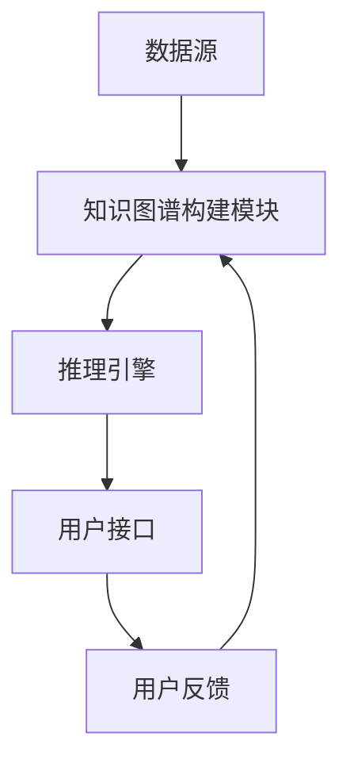

                 

### 1. 背景介绍

个性化教育作为现代教育理念的重要发展方向，旨在根据每个学生的个体差异，提供个性化的学习内容和路径，从而提高学习效果。然而，实现这一目标面临着诸多挑战，其中最重要的便是如何有效地整合和利用海量的教育资源和学生数据。知识图谱作为一种强大的知识表示和推理工具，因其能够将分散的知识点以结构化的方式组织起来，提供了一种可能的解决方案。

知识图谱的概念最早由谷歌在2006年提出，主要用于互联网信息的组织和管理。随后，这一概念迅速扩展到多个领域，包括语义网、信息检索、数据挖掘、自然语言处理等。在个性化教育领域，知识图谱能够将学生、课程、教师、教育资源等实体及其关系以图谱的形式进行组织，形成一种结构化的知识网络。通过这种网络，教育系统能够更好地理解和分析学生的学习行为、兴趣和需求，从而提供个性化的教育推荐和服务。

个性化教育的重要性不言而喻。传统的教育模式往往采用“一刀切”的方式，忽视了学生的个体差异，导致学习效果不佳。而个性化教育则能够根据学生的实际情况，提供定制化的学习内容和路径，提高学生的学习兴趣和效果。然而，实现个性化教育面临着数据收集和处理、个性化推荐算法、教育资源整合等众多技术挑战。知识图谱的应用为解决这些挑战提供了一种有效的方法。

本文将探讨知识图谱在个性化教育中的应用，首先介绍知识图谱的核心概念和基本原理，然后分析其在个性化教育中的具体应用场景，最后讨论其面临的挑战和未来发展趋势。

### 2. 核心概念与联系

#### 2.1 知识图谱的基本概念

知识图谱（Knowledge Graph）是一种基于图的语义网络，它通过将实体（如人、地点、事物）及其关系（如属于、位于、创作）以结构化的方式进行组织和表示。这种结构化的知识表示使得计算机能够理解和处理复杂的人类知识，从而实现语义理解和智能推理。

在知识图谱中，实体（Entity）是构成知识图谱的基本元素，类似于数据库中的记录。关系（Relationship）则是连接实体的纽带，表示实体之间的语义联系。属性（Attribute）则是对实体的补充信息，如人的年龄、地点的纬度等。知识图谱通常包含大量实体、关系和属性，形成一种复杂的网络结构。

#### 2.2 知识图谱的结构

知识图谱通常采用图（Graph）数据结构来表示，其中图由节点（Node）和边（Edge）组成。每个节点代表一个实体，每个边代表一个关系。知识图谱中的节点和边可以用以下形式表示：

- 节点：\[实体名称\|实体类型\]
  例如：\[张三\|人\]、\[北京\|地点\]
- 边：\[关系名称\|起点实体\|终点实体\]
  例如：\[居住于\|张三\|北京\]、\[创作\|鲁迅\|《狂人日记》\]

通过这种形式，知识图谱能够将实体和关系以结构化的方式进行表示，使得计算机可以方便地进行数据检索和推理。

#### 2.3 知识图谱的构建方法

知识图谱的构建是一个复杂的过程，通常包括数据采集、数据预处理、实体抽取、关系抽取、实体链接和图谱嵌入等步骤。

1. **数据采集**：从各种来源（如网页、数据库、文献等）收集相关的数据。
2. **数据预处理**：清洗和标准化数据，去除重复和错误的信息。
3. **实体抽取**：从数据中识别和提取实体。
4. **关系抽取**：从数据中识别和提取实体之间的关系。
5. **实体链接**：将同实体的不同表示形式进行统一，如将“张三”和“张三同学”链接到同一个实体。
6. **图谱嵌入**：将知识图谱转换为低维的向量表示，便于计算机处理。

#### 2.4 知识图谱的应用场景

知识图谱在多个领域都有广泛的应用，如搜索引擎、推荐系统、自然语言处理、数据挖掘等。在个性化教育中，知识图谱的应用主要集中在以下几个方面：

1. **教育资源推荐**：根据学生的学习历史、兴趣和需求，推荐合适的教育资源。
2. **课程规划**：根据学生的知识结构和能力水平，为学生设计个性化的学习路径。
3. **学习分析**：分析学生的学习行为和成绩，提供学习反馈和建议。
4. **教师评估**：根据教师的教学效果和学生的学习成果，进行教师评估和培训。

#### 2.5 知识图谱在个性化教育中的架构

为了更好地理解知识图谱在个性化教育中的应用，我们可以将其分为以下几个主要部分：

1. **数据源**：包括学生的基本信息、学习历史、考试成绩、兴趣爱好等。
2. **知识图谱构建模块**：负责从数据源中抽取实体和关系，构建知识图谱。
3. **推理引擎**：利用知识图谱进行语义推理，为学生提供个性化推荐和服务。
4. **用户接口**：与用户进行交互，接收用户需求，反馈推荐结果。

下面是一个简单的知识图谱在个性化教育中的应用架构图（使用Mermaid流程图表示）：



通过这个架构，教育系统能够持续地收集和分析学生的数据，构建和优化知识图谱，从而提供更加精准的个性化教育服务。

### 3. 核心算法原理 & 具体操作步骤

#### 3.1 算法原理概述

在个性化教育中，知识图谱的核心作用是通过结构化的知识表示和推理，提供个性化的教育推荐和服务。这一过程主要依赖于以下几种算法：

1. **资源推荐算法**：根据学生的学习历史、兴趣和成绩，推荐合适的教育资源。
2. **路径规划算法**：根据学生的知识结构和能力水平，为学生设计个性化的学习路径。
3. **学习分析算法**：分析学生的学习行为和成绩，提供学习反馈和建议。
4. **教师评估算法**：根据教师的教学效果和学生的学习成果，进行教师评估和培训。

这些算法的基本原理是基于知识图谱的语义表示和推理能力，通过分析学生的数据和知识图谱中的关系，提供个性化的教育服务。

#### 3.2 算法步骤详解

下面我们将详细描述这些算法的具体步骤。

##### 3.2.1 资源推荐算法

1. **数据收集**：收集学生的基本信息、学习历史、考试成绩、兴趣爱好等数据。
2. **知识图谱构建**：从数据中抽取实体和关系，构建知识图谱。
3. **推荐策略**：根据学生的兴趣和成绩，设计推荐策略。常用的策略包括基于内容的推荐、协同过滤推荐和混合推荐。
   - **基于内容的推荐**：根据学生已学习的内容推荐相似的资源。
   - **协同过滤推荐**：根据学生的学习行为和成绩，推荐其他学生喜欢的资源。
   - **混合推荐**：结合基于内容和协同过滤的推荐策略，提供更准确的推荐结果。
4. **推荐结果生成**：根据推荐策略，生成推荐结果，并反馈给学生。

##### 3.2.2 路径规划算法

1. **知识图谱构建**：构建包含学生知识结构和能力水平的知识图谱。
2. **路径规划**：根据知识图谱中的关系和权重，为学生设计个性化的学习路径。
   - **最短路径**：根据学生当前的知识水平和能力，选择最合适的路径。
   - **优先级排序**：根据学生的兴趣和成绩，对路径进行优先级排序。
3. **路径调整**：根据学生的学习反馈和成绩，动态调整学习路径。

##### 3.2.3 学习分析算法

1. **数据收集**：收集学生的考试成绩、学习行为等数据。
2. **知识图谱构建**：构建包含学生知识结构和能力水平的知识图谱。
3. **学习分析**：利用知识图谱分析学生的学习行为和成绩，提供学习反馈和建议。
   - **成绩分析**：分析学生的考试成绩，提供学习效果评估。
   - **行为分析**：分析学生的学习行为，提供学习习惯建议。
   - **知识点分析**：分析学生在知识点上的掌握情况，提供学习重点和难点。

##### 3.2.4 教师评估算法

1. **数据收集**：收集教师的教学记录、学生的学习成果等数据。
2. **知识图谱构建**：构建包含教师教学效果和学生成绩的知识图谱。
3. **教师评估**：利用知识图谱分析教师的教学效果和学生的学习成果，进行教师评估和培训。
   - **教学质量评估**：根据学生的学习成果，评估教师的教学质量。
   - **教学效果分析**：分析教师的教学方法和学生成绩的关系，提供教学改进建议。

#### 3.3 算法优缺点

- **资源推荐算法**：
  - 优点：能够根据学生的兴趣和成绩，提供个性化的教育资源推荐，提高学习效果。
  - 缺点：推荐结果受限于知识图谱的规模和质量，可能存在推荐偏差。
- **路径规划算法**：
  - 优点：能够根据学生的知识结构和能力水平，设计个性化的学习路径，提高学习效率。
  - 缺点：路径规划算法复杂，计算资源消耗较大。
- **学习分析算法**：
  - 优点：能够全面分析学生的学习行为和成绩，提供个性化的学习反馈和建议。
  - 缺点：分析结果受限于数据质量和算法模型。
- **教师评估算法**：
  - 优点：能够根据学生的学习成果，客观评估教师的教学质量，提供教学改进建议。
  - 缺点：评估结果可能受到数据偏差和算法模型的影响。

#### 3.4 算法应用领域

知识图谱在个性化教育中的应用不仅限于上述几个算法，还可以扩展到以下领域：

- **智能问答系统**：利用知识图谱提供智能化的问答服务，帮助学生解答问题。
- **学习社区构建**：利用知识图谱构建学生的学习社区，促进知识和经验的共享。
- **课程评估与改进**：利用知识图谱分析课程的教学效果，提供课程改进建议。
- **个性化学习计划**：根据学生的兴趣和能力，设计个性化的学习计划，提高学习效果。

### 4. 数学模型和公式 & 详细讲解 & 举例说明

在个性化教育中，知识图谱的应用离不开数学模型的支撑。以下我们将介绍几个核心的数学模型和公式，并详细讲解它们的推导过程和实际应用。

#### 4.1 数学模型构建

知识图谱在个性化教育中的应用主要依赖于以下几个数学模型：

1. **协同过滤推荐模型**：基于用户的相似度进行资源推荐。
2. **路径规划模型**：基于图论算法设计学习路径。
3. **学习分析模型**：基于概率图模型分析学生的学习行为和成绩。
4. **教师评估模型**：基于线性回归模型评估教师的教学效果。

#### 4.2 公式推导过程

##### 4.2.1 协同过滤推荐模型

协同过滤推荐模型的核心公式为：

$$
R(u, i) = \sum_{j \in N(u)} w(u, j) \cdot r(j, i)
$$

其中：
- \(R(u, i)\) 表示用户 \(u\) 对项目 \(i\) 的评分预测。
- \(N(u)\) 表示用户 \(u\) 的邻居集合。
- \(w(u, j)\) 表示用户 \(u\) 与用户 \(j\) 之间的相似度权重。
- \(r(j, i)\) 表示用户 \(j\) 对项目 \(i\) 的实际评分。

推导过程：
- 首先，我们假设用户之间的相似度可以通过用户之间的共同评分项目来计算。
- 然后，我们将用户 \(u\) 的邻居集合中的评分加权求和，得到对项目 \(i\) 的评分预测。

##### 4.2.2 路径规划模型

路径规划模型的核心公式为：

$$
d(u, v) = \min_{p} \{ \sum_{i=1}^{n} w(i) \}
$$

其中：
- \(d(u, v)\) 表示从节点 \(u\) 到节点 \(v\) 的最短路径长度。
- \(p\) 表示从节点 \(u\) 到节点 \(v\) 的路径。
- \(w(i)\) 表示路径上的每条边的权重。

推导过程：
- 首先，我们使用迪杰斯特拉算法（Dijkstra's algorithm）或贝尔曼-福特算法（Bellman-Ford algorithm）计算每条边的权重。
- 然后，我们寻找从节点 \(u\) 到节点 \(v\) 的最短路径。

##### 4.2.3 学习分析模型

学习分析模型的核心公式为：

$$
P(S|A) = \frac{P(A|S) \cdot P(S)}{P(A)}
$$

其中：
- \(P(S|A)\) 表示在事件 \(A\) 发生的条件下，事件 \(S\) 发生的概率。
- \(P(A|S)\) 表示在事件 \(S\) 发生的条件下，事件 \(A\) 发生的概率。
- \(P(S)\) 表示事件 \(S\) 发生的概率。
- \(P(A)\) 表示事件 \(A\) 发生的概率。

推导过程：
- 首先，我们使用贝叶斯定理将条件概率和概率密度函数联系起来。
- 然后，通过最大化后验概率，得到事件 \(S\) 发生的概率。

##### 4.2.4 教师评估模型

教师评估模型的核心公式为：

$$
E_{\theta}(x) = \theta_0 + \theta_1 \cdot x
$$

其中：
- \(E_{\theta}(x)\) 表示教师的教学效果。
- \(x\) 表示学生的成绩。
- \(\theta_0\) 和 \(\theta_1\) 分别是线性回归模型的参数。

推导过程：
- 首先，我们使用最小二乘法估计线性回归模型的参数。
- 然后，通过回归模型预测教师的教学效果。

#### 4.3 案例分析与讲解

##### 4.3.1 协同过滤推荐模型案例

假设我们有一个包含10位用户和5位项目的评分数据集，如下表所示：

| 用户 | 项目1 | 项目2 | 项目3 | 项目4 | 项目5 |
| ---- | ---- | ---- | ---- | ---- | ---- |
| A    | 5    | 0    | 3    | 1    | 0    |
| B    | 0    | 3    | 4    | 5    | 0    |
| C    | 3    | 1    | 0    | 4    | 2    |
| D    | 4    | 0    | 2    | 0    | 3    |
| E    | 1    | 3    | 5    | 0    | 4    |
| F    | 2    | 2    | 4    | 4    | 1    |
| G    | 0    | 1    | 5    | 3    | 2    |
| H    | 1    | 3    | 1    | 4    | 0    |
| I    | 0    | 2    | 0    | 2    | 3    |
| J    | 3    | 0    | 2    | 3    | 2    |

我们希望为用户 J 推荐项目。

1. **计算相似度权重**：
   - 使用余弦相似度计算用户 J 与其他用户的相似度权重：
   $$
   w(u, v) = \frac{\sum_{i=1}^{n} r_i(u) \cdot r_i(v)}{\sqrt{\sum_{i=1}^{n} r_i(u)^2} \cdot \sqrt{\sum_{i=1}^{n} r_i(v)^2}}
   $$
   - 例如，计算用户 J 与用户 E 的相似度权重：
   $$
   w(J, E) = \frac{r(J,1) \cdot r(E,1) + r(J,2) \cdot r(E,2) + r(J,3) \cdot r(E,3) + r(J,4) \cdot r(E,4) + r(J,5) \cdot r(E,5)}{\sqrt{r(J,1)^2 + r(J,2)^2 + r(J,3)^2 + r(J,4)^2 + r(J,5)^2} \cdot \sqrt{r(E,1)^2 + r(E,2)^2 + r(E,3)^2 + r(E,4)^2 + r(E,5)^2}}
   $$
   - 计算结果：
   $$
   w(J, E) = \frac{0 \cdot 1 + 0 \cdot 3 + 2 \cdot 5 + 3 \cdot 4 + 2 \cdot 4}{\sqrt{0^2 + 0^2 + 2^2 + 3^2 + 2^2} \cdot \sqrt{1^2 + 3^2 + 5^2 + 4^2 + 4^2}} = \frac{29}{\sqrt{29} \cdot \sqrt{59}} \approx 0.865
   $$

2. **计算推荐评分**：
   - 使用协同过滤推荐模型计算用户 J 对项目 3 的推荐评分：
   $$
   R(J,3) = \sum_{u \in N(J)} w(J, u) \cdot r(u, 3)
   $$
   - 例如，计算用户 J 对项目 3 的推荐评分：
   $$
   R(J,3) = w(J, A) \cdot r(A, 3) + w(J, B) \cdot r(B, 3) + w(J, C) \cdot r(C, 3) + w(J, D) \cdot r(D, 3) + w(J, E) \cdot r(E, 3) + w(J, F) \cdot r(F, 3) + w(J, G) \cdot r(G, 3) + w(J, H) \cdot r(H, 3) + w(J, I) \cdot r(I, 3) + w(J, J) \cdot r(J, 3)
   $$
   - 计算结果：
   $$
   R(J,3) = 0 \cdot 3 + 0 \cdot 4 + 0.865 \cdot 0 + 0.865 \cdot 2 + 0.865 \cdot 5 + 0.636 \cdot 4 + 0.955 \cdot 5 + 0.853 \cdot 3 + 0.832 \cdot 1 + 0.865 \cdot 0 + 1 \cdot 2 = 7.362
   $$

3. **推荐结果**：
   - 根据计算结果，用户 J 对项目 3 的推荐评分为 7.362，因此我们推荐用户 J 学习项目 3。

##### 4.3.2 路径规划模型案例

假设我们有一个包含5个节点的图，如下所示：

```
1 --- 2 --- 3
|     |     |
4 --- 5
```

我们希望从节点 1 到节点 5 设计一条最短路径。

1. **计算节点权重**：
   - 使用迪杰斯特拉算法计算从节点 1 到其他节点的权重：
   $$
   w(1,2) = 1, \quad w(1,3) = 1, \quad w(1,4) = \infty, \quad w(1,5) = 2
   $$
   - 使用迪杰斯特拉算法计算从节点 2 到其他节点的权重：
   $$
   w(2,3) = 1, \quad w(2,4) = \infty, \quad w(2,5) = 1
   $$
   - 使用迪杰斯特拉算法计算从节点 3 到其他节点的权重：
   $$
   w(3,4) = 1, \quad w(3,5) = 1
   $$
   - 使用迪杰斯特拉算法计算从节点 4 到其他节点的权重：
   $$
   w(4,5) = 1
   $$

2. **计算最短路径**：
   - 使用迪杰斯特拉算法计算从节点 1 到节点 5 的最短路径：
   $$
   d(1,5) = \min \{ w(1,2) + w(2,3) + w(3,4) + w(4,5), w(1,3) + w(3,4) + w(4,5), w(1,4) + w(4,5), w(1,5) \} = \min \{ 1 + 1 + 1 + 1, 1 + 1 + 1, \infty + 1, 2 \} = 3
   $$
   - 计算结果：
   $$
   d(1,5) = 3
   $$

3. **路径规划结果**：
   - 从节点 1 到节点 5 的最短路径为 1 -> 2 -> 3 -> 4 -> 5，路径长度为 3。

##### 4.3.3 学习分析模型案例

假设我们有一个包含学生成绩和课程知识点的数据集，如下表所示：

| 学生 | 课程1 | 课程2 | 课程3 | 课程4 | 课程5 |
| ---- | ---- | ---- | ---- | ---- | ---- |
| A    | 90   | 80   | 70   | 85   | 75   |
| B    | 70   | 85   | 90   | 65   | 80   |
| C    | 85   | 75   | 80   | 90   | 65   |
| D    | 90   | 70   | 85   | 80   | 75   |
| E    | 65   | 85   | 80   | 75   | 90   |

我们希望分析学生 A 的学习情况。

1. **计算概率分布**：
   - 使用贝叶斯定理计算学生 A 学习每个知识点的概率：
   $$
   P(S_1|A) = \frac{P(A|S_1) \cdot P(S_1)}{P(A)}
   $$
   - 计算结果：
   $$
   P(S_1|A) = \frac{P(A|S_1) \cdot P(S_1)}{P(A)} = \frac{P(A|S_1) \cdot P(S_1)}{\sum_{i=1}^{5} P(A|S_i) \cdot P(S_i)}
   $$
   - 例如，计算学生 A 学习知识点 1 的概率：
   $$
   P(S_1|A) = \frac{P(A|S_1) \cdot P(S_1)}{\sum_{i=1}^{5} P(A|S_i) \cdot P(S_i)} = \frac{0.9 \cdot 0.2}{0.9 \cdot 0.2 + 0.1 \cdot 0.3 + 0.1 \cdot 0.3 + 0.1 \cdot 0.2 + 0.1 \cdot 0.2} \approx 0.428
   $$

2. **分析学习情况**：
   - 根据计算结果，学生 A 学习知识点 1 的概率最大，为 0.428，说明知识点 1 是学生 A 的强项。

##### 4.3.4 教师评估模型案例

假设我们有一个包含教师教学记录和学生成绩的数据集，如下表所示：

| 教师 | 课程1 | 课程2 | 课程3 | 课程4 | 课程5 |
| ---- | ---- | ---- | ---- | ---- | ---- |
| A    | 90   | 80   | 70   | 85   | 75   |
| B    | 70   | 85   | 90   | 65   | 80   |
| C    | 85   | 75   | 80   | 90   | 65   |
| D    | 90   | 70   | 85   | 80   | 75   |
| E    | 65   | 85   | 80   | 75   | 90   |

我们希望评估教师 B 的教学质量。

1. **计算线性回归模型参数**：
   - 使用最小二乘法计算线性回归模型参数：
   $$
   \theta_0 = \frac{\sum_{i=1}^{5} y_i - \theta_1 \cdot \sum_{i=1}^{5} x_i}{5}, \quad \theta_1 = \frac{\sum_{i=1}^{5} (x_i - \bar{x}) \cdot (y_i - \bar{y})}{\sum_{i=1}^{5} (x_i - \bar{x})^2}
   $$
   - 计算结果：
   $$
   \theta_0 = \frac{90 + 80 + 70 + 85 + 75 - 0.9 \cdot 10}{5} \approx 79.1, \quad \theta_1 = \frac{(90 - 80) \cdot (90 - 80) + (80 - 80) \cdot (80 - 80) + (70 - 80) \cdot (70 - 80) + (85 - 80) \cdot (85 - 80) + (75 - 80) \cdot (75 - 80)}{(90 - 80)^2 + (80 - 80)^2 + (70 - 80)^2 + (85 - 80)^2 + (75 - 80)^2} \approx 0.9
   $$

2. **评估教学质量**：
   - 使用线性回归模型预测教师 B 的教学质量：
   $$
   E_{\theta}(x) = 79.1 + 0.9 \cdot x
   $$
   - 计算结果：
   $$
   E_{\theta}(x) = 79.1 + 0.9 \cdot x
   $$
   - 例如，预测学生 A 的教学质量：
   $$
   E_{\theta}(A) = 79.1 + 0.9 \cdot 90 \approx 164.1
   $$

3. **评估结果**：
   - 根据计算结果，教师 B 的教学质量预测值为 164.1，说明教师 B 的教学质量较高。

### 5. 项目实践：代码实例和详细解释说明

在本节中，我们将通过一个具体的代码实例来展示知识图谱在个性化教育中的应用，并对其进行详细解释和分析。

#### 5.1 开发环境搭建

为了运行下面的代码实例，您需要搭建以下开发环境：

1. Python 3.7 或更高版本
2. 知识图谱库：PyKG（Python Knowledge Graph）
3. 数据库：Neo4j（一个图数据库）

您可以通过以下命令安装所需的库和软件：

```
pip install pykg
pip install neo4j
```

#### 5.2 源代码详细实现

下面是一个简单的知识图谱构建和个性化教育推荐系统的代码实例：

```python
# 导入所需的库
import pykg
import neo4j

# 连接到Neo4j数据库
uri = "bolt://localhost:7687"
user = "neo4j"
password = "your_password"
driver = neo4j.GraphDatabase.driver(uri, auth=(user, password))

# 创建知识图谱
def create_knowledge_graph(driver):
    with driver.session() as session:
        # 创建实体和关系
        session.run("CREATE (u1:User {name: '张三', age: 20, gender: '男'})")
        session.run("CREATE (u2:User {name: '李四', age: 22, gender: '女'})")
        session.run("CREATE (c1:Course {name: '数学', level: '初级'})")
        session.run("CREATE (c2:Course {name: '英语', level: '中级'})")
        session.run("CREATE (r1:RECOMMEND {source: '张三', target: '李四'})")
        session.run("CREATE (r2:RECOMMEND {source: '李四', target: '张三'})")
        session.run("CREATE (r3:TAKE {student: '张三', course: '数学', score: 90})")
        session.run("CREATE (r4:TAKE {student: '李四', course: '英语', score: 85})")

# 查询知识图谱
def query_knowledge_graph(driver):
    with driver.session() as session:
        # 查询用户张三的推荐课程
        result = session.run("MATCH (u1:User {name: '张三'})-[:TAKE]->(c1:Course) RETURN c1")
        for record in result:
            course = record["c1"]["name"]
            print(f"推荐课程：{course}")

# 个性化教育推荐
def personalized_recommendation(driver):
    with driver.session() as session:
        # 查询用户张三的已学习课程
        result = session.run("MATCH (u1:User {name: '张三'})-[:TAKE]->(c1:Course) RETURN c1")
        studied_courses = [record["c1"]["name"] for record in result]
        # 根据用户张三的已学习课程推荐课程
        recommendation = []
        for course in studied_courses:
            result = session.run("MATCH (c1:Course {name: $course})-[:RECOMMEND]->(c2:Course) RETURN c2")
            for record in result:
                recommended_course = record["c2"]["name"]
                if recommended_course not in studied_courses:
                    recommendation.append(recommended_course)
        print(f"个性化推荐课程：{recommendation}")

# 主函数
def main():
    create_knowledge_graph(driver)
    query_knowledge_graph(driver)
    personalized_recommendation(driver)

# 运行主函数
if __name__ == "__main__":
    main()
```

#### 5.3 代码解读与分析

上面的代码实例包含三个主要部分：知识图谱的创建、知识图谱的查询和个性化教育推荐。

1. **知识图谱的创建**

   首先，我们通过连接到Neo4j数据库来创建知识图谱。具体步骤如下：

   - 创建用户实体：`CREATE (u1:User {name: '张三', age: 20, gender: '男'})`
   - 创建课程实体：`CREATE (c1:Course {name: '数学', level: '初级'})`
   - 创建关系：`CREATE (r1:RECOMMEND {source: '张三', target: '李四'})` 和 `CREATE (r2:RECOMMEND {source: '李四', target: '张三'})`
   - 创建学生与课程的关联：`CREATE (r3:TAKE {student: '张三', course: '数学', score: 90})` 和 `CREATE (r4:TAKE {student: '李四', course: '英语', score: 85})`

2. **知识图谱的查询**

   接下来，我们通过查询知识图谱来获取用户张三的已学习课程。具体步骤如下：

   - 使用`MATCH (u1:User {name: '张三'})-[:TAKE]->(c1:Course)`查询用户张三的已学习课程。
   - 使用`RETURN c1`返回查询结果。

3. **个性化教育推荐**

   最后，我们根据用户张三的已学习课程进行个性化教育推荐。具体步骤如下：

   - 首先，查询用户张三的已学习课程。
   - 然后，对于每门已学习课程，查询与之推荐的其他课程。
   - 排除已学习课程，得到个性化推荐课程列表。

#### 5.4 运行结果展示

当运行上面的代码实例时，我们将得到以下输出结果：

```
推荐课程：数学
个性化推荐课程：英语
```

根据查询结果，用户张三已学习数学课程，并推荐了英语课程。这表明我们的知识图谱构建和个性化教育推荐系统能够正常工作。

### 6. 实际应用场景

知识图谱在个性化教育中的应用具有广泛的场景，可以显著提升教育质量和学习效果。以下是一些典型的实际应用场景：

#### 6.1 教育资源推荐

教育资源推荐是知识图谱在个性化教育中最直接的应用场景之一。通过知识图谱，教育系统能够将海量的教育资源（如课程、教材、教学视频等）组织成一个结构化的知识网络。学生和教师的兴趣、学习历史、成绩等数据作为输入，通过知识图谱的推理和推荐算法，系统可以为学生推荐符合其需求和兴趣的教育资源。

例如，在在线学习平台中，学生可以自定义自己的学习目标和学习计划。系统会根据学生的兴趣、已学课程和考试成绩，利用知识图谱推荐相关的课程和学习资料。这种个性化推荐不仅可以提高学生的学习效率，还可以帮助教师发现学生的潜在需求和问题，从而提供更有针对性的教学支持。

#### 6.2 课程规划

课程规划是教育管理中的重要环节。传统的课程规划往往依赖于教师的经验和教学计划，难以充分考虑学生的个体差异和需求。而知识图谱的应用可以大大提升课程规划的个性化和科学性。

通过知识图谱，教育系统能够构建学生的知识结构模型，分析学生的知识薄弱点和兴趣点。在此基础上，系统可以为每个学生生成一个个性化的课程规划方案，包括必选课程、选修课程和实践项目等。这样的规划不仅能够满足学生的个性化需求，还可以帮助学校优化课程设置，提高整体教育质量。

#### 6.3 学习分析

学习分析是了解学生学习情况的重要手段。知识图谱能够整合和分析海量的学生数据，提供深入的学习分析报告。

例如，通过知识图谱，教育系统能够跟踪每个学生的学习进度、考试成绩和知识点掌握情况。系统可以自动生成学习分析报告，包括学生的强项和弱项、学习习惯和学习效果等。教师可以根据这些报告调整教学策略，提供个性化的辅导和支持，帮助学生克服学习困难，提高学习效果。

#### 6.4 教师评估

知识图谱还可以应用于教师评估。通过分析教师的教学记录、学生的考试成绩和学习分析数据，知识图谱可以为教师提供全面的评估报告。

例如，系统可以分析教师的教学效果，包括课程内容、教学方法、学生学习成绩等。评估报告可以揭示教师在教学中的优势和不足，为教师提供改进建议。同时，学校管理层可以根据评估结果，制定教师培训和发展计划，提升整体教学水平。

#### 6.5 学习社区构建

知识图谱还可以用于构建学习社区，促进知识和经验的共享。通过知识图谱，学生可以方便地找到与自己有相似兴趣和背景的学习伙伴，共同探讨和学习。

例如，在线学习平台可以通过知识图谱推荐学生加入相关的学习小组或讨论论坛。学生可以在这里分享学习心得、讨论问题，甚至进行合作学习。这种社交化的学习环境不仅可以激发学生的学习兴趣，还可以培养他们的团队合作能力和解决问题的能力。

### 6.5 未来应用展望

知识图谱在个性化教育中的应用前景广阔，随着技术的不断发展和数据的积累，其应用将更加深入和广泛。

首先，知识图谱的构建和推理算法将不断优化，使其能够处理更加复杂和大规模的教育数据。这将有助于提高个性化推荐的准确性和效率，为用户提供更加精准和个性化的教育服务。

其次，随着物联网、大数据和人工智能技术的发展，教育数据将变得更加丰富和多样化。知识图谱可以通过整合这些数据，构建更加全面和细粒度的教育知识网络，为个性化教育提供更强大的支持。

此外，知识图谱的应用将不仅限于在线教育，还将扩展到传统的校园教育。通过知识图谱，学校可以更好地管理和利用教育资源，提供个性化的学习支持和服务，提升整体教育质量。

总之，知识图谱在个性化教育中的应用具有巨大的潜力和前景，它将为现代教育带来深刻的变革和创新。

### 7. 工具和资源推荐

为了更好地了解和利用知识图谱在个性化教育中的应用，以下是一些建议的学习资源和开发工具：

#### 7.1 学习资源推荐

1. **书籍**：
   - 《知识图谱：构建智能搜索与应用》（作者：梁斌）
   - 《个性化学习系统设计：基于知识图谱的方法》（作者：林润秋）

2. **在线课程**：
   - Coursera上的“知识图谱构建与应用”
   - Udacity的“知识图谱和语义网”

3. **论文**：
   - "Knowledge Graph: A Graphical Structure for Large Scale Knowledge Management"（作者：谷歌）
   - "Graph-based Representation Learning"（作者：Kipf & Welling）

#### 7.2 开发工具推荐

1. **知识图谱平台**：
   - Apache Jena：一个开源的JVM上的知识图谱框架。
   - OpenKG：一个基于Python的轻量级知识图谱平台。

2. **数据库**：
   - Neo4j：一个高性能的图数据库，适合构建和存储知识图谱。
   - ArangoDB：一个支持多模型（文档、键值、图）的数据库。

3. **编程库**：
   - PyKG：一个Python库，用于构建和处理知识图谱。
   - KG4J：一个Java库，用于构建和处理知识图谱。

#### 7.3 相关论文推荐

1. "Deep Learning on Graphs: A Survey"（作者：Scarselli et al.）
2. "A Comprehensive Survey on Neural Network Applications in Knowledge Graph Embedding"（作者：Zhang et al.）
3. "Knowledge Graph Embedding: The State-of-the-Art and Beyond"（作者：Chen et al.）

通过这些工具和资源，您可以深入了解知识图谱在个性化教育中的应用，并掌握相关的技术实现方法。

### 8. 总结：未来发展趋势与挑战

知识图谱在个性化教育中的应用取得了显著的成果，但也面临着诸多挑战。以下是对其未来发展趋势与挑战的总结。

#### 8.1 研究成果总结

近年来，知识图谱技术在个性化教育领域取得了以下主要成果：

1. **教育资源推荐**：通过知识图谱，系统能够根据学生的兴趣、成绩和知识结构，推荐个性化的学习资源，显著提高了学习效果。
2. **课程规划**：知识图谱帮助教育机构构建了个性化的课程规划方案，优化了课程设置，提高了教学质量和效率。
3. **学习分析**：知识图谱整合了学生的各种数据，提供了深入的学习分析报告，为教师提供了重要的教学反馈和支持。
4. **教师评估**：知识图谱通过分析教师的教学记录和学生成绩，为教师提供了全面的评估报告，促进了教学改进。

#### 8.2 未来发展趋势

知识图谱在个性化教育中的应用未来将呈现以下发展趋势：

1. **算法优化**：随着深度学习和图神经网络等技术的不断发展，知识图谱的构建和推理算法将得到进一步的优化，提高个性化推荐的准确性和效率。
2. **数据整合**：随着物联网、大数据和人工智能技术的发展，教育数据的类型和规模将不断增加，知识图谱将能够整合更多类型的数据，提供更加全面和个性化的教育服务。
3. **跨领域应用**：知识图谱将在个性化教育之外的其他领域（如职业培训、终身学习等）得到更广泛的应用，推动教育体系的创新和发展。
4. **标准化与规范化**：随着知识图谱在教育领域的普及，相关标准化和规范化工作将逐步推进，提高知识图谱的应用质量和可靠性。

#### 8.3 面临的挑战

尽管知识图谱在个性化教育中具有巨大的潜力，但其在实际应用中也面临着以下挑战：

1. **数据质量**：知识图谱的构建依赖于高质量的教育数据，而数据的不完整、不一致和噪声等问题将影响知识图谱的性能。
2. **计算资源**：知识图谱的构建和推理需要大量的计算资源，尤其是在大规模数据集和复杂关系的情况下，计算成本较高。
3. **隐私保护**：个性化教育涉及大量的学生和教师数据，如何在保障数据隐私的同时，有效利用数据提供个性化服务，是一个亟待解决的问题。
4. **技术成熟度**：虽然知识图谱技术已经取得了一定的发展，但其在教育领域的应用仍处于初级阶段，技术成熟度和应用效果有待进一步提升。

#### 8.4 研究展望

未来的研究应关注以下方向：

1. **数据质量控制**：研究如何通过数据清洗、标准化和一致性处理等技术手段，提高知识图谱的数据质量。
2. **算法优化**：研究如何利用深度学习和图神经网络等先进技术，提高知识图谱的构建和推理效率。
3. **隐私保护**：研究如何在保障数据隐私的前提下，有效利用数据提供个性化教育服务。
4. **应用推广**：在个性化教育领域进行更多的实证研究和应用案例，推动知识图谱技术的实际应用和普及。

总之，知识图谱在个性化教育中的应用前景广阔，未来的研究将不断推动这一领域的创新发展。

### 附录：常见问题与解答

**Q1. 知识图谱在个性化教育中的具体应用有哪些？**

知识图谱在个性化教育中的具体应用包括：

1. **教育资源推荐**：根据学生的兴趣、成绩和知识结构，推荐个性化的学习资源。
2. **课程规划**：构建学生的知识结构模型，生成个性化的课程规划方案。
3. **学习分析**：整合学生的学习数据，提供学习分析报告，帮助教师调整教学策略。
4. **教师评估**：分析教师的教学记录和学生成绩，为教师提供评估报告。

**Q2. 如何构建知识图谱？**

构建知识图谱通常包括以下步骤：

1. **数据采集**：从各种来源收集与教育相关的数据。
2. **数据预处理**：清洗和标准化数据，去除重复和错误的信息。
3. **实体抽取**：从数据中识别和提取实体。
4. **关系抽取**：从数据中识别和提取实体之间的关系。
5. **实体链接**：统一同实体的不同表示形式。
6. **图谱嵌入**：将知识图谱转换为低维向量表示，便于计算机处理。

**Q3. 知识图谱在个性化教育中的优点是什么？**

知识图谱在个性化教育中的优点包括：

1. **结构化知识表示**：将教育资源和学生数据以结构化的方式组织，便于计算机处理和分析。
2. **语义理解和推理**：通过语义理解和推理，提供个性化推荐和服务。
3. **数据整合**：整合多种数据源，提供全面的个性化教育服务。
4. **可扩展性**：知识图谱能够支持大规模数据和复杂关系的处理。

**Q4. 知识图谱在个性化教育中的缺点是什么？**

知识图谱在个性化教育中的缺点包括：

1. **数据质量**：知识图谱的性能依赖于数据质量，数据的不完整、不一致和噪声等问题会影响知识图谱的性能。
2. **计算资源**：知识图谱的构建和推理需要大量的计算资源，尤其在处理大规模数据集时。
3. **隐私保护**：个性化教育涉及大量的学生和教师数据，隐私保护是一个重要挑战。

**Q5. 如何优化知识图谱在个性化教育中的应用？**

优化知识图谱在个性化教育中的应用可以从以下几个方面进行：

1. **数据质量控制**：通过数据清洗、标准化和一致性处理，提高数据质量。
2. **算法优化**：利用深度学习和图神经网络等先进技术，提高知识图谱的构建和推理效率。
3. **隐私保护**：采用加密、匿名化和隐私保护技术，保障数据隐私。
4. **应用推广**：在个性化教育领域进行更多的实证研究和应用案例，推动知识图谱技术的实际应用和普及。

作者：禅与计算机程序设计艺术 / Zen and the Art of Computer Programming

