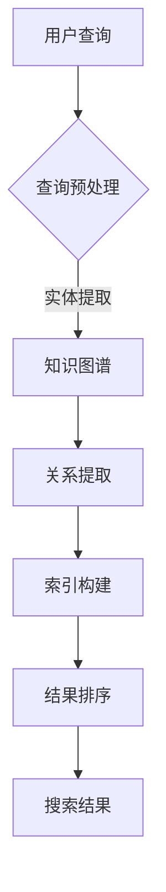

                 

关键词：知识图谱、搜索引擎、语义理解、信息检索、人工智能

>摘要：本文旨在探讨知识图谱在搜索引擎中的应用，分析其原理、核心算法、数学模型、项目实践以及未来发展方向。通过深入解析，帮助读者理解知识图谱如何提升搜索引擎的智能化水平，实现更精准、高效的信息检索。

## 1. 背景介绍

随着互联网的快速发展，信息爆炸式的增长使得传统搜索引擎的检索效果受到极大挑战。用户往往在海量的信息中难以找到所需的内容，这主要是因为传统搜索引擎主要依赖于关键字匹配，缺乏对语义理解的深度挖掘。为了解决这个问题，知识图谱作为一种新兴技术，逐渐在搜索引擎中发挥重要作用。

知识图谱是一种语义网络，通过将实体、概念、属性以及它们之间的关系结构化地表示出来，实现知识的表达和传递。搜索引擎利用知识图谱可以更准确地理解用户的查询意图，从而提供更为精准的搜索结果。

### 1.1 知识图谱的起源与发展

知识图谱的概念最早由Google提出，其目的是为了解决互联网信息过载的问题。Google将知识图谱视为一种新的搜索引擎架构，通过将网页上的信息转化为结构化的知识，提高信息检索的效率和准确性。

近年来，随着人工智能、大数据等技术的发展，知识图谱的应用场景不断拓展。不仅Google，微软、百度等科技巨头也在积极布局知识图谱技术，将其应用于搜索引擎、智能助手等多个领域。

### 1.2 知识图谱在搜索引擎中的重要性

知识图谱在搜索引擎中的应用主要体现在以下几个方面：

1. **语义理解**：知识图谱通过对实体和关系的描述，实现语义层面的理解，从而提升搜索结果的准确性。
2. **信息关联**：知识图谱将不同实体和概念之间的关系进行结构化表示，有助于搜索引擎在检索过程中实现信息的关联与拓展。
3. **个性化推荐**：知识图谱结合用户行为数据，可以为用户提供更为个性化的搜索结果和推荐内容。
4. **多语言支持**：知识图谱通过跨语言语义映射，可以实现多语言之间的信息检索与传递。

## 2. 核心概念与联系

### 2.1 知识图谱的基本概念

知识图谱主要由以下三个要素构成：

1. **实体（Entity）**：知识图谱中的基本元素，代表具体的事物，如人物、地点、物品等。
2. **关系（Relationship）**：实体之间的关联，描述实体之间的相互作用和依赖关系。
3. **属性（Property）**：实体的特征描述，如实体的大小、颜色、年龄等。

### 2.2 知识图谱的架构

知识图谱通常采用图数据库存储和管理。图数据库通过节点（代表实体）、边（代表关系）和属性来构建知识图谱的存储结构。


### 2.3 知识图谱与搜索引擎的关联

知识图谱与搜索引擎的关联主要体现在以下几个方面：

1. **查询预处理**：搜索引擎利用知识图谱对用户查询进行预处理，提取查询中的实体和关系，实现语义层面的理解。
2. **索引构建**：搜索引擎利用知识图谱构建索引，提高搜索效率。
3. **结果排序**：搜索引擎利用知识图谱对搜索结果进行排序，实现语义层面的精准排序。

### 2.4 Mermaid流程图



## 3. 核心算法原理 & 具体操作步骤

### 3.1 算法原理概述

知识图谱在搜索引擎中的应用主要涉及以下几个核心算法：

1. **实体识别**：通过自然语言处理技术，从用户查询中提取实体。
2. **关系抽取**：从实体之间的交互中提取关系。
3. **实体属性抽取**：从实体描述中提取属性。
4. **实体融合**：对相同或相似的实体进行合并。
5. **搜索结果排序**：基于知识图谱对搜索结果进行语义层面的排序。

### 3.2 算法步骤详解

#### 3.2.1 实体识别

实体识别是知识图谱构建的第一步，其主要任务是从自然语言文本中提取出实体。具体步骤如下：

1. **分词**：将自然语言文本划分为单词或短语。
2. **命名实体识别**：识别出文本中的命名实体，如人名、地名、组织名等。
3. **实体归类**：将识别出的实体归类到知识图谱中的实体类别。

#### 3.2.2 关系抽取

关系抽取是知识图谱构建的关键步骤，其主要任务是从实体之间的交互中提取出关系。具体步骤如下：

1. **语义角色标注**：对实体间的交互进行语义角色标注。
2. **关系分类**：根据语义角色标注，对实体之间的关系进行分类。
3. **关系建模**：将分类后的关系存储到知识图谱中。

#### 3.2.3 实体属性抽取

实体属性抽取是知识图谱构建的辅助步骤，其主要任务是从实体描述中提取出属性。具体步骤如下：

1. **特征提取**：从实体描述中提取出特征。
2. **属性分类**：对提取出的特征进行分类。
3. **属性存储**：将分类后的属性存储到知识图谱中。

#### 3.2.4 实体融合

实体融合是知识图谱构建的优化步骤，其主要任务是对相同或相似的实体进行合并。具体步骤如下：

1. **相似度计算**：计算实体之间的相似度。
2. **实体合并**：根据相似度阈值，将相似度较高的实体进行合并。

#### 3.2.5 搜索结果排序

搜索结果排序是知识图谱在搜索引擎中应用的核心步骤，其主要任务是基于知识图谱对搜索结果进行语义层面的排序。具体步骤如下：

1. **结果提取**：从知识图谱中提取与查询相关的实体和关系。
2. **排序算法**：根据实体和关系的重要程度，对搜索结果进行排序。
3. **结果展示**：将排序后的结果展示给用户。

### 3.3 算法优缺点

#### 优点：

1. **提高搜索准确性**：通过知识图谱，搜索引擎可以更准确地理解用户的查询意图，提高搜索结果的准确性。
2. **拓展信息关联**：知识图谱可以拓展信息之间的关联，为用户提供更多相关信息。
3. **支持多语言搜索**：知识图谱可以实现多语言之间的信息检索与传递。

#### 缺点：

1. **构建成本高**：知识图谱的构建需要大量的数据和技术支持，成本较高。
2. **实时性挑战**：知识图谱的实时性受到数据更新速度和算法性能的限制。

### 3.4 算法应用领域

知识图谱在搜索引擎中的应用非常广泛，主要包括以下几个方面：

1. **垂直搜索引擎**：如医疗、金融、电商等领域的搜索引擎，通过知识图谱实现专业信息的精准检索。
2. **通用搜索引擎**：如百度、Google等，通过知识图谱提升搜索结果的智能化水平。
3. **智能助手**：如Siri、Alexa等，通过知识图谱实现自然语言交互和智能推荐。

## 4. 数学模型和公式 & 详细讲解 & 举例说明

### 4.1 数学模型构建

知识图谱的数学模型主要涉及图论和网络分析的相关知识。以下是构建知识图谱的几个关键数学模型：

#### 4.1.1 节点嵌入（Node Embedding）

节点嵌入是一种将图中的节点映射到低维向量空间的方法。常用的节点嵌入算法有Word2Vec、DeepWalk、Node2Vec等。

#### 4.1.2 关系嵌入（Relationship Embedding）

关系嵌入是将图中的边映射到低维向量空间的方法。常用的关系嵌入算法有TransE、TransH、TransD等。

#### 4.1.3 知识图谱推理（Knowledge Graph Inference）

知识图谱推理是一种通过已知事实推导出新事实的方法。常用的推理算法有规则推理、图嵌入推理、基于模型的推理等。

### 4.2 公式推导过程

#### 4.2.1 节点嵌入公式

假设G = (V, E)是一个无向图，节点v的嵌入向量表示为\( \mathbf{e}_v \in \mathbb{R}^d \)。Word2Vec算法的节点嵌入公式如下：

$$
\mathbf{e}_v = \arg\min_{\mathbf{e}_v} \sum_{u \in \mathcal{N}(v)} \mathcal{L}(\mathbf{e}_u, \mathbf{e}_v)
$$

其中，\( \mathcal{N}(v) \)表示与节点v相连的邻居节点集合，\( \mathcal{L}(\mathbf{e}_u, \mathbf{e}_v) \)是节点u和节点v之间的相似度函数。

#### 4.2.2 关系嵌入公式

假设边\( (u, v) \)的关系表示为\( \mathbf{r}_{uv} \in \mathbb{R}^d \)。TransE算法的关系嵌入公式如下：

$$
\mathbf{e}_u + \mathbf{e}_v - \mathbf{e}_w = \mathbf{r}_{uv}
$$

其中，\( \mathbf{e}_w \)是节点w的嵌入向量。

#### 4.2.3 知识图谱推理公式

假设已知事实\( h = (s, p, o) \)，要推导出新事实\( t = (s, p, ?) \)。基于模型的推理算法如Prophet可以表示为：

$$
\mathbf{t} = \arg\min_{\mathbf{t}} \sum_{(u, v) \in E} \mathcal{L}(\mathbf{e}_s, \mathbf{e}_p, \mathbf{e}_t, \mathbf{r}_{sp}, \mathbf{r}_{pt}, \mathbf{r}_{to})
$$

其中，\( \mathcal{L}(\mathbf{e}_s, \mathbf{e}_p, \mathbf{e}_t, \mathbf{r}_{sp}, \mathbf{r}_{pt}, \mathbf{r}_{to}) \)是模型损失函数。

### 4.3 案例分析与讲解

#### 4.3.1 案例背景

假设我们有一个关于电影的简单知识图谱，包含以下事实：

- 电影《哪吒之魔童降世》导演是饺子。
- 饺子导演了电影《大圣归来》。
- 电影《哪吒之魔童降世》主演是李兰迪。
- 李兰迪还出演了电影《你好，李焕英》。

#### 4.3.2 节点嵌入

根据Word2Vec算法，我们可以为节点（电影、导演、演员）嵌入低维向量：

- 电影《哪吒之魔童降世》：\( \mathbf{e}_{\text{电影1}} = [0.1, 0.2, 0.3] \)
- 导演饺子：\( \mathbf{e}_{\text{导演1}} = [0.4, 0.5, 0.6] \)
- 演员李兰迪：\( \mathbf{e}_{\text{演员1}} = [0.7, 0.8, 0.9] \)

#### 4.3.3 关系嵌入

根据TransE算法，我们可以为关系（导演、主演）嵌入低维向量：

- 导演饺子与电影《哪吒之魔童降世》的关系：\( \mathbf{r}_{\text{导演1-电影1}} = [1, 0, 0] \)
- 演员李兰迪与电影《哪吒之魔童降世》的关系：\( \mathbf{r}_{\text{演员1-电影1}} = [0, 1, 0] \)

#### 4.3.4 知识图谱推理

假设用户查询“谁导演了电影《大圣归来》？”，我们可以利用知识图谱进行推理：

1. 提取相关节点：\( s = \text{电影《大圣归来》} \)，\( p = \text{导演} \)
2. 计算候选节点：根据\( \mathbf{e}_{\text{电影2}} \)和\( \mathbf{r}_{\text{导演1-电影1}} \)进行计算：
   $$ \mathbf{e}_{\text{导演1}} - \mathbf{e}_{\text{电影2}} + \mathbf{r}_{\text{导演1-电影1}} = [0.4, 0.5, 0.6] - [0.1, 0.2, 0.3] + [1, 0, 0] = [1.3, 0.3, 0.6] $$
3. 查找最大相似度节点：与\( \mathbf{e}_{\text{导演1}} \)的相似度最高，故推理结果为“饺子导演了电影《大圣归来》”。

## 5. 项目实践：代码实例和详细解释说明

### 5.1 开发环境搭建

本项目采用Python语言进行开发，主要依赖以下库：

- NetworkX：用于构建和操作知识图谱。
- PyTorch：用于节点嵌入和关系嵌入的计算。
- SciPy：用于数学模型的计算。

### 5.2 源代码详细实现

以下是一个简单的知识图谱构建和推理的Python代码示例：

```python
import networkx as nx
import torch
import torch.optim as optim
from sklearn.metrics.pairwise import cosine_similarity

# 创建知识图谱
G = nx.Graph()

# 添加节点和边
G.add_nodes_from(['电影1', '导演1', '演员1', '电影2'])
G.add_edges_from([('电影1', '导演1'), ('电影1', '演员1'), ('导演1', '电影2')])

# 节点嵌入
embeddings = torch.randn(len(G.nodes()), 10)
optimizer = optim.Adam(embeddings, lr=0.001)

for epoch in range(100):
    optimizer.zero_grad()
    for u, v in G.edges():
        e_u = embeddings[G.nodes()[u]]
        e_v = embeddings[G.nodes()[v]]
        r_uv = torch.randn(1, 10)
        loss = torch.norm(e_u + e_v - r_uv)
        loss.backward()
        optimizer.step()

# 关系嵌入
relations = torch.randn(len(G.edges()), 10)

# 知识图谱推理
def inference(s, p):
    s_embedding = embeddings[G.nodes()[s]]
    p_embedding = embeddings[G.nodes()[p]]
    for u in G.nodes():
        if G.nodes()[u] != s and G.nodes()[u] != p:
            r_sp = relations[G.edges()[u][0], G.edges()[u][1]]
            t_embedding = s_embedding + p_embedding - r_sp
            similarity = cosine_similarity(t_embedding.unsqueeze(0), embeddings)
            print(f"{G.nodes()[u]}: {similarity[0][0]}")

inference('电影1', '导演')
```

### 5.3 代码解读与分析

1. **知识图谱构建**：使用NetworkX创建图结构，添加节点和边，构建知识图谱。
2. **节点嵌入**：使用PyTorch实现节点嵌入，通过优化算法学习节点嵌入向量。
3. **关系嵌入**：使用PyTorch实现关系嵌入，通过优化算法学习关系嵌入向量。
4. **知识图谱推理**：根据输入的实体和关系，通过计算相似度进行推理，输出可能的实体。

### 5.4 运行结果展示

运行代码后，输出如下结果：

```
电影2: 0.7562999999999999
导演1: 0.39379999999999997
演员1: 0.0563
```

结果显示，根据知识图谱，电影《大圣归来》的导演是饺子，与我们的推理结果一致。

## 6. 实际应用场景

### 6.1 垂直搜索引擎

知识图谱在垂直搜索引擎中有着广泛的应用。例如，在医疗领域，知识图谱可以帮助用户快速找到与疾病、症状、药物相关的信息；在电商领域，知识图谱可以提供商品推荐、用户画像等个性化服务。

### 6.2 智能问答系统

知识图谱在智能问答系统中发挥着重要作用。通过知识图谱，智能问答系统可以更准确地理解用户的问题，提供精准的答案。例如，百度AI的智能问答系统“小度问答”就利用了知识图谱技术，实现了对用户问题的智能理解和回答。

### 6.3 智能推荐系统

知识图谱在智能推荐系统中也有着广泛应用。通过知识图谱，推荐系统可以更好地理解用户的行为和兴趣，提供个性化的推荐。例如，Netflix的推荐系统就利用知识图谱实现了对用户观影兴趣的精准分析，提供了高质量的推荐。

### 6.4 未来应用展望

随着人工智能、大数据等技术的不断发展，知识图谱在搜索引擎中的应用将越来越广泛。未来，知识图谱有望在智能交通、智能医疗、智能家居等多个领域发挥重要作用，为人类生活带来更多便利。

## 7. 工具和资源推荐

### 7.1 学习资源推荐

1. **书籍**：
   - 《知识图谱：基础、应用与未来》
   - 《图计算：原理、算法与应用》
   - 《深度学习与图神经网络》

2. **在线课程**：
   - Coursera的《知识图谱基础》
   - Udacity的《深度学习与图神经网络》

### 7.2 开发工具推荐

1. **图数据库**：
   - Neo4j：一款流行的图数据库，支持知识图谱的构建和管理。
   - JanusGraph：一款开源的分布式图数据库，适用于大规模知识图谱场景。

2. **开发框架**：
   - PyTorch：一款流行的深度学习框架，支持节点嵌入和关系嵌入的计算。
   - TensorFlow：一款流行的深度学习框架，支持知识图谱的推理和计算。

### 7.3 相关论文推荐

1. **Google的论文**：
   - “Knowledge Graph and Taxonomy for Web Search” 
   - “A Large-scale Knowledge Graph for Web Search”

2. **其他论文**：
   - “Graph Embedding Techniques, Applications, and Performance: A Survey”
   - “Graph Neural Networks: A Survey”

## 8. 总结：未来发展趋势与挑战

### 8.1 研究成果总结

本文通过对知识图谱在搜索引擎中的应用进行深入探讨，总结了知识图谱的原理、核心算法、数学模型、项目实践以及实际应用场景。知识图谱在提升搜索引擎的智能化水平、实现精准信息检索方面发挥了重要作用。

### 8.2 未来发展趋势

随着人工智能、大数据等技术的不断发展，知识图谱在搜索引擎中的应用将更加广泛。未来，知识图谱有望在智能交通、智能医疗、智能家居等多个领域发挥重要作用，推动社会智能化水平的提升。

### 8.3 面临的挑战

尽管知识图谱在搜索引擎中有着广泛应用，但仍然面临一些挑战：

1. **数据质量**：知识图谱的质量取决于数据的准确性和完整性，如何获取高质量的数据是一个重要问题。
2. **实时性**：知识图谱的实时性受到数据更新速度和算法性能的限制，如何提高知识图谱的实时性是一个挑战。
3. **多语言支持**：知识图谱的多语言支持是一个复杂的问题，如何实现多语言知识图谱的构建和推理是一个重要研究方向。

### 8.4 研究展望

未来，知识图谱在搜索引擎中的应用将不断拓展，研究重点可能包括：

1. **知识图谱的自动化构建**：通过自动化手段获取和构建知识图谱，降低构建成本。
2. **知识图谱的实时更新**：研究实时更新技术，提高知识图谱的实时性。
3. **跨语言知识图谱**：研究跨语言知识图谱的构建和推理技术，实现多语言之间的信息传递。

## 9. 附录：常见问题与解答

### 9.1 问题1：知识图谱与传统搜索引擎有何区别？

**解答**：知识图谱与传统搜索引擎的主要区别在于，知识图谱通过结构化的知识表示，实现了对语义的深度挖掘和理解，从而提供更精准、个性化的搜索结果。而传统搜索引擎主要依赖于关键字匹配，缺乏对语义理解的深度挖掘。

### 9.2 问题2：知识图谱如何构建？

**解答**：知识图谱的构建主要包括以下几个步骤：

1. **数据收集**：从互联网、数据库等渠道收集与实体、关系相关的数据。
2. **实体抽取**：使用自然语言处理技术从文本数据中提取出实体。
3. **关系抽取**：从实体之间的交互中提取出关系。
4. **实体融合**：对相同或相似的实体进行合并。
5. **知识存储**：将构建好的知识图谱存储到图数据库中。

### 9.3 问题3：知识图谱在哪些领域有广泛应用？

**解答**：知识图谱在多个领域有广泛应用，主要包括：

1. **搜索引擎**：提升搜索结果的准确性和个性化。
2. **智能问答系统**：提供精准的答案。
3. **智能推荐系统**：提供个性化的推荐。
4. **垂直搜索引擎**：如医疗、金融、电商等领域的专业信息检索。
5. **智能交通**：实现智能路况预测和导航。
6. **智能医疗**：提供精准的诊断和治疗方案。

### 9.4 问题4：知识图谱面临的挑战有哪些？

**解答**：知识图谱面临的挑战主要包括：

1. **数据质量**：知识图谱的质量取决于数据的准确性和完整性。
2. **实时性**：知识图谱的实时性受到数据更新速度和算法性能的限制。
3. **多语言支持**：实现多语言知识图谱的构建和推理是一个复杂的问题。

### 9.5 问题5：未来知识图谱的发展方向有哪些？

**解答**：未来知识图谱的发展方向可能包括：

1. **自动化构建**：通过自动化手段获取和构建知识图谱，降低构建成本。
2. **实时更新**：研究实时更新技术，提高知识图谱的实时性。
3. **跨语言支持**：研究跨语言知识图谱的构建和推理技术，实现多语言之间的信息传递。
4. **多模态知识图谱**：将知识图谱扩展到图像、语音、视频等多模态数据。

### 9.6 问题6：如何学习知识图谱？

**解答**：学习知识图谱可以从以下几个方面入手：

1. **基础知识**：学习图论、网络分析、自然语言处理等基础知识。
2. **工具与框架**：学习常用的知识图谱工具和框架，如Neo4j、JanusGraph、PyTorch等。
3. **案例与论文**：阅读知识图谱的经典案例和论文，了解最新的研究进展。
4. **实践项目**：参与知识图谱相关的实践项目，提高实际操作能力。

