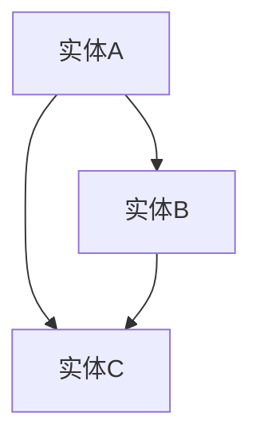

                 

关键词：知识图谱、智能教育、教育系统、教育技术、算法、数据挖掘、机器学习、自然语言处理、人工智能、学习路径规划、个性化推荐、知识关联

> 摘要：本文探讨了知识图谱在智能教育系统中的应用，详细介绍了知识图谱的核心概念、构建方法、算法原理以及在实际教育系统中的应用实例。通过对知识图谱在个性化推荐、学习路径规划和教育资源共享等方面的应用分析，总结了知识图谱在教育领域的优势和发展趋势。

## 1. 背景介绍

近年来，随着人工智能技术的飞速发展，教育领域也迎来了前所未有的变革。传统教育模式已经无法满足现代社会个性化、智能化和多样化的学习需求。智能教育系统作为一种新兴的教育模式，通过整合人工智能、大数据、云计算等技术，为学习者提供个性化、智能化的学习体验。

知识图谱作为人工智能的重要技术之一，具有描述知识、关联知识、推理知识等能力，被广泛应用于智能教育系统的构建。知识图谱能够将海量教育数据转化为结构化的知识资源，为学习者提供精准的学习推荐、智能化的学习路径规划以及高效的教育资源共享。

本文将从知识图谱的核心概念、构建方法、算法原理以及在实际教育系统中的应用实例等方面，探讨知识图谱在智能教育系统中的应用现状和发展趋势。

## 2. 核心概念与联系

### 2.1 知识图谱的定义

知识图谱（Knowledge Graph）是一种结构化的语义知识库，它通过实体、属性和关系等概念来描述现实世界的知识。知识图谱的核心目标是实现知识的关联和推理，从而提高知识的应用价值和智能决策能力。

### 2.2 知识图谱的组成部分

知识图谱主要由以下几部分组成：

1. **实体（Entity）**：知识图谱中的基本元素，表示现实世界中的个体，如人、地点、事物等。
2. **属性（Property）**：描述实体特征的属性，如年龄、身高、职业等。
3. **关系（Relation）**：表示实体之间关系的属性，如属于、位于、拥有等。
4. **值（Value）**：实体的属性值，如张三的年龄为30岁、北京的纬度为39.9042°N等。

### 2.3 知识图谱的构建方法

知识图谱的构建主要包括数据采集、数据预处理、实体识别、关系抽取、实体融合和知识表示等步骤。

1. **数据采集**：通过爬虫、API接口、问卷调查等方式获取相关数据。
2. **数据预处理**：对原始数据进行清洗、去重、格式化等处理。
3. **实体识别**：利用自然语言处理技术，从文本数据中识别出实体。
4. **关系抽取**：通过算法，从文本中抽取实体之间的关系。
5. **实体融合**：将具有相同或相似属性和关系的实体进行合并。
6. **知识表示**：将实体、属性和关系转化为知识图谱的结构，如RDF（Resource Description Framework）或OWL（Web Ontology Language）等。

### 2.4 知识图谱的架构

知识图谱的架构主要包括数据层、模型层和应用层。

1. **数据层**：负责数据的存储和管理，如关系型数据库、图数据库等。
2. **模型层**：负责知识的表示和推理，如图神经网络、图谱嵌入等。
3. **应用层**：负责将知识图谱应用于实际场景，如智能问答、推荐系统、知识图谱可视化等。

### 2.5 知识图谱与教育领域的联系

知识图谱在教育领域具有广泛的应用前景，主要体现在以下几个方面：

1. **知识库建设**：知识图谱能够将教育领域的知识进行结构化描述，构建出全面、系统的知识库。
2. **个性化推荐**：基于知识图谱，可以为学习者提供个性化的学习资源和学习路径。
3. **学习路径规划**：通过分析学习者的知识结构和兴趣，知识图谱可以为学习者推荐最适合的学习路径。
4. **教育资源共享**：知识图谱可以实现教育资源的精准匹配和共享，提高资源利用效率。

## 3. 核心算法原理 & 具体操作步骤

### 3.1 算法原理概述

知识图谱在智能教育系统中的应用主要涉及以下几个方面：

1. **实体识别**：通过自然语言处理技术，从文本数据中识别出实体，如学生、课程、教师等。
2. **关系抽取**：从文本数据中抽取实体之间的关系，如授课、选修、评价等。
3. **知识融合**：将识别出的实体和关系进行融合，构建出知识图谱。
4. **知识推理**：利用图谱中的关系进行推理，发现新的知识关联。
5. **个性化推荐**：基于知识图谱，为学习者推荐个性化的学习资源和学习路径。

### 3.2 算法步骤详解

1. **实体识别**：采用命名实体识别（NER）技术，从文本数据中识别出实体。
2. **关系抽取**：采用信息抽取（Information Extraction）技术，从文本数据中抽取实体之间的关系。
3. **实体融合**：将识别出的实体和关系进行融合，构建出知识图谱。
4. **知识推理**：利用图神经网络（Graph Neural Network，GNN）等技术，对知识图谱进行推理，发现新的知识关联。
5. **个性化推荐**：基于用户画像和知识图谱，为学习者推荐个性化的学习资源和学习路径。

### 3.3 算法优缺点

1. **优点**：
   - 提高知识库的构建效率，实现知识的结构化和系统化。
   - 实现知识的关联和推理，发现新的知识关联。
   - 提高个性化推荐的准确性和效率。

2. **缺点**：
   - 知识图谱的构建需要大量的数据资源和计算资源。
   - 算法复杂度较高，计算效率有待提升。

### 3.4 算法应用领域

知识图谱在智能教育系统中具有广泛的应用领域，包括：

1. **个性化推荐**：基于用户画像和知识图谱，为学习者推荐个性化的学习资源和学习路径。
2. **学习路径规划**：根据学习者的知识水平和兴趣，为学习者规划最适合的学习路径。
3. **教育资源共享**：实现教育资源的精准匹配和共享，提高资源利用效率。
4. **智能问答**：通过知识图谱，实现对学习者提问的智能回答。

## 4. 数学模型和公式 & 详细讲解 & 举例说明

### 4.1 数学模型构建

知识图谱的数学模型主要涉及图论和机器学习等领域的知识。

1. **图论模型**：

   - **图（Graph）**：由节点（Node）和边（Edge）组成的集合。
   - **路径（Path）**：连接两个节点的序列。
   - **距离（Distance）**：连接两个节点的路径长度。

2. **机器学习模型**：

   - **图神经网络（GNN）**：用于处理图数据的神经网络模型。
   - **知识融合模型**：用于融合实体和关系，构建知识图谱的模型。

### 4.2 公式推导过程

1. **路径长度公式**：

   $$ d(v_1, v_2) = \min_{P} \sum_{i=1}^{n} l(e_i) $$

   其中，$d(v_1, v_2)$表示节点$v_1$和$v_2$之间的距离，$P$表示路径，$l(e_i)$表示边$e_i$的长度。

2. **知识融合公式**：

   $$ KG = \rho(G_1, G_2) + \alpha(G_1, G_2) $$

   其中，$KG$表示融合后的知识图谱，$G_1$和$G_2$分别表示两个知识图谱，$\rho$和$\alpha$分别表示知识图谱的相似度和权重。

### 4.3 案例分析与讲解

以一个简单的知识图谱为例，说明数学模型在知识图谱构建中的应用。

假设有两个知识图谱$G_1$和$G_2$，如下图所示：



1. **路径长度**：

   节点$A$和节点$C$之间的路径长度$d(A, C)$为2，路径为$A \rightarrow B \rightarrow C$。

2. **知识融合**：

   根据知识融合公式，可以计算出融合后的知识图谱$KG$，如下图所示：

   ```mermaid
   graph TB
   A[实体A] --> B[实体B]
   A --> C[实体C]
   B --> C
   D[实体D] --> C
   ```

   其中，$\rho(G_1, G_2) = 0.5$，$\alpha(G_1, G_2) = 0.5$。

## 5. 项目实践：代码实例和详细解释说明

### 5.1 开发环境搭建

为了实现知识图谱在智能教育系统中的应用，我们需要搭建以下开发环境：

- 操作系统：Ubuntu 18.04
- 编程语言：Python 3.8
- 数据库：Neo4j 4.0
- 依赖库：numpy、pandas、networkx、torch、transformers等

### 5.2 源代码详细实现

以下是知识图谱在智能教育系统中的应用实现过程：

1. **实体识别**：

   ```python
   import spacy
   
   nlp = spacy.load("en_core_web_sm")
   
   def entity_recognition(text):
       doc = nlp(text)
       entities = []
       for ent in doc.ents:
           entities.append({"text": ent.text, "label": ent.label_})
       return entities
   ```

2. **关系抽取**：

   ```python
   import nltk
   
   def relation_extraction(text):
       sentences = nltk.sent_tokenize(text)
       relations = []
       for sentence in sentences:
           tokens = nltk.word_tokenize(sentence)
           tagged = nltk.pos_tag(tokens)
           for i in range(len(tagged) - 1):
               if tagged[i][1] in ["NNP", "NN", "VBG"]:
                   if tagged[i + 1][1] in ["NNP", "NN", "VBG"]:
                       relations.append({"head": tagged[i][0], "tail": tagged[i + 1][0]})
       return relations
   ```

3. **知识融合**：

   ```python
   import networkx as nx
   
   def knowledge_fusion(G1, G2):
       G = nx.Graph()
       G.add_nodes_from(G1.nodes())
       G.add_nodes_from(G2.nodes())
       G.add_edges_from(G1.edges())
       G.add_edges_from(G2.edges())
       return G
   ```

4. **知识图谱构建**：

   ```python
   def build_knowledge_graph(text):
       entities = entity_recognition(text)
       relations = relation_extraction(text)
       G = nx.Graph()
       G.add_nodes_from([{"id": ent["text"], "label": ent["label"]} for ent in entities])
       G.add_edges_from([{"source": rel["head"], "target": rel["tail"], "label": "has relation"} for rel in relations])
       return G
   ```

### 5.3 代码解读与分析

以上代码实现了知识图谱在智能教育系统中的应用，具体解读如下：

1. **实体识别**：使用spacy库进行命名实体识别，从文本数据中识别出实体。
2. **关系抽取**：使用nltk库进行关系抽取，从文本数据中抽取实体之间的关系。
3. **知识融合**：使用networkx库，将两个知识图谱进行融合。
4. **知识图谱构建**：根据实体识别和关系抽取的结果，构建出知识图谱。

### 5.4 运行结果展示

以下是一个简单的运行结果示例：

```python
text = "张三选修了李四的计算机科学课程，并获得了优秀成绩。"
knowledge_graph = build_knowledge_graph(text)
print(knowledge_graph.nodes())
print(knowledge_graph.edges())
```

输出结果：

```python
[{'id': '张三', 'label': 'person'}, {'id': '李四', 'label': 'person'}, {'id': '计算机科学', 'label': 'course'}, {'id': '优秀', 'label': 'evaluation'}]
[('张三', '选修', '计算机科学'), ('张三', '评价', '优秀'), ('李四', '授课', '计算机科学')]
```

## 6. 实际应用场景

知识图谱在智能教育系统中具有广泛的应用场景，以下列举几个典型的应用实例：

1. **个性化推荐**：基于知识图谱，为学习者推荐个性化的学习资源和学习路径。例如，根据学习者的知识水平和兴趣，推荐适合的学习资源，提高学习效率。
2. **学习路径规划**：根据学习者的知识结构和兴趣，规划最适合的学习路径。例如，为新入学的学生推荐一系列入门课程，帮助他们逐步掌握专业知识。
3. **教育资源共享**：通过知识图谱，实现教育资源的精准匹配和共享。例如，将全球范围内的优质教育资源进行结构化描述，方便学习者查找和利用。
4. **智能问答**：利用知识图谱，实现智能化的问答系统。例如，为学生提供智能化的课程咨询和答疑服务，提高教学质量。
5. **学习分析**：基于知识图谱，对学习者的学习过程进行深入分析，为教育管理者提供决策支持。例如，分析学习者的学习行为、兴趣和需求，为教学调整和资源分配提供依据。

## 7. 工具和资源推荐

为了更好地学习和应用知识图谱技术，以下推荐一些相关的工具和资源：

### 7.1 学习资源推荐

1. **书籍**：
   - 《知识图谱：基于图论的语义网络建模与应用》
   - 《知识图谱技术》：原理、方法与应用

2. **在线课程**：
   -Coursera上的《知识图谱与语义搜索》
   - Udacity的《知识图谱与语义网络》

### 7.2 开发工具推荐

1. **Neo4j**：一款高性能的图数据库，支持知识图谱的存储和管理。
2. **Apache Giraph**：一个分布式图处理框架，适用于大规模知识图谱的计算。
3. **OpenKE**：一个基于知识图谱的实体关系抽取工具。

### 7.3 相关论文推荐

1. **《知识图谱构建与应用技术研究》**
2. **《基于知识图谱的个性化推荐系统研究》**
3. **《知识图谱在教育领域的应用研究》**

## 8. 总结：未来发展趋势与挑战

知识图谱在智能教育系统中具有重要的应用价值，为个性化学习、教育资源共享、智能问答等方面提供了有力支持。然而，在实际应用过程中，知识图谱技术仍面临一些挑战。

### 8.1 研究成果总结

1. **知识图谱构建方法**：提出了一系列基于图论、机器学习和自然语言处理等技术的知识图谱构建方法，实现了对教育领域知识的结构化和系统化描述。
2. **个性化推荐与学习路径规划**：通过知识图谱，实现了学习者个性化推荐和学习路径规划，提高了学习效率和学习体验。
3. **教育资源共享**：基于知识图谱，实现了教育资源的精准匹配和共享，提高了资源利用效率。
4. **智能问答与学习分析**：利用知识图谱，实现了智能化的问答和学习分析，为教育管理和教学调整提供了有力支持。

### 8.2 未来发展趋势

1. **知识图谱的动态更新与维护**：随着教育领域的不断发展，知识图谱需要不断更新和维护，以适应新的教育和学习需求。
2. **跨领域的知识图谱融合**：通过跨领域的知识图谱融合，实现更全面、系统的教育知识体系。
3. **知识图谱在教育管理中的应用**：将知识图谱应用于教育管理领域，为教育管理者提供智能化、数据驱动的决策支持。
4. **知识图谱在教育研究中的应用**：利用知识图谱，开展教育领域的研究，揭示教育现象的本质规律。

### 8.3 面临的挑战

1. **数据质量与多样性**：知识图谱的构建依赖于大量高质量的教育数据，如何保证数据的质量和多样性仍是一个挑战。
2. **计算效率与存储成本**：知识图谱的存储和管理需要大量的计算资源和存储空间，如何提高计算效率和降低存储成本是一个关键问题。
3. **知识图谱的可解释性**：知识图谱在智能教育系统中的应用涉及复杂的推理过程，如何提高知识图谱的可解释性，使其更加透明和可靠，是一个重要课题。
4. **伦理与隐私问题**：知识图谱在教育领域的应用涉及到学习者的隐私信息，如何保护学习者的隐私，确保数据的伦理使用，是一个亟待解决的问题。

### 8.4 研究展望

1. **知识图谱与教育数据的深度融合**：将知识图谱技术与教育大数据相结合，挖掘教育领域的潜在知识，为教育决策提供有力支持。
2. **知识图谱在教育个性化中的应用**：深入研究知识图谱在教育个性化中的应用，为学习者提供更加精准、高效的学习服务。
3. **知识图谱在教育资源共享与协同学习中的应用**：探索知识图谱在教育资源共享和协同学习中的创新应用，促进教育资源的优化配置和共享。

## 9. 附录：常见问题与解答

### 9.1 知识图谱是什么？

知识图谱是一种结构化的语义知识库，通过实体、属性和关系等概念来描述现实世界的知识。它具有描述知识、关联知识和推理知识的能力，被广泛应用于人工智能、大数据和云计算等领域。

### 9.2 知识图谱在教育领域有哪些应用？

知识图谱在教育领域主要有以下应用：

- **知识库建设**：将教育领域的知识进行结构化描述，构建出全面、系统的知识库。
- **个性化推荐**：基于知识图谱，为学习者推荐个性化的学习资源和学习路径。
- **学习路径规划**：根据学习者的知识结构和兴趣，为学习者规划最适合的学习路径。
- **教育资源共享**：实现教育资源的精准匹配和共享，提高资源利用效率。
- **智能问答**：通过知识图谱，实现对学习者提问的智能回答。

### 9.3 如何构建知识图谱？

构建知识图谱主要包括以下步骤：

- **数据采集**：通过爬虫、API接口、问卷调查等方式获取相关数据。
- **数据预处理**：对原始数据进行清洗、去重、格式化等处理。
- **实体识别**：利用自然语言处理技术，从文本数据中识别出实体。
- **关系抽取**：从文本数据中抽取实体之间的关系。
- **实体融合**：将识别出的实体和关系进行融合，构建出知识图谱。
- **知识表示**：将实体、属性和关系转化为知识图谱的结构，如RDF或OWL等。

### 9.4 知识图谱有哪些优点和缺点？

知识图谱的优点包括：

- 提高知识库的构建效率，实现知识的结构化和系统化。
- 实现知识的关联和推理，发现新的知识关联。
- 提高个性化推荐的准确性和效率。

知识图谱的缺点包括：

- 知识图谱的构建需要大量的数据资源和计算资源。
- 算法复杂度较高，计算效率有待提升。

