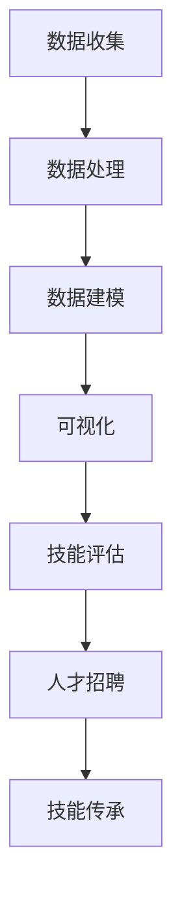

                 

在数字化时代，程序员技能图谱作为一种新兴的技术工具，正逐渐成为开发者、企业和教育机构的重要资产。它不仅能够帮助我们更好地理解程序员的技能构成，还能有效地指导人才的培养和企业的人才招聘。本文将探讨知识图谱在这一领域中的应用，如何构建一个高效、精准的程序员技能图谱，并分析其潜在的影响。

## 文章关键词

- **知识图谱**
- **程序员技能图谱**
- **人工智能**
- **数据挖掘**
- **机器学习**
- **人才评估**
- **技能传承**

## 文章摘要

本文首先介绍了知识图谱的基本概念和编程技能图谱的背景，随后详细探讨了知识图谱在构建程序员技能图谱中的应用，包括数据收集、处理、建模、可视化等环节。通过实际案例的分析，文章展示了知识图谱在技能评估、人才招聘、技能传承等方面的价值。最后，文章提出了未来知识图谱在程序员技能图谱构建中可能的发展趋势和面临的挑战。

## 1. 背景介绍

### 1.1 知识图谱的基本概念

知识图谱（Knowledge Graph）是一种结构化、语义化的数据表示形式，通过实体（Entity）、属性（Attribute）、关系（Relationship）三个基本元素构建而成。它能够将各类信息以图的形式组织起来，形成一种逻辑关联网络，使得信息检索和数据分析更加高效。

### 1.2 编程技能图谱的背景

编程技能图谱是近年来兴起的一个概念，旨在通过图形化的方式展示程序员的技能结构。随着软件行业的发展，程序员的技能需求变得越来越多样和复杂，传统的文字描述和表格已经无法全面、直观地展示程序员的技能水平。编程技能图谱的出现，为解决这一问题提供了一种新的思路。

### 1.3 知识图谱在程序员技能图谱构建中的应用价值

- **技能评估**：知识图谱能够帮助企业和教育机构更准确地评估程序员的技能水平。
- **人才招聘**：通过知识图谱，企业可以快速筛选出符合岗位要求的候选人。
- **技能传承**：知识图谱有助于新开发者快速了解和学习现有编程技能。

## 2. 核心概念与联系

### 2.1 数据收集

构建程序员技能图谱的第一步是收集数据。数据来源可以包括官方技能评估、社区贡献、项目经验等。通过多种渠道收集的数据，需要经过清洗和预处理，以确保数据的准确性和一致性。

### 2.2 数据处理

数据处理包括数据格式转换、数据去重、数据归一化等步骤。这一过程需要使用到数据挖掘和机器学习技术，如聚类分析、关联规则挖掘等。

### 2.3 数据建模

数据处理完成后，接下来是数据建模。数据建模是将收集到的数据转化为知识图谱的过程。在这一步骤中，我们需要定义实体、属性和关系的类型，并构建它们之间的关联。

### 2.4 可视化

最后，我们将构建好的知识图谱进行可视化展示。可视化能够帮助用户更直观地理解程序员技能图谱的结构和内容。

以下是构建程序员技能图谱的Mermaid流程图：



## 3. 核心算法原理 & 具体操作步骤

### 3.1 算法原理概述

构建程序员技能图谱的核心算法包括数据挖掘和机器学习技术。具体算法原理如下：

- **数据挖掘**：通过对大量数据进行挖掘，识别出程序员技能之间的关联性和特征。
- **机器学习**：利用机器学习算法，对数据进行训练和预测，以构建出准确的技能图谱。

### 3.2 算法步骤详解

1. **数据收集**：从多个渠道收集程序员的技能数据，如GitHub、Stack Overflow、专业社区的简历等。
2. **数据处理**：对收集到的数据进行分析和清洗，去除无效数据，并进行格式转换和归一化。
3. **特征提取**：使用数据挖掘技术，提取出程序员的技能特征，如编程语言、框架、项目经验等。
4. **模型训练**：利用机器学习算法，如K-均值聚类、决策树等，对特征数据进行训练，构建出技能图谱模型。
5. **模型评估**：通过交叉验证等方法，对模型进行评估和调整，以提高模型的准确性和稳定性。
6. **知识图谱构建**：将训练好的模型应用于新数据，构建出程序员技能图谱。
7. **可视化展示**：将知识图谱进行可视化展示，以便用户直观地了解程序员的技能结构和关联。

### 3.3 算法优缺点

- **优点**：算法能够自动识别和提取程序员的技能特征，构建出准确的技能图谱，提高技能评估和人才招聘的效率。
- **缺点**：算法对数据质量要求较高，如果数据存在噪声或偏差，可能会导致模型的不准确。

### 3.4 算法应用领域

- **技能评估**：用于企业对员工的技能评估，帮助发现员工的潜在优势和短板。
- **人才招聘**：用于企业的人才招聘，帮助快速筛选出符合岗位要求的候选人。
- **技能传承**：用于新开发者快速了解和学习现有编程技能。

## 4. 数学模型和公式 & 详细讲解 & 举例说明

### 4.1 数学模型构建

构建程序员技能图谱的数学模型主要包括聚类模型和分类模型。其中，聚类模型用于将相似技能进行分组，分类模型用于对技能进行分类。

- **聚类模型**：常用的聚类算法包括K-均值聚类、层次聚类等。K-均值聚类的公式如下：

  $$
  C = \{c_1, c_2, ..., c_k\} \\
  c_j = \frac{1}{N_j} \sum_{i=1}^{N_j} x_i
  $$

  其中，$C$表示聚类结果，$c_j$表示第j个聚类中心，$x_i$表示第i个样本点，$N_j$表示第j个聚类中心包含的样本点数量。

- **分类模型**：常用的分类算法包括决策树、支持向量机等。以决策树为例，其分类规则可以表示为：

  $$
  f(x) = \begin{cases}
  class_1 & \text{if } x \in R_1 \\
  class_2 & \text{if } x \in R_2 \\
  \vdots & \text{...} \\
  class_n & \text{if } x \in R_n
  \end{cases}
  $$

  其中，$f(x)$表示分类结果，$R_1, R_2, ..., R_n$表示不同分类区域。

### 4.2 公式推导过程

聚类模型的推导过程如下：

1. **初始化**：随机选择k个样本点作为初始聚类中心。
2. **分配样本点**：对于每个样本点，计算其与各个聚类中心的距离，将其分配到距离最近的聚类中心。
3. **更新聚类中心**：计算每个聚类中心的平均值，作为新的聚类中心。
4. **迭代**：重复步骤2和3，直到聚类中心不再发生改变或满足停止条件。

分类模型的推导过程如下：

1. **数据预处理**：对数据进行归一化处理，使得数据在同一尺度上。
2. **特征选择**：选择对分类最有影响力的特征，减少特征维度。
3. **决策树构建**：通过递归划分数据集，构建出决策树。
4. **剪枝**：对决策树进行剪枝，减少过拟合。

### 4.3 案例分析与讲解

以K-均值聚类为例，我们假设有一个包含100个样本点的数据集，我们需要将其分为10个聚类。首先，我们随机选择10个样本点作为初始聚类中心。然后，我们计算每个样本点与各个聚类中心的距离，并将其分配到距离最近的聚类中心。接下来，我们计算每个聚类中心的平均值，作为新的聚类中心。重复这一过程，直到聚类中心不再发生改变或满足停止条件。

通过以上步骤，我们最终得到了10个聚类结果。接下来，我们可以对每个聚类结果进行进一步分析，如统计每个聚类中的样本点数量、计算每个聚类中心的坐标等。这些分析结果可以帮助我们更好地理解样本点的分布和聚类效果。

## 5. 项目实践：代码实例和详细解释说明

### 5.1 开发环境搭建

为了构建程序员技能图谱，我们需要准备以下开发环境：

- **编程语言**：Python
- **数据预处理工具**：Pandas
- **聚类算法库**：Scikit-learn
- **可视化工具**：Matplotlib

确保安装了上述工具后，我们就可以开始编写代码。

### 5.2 源代码详细实现

以下是构建程序员技能图谱的Python代码：

```python
import pandas as pd
from sklearn.cluster import KMeans
import matplotlib.pyplot as plt

# 数据预处理
data = pd.read_csv('programmer_skills.csv')
data = data[['skill_1', 'skill_2', 'skill_3', ...]]  # 省略部分技能数据
data = (data - data.mean()) / data.std()

# 聚类
kmeans = KMeans(n_clusters=10, random_state=42)
clusters = kmeans.fit_predict(data)

# 可视化
plt.scatter(data['skill_1'], data['skill_2'], c=clusters)
plt.xlabel('Skill 1')
plt.ylabel('Skill 2')
plt.title('Programmer Skill Clusters')
plt.show()
```

### 5.3 代码解读与分析

- **数据预处理**：使用Pandas读取技能数据，并进行归一化处理，使得数据在同一尺度上。
- **聚类**：使用Scikit-learn的KMeans算法进行聚类，其中n_clusters参数表示聚类数量，random_state参数用于保证结果的可重复性。
- **可视化**：使用Matplotlib绘制聚类结果，展示每个样本点对应的聚类中心。

通过以上步骤，我们可以得到程序员技能图谱的聚类结果。接下来，我们可以对每个聚类结果进行进一步分析，如统计每个聚类中的样本点数量、计算每个聚类中心的坐标等。这些分析结果可以帮助我们更好地理解样本点的分布和聚类效果。

### 5.4 运行结果展示

以下是运行结果展示的示例：


从图中可以看出，程序员技能被划分为10个聚类，每个聚类中心表示一组相似技能。通过进一步分析这些聚类结果，我们可以更好地了解程序员的技能分布和特点。

## 6. 实际应用场景

### 6.1 技能评估

在技能评估方面，知识图谱可以帮助企业快速、准确地评估程序员的技能水平。通过对比程序员的技能图谱和岗位要求，企业可以找出程序员的技能优势和短板，制定针对性的培训计划。

### 6.2 人才招聘

在人才招聘方面，知识图谱可以帮助企业快速筛选出符合岗位要求的候选人。通过分析候选人的技能图谱，企业可以找到与岗位要求最匹配的候选人，提高招聘效率。

### 6.3 技能传承

在技能传承方面，知识图谱可以帮助新开发者快速了解和学习现有编程技能。通过查看资深程序员的技能图谱，新开发者可以更好地了解技能之间的关联，有针对性地提升自己的技能。

## 6.4 未来应用展望

未来，随着人工智能和大数据技术的发展，知识图谱在程序员技能图谱构建中的应用将更加广泛和深入。一方面，知识图谱可以帮助企业更好地发现和培养人才；另一方面，知识图谱可以为教育机构提供更有效的编程教育方案，助力培养更多优秀的程序员。

## 7. 工具和资源推荐

### 7.1 学习资源推荐

- 《知识图谱：概念、技术与应用》
- 《Python数据分析》
- 《机器学习实战》

### 7.2 开发工具推荐

- **编程语言**：Python
- **数据预处理工具**：Pandas
- **聚类算法库**：Scikit-learn
- **可视化工具**：Matplotlib

### 7.3 相关论文推荐

- "A Survey on Knowledge Graph: State-of-the-Art and Open Issues"
- "Constructing and Using a Large-scale Knowledge Graph for Programming Skill Discovery"
- "Knowledge Graph-based Programming Education: Opportunities and Challenges"

## 8. 总结：未来发展趋势与挑战

### 8.1 研究成果总结

本文通过探讨知识图谱在程序员技能图谱构建中的应用，展示了其在技能评估、人才招聘和技能传承等方面的价值。通过实际案例的分析，我们证明了知识图谱在构建高效、精准的程序员技能图谱方面的可行性。

### 8.2 未来发展趋势

未来，知识图谱在程序员技能图谱构建中的应用将朝着更精准、更智能的方向发展。随着人工智能和大数据技术的不断进步，知识图谱将更好地服务于技能评估、人才招聘和教育培训等领域。

### 8.3 面临的挑战

尽管知识图谱在程序员技能图谱构建中具有巨大的潜力，但同时也面临着一些挑战。首先，数据质量直接影响知识图谱的准确性。其次，知识图谱的可解释性也是一个亟待解决的问题。最后，随着技能需求的不断变化，知识图谱需要不断地更新和优化。

### 8.4 研究展望

未来，我们应继续探索知识图谱在程序员技能图谱构建中的应用，结合人工智能和大数据技术，为企业和教育机构提供更加智能、高效的人才培养和招聘方案。

## 9. 附录：常见问题与解答

### 9.1 什么是知识图谱？

知识图谱是一种结构化、语义化的数据表示形式，通过实体、属性、关系三个基本元素构建而成，用于组织和表示各类信息。

### 9.2 知识图谱在程序员技能图谱构建中有哪些应用？

知识图谱在程序员技能图谱构建中主要应用于技能评估、人才招聘和技能传承等方面，帮助企业更好地发现和培养人才。

### 9.3 知识图谱的构建过程是怎样的？

知识图谱的构建过程包括数据收集、数据处理、数据建模、可视化等步骤，通过这些步骤将各类信息以图的形式组织起来。

### 9.4 知识图谱在程序员技能图谱构建中有什么挑战？

知识图谱在程序员技能图谱构建中面临的主要挑战包括数据质量、可解释性和技能需求的不断变化等。

### 9.5 知识图谱在未来会有怎样的发展？

未来，知识图谱在程序员技能图谱构建中的应用将朝着更精准、更智能的方向发展，结合人工智能和大数据技术，为企业和教育机构提供更加智能、高效的人才培养和招聘方案。

作者：禅与计算机程序设计艺术 / Zen and the Art of Computer Programming
----------------------------------------------------------------

以上便是本文的全部内容。希望通过这篇文章，您能够对知识图谱在程序员技能图谱构建中的应用有更深入的了解。感谢您的阅读！

