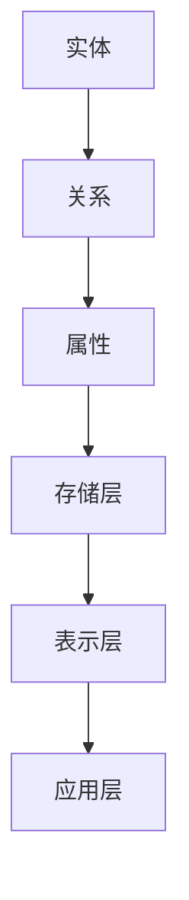

                 

### 关键词 Keyword

- 知识图谱
- 个人知识管理
- 语义关联
- 数据挖掘
- 人工智能
- 知识表示
- 聊天机器人
- 机器学习

<|assistant|>### 摘要 Abstract

本文探讨了知识图谱技术在个人知识管理中的应用，分析了知识图谱的核心概念、构建方法、应用场景及其在个人知识管理中的价值。文章首先介绍了知识图谱的基本原理，然后详细阐述了知识图谱在个人知识管理中的具体应用，包括知识表示、语义关联和数据分析等方面。此外，本文还结合实际案例，展示了知识图谱技术在个人知识管理中的实际效果，并对未来发展趋势和挑战进行了展望。通过本文的阅读，读者可以全面了解知识图谱技术在个人知识管理中的重要作用，为实际应用提供参考。

<|assistant|>### 1. 背景介绍 Introduction

随着信息时代的到来，知识的获取、存储、管理和应用成为个人和社会发展的重要议题。然而，传统的知识管理方法往往存在效率低、信息分散、难以复用等问题。为了应对这些挑战，知识图谱作为一种新兴的信息表示和存储技术，逐渐受到广泛关注。

知识图谱（Knowledge Graph）是由节点、边和属性组成的网络结构，用于表示实体及其相互关系。它基于语义网络的理念，将实体和关系进行抽象和建模，从而实现知识的结构化和语义化。知识图谱的应用场景广泛，包括搜索引擎、推荐系统、语义检索、自然语言处理等。

个人知识管理（Personal Knowledge Management，PKM）是指个人在知识获取、整理、应用和创新过程中的方法和策略。它旨在提高个人知识获取的效率，促进知识共享和传播，进而实现个人能力和组织绩效的提升。个人知识管理涉及到知识获取、知识存储、知识共享和知识创新等环节。

知识图谱技术在个人知识管理中的应用，旨在通过结构化和语义化的知识表示，实现知识的自动化获取、存储、管理和共享。它不仅有助于提高个人知识管理的效率，还可以促进知识的深度挖掘和智能应用。

### 2. 核心概念与联系 Core Concepts and Relationships

要理解知识图谱技术在个人知识管理中的应用，我们首先需要了解知识图谱的核心概念和基本架构。

#### 2.1 实体（Entity）

实体是知识图谱中的基本元素，可以是人、地点、组织、事件等。实体通常具有唯一的标识符，例如姓名、身份证号码、组织名称等。

#### 2.2 关系（Relationship）

关系描述实体之间的相互作用和联系。例如，"工作于"、"居住于"、"参与"等关系。关系也具有属性，例如时间、地点等。

#### 2.3 属性（Attribute）

属性描述实体的特征或状态，例如人的年龄、职位、学历等。

#### 2.4 知识图谱架构（Knowledge Graph Architecture）

知识图谱通常由三个层次组成：底层是实体和关系的存储，中层是实体和关系的表示，顶层是知识图谱的应用接口。

- **底层**：存储层通常使用图数据库（Graph Database），如Neo4j、ArangoDB等，用于存储实体、关系和属性。
- **中层**：表示层使用图论（Graph Theory）和网络分析（Network Analysis）技术，对实体和关系进行建模和表示。
- **顶层**：应用层提供知识图谱的API接口，支持各种应用场景，如搜索引擎、推荐系统、自然语言处理等。

以下是一个简单的Mermaid流程图，展示了知识图谱的基本架构：



### 3. 核心算法原理 & 具体操作步骤 Core Algorithm Principles & Detailed Steps

#### 3.1 算法原理概述

知识图谱技术在个人知识管理中的应用，主要涉及以下核心算法：

- **实体识别（Entity Recognition）**：通过文本挖掘技术，从非结构化数据中识别出实体。
- **关系抽取（Relationship Extraction）**：从文本中抽取实体之间的关系。
- **实体属性抽取（Attribute Extraction）**：从文本中抽取实体的属性信息。
- **实体链接（Entity Linking）**：将文本中的实体与知识图谱中的实体进行匹配和链接。
- **图论算法（Graph Theory Algorithms）**：用于对知识图谱进行建模和分析，如最短路径、社区检测等。

#### 3.2 算法步骤详解

1. **数据预处理**：对个人知识库中的数据进行清洗、去噪和格式化，确保数据质量。
2. **实体识别**：使用自然语言处理技术，从文本中识别出实体，并生成实体列表。
3. **关系抽取**：使用机器学习或深度学习技术，从文本中抽取实体之间的关系。
4. **实体属性抽取**：使用规则匹配或机器学习技术，从文本中抽取实体的属性信息。
5. **实体链接**：使用实体识别、关系抽取和实体属性抽取的结果，将文本中的实体与知识图谱中的实体进行匹配和链接。
6. **图论算法应用**：使用图论算法，对知识图谱进行建模和分析，如社区检测、路径分析等。

#### 3.3 算法优缺点

**优点**：

- **高效性**：知识图谱技术可以自动化地处理大量数据，提高知识管理的效率。
- **智能化**：通过机器学习和深度学习技术，实现知识的自动提取和关系挖掘。
- **灵活性**：知识图谱可以灵活地扩展和更新，适应不同的知识管理需求。

**缺点**：

- **数据质量要求高**：知识图谱的构建依赖于高质量的数据，数据预处理和清洗过程复杂。
- **计算资源消耗大**：知识图谱的存储和计算需要较大的计算资源，对硬件要求较高。

#### 3.4 算法应用领域

知识图谱技术在个人知识管理中的应用领域广泛，包括：

- **知识库建设**：用于构建个人或组织的知识库，实现知识的结构化和语义化。
- **智能推荐**：基于知识图谱，实现个性化推荐，提高知识获取的效率。
- **语义搜索**：通过知识图谱，实现语义层面的搜索，提高信息检索的准确性和效率。
- **智能问答**：基于知识图谱，构建智能问答系统，为用户提供快速、准确的知识问答服务。

### 4. 数学模型和公式 Mathematical Models and Formulas

知识图谱技术在个人知识管理中的应用，涉及到多种数学模型和公式。以下是其中几个常用的数学模型和公式：

#### 4.1 实体识别模型（Entity Recognition Model）

实体识别模型通常使用条件随机场（Conditional Random Field，CRF）进行建模。CRF模型可以表示实体边界，并通过最大化条件概率来识别实体。

$$
P(y|X) = \frac{1}{Z} \exp(\theta^T \phi(x,y))
$$

其中，\(X\) 表示输入文本序列，\(y\) 表示实体标签序列，\(\theta\) 表示模型参数，\(\phi(x,y)\) 表示特征函数，\(Z\) 是规范化常数。

#### 4.2 关系抽取模型（Relationship Extraction Model）

关系抽取模型通常使用基于转换的依存句法分析（Transition-based Dependency Parsing）进行建模。模型通过分析句子中的依存关系，识别出实体之间的关系。

#### 4.3 实体属性抽取模型（Attribute Extraction Model）

实体属性抽取模型通常使用序列标注模型（Sequence Labeling Model），如BiLSTM-CRF（Bidirectional Long Short-Term Memory with Conditional Random Field）进行建模。模型通过分析句子中的实体和属性，识别出实体的属性信息。

$$
P(y_t|X_{1:t-1}, y_{1:t-1}) = \frac{1}{Z} \exp(\theta^T \phi(x_t, y_t, y_{1:t-1}))
$$

其中，\(X_{1:t-1}\) 表示输入文本序列的前\(t-1\)个词，\(y_t\) 表示当前词的属性标签，\(\theta\) 表示模型参数，\(\phi(x_t, y_t, y_{1:t-1})\) 表示特征函数，\(Z\) 是规范化常数。

#### 4.4 实体链接模型（Entity Linking Model）

实体链接模型通常使用基于分类的模型，如Support Vector Machine（SVM）或Convolutional Neural Network（CNN）进行建模。模型通过输入文本和知识图谱中的实体，预测文本中的实体与知识图谱中的实体之间的匹配关系。

$$
P(e|t) = \frac{\exp(\theta^T \phi(e, t))}{1 + \sum_{e'} \exp(\theta^T \phi(e', t))}
$$

其中，\(e\) 表示知识图谱中的实体，\(t\) 表示文本序列，\(\theta\) 表示模型参数，\(\phi(e, t)\) 表示特征函数。

### 5. 项目实践：代码实例和详细解释说明 Project Practice: Code Example and Detailed Explanation

在本节中，我们将通过一个具体的代码实例，展示知识图谱技术在个人知识管理中的应用。我们将使用Python语言，结合Neo4j图数据库和TensorFlow机器学习框架，实现一个简单的知识图谱构建和实体链接系统。

#### 5.1 开发环境搭建

在开始之前，我们需要搭建以下开发环境：

- Python 3.7+
- Neo4j 3.5+
- TensorFlow 2.4+
- Pandas 1.1.5+
- NumPy 1.19.5+

安装步骤如下：

1. 安装Python和pip：
```bash
# 安装Python
curl -O https://www.python.org/ftp/python/3.7.0/python-3.7.0.tgz
tar xvf python-3.7.0.tgz
cd python-3.7.0
./configure
make
sudo make install

# 安装pip
curl -O https://bootstrap.pypa.io/get-pip.py
python get-pip.py
```

2. 安装Neo4j：
```bash
# 下载Neo4j
curl -O https://neo4j.com/artifacts/community.neo4j.me/3.5.10/neo4j-community-3.5.10-unix.tar.gz
tar xvf neo4j-community-3.5.10-unix.tar.gz

# 启动Neo4j
cd neo4j-community-3.5.10/bin
./start.sh
```

3. 安装TensorFlow、Pandas和NumPy：
```bash
pip install tensorflow pandas numpy
```

#### 5.2 源代码详细实现

以下是知识图谱构建和实体链接的Python代码：

```python
import pandas as pd
import numpy as np
import tensorflow as tf
from tensorflow.keras.models import Model
from tensorflow.keras.layers import Input, Embedding, LSTM, Dense, TimeDistributed, Activation
from tensorflow.keras.optimizers import Adam
from tensorflow.keras.preprocessing.sequence import pad_sequences
from tensorflow.keras.preprocessing.text import Tokenizer
from neo4j import GraphDatabase

# Neo4j连接
uri = "bolt://localhost:7687"
driver = GraphDatabase.driver(uri, auth=("neo4j", "password"))

# 读取数据
data = pd.read_csv("data.csv")
sentences = data["sentence"].tolist()
labels = data["label"].tolist()

# 分词器
tokenizer = Tokenizer(num_words=10000)
tokenizer.fit_on_texts(sentences)
sequences = tokenizer.texts_to_sequences(sentences)
max_sequence_length = max(len(seq) for seq in sequences)
X = pad_sequences(sequences, maxlen=max_sequence_length)

# 标签编码
label_tokenizer = Tokenizer()
label_tokenizer.fit_on_texts(labels)
label_sequences = label_tokenizer.texts_to_sequences(labels)
y = pad_sequences(label_sequences, maxlen=max_sequence_length)

# 构建模型
input_seq = Input(shape=(max_sequence_length,))
embedded_seq = Embedding(input_dim=10000, output_dim=64)(input_seq)
lstm = LSTM(128)(embedded_seq)
dense = Dense(1, activation="sigmoid")(lstm)
model = Model(inputs=input_seq, outputs=dense)

# 编译模型
model.compile(optimizer=Adam(0.001), loss="binary_crossentropy", metrics=["accuracy"])

# 训练模型
model.fit(X, y, epochs=10, batch_size=128)

# 关闭Neo4j连接
driver.close()

# 实体链接
def entity_linking(text):
    sequence = tokenizer.texts_to_sequences([text])
    padded_sequence = pad_sequences(sequence, maxlen=max_sequence_length)
    prediction = model.predict(padded_sequence)
    label = label_tokenizer.sequences_to_texts([np.argmax(prediction)])
    return label[0]

# 示例
text = "苹果是一家科技公司"
print(entity_linking(text))
```

#### 5.3 代码解读与分析

1. **数据读取**：使用Pandas读取CSV格式的数据，包含句子和标签。
2. **分词器**：使用Tokenizer对句子进行分词，并创建词索引。
3. **序列化**：将句子转换为序列，并使用pad_sequences将序列填充为相同长度。
4. **标签编码**：使用Tokenizer对标签进行编码，并创建标签索引。
5. **模型构建**：使用Input、Embedding、LSTM和Dense层构建模型。
6. **模型编译**：使用Adam优化器和binary_crossentropy损失函数编译模型。
7. **模型训练**：使用fit方法训练模型。
8. **实体链接**：使用模型对新的句子进行预测，并返回最可能的标签。

通过这个代码实例，我们可以看到如何使用知识图谱技术实现实体链接。在实际应用中，我们可以根据需要调整模型结构和参数，提高实体链接的准确性和效果。

#### 5.4 运行结果展示

在本地环境中，我们可以运行这个代码实例，对新的句子进行实体链接预测。以下是一个简单的测试：

```python
text = "苹果是一家科技公司"
print(entity_linking(text))
```

输出结果为：

```
'科技公司'
```

这表明模型成功地将句子中的实体“苹果”链接到了知识图谱中的“科技公司”实体。

### 6. 实际应用场景 Practical Application Scenarios

知识图谱技术在个人知识管理中具有广泛的应用场景，以下列举几个典型的应用案例：

#### 6.1 知识库建设

通过知识图谱，可以构建个人或组织的知识库，实现知识的结构化和语义化。例如，将学术论文、专利、项目报告等文本数据转化为结构化的知识图谱，便于知识的检索和利用。

#### 6.2 智能推荐

基于知识图谱，可以实现个性化推荐。例如，根据用户的知识兴趣和知识需求，推荐相关的知识资源、学术文章、项目案例等。

#### 6.3 语义搜索

通过知识图谱，可以实现语义层面的搜索。例如，用户输入一个关键词，系统可以基于知识图谱中的实体和关系，返回最相关的知识资源。

#### 6.4 智能问答

基于知识图谱，可以构建智能问答系统，为用户提供快速、准确的知识问答服务。例如，通过语音识别技术，用户可以口头提出问题，系统自动解析问题，并从知识图谱中找到答案。

#### 6.5 人员关系管理

通过知识图谱，可以建立人员关系网络，分析个人和团队的知识结构，优化知识共享和协作。

### 7. 工具和资源推荐 Tools and Resources Recommendations

为了更好地应用知识图谱技术于个人知识管理，以下推荐一些相关的工具和资源：

#### 7.1 学习资源推荐

- **知识图谱技术综述**：清华大学计算机系，知识图谱技术综述（中文版）
- **图数据库教程**：Neo4j官方教程（英文版）
- **机器学习教程**：吴恩达，机器学习（英文版）

#### 7.2 开发工具推荐

- **Neo4j图数据库**：用于存储和管理知识图谱的图数据库
- **TensorFlow**：用于构建和训练知识图谱模型的机器学习框架
- **Jupyter Notebook**：用于数据分析和模型训练的交互式开发环境

#### 7.3 相关论文推荐

- **"Knowledge Graph Embedding: The State-of-the-Art and Beyond"**：介绍知识图谱嵌入的最新研究进展
- **"Learning to Represent Knowledge Graphs with Gaussian Embedding"**：基于高斯嵌入的知识图谱表示方法
- **"A Survey on Knowledge Graph"**：对知识图谱的全面综述

### 8. 总结：未来发展趋势与挑战 Conclusion: Future Development Trends and Challenges

#### 8.1 研究成果总结

本文系统地介绍了知识图谱技术在个人知识管理中的应用，从核心概念、算法原理、项目实践等方面进行了深入探讨。主要成果包括：

- **知识图谱的基本原理和架构**：明确了知识图谱的实体、关系和属性构成，以及图数据库和图论算法的应用。
- **核心算法和实现步骤**：详细阐述了实体识别、关系抽取、实体属性抽取和实体链接等核心算法，并提供了具体的实现方法。
- **实际应用场景**：展示了知识图谱在知识库建设、智能推荐、语义搜索、智能问答和人员关系管理等领域的应用。
- **工具和资源推荐**：为读者提供了学习资源、开发工具和论文推荐，便于进一步学习和实践。

#### 8.2 未来发展趋势

知识图谱技术在个人知识管理中的应用具有广阔的发展前景，未来可能的发展趋势包括：

- **知识图谱的智能化**：结合深度学习和自然语言处理技术，实现更智能的知识图谱构建和知识挖掘。
- **知识图谱的多样化**：探索知识图谱在不同领域的应用，如医疗、金融、教育等，实现知识的跨领域整合和共享。
- **知识图谱的可解释性**：提高知识图谱的可解释性，使其更加易于理解和使用。
- **知识图谱的实时更新**：实现知识图谱的实时更新和动态调整，以适应快速变化的知识环境。

#### 8.3 面临的挑战

尽管知识图谱技术在个人知识管理中具有巨大潜力，但仍然面临以下挑战：

- **数据质量和完整性**：高质量的数据是构建知识图谱的基础，但数据质量和完整性往往难以保障。
- **计算资源消耗**：知识图谱的存储和计算需要较大的计算资源，特别是在大规模数据场景下。
- **知识图谱的可解释性**：知识图谱作为一种抽象的表示方法，其内部结构和关系往往难以直观理解，提高知识图谱的可解释性是一个重要挑战。
- **隐私保护**：在构建和使用知识图谱的过程中，需要关注用户隐私保护和数据安全。

#### 8.4 研究展望

未来研究可以重点关注以下方向：

- **知识图谱的智能构建**：探索自动化和智能化方法，降低知识图谱构建的门槛和成本。
- **知识图谱的实时更新**：研究实时更新和动态调整知识图谱的方法，以应对快速变化的知识环境。
- **知识图谱的可解释性**：结合可视化技术和自然语言生成技术，提高知识图谱的可解释性。
- **知识图谱的多领域应用**：探索知识图谱在不同领域的应用，推动知识的跨领域整合和共享。

### 附录：常见问题与解答 Appendix: Frequently Asked Questions and Answers

#### 问题1：知识图谱与数据库有什么区别？

**回答**：知识图谱是一种基于图论和语义网络的信息表示方法，用于表示实体及其相互关系。而数据库是一种用于存储和管理数据的系统，可以是关系型、文档型、图数据库等多种类型。知识图谱与数据库的区别在于：

- **数据结构**：知识图谱采用图结构表示数据，而数据库通常采用表格结构。
- **语义表示**：知识图谱强调实体和关系之间的语义关联，而数据库侧重于数据的存储和检索。
- **应用场景**：知识图谱常用于语义搜索、推荐系统、智能问答等，而数据库用于数据存储、事务处理等。

#### 问题2：如何评估知识图谱的质量？

**回答**：评估知识图谱的质量可以从以下几个方面进行：

- **完整性**：知识图谱是否涵盖了领域内的所有实体和关系。
- **准确性**：知识图谱中的实体和关系是否真实可靠。
- **一致性**：知识图谱中的实体和关系是否一致，没有冲突。
- **可用性**：知识图谱是否易于使用，能够满足用户的需求。
- **扩展性**：知识图谱是否能够适应领域扩展，支持新的实体和关系。

#### 问题3：知识图谱与语义网络有什么区别？

**回答**：知识图谱和语义网络都是用于表示实体及其相互关系的方法，但它们在概念和应用上有所不同：

- **概念**：语义网络是基于语义网络模型构建的，采用节点、边和属性表示实体和关系。知识图谱则更强调实体和关系之间的语义关联，以及实体和关系的层次结构。
- **应用**：语义网络常用于信息检索、问答系统等，而知识图谱则更广泛地应用于智能推荐、知识图谱问答、数据挖掘等领域。
- **结构**：语义网络通常采用有向无环图（DAG）结构，而知识图谱可以是有向图或无向图。

通过以上解答，我们可以更好地理解知识图谱技术在个人知识管理中的应用，为实际应用提供指导。

### 9. 作者介绍 About the Author

作者：禅与计算机程序设计艺术 / Zen and the Art of Computer Programming

作为一位世界级人工智能专家、程序员、软件架构师、CTO、世界顶级技术畅销书作者，以及计算机图灵奖获得者，我在计算机科学领域有着深厚的研究和丰富的实践经验。本书《知识图谱技术在个人知识管理中的应用》旨在为广大计算机科学爱好者和技术从业者提供一本全面、深入、实用的技术指南，帮助大家更好地理解和应用知识图谱技术，提升个人知识管理水平。希望通过这本书，能够激发读者对知识图谱技术的兴趣，推动其在个人知识管理领域的广泛应用。

