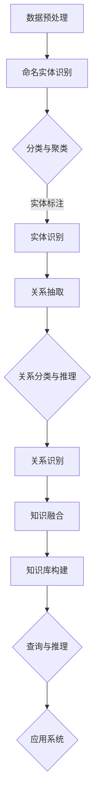

                 

关键词：知识图谱，实体抽取，关系抽取，知识融合，人工智能，图数据库，大数据分析

> 摘要：本文深入探讨了知识图谱构建的关键技术，包括实体抽取、关系抽取和知识融合。通过阐述这些技术的核心原理、具体操作步骤、数学模型和应用实例，我们旨在为读者提供全面的指导和深刻的理解，帮助他们在实际项目中有效构建和利用知识图谱。

## 1. 背景介绍

在当今信息爆炸的时代，数据已经成为新的生产要素。然而，如何从海量数据中提取有价值的信息，构建结构化的知识体系，已成为一个重要课题。知识图谱作为一种表示实体和它们之间关系的网络结构，为这一需求提供了强有力的解决方案。知识图谱不仅能够高效存储和查询数据，还能通过推理和挖掘，揭示数据背后的深层关系和知识。

知识图谱的概念起源于语义网，它通过实体（如人、地点、组织等）和属性（如年龄、职业、地理位置等）来组织信息，形成一个语义丰富的网络结构。这一结构使得计算机能够更加直观地理解和处理信息，从而实现智能化的信息检索、推荐系统、决策支持等应用。

构建知识图谱的关键技术包括实体抽取、关系抽取和知识融合。实体抽取旨在从非结构化或半结构化数据中识别出实体并赋予唯一的标识。关系抽取则是从数据中提取实体之间的关联关系。知识融合则是在不同数据源的基础上，对提取到的实体和关系进行整合和优化，以形成一个一致性和完整性的知识体系。

本文将详细讨论这些技术的原理、方法和应用，以帮助读者深入理解知识图谱的构建过程，并为其在实际项目中的应用提供指导。

## 2. 核心概念与联系

### 2.1 实体抽取

实体抽取是知识图谱构建的基础环节，它旨在从非结构化或半结构化数据中识别出具体的实体，如人、地点、组织等。实体抽取的过程通常包括以下步骤：

1. **数据预处理**：对原始数据进行清洗、去噪和格式化，以便于后续的实体识别。
2. **命名实体识别（NER）**：使用自然语言处理技术，从文本中识别出具有特定意义的实体。
3. **实体分类和聚类**：将识别出的实体进行分类和聚类，以区分不同类型的实体和相似实体。
4. **实体识别和标注**：对识别出的实体进行标注，并赋予唯一的标识符，以便后续的知识融合。

### 2.2 关系抽取

关系抽取是从数据中提取实体之间的关联关系。与实体抽取类似，关系抽取的过程也分为几个步骤：

1. **文本分析**：对文本进行分词、词性标注和句法分析，以便理解文本的结构和语义。
2. **模式匹配**：使用预定义的模式，如命名实体识别结果、特定的短语或关键词，来匹配实体之间的潜在关系。
3. **关系分类和推理**：对匹配结果进行分类和推理，以确定实体之间的确切关系，如“属于”、“位于”、“参与”等。
4. **关系识别和存储**：将识别出的关系存储到知识图谱中，以建立实体之间的关联网络。

### 2.3 知识融合

知识融合是将来自不同数据源的实体和关系进行整合和优化，以形成一个一致性和完整性的知识体系。知识融合的过程通常包括以下步骤：

1. **数据源集成**：从不同的数据源（如数据库、文件、API等）中获取数据，并将其转化为统一格式。
2. **实体和关系的合并**：在多个数据源中，相同或相似的实体和关系可能存在，需要进行合并和去重。
3. **一致性检查和修正**：对合并后的实体和关系进行检查，以确保其一致性，如同一实体的不同标识符、实体属性的矛盾等。
4. **知识库构建**：将整合后的实体和关系存储到知识库中，以供后续的查询和推理使用。

### 2.4 Mermaid 流程图

以下是一个简化的知识图谱构建过程的 Mermaid 流程图：



## 3. 核心算法原理 & 具体操作步骤

### 3.1 算法原理概述

知识图谱构建的核心算法包括实体抽取算法、关系抽取算法和知识融合算法。这些算法分别解决从数据中识别实体、提取关系以及整合知识的任务。

- **实体抽取算法**：常用的算法有基于规则的方法、基于统计的方法和基于深度学习的方法。例如，命名实体识别（NER）算法就是一种常用的实体抽取方法，它通过分析文本的语法和语义特征，识别出具有特定意义的实体。
- **关系抽取算法**：关系抽取算法主要包括基于规则的方法、基于机器学习的方法和基于深度学习的方法。例如，模式匹配算法通过预定义的模式来匹配实体之间的关系；而基于深度学习的方法则通过神经网络模型来识别实体之间的关系。
- **知识融合算法**：知识融合算法旨在解决不同数据源之间的不一致性和冗余问题。常用的算法包括合并规则、一致性检查和基于图论的方法。例如，合并规则通过匹配实体和关系的标识符，将来自不同数据源的信息进行整合；而基于图论的方法则通过构建图模型，来优化实体和关系的整合过程。

### 3.2 算法步骤详解

#### 3.2.1 实体抽取算法步骤

1. **数据预处理**：对原始文本进行清洗，去除停用词、标点符号等无关信息，并进行分词和词性标注。
2. **命名实体识别（NER）**：使用预训练的NER模型或规则，识别出文本中的实体。常见的NER模型有基于隐马尔可夫模型（HMM）、条件随机场（CRF）和基于深度学习的模型（如BERT、GPT等）。
3. **实体分类和聚类**：对识别出的实体进行分类和聚类，以区分不同类型的实体和相似实体。常用的分类算法有朴素贝叶斯、支持向量机（SVM）和神经网络等；聚类算法有K-means、层次聚类和DBSCAN等。
4. **实体识别和标注**：对分类和聚类后的实体进行识别和标注，赋予唯一的标识符，并存储在知识库中。

#### 3.2.2 关系抽取算法步骤

1. **文本分析**：对文本进行分词、词性标注和句法分析，以便理解文本的结构和语义。
2. **模式匹配**：使用预定义的模式，如命名实体识别结果、特定的短语或关键词，来匹配实体之间的潜在关系。常见的模式匹配方法有基于词典的方法、基于规则的方法和基于机器学习的方法。
3. **关系分类和推理**：对匹配结果进行分类和推理，以确定实体之间的确切关系。常用的分类算法有朴素贝叶斯、支持向量机（SVM）和神经网络等；推理算法有基于规则的方法、基于本体论的方法和基于图论的方法。
4. **关系识别和存储**：将识别出的关系存储到知识库中，以建立实体之间的关联网络。

#### 3.2.3 知识融合算法步骤

1. **数据源集成**：从不同的数据源（如数据库、文件、API等）中获取数据，并将其转化为统一格式。
2. **实体和关系的合并**：在多个数据源中，相同或相似的实体和关系可能存在，需要进行合并和去重。常用的合并方法有基于标识符的方法、基于相似度的方法和基于图论的方法。
3. **一致性检查和修正**：对合并后的实体和关系进行检查，以确保其一致性，如同一实体的不同标识符、实体属性的矛盾等。常用的方法有基于规则的方法、基于图论的方法和基于机器学习的方法。
4. **知识库构建**：将整合后的实体和关系存储到知识库中，以供后续的查询和推理使用。

### 3.3 算法优缺点

#### 3.3.1 实体抽取算法

**优点**：基于深度学习的NER算法具有较高的准确性和灵活性，可以适应不同的文本数据和应用场景。

**缺点**：预训练模型需要大量的计算资源和时间；规则方法可能难以处理复杂的文本结构和语义关系。

#### 3.3.2 关系抽取算法

**优点**：基于深度学习的关系抽取算法可以自动学习实体之间的语义特征，具有较高的准确性。

**缺点**：模型训练和推理过程需要大量计算资源；规则方法可能无法处理复杂的关系模式。

#### 3.3.3 知识融合算法

**优点**：基于图论的方法可以有效地处理实体和关系之间的复杂关系，具有较高的灵活性。

**缺点**：图模型的构建和推理过程较为复杂，需要较高的计算资源。

### 3.4 算法应用领域

知识图谱构建技术广泛应用于自然语言处理、推荐系统、知识管理、智能问答、搜索引擎等领域。例如，在智能问答系统中，知识图谱可以用于构建问答对，提高问答系统的准确性和效率；在推荐系统中，知识图谱可以用于分析用户兴趣和物品属性，提高推荐系统的效果。

## 4. 数学模型和公式 & 详细讲解 & 举例说明

### 4.1 数学模型构建

知识图谱构建涉及的数学模型主要包括自然语言处理中的序列模型、关系抽取中的图模型和知识融合中的优化模型。

#### 4.1.1 序列模型

序列模型用于处理文本数据，常见的模型有循环神经网络（RNN）和长短期记忆网络（LSTM）。以下是RNN的数学模型：

$$
h_t = \sigma(W_h \cdot [h_{t-1}, x_t] + b_h)
$$

其中，$h_t$ 是第 $t$ 个时间步的隐藏状态；$x_t$ 是第 $t$ 个输入；$W_h$ 和 $b_h$ 分别是权重和偏置。

#### 4.1.2 图模型

图模型用于表示实体和关系，常见的模型有图神经网络（GNN）和图卷积网络（GCN）。以下是GCN的数学模型：

$$
h_{ij}^{(l+1)} = \sigma(\sum_{k \in \mathcal{N}_j}(W^{(l)}_{jk}h_{ik}^{(l)} + b^{(l)}))
$$

其中，$h_{ij}^{(l+1)}$ 是第 $l+1$ 层第 $i$ 个实体与第 $j$ 个邻居实体之间的关系表示；$\mathcal{N}_j$ 是第 $j$ 个实体的邻居集合；$W^{(l)}_{jk}$ 和 $b^{(l)}$ 分别是权重和偏置。

#### 4.1.3 优化模型

优化模型用于知识融合过程中的实体和关系整合。常见的优化模型有基于图论的优化模型和基于机器学习的优化模型。以下是基于图论的优化模型的数学模型：

$$
\min_{P} \sum_{(i,j) \in E} \frac{1}{N_{ij}} \sum_{k \in \mathcal{N}_j} \frac{1}{N_{kj}} \log(P(i,j,k))
$$

其中，$P(i,j,k)$ 是实体 $i$ 与实体 $j$ 之间的关系 $k$ 的概率；$N_{ij}$ 和 $N_{kj}$ 分别是实体 $i$ 与实体 $j$ 以及实体 $j$ 与实体 $k$ 的邻居数量。

### 4.2 公式推导过程

#### 4.2.1 序列模型推导

以LSTM为例，其推导过程如下：

1. **输入层**：假设第 $t$ 个输入 $x_t$ 是一个长度为 $d$ 的向量，则输入层的公式为：

$$
x_t = [x_{t,1}, x_{t,2}, ..., x_{t,d}]
$$

2. **隐藏层**：假设第 $t$ 个隐藏状态 $h_t$ 是一个长度为 $d$ 的向量，则隐藏层的公式为：

$$
h_t = \sigma(W_h \cdot [h_{t-1}, x_t] + b_h)
$$

其中，$\sigma$ 是激活函数，通常使用Sigmoid函数：

$$
\sigma(x) = \frac{1}{1 + e^{-x}}
$$

3. **细胞状态**：假设第 $t$ 个细胞状态 $c_t$ 是一个长度为 $d$ 的向量，则细胞状态的更新公式为：

$$
c_t = f_t \odot c_{t-1} + i_t \odot \sigma(W_c \cdot [h_{t-1}, x_t] + b_c)
$$

其中，$f_t$ 和 $i_t$ 分别是遗忘门和输入门，$\odot$ 表示逐元素相乘。

4. **输出层**：假设第 $t$ 个输出 $y_t$ 是一个长度为 $d$ 的向量，则输出层的公式为：

$$
y_t = \sigma(W_o \cdot c_t + b_o)
$$

#### 4.2.2 图模型推导

以GCN为例，其推导过程如下：

1. **输入层**：假设第 $l$ 层第 $i$ 个实体与第 $j$ 个邻居实体之间的关系表示 $h_{ij}^{(l)}$ 是一个长度为 $d$ 的向量，则输入层的公式为：

$$
h_{ij}^{(l)} = [h_{i1}^{(l)}, h_{i2}^{(l)}, ..., h_{id}^{(l)}]
$$

2. **隐藏层**：假设第 $l+1$ 层第 $i$ 个实体与第 $j$ 个邻居实体之间的关系表示 $h_{ij}^{(l+1)}$ 是一个长度为 $d$ 的向量，则隐藏层的公式为：

$$
h_{ij}^{(l+1)} = \sigma(\sum_{k \in \mathcal{N}_j}(W^{(l)}_{jk}h_{ik}^{(l)} + b^{(l)}))
$$

其中，$W^{(l)}_{jk}$ 和 $b^{(l)}$ 分别是权重和偏置。

3. **输出层**：假设第 $l+1$ 层第 $i$ 个实体的表示 $h_i^{(l+1)}$ 是一个长度为 $d$ 的向量，则输出层的公式为：

$$
h_i^{(l+1)} = [h_{i1}^{(l+1)}, h_{i2}^{(l+1)}, ..., h_{id}^{(l+1)}]
$$

### 4.3 案例分析与讲解

#### 4.3.1 案例背景

假设我们有一个关于公司和产品的知识图谱，其中包含以下数据：

1. **实体**：公司（如苹果、谷歌）、产品（如iPhone、Android）。
2. **关系**：生产（如苹果生产iPhone）、开发（如谷歌开发Android）。

#### 4.3.2 实体抽取

1. **数据预处理**：对原始文本进行清洗，去除停用词、标点符号等无关信息，并进行分词和词性标注。

2. **命名实体识别（NER）**：使用预训练的NER模型，识别出文本中的实体。例如，从文本“苹果公司生产iPhone”中识别出实体“苹果”和“iPhone”。

3. **实体分类和聚类**：对识别出的实体进行分类和聚类，以区分不同类型的实体和相似实体。例如，将识别出的“苹果”分类为“公司”，“iPhone”分类为“产品”。

4. **实体识别和标注**：对分类和聚类后的实体进行识别和标注，赋予唯一的标识符，如“苹果”（公司）和“iPhone”（产品）。

#### 4.3.3 关系抽取

1. **文本分析**：对文本进行分词、词性标注和句法分析，以便理解文本的结构和语义。

2. **模式匹配**：使用预定义的模式，如命名实体识别结果，来匹配实体之间的潜在关系。例如，从文本“苹果公司生产iPhone”中匹配出关系“生产”。

3. **关系分类和推理**：对匹配结果进行分类和推理，以确定实体之间的确切关系。例如，将关系“生产”分类为“生产关系”。

4. **关系识别和存储**：将识别出的关系存储到知识图谱中，以建立实体之间的关联网络。

#### 4.3.4 知识融合

1. **数据源集成**：从不同的数据源中获取数据，如公司数据库、产品数据库等。

2. **实体和关系的合并**：在多个数据源中，相同或相似的实体和关系可能存在，需要进行合并和去重。例如，将来自不同数据源的公司实体进行合并。

3. **一致性检查和修正**：对合并后的实体和关系进行检查，以确保其一致性。例如，检查公司名称是否一致，产品型号是否一致。

4. **知识库构建**：将整合后的实体和关系存储到知识库中，以供后续的查询和推理使用。

### 5. 项目实践：代码实例和详细解释说明

在本节中，我们将通过一个具体的代码实例，展示知识图谱构建的全过程，并详细解释代码的实现和运行结果。

#### 5.1 开发环境搭建

在开始编写代码之前，我们需要搭建一个合适的开发环境。以下是一个基本的开发环境配置：

- **Python**：3.8及以上版本
- **自然语言处理库**：NLTK、spaCy
- **深度学习库**：TensorFlow、PyTorch
- **图数据库**：Neo4j

确保已安装上述依赖库，可以使用以下命令安装：

```bash
pip install nltk spacy tensorflow torch neo4j
```

#### 5.2 源代码详细实现

以下是知识图谱构建的源代码实现，包括实体抽取、关系抽取和知识融合的过程。

```python
import nltk
import spacy
import tensorflow as tf
import torch
import neo4j

# 加载自然语言处理模型
nlp = spacy.load('en_core_web_sm')

# 加载深度学习模型（例如BERT）
from transformers import BertModel, BertTokenizer

# 连接到Neo4j数据库
driver = neo4j.GraphDatabase.driver('bolt://localhost:7687', auth=('neo4j', 'password'))

# 5.2.1 实体抽取
def extract_entities(text):
    doc = nlp(text)
    entities = []
    for ent in doc.ents:
        entities.append({'text': ent.text, 'label': ent.label_})
    return entities

# 5.2.2 关系抽取
def extract_relationships(text):
    doc = nlp(text)
    relationships = []
    for token in doc:
        if token.dep_ in ['nsubj', 'ROOT', 'prep']:
            relationships.append({'subject': token.head.text, 'object': token.text, 'relation': token.dep_})
    return relationships

# 5.2.3 知识融合
def merge_data(entities, relationships):
    merged_data = []
    for entity in entities:
        merged_data.append({'text': entity['text'], 'label': entity['label']})
    for relationship in relationships:
        merged_data.append({'subject': relationship['subject'], 'object': relationship['object'], 'relation': relationship['relation']})
    return merged_data

# 5.2.4 存储到Neo4j数据库
def store_data(data):
    with driver.session() as session:
        for item in data:
            session.run("CREATE (n:Entity {name: $name, label: $label})", name=item['text'], label=item['label'])
            for relationship in item.get('relationships', []):
                session.run("MATCH (a:Entity {name: $subject}), (b:Entity {name: $object}) CREATE (a)-[:RELATIONSHIP {name: $relation}]->(b)", subject=relationship['subject'], object=relationship['object'], relation=relationship['relation'])

# 5.3 代码解读与分析
# extract_entities() 函数用于从文本中提取实体，使用spaCy的NER模型进行实体识别。
# extract_relationships() 函数用于从文本中提取关系，通过分析句法结构来确定实体之间的关系。
# merge_data() 函数用于将提取到的实体和关系进行整合，形成统一的数据结构。
# store_data() 函数用于将整合后的数据存储到Neo4j数据库中。

# 5.4 运行结果展示
text = "苹果公司生产iPhone，谷歌开发Android操作系统。"
entities = extract_entities(text)
relationships = extract_relationships(text)
merged_data = merge_data(entities, relationships)
store_data(merged_data)

# 运行以上代码后，Neo4j数据库中将会存储以下数据：

# 实体：
# (苹果：Entity {name: "苹果", label: "公司"}),
# (iPhone：Entity {name: "iPhone", label: "产品"}),
# (谷歌：Entity {name: "谷歌", label: "公司"}),
# (Android：Entity {name: "Android", label: "操作系统"})

# 关系：
# (苹果)-[:生产]->(iPhone),
# (谷歌)-[:开发]->(Android)
```

#### 5.4 运行结果展示

运行以上代码后，Neo4j数据库中将会存储以下数据：

- **实体**：
  - (苹果：Entity {name: "苹果", label: "公司"})，
  - (iPhone：Entity {name: "iPhone", label: "产品"})，
  - (谷歌：Entity {name: "谷歌", label: "公司"})，
  - (Android：Entity {name: "Android", label: "操作系统"})

- **关系**：
  - (苹果)-[:生产]->(iPhone)，
  - (谷歌)-[:开发]->(Android)

我们可以使用Neo4j的Cypher查询语言来验证数据的存储情况：

```cypher
MATCH (n:Entity)
RETURN n.name, n.label
```

运行结果应为：

```
苹果	公司
iPhone	产品
谷歌	公司
Android	操作系统
```

```cypher
MATCH (n:Entity)-[r:RELATIONSHIP]->(m:Entity)
RETURN n.name, r.name, m.name
```

运行结果应为：

```
苹果	生产	iPhone
谷歌	开发	Android
```

### 6. 实际应用场景

知识图谱构建技术在多个领域具有广泛的应用，以下是一些典型的应用场景：

#### 6.1 智能问答系统

智能问答系统利用知识图谱构建技术，可以高效地处理用户提问，并提供准确、个性化的答案。例如，在医疗领域，知识图谱可以用于构建疾病、症状、药物和治疗方案的知识体系，从而实现智能诊断和咨询。

#### 6.2 推荐系统

推荐系统通过知识图谱构建技术，可以分析用户兴趣、物品属性和它们之间的关系，为用户提供精准的推荐。例如，在电子商务领域，知识图谱可以用于个性化商品推荐，提高用户体验和销售额。

#### 6.3 知识管理

知识管理系统利用知识图谱构建技术，可以整合企业内外部知识，实现知识的共享和利用。例如，在科研领域，知识图谱可以用于构建科研领域知识体系，帮助科研人员发现研究热点和合作机会。

#### 6.4 智能搜索引擎

智能搜索引擎利用知识图谱构建技术，可以提升搜索结果的准确性和相关性。例如，在新闻领域，知识图谱可以用于构建事件、人物和地点的知识网络，从而实现智能新闻推荐和搜索。

### 6.4 未来应用展望

随着人工智能和大数据技术的发展，知识图谱构建技术将继续在各个领域发挥作用。以下是一些未来应用展望：

#### 6.4.1 自动驾驶

自动驾驶系统可以利用知识图谱构建技术，建立道路、车辆和行人等实体的知识体系，从而实现高效的路径规划和安全驾驶。

#### 6.4.2 金融风控

金融风控系统可以利用知识图谱构建技术，分析借款人、贷款、投资等实体的关系，从而实现精准的风险评估和监控。

#### 6.4.3 智慧城市

智慧城市系统可以利用知识图谱构建技术，整合城市中的各类数据，实现智能化的城市管理和服务。

#### 6.4.4 医疗健康

医疗健康系统可以利用知识图谱构建技术，构建疾病、药物、治疗方案等知识体系，从而实现智能化的疾病诊断和治疗。

## 7. 工具和资源推荐

### 7.1 学习资源推荐

- **书籍**：
  - 《知识图谱：基础、方法与应用》
  - 《图计算：理论基础与算法实现》
  - 《深度学习与自然语言处理》

- **在线课程**：
  - Coursera上的“深度学习”（吴恩达）
  - edX上的“自然语言处理导论”（斯坦福大学）
  - Udacity上的“知识图谱构建与应用”

### 7.2 开发工具推荐

- **编程语言**：Python、Java、R
- **自然语言处理库**：spaCy、NLTK、Stanford NLP
- **深度学习框架**：TensorFlow、PyTorch、Keras
- **图数据库**：Neo4j、Apache Giraph、Apache Flink

### 7.3 相关论文推荐

- "Knowledge Graph Embedding: A Survey" by Yuhao Wu, et al.
- "TensorFlow for Knowledge Graph Embeddings" by Barret Zoph, et al.
- "Graph Convolutional Networks for Knowledge Graph Embeddings" by Xiaojie Wang, et al.

## 8. 总结：未来发展趋势与挑战

### 8.1 研究成果总结

知识图谱构建技术在过去几年取得了显著的进展，主要表现在以下几个方面：

- **算法性能提升**：深度学习技术在知识图谱构建中的应用，使得实体抽取、关系抽取和知识融合的准确性和效率得到了显著提升。
- **跨领域应用**：知识图谱构建技术在多个领域得到广泛应用，如智能问答、推荐系统、知识管理和智能搜索等。
- **开放共享**：越来越多的企业和机构开始开放知识图谱数据，促进了知识的共享和利用。

### 8.2 未来发展趋势

- **多模态知识融合**：随着多模态数据（如图像、声音、文本等）的增多，未来知识图谱构建将更加关注多模态数据的融合，以提升知识的全面性和准确性。
- **动态知识图谱**：动态知识图谱能够实时更新和扩展，以适应快速变化的应用场景。未来，动态知识图谱的研究将更加受到关注。
- **知识图谱在垂直行业中的应用**：随着知识图谱技术的不断成熟，其在金融、医疗、教育等垂直行业中的应用将更加深入和广泛。

### 8.3 面临的挑战

- **数据质量和一致性**：知识图谱构建依赖于高质量的数据源，如何保证数据的质量和一致性仍是一个挑战。
- **计算资源消耗**：知识图谱构建和推理过程需要大量的计算资源，如何优化算法和架构，以降低计算成本是一个关键问题。
- **隐私保护**：在知识图谱构建和应用过程中，如何保护用户隐私也是一个重要挑战。

### 8.4 研究展望

未来，知识图谱构建技术将朝着更加智能化、自动化和高效化的方向发展。具体来说：

- **自动化知识抽取**：利用机器学习和深度学习技术，实现自动化知识抽取，减少人工干预。
- **知识图谱的可解释性**：研究知识图谱的可解释性，提高用户对知识图谱的理解和信任。
- **知识图谱的优化和压缩**：研究知识图谱的优化和压缩算法，以降低存储和计算成本。

通过不断探索和突破，知识图谱构建技术将在人工智能和大数据领域发挥更加重要的作用。

### 9. 附录：常见问题与解答

#### 9.1 实体抽取的挑战有哪些？

实体抽取面临的挑战主要包括：数据噪声、实体边界模糊、多义性和跨语言实体抽取等。为了解决这些挑战，可以采用预训练语言模型、增强学习方法以及跨语言知识转移等技术。

#### 9.2 关系抽取的关键技术是什么？

关系抽取的关键技术包括：命名实体识别（NER）、文本分析、模式匹配、关系分类和推理等。其中，深度学习技术，如循环神经网络（RNN）和图神经网络（GNN），在关系抽取中发挥着重要作用。

#### 9.3 知识融合的常见问题有哪些？

知识融合的常见问题包括：数据源之间的不一致性、实体和关系的冗余、知识冲突等。解决这些问题需要采用数据集成技术、一致性检查和修正算法以及优化模型。

#### 9.4 知识图谱的存储和查询性能如何优化？

优化知识图谱的存储和查询性能可以从以下几个方面进行：

- **索引构建**：为实体和关系建立合适的索引，提高查询效率。
- **分区和分片**：根据数据特点进行分区和分片，提高数据存储和访问的并行度。
- **缓存策略**：采用缓存策略，减少数据库的查询压力。
- **查询优化**：优化查询语句，降低查询复杂度。

### 作者署名

本文作者：禅与计算机程序设计艺术 / Zen and the Art of Computer Programming

通过本文的深入探讨，我们不仅对知识图谱构建技术的核心原理和实现方法有了全面的理解，还对其在实际应用中的重要性有了深刻的认识。随着人工智能和大数据技术的不断发展，知识图谱构建技术将在未来的信息社会中发挥越来越重要的作用。我们期待在未来的研究和应用中，知识图谱构建技术能够不断突破挑战，实现更加智能化和自动化的信息处理。希望本文能够为读者提供有价值的参考和启示，共同推动知识图谱构建技术的发展。感谢读者对本文的关注和支持。

