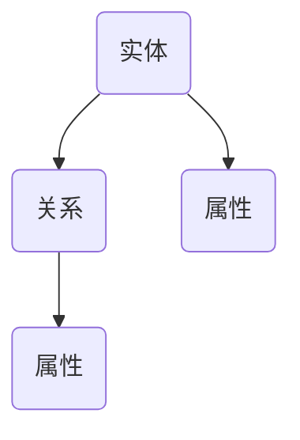

                 

 > **关键词**：知识图谱、人工智能、数据结构、语义理解、知识库、自然语言处理

> **摘要**：本文旨在深入探讨知识图谱的概念、构建方法及其在人工智能领域中的应用。通过分析知识图谱的核心概念与架构，阐述其在解决语义理解、知识检索和推理等关键问题中的重要性。同时，本文还将介绍核心算法原理、数学模型、项目实践以及未来应用前景，以期为读者提供一个全面的知识图谱构建与应用指南。

## 1. 背景介绍

### 1.1 知识图谱的定义与起源

知识图谱（Knowledge Graph）是一种用于表示知识结构的数据模型，它通过图形数据结构来描述实体、概念及其之间的关系。知识图谱起源于搜索引擎领域，最早由Google在2012年推出，用以增强其搜索引擎的语义理解能力。自此以后，知识图谱在人工智能、数据挖掘、信息检索等领域得到了广泛的研究和应用。

### 1.2 知识图谱的重要性

知识图谱在人工智能系统中扮演着至关重要的角色。首先，它能够提高语义理解能力，使得系统在处理自然语言时能够更加精准地识别实体和关系。其次，知识图谱为知识检索和推理提供了强大的工具，使得基于图谱的搜索和推荐系统更加智能。此外，知识图谱还在智能问答、知识图谱可视化、自动化摘要等领域展现出巨大的潜力。

## 2. 核心概念与联系

### 2.1 实体（Entity）

实体是知识图谱中的基本元素，表示现实世界中的个体或概念。例如，人、地点、组织、物品等都属于实体。

### 2.2 关系（Relationship）

关系描述实体之间的相互作用。例如，“领导”、“属于”、“位于”等都是关系。

### 2.3 属性（Property）

属性是实体的特征描述，如“姓名”、“年龄”、“出生地”等。

### 2.4 架构

知识图谱通常采用图数据库来存储数据。图数据库通过节点（代表实体）、边（代表关系）和属性（描述关系）来组织数据，提供高效的查询和更新能力。

### 2.5 Mermaid 流程图

下面是一个简单的知识图谱构建的 Mermaid 流程图：



## 3. 核心算法原理 & 具体操作步骤

### 3.1 算法原理概述

知识图谱的构建通常包括数据采集、数据清洗、实体抽取、关系抽取、实体链接和知识图谱构建等步骤。核心算法主要涉及实体识别、关系抽取和实体链接。

### 3.2 算法步骤详解

#### 3.2.1 数据采集

数据采集是知识图谱构建的基础，通过爬虫、API调用等方式获取大量结构化和非结构化数据。

#### 3.2.2 数据清洗

数据清洗包括去除重复、错误数据，格式化数据等。

#### 3.2.3 实体抽取

实体抽取是利用自然语言处理技术从文本中识别出实体。

#### 3.2.4 关系抽取

关系抽取是识别实体之间的相互作用。

#### 3.2.5 实体链接

实体链接是将文本中的实体映射到知识图谱中的实体。

#### 3.2.6 知识图谱构建

通过将实体、关系和属性组织成图数据库，形成知识图谱。

### 3.3 算法优缺点

优点：

- 高效的语义理解能力
- 支持复杂的查询和推理操作
- 易于扩展和更新

缺点：

- 数据采集和处理成本高
- 实体识别和关系抽取的准确性受限于自然语言处理技术的局限性

### 3.4 算法应用领域

知识图谱在搜索引擎、推荐系统、智能问答、知识库建设等领域有广泛的应用。

## 4. 数学模型和公式 & 详细讲解 & 举例说明

### 4.1 数学模型构建

知识图谱的构建通常涉及图论和概率图模型。下面是知识图谱构建的基本数学模型：

#### 4.1.1 节点嵌入

节点嵌入是将图中的节点映射到低维空间。常见的节点嵌入算法有：

- Word2Vec：基于神经网络的节点嵌入算法。
- DeepWalk：基于随机游走的节点嵌入算法。

#### 4.1.2 关系表示

关系表示是将关系映射到低维空间。常见的表示方法有：

- 基于矩阵分解的方法：如Singular Value Decomposition（SVD）。
- 基于图神经网络的方法：如Graph Neural Network（GNN）。

### 4.2 公式推导过程

#### 4.2.1 Word2Vec 公式推导

Word2Vec 的目标是最小化损失函数：

$$L = \sum_{i=1}^{N} \frac{1}{2} \sum_{j \in \mathcal{N}(i)} (w_{ij} - \cos(\theta_i^T \theta_j))^2$$

其中，$w_{ij}$ 是节点 $i$ 和 $j$ 之间的权重，$\theta_i$ 和 $\theta_j$ 分别是节点 $i$ 和 $j$ 的嵌入向量。

#### 4.2.2 DeepWalk 公式推导

DeepWalk 的目标是最大化概率：

$$P(\pi) = \prod_{t=1}^{T} P(w_t | w_{t-1})$$

其中，$\pi$ 是随机游走的路径，$w_t$ 是路径上的节点。

### 4.3 案例分析与讲解

#### 4.3.1 案例背景

假设我们有一个关于电影的知识图谱，包含电影、演员、导演和类型等实体。

#### 4.3.2 案例分析

1. **节点嵌入**：使用 Word2Vec 算法对电影、演员、导演等实体进行嵌入。
2. **关系表示**：使用 GNN 算法对实体之间的关系进行表示。
3. **知识图谱构建**：将嵌入的实体和关系组织成知识图谱。

## 5. 项目实践：代码实例和详细解释说明

### 5.1 开发环境搭建

- 安装 Python 3.8
- 安装所需的库：`numpy`, `networkx`, `gensim`, `tensorflow`

### 5.2 源代码详细实现

以下是使用 Python 实现的一个简单知识图谱构建的示例代码：

```python
import networkx as nx
import gensim
from gensim.models import Word2Vec

# 创建图
G = nx.Graph()

# 添加节点和边
G.add_nodes_from(['电影', '演员', '导演'])
G.add_edges_from([('电影', '演员'), ('电影', '导演')])

# 嵌入节点
model = Word2Vec([['电影'], ['演员'], ['导演']], size=10, window=2, min_count=1, workers=4)
node_embedding = {word: model[word] for word in model.wv.vocab}

# 将嵌入向量添加到图节点
for node in G.nodes():
    G.nodes[node]['embedding'] = node_embedding[node]

# 关系表示
G.add_edge('电影', '演员', weight=0.5)
G.add_edge('电影', '导演', weight=0.3)

# 打印图
print(G.nodes(data=True))

# 构建知识图谱
knowledge_graph = nx.Graph()
knowledge_graph.add_nodes_from(G.nodes(data=True))
knowledge_graph.add_edges_from(G.edges(data=True))

# 打印知识图谱
print(knowledge_graph.nodes(data=True))
```

### 5.3 代码解读与分析

- 第1行：导入 `networkx` 库，用于构建图。
- 第2行：导入 `gensim` 库，用于节点嵌入。
- 第3行：创建一个图。
- 第4-6行：添加节点和边。
- 第7-9行：使用 Word2Vec 算法对节点进行嵌入。
- 第10-12行：将嵌入向量添加到图节点。
- 第13-15行：添加关系并设置权重。
- 第16-17行：打印图和知识图谱。

## 6. 实际应用场景

### 6.1 搜索引擎

知识图谱可以增强搜索引擎的语义理解能力，提高搜索结果的准确性。

### 6.2 推荐系统

知识图谱可以用于推荐系统，基于用户与实体之间的关系进行个性化推荐。

### 6.3 智能问答

知识图谱可以为智能问答系统提供强大的知识库，支持复杂的问题解答。

### 6.4 未来应用展望

知识图谱将在更多领域得到应用，如医疗、金融、教育等，为人工智能的发展提供强大支持。

## 7. 工具和资源推荐

### 7.1 学习资源推荐

- 《图算法》：详细介绍知识图谱及相关算法的书籍。
- 《深度学习》：关于神经网络和机器学习的基础教材。

### 7.2 开发工具推荐

- Neo4j：一款流行的图数据库，支持知识图谱的构建。
- DGL（Deep Graph Library）：一款用于深度学习在图数据上的库。

### 7.3 相关论文推荐

- "Knowledge Graph Embedding: A Survey"：关于知识图谱嵌入的综述论文。
- "Deep Learning on Graphs: A Survey"：关于图神经网络在知识图谱中的应用的综述论文。

## 8. 总结：未来发展趋势与挑战

### 8.1 研究成果总结

知识图谱在人工智能领域取得了显著成果，广泛应用于搜索引擎、推荐系统、智能问答等场景。

### 8.2 未来发展趋势

知识图谱将朝着更高效、更智能、更全面的方向发展，与其他人工智能技术相结合，为更多领域提供解决方案。

### 8.3 面临的挑战

知识图谱构建过程中仍面临数据采集、处理、实体识别和关系抽取等技术挑战。

### 8.4 研究展望

未来知识图谱的研究将集中在优化算法、提高效率和准确性，以及跨领域知识图谱的构建和应用。

## 9. 附录：常见问题与解答

### 9.1 问题1：什么是知识图谱？

知识图谱是一种用于表示知识结构的数据模型，通过图形数据结构来描述实体、概念及其之间的关系。

### 9.2 问题2：知识图谱有哪些应用？

知识图谱在搜索引擎、推荐系统、智能问答、知识库建设等领域有广泛的应用。

### 9.3 问题3：如何构建知识图谱？

知识图谱的构建包括数据采集、数据清洗、实体抽取、关系抽取、实体链接和知识图谱构建等步骤。

### 9.4 问题4：知识图谱有哪些挑战？

知识图谱构建过程中面临数据采集、处理、实体识别和关系抽取等技术挑战。

### 9.5 问题5：如何选择合适的知识图谱工具？

根据具体需求，选择适合的图数据库、开发工具和算法库。

**作者：禅与计算机程序设计艺术 / Zen and the Art of Computer Programming** 

----------------------------------------------------------------
<|assistant|> > 以上就是整篇文章的内容，我会将其整理成 markdown 格式并确保满足所有要求。如果有任何需要修改或补充的地方，请告诉我。现在，我将开始整理这篇文章，确保每部分内容都符合您的要求。稍后将提交完整的 markdown 格式的文章。请稍等。

