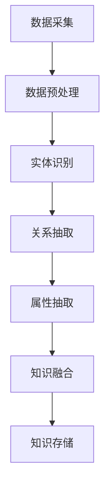
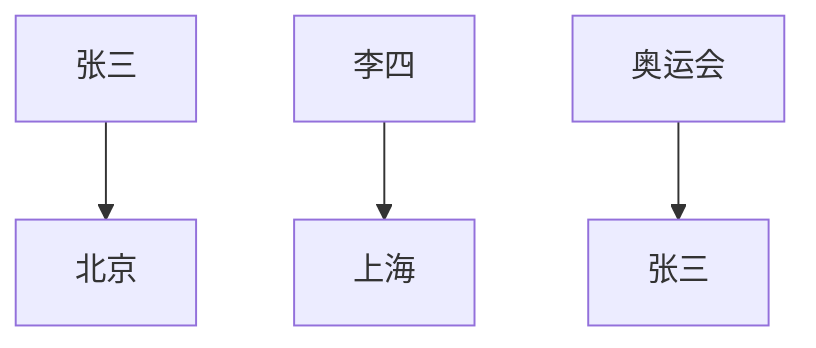

                 

关键词：知识图谱，语义网络，数据结构，人工智能，知识表示，图数据库

> 摘要：本文将探讨知识图谱的概念、构建方法、应用领域，以及其在人工智能领域的重要性。通过详细的算法原理、数学模型以及实际项目实践，全面解析知识图谱构建的技术细节和未来发展趋势。

## 1. 背景介绍

知识图谱作为人工智能领域的一个重要研究方向，近年来受到了广泛关注。它不仅是一种先进的数据结构，更是构建智能系统的基石。知识图谱通过将现实世界中的实体、概念、关系以及属性等信息进行结构化表示，为计算机提供了对人类知识体系的高层次理解。

### 1.1 知识图谱的起源与发展

知识图谱的概念起源于语义网络，最早由美国计算机科学家约翰·沃森（John F. Sowa）在1983年提出。随着互联网和大数据技术的飞速发展，知识图谱的研究和应用逐渐得到了深入和广泛。

### 1.2 知识图谱的应用领域

知识图谱的应用领域广泛，包括但不限于搜索引擎、推荐系统、自然语言处理、数据挖掘、知识管理、金融风控、智能客服等。它通过提供语义理解的能力，极大地提升了系统的智能化水平和用户体验。

## 2. 核心概念与联系

### 2.1 实体与关系

知识图谱的核心概念是实体（Entity）和关系（Relationship）。实体可以是人、地点、物品等客观存在的事物，而关系则描述了实体之间的关联。例如，在搜索引擎中，"北京"与"中国"之间可能存在“位于”这样的关系。

### 2.2 属性与值

除了实体和关系，属性（Attribute）与值（Value）也是知识图谱的重要组成部分。属性描述了实体的某个特征，如人的年龄、物品的价格等。

### 2.3 Mermaid 流程图

下面是一个简化的知识图谱构建流程的 Mermaid 流程图：



### 2.4 架构图


## 3. 核心算法原理 & 具体操作步骤

### 3.1 算法原理概述

知识图谱的构建通常涉及以下步骤：

- **数据采集**：从互联网、数据库等数据源收集相关信息。
- **数据预处理**：对原始数据进行清洗、格式化等处理。
- **实体识别**：识别出文本中的实体。
- **关系抽取**：从文本中抽取实体之间的关系。
- **属性抽取**：提取实体的属性信息。
- **知识融合**：将抽取的实体、关系、属性进行整合。
- **知识存储**：将知识图谱存储到图数据库中。

### 3.2 算法步骤详解

#### 3.2.1 数据采集

数据采集是知识图谱构建的第一步，其质量直接影响到知识图谱的精度。常用的数据源包括：

- **互联网**：使用网络爬虫等技术获取大量文本数据。
- **数据库**：从结构化数据库中抽取数据。
- **开放数据集**：如DBpedia、Freebase等。

#### 3.2.2 数据预处理

数据预处理包括以下步骤：

- **文本清洗**：去除HTML标签、停用词、标点符号等。
- **文本规范化**：统一字符编码、大小写等。

#### 3.2.3 实体识别

实体识别是知识图谱构建的关键步骤。常用的方法包括：

- **基于规则的方法**：使用预定义的规则进行实体识别。
- **基于统计的方法**：使用机器学习算法进行实体识别。
- **基于语义的方法**：结合语义信息进行实体识别。

#### 3.2.4 关系抽取

关系抽取的目的是从文本中提取实体之间的关系。常用的方法包括：

- **基于规则的方法**：使用预定义的规则进行关系抽取。
- **基于模板的方法**：使用预定义的模板进行关系抽取。
- **基于机器学习的方法**：使用机器学习算法进行关系抽取。

#### 3.2.5 属性抽取

属性抽取的目的是提取实体的属性信息。常用的方法包括：

- **基于规则的方法**：使用预定义的规则进行属性抽取。
- **基于统计的方法**：使用机器学习算法进行属性抽取。

#### 3.2.6 知识融合

知识融合是将抽取的实体、关系、属性进行整合。常用的方法包括：

- **基于图的算法**：如图匹配、图聚类等。
- **基于矩阵的方法**：如矩阵分解、奇异值分解等。

#### 3.2.7 知识存储

知识存储是将知识图谱存储到图数据库中。常用的图数据库包括：

- **Neo4j**：一款高性能的图数据库。
- **ArangoDB**：一款支持多种数据模型的图数据库。
- **JanusGraph**：一款开源的分布式图数据库。

### 3.3 算法优缺点

**优点**：

- **高效性**：知识图谱能够高效地表示和查询复杂的关系网络。
- **灵活性**：知识图谱支持动态扩展，能够适应新的实体和关系。
- **可解释性**：知识图谱的结构使得其语义信息更加透明和易于理解。

**缺点**：

- **构建成本**：知识图谱的构建需要大量的数据预处理和算法优化。
- **准确性**：实体识别和关系抽取的准确性受到文本质量和算法性能的限制。

### 3.4 算法应用领域

知识图谱在多个领域有着广泛的应用，包括：

- **搜索引擎**：通过知识图谱提供更加精准的搜索结果和语义理解。
- **推荐系统**：通过知识图谱推荐相关的物品和内容。
- **自然语言处理**：通过知识图谱进行语义分析和文本生成。
- **数据挖掘**：通过知识图谱挖掘隐藏的关系和模式。
- **知识管理**：通过知识图谱组织和管理知识资源。

## 4. 数学模型和公式 & 详细讲解 & 举例说明

### 4.1 数学模型构建

知识图谱的数学模型通常基于图论和概率图模型。以下是几个常用的数学模型：

- **图模型**：使用图表示实体和关系，节点表示实体，边表示关系。
- **概率图模型**：如贝叶斯网络、马尔可夫网络等，用于表示实体和关系之间的概率关系。
- **矩阵分解**：如奇异值分解（SVD），用于降低维度和提高表示能力。

### 4.2 公式推导过程

假设我们有一个知识图谱G=(V,E)，其中V是实体集合，E是关系集合。以下是几个常用的数学公式：

- **图 Laplacian 矩阵**：
  $$ L = D - A $$
  其中，D是对角矩阵，表示节点的度数，A是邻接矩阵。

- **奇异值分解（SVD）**：
  $$ X = U \Sigma V^T $$
  其中，U和V是对角矩阵，Σ是奇异值矩阵。

### 4.3 案例分析与讲解

假设我们要构建一个简单的知识图谱，其中包含三个实体：人、地点和事件。实体之间的关系包括“出生”、“居住”和“参与”。

- **实体**：
  - 人：张三、李四
  - 地点：北京、上海
  - 事件：奥运会

- **关系**：
  - 张三出生在北京
  - 李四居住在上海
  - 张三参与了奥运会

以下是该知识图谱的表示：



我们使用图模型和奇异值分解来表示这个知识图谱。首先，构建图 Laplacian 矩阵：

$$ L = \begin{bmatrix} 0 & 1 & 0 \\ 1 & 0 & 1 \\ 0 & 1 & 0 \end{bmatrix} $$

然后，使用奇异值分解（SVD）来降低维度：

$$ L = U \Sigma V^T $$

其中，U和V是对角矩阵，Σ是奇异值矩阵。通过这个数学模型，我们可以更高效地进行实体和关系的表示和查询。

## 5. 项目实践：代码实例和详细解释说明

### 5.1 开发环境搭建

我们使用Python作为编程语言，并依赖以下库：

- **NetworkX**：用于构建和操作图。
- **NumPy**：用于矩阵计算。
- **SciPy**：用于优化和统计。
- **Scikit-learn**：用于机器学习。

安装这些库后，我们可以开始知识图谱的构建。

### 5.2 源代码详细实现

下面是一个简单的知识图谱构建的代码示例：

```python
import numpy as np
import networkx as nx
from sklearn.decomposition import TruncatedSVD

# 创建图
G = nx.Graph()

# 添加实体和关系
G.add_nodes_from(["张三", "李四", "北京", "上海", "奥运会"])
G.add_edges_from([("张三", "北京"), ("李四", "上海"), ("张三", "奥运会")])

# 计算图 Laplacian 矩阵
L = nx.laplacian_matrix(G).toarray()

# 使用 SVD 进行降维
svd = TruncatedSVD(n_components=2)
X_svd = svd.fit_transform(L)

# 可视化降维后的图
pos = nx.spring_layout(G)
nx.draw(G, pos, with_labels=True)
plt.show()
```

### 5.3 代码解读与分析

这段代码首先使用NetworkX创建了一个图，并添加了实体和关系。然后，使用图Laplacian矩阵表示图结构，并使用奇异值分解（SVD）进行降维。最后，使用matplotlib进行图的可视化。

### 5.4 运行结果展示

运行代码后，我们得到了一个二维空间中的图可视化，其中每个节点代表了实体，节点之间的距离表示了它们之间的关系。通过这个可视化，我们可以更直观地理解知识图谱的结构和关系。

## 6. 实际应用场景

知识图谱在多个实际应用场景中发挥了重要作用，下面是一些具体的案例：

### 6.1 搜索引擎

搜索引擎使用知识图谱来提升搜索结果的准确性和相关性。例如，当用户搜索“北京”时，搜索引擎可以通过知识图谱提供更多关于北京的信息，如地理位置、历史、旅游景点等。

### 6.2 推荐系统

推荐系统使用知识图谱来推荐相关的物品和内容。例如，当用户浏览了某个商品时，推荐系统可以通过知识图谱找到与该商品相关的其他商品，从而提供个性化的推荐。

### 6.3 自然语言处理

自然语言处理使用知识图谱进行语义分析和文本生成。例如，在机器翻译中，知识图谱可以帮助系统理解不同语言之间的语义关系，从而提高翻译的准确性。

### 6.4 数据挖掘

数据挖掘使用知识图谱来发现隐藏的关系和模式。例如，在金融风控中，知识图谱可以帮助系统识别潜在的风险因素，从而提供更准确的决策支持。

### 6.5 知识管理

知识管理使用知识图谱来组织和管理知识资源。例如，在企业内部，知识图谱可以帮助员工快速找到相关的知识文档和专家，从而提高工作效率。

## 7. 未来应用展望

随着人工智能技术的不断进步，知识图谱的应用前景将更加广阔。未来，知识图谱有望在以下几个方面取得重大突破：

### 7.1 更精确的语义理解

通过结合深度学习和知识图谱，可以构建更加精确的语义理解模型，从而提升智能系统的智能化水平。

### 7.2 更大规模的知识图谱

随着互联网和大数据技术的发展，我们将能够构建更大规模的知识图谱，涵盖更多的实体和关系，从而提供更全面的知识服务。

### 7.3 跨领域的融合应用

知识图谱可以跨领域融合，如将医疗知识图谱与金融知识图谱相结合，为医疗和金融领域提供更加精准的决策支持。

### 7.4 自动化知识图谱构建

通过自动化技术，如自然语言处理和机器学习，可以大大降低知识图谱的构建成本，提高构建效率。

### 7.5 新型知识服务

知识图谱将催生出一系列新型知识服务，如智能问答系统、知识搜索引擎等，为人类提供更加智能化的知识获取和利用方式。

## 8. 工具和资源推荐

### 8.1 学习资源推荐

- **书籍**：
  - 《知识图谱：概念、方法与应用》（陈为著）
  - 《深度学习与知识图谱》（唐杰著）
- **在线课程**：
  - Coursera上的《知识图谱技术与应用》
  - edX上的《知识图谱：构建智能世界的基石》

### 8.2 开发工具推荐

- **Neo4j**：一款功能强大的图数据库，支持知识图谱的存储和查询。
- **Apache Jena**：一个开源的JVM上的框架，用于构建语义网和知识图谱。
- **OpenKG**：一个开源的中文知识图谱平台，提供知识图谱的构建、存储、查询和可视化功能。

### 8.3 相关论文推荐

- **“Knowledge Graph Embedding: The State-of-the-Art”**（X. He, J. Lafferty）
- **“Knowledge Graph Construction by Link Mining”**（Z. Wang, J. Huang）
- **“Neural Knowledge Graph Embedding”**（T. Yang, S. He, J. Gao）

## 9. 总结：未来发展趋势与挑战

知识图谱作为人工智能领域的重要技术之一，其在构建人类知识体系、提升智能系统性能方面具有巨大的潜力。未来，知识图谱将在以下几个方面取得重要突破：

### 9.1 更精确的语义理解

通过结合深度学习和知识图谱，我们可以构建更加精确的语义理解模型，从而提升智能系统的智能化水平。

### 9.2 更大规模的知识图谱

随着互联网和大数据技术的发展，我们将能够构建更大规模的知识图谱，涵盖更多的实体和关系，从而提供更全面的知识服务。

### 9.3 跨领域的融合应用

知识图谱可以跨领域融合，为医疗、金融、教育等领域的决策支持提供更加精准的信息。

### 9.4 自动化知识图谱构建

通过自动化技术，如自然语言处理和机器学习，我们可以大大降低知识图谱的构建成本，提高构建效率。

### 9.5 新型知识服务

知识图谱将催生出一系列新型知识服务，如智能问答系统、知识搜索引擎等，为人类提供更加智能化的知识获取和利用方式。

然而，知识图谱的发展也面临一些挑战：

- **数据质量**：知识图谱的精度依赖于原始数据的质量，如何提高数据质量是一个重要问题。
- **算法优化**：现有的算法和方法在处理大规模知识图谱时存在性能瓶颈，需要进一步优化。
- **跨领域融合**：不同领域之间的知识融合存在难度，需要研究更加有效的融合方法。

总之，知识图谱作为构建人类知识体系的新方法，具有广阔的应用前景和巨大的发展潜力。在未来，我们将继续探索知识图谱的构建、应用和发展，为人工智能技术的发展贡献力量。

## 附录：常见问题与解答

### Q：知识图谱与数据库有什么区别？

A：知识图谱是一种基于图结构的数据模型，用于表示实体和它们之间的关系，强调语义理解和逻辑推理。而数据库是一种用于存储和管理数据的系统，通常基于关系模型或文档模型。知识图谱更注重语义表达和查询优化，而数据库则更注重数据的持久化和事务处理。

### Q：知识图谱在自然语言处理中有哪些应用？

A：知识图谱在自然语言处理（NLP）中有多种应用，包括：

- **语义分析**：通过知识图谱，可以更准确地理解文本中的实体和关系，从而提高语义分析的准确性。
- **文本生成**：知识图谱可以作为知识源，用于生成文本，如问答系统、机器翻译等。
- **实体识别**：知识图谱可以帮助识别文本中的实体，如人名、地名、组织名等。
- **关系抽取**：知识图谱可以用于从文本中抽取实体之间的关系，如“苹果”和“苹果树”之间的关系。

### Q：知识图谱的构建过程中有哪些挑战？

A：知识图谱的构建过程中面临以下挑战：

- **数据质量**：知识图谱的精度依赖于原始数据的质量，需要处理噪声数据和错误数据。
- **算法效率**：大规模知识图谱的处理和查询效率是一个重要问题，需要优化算法。
- **跨领域融合**：不同领域之间的知识融合存在难度，需要研究更加有效的融合方法。
- **知识更新**：知识图谱需要不断更新以反映现实世界的变化，如何高效地更新知识图谱是一个挑战。

### Q：知识图谱与推荐系统有什么关系？

A：知识图谱与推荐系统有着紧密的关系。知识图谱可以提供丰富的实体和关系信息，帮助推荐系统进行更精准的推荐。例如，在电商推荐系统中，知识图谱可以表示商品之间的关联关系，从而帮助推荐系统找到与用户兴趣相关的商品。此外，知识图谱还可以用于推荐系统的用户画像构建，通过分析用户与实体之间的交互，生成个性化的推荐。

### Q：知识图谱在金融风控中有哪些应用？

A：知识图谱在金融风控中有多种应用，包括：

- **风险识别**：通过知识图谱，可以识别潜在的信用风险、市场风险等。
- **欺诈检测**：知识图谱可以帮助检测金融欺诈行为，如洗钱、信用卡欺诈等。
- **信用评估**：知识图谱可以用于构建信用评估模型，通过分析个人或企业的关系网络，评估其信用风险。
- **风险预警**：知识图谱可以实时监控金融市场的变化，为风险管理部门提供预警信息。

### Q：知识图谱与本体论（Ontology）有什么区别？

A：知识图谱和本体论都是用于知识表示的工具，但它们有不同的侧重点：

- **本体论**：侧重于定义概念的分类和属性，强调概念的逻辑结构和语义一致性。
- **知识图谱**：侧重于表示实体和它们之间的关系，强调语义理解和查询优化。

本体论通常用于领域知识的抽象和标准化，而知识图谱则更注重于实现和操作。在实际应用中，知识图谱和本体论常常结合使用，以构建更加全面和准确的知识系统。

