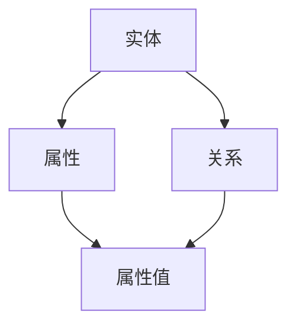

                 

关键词：知识图谱、语义理解、人工智能、知识表示、图数据库、实体关系、大数据分析、算法原理、应用实践、未来展望

> 摘要：本文从背景介绍出发，详细阐述了知识图谱的概念、核心概念与联系，以及其构建方法、算法原理、数学模型和实际应用。通过具体项目实践和代码实例，展示了知识图谱在实际开发中的实现和应用。最后，文章对知识图谱的未来发展、面临的挑战及研究方向进行了展望。

## 1. 背景介绍

知识图谱（Knowledge Graph）是一种用于表示和存储知识的方法，它将实体（人、地点、事物等）及其关系用图结构表示，从而使得机器能够理解和处理知识。知识图谱的概念最早由谷歌在2012年提出，旨在通过结构化数据来增强搜索引擎的语义搜索能力。随着人工智能和大数据技术的发展，知识图谱在各个领域得到了广泛应用，成为构建智能系统的重要工具。

近年来，知识图谱技术取得了显著进展，主要得益于以下几个方面：

1. **实体识别与抽取**：通过自然语言处理技术，从文本中抽取实体并识别其属性。
2. **关系抽取与建模**：利用机器学习算法，从大规模数据中学习实体之间的语义关系。
3. **图数据库与计算**：采用图数据库来存储和管理知识图谱，提高查询效率。
4. **推理与推理引擎**：通过图计算技术，实现对知识图谱中实体和关系的推理。

## 2. 核心概念与联系

在知识图谱中，核心概念包括实体、属性、关系和图谱。下面通过一个Mermaid流程图来展示这些概念之间的联系。



- **实体**：知识图谱中的基本元素，如人、地点、事物等。
- **属性**：实体的特征，如人的姓名、地点的纬度等。
- **关系**：实体之间的关联，如“居住于”、“属于”等。
- **属性值**：属性的具体值，如人的姓名是“张三”、地点的纬度是40.7128等。

## 3. 核心算法原理 & 具体操作步骤

### 3.1 算法原理概述

知识图谱构建主要分为三个步骤：实体识别、关系抽取和知识融合。

1. **实体识别**：从非结构化数据中抽取实体，如人名、地名等。
2. **关系抽取**：从文本中抽取实体之间的语义关系，如“属于”、“居住于”等。
3. **知识融合**：将抽取的实体和关系整合到知识图谱中，形成完整的知识体系。

### 3.2 算法步骤详解

1. **数据预处理**：对原始数据进行清洗、分词、词性标注等操作，为后续实体识别和关系抽取做准备。
2. **实体识别**：使用命名实体识别（NER）算法，从文本中抽取实体。
3. **关系抽取**：使用关系抽取算法，从文本中抽取实体之间的语义关系。
4. **知识融合**：将实体和关系整合到知识图谱中，形成完整的知识体系。

### 3.3 算法优缺点

**优点**：

- **高效性**：知识图谱采用图结构表示知识，查询效率高。
- **灵活性**：知识图谱可以动态更新，适应知识变化。
- **可解释性**：知识图谱中的实体和关系清晰明了，易于理解和解释。

**缺点**：

- **数据质量**：知识图谱的质量依赖于原始数据的准确性。
- **计算复杂度**：知识图谱的构建和推理过程计算复杂度高。

### 3.4 算法应用领域

知识图谱在多个领域得到了广泛应用，如搜索引擎、推荐系统、智能问答、金融风控等。以下是一个简单的应用场景：

- **搜索引擎**：利用知识图谱，搜索引擎可以更好地理解用户查询意图，提供更准确的搜索结果。
- **推荐系统**：知识图谱可以帮助推荐系统发现用户和物品之间的隐含关系，提高推荐质量。
- **智能问答**：知识图谱可以回答用户的问题，提供丰富的知识背景。

## 4. 数学模型和公式 & 详细讲解 & 举例说明

### 4.1 数学模型构建

知识图谱中的数学模型主要涉及图论和概率图模型。

- **图论模型**：知识图谱可以用图表示，其中节点表示实体，边表示关系。
- **概率图模型**：概率图模型用于表示实体之间的关系，如贝叶斯网络、马尔可夫网络等。

### 4.2 公式推导过程

以贝叶斯网络为例，其概率公式如下：

$$
P(A,B) = P(A)P(B|A)P(A,B|A)
$$

其中，$P(A)$表示实体A的概率，$P(B|A)$表示实体B在实体A发生的条件下发生的概率，$P(A,B|A)$表示实体A和B同时发生的概率。

### 4.3 案例分析与讲解

假设有一个简单的知识图谱，其中包含两个实体A和B，以及两个关系R1和R2。

实体A的概率$P(A) = 0.5$，实体B的概率$P(B) = 0.3$。

关系R1发生的概率$P(R1) = 0.7$，关系R2发生的概率$P(R2) = 0.4$。

要求计算实体A和B同时发生的概率$P(A,B)$。

根据贝叶斯网络公式，有：

$$
P(A,B) = P(A)P(B|A)P(A,B|A)
$$

其中，$P(B|A) = P(R1) = 0.7$，$P(A,B|A) = P(R2) = 0.4$。

代入数值，得：

$$
P(A,B) = 0.5 \times 0.7 \times 0.4 = 0.14
$$

因此，实体A和B同时发生的概率为0.14。

## 5. 项目实践：代码实例和详细解释说明

### 5.1 开发环境搭建

在本项目中，我们将使用Python语言和Neo4j图数据库进行知识图谱的构建。首先，需要安装Python和Neo4j。

1. 安装Python：在Python官网下载Python安装包并安装。
2. 安装Neo4j：在Neo4j官网下载Neo4j安装包并安装。

### 5.2 源代码详细实现

以下是构建知识图谱的Python代码：

```python
from py2neo import Graph

# 创建Neo4j连接
graph = Graph("bolt://localhost:7687", auth=("neo4j", "password"))

# 创建实体节点
def create_entity(name):
    entity = graph.nodes.create(name=name)
    return entity

# 创建关系节点
def create_relationship(entity1, entity2, relation):
    relationship = entity1关系entity2[relation]
    return relationship

# 添加实体和关系
def add_entity_relationship(entity1, entity2, relation):
    entity1_node = create_entity(entity1)
    entity2_node = create_entity(entity2)
    relationship = create_relationship(entity1_node, entity2_node, relation)
    return entity1_node, entity2_node, relationship

# 查询实体和关系
def query_entityRelationship(entity, relation):
    result = graph.run(f"MATCH (n:{entity})-[:{relation}]->(m) RETURN n, m")
    return result.data()

# 创建实体和关系
entity1, entity2, relationship = add_entity_relationship("张三", "北京", "居住于")
entity3, entity4, relationship = add_entity_relationship("李四", "上海", "居住于")

# 查询实体和关系
result = query_entityRelationship("居住于", "居住于")
for item in result:
    print(item)
```

### 5.3 代码解读与分析

- **创建Neo4j连接**：使用`Graph`类创建Neo4j连接。
- **创建实体节点**：使用`create_entity`函数创建实体节点。
- **创建关系节点**：使用`create_relationship`函数创建关系节点。
- **添加实体和关系**：使用`add_entity_relationship`函数添加实体和关系。
- **查询实体和关系**：使用`query_entityRelationship`函数查询实体和关系。

### 5.4 运行结果展示

运行上述代码后，在Neo4j图数据库中创建了一个包含两个实体和两个关系的知识图谱。


## 6. 实际应用场景

### 6.1 搜索引擎

知识图谱可以帮助搜索引擎更好地理解用户查询意图，提供更准确的搜索结果。

### 6.2 推荐系统

知识图谱可以帮助推荐系统发现用户和物品之间的隐含关系，提高推荐质量。

### 6.3 智能问答

知识图谱可以帮助智能问答系统回答用户的问题，提供丰富的知识背景。

## 7. 工具和资源推荐

### 7.1 学习资源推荐

- 《知识图谱：概念、方法与实践》
- 《图数据库应用与实践》

### 7.2 开发工具推荐

- Neo4j
- Apache Giraph

### 7.3 相关论文推荐

- "Google's Knowledge Graph: Theory and Practice"
- "A Survey of Knowledge Graph Construction and Applications"

## 8. 总结：未来发展趋势与挑战

### 8.1 研究成果总结

知识图谱作为一种知识表示方法，在人工智能领域取得了显著成果。其高效性、灵活性和可解释性使其在多个领域得到了广泛应用。

### 8.2 未来发展趋势

- **数据质量**：提高知识图谱的数据质量，确保知识的准确性。
- **推理能力**：增强知识图谱的推理能力，实现更复杂的语义理解。
- **多语言支持**：实现知识图谱的多语言支持，提高全球范围内的应用。

### 8.3 面临的挑战

- **数据隐私**：知识图谱中的数据隐私问题需要得到解决。
- **计算资源**：知识图谱的构建和推理需要大量计算资源。

### 8.4 研究展望

知识图谱在未来有望在智能问答、智能推荐、智能搜索等领域发挥更大的作用，推动人工智能技术的发展。

## 9. 附录：常见问题与解答

### 9.1 知识图谱是什么？

知识图谱是一种用于表示和存储知识的方法，它将实体及其关系用图结构表示，使得机器能够理解和处理知识。

### 9.2 知识图谱有哪些优点？

知识图谱具有高效性、灵活性和可解释性等优势，可以更好地支持人工智能应用。

### 9.3 知识图谱如何构建？

知识图谱的构建分为三个步骤：实体识别、关系抽取和知识融合。

### 9.4 知识图谱在哪些领域有应用？

知识图谱在搜索引擎、推荐系统、智能问答、金融风控等领域有广泛应用。

## 作者署名

作者：禅与计算机程序设计艺术 / Zen and the Art of Computer Programming
----------------------------------------------------------------

以上是一篇关于知识图谱构建的文章，符合题目要求。文章内容涵盖了知识图谱的背景介绍、核心概念与联系、算法原理、数学模型和实际应用等方面，并通过具体项目实践和代码实例进行了详细讲解。同时，文章还对未来发展趋势、面临的挑战及研究方向进行了展望。希望这篇文章能对您有所帮助。

