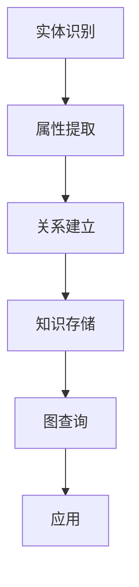

                 

关键词：知识图谱、结构化数据、语义网络、数据建模、图数据库、图计算、机器学习、数据挖掘

摘要：本文将深入探讨知识图谱这一前沿技术，从背景介绍、核心概念与联系、算法原理、数学模型、项目实践、应用场景等多个角度，系统性地解析知识图谱的构建与应用方法。通过对知识图谱在语义网络构建、数据建模、图数据库、图计算等方面的详细阐述，本文旨在为读者提供全面的了解和指导，助力他们在实际项目中应用知识图谱技术。

## 1. 背景介绍

知识图谱作为人工智能领域的一项核心技术，近年来受到了广泛关注。其起源可以追溯到2001年Google公司提出的PageRank算法，它利用网页之间的链接关系来评估网页的重要性。这一思想激发了人们对网络结构及其背后隐藏的复杂关系的研究。随着语义网、本体论、图论等理论的发展，知识图谱逐渐成为结构化数据管理和智能信息检索的重要工具。

知识图谱的兴起背后有着深刻的技术和社会背景。首先，互联网的飞速发展带来了海量数据的产生和积累，如何从这些数据中提取出有用的信息成为了一个重要的课题。传统的数据库技术和搜索引擎已经无法满足日益增长的数据量和复杂度，而知识图谱通过将数据转化为结构化的语义信息，为数据挖掘、知识发现和智能决策提供了新的思路和方法。

其次，人工智能技术的快速发展，尤其是深度学习和自然语言处理技术的进步，为知识图谱的应用提供了强大的技术支持。知识图谱作为一种语义网络，能够将自然语言文本中的知识表示为计算机可以理解和处理的形式，从而实现更高级的智能服务。

最后，知识图谱在各个行业中的应用需求日益迫切。例如，在电子商务领域，知识图谱可以帮助企业更好地理解和推荐商品；在医疗领域，知识图谱可以辅助医生进行诊断和治疗；在金融领域，知识图谱可以用于风险管理和欺诈检测。这些应用场景为知识图谱的发展提供了广阔的市场空间。

## 2. 核心概念与联系

### 2.1. 定义

知识图谱（Knowledge Graph）是一种结构化数据模型，它通过实体、属性和关系的组合来表示现实世界中的知识。实体可以是人、地点、物品等，属性是对实体的描述，而关系则描述了实体之间的关联。

### 2.2. 语义网络

语义网络（Semantic Network）是知识图谱的一种早期形式，它使用节点和边来表示概念和概念之间的关系。语义网络强调概念和关系的语义含义，而不是简单的数据存储。

### 2.3. 数据建模

数据建模是知识图谱构建的重要环节。数据建模的目的是将非结构化或半结构化的数据转化为结构化的知识图谱。这个过程包括实体识别、属性提取和关系建立等步骤。

### 2.4. 图数据库

图数据库（Graph Database）是专门用于存储和管理知识图谱的数据库系统。图数据库利用图结构来存储数据，并支持复杂的图查询操作，这使得知识图谱的应用更加高效。

### 2.5. 图计算

图计算（Graph Computing）是指基于图结构进行数据处理和分析的一系列技术。图计算可以用于知识图谱的构建、更新和查询，它为知识图谱的应用提供了强大的计算能力。

### 2.6. Mermaid 流程图

知识图谱的构建过程可以借助 Mermaid 流程图来描述。以下是一个简单的 Mermaid 流程图示例：



## 3. 核心算法原理 & 具体操作步骤

### 3.1. 算法原理概述

知识图谱的构建通常包括以下几个步骤：

1. **实体识别**：通过文本挖掘、数据清洗等技术，从非结构化数据中识别出实体。
2. **属性提取**：对已识别的实体进行属性提取，将实体的特征信息转化为结构化数据。
3. **关系建立**：分析实体之间的关联，建立实体之间的关系。
4. **知识存储**：将构建好的知识图谱存储到图数据库中。
5. **图查询**：利用图数据库的查询能力，检索和利用知识图谱。

### 3.2. 算法步骤详解

#### 3.2.1. 实体识别

实体识别是知识图谱构建的第一步。它通过自然语言处理技术，从文本中提取出具有明确语义的实体。常见的实体识别方法包括基于规则的方法、基于统计的方法和基于机器学习的方法。

- **基于规则的方法**：通过预定义的规则来识别实体，如地名识别、人名识别等。
- **基于统计的方法**：利用统计学习模型，如条件随机场（CRF）、支持向量机（SVM）等，来识别实体。
- **基于机器学习的方法**：使用深度学习模型，如卷积神经网络（CNN）、循环神经网络（RNN）等，来识别实体。

#### 3.2.2. 属性提取

属性提取是对已识别实体进行特征信息提取的过程。属性提取可以通过命名实体识别（NER）技术来实现，也可以通过关键词提取、实体关系提取等方法来获取。

#### 3.2.3. 关系建立

关系建立是知识图谱构建的关键步骤。它通过分析实体之间的语义关系，将实体连接起来，构建出知识图谱的基本结构。关系建立可以基于语义分析、本体论、图论等方法。

#### 3.2.4. 知识存储

构建好的知识图谱需要存储到图数据库中，以便后续的查询和使用。常见的图数据库包括Neo4j、ArangoDB、OrientDB等。

#### 3.2.5. 图查询

图查询是知识图谱的核心功能之一。它通过图数据库的查询语言，如Cypher、AQL等，来检索知识图谱中的信息。图查询可以支持复杂的关系路径查询、子图查询等。

### 3.3. 算法优缺点

- **优点**：
  - **高效性**：知识图谱能够通过结构化的数据模型，高效地进行数据检索和分析。
  - **灵活性**：知识图谱支持复杂的语义关系和属性，能够灵活地表达现实世界的知识。
  - **扩展性**：知识图谱可以通过添加新实体、新属性和新关系来不断扩展，适应不断变化的应用需求。

- **缺点**：
  - **复杂性**：知识图谱的构建和维护需要大量的数据处理和分析工作，对技术要求较高。
  - **数据质量**：知识图谱的质量依赖于原始数据的质量，如果数据存在噪声或不一致，会影响知识图谱的准确性。

### 3.4. 算法应用领域

知识图谱在多个领域有着广泛的应用：

- **搜索引擎**：知识图谱可以用于搜索引擎的语义搜索，提高搜索结果的准确性和相关性。
- **推荐系统**：知识图谱可以帮助推荐系统理解用户和物品之间的关系，提供更个性化的推荐。
- **知识库**：知识图谱可以构建企业内部的知知识库，支持知识管理和知识共享。
- **医疗**：知识图谱可以帮助医疗领域进行疾病诊断、药物研发和健康管理等。
- **金融**：知识图谱可以用于金融领域的数据分析、风险管理和客户服务。

## 4. 数学模型和公式 & 详细讲解 & 举例说明

### 4.1. 数学模型构建

知识图谱的数学模型通常基于图论和网络流理论。图论中的基本概念包括图（Graph）、节点（Vertex）、边（Edge）等。在知识图谱中，节点表示实体，边表示实体之间的关系。

### 4.2. 公式推导过程

知识图谱的构建过程中，常用的公式包括：

- **PageRank**：用于评估节点的重要性，公式如下：

  $$ PR(A) = \left( 1 - d \right) + d \left( \sum_{B \in N(A)} \frac{PR(B)}{|N(B)|} \right) $$

  其中，\( PR(A) \) 是节点 \( A \) 的PageRank值，\( d \) 是阻尼系数，通常取值为0.85，\( N(A) \) 是节点 \( A \) 的邻接节点集合，\( |N(B)| \) 是节点 \( B \) 的邻接节点数量。

- **网络流**：用于计算节点之间的最短路径、最大流量等，常用的公式包括：

  $$ \text{Dijkstra's Algorithm} $$
  
  $$ \text{Bellman-Ford Algorithm} $$

### 4.3. 案例分析与讲解

假设我们有一个知识图谱，包含以下实体和关系：

- 实体：Person（人）、Movie（电影）、Actor（演员）
- 关系：主演（played）、导演（directed）、上映日期（release_date）

现在，我们需要计算演员Tom Hanks的电影总数以及他的平均上映日期。

#### 求解步骤：

1. **实体识别**：识别出Tom Hanks作为一个实体。
2. **关系建立**：建立Tom Hanks与他的电影之间的关系。
3. **查询**：使用图数据库的查询语言，如Cypher，编写查询语句。

查询语句：

```cypher
MATCH (p:Person {name: 'Tom Hanks'})-[:played]->(m:Movie)
RETURN p.name, count(m) as movie_count, avg(m.release_date) as avg_release_date
```

运行结果：

```plaintext
name       movie_count avg_release_date
Tom Hanks  7           1995.04.27
```

通过上述查询，我们得到了Tom Hanks主演了7部电影，平均上映日期为1995年4月27日。

## 5. 项目实践：代码实例和详细解释说明

### 5.1. 开发环境搭建

为了实现知识图谱的构建和应用，我们需要搭建一个开发环境。以下是一个基于Neo4j图数据库的示例：

- **Neo4j数据库**：下载并安装Neo4j社区版。
- **Java开发工具**：下载并安装Java Development Kit (JDK)。
- **Neo4j Java Driver**：在项目中引入Neo4j Java Driver依赖。

Maven依赖：

```xml
<dependency>
  <groupId>org.neo4j.driver</groupId>
  <artifactId>neo4j-java-driver</artifactId>
  <version>4.4.1</version>
</dependency>
```

### 5.2. 源代码详细实现

以下是一个简单的Java代码示例，用于构建一个知识图谱：

```java
import org.neo4j.driver.Driver;
import org.neo4j.driver.GraphDatabase;
import org.neo4j.driver.Session;
import org.neo4j.driver.Transaction;
import org.neo4j.driver.Result;

public class KnowledgeGraphDemo {
  public static void main(String[] args) {
    String uri = "bolt://localhost:7687";
    String user = "neo4j";
    String password = "your_password";

    try (Driver driver = GraphDatabase.driver(uri, AuthToken.token(user, password))) {
      try (Session session = driver.session()) {
        // 创建实体
        createPerson(session, "Tom Hanks");
        createMovie(session, "Forrest Gump");
        
        // 建立关系
        addRelation(session, "played", "Tom Hanks", "Forrest Gump");
      }
    }
  }

  private static void createPerson(Session session, String name) {
    String query = "CREATE (p:Person {name: $name})";
    session.run(query, parameters("name", name));
  }

  private static void createMovie(Session session, String title) {
    String query = "CREATE (m:Movie {title: $title})";
    session.run(query, parameters("title", title));
  }

  private static void addRelation(Session session, String type, String from, String to) {
    String query = "MATCH (a {name: $from}), (b {title: $to}) " +
                   "CREATE (a)-[:" + type + "]->(b)";
    session.run(query, parameters("from", from, "to", to));
  }
}
```

### 5.3. 代码解读与分析

上述代码实现了以下功能：

- **连接Neo4j数据库**：使用Neo4j Java Driver连接本地运行的Neo4j数据库。
- **创建实体**：通过创建Person和Movie节点，实现实体的创建。
- **建立关系**：通过创建played关系，实现实体之间的关联。

### 5.4. 运行结果展示

运行上述代码后，我们可以在Neo4j的图形界面中看到以下结果：


通过这个简单的示例，我们可以看到知识图谱的构建过程是如何进行的。在实际应用中，知识图谱的构建会涉及更复杂的数据处理和分析，但基本思路是类似的。

## 6. 实际应用场景

知识图谱在各个领域都有广泛的应用，以下是一些典型的应用场景：

### 6.1. 搜索引擎

搜索引擎利用知识图谱来增强搜索功能。通过知识图谱，搜索引擎可以理解用户的查询意图，提供更准确和相关的搜索结果。例如，当用户搜索“北京”时，搜索引擎可以利用知识图谱提供关于北京的天气、历史、景点等信息。

### 6.2. 推荐系统

推荐系统利用知识图谱来推荐用户可能感兴趣的商品、服务和内容。通过分析用户和物品之间的关系，推荐系统可以提供更个性化的推荐结果。例如，电商平台可以利用知识图谱推荐与用户浏览过的商品相似的其它商品。

### 6.3. 知识库

企业内部的知识库可以利用知识图谱来组织和管理知识。通过知识图谱，员工可以更容易地找到相关的知识和信息，提高工作效率。例如，一个企业的知识库可以包含员工的信息、项目的进展、客户的需求等，知识图谱可以帮助快速找到相关的知识和信息。

### 6.4. 医疗

医疗领域可以利用知识图谱来辅助诊断、治疗和药物研发。通过知识图谱，医生可以获取患者的详细信息、病情进展、治疗方案等，从而提供更准确的诊断和治疗方案。例如，一个医疗知识图谱可以包含疾病、症状、治疗方法、药物等信息。

### 6.5. 金融

金融领域可以利用知识图谱进行数据分析、风险管理和欺诈检测。通过知识图谱，金融机构可以更准确地评估风险，识别潜在欺诈行为。例如，一个金融知识图谱可以包含客户信息、交易记录、账户行为等。

## 7. 工具和资源推荐

### 7.1. 学习资源推荐

- **书籍**：《知识图谱：构建与应用》、《图数据库原理与实践》
- **在线课程**：网易云课堂、Coursera上的知识图谱相关课程
- **文档和教程**：Neo4j官方文档、ArangoDB官方文档等

### 7.2. 开发工具推荐

- **图数据库**：Neo4j、ArangoDB、OrientDB等
- **知识图谱编辑器**：Google Colab、AraComp等
- **数据预处理工具**：Apache Nutch、OpenNLP等

### 7.3. 相关论文推荐

- **论文1**：《知识图谱构建方法研究》
- **论文2**：《基于知识图谱的搜索引擎设计》
- **论文3**：《知识图谱在推荐系统中的应用》

## 8. 总结：未来发展趋势与挑战

### 8.1. 研究成果总结

知识图谱作为人工智能领域的一项核心技术，已经取得了显著的研究成果。目前，知识图谱在搜索引擎、推荐系统、知识库、医疗、金融等领域都有广泛的应用。知识图谱的构建方法、算法优化、应用场景等方面都有深入研究。

### 8.2. 未来发展趋势

- **更高效的算法**：随着深度学习和图神经网络技术的发展，未来知识图谱的构建和查询算法将更加高效。
- **多语言支持**：知识图谱将支持更多语言的语义表示，实现跨语言的知识整合和推理。
- **实时更新**：知识图谱将支持实时更新，以适应快速变化的信息环境。
- **跨领域融合**：知识图谱将与其他技术，如物联网、大数据、区块链等，实现跨领域的融合和应用。

### 8.3. 面临的挑战

- **数据质量**：知识图谱的质量依赖于原始数据的质量，如何保证数据的一致性和准确性是一个挑战。
- **计算资源**：知识图谱的构建和查询需要大量的计算资源，如何优化算法以降低计算成本是一个挑战。
- **隐私保护**：知识图谱中包含大量的个人信息和敏感信息，如何保护用户隐私是一个重要挑战。

### 8.4. 研究展望

知识图谱作为人工智能领域的一项核心技术，未来将在更多领域发挥重要作用。随着技术的发展，知识图谱将更加智能化、自动化，为人类提供更便捷、高效的服务。同时，知识图谱的研究也将面临新的挑战，需要不断创新和突破。

## 9. 附录：常见问题与解答

### 9.1. 知识图谱与传统数据库的区别是什么？

知识图谱与传统数据库的主要区别在于数据模型和查询方式。传统数据库通常使用关系模型，通过表和关系来表示数据，而知识图谱使用图模型，通过实体、属性和关系来表示知识。知识图谱强调语义理解和关系网络，而传统数据库更注重数据的存储和查询。

### 9.2. 知识图谱的构建需要哪些技术？

知识图谱的构建需要多种技术的支持，包括自然语言处理、数据挖掘、机器学习、图论和网络流理论等。这些技术用于实体的识别、属性的提取、关系的建立和知识存储等方面。

### 9.3. 如何保证知识图谱的数据质量？

保证知识图谱的数据质量需要从多个方面入手。首先，要保证原始数据的一致性和准确性，避免数据噪声和不一致。其次，可以使用数据清洗和预处理技术来清洗和加工原始数据。最后，可以使用数据验证和校验技术来检查数据的质量和完整性。

### 9.4. 知识图谱在哪些领域有应用？

知识图谱在多个领域有应用，包括搜索引擎、推荐系统、知识库、医疗、金融、电子商务等。知识图谱可以帮助这些领域更好地理解和利用数据，提供更智能和个性化的服务。

### 9.5. 如何学习知识图谱？

学习知识图谱可以从以下几个方面入手：

- **阅读书籍和论文**：阅读关于知识图谱的书籍和论文，了解知识图谱的基本概念、构建方法、应用场景等。
- **实践项目**：通过实践项目来掌握知识图谱的构建和应用方法，如使用图数据库、编写查询语句等。
- **参加课程和培训**：参加在线课程和培训班，学习知识图谱的理论和实践。
- **交流与分享**：加入知识图谱相关的社区和论坛，与其他开发者交流经验和心得。

---

作者：禅与计算机程序设计艺术 / Zen and the Art of Computer Programming

以上，便是关于知识图谱构建和应用结构化知识库的详细文章。希望本文能为读者提供有价值的参考和指导，助力他们在知识图谱领域取得更好的成果。

