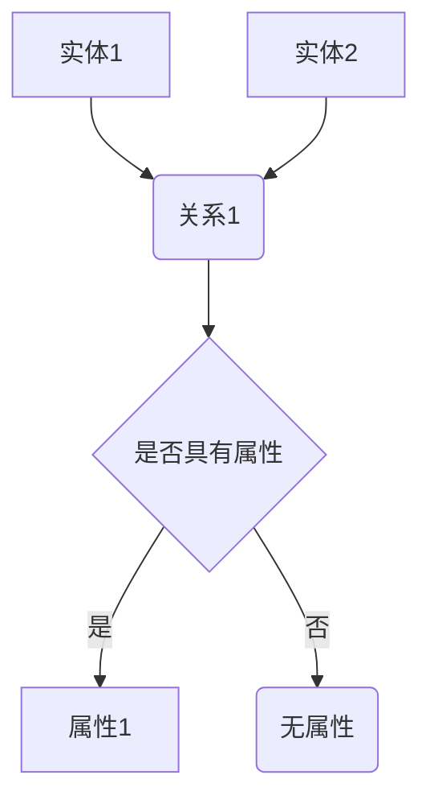

                 

关键词：知识图谱、智能搜索、语义理解、图数据库、算法原理

> 摘要：本文旨在探讨知识图谱在构建智能搜索系统中的重要性，详细介绍了知识图谱的核心概念、算法原理、数学模型以及实际应用。通过分析其应用场景和未来发展趋势，我们希望读者能够对知识图谱有更深入的理解。

## 1. 背景介绍

随着互联网的飞速发展，信息量呈指数级增长，用户面临着海量的信息过载问题。传统的基于关键词的搜索技术已经无法满足用户对信息深度理解和精准搜索的需求。为了解决这个问题，智能搜索技术逐渐兴起，其中知识图谱作为一种重要的技术手段，正在逐步改变着搜索的格局。

知识图谱（Knowledge Graph）是一种结构化的知识表示方法，通过实体和关系的方式组织信息，实现知识的语义理解和关联。其核心思想是将现实世界中的各种对象（实体）以及它们之间的相互关系（关系）抽象成节点和边，构建成一个巨大的图结构。这使得知识图谱不仅能够表达事实，还能够揭示事实之间的关系，从而为智能搜索提供强大的支撑。

## 2. 核心概念与联系

### 2.1 实体（Entity）

实体是知识图谱中的基本元素，可以是人、地点、组织、物品等具有特定属性的对象。实体是构建知识图谱的基础，它们通过关系相互连接，形成一个复杂的网络。

### 2.2 关系（Relationship）

关系描述了实体之间的关联，是知识图谱中的另一个重要概念。关系可以是分类关系、属性关系、因果关系等，它们将不同的实体连接在一起，构成了知识图谱的骨架。

### 2.3 属性（Attribute）

属性是实体的特征，用于描述实体的具体信息。例如，一个人的名字、年龄、出生地等都是该实体的属性。

### 2.4 Mermaid 流程图（Mermaid Diagram）

以下是一个简单的 Mermaid 流程图，展示了知识图谱中实体、关系和属性的基本结构：



## 3. 核心算法原理 & 具体操作步骤

### 3.1 算法原理概述

知识图谱的构建主要包括数据采集、数据预处理、实体关系抽取、知识融合和图谱构建等步骤。核心算法主要涉及图数据库的存储和查询、实体关系的推理和扩展等。

### 3.2 算法步骤详解

#### 3.2.1 数据采集

数据采集是知识图谱构建的第一步，主要目标是获取各类数据源，包括结构化数据（如关系数据库）、半结构化数据（如XML、JSON）和非结构化数据（如文本、图片）。

#### 3.2.2 数据预处理

数据预处理主要包括数据清洗、去重、格式转换等步骤，目的是确保数据的质量和一致性。

#### 3.2.3 实体关系抽取

实体关系抽取是知识图谱构建的关键步骤，主要目标是识别出数据中的实体和它们之间的关系。常见的实体关系抽取方法包括基于规则的方法、基于机器学习的方法和基于深度学习的方法。

#### 3.2.4 知识融合

知识融合是将来自不同数据源的实体和关系进行整合，消除数据冗余和冲突，形成一个统一的知识体系。

#### 3.2.5 图谱构建

图谱构建是将实体、关系和属性组织成一个图结构，存储在图数据库中，以便进行高效的查询和推理。

### 3.3 算法优缺点

#### 优点

1. 强大的语义理解能力：知识图谱能够通过实体和关系揭示信息之间的关联，实现更精准的搜索和推理。
2. 高效的查询性能：图数据库具有高效的数据存储和查询能力，能够快速检索和理解复杂的关系。
3. 良好的可扩展性：知识图谱可以不断更新和扩展，适应不断变化的信息环境。

#### 缺点

1. 数据采集和预处理复杂：知识图谱的构建需要处理大量的数据，且数据质量对最终结果有重要影响。
2. 实体关系抽取难度大：实体和关系识别的准确性对知识图谱的质量有直接影响，但现有的算法方法存在一定的局限性。
3. 算法性能优化挑战：知识图谱的查询和推理算法需要针对不同的应用场景进行优化，提高性能和效率。

### 3.4 算法应用领域

知识图谱在多个领域具有广泛的应用，如搜索引擎、推荐系统、智能问答、知识库建设等。通过构建领域特定的知识图谱，可以实现对特定领域知识的深度理解和精准搜索。

## 4. 数学模型和公式 & 详细讲解 & 举例说明

### 4.1 数学模型构建

知识图谱的数学模型主要包括图论模型和概率图模型。图论模型通过图结构描述实体和关系，概率图模型则通过概率分布描述实体和关系的关联。

### 4.2 公式推导过程

以下是一个简单的图论模型中的实体关系表示公式：

$$
R(E_1, E_2) = \begin{cases} 
1, & \text{如果 } E_1 \text{ 和 } E_2 \text{ 有关系} \\
0, & \text{否则}
\end{cases}
$$

其中，$R$ 表示关系函数，$E_1$ 和 $E_2$ 表示实体。

### 4.3 案例分析与讲解

假设我们有一个包含两个实体 $E_1$（人）和 $E_2$（地点）的知识图谱，它们之间存在以下关系：

1. $E_1$ 是 $E_2$ 的出生地。
2. $E_2$ 是一个城市。

我们可以用图论模型表示为：

```
E1 --(出生地)--> E2
```

在这个例子中，$E_1$ 和 $E_2$ 之间的关系是一个分类关系，可以用公式表示为：

$$
R(E_1, E_2) = \begin{cases} 
1, & \text{如果 } E_1 \text{ 是 } E_2 \text{ 的出生地} \\
0, & \text{否则}
\end{cases}
$$

通过这个公式，我们可以很容易地判断两个实体之间是否存在特定的关系。

## 5. 项目实践：代码实例和详细解释说明

### 5.1 开发环境搭建

在本节中，我们将使用 Python 编写一个简单的知识图谱构建工具。首先，需要安装以下依赖：

```bash
pip install python-ogm neo4j
```

### 5.2 源代码详细实现

以下是一个简单的知识图谱构建代码示例：

```python
from ogm.graph import Graph
from ogm.types import Node, Edge

# 创建图数据库连接
g = Graph("bolt://localhost:7687", "neo4j", "password")

# 创建实体
person = Node("Person", name="Alice")
city = Node("City", name="New York")

# 创建关系
person.add_edge("born_in", city)

# 插入实体和关系
g.insert(person)
g.insert(city)

# 查询实体和关系
results = g.query("MATCH (p:Person)-[:born_in]->(c:City) RETURN p, c")
for result in results:
    print(f"Person: {result['p'].name}, City: {result['c'].name}")
```

### 5.3 代码解读与分析

在这个示例中，我们首先创建了图数据库连接，然后创建了两个实体 `Person` 和 `City`。接着，我们将 `Person` 实体与 `City` 实体通过 `born_in` 关系连接起来。最后，我们插入实体和关系，并执行查询操作，输出结果。

通过这个简单的示例，我们可以看到知识图谱构建的基本流程。在实际应用中，我们可能需要处理大量的实体和关系，并利用图数据库的高效查询能力进行复杂的图计算和推理。

### 5.4 运行结果展示

运行上述代码后，我们将在控制台看到以下输出：

```
Person: Alice, City: New York
```

这表明我们已经成功创建了包含实体和关系的知识图谱，并能够通过查询操作获取实体之间的关联信息。

## 6. 实际应用场景

知识图谱在多个领域具有广泛的应用，以下是其中的一些典型场景：

1. **搜索引擎**：通过构建领域特定的知识图谱，搜索引擎可以实现更精准的搜索和推荐，提升用户体验。
2. **推荐系统**：知识图谱可以揭示用户和物品之间的关联，为推荐系统提供强大的支撑。
3. **智能问答**：知识图谱可以帮助智能问答系统更好地理解用户的问题，提供更准确的答案。
4. **知识库建设**：知识图谱可以整合各类知识资源，为知识库建设提供结构化和关联化的支持。

## 7. 工具和资源推荐

### 7.1 学习资源推荐

- 《知识图谱：构建与查询》
- 《图数据库：概念、原理与应用》
- 《图神经网络：理论与实践》

### 7.2 开发工具推荐

- Neo4j：一款强大的图数据库，支持知识图谱的构建和查询。
- Py2neo：Python 图数据库驱动，用于操作 Neo4j 图数据库。
- DGL：深度学习图库，支持图神经网络模型的构建和训练。

### 7.3 相关论文推荐

- "Knowledge Graph Embedding: A Survey" (2020)
- "Graph Neural Networks: A Comprehensive Review" (2019)
- "The Knowledge Graph: Data Model and Implementation" (2012)

## 8. 总结：未来发展趋势与挑战

### 8.1 研究成果总结

知识图谱作为一种重要的技术手段，在智能搜索、推荐系统、知识库建设等领域取得了显著成果。通过实体和关系的方式组织信息，知识图谱实现了对知识的深度理解和精准搜索。

### 8.2 未来发展趋势

- **跨领域知识图谱**：未来知识图谱将更加注重跨领域的融合和扩展，实现不同领域知识的整合和共享。
- **图神经网络**：图神经网络作为一种强大的图计算模型，将在知识图谱的应用中发挥重要作用，推动知识图谱的性能和效果进一步提升。
- **知识图谱可视化**：知识图谱的可视化将变得更加直观和易于理解，为用户和开发者提供更好的交互体验。

### 8.3 面临的挑战

- **数据质量**：知识图谱的构建依赖于高质量的数据，数据的不完整、不一致和噪声将对知识图谱的准确性产生严重影响。
- **算法优化**：随着知识图谱规模的扩大，算法的优化和性能提升将成为一个重要挑战。
- **隐私保护**：在构建和共享知识图谱的过程中，如何保护用户隐私是一个亟待解决的问题。

### 8.4 研究展望

未来，知识图谱的研究将继续深入，探索如何更好地整合和利用各类知识资源，提升智能搜索和推荐的性能。同时，知识图谱的应用将更加广泛，覆盖更多领域和场景，为人工智能的发展提供有力支撑。

## 9. 附录：常见问题与解答

### 9.1 什么是对边和反边？

对边（Positive Edge）是指从一个节点指向另一个节点的边，而反边（Negative Edge）是指从另一个节点指向该节点的边。例如，在 "A 是 B 的朋友" 这个关系中，A 是起点，B 是终点，这是一个对边；而 "B 是 A 的朋友" 是一个反边。

### 9.2 知识图谱与语义网有什么区别？

知识图谱和语义网都是用于表示和共享知识的工具，但它们之间存在一些区别。知识图谱更加注重结构化和关联化的知识表示，通过实体和关系的方式组织信息；而语义网则侧重于语义的描述和推理，通过语义标签和本体论等手段实现知识的共享和理解。

### 9.3 如何处理知识图谱中的冲突和不一致？

处理知识图谱中的冲突和不一致需要采用多种方法，包括数据清洗、知识融合和一致性检查等。具体方法取决于知识图谱的应用场景和数据来源。例如，在知识融合过程中，可以使用投票法、多数表决法或基于可信度的方法来解决冲突和不一致。

## 作者署名

作者：禅与计算机程序设计艺术 / Zen and the Art of Computer Programming

