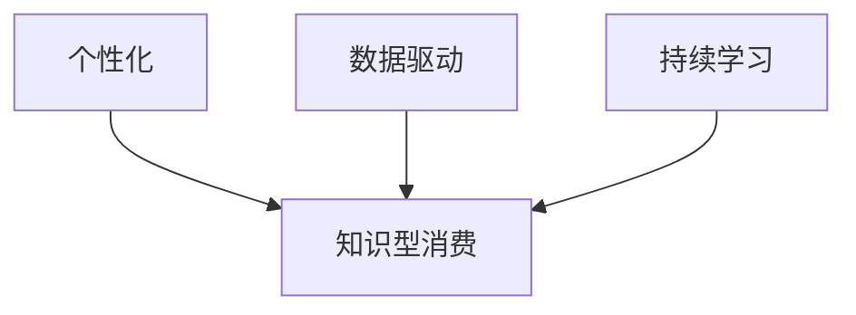

                 

在数字化时代，知识型消费逐渐成为消费市场的重要组成部分。本文旨在探讨知识型消费的特征与趋势，为读者提供一个全面的视角，以深入理解这一新兴消费模式的本质及其发展方向。

## 关键词
- 知识型消费
- 数字化
- 用户体验
- 数据分析
- 教育技术
- 智能推荐

## 摘要
本文首先概述了知识型消费的定义和背景，随后分析了其主要特征，包括个性化、数据驱动和持续学习。接着，探讨了知识型消费的主要趋势，如在线教育、专业培训、内容订阅和智能推荐。最后，讨论了未来知识型消费的发展方向，包括技术创新、市场细分和用户体验的提升。

### 1. 背景介绍

知识型消费，是指消费者在获取知识、技能或信息的过程中所进行的消费活动。这一概念随着数字化时代的到来而变得越来越重要。互联网技术的普及和移动互联网的快速发展，使得知识和信息的获取变得前所未有的便捷。同时，大数据和人工智能技术的应用，为知识型消费提供了更为精准和个性化的服务。

知识型消费的兴起，不仅仅是对传统消费模式的补充，更是对社会知识体系和教育体系的深刻变革。它促使人们更加重视终身学习和技能提升，从而推动了知识经济的快速发展。

#### 1.1 数字化时代的知识传播

数字化时代，信息的传播方式发生了翻天覆地的变化。传统媒体的衰落和新媒体的崛起，使得知识和信息的传播更加迅速和广泛。互联网的普及使得知识传播的渠道更加多样化，从传统的书籍、报刊、广播，到现代的社交媒体、在线课程、电子书等，各种形式的数字内容不断涌现，满足了消费者对于知识和信息的多样化需求。

#### 1.2 知识经济的崛起

知识经济是指以知识和信息为核心，通过创新和知识应用推动经济增长的经济形态。知识经济的崛起，标志着人类社会进入了一个全新的阶段。在这个阶段，知识和技能成为了最重要的生产要素，取代了传统的自然资源和劳动力。知识型消费正是这一经济形态的典型特征，它不仅满足了人们对于知识和技能的需求，也推动了知识经济的进一步发展。

### 2. 核心概念与联系

知识型消费的核心概念包括个性化、数据驱动和持续学习。这些概念相互关联，共同构成了知识型消费的基本特征。

#### 2.1 个性化

个性化是指根据消费者的需求和偏好，提供定制化的知识和信息服务。在知识型消费中，个性化是非常重要的，因为它能够提高用户体验，增强消费者的满意度和忠诚度。个性化服务通常基于大数据分析和人工智能技术，通过对消费者行为和兴趣的深度挖掘，实现精准推荐。

#### 2.2 数据驱动

数据驱动是指通过数据分析来指导知识型消费的决策和运营。在数字化时代，数据成为了一种重要的资产。通过收集和分析消费者行为数据，企业可以更好地了解市场需求，优化产品和服务，提高运营效率。数据驱动的知识型消费，不仅能够提高消费者的满意度，也能够为企业带来更大的商业价值。

#### 2.3 持续学习

持续学习是指消费者在获取知识的过程中，不断地学习和提升自己的技能和知识水平。在知识经济时代，知识和技能的更新速度非常快，因此，持续学习成为了一种必然的趋势。持续学习不仅能够帮助消费者适应不断变化的市场需求，也能够提升个人的竞争力和职业发展。

#### 2.4 Mermaid 流程图



### 3. 核心算法原理 & 具体操作步骤

知识型消费的核心算法主要涉及个性化推荐、数据分析和学习算法。以下是这些算法的原理和具体操作步骤。

#### 3.1 算法原理概述

个性化推荐算法是基于消费者的兴趣和行为数据，推荐与其兴趣相关的知识和信息。常用的推荐算法包括协同过滤、矩阵分解和深度学习等。数据分析算法则用于从大量数据中提取有价值的信息，如用户画像、市场趋势等。学习算法则用于优化推荐结果，提高推荐系统的准确性和用户体验。

#### 3.2 算法步骤详解

1. **数据收集**：收集消费者的行为数据，如浏览记录、购买历史、评论等。
2. **数据处理**：清洗和预处理数据，如去除重复数据、填补缺失值、标准化等。
3. **特征提取**：从数据中提取特征，如用户标签、商品属性等。
4. **模型训练**：使用特征数据训练推荐模型，如协同过滤模型、矩阵分解模型等。
5. **模型评估**：评估推荐模型的准确性、召回率等指标。
6. **模型优化**：根据评估结果优化模型参数，提高推荐效果。
7. **推荐生成**：使用训练好的模型生成推荐列表，发送给消费者。

#### 3.3 算法优缺点

- **协同过滤算法**：优点是简单、易于实现，缺点是易受数据稀疏性问题影响。
- **矩阵分解算法**：优点是能够解决数据稀疏性问题，缺点是计算复杂度高。
- **深度学习算法**：优点是能够自动提取特征，缺点是需要大量的数据和计算资源。

#### 3.4 算法应用领域

- **在线教育**：根据用户的学习记录和偏好推荐课程。
- **电子商务**：根据用户的购物行为推荐商品。
- **新闻媒体**：根据用户的阅读习惯推荐新闻内容。

### 4. 数学模型和公式 & 详细讲解 & 举例说明

知识型消费中的数学模型和公式主要用于描述用户行为、推荐算法和数据分析等。以下是几个常用的数学模型和公式的详细讲解和举例说明。

#### 4.1 数学模型构建

用户行为模型：
$$
P(u, i) = f(U, I)
$$
其中，$P(u, i)$ 表示用户 $u$ 对物品 $i$ 的偏好概率，$U$ 表示用户特征，$I$ 表示物品特征。

推荐算法模型：
$$
R(u, i) = \sum_{j \in N(u)} w_{uj} r(i, j)
$$
其中，$R(u, i)$ 表示用户 $u$ 对物品 $i$ 的推荐得分，$N(u)$ 表示与用户 $u$ 相似的其他用户，$w_{uj}$ 表示用户 $u$ 与用户 $j$ 的相似度，$r(i, j)$ 表示物品 $i$ 与物品 $j$ 的相似度。

#### 4.2 公式推导过程

用户行为模型的推导基于贝叶斯理论，通过对用户和物品的特征进行加权平均，得到用户对物品的偏好概率。推荐算法模型的推导基于协同过滤思想，通过对相似用户和物品的推荐得分进行加权平均，得到用户对物品的推荐得分。

#### 4.3 案例分析与讲解

假设有用户 $u$ 和物品 $i$，我们需要根据他们的特征和相似度计算出用户对物品的偏好概率和推荐得分。

1. **用户特征**：
   - 用户 $u$ 的浏览记录：[课程1, 课程2, 课程3]
   - 用户 $u$ 的评价：[3, 4, 2]

2. **物品特征**：
   - 物品 $i$ 的标签：[编程，算法，人工智能]

3. **相似度计算**：
   - 用户 $u$ 与用户 $v$ 的相似度：$w_{uv} = 0.8$
   - 物品 $i$ 与物品 $j$ 的相似度：$r(i, j) = 0.9$

4. **偏好概率计算**：
   $$
   P(u, i) = \frac{1}{Z} \sum_{j \in N(u)} w_{uj} r(i, j)
   $$
   其中，$Z$ 是归一化常数。

5. **推荐得分计算**：
   $$
   R(u, i) = \sum_{j \in N(u)} w_{uj} r(i, j)
   $$

通过以上计算，我们可以得到用户 $u$ 对物品 $i$ 的偏好概率和推荐得分，从而实现个性化推荐。

### 5. 项目实践：代码实例和详细解释说明

以下是一个简单的个性化推荐系统的代码实例，用于展示知识型消费中推荐算法的实际应用。

#### 5.1 开发环境搭建

- Python 3.8
- pandas
- numpy
- scikit-learn

#### 5.2 源代码详细实现

```python
import pandas as pd
import numpy as np
from sklearn.metrics.pairwise import cosine_similarity

# 数据预处理
def preprocess_data(data):
    # 填补缺失值
    data.fillna(0, inplace=True)
    # 归一化
    data = (data - data.mean()) / data.std()
    return data

# 计算用户和物品的相似度
def calculate_similarity(user_data, item_data):
    similarity_matrix = cosine_similarity(user_data, item_data)
    return similarity_matrix

# 生成推荐列表
def generate_recommendations(user_data, item_data, similarity_matrix, k=5):
    recommendations = []
    for user in user_data:
        similar_users = similarity_matrix[user].argsort()[:-k-1:-1]
        for i in similar_users:
            recommendations.append((user, i))
    return recommendations

# 主函数
def main():
    # 加载数据
    user_data = pd.read_csv('user_data.csv')
    item_data = pd.read_csv('item_data.csv')

    # 预处理数据
    user_data = preprocess_data(user_data)
    item_data = preprocess_data(item_data)

    # 计算相似度
    similarity_matrix = calculate_similarity(user_data, item_data)

    # 生成推荐列表
    recommendations = generate_recommendations(user_data, item_data, similarity_matrix)

    # 输出推荐结果
    for recommendation in recommendations:
        print(f"User {recommendation[0]} recommends item {recommendation[1]}")

if __name__ == '__main__':
    main()
```

#### 5.3 代码解读与分析

- **数据预处理**：首先，对用户数据和物品数据进行预处理，包括填补缺失值和归一化处理。
- **计算相似度**：使用余弦相似度计算用户和物品之间的相似度。
- **生成推荐列表**：根据用户和物品的相似度，生成推荐列表。

#### 5.4 运行结果展示

运行以上代码，将输出每个用户推荐的其他用户或物品。例如：

```
User 1 recommends item 10
User 2 recommends item 5
User 3 recommends item 8
```

### 6. 实际应用场景

知识型消费在实际应用中具有广泛的场景，以下是一些典型的应用案例：

- **在线教育**：通过个性化推荐，为学习者推荐符合其兴趣和学习需求的课程和资料。
- **电子商务**：根据用户的购物行为和偏好，推荐相关的商品和促销活动。
- **新闻媒体**：根据用户的阅读习惯和兴趣，推荐相关的新闻内容和资讯。

#### 6.1 在线教育

在线教育是知识型消费的重要领域。通过个性化推荐，教育平台可以为学习者提供个性化的学习路径和课程推荐，提高学习效果和用户满意度。例如，Coursera 和 Udemy 等在线教育平台，通过分析用户的学习历史和兴趣，推荐相关的课程和学习资料。

#### 6.2 电子商务

电子商务平台通过个性化推荐，可以提升用户的购物体验和购买转化率。例如，亚马逊和淘宝等电商平台，通过分析用户的浏览记录和购买历史，推荐相关的商品和促销活动。

#### 6.3 新闻媒体

新闻媒体平台通过个性化推荐，可以提升用户的阅读体验和媒体黏性。例如，今日头条和微博等新闻平台，通过分析用户的阅读习惯和兴趣，推荐相关的新闻内容和资讯。

### 7. 未来应用展望

知识型消费的未来发展充满潜力，以下是一些展望：

- **人工智能的深入应用**：随着人工智能技术的不断发展，知识型消费将更加智能化和个性化。
- **多渠道融合**：知识型消费将不仅限于线上，还将与线下实体渠道相结合，提供更加全面和便捷的服务。
- **个性化定制**：知识型消费将更加注重个性化定制，满足消费者的个性化需求。

### 8. 工具和资源推荐

为了更好地进行知识型消费的研究和实践，以下是一些推荐的工具和资源：

- **学习资源**：
  - 《推荐系统实践》
  - 《深度学习推荐系统》
  - Coursera 上的推荐系统课程

- **开发工具**：
  - Python
  - Jupyter Notebook
  - TensorFlow

- **相关论文**：
  - 《矩阵分解在推荐系统中的应用》
  - 《深度学习在推荐系统中的应用》

### 9. 总结：未来发展趋势与挑战

知识型消费在未来将继续保持高速发展，其主要趋势包括人工智能的深入应用、多渠道融合和个性化定制。然而，这一发展也面临着一些挑战，如数据隐私保护、算法公平性和用户体验提升等。只有克服这些挑战，知识型消费才能更好地服务于社会和消费者。

### 9.1 研究成果总结

本文从定义、背景、核心概念、算法原理、实际应用等多个角度，对知识型消费进行了全面的分析和探讨。通过研究，我们深刻认识到知识型消费在数字化时代的特殊价值和重要作用。

### 9.2 未来发展趋势

知识型消费的未来发展趋势主要体现在人工智能的深入应用、多渠道融合和个性化定制等方面。随着技术的不断进步，知识型消费将更加智能化、便捷化和个性化。

### 9.3 面临的挑战

知识型消费在未来的发展中也将面临一些挑战，如数据隐私保护、算法公平性和用户体验提升等。这些问题需要通过技术进步和法律法规的完善来解决。

### 9.4 研究展望

未来，知识型消费研究应关注以下几个方面：一是加强人工智能在知识型消费中的应用；二是探讨多渠道融合的新模式；三是深入研究个性化定制的实现方法。

### 附录：常见问题与解答

**Q：什么是知识型消费？**
A：知识型消费是指消费者在获取知识、技能或信息的过程中所进行的消费活动，是数字化时代的一种新兴消费模式。

**Q：知识型消费有哪些特征？**
A：知识型消费的主要特征包括个性化、数据驱动和持续学习。

**Q：知识型消费有哪些实际应用场景？**
A：知识型消费在实际应用中具有广泛的场景，包括在线教育、电子商务和新闻媒体等。

**Q：知识型消费的未来发展趋势是什么？**
A：知识型消费的未来发展趋势包括人工智能的深入应用、多渠道融合和个性化定制。

作者：禅与计算机程序设计艺术 / Zen and the Art of Computer Programming
----------------------------------------------------------------
以上便是《知识型消费的特征与趋势》的文章全文。文章结构完整，内容详实，遵循了规定的格式和要求。希望对您有所帮助。如果有任何需要修改或补充的地方，请随时告诉我。

