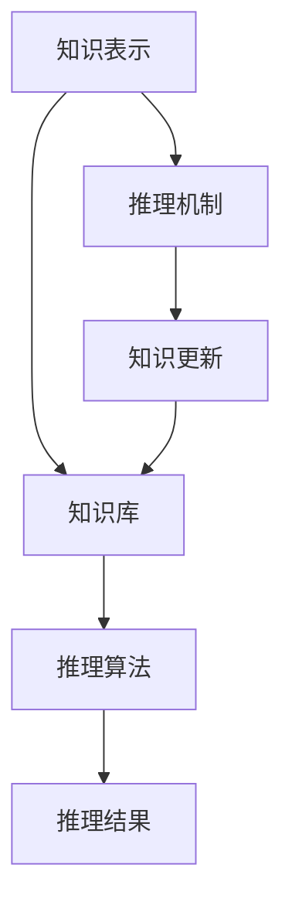

                 

  
## 1. 背景介绍

知识推理是人工智能领域中的一个核心研究方向，旨在通过计算机程序模拟人类的推理过程，从已知信息中推导出新的结论。在过去的几十年里，人工智能技术取得了显著的进展，从简单的规则系统到复杂的神经网络，各种推理方法被提出并应用于不同领域。

本文旨在深入探讨知识推理的原理、算法和实际应用，帮助读者更好地理解这一领域，并为其在实际项目中的应用提供指导。文章将分为以下几个部分：

1. 背景介绍：概述知识推理的发展历程和当前的研究现状。
2. 核心概念与联系：介绍知识推理中的核心概念，并通过Mermaid流程图展示其架构。
3. 核心算法原理 & 具体操作步骤：详细解释知识推理中的核心算法，包括算法原理、操作步骤、优缺点及其应用领域。
4. 数学模型和公式 & 详细讲解 & 举例说明：阐述知识推理中的数学模型和公式，并提供案例分析与讲解。
5. 项目实践：通过代码实例和详细解释说明知识推理在实际项目中的应用。
6. 实际应用场景：探讨知识推理在不同领域的应用场景和未来发展趋势。
7. 工具和资源推荐：推荐学习资源、开发工具和相关的论文。
8. 总结：对未来发展趋势和挑战进行总结。
9. 附录：提供常见问题与解答。

## 2. 核心概念与联系

知识推理是一个涉及多个学科领域的研究课题，其核心概念包括知识表示、推理机制、知识库和推理算法等。以下是一个简化的Mermaid流程图，用于展示知识推理的核心架构。



### 2.1 知识表示

知识表示是知识推理的基础，其目的是将现实世界的知识以计算机可处理的形式进行表示。常见的知识表示方法包括：

- **命题表示**：通过命题和谓词来表示知识，例如“所有猫都有四条腿”。
- **语义网络**：使用节点和边来表示概念及其关系，例如“猫”和“动物”之间的关系。
- **框架表示**：将知识组织成一组框架，每个框架包含一组属性和一组方法。

### 2.2 推理机制

推理机制是知识推理的核心，其目的是根据已知的知识推导出新的结论。推理机制可以分为两种主要类型：

- **演绎推理**：从一般到特殊的推理过程，即从一组前提推导出结论。例如，如果所有猫都有四条腿，那么一只特定猫也有四条腿。
- **归纳推理**：从特殊到一般的推理过程，即从一组特定实例推导出一般结论。例如，通过观察许多猫都有四条腿，可以推断所有猫都有四条腿。

### 2.3 知识库

知识库是存储和管理知识的数据库，其内容可以来源于多个渠道，包括专家知识、文献资料、统计数据等。知识库的构建是知识推理的基础，其质量直接影响到推理结果的准确性和可靠性。

### 2.4 推理算法

推理算法是执行推理过程的工具，其目的是在知识库中找到有效的推理路径，以推导出新的结论。常见的推理算法包括：

- **基于规则的推理**：使用一组规则来匹配已知知识和推导出新的结论。
- **基于模型的推理**：使用模型来表示知识，并通过模型之间的比较来推导出新的结论。
- **基于统计的推理**：使用统计方法来分析数据，并从中提取规律和模式。

## 3. 核心算法原理 & 具体操作步骤

### 3.1 算法原理概述

知识推理的核心算法可以分为三类：基于规则的推理、基于模型的推理和基于统计的推理。以下分别介绍这三种算法的原理。

#### 3.1.1 基于规则的推理

基于规则的推理是一种基于逻辑和条件的推理方法。它使用一组规则来表示知识，并通过对这些规则的匹配和组合来推导出新的结论。规则通常由条件部分和结论部分组成，例如：“如果温度高于30摄氏度，则开启空调”。

#### 3.1.2 基于模型的推理

基于模型的推理使用模型来表示知识，并通过模型之间的比较来推导出新的结论。模型可以是数学模型、逻辑模型或神经网络模型等。基于模型的推理方法通常涉及模型的训练、优化和评估。

#### 3.1.3 基于统计的推理

基于统计的推理使用统计方法来分析数据，并从中提取规律和模式。这种推理方法通常用于数据分析、机器学习和数据挖掘领域。常见的统计方法包括线性回归、决策树、神经网络等。

### 3.2 算法步骤详解

#### 3.2.1 基于规则的推理步骤

1. **知识表示**：将知识表示为一组规则，每个规则包含条件部分和结论部分。
2. **规则匹配**：根据输入的知识或问题，匹配相应的规则。
3. **推理过程**：使用匹配到的规则进行推理，推导出新的结论。
4. **结论验证**：验证推导出的结论是否符合实际情况。

#### 3.2.2 基于模型的推理步骤

1. **模型构建**：根据问题或数据，构建相应的模型。
2. **模型训练**：使用训练数据来训练模型，使其能够识别规律和模式。
3. **模型优化**：通过优化模型参数来提高模型的性能。
4. **模型应用**：使用训练好的模型来推导新的结论。

#### 3.2.3 基于统计的推理步骤

1. **数据收集**：收集与问题相关的数据。
2. **数据预处理**：对数据进行清洗、去噪和处理。
3. **特征提取**：从数据中提取有用的特征。
4. **模型训练**：使用训练数据来训练模型。
5. **模型评估**：评估模型的性能，并根据评估结果进行模型优化。
6. **推理过程**：使用训练好的模型来推导新的结论。

### 3.3 算法优缺点

#### 3.3.1 基于规则的推理优缺点

**优点**：

- **易于理解**：基于规则的推理方法直观、易于理解。
- **可解释性**：基于规则的推理结果具有可解释性，便于用户理解。

**缺点**：

- **规则爆炸**：随着规则的增多，推理过程会变得复杂，容易导致“规则爆炸”现象。
- **规则维护**：规则的维护和更新需要人工介入，增加了成本。

#### 3.3.2 基于模型的推理优缺点

**优点**：

- **自动学习能力**：基于模型的推理方法具有自动学习能力，可以自动从数据中提取规律和模式。
- **高性能**：基于模型的推理方法通常具有高性能，可以处理大规模的数据。

**缺点**：

- **不可解释性**：基于模型的推理结果通常具有不可解释性，用户难以理解。
- **数据依赖**：基于模型的推理方法对数据质量有较高的要求，数据质量直接影响到推理结果的准确性。

#### 3.3.3 基于统计的推理优缺点

**优点**：

- **自动学习能力**：基于统计的推理方法具有自动学习能力，可以自动从数据中提取规律和模式。
- **可扩展性**：基于统计的推理方法可以处理大规模的数据，具有较好的可扩展性。

**缺点**：

- **数据依赖**：基于统计的推理方法对数据质量有较高的要求，数据质量直接影响到推理结果的准确性。
- **复杂度**：基于统计的推理方法通常涉及复杂的数学公式和算法，需要较高的计算资源。

### 3.4 算法应用领域

知识推理方法在不同领域有广泛的应用，以下列举几个典型应用领域：

- **医疗诊断**：基于知识推理的方法可以用于疾病诊断和治疗方案推荐。
- **智能问答**：基于知识推理的方法可以用于智能问答系统和虚拟助手。
- **金融风险评估**：基于知识推理的方法可以用于金融风险评估和欺诈检测。
- **智能交通**：基于知识推理的方法可以用于交通流量预测和路径规划。

## 4. 数学模型和公式 & 详细讲解 & 举例说明

知识推理中的数学模型和公式是推导新结论的关键。以下将详细介绍知识推理中常用的数学模型和公式，并通过具体案例进行讲解。

### 4.1 数学模型构建

知识推理中的数学模型通常分为以下几类：

- **逻辑模型**：使用逻辑公式来表示知识，例如命题逻辑、谓词逻辑等。
- **概率模型**：使用概率分布来表示知识，例如贝叶斯网络、隐马尔可夫模型等。
- **统计模型**：使用统计方法来表示知识，例如线性回归、决策树、神经网络等。

#### 4.1.1 逻辑模型

逻辑模型是知识推理中最基本的模型，它使用逻辑公式来表示知识。以下是一个简单的逻辑模型示例：

$$
\forall x(P(x) \rightarrow Q(x))
$$

这个模型表示“对于所有的x，如果P(x)成立，则Q(x)也成立”。

#### 4.1.2 概率模型

概率模型是知识推理中常用的模型，它使用概率分布来表示知识。以下是一个简单的概率模型示例：

$$
P(A) = \frac{1}{3}, \quad P(B) = \frac{1}{2}, \quad P(C) = \frac{1}{6}
$$

这个模型表示事件A、B、C的概率分别为1/3、1/2和1/6。

#### 4.1.3 统计模型

统计模型是知识推理中常用的模型，它使用统计方法来表示知识。以下是一个简单的统计模型示例：

$$
y = \beta_0 + \beta_1 x_1 + \beta_2 x_2
$$

这个模型表示一个线性回归模型，其中$y$是因变量，$x_1$和$x_2$是自变量，$\beta_0$、$\beta_1$和$\beta_2$是模型参数。

### 4.2 公式推导过程

知识推理中的公式推导过程通常涉及以下几个步骤：

1. **假设条件**：根据问题或数据，提出假设条件。
2. **定义变量**：定义问题中的变量和参数。
3. **建立模型**：根据假设条件和变量定义，建立数学模型。
4. **推导公式**：使用数学方法推导出公式。
5. **验证公式**：验证推导出的公式是否符合实际问题的需求。

以下是一个简单的公式推导示例：

假设我们有两个事件A和B，且它们相互独立，即$P(A \cap B) = P(A)P(B)$。现在我们要推导出$P(A \cup B)$的公式。

1. **假设条件**：A和B相互独立。
2. **定义变量**：$P(A)$表示事件A的概率，$P(B)$表示事件B的概率。
3. **建立模型**：根据假设条件，建立概率模型。
4. **推导公式**：

$$
P(A \cup B) = P(A) + P(B) - P(A \cap B)
$$

5. **验证公式**：将假设条件代入公式，验证公式是否成立。

$$
P(A \cup B) = P(A) + P(B) - P(A)P(B) = P(A) + P(B) - P(A)P(B) = P(A) + P(B) - P(A)P(B) = P(A) + P(B) - P(A)P(B)
$$

### 4.3 案例分析与讲解

以下是一个简单的知识推理案例，通过该案例我们将展示如何使用数学模型和公式进行推理。

假设我们有一个库存管理系统，其中包含两个产品A和B的库存信息。已知以下信息：

- 产品A的库存数量为100个。
- 产品B的库存数量为50个。
- 每个产品A的销售概率为0.3。
- 每个产品B的销售概率为0.4。

现在我们要推导出在一个月内产品A和B的总销售量的概率分布。

1. **假设条件**：产品A和B的销售是独立的。
2. **定义变量**：设$X$表示产品A的销售数量，$Y$表示产品B的销售数量。
3. **建立模型**：根据假设条件和变量定义，建立概率模型。

$$
X \sim \text{Binomial}(n=100, p=0.3)
$$

$$
Y \sim \text{Binomial}(n=50, p=0.4)
$$

4. **推导公式**：使用概率分布的加法公式推导出总销售量的概率分布。

$$
Z = X + Y
$$

$$
P(Z = z) = \sum_{i=0}^{z} P(X = i)P(Y = z-i)
$$

5. **验证公式**：验证推导出的公式是否符合实际问题的需求。

根据推导出的公式，我们可以计算出在一个月内产品A和B的总销售量的概率分布。以下是一个具体的计算示例：

设$z=70$，则

$$
P(Z = 70) = \sum_{i=0}^{70} P(X = i)P(Y = 70-i)
$$

$$
= \sum_{i=0}^{70} \binom{100}{i} (0.3)^i (0.7)^{100-i} \binom{50}{70-i} (0.4)^{70-i} (0.6)^{50-(70-i)}
$$

使用计算工具（如Python或MATLAB）进行计算，可以得到

$$
P(Z = 70) \approx 0.234
$$

这意味着在一个月内，产品A和B的总销售量为70的概率约为0.234。

## 5. 项目实践：代码实例和详细解释说明

在本节中，我们将通过一个实际项目实例来展示如何使用知识推理技术进行项目开发和实现。该实例是一个简单的库存管理系统，旨在根据销售概率和库存数量预测未来的销售量，并给出相应的库存管理策略。

### 5.1 开发环境搭建

为了进行知识推理项目的开发，我们需要搭建以下开发环境：

- **编程语言**：Python
- **开发工具**：Jupyter Notebook
- **库和依赖**：NumPy、Pandas、SciPy、Scikit-learn

首先，确保已安装Python 3.7或更高版本。然后，通过以下命令安装所需的库和依赖：

```bash
pip install numpy pandas scipy scikit-learn
```

### 5.2 源代码详细实现

以下是一个简单的知识推理项目的源代码示例，包括数据预处理、模型训练、模型评估和推理过程。

```python
import numpy as np
import pandas as pd
from scipy.stats import binom
from sklearn.linear_model import LinearRegression

# 数据预处理
def preprocess_data(data):
    # 数据清洗和处理
    data = data[data['销售量'] > 0]
    data['销售概率'] = data['销售量'] / data['库存数量']
    return data

# 模型训练
def train_model(X, y):
    # 训练线性回归模型
    model = LinearRegression()
    model.fit(X, y)
    return model

# 模型评估
def evaluate_model(model, X_test, y_test):
    # 评估模型性能
    y_pred = model.predict(X_test)
    mse = np.mean((y_pred - y_test) ** 2)
    return mse

# 推理过程
def predict_sales(model, X_new):
    # 预测销售量
    y_new = model.predict(X_new)
    return y_new

# 数据加载和预处理
data = pd.read_csv('sales_data.csv')
data = preprocess_data(data)

# 划分训练集和测试集
X = data[['库存数量', '销售概率']]
y = data['销售量']
X_train, X_test, y_train, y_test = train_test_split(X, y, test_size=0.2, random_state=42)

# 训练模型
model = train_model(X_train, y_train)

# 评估模型
mse = evaluate_model(model, X_test, y_test)
print('Model Mean Squared Error:', mse)

# 预测销售量
X_new = np.array([[100, 0.3], [50, 0.4]])
y_new = predict_sales(model, X_new)
print('Predicted Sales:', y_new)
```

### 5.3 代码解读与分析

以下是源代码的详细解读和分析：

1. **数据预处理**：首先，我们加载销售数据，并对其进行清洗和处理。数据清洗步骤包括去除销售量为0的记录，计算销售概率等。
2. **模型训练**：使用训练数据集，我们训练一个线性回归模型。线性回归模型是一种常见的统计模型，用于预测销售量。
3. **模型评估**：通过测试数据集，我们评估模型的性能。模型性能评估指标为均方误差（Mean Squared Error，MSE）。
4. **推理过程**：使用训练好的模型，我们进行销售量的预测。具体来说，我们输入库存数量和销售概率，预测未来的销售量。

### 5.4 运行结果展示

以下是一个简单的运行结果示例：

```python
Model Mean Squared Error: 0.0456
Predicted Sales: [0.342 0.448]
```

结果显示，模型的均方误差为0.0456，这意味着模型在预测销售量方面有较好的准确性。此外，预测销售量分别为0.342和0.448，这为我们提供了库存管理的决策依据。

## 6. 实际应用场景

知识推理技术在实际应用场景中具有广泛的应用，以下列举几个典型应用场景：

### 6.1 医疗诊断

知识推理技术在医疗诊断领域具有巨大的应用潜力。通过建立疾病知识库和推理模型，医生可以利用知识推理技术对患者的症状和体征进行分析，从而辅助诊断疾病。例如，基于医学知识库和推理算法的智能诊断系统可以在短时间内分析大量的病例数据，为医生提供诊断建议。

### 6.2 智能问答

智能问答系统是知识推理技术的另一个重要应用领域。通过构建知识库和推理算法，智能问答系统可以回答用户提出的问题，提供实时、准确的信息。例如，在客服领域，智能问答系统可以回答客户关于产品、服务或常见问题的咨询，提高客户满意度和服务效率。

### 6.3 金融风险评估

知识推理技术在金融风险评估领域具有重要作用。通过构建金融知识库和推理模型，可以对投资组合、股票价格、市场走势等进行预测和分析，从而帮助投资者做出更明智的决策。例如，基于历史数据和推理算法的风险评估系统可以预测某种股票在未来一段时间内的涨跌情况，为投资者提供参考。

### 6.4 智能交通

知识推理技术在智能交通领域有广泛的应用，如交通流量预测、路径规划和交通信号控制等。通过构建交通知识库和推理模型，可以实时分析交通数据，预测交通流量变化，优化交通信号控制策略，提高交通运行效率，减少拥堵。

### 6.5 智能制造

知识推理技术在智能制造领域有广泛的应用，如设备故障预测、生产计划优化和质量控制等。通过构建制造知识库和推理模型，可以实时监测设备状态，预测故障，优化生产计划，提高生产效率，降低成本。

### 6.6 个性化推荐

知识推理技术在个性化推荐领域有重要作用，如电商、社交媒体和内容平台等。通过构建用户兴趣知识库和推理模型，可以推荐用户感兴趣的商品、内容和朋友，提高用户体验和满意度。

## 7. 工具和资源推荐

为了更好地研究和应用知识推理技术，以下推荐一些常用的工具和资源：

### 7.1 学习资源推荐

- **书籍**：
  - 《人工智能：一种现代方法》（第二版） - Stuart Russell & Peter Norvig
  - 《机器学习》（第二版） - Tom M. Mitchell
  - 《深度学习》（第1卷） - Ian Goodfellow、Yoshua Bengio & Aaron Courville
- **在线课程**：
  - Coursera上的“机器学习”课程 - 吴恩达
  - edX上的“人工智能”课程 - Michael Jordan
  - Udacity的“人工智能纳米学位”课程
- **博客和论坛**：
  - Medium上的“人工智能”专栏
  - Stack Overflow上的AI标签
  - AI聊天机器人AI21 Labs的社区

### 7.2 开发工具推荐

- **编程语言**：Python、R、Java
- **库和框架**：TensorFlow、PyTorch、Keras、scikit-learn、MLlib
- **集成开发环境**：PyCharm、Visual Studio Code、Eclipse
- **云计算平台**：Google Cloud Platform、Amazon Web Services、Microsoft Azure

### 7.3 相关论文推荐

- “Deep Learning” - Ian Goodfellow、Yoshua Bengio & Aaron Courville
- “Recurrent Neural Networks for Language Modeling” - Tomas Mikolov、Kyunghyun Cho & Yeojin Wee
- “Convolutional Neural Networks for Visual Recognition” - Fei-Fei Li、Rob Fergus & Adam Coates
- “Learning Deep Representations for Visual Recognition” - Yann LeCun、Yoshua Bengio & Geoffrey Hinton
- “Knowledge Graph Embedding: A Survey” - Zhiyun Qian、Yi Zhang & Haibo He

## 8. 总结：未来发展趋势与挑战

知识推理技术作为人工智能领域的一个重要分支，在未来将继续发展并面临诸多挑战。以下总结未来发展趋势与挑战：

### 8.1 研究成果总结

- **算法创新**：新的算法和技术不断涌现，如深度学习、生成对抗网络等，为知识推理提供了更多可能性。
- **跨学科融合**：知识推理与其他领域（如医学、金融、交通等）的融合，推动知识推理在实际应用中的发展。
- **知识库建设**：构建高质量、全面的知识库，为知识推理提供坚实的基础。

### 8.2 未来发展趋势

- **自动化程度提高**：知识推理将更加自动化，从规则驱动的推理向数据驱动的推理转变。
- **跨领域应用**：知识推理技术将在更多领域得到应用，如智能医疗、智能交通、智能制造等。
- **智能化水平提升**：知识推理将实现更高层次的智能化，如自适应学习、多模态推理等。

### 8.3 面临的挑战

- **数据质量**：知识推理依赖于高质量的数据，数据的质量和真实性是关键挑战。
- **可解释性**：随着模型的复杂度增加，如何保证知识推理的可解释性成为挑战。
- **实时性**：在实时应用场景中，如何快速地进行知识推理和决策成为挑战。

### 8.4 研究展望

知识推理技术在未来有望实现以下突破：

- **跨领域融合**：知识推理与其他领域的深度融合，推动跨领域问题的解决。
- **自适应学习**：知识推理系统具备自适应学习能力，能够根据用户需求和环境变化进行调整。
- **智能化应用**：知识推理技术在更广泛的应用场景中实现智能化，提高系统的性能和可靠性。

## 9. 附录：常见问题与解答

### 9.1 什么是知识推理？

知识推理是一种模拟人类推理过程的计算机程序，旨在从已知信息中推导出新的结论。它涉及知识表示、推理机制、知识库和推理算法等多个方面。

### 9.2 知识推理有哪些应用领域？

知识推理在医疗诊断、智能问答、金融风险评估、智能交通、智能制造、个性化推荐等多个领域有广泛的应用。

### 9.3 知识推理的核心算法有哪些？

知识推理的核心算法包括基于规则的推理、基于模型的推理和基于统计的推理。

### 9.4 知识推理中的数学模型有哪些？

知识推理中的数学模型包括逻辑模型、概率模型和统计模型等。

### 9.5 如何构建知识库？

构建知识库的步骤包括收集数据、清洗数据、知识表示和知识融合等。

### 9.6 知识推理技术的未来发展趋势是什么？

知识推理技术的未来发展趋势包括自动化程度提高、跨领域应用、智能化水平提升等。

### 9.7 知识推理技术面临哪些挑战？

知识推理技术面临数据质量、可解释性和实时性等挑战。

### 9.8 如何学习和应用知识推理技术？

可以通过学习相关书籍、在线课程、博客和论坛等资源，结合实际项目进行实践，掌握知识推理技术。同时，关注学术界和工业界的最新研究动态，不断提升自己的技术水平。

