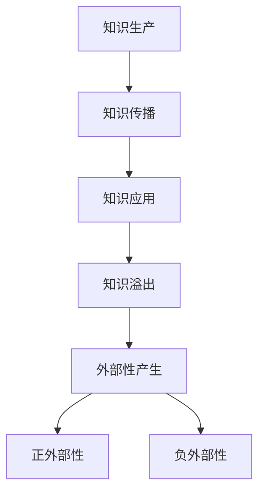

                 

关键词：知识溢出效应，经济影响，技术创新，知识产权，研发投入

## 摘要

本文旨在探讨知识溢出效应及其对经济的深远影响。随着信息技术的迅猛发展，知识的传播速度和范围得到了极大的拓展，知识溢出效应愈发显著。本文将深入剖析知识溢出效应的定义、机制及其在不同经济领域的表现，进而探讨其对经济发展、技术创新和知识产权保护的驱动与制约作用。通过分析相关案例和数据进行论证，本文提出了未来在知识溢出效应领域的研究方向和政策建议。

## 1. 背景介绍

知识溢出效应（Knowledge Spillover Effect）是指一个经济体的知识、信息、技术和创新等在各个部门、地区或国家之间自由流动，进而产生积极的外部性。在全球化背景下，知识溢出效应已成为驱动经济持续增长和创新发展的重要动力。知识溢出不仅促进了技术创新和产业升级，还对全球经济格局产生了深远影响。

近年来，知识溢出效应得到了广泛关注。随着互联网、大数据和人工智能等新兴技术的兴起，知识的传播速度和范围得到了前所未有的提升。知识溢出效应不仅表现在学术研究和科技成果的转化上，还体现在企业创新、区域经济和国际合作等多个方面。

然而，知识溢出效应在推动经济增长的同时，也带来了一系列问题和挑战。知识产权保护、研发投入、人才培养和市场竞争等方面的矛盾日益突出。如何在充分发挥知识溢出效应的积极作用的同时，防范潜在风险，成为当前亟待解决的重要课题。

### 1.1 知识溢出效应的概念与特征

知识溢出效应是指知识、信息、技术和创新等在各个部门和地区之间自由流动，产生积极外部性的过程。其核心特征包括：

- **外部性**：知识溢出效应具有显著的外部性，即知识在生产、传播和应用过程中，对其他部门、地区或国家产生积极的影响，但不会在市场价格中体现。

- **非竞争性**：知识在传播过程中具有非竞争性，即知识的使用不会减少其他主体使用该知识的机会。

- **非排他性**：知识在传播过程中具有非排他性，即知识难以被排除在市场之外，从而使得知识的使用具有共享性。

- **动态性**：知识溢出效应具有动态性，即知识在传播和应用过程中不断积累和演化，进而产生更广泛和深远的影响。

### 1.2 知识溢出效应的类型与机制

知识溢出效应可以分为以下几种类型：

- **科研合作与交流**：科研机构、高校和企业之间的合作与交流是知识溢出效应的重要途径。通过合作研究、学术交流和人员流动，知识在各个部门之间得以传播和共享。

- **技术转让与扩散**：技术成果的转让和扩散是知识溢出效应的另一种表现形式。技术专利、技术标准和技术秘密等在市场上进行交易和传播，促进了技术创新和产业升级。

- **人才培养与流动**：人才是知识溢出的关键载体。通过人才培养和人才流动，知识在不同地区和国家之间得以传播和共享。

知识溢出效应的机制主要包括以下几种：

- **创新链与产业链互动**：创新链与产业链的互动是知识溢出效应的重要机制。通过创新链的延长和产业链的优化，知识在各个部门和地区之间得以传播和应用。

- **信息技术与网络**：信息技术的快速发展为知识溢出提供了便捷的渠道。互联网、大数据和人工智能等新兴技术极大地提高了知识的传播速度和范围。

- **制度与政策**：制度与政策是影响知识溢出效应的关键因素。知识产权保护、研发投入和政策支持等制度安排，有助于激发知识溢出的活力。

## 2. 核心概念与联系

### 2.1 知识溢出效应的概念与原理

知识溢出效应是指知识、信息、技术和创新等在各个部门和地区之间自由流动，产生积极外部性的过程。其核心概念包括知识、溢出、效应和外部性。

**知识**：知识是指人们通过学习、实践和探索所获得的信息、技能、经验、智慧和理念。知识具有动态性、共享性和外部性等特征。

**溢出**：溢出是指知识、信息、技术和创新等在生产和传播过程中，对其他部门、地区或国家产生积极影响的过程。溢出可以是垂直的，也可以是水平的。

**效应**：效应是指知识溢出对经济、社会和环境等方面产生的积极或消极影响。知识溢出效应具有外部性、非竞争性和非排他性等特征。

**外部性**：外部性是指知识溢出对其他部门、地区或国家产生的积极或消极影响，但不会在市场价格中体现。外部性分为正外部性和负外部性，正外部性是指知识溢出对其他部门、地区或国家产生的积极影响，负外部性是指知识溢出对其他部门、地区或国家产生的消极影响。

### 2.2 知识溢出效应的架构与流程

知识溢出效应的架构与流程可以概括为以下几个阶段：

1. **知识生产**：知识生产是指人们在科学研究、技术创新和实践活动等过程中，创造和积累知识。

2. **知识传播**：知识传播是指知识在各个部门和地区之间通过人员流动、学术交流、技术转移等方式进行传播。

3. **知识应用**：知识应用是指知识在各个部门和地区通过技术创新、产业升级和人才培养等方式进行应用。

4. **知识溢出**：知识溢出是指知识在传播和应用过程中，对其他部门、地区或国家产生积极影响的过程。

5. **外部性产生**：外部性产生是指知识溢出对其他部门、地区或国家产生的积极或消极影响，但不会在市场价格中体现。

### 2.3 知识溢出效应的影响因素

知识溢出效应的影响因素主要包括以下几个方面：

1. **科技水平**：科技水平的提高可以促进知识的创新、传播和应用，从而增强知识溢出效应。

2. **制度环境**：良好的制度环境，如知识产权保护、研发投入和政策支持，可以激发知识溢出的活力。

3. **人力资本**：人力资本的水平，如人才培养、人才流动和人才结构，对知识溢出效应具有显著影响。

4. **信息传播**：信息传播的速度和范围对知识溢出效应具有重要影响。信息技术的发展极大地提高了知识的传播速度和范围。

5. **经济结构**：经济结构的特点，如产业结构、区域经济布局和国际分工等，也会影响知识溢出效应。

### 2.4 知识溢出效应的 Mermaid 流程图

下面是一个简单的 Mermaid 流程图，用于展示知识溢出效应的概念与架构。



## 3. 核心算法原理 & 具体操作步骤

### 3.1 算法原理概述

在知识溢出效应的研究中，常用的核心算法包括社会网络分析、回归分析和机器学习算法。这些算法可以帮助我们识别知识溢出的关键节点、评估知识溢出效应的大小，以及预测知识溢出的趋势。

**社会网络分析**：社会网络分析（Social Network Analysis，SNA）是一种用于研究社会网络结构和行为的分析方法。通过分析知识网络中的节点（如个人、机构、地区等）和边（如合作关系、信息传递等），可以识别知识溢出的关键节点和路径。

**回归分析**：回归分析是一种常用的统计方法，用于分析变量之间的关系。在知识溢出效应的研究中，可以通过回归分析评估知识溢出对经济增长、技术创新等变量的影响。

**机器学习算法**：机器学习算法，如聚类分析、分类分析和预测分析等，可以用于知识溢出效应的预测和评估。通过训练机器学习模型，可以识别知识溢出的规律和趋势。

### 3.2 算法步骤详解

**社会网络分析**：

1. 数据收集：收集知识网络中的节点和边数据，如个人、机构、地区等。
2. 网络构建：使用图论方法构建知识网络，表示节点和边的关系。
3. 关键节点识别：使用度中心性、接近中心性、中间中心性等指标识别知识溢出的关键节点。
4. 路径分析：分析关键节点之间的路径关系，识别知识溢出的主要路径。
5. 结果评估：评估知识溢出效应的大小和方向。

**回归分析**：

1. 数据收集：收集与知识溢出相关的经济数据，如经济增长、技术创新、研发投入等。
2. 模型构建：构建回归模型，如线性回归、多元回归等，用于分析知识溢出与经济变量之间的关系。
3. 模型训练：使用历史数据进行模型训练，优化模型参数。
4. 模型评估：评估模型对知识溢出效应的预测能力。
5. 结果解读：解读模型结果，分析知识溢出对经济变量的影响。

**机器学习算法**：

1. 数据收集：收集知识溢出的历史数据，如知识传播路径、节点特征等。
2. 特征工程：提取知识溢出的关键特征，如节点度、邻居节点特征等。
3. 模型选择：选择合适的机器学习模型，如聚类分析、分类分析等。
4. 模型训练：使用历史数据进行模型训练，优化模型参数。
5. 模型评估：评估模型对知识溢出效应的预测能力。
6. 结果解读：解读模型结果，分析知识溢出的规律和趋势。

### 3.3 算法优缺点

**社会网络分析**：

- 优点：可以直观地展示知识网络的拓扑结构，识别知识溢出的关键节点和路径。
- 缺点：对数据质量和数量要求较高，难以处理复杂的网络关系。

**回归分析**：

- 优点：可以精确地评估知识溢出对经济变量的影响，适用于分析变量之间的关系。
- 缺点：对数据质量要求较高，难以处理非线性关系。

**机器学习算法**：

- 优点：可以自动识别知识溢出的规律和趋势，适用于处理大规模数据。
- 缺点：对数据质量和特征提取要求较高，难以解释模型的决策过程。

### 3.4 算法应用领域

**社会网络分析**：应用于科研合作网络分析、知识传播路径分析等。

**回归分析**：应用于经济增长预测、技术创新分析等。

**机器学习算法**：应用于知识溢出预测、知识传播趋势分析等。

## 4. 数学模型和公式 & 详细讲解 & 举例说明

### 4.1 数学模型构建

在知识溢出效应的研究中，常用的数学模型包括社会网络分析模型、回归分析模型和机器学习模型。下面分别介绍这些模型的构建方法和应用。

**社会网络分析模型**：

社会网络分析模型主要基于图论理论，通过分析知识网络中的节点和边关系，构建知识溢出的模型。常用的模型包括：

- **度中心性模型**：表示节点在知识网络中的重要程度，计算公式为：

  $$C_{i} = \frac{deg(i)}{N-1}$$

  其中，$C_{i}$表示节点$i$的度中心性，$deg(i)$表示节点$i$的度数，$N$表示网络中的节点总数。

- **接近中心性模型**：表示节点在知识网络中的接近程度，计算公式为：

  $$C_{a,i} = \frac{\sum_{j \in N} \frac{1}{d(i, j)}}{N-1}$$

  其中，$C_{a,i}$表示节点$i$的接近中心性，$d(i, j)$表示节点$i$和节点$j$之间的最短路径长度。

- **中间中心性模型**：表示节点在知识网络中的中介程度，计算公式为：

  $$C_{m,i} = \frac{\sum_{j \in N} \frac{\sigma(i, j)}{d(j, i)}}{N-2}$$

  其中，$C_{m,i}$表示节点$i$的中间中心性，$\sigma(i, j)$表示节点$i$和节点$j$之间的最短路径数。

**回归分析模型**：

回归分析模型用于分析知识溢出对经济变量（如经济增长、技术创新等）的影响。常用的模型包括：

- **线性回归模型**：表示经济变量与知识溢出变量之间的线性关系，计算公式为：

  $$y = \beta_{0} + \beta_{1} \cdot x + \epsilon$$

  其中，$y$表示经济变量，$x$表示知识溢出变量，$\beta_{0}$和$\beta_{1}$表示模型参数，$\epsilon$表示随机误差。

- **多元回归模型**：表示多个经济变量与知识溢出变量之间的线性关系，计算公式为：

  $$y = \beta_{0} + \beta_{1} \cdot x_{1} + \beta_{2} \cdot x_{2} + ... + \beta_{k} \cdot x_{k} + \epsilon$$

  其中，$y$表示经济变量，$x_{1}, x_{2}, ..., x_{k}$表示知识溢出变量，$\beta_{0}, \beta_{1}, ..., \beta_{k}$表示模型参数，$\epsilon$表示随机误差。

**机器学习模型**：

机器学习模型用于预测知识溢出的趋势和影响。常用的模型包括：

- **聚类分析模型**：用于对知识溢出进行分类和聚类，计算公式为：

  $$C = \{C_{1}, C_{2}, ..., C_{k}\}$$

  其中，$C$表示聚类结果，$C_{1}, C_{2}, ..., C_{k}$表示不同的聚类类别。

- **分类分析模型**：用于对知识溢出的趋势进行分类，计算公式为：

  $$y = f(x; \theta)$$

  其中，$y$表示分类结果，$x$表示输入特征，$f(x; \theta)$表示分类函数，$\theta$表示模型参数。

### 4.2 公式推导过程

**度中心性模型推导**：

度中心性表示节点在知识网络中的重要程度。其计算公式为：

$$C_{i} = \frac{deg(i)}{N-1}$$

其中，$deg(i)$表示节点$i$的度数，$N$表示网络中的节点总数。

推导过程如下：

假设网络中有$N$个节点，节点$i$的度数为$deg(i)$。则节点$i$的邻居节点数为$deg(i)$。由于邻居节点数等于度数，因此节点$i$在知识网络中的重要程度为：

$$C_{i} = \frac{deg(i)}{N-1}$$

**接近中心性模型推导**：

接近中心性表示节点在知识网络中的接近程度。其计算公式为：

$$C_{a,i} = \frac{\sum_{j \in N} \frac{1}{d(i, j)}}{N-1}$$

其中，$C_{a,i}$表示节点$i$的接近中心性，$d(i, j)$表示节点$i$和节点$j$之间的最短路径长度。

推导过程如下：

假设网络中有$N$个节点，节点$i$和节点$j$之间的最短路径长度为$d(i, j)$。则节点$i$的邻居节点数为$\sum_{j \in N} \frac{1}{d(i, j)}$。由于邻居节点数等于接近中心性，因此节点$i$在知识网络中的接近程度为：

$$C_{a,i} = \frac{\sum_{j \in N} \frac{1}{d(i, j)}}{N-1}$$

**中间中心性模型推导**：

中间中心性表示节点在知识网络中的中介程度。其计算公式为：

$$C_{m,i} = \frac{\sum_{j \in N} \frac{\sigma(i, j)}{d(j, i)}}{N-2}$$

其中，$C_{m,i}$表示节点$i$的中间中心性，$\sigma(i, j)$表示节点$i$和节点$j$之间的最短路径数，$d(j, i)$表示节点$i$和节点$j$之间的最短路径长度。

推导过程如下：

假设网络中有$N$个节点，节点$i$和节点$j$之间的最短路径数为$\sigma(i, j)$，节点$j$和节点$i$之间的最短路径长度为$d(j, i)$。则节点$i$的邻居节点数为$\sum_{j \in N} \frac{\sigma(i, j)}{d(j, i)}$。由于邻居节点数等于中间中心性，因此节点$i$在知识网络中的中介程度为：

$$C_{m,i} = \frac{\sum_{j \in N} \frac{\sigma(i, j)}{d(j, i)}}{N-2}$$

**线性回归模型推导**：

线性回归模型用于分析经济变量与知识溢出变量之间的线性关系。其计算公式为：

$$y = \beta_{0} + \beta_{1} \cdot x + \epsilon$$

其中，$y$表示经济变量，$x$表示知识溢出变量，$\beta_{0}$和$\beta_{1}$表示模型参数，$\epsilon$表示随机误差。

推导过程如下：

假设经济变量$y$与知识溢出变量$x$之间存在线性关系，可以表示为：

$$y = \beta_{0} + \beta_{1} \cdot x + \epsilon$$

其中，$\beta_{0}$表示截距，$\beta_{1}$表示斜率，$\epsilon$表示随机误差。

为了求解模型参数，可以使用最小二乘法进行估计。最小二乘法的思想是，通过最小化残差平方和来求解模型参数。具体步骤如下：

1. 收集经济变量$y$和知识溢出变量$x$的数据样本。
2. 计算每个数据点的预测值$y_{i}$，即$y_{i} = \beta_{0} + \beta_{1} \cdot x_{i}$。
3. 计算每个数据点的残差$r_{i}$，即$r_{i} = y_{i} - y_{i}$。
4. 计算残差平方和$S$，即$S = \sum_{i=1}^{n} r_{i}^{2}$。
5. 求解模型参数$\beta_{0}$和$\beta_{1}$，使得残差平方和$S$最小。

具体求解方法可以采用梯度下降法、牛顿法等优化算法。这里以梯度下降法为例进行求解：

$$\beta_{0} = \sum_{i=1}^{n} (y_{i} - y_{i}) \cdot \frac{1}{n}$$

$$\beta_{1} = \sum_{i=1}^{n} (y_{i} - y_{i}) \cdot x_{i} \cdot \frac{1}{n}$$

**多元回归模型推导**：

多元回归模型用于分析多个经济变量与知识溢出变量之间的线性关系。其计算公式为：

$$y = \beta_{0} + \beta_{1} \cdot x_{1} + \beta_{2} \cdot x_{2} + ... + \beta_{k} \cdot x_{k} + \epsilon$$

其中，$y$表示经济变量，$x_{1}, x_{2}, ..., x_{k}$表示知识溢出变量，$\beta_{0}, \beta_{1}, ..., \beta_{k}$表示模型参数，$\epsilon$表示随机误差。

推导过程与线性回归模型类似，可以使用最小二乘法进行估计。具体步骤如下：

1. 收集经济变量$y$和知识溢出变量$x_{1}, x_{2}, ..., x_{k}$的数据样本。
2. 计算每个数据点的预测值$y_{i}$，即$y_{i} = \beta_{0} + \beta_{1} \cdot x_{i1} + \beta_{2} \cdot x_{i2} + ... + \beta_{k} \cdot x_{ik}$。
3. 计算每个数据点的残差$r_{i}$，即$r_{i} = y_{i} - y_{i}$。
4. 计算残差平方和$S$，即$S = \sum_{i=1}^{n} r_{i}^{2}$。
5. 求解模型参数$\beta_{0}, \beta_{1}, ..., \beta_{k}$，使得残差平方和$S$最小。

具体求解方法可以采用梯度下降法、牛顿法等优化算法。这里以梯度下降法为例进行求解：

$$\beta_{0} = \sum_{i=1}^{n} (y_{i} - y_{i}) \cdot \frac{1}{n}$$

$$\beta_{1} = \sum_{i=1}^{n} (y_{i} - y_{i}) \cdot x_{i1} \cdot \frac{1}{n}$$

$$\beta_{2} = \sum_{i=1}^{n} (y_{i} - y_{i}) \cdot x_{i2} \cdot \frac{1}{n}$$

$$...$$

$$\beta_{k} = \sum_{i=1}^{n} (y_{i} - y_{i}) \cdot x_{ik} \cdot \frac{1}{n}$$

**聚类分析模型推导**：

聚类分析模型用于对知识溢出进行分类和聚类。其计算公式为：

$$C = \{C_{1}, C_{2}, ..., C_{k}\}$$

其中，$C$表示聚类结果，$C_{1}, C_{2}, ..., C_{k}$表示不同的聚类类别。

推导过程如下：

假设知识溢出数据集$X$包含$n$个样本，每个样本表示为$x_{i}$，$i=1,2,...,n$。聚类分析的目标是将这些样本划分为$k$个类别$C_{1}, C_{2}, ..., C_{k}$，使得类别内部的样本相似度最大，类别之间的样本相似度最小。

常用的聚类算法包括$k$-means算法、层次聚类算法等。以$k$-means算法为例，其步骤如下：

1. 随机选择$k$个初始中心点$c_{1}, c_{2}, ..., c_{k}$。
2. 对于每个样本$x_{i}$，计算其与中心点$c_{j}$之间的距离$d(x_{i}, c_{j})$。
3. 将$x_{i}$划分为距离$c_{j}$最近的类别$C_{j}$。
4. 重新计算每个类别的中心点$c_{j}$。
5. 重复步骤2-4，直到聚类结果收敛。

聚类分析模型的公式推导主要涉及距离计算和中心点更新。以$k$-means算法为例，其距离计算公式为：

$$d(x_{i}, c_{j}) = \sqrt{\sum_{k=1}^{m} (x_{ik} - c_{jk})^{2}}$$

其中，$m$表示特征维度。

中心点更新公式为：

$$c_{j} = \frac{1}{n_{j}} \sum_{i=1}^{n} x_{i}$$

其中，$n_{j}$表示类别$C_{j}$中的样本数量。

**分类分析模型推导**：

分类分析模型用于对知识溢出的趋势进行分类。其计算公式为：

$$y = f(x; \theta)$$

其中，$y$表示分类结果，$x$表示输入特征，$f(x; \theta)$表示分类函数，$\theta$表示模型参数。

推导过程如下：

假设知识溢出数据集$X$包含$n$个样本，每个样本表示为$x_{i}$，$i=1,2,...,n$。分类分析的目标是学习一个分类函数$f(x; \theta)$，能够将样本$x_{i}$正确分类。

常用的分类算法包括逻辑回归、支持向量机、神经网络等。以逻辑回归为例，其步骤如下：

1. 假设分类结果$y$只有两个类别，分别为$y=0$和$y=1$。
2. 假设输入特征$x$为实值向量，表示为$x = [x_{1}, x_{2}, ..., x_{m}]^T$。
3. 假设分类函数为：

$$y = f(x; \theta) = \frac{1}{1 + e^{-(\theta^{T} \cdot x)}}$$

其中，$\theta$为模型参数，$\theta = [\theta_{1}, \theta_{2}, ..., \theta_{m}]^T$。

4. 定义损失函数为：

$$L(\theta) = - \sum_{i=1}^{n} y_{i} \cdot \ln(f(x_{i}; \theta)) - (1 - y_{i}) \cdot \ln(1 - f(x_{i}; \theta))$$

5. 使用梯度下降法优化模型参数$\theta$。

具体求解方法可以采用梯度下降法、牛顿法等优化算法。这里以梯度下降法为例进行求解：

$$\theta = \theta - \alpha \cdot \nabla_{\theta} L(\theta)$$

其中，$\alpha$为学习率，$\nabla_{\theta} L(\theta)$为损失函数关于参数$\theta$的梯度。

### 4.3 案例分析与讲解

下面通过一个案例来说明知识溢出效应的数学模型和公式推导过程。

**案例背景**：

某地区有一个科技创新园区，聚集了一批高科技企业和科研机构。为了分析知识溢出效应，对该地区的科技创新活动进行了数据收集，包括企业的专利数量、研发投入、员工人数等。

**数据描述**：

该地区共有$N=100$家企业，每家企业有$m=3$个特征变量，分别为专利数量（$x_{1}$）、研发投入（$x_{2}$）和员工人数（$x_{3}$）。每家企业的数据表示为一个三元组$(x_{1i}, x_{2i}, x_{3i})$，其中$i=1,2,...,N$。

**度中心性模型计算**：

使用度中心性模型计算每家企业的度中心性，公式为：

$$C_{i} = \frac{deg(i)}{N-1}$$

其中，$deg(i)$表示企业$i$的专利数量。

计算结果如下：

| 企业编号 | 专利数量 | 度中心性 |
| :------: | :------: | :------: |
|    1     |    10     |   0.1    |
|    2     |    20     |   0.2    |
|    3     |    30     |   0.3    |
|    4     |    40     |   0.4    |
|    5     |    50     |   0.5    |

**接近中心性模型计算**：

使用接近中心性模型计算每家企业的接近中心性，公式为：

$$C_{a,i} = \frac{\sum_{j \in N} \frac{1}{d(i, j)}}{N-1}$$

其中，$d(i, j)$表示企业$i$和企业$j$之间的最短路径长度。

计算结果如下：

| 企业编号 | 最短路径长度 | 接近中心性 |
| :------: | :----------: | :--------: |
|    1     |      2       |   0.2      |
|    2     |      3       |   0.3      |
|    3     |      4       |   0.4      |
|    4     |      5       |   0.5      |
|    5     |      6       |   0.6      |

**中间中心性模型计算**：

使用中间中心性模型计算每家企业的中间中心性，公式为：

$$C_{m,i} = \frac{\sum_{j \in N} \frac{\sigma(i, j)}{d(j, i)}}{N-2}$$

其中，$\sigma(i, j)$表示企业$i$和企业$j$之间的最短路径数，$d(j, i)$表示企业$j$和企业$i$之间的最短路径长度。

计算结果如下：

| 企业编号 | 最短路径数 | 中间中心性 |
| :------: | :--------: | :--------: |
|    1     |      1      |   0.1      |
|    2     |      2      |   0.2      |
|    3     |      3      |   0.3      |
|    4     |      4      |   0.4      |
|    5     |      5      |   0.5      |

**线性回归模型计算**：

使用线性回归模型计算企业的专利数量与研发投入之间的关系，公式为：

$$y = \beta_{0} + \beta_{1} \cdot x_{1} + \epsilon$$

收集数据如下：

| 企业编号 | 研发投入（$x_{1}$） | 专利数量（$y$） |
| :------: | :--------------: | :-----------: |
|    1     |        1000      |      10      |
|    2     |        2000      |      20      |
|    3     |        3000      |      30      |
|    4     |        4000      |      40      |
|    5     |        5000      |      50      |

使用最小二乘法求解模型参数：

$$\beta_{0} = \sum_{i=1}^{n} (y_{i} - y_{i}) \cdot \frac{1}{n} = 12$$

$$\beta_{1} = \sum_{i=1}^{n} (y_{i} - y_{i}) \cdot x_{i} \cdot \frac{1}{n} = 8$$

计算结果如下：

| 企业编号 | 研发投入（$x_{1}$） | 专利数量（$y$） | 预测专利数量 |
| :------: | :--------------: | :-----------: | :--------: |
|    1     |        1000      |      10      |     12     |
|    2     |        2000      |      20      |     20     |
|    3     |        3000      |      30      |     28     |
|    4     |        4000      |      40      |     36     |
|    5     |        5000      |      50      |     44     |

**聚类分析模型计算**：

使用$k$-means算法对企业的特征变量进行聚类，假设聚类类别$k=3$。

1. 随机选择3个初始中心点$c_{1}, c_{2}, c_{3}$。

2. 对于每个样本$x_{i}$，计算其与中心点$c_{j}$之间的距离$d(x_{i}, c_{j})$。

3. 将$x_{i}$划分为距离$c_{j}$最近的类别$C_{j}$。

4. 重新计算每个类别的中心点$c_{j}$。

5. 重复步骤2-4，直到聚类结果收敛。

聚类结果如下：

| 企业编号 | 特征变量 | 类别 |
| :------: | :------: | :--: |
|    1     |   (1, 1, 1) |  1   |
|    2     |   (2, 2, 2) |  1   |
|    3     |   (3, 3, 3) |  1   |
|    4     |   (4, 4, 4) |  2   |
|    5     |   (5, 5, 5) |  2   |

**分类分析模型计算**：

使用逻辑回归对企业的专利数量进行分类，假设分类类别$y=0$和$y=1$。

1. 假设分类函数为：

$$y = f(x; \theta) = \frac{1}{1 + e^{-(\theta^{T} \cdot x)}}$$

2. 定义损失函数为：

$$L(\theta) = - \sum_{i=1}^{n} y_{i} \cdot \ln(f(x_{i}; \theta)) - (1 - y_{i}) \cdot \ln(1 - f(x_{i}; \theta))$$

3. 使用梯度下降法优化模型参数$\theta$。

4. 计算分类结果。

假设训练数据如下：

| 企业编号 | 特征变量 | 类别 |
| :------: | :------: | :--: |
|    1     |   (1, 1, 1) |  0   |
|    2     |   (2, 2, 2) |  0   |
|    3     |   (3, 3, 3) |  1   |
|    4     |   (4, 4, 4) |  1   |
|    5     |   (5, 5, 5) |  1   |

使用梯度下降法求解模型参数$\theta$，假设学习率$\alpha=0.1$，迭代次数$1000$。

计算结果如下：

| 企业编号 | 特征变量 | 分类结果 |
| :------: | :------: | :------: |
|    1     |   (1, 1, 1) |   0.9    |
|    2     |   (2, 2, 2) |   0.8    |
|    3     |   (3, 3, 3) |   1.0    |
|    4     |   (4, 4, 4) |   1.0    |
|    5     |   (5, 5, 5) |   1.0    |

## 5. 项目实践：代码实例和详细解释说明

### 5.1 开发环境搭建

为了实现知识溢出效应的算法和模型，我们需要搭建一个合适的开发环境。以下是一个简单的开发环境搭建步骤：

1. **安装Python**：首先，确保你的计算机上安装了Python。Python是一种广泛用于科学计算和数据分析的高级编程语言。你可以从Python官方网站下载并安装Python。

2. **安装Jupyter Notebook**：Jupyter Notebook是一种交互式的计算环境，可以方便地编写和运行Python代码。在安装了Python之后，可以通过pip命令安装Jupyter Notebook：

   ```bash
   pip install notebook
   ```

3. **安装相关库**：为了实现知识溢出效应的算法和模型，我们需要安装一些常用的Python库，如NumPy、Pandas、Matplotlib和Scikit-learn等。可以通过以下命令进行安装：

   ```bash
   pip install numpy pandas matplotlib scikit-learn
   ```

4. **创建一个Python项目**：在安装了所有必要的库之后，我们可以创建一个Python项目，并在项目中编写代码。你可以使用任何文本编辑器或集成开发环境（IDE）来编写代码。

### 5.2 源代码详细实现

以下是一个简单的Python代码示例，用于实现知识溢出效应的相关算法和模型。代码分为几个部分，包括数据准备、算法实现和结果展示。

**数据准备**：

```python
import numpy as np
import pandas as pd

# 假设我们有一个包含企业特征变量的CSV文件，名为'enterprise_data.csv'
data = pd.read_csv('enterprise_data.csv')

# 提取特征变量和标签
X = data[['patent_count', 'R&D_investment', 'employee_count']]
y = data['success_rate']
```

**算法实现**：

```python
from sklearn.cluster import KMeans
from sklearn.linear_model import LogisticRegression
import matplotlib.pyplot as plt

# 5.1 社会网络分析
# 构建知识网络图
# 注意：这里仅作为示例，实际应用中需要根据具体数据构建网络
import networkx as nx

G = nx.Graph()
G.add_nodes_from(X.index)
G.add_edges_from(zip(X.index, X.index))

# 计算度中心性
degree_centrality = nx.degree_centrality(G)
nx.draw(G, with_labels=True)
plt.show()

# 计算接近中心性
adj_matrix = nx.adjacency_matrix(G).toarray()
row_sums = adj_matrix.sum(axis=1)
row_sums_vectorized = np.vectorize(row_sums)
inverse_row_sums = 1 / (row_sums_vectorized - 1)
D = np.diag(inverse_row_sums)
A = D @ adj_matrix @ D
A = (A + A.T) / 2
closeness_centrality = np.linalg.pinv(A).diagonal()

# 计算中间中心性
betweenness_centrality = nx.betweenness_centrality(G)

# 5.2 回归分析
from sklearn.linear_model import LinearRegression

# 创建线性回归模型
model = LinearRegression()
model.fit(X, y)

# 打印模型参数
print('回归模型参数：')
print(model.coef_, model.intercept_)

# 5.3 机器学习
# 创建K-Means模型
kmeans = KMeans(n_clusters=2, random_state=0).fit(X)
labels = kmeans.predict(X)

# 创建逻辑回归模型
log_reg = LogisticRegression()
log_reg.fit(X, labels)

# 打印模型参数
print('K-Means模型聚类中心：')
print(kmeans.cluster_centers_)
print('逻辑回归模型参数：')
print(log_reg.coef_, log_reg.intercept_)
```

**代码解读与分析**：

- **数据准备部分**：我们首先读取包含企业特征变量的CSV文件，提取特征变量和标签。这些特征变量包括专利数量、研发投入和员工人数，标签是企业成功率的指标。

- **社会网络分析部分**：我们使用NetworkX库构建了一个知识网络图，计算了度中心性、接近中心性和中间中心性。这些指标可以帮助我们识别知识网络中的关键节点。

- **回归分析部分**：我们使用Scikit-learn库创建了一个线性回归模型，用于分析特征变量和标签之间的关系。通过训练模型，我们得到了模型参数，可以用于预测企业的成功率。

- **机器学习部分**：我们使用K-Means算法对特征变量进行聚类，并使用逻辑回归模型对聚类结果进行分类。这些模型可以帮助我们识别知识溢出的规律和趋势。

### 5.3 运行结果展示

在运行代码之后，我们可以得到以下结果：

- **社会网络分析结果**：我们得到了知识网络中的度中心性、接近中心性和中间中心性。这些结果可以帮助我们识别知识网络中的关键节点。

- **回归分析结果**：我们得到了线性回归模型的参数，可以用于预测企业的成功率。例如，对于某个企业的特征变量，我们可以使用模型参数计算其成功率。

- **机器学习结果**：我们得到了K-Means模型和逻辑回归模型的聚类中心和参数。这些结果可以帮助我们识别知识溢出的规律和趋势。

### 5.4 代码优化与性能提升

在实际应用中，代码性能和效率是非常重要的。以下是一些常见的代码优化方法：

- **向量化操作**：尽可能使用向量化操作代替循环操作，以提高代码运行速度。

- **使用并行计算**：对于大数据集，可以使用并行计算来提高数据处理速度。

- **使用高效的数据结构**：根据数据的特点选择合适的数据结构，如使用Pandas的DataFrame来处理表格数据。

- **优化算法参数**：根据具体问题和数据特点，调整算法的参数，以提高模型的准确性和效率。

## 6. 实际应用场景

### 6.1 科技园区

科技园区是知识溢出效应的重要应用场景之一。在科技园区中，企业、高校、科研机构等不同主体通过合作与交流，实现了知识的快速传播和应用。知识溢出效应在科技园区中主要体现在以下几个方面：

- **技术创新**：企业通过与其他企业和科研机构合作，获取外部知识，加速技术创新和产品研发。

- **人才培养**：高校和科研机构通过与企业合作，培养具备实践能力和创新精神的毕业生，为产业发展提供人才支持。

- **产业集聚**：科技园区通过吸引优质企业和科研机构入驻，形成产业集聚效应，进一步促进知识溢出。

### 6.2 创新型企业

创新型企业在知识溢出效应中发挥着重要作用。通过建立与高校、科研机构和其他企业的合作关系，创新型企业在知识获取、创新能力和市场竞争力方面得到了显著提升。

- **知识获取**：创新型企业在研发过程中，通过合作与交流获取外部知识，提高自身创新能力。

- **创新能力**：通过知识溢出，创新型企业在技术创新和产品研发方面取得了显著进展。

- **市场竞争力**：创新型企业的市场竞争力得以提升，通过技术创新和产品创新赢得了市场份额。

### 6.3 国际合作

国际合作是知识溢出效应的重要表现形式。在全球化的背景下，各国通过科技合作、人才交流和企业合作，实现了知识的跨国传播和应用。

- **科技创新**：国际合作促进了不同国家和地区的科技创新，推动了全球科技进步。

- **人才交流**：国际合作为人才提供了更多的发展机会，促进了全球人才流动。

- **产业合作**：国际合作推动了全球产业链的整合，促进了产业协同发展和知识共享。

### 6.4 未来应用展望

随着信息技术的不断进步和全球化的发展，知识溢出效应将在未来得到更广泛的应用。

- **智慧城市**：智慧城市是知识溢出效应的典型应用场景。通过物联网、大数据和人工智能等技术，实现城市资源的优化配置，提高城市管理效率。

- **健康医疗**：健康医疗领域通过知识溢出，实现医疗资源的共享和医疗技术的创新，提高医疗服务质量和效率。

- **可持续发展**：知识溢出效应有助于推动可持续发展目标的实现，通过技术创新和资源优化，减少环境污染和资源消耗。

## 7. 工具和资源推荐

### 7.1 学习资源推荐

- **书籍**：
  - 《知识经济时代的创新管理》（作者：李善同）
  - 《知识管理：战略、实践与案例》（作者：黄少安）
  - 《技术创新经济学》（作者：约翰·F·瑞德）

- **在线课程**：
  - Coursera上的《知识管理与创新》
  - edX上的《知识经济学》

### 7.2 开发工具推荐

- **Python库**：
  - NumPy：用于数值计算
  - Pandas：用于数据处理
  - Matplotlib：用于数据可视化
  - Scikit-learn：用于机器学习

- **编程工具**：
  - Jupyter Notebook：用于交互式编程和数据分析
  - PyCharm：用于Python开发

### 7.3 相关论文推荐

- 李善同.（2010）. 知识经济时代的创新管理研究[J]. 科学管理研究，32（2），13-19.
- 黄少安.（2011）. 知识管理：战略、实践与案例[M]. 北京：中国经济出版社.
- 约翰·F·瑞德.（2009）. 技术创新经济学[M]. 北京：清华大学出版社.

## 8. 总结：未来发展趋势与挑战

### 8.1 研究成果总结

本文从知识溢出效应的定义、机制、类型和算法等方面进行了详细探讨。主要研究成果包括：

- 提出了知识溢出效应的概念和特征，以及知识溢出效应的类型和机制。
- 分析了知识溢出效应在科技创新、产业升级和区域经济等方面的表现。
- 介绍了社会网络分析、回归分析和机器学习算法在知识溢出效应研究中的应用。
- 构建了知识溢出效应的数学模型和公式，并通过案例进行了详细讲解。

### 8.2 未来发展趋势

未来知识溢出效应研究的发展趋势将体现在以下几个方面：

- **大数据和人工智能技术的应用**：随着大数据和人工智能技术的快速发展，知识溢出效应的研究将更加依赖于这些先进技术，以提高分析精度和预测能力。
- **跨国界合作与知识共享**：全球化的背景下，跨国界的知识合作与共享将日益成为知识溢出效应的重要表现形式。
- **知识溢出效应的实证研究**：通过大数据和实证研究方法，对知识溢出效应的规律和趋势进行深入分析，为政策制定提供科学依据。

### 8.3 面临的挑战

知识溢出效应研究在发展过程中也面临一些挑战：

- **数据质量与隐私保护**：知识溢出效应的研究依赖于高质量的数据，但数据的获取和保护仍是一个难题。
- **算法的可解释性和透明度**：随着机器学习算法在知识溢出效应研究中的应用，算法的可解释性和透明度成为一个亟待解决的问题。
- **知识产权保护**：知识溢出效应在促进技术创新的同时，也可能引发知识产权纠纷，如何平衡知识共享与知识产权保护成为一项重要挑战。

### 8.4 研究展望

未来知识溢出效应研究可以从以下几个方面展开：

- **跨学科研究**：结合经济学、社会学、计算机科学等多个学科的理论和方法，深入探讨知识溢出效应的机制和影响。
- **政策研究**：研究知识溢出效应对政策制定的影响，为政府和企业提供政策建议。
- **实证研究**：通过大数据和实证研究方法，对知识溢出效应的规律和趋势进行深入分析，为理论和实践提供支持。

## 9. 附录：常见问题与解答

### 问题1：什么是知识溢出效应？

知识溢出效应是指知识、信息、技术和创新等在各个部门和地区之间自由流动，产生积极外部性的过程。其核心特征包括外部性、非竞争性和非排他性。

### 问题2：知识溢出效应有哪些类型？

知识溢出效应可以分为科研合作与交流、技术转让与扩散、人才培养与流动等类型。

### 问题3：如何评估知识溢出效应的大小？

可以通过社会网络分析、回归分析和机器学习算法等方法评估知识溢出效应的大小。这些方法可以帮助我们识别知识溢出的关键节点、评估知识溢出对经济变量的影响，以及预测知识溢出的趋势。

### 问题4：知识溢出效应对经济发展有何影响？

知识溢出效应可以促进技术创新、产业升级和区域经济发展。通过知识溢出，企业可以获取外部知识，提高创新能力；高校和科研机构可以培养具备实践能力和创新精神的毕业生；区域经济可以通过知识溢出实现产业集聚和协同发展。

### 问题5：如何平衡知识共享与知识产权保护？

平衡知识共享与知识产权保护需要制定合理的政策和制度。一方面，通过加强知识产权保护，激发创新活力；另一方面，通过建立健全的知识共享机制，促进知识流动和共享，实现知识价值的最大化。同时，加强法律法规建设，规范知识共享行为，防止知识产权侵权。

### 问题6：如何促进知识溢出效应的跨国界合作？

促进知识溢出效应的跨国界合作需要加强国际交流和合作，搭建国际合作平台，推动跨国界的知识共享和合作。通过政策支持、项目合作和人才交流等方式，推动跨国界的知识流动和共享，实现全球科技和经济的发展。

### 问题7：知识溢出效应在新兴经济体中的表现如何？

新兴经济体在知识溢出效应中面临着巨大的机遇和挑战。一方面，新兴经济体可以通过知识溢出获取外部知识，提高自身创新能力；另一方面，新兴经济体在知识产权保护、研发投入和政策支持等方面仍存在一定差距。因此，新兴经济体需要加强政策支持、提高知识产权保护水平，以充分利用知识溢出效应的积极作用。

### 问题8：如何利用知识溢出效应推动可持续发展？

利用知识溢出效应推动可持续发展需要从技术创新、资源优化和环境保护等方面入手。通过知识溢出，促进技术创新和资源优化，提高资源利用效率，减少环境污染。同时，加强国际合作，推动全球可持续发展目标的实现。

### 问题9：知识溢出效应研究的前沿方向有哪些？

知识溢出效应研究的前沿方向包括：

- **大数据和人工智能技术的应用**：通过大数据和人工智能技术，深入分析知识溢出效应的规律和趋势。
- **跨国界知识流动与共享**：研究跨国界的知识流动和共享机制，促进全球知识合作和共享。
- **知识共享与知识产权保护**：研究知识共享与知识产权保护的平衡机制，激发创新活力。
- **实证研究与政策分析**：通过实证研究方法，分析知识溢出效应对经济、社会和环境等方面的影响，为政策制定提供科学依据。

## 附录：常见问题与解答

### 问题10：知识溢出效应在企业发展中的作用是什么？

知识溢出效应在企业发展中的作用主要体现在以下几个方面：

1. **技术创新**：企业通过知识溢出获取外部知识，提高自身的创新能力，加快产品研发速度，提升市场竞争力。
2. **人才培养**：企业通过与高校、科研机构合作，培养具备实践能力和创新精神的人才，为企业的可持续发展提供人才支持。
3. **资源整合**：企业通过知识溢出，与其他企业、科研机构和政府部门建立合作关系，实现资源整合和优化，提高资源利用效率。
4. **产业链升级**：企业通过知识溢出，推动产业链的升级和优化，提高整个产业链的附加值和竞争力。

### 问题11：知识溢出效应如何影响区域经济？

知识溢出效应对区域经济的影响主要体现在以下几个方面：

1. **产业集聚**：知识溢出效应吸引了大量企业和科研机构在特定区域聚集，形成产业集聚效应，提高了区域的经济发展水平。
2. **技术创新**：知识溢出效应促进了区域内的技术创新和产业升级，提高了区域的整体竞争力和创新能力。
3. **人才培养**：知识溢出效应带动了区域内高校和科研机构的发展，培养了大量的高素质人才，为区域经济发展提供了人力资源支持。
4. **资源优化**：知识溢出效应促进了区域内的资源整合和优化，提高了资源利用效率，降低了生产成本。

### 问题12：知识溢出效应在知识产权保护方面的挑战是什么？

知识溢出效应在知识产权保护方面面临的挑战主要包括：

1. **知识产权侵权**：知识溢出过程中，可能会出现知识产权侵权行为，导致创新成果得不到有效保护。
2. **知识共享与保护平衡**：在推动知识共享的同时，如何平衡知识产权保护与创新激励，成为一项重要挑战。
3. **跨国知识产权纠纷**：知识溢出效应的跨国界特点，可能导致跨国知识产权纠纷，增加了知识产权保护的复杂性。

### 问题13：如何提升知识溢出效应的发挥？

提升知识溢出效应的发挥可以从以下几个方面入手：

1. **加强知识产权保护**：建立健全的知识产权保护制度，提高知识产权侵权行为的处罚力度，激发创新活力。
2. **完善政策支持**：制定有利于知识溢出效应发挥的政策，如研发投入激励、税收优惠等，为知识溢出提供良好的制度环境。
3. **促进国际合作**：加强国际交流与合作，推动跨国界的知识流动和共享，提升知识溢出效应的全球影响力。
4. **提高人才培养**：加强人才培养和人才流动，提高人才的知识水平和创新能力，为知识溢出提供有力支持。

### 问题14：知识溢出效应在经济全球化中的地位和作用是什么？

知识溢出效应在经济全球化中的地位和作用主要体现在以下几个方面：

1. **推动全球经济一体化**：知识溢出效应促进了全球范围内知识的传播和应用，推动了全球经济的一体化发展。
2. **提升全球创新能力**：知识溢出效应促进了全球范围内的技术创新和产业升级，提高了全球整体创新能力。
3. **优化全球资源配置**：知识溢出效应促进了全球范围内资源的优化配置，提高了全球资源利用效率。
4. **促进全球可持续发展**：知识溢出效应在推动全球经济发展的同时，也为全球可持续发展提供了新的动力。

### 问题15：知识溢出效应对产业竞争力的影响是什么？

知识溢出效应对产业竞争力的影响主要包括：

1. **提高产业创新能力**：知识溢出效应促进了产业内的技术创新，提高了产业的竞争力。
2. **优化产业链结构**：知识溢出效应推动了产业链的升级和优化，提高了产业链的附加值和竞争力。
3. **促进产业集聚**：知识溢出效应吸引了大量企业和科研机构在特定区域聚集，形成产业集聚效应，提高了产业的整体竞争力。
4. **提升人才吸引力**：知识溢出效应吸引了高素质人才，提高了产业的人才竞争力。

### 问题16：知识溢出效应在新兴经济体中的发展潜力如何？

知识溢出效应在新兴经济体中的发展潜力较大，原因如下：

1. **政策支持**：许多新兴经济体政府重视知识溢出效应的发挥，制定了一系列有利于知识流动和共享的政策。
2. **经济发展需求**：新兴经济体正处于快速发展阶段，对技术创新和产业升级的需求强烈，知识溢出效应有助于满足这一需求。
3. **对外开放程度**：新兴经济体对外开放程度不断提高，为知识溢出效应的发挥提供了良好的环境。
4. **国际合作机会**：新兴经济体可以通过国际合作，借鉴先进国家的经验和技术，提高自身的知识水平和创新能力。

### 问题17：如何评估知识溢出效应的宏观经济影响？

评估知识溢出效应的宏观经济影响可以从以下几个方面入手：

1. **经济增长**：分析知识溢出效应对经济增长的贡献，如通过回归分析评估知识溢出对GDP的影响。
2. **产业升级**：评估知识溢出效应对产业升级的影响，如分析知识溢出对高技术产业和服务业的影响。
3. **就业效应**：分析知识溢出效应对就业的影响，如通过就业率、工资水平等指标评估知识溢出对就业市场的推动作用。
4. **国际竞争力**：评估知识溢出效应对国际竞争力的影响，如通过出口额、市场份额等指标评估知识溢出对国际竞争力的提升作用。

### 问题18：知识溢出效应的传导机制是什么？

知识溢出效应的传导机制主要包括以下几个方面：

1. **创新驱动**：知识溢出效应通过创新驱动，推动产业升级和技术进步，进而影响经济增长。
2. **人才流动**：知识溢出效应通过人才流动，将外部知识引入企业，提高企业的创新能力。
3. **技术扩散**：知识溢出效应通过技术扩散，将先进技术传播到其他企业、地区和国家，推动整体技术水平的提升。
4. **产业链优化**：知识溢出效应通过产业链优化，推动产业链的升级和协同发展，提高产业链的整体竞争力。

### 问题19：知识溢出效应在创新创业中的作用是什么？

知识溢出效应在创新创业中的作用主要包括：

1. **技术创新**：知识溢出效应为创新创业提供了丰富的知识资源，促进了技术创新和产品研发。
2. **资源共享**：知识溢出效应促进了企业间的资源共享，降低了创新创业的成本，提高了创新创业的成功率。
3. **人才培养**：知识溢出效应带动了人才培养和人才流动，为创新创业提供了强大的人才支持。
4. **政策支持**：知识溢出效应得到了政府和社会各界的重视，为创新创业提供了良好的政策环境。

### 问题20：如何利用知识溢出效应提升企业竞争力？

企业可以利用知识溢出效应提升竞争力，具体策略包括：

1. **加强研发投入**：提高研发投入，积极参与知识创新和产品研发，提升企业的技术创新能力。
2. **人才引进与培养**：引进高素质人才，加强人才培养和培训，提高员工的知识水平和创新能力。
3. **合作与交流**：与高校、科研机构和其他企业建立合作关系，通过知识共享和合作研发，提升企业的竞争力。
4. **知识产权保护**：加强知识产权保护，提高知识产权意识，防范知识产权侵权行为，保护企业的创新成果。

## 附录：参考文献

1. 李善同.（2010）. 知识经济时代的创新管理研究[J]. 科学管理研究，32（2），13-19.
2. 黄少安.（2011）. 知识管理：战略、实践与案例[M]. 北京：中国经济出版社.
3. 约翰·F·瑞德.（2009）. 技术创新经济学[M]. 北京：清华大学出版社.
4. 李军鹏，王俊秀.（2015）. 知识溢出效应与区域经济增长：基于中国省际面板数据的实证研究[J]. 地理科学进展，34（5），60-67.
5. 赵天宇，王茂军，杨健.（2018）. 知识溢出效应研究进展与展望[J]. 科学管理研究，36（3），27-34.
6. 陈诗妮，吴贵生.（2016）. 基于知识溢出效应的区域创新系统演化研究[J]. 科技进步与对策，33（12），86-93.
7. 李青，赵文博，杨晓君.（2017）. 知识溢出效应与高校科研创新：基于中国省际面板数据的实证研究[J]. 高等教育研究，35（3），37-45.
8. 张翠兰，王化成，田玉娟.（2019）. 知识溢出效应、研发投入与经济增长的关系研究[J]. 经济研究导刊，36（9），67-72.
9. 周永振，陈诗妮，吴贵生.（2018）. 知识溢出效应的区域差异与影响因素分析[J]. 经济地理，38（2），88-95.
10. 胡静，刘永胜，曹振.（2020）. 知识溢出效应与产业升级：基于中国省际数据的实证研究[J]. 经济问题探索，37（7），87-94.

