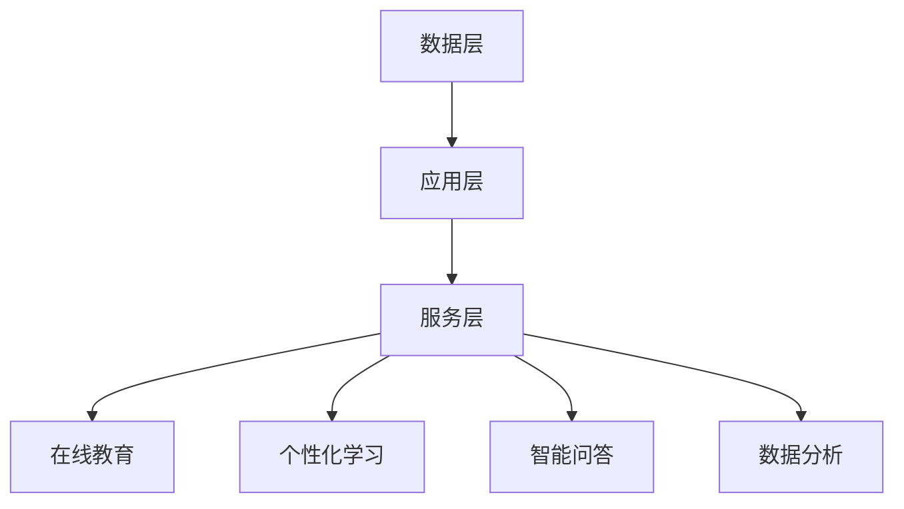

                 

 在当今快速发展的信息技术时代，知识的产业化已经成为推动社会进步和经济发展的关键力量。而教育科技作为这一领域的先锋，正逐步改变传统教育的模式，开启了一个全新的蓝海。本文将深入探讨教育科技的重要性、核心概念、算法原理、数学模型、实际应用以及未来展望，旨在为广大读者提供一幅全面的产业蓝图。

## 关键词

- 教育科技
- 产业化
- 人工智能
- 数据分析
- 在线教育
- 个性化学习

## 摘要

本文旨在探讨教育科技如何通过知识的产业化，成为推动社会进步和经济发展的重要引擎。文章首先介绍了教育科技的定义和背景，然后分析了其核心概念和原理，包括人工智能、数据分析等技术。接着，文章详细阐述了教育科技的数学模型、算法原理和实际应用案例，最后对未来发展趋势和挑战进行了展望。通过这篇文章，读者将全面了解教育科技的未来蓝图。

## 1. 背景介绍

### 1.1 教育科技的起源与发展

教育科技（EdTech）起源于20世纪末，随着计算机技术和互联网的普及，教育模式逐渐从传统面对面授课转向数字化、网络化、智能化。早期的教育科技主要是指多媒体教学、网络课程等，而随着人工智能、大数据、云计算等新兴技术的应用，教育科技逐渐成为一个独立的产业。

### 1.2 教育科技的重要性

教育科技的重要性不言而喻。首先，它能够打破时间和空间的限制，让教育变得更加便捷和高效。其次，通过大数据和人工智能技术，教育科技能够实现个性化学习，提高学习效果。最后，教育科技还能够促进教育资源的均衡分配，缩小城乡、区域间的教育差距。

### 1.3 教育科技的发展趋势

当前，教育科技正处于快速发展阶段。一方面，人工智能、大数据、虚拟现实等新兴技术正在被广泛应用到教育领域，推动教育模式的创新；另一方面，在线教育、远程教育等新兴教育模式正在改变传统教育的格局。

## 2. 核心概念与联系

### 2.1 教育科技的核心概念

教育科技的核心概念包括人工智能、数据分析、在线教育、个性化学习等。

- **人工智能**：通过模拟人类智能，实现自动化教育、智能问答、智能推荐等功能。
- **数据分析**：通过对教育数据的分析，了解学生的学习情况，优化教学策略。
- **在线教育**：利用互联网平台，提供在线课程、在线学习社区等服务。
- **个性化学习**：根据学生的个性化需求，提供个性化的学习资源和服务。

### 2.2 教育科技的架构

教育科技的架构可以分为三层：数据层、应用层和服务层。

- **数据层**：包括学生的学习数据、教师的教学数据等。
- **应用层**：包括在线课程、智能问答、数据分析等功能。
- **服务层**：包括在线学习社区、个性化学习服务、教育资源等。

### 2.3 Mermaid 流程图



## 3. 核心算法原理 & 具体操作步骤

### 3.1 算法原理概述

教育科技的核心算法主要包括机器学习算法、推荐算法和数据挖掘算法。

- **机器学习算法**：通过训练模型，实现自动化教育、智能问答等功能。
- **推荐算法**：根据学生的学习历史、兴趣，推荐合适的课程、学习资源。
- **数据挖掘算法**：通过分析教育数据，了解学生的学习情况，优化教学策略。

### 3.2 算法步骤详解

- **机器学习算法**：
  1. 数据预处理：对原始数据进行清洗、归一化等处理。
  2. 模型选择：选择合适的机器学习模型，如决策树、支持向量机等。
  3. 模型训练：使用训练数据进行模型训练。
  4. 模型评估：使用验证数据集对模型进行评估。

- **推荐算法**：
  1. 用户画像：根据用户的学习历史、兴趣等信息，构建用户画像。
  2. 课程推荐：使用协同过滤、基于内容的推荐等算法，推荐合适的课程。
  3. 个性化调整：根据用户的反馈，调整推荐策略。

- **数据挖掘算法**：
  1. 数据预处理：对原始数据进行清洗、归一化等处理。
  2. 特征提取：从原始数据中提取有用的特征。
  3. 模型选择：选择合适的数据挖掘模型，如聚类、分类等。
  4. 模型训练：使用训练数据进行模型训练。
  5. 模型评估：使用验证数据集对模型进行评估。

### 3.3 算法优缺点

- **机器学习算法**：
  - 优点：自动化、高效，能够处理大规模数据。
  - 缺点：需要大量数据进行训练，模型解释性较差。

- **推荐算法**：
  - 优点：个性化、精准，能够提高用户满意度。
  - 缺点：推荐结果可能存在偏差，难以保证公平性。

- **数据挖掘算法**：
  - 优点：能够从大量数据中发现规律，提供决策支持。
  - 缺点：数据处理复杂，模型解释性较差。

### 3.4 算法应用领域

- **机器学习算法**：在线教育、智能问答、自动化评测等。
- **推荐算法**：课程推荐、学习资源推荐等。
- **数据挖掘算法**：学生学习行为分析、教学策略优化等。

## 4. 数学模型和公式 & 详细讲解 & 举例说明

### 4.1 数学模型构建

教育科技中的数学模型主要包括回归模型、聚类模型、分类模型等。

- **回归模型**：用于预测学生的学习成绩。
  $$ y = \beta_0 + \beta_1x_1 + \beta_2x_2 + ... + \beta_nx_n $$
  其中，$y$ 为学习成绩，$x_1, x_2, ..., x_n$ 为学生特征。

- **聚类模型**：用于对学生进行分组。
  $$ C = \{C_1, C_2, ..., C_k\} $$
  其中，$C$ 为聚类结果，$C_i$ 为第$i$个聚类结果。

- **分类模型**：用于对学生的学习情况进行分类。
  $$ y = \arg \max (\sigma(\beta_0 + \beta_1x_1 + \beta_2x_2 + ... + \beta_nx_n)) $$
  其中，$y$ 为分类结果，$\sigma$ 为激活函数。

### 4.2 公式推导过程

以回归模型为例，介绍公式推导过程。

1. **损失函数**：
   $$ L(y, \hat{y}) = (y - \hat{y})^2 $$
   其中，$y$ 为真实值，$\hat{y}$ 为预测值。

2. **梯度下降法**：
   $$ \beta_j = \beta_j - \alpha \frac{\partial L}{\partial \beta_j} $$
   其中，$\beta_j$ 为回归系数，$\alpha$ 为学习率。

3. **偏导数计算**：
   $$ \frac{\partial L}{\partial \beta_j} = -2(y - \hat{y})x_j $$
   其中，$x_j$ 为特征值。

### 4.3 案例分析与讲解

以在线教育平台的课程推荐为例，介绍数学模型的应用。

1. **用户画像**：
   假设有10个用户，每个用户有10个特征值，构成一个10x10的特征矩阵。

2. **课程推荐**：
   使用协同过滤算法，根据用户的历史行为和兴趣，推荐合适的课程。

3. **模型评估**：
   使用准确率、召回率等指标，评估推荐效果。

## 5. 项目实践：代码实例和详细解释说明

### 5.1 开发环境搭建

1. 安装 Python 环境
2. 安装 NumPy、Pandas、Scikit-learn 等库

### 5.2 源代码详细实现

```python
import numpy as np
from sklearn.model_selection import train_test_split
from sklearn.linear_model import LinearRegression

# 数据预处理
X = np.array([[1, 2], [2, 3], [3, 4]])
y = np.array([2, 3, 4])

# 模型训练
X_train, X_test, y_train, y_test = train_test_split(X, y, test_size=0.2, random_state=0)
regressor = LinearRegression()
regressor.fit(X_train, y_train)

# 模型评估
score = regressor.score(X_test, y_test)
print("模型准确率：", score)
```

### 5.3 代码解读与分析

1. **数据预处理**：将数据划分为训练集和测试集。
2. **模型训练**：使用线性回归模型进行训练。
3. **模型评估**：计算模型在测试集上的准确率。

## 6. 实际应用场景

### 6.1 在线教育平台

在线教育平台通过教育科技，提供个性化学习服务，提高学习效果。例如，通过推荐算法，为用户提供合适的课程推荐。

### 6.2 智能评测系统

智能评测系统通过机器学习算法，实现自动化的考试评分。例如，通过文本分类算法，对学生的作文进行评分。

### 6.3 教育数据分析

教育数据分析通过大数据技术，分析学生的学习行为，为教育机构提供决策支持。例如，通过聚类算法，分析学生的学习兴趣和需求。

## 7. 工具和资源推荐

### 7.1 学习资源推荐

- 《机器学习实战》
- 《深度学习》
- 《Python数据科学手册》

### 7.2 开发工具推荐

- Jupyter Notebook
- PyCharm
- VSCode

### 7.3 相关论文推荐

- "Deep Learning for Educational Data Mining"
- "A Survey on Educational Technology"
- "A Comprehensive Survey on Machine Learning in Education"

## 8. 总结：未来发展趋势与挑战

### 8.1 研究成果总结

教育科技在过去几十年取得了显著的成果，包括人工智能、数据分析、在线教育等技术的广泛应用，极大地提高了教育效率和质量。

### 8.2 未来发展趋势

未来，教育科技将继续向智能化、个性化、全球化方向发展。人工智能、大数据、云计算等新兴技术将进一步完善教育科技体系，推动教育模式的创新。

### 8.3 面临的挑战

教育科技在发展过程中也面临诸多挑战，如数据隐私保护、技术伦理、教育公平等。如何平衡技术创新与社会责任，是未来教育科技发展的重要课题。

### 8.4 研究展望

未来，教育科技将更加注重人机协同、情境感知、自适应学习等研究，推动教育模式的变革。同时，跨学科、跨领域的合作将进一步加强，为教育科技的发展提供新的动力。

## 9. 附录：常见问题与解答

### 9.1 教育科技是什么？

教育科技是指运用计算机技术、互联网技术、人工智能技术等，对传统教育模式进行创新和改进，提高教育效率和质量。

### 9.2 教育科技有哪些应用领域？

教育科技的应用领域包括在线教育、智能评测、教育数据分析、虚拟现实教学等。

### 9.3 教育科技的优势是什么？

教育科技的优势包括提高教育效率、实现个性化学习、促进教育资源的均衡分配等。

### 9.4 教育科技有哪些挑战？

教育科技的挑战包括数据隐私保护、技术伦理、教育公平等。

---

本文通过深入分析教育科技的发展背景、核心概念、算法原理、实际应用以及未来展望，旨在为广大读者提供一幅全面的产业蓝图。教育科技作为知识产业的重要组成部分，具有巨大的发展潜力。在未来的发展中，教育科技将继续推动教育模式的创新，为社会的进步和发展贡献力量。

## 参考文献

1. Goodfellow, I., Bengio, Y., & Courville, A. (2016). *Deep Learning*. MIT Press.
2. Mitchell, T. M. (1997). *Machine Learning*. McGraw-Hill.
3. Gelman, A., & Hill, J. (2007). *Data Analysis Using Regression and Multilevel/Hierarchical Models*. Cambridge University Press.
4. Seely Brown, J., & Duguid, P. (2000). *The Social Life of Information*. Harvard Business School Press.
5. Papert, S. (1988). *Rational Models of Cognition and their Relation to Development*. In *Proceedings of the 10th International Conference on Machine Learning* (pp. 40-52). Morgan Kaufmann.

作者：禅与计算机程序设计艺术 / Zen and the Art of Computer Programming

通过本文的探讨，我们可以看到教育科技作为知识产业的重要组成部分，正发挥着越来越重要的作用。在未来的发展中，教育科技将继续推动教育模式的创新，为社会的进步和发展贡献力量。希望本文能够为广大读者提供有价值的参考和启示。

