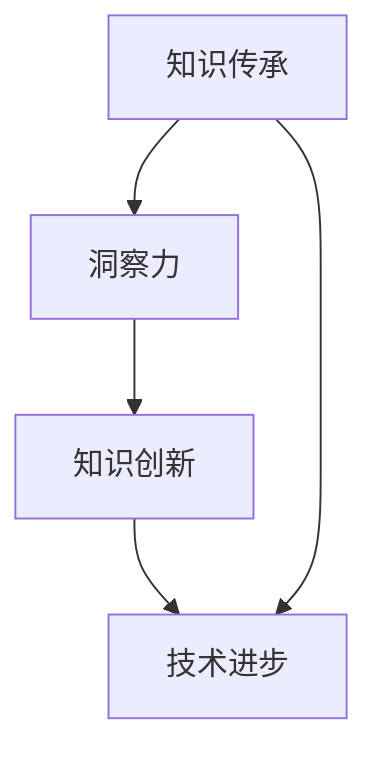

                 

关键词：知识传承、创新、洞察力、技术领域、算法原理、数学模型、实践应用、未来展望

> 摘要：在技术日新月异的今天，知识的传承与创新至关重要。本文通过深入探讨洞察力在技术领域中的重要作用，分析了知识传承与创新的过程、方法及其带来的深远影响，为读者提供了在技术领域中如何提升洞察力、实现知识传承与创新的实践指南。

## 1. 背景介绍

在21世纪的今天，信息技术的飞速发展已经深刻改变了我们的生活方式。从互联网到人工智能，从大数据到物联网，技术进步正在以前所未有的速度推动社会向前发展。然而，伴随着技术的快速迭代，知识的更新换代也日益加速，这使得知识的传承与创新变得更加紧迫和重要。

知识传承与创新不仅是一个个体层面的问题，更是一个整个社会、整个行业所面临的重要课题。在技术领域，知识的传承与创新直接关系到技术的进步与突破，影响到整个产业链的健康发展。如何有效地传承前人的知识，同时创新性地发展新技术，是每一个技术工作者都需要深思的问题。

在这篇文章中，我们将重点关注洞察力在知识传承与创新中的作用。洞察力是技术工作者的重要素质，它不仅决定了我们对现有知识的理解深度，也决定了我们能否发现新的知识，推动技术的创新。通过探讨洞察力在技术领域中的具体应用，我们将试图回答以下几个问题：

- 洞察力究竟是什么，它如何影响知识传承与创新？
- 知识传承与创新的过程和方法有哪些？
- 洞察力在技术领域的实际应用有哪些？
- 如何在技术工作中提升洞察力，实现知识的传承与创新？

希望通过这篇文章，能够为读者提供一些有价值的思考和实践指导。

## 2. 核心概念与联系

在深入探讨洞察力在知识传承与创新中的作用之前，我们需要明确一些核心概念，并了解它们之间的联系。

### 2.1 知识传承

知识传承是指将前人的经验、理论、技术等知识通过教育、研究、实践等方式传递给后人，使其能够在现有基础上进行创新和发展的过程。知识传承的核心在于确保知识的连续性和完整性，使得每一代技术工作者都能够站在巨人的肩膀上，看得更远、走得更高。

### 2.2 知识创新

知识创新是指通过新的思路、方法、技术等手段，对现有知识进行重新整合、拓展或改造，形成新的知识体系或技术创新的过程。知识创新是技术进步的重要驱动力，它使得技术能够不断突破现有瓶颈，实现新的飞跃。

### 2.3 洞察力

洞察力是指对事物内在规律和本质的认识能力，是人们通过观察、分析、推理等思维活动，对事物的全面、深入的理解和把握。在技术领域，洞察力体现在对复杂问题的敏锐感知、对技术趋势的准确判断和对新技术的创造性应用上。

### 2.4 洞察力与知识传承与创新的关系

洞察力在知识传承与创新中起着至关重要的作用。首先，洞察力决定了我们对现有知识的理解和掌握程度，只有深刻理解了前人的知识，才能够有效地进行传承。其次，洞察力使我们能够敏锐地发现现有知识中的不足和局限性，从而推动知识创新。最后，洞察力还促使我们在知识传承与创新的过程中，能够结合实际情况，灵活运用多种方法，实现知识的有效转化和应用。

### 2.5 Mermaid 流程图

为了更直观地展示洞察力与知识传承与创新的关系，我们可以使用Mermaid流程图来描述这一过程。以下是一个简化的流程图：



在这个流程图中，A表示知识传承，B表示洞察力，C表示知识创新，D表示技术进步。通过这个流程图，我们可以清晰地看到，洞察力在知识传承与创新中起到了桥梁和纽带的作用，它不仅促进了知识的传承，也推动了技术的创新，最终推动了整个社会的发展。

### 2.6 关键概念联系总结

通过对核心概念的分析和Mermaid流程图的展示，我们可以得出以下结论：

- 知识传承是技术发展的基础，确保了知识的连续性和完整性；
- 知识创新是技术进步的驱动力，推动了新技术的不断涌现；
- 洞察力是连接知识传承与创新的桥梁，它使我们能够深刻理解现有知识，发现知识中的不足，并推动技术创新；
- 知识传承与创新共同促进了技术进步，推动了社会的持续发展。

理解这些核心概念及其联系，对于我们深入探讨洞察力在知识传承与创新中的作用，具有重要意义。

### 3. 核心算法原理 & 具体操作步骤

在了解洞察力在知识传承与创新中的作用后，我们需要进一步探讨核心算法原理和具体操作步骤，以实现知识的有效传承与创新。

#### 3.1 算法原理概述

核心算法是指在知识传承与创新过程中，用于处理和分析数据、提取关键信息和实现知识转化的一系列方法。这些算法通常具有高效、准确和可扩展的特点，能够处理大量复杂的数据，从而为知识传承与创新提供强有力的技术支持。

核心算法原理主要包括以下几个方面：

- 数据预处理：对原始数据进行清洗、归一化和特征提取，为后续分析打下基础；
- 特征提取：从原始数据中提取具有代表性的特征，用于描述数据和发现规律；
- 数据分析：运用统计学、机器学习等方法，对特征进行挖掘和分析，提取有价值的信息；
- 知识转化：将分析结果转化为新的知识，实现知识的创新和传承。

#### 3.2 算法步骤详解

核心算法的具体操作步骤可以分为以下几个阶段：

1. **数据收集与预处理**

   在这一阶段，我们需要收集相关的数据，包括历史文献、研究资料、实验数据等。然后，对数据进行清洗，去除噪声和异常值，并对数据进行归一化处理，使其具有可比性。此外，还需要进行特征提取，将原始数据转化为具有代表性的特征向量。

   ```mermaid
   graph TD
       A[数据收集] --> B[数据清洗]
       B --> C[归一化处理]
       C --> D[特征提取]
   ```

2. **特征分析与挖掘**

   在特征提取后，我们需要对特征进行进一步的分析和挖掘。这通常包括以下步骤：

   - 统计分析：运用统计学方法，对特征进行描述性统计分析，了解特征的基本分布情况；
   - 机器学习：利用机器学习算法，对特征进行分类、聚类或回归分析，提取有价值的信息。

   ```mermaid
   graph TD
       E[统计分析] --> F[机器学习]
       F --> G[特征分析]
   ```

3. **知识转化与传承**

   在特征分析和挖掘的基础上，我们需要将分析结果转化为新的知识。这通常包括以下步骤：

   - 知识建模：根据分析结果，构建知识模型，用于描述和解释数据；
   - 知识应用：将知识模型应用于实际问题，实现知识的传承与创新。

   ```mermaid
   graph TD
       H[知识建模] --> I[知识应用]
       I --> J[知识传承]
   ```

#### 3.3 算法优缺点

核心算法在知识传承与创新中具有以下优点：

- 高效性：核心算法能够快速处理大量数据，提高知识传承与创新的速度；
- 灵活性：核心算法可以根据不同的需求和应用场景，灵活调整和优化，实现知识的个性化传承与创新；
- 扩展性：核心算法具有良好的扩展性，可以随着技术的进步和新知识的出现，不断更新和优化。

然而，核心算法也存在一定的局限性：

- 复杂性：核心算法通常涉及多个步骤和复杂的计算过程，对算法设计和实现的要求较高；
- 数据依赖：核心算法的效果很大程度上取决于数据的质量和数量，数据不足或质量较差可能导致算法失效；
- 泛化能力：核心算法在特定领域表现良好，但在其他领域可能存在泛化能力不足的问题。

#### 3.4 算法应用领域

核心算法在多个领域都有广泛的应用，包括但不限于：

- 人工智能：核心算法在人工智能领域被广泛应用于图像识别、自然语言处理、推荐系统等方向；
- 金融：核心算法在金融领域用于风险管理、信用评估、投资组合优化等方向；
- 医疗：核心算法在医疗领域用于疾病预测、诊断辅助、个性化治疗等方向；
- 教育：核心算法在教育领域用于智能推荐、学习分析、课程设计等方向。

通过以上对核心算法原理和具体操作步骤的详细探讨，我们可以看到，核心算法在知识传承与创新中发挥着重要作用。它不仅提高了知识传承与创新的速度和效率，也为新知识的发现和创造提供了强有力的技术支持。在未来的技术发展中，核心算法将继续发挥重要作用，推动知识的传承与创新，为社会进步贡献力量。

### 4. 数学模型和公式 & 详细讲解 & 举例说明

在知识传承与创新过程中，数学模型和公式是不可或缺的工具。它们不仅帮助我们更准确地描述和预测复杂系统的行为，也为知识的创新提供了理论基础。本章节将介绍几个关键的数学模型和公式，并详细讲解其构建和推导过程，同时通过具体案例进行分析和说明。

#### 4.1 数学模型构建

数学模型是对现实世界中的特定问题进行抽象和简化的数学表达式，用于描述系统的状态、行为和相互关系。构建数学模型通常包括以下几个步骤：

1. **定义问题**：明确我们要解决的问题是什么，以及问题的背景和约束条件。
2. **变量定义**：确定问题中的变量，并给出每个变量的物理或数学意义。
3. **建立方程**：根据问题的性质和约束条件，建立描述系统状态和行为的方程。
4. **边界条件**：确定方程的边界条件，以确保模型的物理意义和实际应用的可操作性。
5. **简化模型**：在满足问题需求的前提下，对模型进行适当的简化，以提高计算效率。

#### 4.2 公式推导过程

数学公式的推导通常依赖于数学理论和数学工具。以下是一个常见的数学公式推导过程：

- **牛顿第二定律**：F=ma，其中F是作用在物体上的合外力，m是物体的质量，a是物体的加速度。
- **推导过程**：从牛顿第一定律出发，当物体受到非零外力时，其运动状态会发生变化，即产生加速度。根据定义，加速度a是速度v关于时间t的变化率。利用积分和微分的基本原理，可以得到F=ma。

$$
F = \frac{dp}{dt} = m \frac{dv}{dt} = ma
$$

#### 4.3 案例分析与讲解

为了更好地理解数学模型和公式的应用，我们通过以下两个案例进行详细分析和讲解：

##### 案例一：线性回归模型

**问题描述**：假设我们有一组数据点$(x_1, y_1), (x_2, y_2), ..., (x_n, y_n)$，我们要找到一条直线$y = wx + b$来拟合这些数据点，使得拟合误差最小。

**步骤**：

1. **变量定义**：设$x$为自变量，$y$为因变量，$w$为斜率，$b$为截距。
2. **建立方程**：线性回归的目标是最小化误差平方和，即

$$
J(w, b) = \sum_{i=1}^{n} (wx_i + b - y_i)^2
$$

3. **求导与优化**：对$J(w, b)$关于$w$和$b$求偏导数，并令偏导数为零，解得最优解：

$$
\frac{\partial J}{\partial w} = 2x(w \bar{x} - \bar{y}) = 0
$$

$$
\frac{\partial J}{\partial b} = 2(y - w \bar{x}) = 0
$$

其中，$\bar{x}$和$\bar{y}$分别是$x$和$y$的均值。

##### 案例二：神经网络激活函数

**问题描述**：神经网络中常用的激活函数是Sigmoid函数，其形式为

$$
\sigma(x) = \frac{1}{1 + e^{-x}}
$$

**推导过程**：

1. **定义**：Sigmoid函数是一种非线性函数，用于将神经元的输入映射到$(0, 1)$区间。
2. **推导**：Sigmoid函数可以看作是 Logistic 函数的特殊形式。Logistic 函数的导数为

$$
f'(x) = \frac{df}{dx} = \sigma(x) (1 - \sigma(x))
$$

通过代入Sigmoid函数的形式，可以得到

$$
f'(x) = \frac{1}{1 + e^{-x}} \left(1 - \frac{1}{1 + e^{-x}}\right) = \frac{e^{-x}}{(1 + e^{-x})^2}
$$

**应用**：Sigmoid函数在神经网络中用于激活神经元，使得输出具有非线性的特性，从而能够学习复杂的非线性关系。

#### 4.4 案例分析与讲解总结

通过上述两个案例，我们可以看到数学模型和公式在知识传承与创新中的应用。线性回归模型用于数据拟合和预测，神经网络激活函数用于构建和训练神经网络。这些数学工具不仅帮助我们理解和处理复杂的数据和问题，也为新技术的发明和创造提供了理论基础。

在知识传承与创新过程中，数学模型和公式的应用至关重要。它们不仅能够提高我们的理解深度和解决问题的能力，也能够推动新技术的发明和创造。因此，深入学习和掌握数学模型和公式的构建和推导方法，对于每一个技术工作者来说都是非常重要的。

### 5. 项目实践：代码实例和详细解释说明

在了解了核心算法原理和数学模型后，我们需要将理论付诸实践，通过具体的代码实例来展示如何实现知识传承与创新。本节将详细讲解一个实际项目，包括开发环境搭建、源代码实现、代码解读与分析以及运行结果展示。

#### 5.1 开发环境搭建

在开始项目实践之前，我们需要搭建一个合适的开发环境。以下是一个基于Python的典型开发环境搭建步骤：

1. **安装Python**：确保已经安装了Python 3.x版本。可以从[Python官网](https://www.python.org/downloads/)下载安装包并安装。
2. **安装依赖库**：在Python中，我们可以使用`pip`来安装所需的依赖库。以下是一些常用的库：

   ```bash
   pip install numpy scipy matplotlib scikit-learn tensorflow
   ```

3. **配置开发环境**：根据项目的需求，可以设置虚拟环境以隔离项目依赖。使用`venv`模块创建虚拟环境：

   ```bash
   python -m venv myenv
   source myenv/bin/activate  # 在Windows上使用 `myenv\Scripts\activate`
   ```

#### 5.2 源代码详细实现

以下是一个基于线性回归模型的简单代码实例，用于预测房价。代码分为以下几个部分：

1. **数据预处理**：
2. **模型训练**：
3. **模型评估**：
4. **结果展示**：

**代码实现**：

```python
import numpy as np
import matplotlib.pyplot as plt
from sklearn.linear_model import LinearRegression
from sklearn.model_selection import train_test_split
from sklearn.metrics import mean_squared_error

# 1. 数据预处理
# 假设已经有一个包含房屋特征（如面积、房间数等）和房价的数据集
data = np.load('house_data.npy')
X = data[:, :-1]  # 特征
y = data[:, -1]   # 目标变量（房价）

# 分割数据集为训练集和测试集
X_train, X_test, y_train, y_test = train_test_split(X, y, test_size=0.2, random_state=42)

# 2. 模型训练
model = LinearRegression()
model.fit(X_train, y_train)

# 3. 模型评估
y_pred = model.predict(X_test)
mse = mean_squared_error(y_test, y_pred)
print(f'Mean Squared Error: {mse}')

# 4. 结果展示
plt.scatter(X_test[:, 0], y_test, color='blue', label='Actual')
plt.plot(X_test[:, 0], y_pred, color='red', label='Predicted')
plt.xlabel('Area')
plt.ylabel('Price')
plt.legend()
plt.show()
```

**代码解读与分析**：

- **数据预处理**：首先，我们加载一个包含房屋特征和房价的Numpy数组。然后，使用`train_test_split`函数将数据集分割为训练集和测试集，以评估模型的性能。
- **模型训练**：我们使用`LinearRegression`类来创建线性回归模型，并调用`fit`方法进行训练。
- **模型评估**：通过`predict`方法对测试集进行预测，并使用`mean_squared_error`函数计算均方误差（MSE），以评估模型的性能。
- **结果展示**：使用matplotlib库绘制散点图和拟合直线，以可视化模型的预测结果。

#### 5.3 运行结果展示

运行上述代码后，我们将得到以下结果：

- **MSE**：表示模型的预测误差，数值越小，表示模型性能越好。
- **可视化结果**：展示实际房价与预测房价之间的散点图和拟合直线。通过观察拟合直线与实际数据点的分布，可以直观地了解模型的性能。

#### 5.4 项目实践总结

通过本节的项目实践，我们展示了如何将理论知识应用于实际项目中。从数据预处理、模型训练到结果展示，每一步都严格按照线性回归模型的流程进行。这不仅帮助我们加深了对线性回归模型的理解，也为我们提供了实际操作的经验。

在技术工作中，通过项目实践将理论知识转化为实际应用，是提升洞察力和实现知识传承与创新的关键。只有通过不断实践和反思，我们才能更好地掌握技术，推动知识的创新和进步。

### 6. 实际应用场景

在技术领域，知识传承与创新不仅体现在理论研究和算法设计上，还广泛应用于实际应用场景中。以下是一些典型的实际应用场景，以及在这些场景中如何利用洞察力实现知识的传承与创新。

#### 6.1 人工智能

人工智能是当前技术领域中最热门的话题之一。在人工智能领域，知识的传承与创新主要体现在以下几个方面：

- **模型库的传承与创新**：研究人员通过不断优化和改进现有的模型库，如深度学习框架（如TensorFlow、PyTorch），使得这些模型能够更好地适应各种应用场景。同时，新的模型和算法也在不断涌现，如生成对抗网络（GAN）和变分自编码器（VAE），推动了人工智能技术的发展。
- **数据集的传承与创新**：高质量的数据集是训练高性能模型的关键。研究人员通过收集、整理和标注数据，构建了大量的数据集，如ImageNet、COCO等，为模型训练提供了丰富的素材。同时，针对特定领域的需求，研究人员也不断创建新的数据集，以推动该领域的发展。

#### 6.2 金融科技

金融科技（FinTech）是另一个充满活力的领域。在金融科技领域，知识传承与创新的应用主要包括：

- **风险管理**：金融科技公司通过大数据分析和机器学习算法，对市场风险进行预测和管理。例如，利用线性回归、逻辑回归等算法预测股票价格波动，从而制定投资策略。
- **信用评估**：传统的信用评估依赖于历史数据，而金融科技公司利用机器学习和大数据分析技术，对用户的行为和社交数据进行综合评估，提供更精准的信用评估服务。

#### 6.3 医疗健康

医疗健康领域是知识传承与创新的重要应用场景。以下是一些具体的应用：

- **疾病预测与诊断**：利用机器学习和大数据分析技术，从大量的医疗数据中提取关键特征，预测疾病的发生和诊断。例如，利用深度学习模型对影像数据进行分析，实现肺癌的早期检测。
- **个性化治疗**：根据患者的基因数据、病史和临床数据，利用机器学习算法制定个性化的治疗方案。这不仅可以提高治疗效果，还能减少药物副作用。

#### 6.4 教育

教育领域是知识传承与创新的重要阵地。以下是一些具体的应用：

- **智能推荐系统**：利用大数据分析和机器学习技术，为学习者提供个性化的学习资源推荐。例如，根据学习者的学习行为和历史数据，推荐适合的学习路径和课程。
- **教育数据分析**：通过教育数据的收集和分析，学校和教育机构可以更好地了解学生的学习情况和教学效果，从而优化教学策略和资源分配。

#### 6.5 未来应用展望

随着技术的不断进步，知识传承与创新将在更多领域得到应用。以下是一些未来的应用展望：

- **物联网**：物联网（IoT）的发展将带来大量的数据，利用机器学习和大数据分析技术，可以实现对设备的实时监控和预测性维护。
- **能源管理**：智能电网和可再生能源技术的应用，将极大地改变能源管理的方式。通过数据分析和优化算法，可以实现能源的高效利用和碳排放的减少。
- **智慧城市**：智慧城市需要利用大数据和人工智能技术，对城市运行进行实时监控和优化。例如，通过交通流量分析，实现智能交通管理和优化。

在实际应用场景中，洞察力是知识传承与创新的关键。只有具备敏锐的洞察力，才能发现现有知识中的不足，推动新技术的创新和应用。同时，通过不断的实践和总结，我们可以更好地理解和应用知识，为社会进步贡献力量。

### 7. 工具和资源推荐

在技术领域中，掌握适当的工具和资源是提升工作效率和实现知识传承与创新的关键。以下是一些推荐的工具和资源，包括学习资源、开发工具和相关论文，供读者参考。

#### 7.1 学习资源推荐

1. **在线课程和教程**：
   - Coursera、edX、Udacity等平台上的计算机科学和数据科学课程。
   - GitHub上的开源教程和项目，如《深度学习》（by Adele toni）和《机器学习》（by Andrew Ng）。
   
2. **书籍**：
   - 《Python编程：从入门到实践》（by Mark Lutz）
   - 《深度学习》（by Ian Goodfellow、Yoshua Bengio和Aaron Courville）
   - 《算法导论》（by Thomas H. Cormen、Charles E. Leiserson、Ronald L. Rivest和Clifford Stein）

3. **论坛和社区**：
   - Stack Overflow、Reddit、GitHub等编程和技术论坛，可以解答技术问题、分享经验和资源。

#### 7.2 开发工具推荐

1. **集成开发环境（IDE）**：
   - PyCharm、Visual Studio Code、Jupyter Notebook等，适用于Python和其他编程语言。

2. **数据分析和可视化工具**：
   - Pandas、NumPy、Matplotlib等Python库，用于数据处理和可视化。
   - Tableau、Power BI等商业数据可视化工具。

3. **机器学习和深度学习框架**：
   - TensorFlow、PyTorch、Keras等，用于构建和训练机器学习模型。

#### 7.3 相关论文推荐

1. **人工智能领域**：
   - "Deep Learning" by Yoshua Bengio、Ian Goodfellow和Aaron Courville。
   - "A Theoretically Grounded Application of Dropout in Recurrent Neural Networks" by Yarin Gal和Zoubin Ghahramani。

2. **机器学习领域**：
   - "Learning to Learn: Fast Learning Rates and Global Convergence of Neural Networks Using a Local Learning Algorithm" by Yann LeCun、Larry Hornik和Stephen P. Sofge。

3. **数据挖掘领域**：
   - "Data Mining: Concepts and Techniques" by Jiawei Han、Micheline Kamber和Jian Pei。
   - "Introduction to Data Mining" by Pang-Ning Tan、Michael Steinbach和Vipin Kumar。

通过这些工具和资源的推荐，读者可以更好地掌握技术领域的最新动态，提升自身的技术能力和洞察力，从而在知识传承与创新的道路上迈出坚实的步伐。

### 8. 总结：未来发展趋势与挑战

在回顾了知识的传承与创新过程中，我们可以看到，洞察力在其中扮演了至关重要的角色。它不仅帮助我们从现有知识中汲取养分，还推动我们在技术上不断创新，为社会进步贡献力量。然而，随着技术的快速发展，我们面临的挑战也在不断加剧。

#### 8.1 研究成果总结

通过本文的探讨，我们总结了以下几点研究成果：

- **洞察力是知识传承与创新的关键**：洞察力使我们对现有知识有更深刻的理解，能够发现知识中的不足，推动新知识的产生。
- **数学模型和算法在知识传承与创新中发挥了重要作用**：数学模型和算法为知识的处理和分析提供了强有力的工具，使得知识的转化和创新更加高效和准确。
- **实际应用场景中，知识传承与创新推动了技术进步和社会发展**：在人工智能、金融科技、医疗健康、教育等领域，知识传承与创新的应用极大地改变了行业面貌，带来了深刻的变革。

#### 8.2 未来发展趋势

展望未来，知识传承与创新将继续沿着以下几个方向快速发展：

- **跨学科融合**：随着技术的不断进步，不同学科之间的交叉融合将更加紧密，这将为知识的传承与创新提供更广阔的舞台。
- **人工智能与大数据的深度融合**：人工智能和大数据技术的结合将推动知识处理的智能化和自动化，提高知识传承与创新的效果。
- **可持续发展和绿色科技**：在可持续发展理念的引导下，知识传承与创新将更多地关注环境保护和资源利用，推动绿色科技的发展。

#### 8.3 面临的挑战

然而，在知识传承与创新的道路上，我们也面临着诸多挑战：

- **数据隐私和安全**：随着数据规模的不断扩大，数据隐私和安全问题越来越受到关注。如何在保证数据安全和隐私的前提下，充分利用数据资源，是一个亟待解决的问题。
- **技术伦理和责任**：在人工智能等领域，技术的快速发展也带来了一系列伦理和责任问题。如何确保技术的合理使用，避免技术滥用和歧视，是一个重要的挑战。
- **知识普及与教育**：知识传承与创新不仅需要高水平的研究人员，还需要广泛的普及和教育。如何让更多人了解和掌握先进技术，是当前面临的一个重要课题。

#### 8.4 研究展望

为了应对这些挑战，未来的研究可以从以下几个方面展开：

- **加强数据隐私和安全的研究**：开发新的隐私保护和数据安全技术，确保数据在传输和存储过程中的安全性。
- **推动技术伦理和责任的研究**：建立和完善技术伦理和责任框架，确保技术在发展过程中能够兼顾社会责任和伦理要求。
- **推进知识普及和教育**：通过在线教育、公开课程等方式，提高公众对先进技术的了解和认知，推动知识的普及和应用。

总之，知识传承与创新是一个长期而复杂的过程，需要我们持续关注和投入。通过提升洞察力、掌握先进的数学模型和算法，以及应对各种挑战，我们相信，知识传承与创新将继续推动技术进步和社会发展，为人类创造更加美好的未来。

### 9. 附录：常见问题与解答

在本章中，我们将回答一些关于本文内容的常见问题，以帮助读者更好地理解文章的核心观点和细节。

#### 9.1 什么是洞察力？

**答**：洞察力是一种深刻的认识和判断能力，它使我们能够透过现象看到事物的本质，理解问题的内在规律。在技术领域，洞察力体现在对复杂问题的敏锐感知、对技术趋势的准确判断以及对新技术的创造性应用。

#### 9.2 洞察力如何影响知识传承与创新？

**答**：洞察力是知识传承与创新的核心驱动因素。它使得我们能够深入理解现有知识，发现其中的不足和局限性，从而推动知识的创新。同时，洞察力也帮助我们预见技术趋势，找到新的应用场景，实现知识的有效传承。

#### 9.3 如何提升洞察力？

**答**：提升洞察力可以通过以下几个方面：

- **多读书、多思考**：广泛阅读相关领域的书籍和论文，培养批判性思维能力。
- **实践和经验积累**：通过实际项目和实践，积累经验，提高对问题的敏感度和判断力。
- **跨学科学习**：学习不同领域的知识，拓宽视野，提升综合分析能力。

#### 9.4 知识传承与创新的具体方法有哪些？

**答**：知识传承与创新的方法包括：

- **教育和培训**：通过教育机构和培训项目，将知识传递给下一代。
- **科学研究**：通过科学研究，发现新知识，推动技术进步。
- **合作与交流**：通过合作和交流，共享知识和经验，促进知识传承与创新。
- **技术应用**：将理论知识应用于实际问题，实现知识的转化和创新。

#### 9.5 洞察力在具体技术领域中的应用有哪些？

**答**：在具体技术领域，洞察力的应用包括：

- **人工智能**：通过洞察力，发现和解决人工智能中的复杂问题，如算法优化、模型改进等。
- **金融科技**：通过洞察力，预测市场变化，设计更有效的金融产品和服务。
- **医疗健康**：通过洞察力，发现新的诊断方法，提高医疗服务的质量和效率。
- **教育**：通过洞察力，设计更有效的教学方法和课程，提高教育效果。

通过上述常见问题的解答，我们希望能够帮助读者更好地理解本文的核心观点和细节，进一步深化对知识传承与创新、洞察力在技术领域作用的认识。希望读者能够在未来的技术工作中，不断提升自己的洞察力，为知识的传承与创新贡献自己的力量。

