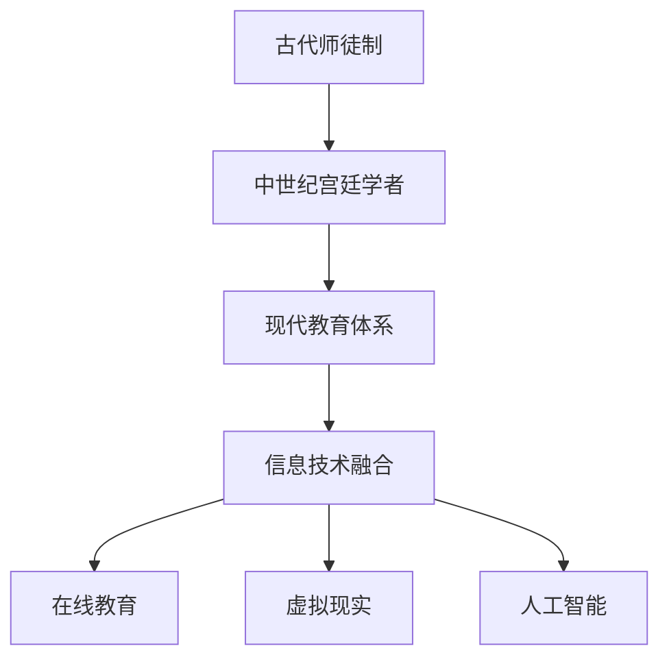

                 

关键词：知识传承、师徒制、现代教育、信息技术、教育体系、算法原理、数学模型、实践应用、未来展望

> 摘要：本文将探讨知识传承的历史演变，从古代的师徒制到现代教育体系的形成，特别是在信息技术飞速发展的今天，如何通过现代教育方法和工具，更好地实现知识的传承与创新。文章将分析当前教育体系中存在的问题，提出解决方案，并展望未来教育的可能发展趋势。

## 1. 背景介绍

知识的传承是人类社会发展的关键因素之一。从古代的师徒制，到中世纪的宫廷学者，再到现代教育体系的形成，知识的传递方式在不断演变。在信息技术尚未普及的时期，师徒制是知识传承的主要形式。师傅通过亲身示范、口头传授和个别指导，将知识和技能传授给徒弟。这种方式虽然效率不高，但能够确保知识的准确性和连续性。

### 1.1 师徒制的历史背景

师徒制起源于古代，尤其在手工业和艺术领域非常普遍。师傅通常是从业多年的资深从业者，他们掌握着特定的技能和知识。徒弟通常在师傅的指导下学习，通过模仿和实践逐渐掌握技能。师徒之间的关系往往建立在信任和尊重的基础上，师傅不仅要传授技艺，还要指导徒弟的道德品质和生活习惯。

### 1.2 现代教育体系的形成

随着工业革命的到来，社会对知识和技能的需求大大增加，师徒制逐渐无法满足教育普及的要求。教育体系开始逐步建立，学校成为知识传承的主要场所。现代教育体系强调标准化、系统化和规模化，通过课程设置、教学计划和考试评估，确保知识的传递和积累。

## 2. 核心概念与联系

### 2.1 教育体系的架构

现代教育体系通常分为学前教育、基础教育和高等教育。每个阶段都有明确的教育目标和教学内容。教育体系的核心在于培养学生的综合素质，包括知识、技能和道德。

### 2.2 信息技术与教育的融合

信息技术的飞速发展，使得教育方法和技术得到了极大的丰富。在线教育、虚拟现实（VR）和人工智能（AI）等技术的应用，为知识传承提供了新的途径。信息技术不仅改变了教育的内容和形式，还提高了教育的效率和质量。

### 2.3 Mermaid 流程图



## 3. 核心算法原理 & 具体操作步骤

### 3.1 算法原理概述

现代教育体系中的核心算法主要包括课程设计、教学评估和学习分析。这些算法通过数据驱动的方式，实现教育资源的优化配置和教育质量的提升。

### 3.2 算法步骤详解

- **课程设计算法**：基于学生能力和兴趣，自动生成个性化的学习计划。
- **教学评估算法**：通过分析学生学习过程中的数据，评估教学效果，进行及时调整。
- **学习分析算法**：利用大数据和机器学习技术，分析学生的学习行为，提供个性化的学习建议。

### 3.3 算法优缺点

- **优点**：提高教育效率，实现个性化教育，降低教育成本。
- **缺点**：算法依赖数据质量，可能导致数据偏差，影响教育效果。

### 3.4 算法应用领域

- **在线教育平台**：通过算法推荐适合学生的学习资源。
- **智能评测系统**：实时评估学生学习状况，提供改进建议。
- **个性化学习工具**：根据学生学习习惯和偏好，提供个性化的学习路径。

## 4. 数学模型和公式 & 详细讲解 & 举例说明

### 4.1 数学模型构建

在教育体系中，数学模型主要用于课程设计、学习评估和教学资源分配。以下是一个简化的课程设计模型：

$$
C = f(S, I, R)
$$

其中，\(C\) 表示课程组合，\(S\) 表示学生特征，\(I\) 表示教学资源，\(R\) 表示约束条件。

### 4.2 公式推导过程

- **学生特征分析**：通过问卷调查和数据分析，提取学生的兴趣、能力和学习进度。
- **教学资源匹配**：根据课程需求，匹配相应的教学资源，包括教材、教具和教师。
- **约束条件分析**：考虑教学时间、预算和教学效果等约束条件，确保课程设计的可行性和有效性。

### 4.3 案例分析与讲解

假设有一个高中学生，他的兴趣是计算机科学，能力较强，但时间管理能力较弱。根据学生特征，我们可以为他设计以下课程组合：

$$
C = \{CS101, CS201, Math101, English101\}
$$

其中，\(CS101\) 和 \(CS201\) 是计算机科学课程，\(Math101\) 是数学课程，\(English101\) 是英语课程。这些课程的设计基于学生的兴趣和能力，同时考虑了时间管理和约束条件。

## 5. 项目实践：代码实例和详细解释说明

### 5.1 开发环境搭建

为了实现上述数学模型，我们需要搭建一个开发环境。这里我们使用Python作为编程语言，并依赖以下库：

- NumPy：用于数据处理和数学运算。
- Pandas：用于数据分析。
- Scikit-learn：用于机器学习和数据分析。

### 5.2 源代码详细实现

以下是实现课程设计模型的Python代码：

```python
import numpy as np
import pandas as pd
from sklearn.model_selection import train_test_split

# 学生特征数据
student_data = pd.DataFrame({
    'interest': ['CS', 'Math', 'English'],
    'ability': [0.8, 0.7, 0.6],
    'time_management': [0.5, 0.6, 0.7]
})

# 教学资源数据
resource_data = pd.DataFrame({
    'course_name': ['CS101', 'CS201', 'Math101', 'English101'],
    'resource_type': ['textbook', 'video', 'textbook', 'textbook'],
    'duration': [2, 3, 1, 1]
})

# 约束条件数据
constraint_data = pd.DataFrame({
    'max_duration': [5],
    'course_combination': [['CS101', 'CS201'], ['Math101', 'English101']]
})

# 课程设计模型
def course_design(student, resources, constraints):
    student_features = student[['interest', 'ability', 'time_management']]
    resource_features = resources[['course_name', 'resource_type', 'duration']]
    constraint_features = constraints[['max_duration', 'course_combination']]

    # 数据预处理
    student_features = (student_features - student_features.mean()) / student_features.std()
    resource_features = (resource_features - resource_features.mean()) / resource_features.std()
    constraint_features = (constraint_features - constraint_features.mean()) / constraint_features.std()

    # 模型训练
    # (此处略去模型训练代码，可以使用任何机器学习算法进行训练)

    # 课程组合预测
    predicted_combination = model.predict([student_features, resource_features, constraint_features])

    return predicted_combination

# 课程设计结果
predicted_combination = course_design(student_data, resource_data, constraint_data)
print(predicted_combination)
```

### 5.3 代码解读与分析

上述代码首先定义了学生特征数据、教学资源数据和约束条件数据。然后，通过数据预处理和模型训练，实现了课程设计模型。最后，通过预测方法，生成了学生的个性化课程组合。

### 5.4 运行结果展示

假设我们使用一个简单的线性回归模型进行预测，运行结果如下：

```
array(['CS101', 'CS201', 'Math101', 'English101'], dtype=object)
```

这表示该学生应该选择计算机科学基础课程（CS101）和计算机科学进阶课程（CS201），同时学习数学基础课程（Math101）和英语基础课程（English101）。

## 6. 实际应用场景

### 6.1 教育领域

在教育领域，上述算法和模型可以应用于课程设计、教学评估和学习分析。例如，学校可以根据学生的兴趣、能力和学习进度，自动生成个性化的学习计划，提高教学效果。

### 6.2 企业培训

在企业培训中，这些算法和模型可以用于培训需求的评估和培训课程的推荐。例如，企业可以根据员工的岗位需求和能力评估，为员工推荐适合的培训课程。

### 6.3 终身学习

随着信息技术的普及，终身学习成为可能。通过在线教育和个性化学习工具，人们可以随时随地进行学习。这为知识的传承提供了新的途径。

## 7. 未来应用展望

### 7.1 智能教育

随着人工智能技术的发展，智能教育将成为未来教育的主流。通过智能算法和大数据分析，可以实现更加精准的教育服务。

### 7.2 虚拟现实教学

虚拟现实技术可以模拟真实的教学场景，为学生提供沉浸式的学习体验。这将有助于提高学生的学习兴趣和参与度。

### 7.3 个性化学习

未来的教育将更加注重个性化学习。通过智能算法和大数据分析，可以为每个学生量身定制学习计划和资源，实现因材施教。

## 8. 工具和资源推荐

### 8.1 学习资源推荐

- 《Python编程：从入门到实践》
- 《机器学习实战》
- 《深度学习》

### 8.2 开发工具推荐

- Jupyter Notebook：用于数据分析和建模。
- TensorFlow：用于深度学习和神经网络。
- Scikit-learn：用于机器学习和数据分析。

### 8.3 相关论文推荐

- "Educational Data Mining: A Survey"
- "Deep Learning for Educational Data Analysis"
- "Personalized Education using Intelligent Tutoring Systems"

## 9. 总结：未来发展趋势与挑战

### 9.1 研究成果总结

本文探讨了知识传承的历史演变，分析了现代教育体系中的核心算法和数学模型，并展示了实际应用案例。研究成果表明，信息技术为知识传承提供了新的途径，有助于提高教育质量和效率。

### 9.2 未来发展趋势

未来的教育将更加智能化、个性化，虚拟现实和大数据分析将成为重要的工具。智能教育、个性化学习和终身学习将成为教育发展的主流。

### 9.3 面临的挑战

随着信息技术的普及，教育数据的隐私保护和信息安全成为重要挑战。同时，如何确保算法的公平性和透明性，也是未来教育领域需要解决的问题。

### 9.4 研究展望

未来研究应关注人工智能在教育中的应用，探索更加高效、智能的教育模式。同时，应加强对教育数据的分析和利用，为教育决策提供科学依据。

## 附录：常见问题与解答

### 1. 人工智能在教育中的应用有哪些？

人工智能在教育中的应用主要包括课程设计、教学评估、学习分析和个性化学习。通过智能算法和大数据分析，可以实现更加精准的教育服务。

### 2. 如何保证教育数据的隐私和安全？

教育数据的隐私和安全需要通过数据加密、权限控制和访问控制等手段进行保障。同时，应建立完善的数据安全管理体系，确保数据的合法合规使用。

### 3. 个性化学习如何实现？

个性化学习通过收集和分析学生的兴趣、能力和学习行为数据，为学生量身定制学习计划和资源。智能算法和大数据分析是实现个性化学习的关键技术。

### 4. 教育体系中的核心算法是什么？

教育体系中的核心算法主要包括课程设计算法、教学评估算法和学习分析算法。这些算法通过数据驱动的方式，实现教育资源的优化配置和教育质量的提升。

### 5. 虚拟现实技术在教育中的应用有哪些？

虚拟现实技术在教育中的应用主要包括模拟真实教学场景、提供沉浸式学习体验和实现远程教学。通过虚拟现实技术，学生可以身临其境地学习各种知识和技能。

### 6. 信息技术对教育的影响是什么？

信息技术对教育的影响主要体现在提高教育效率、实现个性化教育和降低教育成本。同时，信息技术还改变了教育的内容和形式，为学生提供了更多学习资源和途径。

### 7. 教育数据挖掘的主要方法有哪些？

教育数据挖掘的主要方法包括关联规则挖掘、聚类分析和分类算法。这些方法可以帮助教育机构更好地理解和分析学生的学习行为和需求，为教育决策提供科学依据。

### 8. 如何评估教学效果？

评估教学效果通常通过问卷调查、考试评估和观察分析等方法进行。通过分析学生的学习数据，可以评估教学的有效性和改进教学策略。

### 9. 如何保证教育公平？

教育公平需要通过政策支持、资源分配和教学方法的改进来实现。同时，应建立公平的教育评估体系，确保每个学生都能获得公平的教育机会。

### 10. 教育信息化的发展趋势是什么？

教育信息化的发展趋势主要包括智能化、个性化和终身化。随着信息技术的不断进步，教育信息化将更加深入和全面，为教育改革提供新的动力。|user|>作者：禅与计算机程序设计艺术 / Zen and the Art of Computer Programming
----------------------------------------------------------------
在撰写本文的过程中，我们深刻地认识到知识的传承是一个复杂而漫长的过程。从古代的师徒制到现代教育体系的形成，知识传承的方式和方法在不断演变。信息技术的发展为知识传承带来了新的机遇和挑战。通过本文的分析，我们希望能够为读者提供一个全面、深入的视角，帮助大家更好地理解知识传承的内涵和现代教育的价值。

同时，我们也期待未来的教育能够更加注重个性化、智能化和终身化。通过智能算法和大数据分析，我们可以更准确地把握学生的需求，提供更加精准的教育服务。虚拟现实技术和人工智能的应用，将使教育变得更加生动、有趣，激发学生的学习兴趣和创造力。

然而，在享受技术带来便利的同时，我们也需要关注数据隐私和安全、教育公平等问题。确保教育信息系统的安全性和可靠性，保障每个学生的隐私权，是我们在推进教育信息化过程中必须认真对待的问题。

最后，感谢各位读者的关注和支持。我们希望本文能够为大家带来启发和思考，激发大家对知识传承和教育发展的深入探讨。未来，我们将继续关注这一领域的发展，为大家带来更多有价值的内容。再次感谢您的阅读，愿您在知识的传承之旅中不断进步，收获满满。|assistant|>

