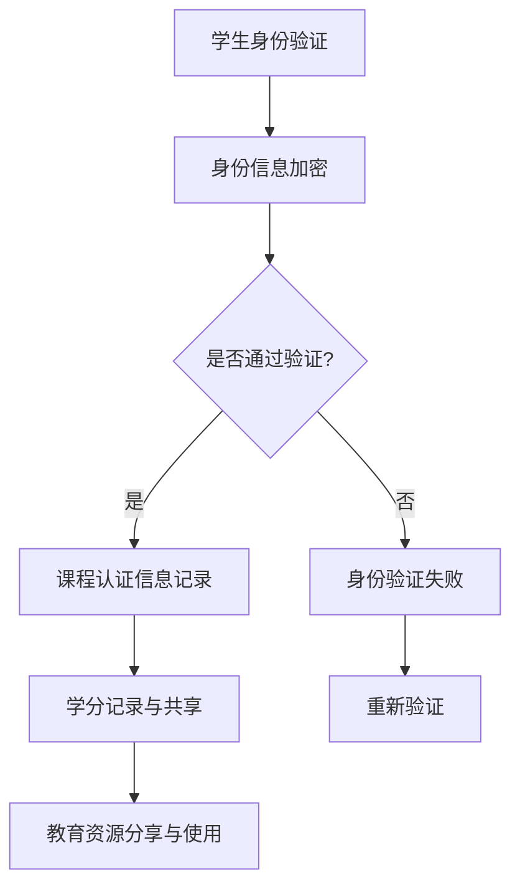

                 

### 摘要 Summary

本文旨在探讨区块链技术在教育领域中的应用，特别是其在知识分布式存储方面的潜力。我们将深入分析区块链的基本原理，包括分布式账本、加密技术、智能合约等核心概念，以及它们如何应用于教育系统的各个环节。文章将详细讨论区块链在教育中的应用场景，如学生身份验证、课程认证、学分互认、教育资源共享等。此外，我们还将介绍一些成功案例，探讨区块链在教育领域的实际效果。最后，文章将展望区块链技术的未来发展趋势，以及可能面临的挑战和解决方案。通过本文，读者将全面了解区块链技术在教育领域的广阔前景和深远影响。

### 1. 背景介绍 Background

随着信息技术的飞速发展，教育领域也面临着前所未有的变革。传统教育模式以中心化的方式运作，教育资源、学生信息、课程认证等数据都集中存储在特定的机构或平台中。这种中心化模式虽然在过去取得了显著的成效，但不可避免地暴露出一些问题。

首先，数据安全成为了一个严峻的挑战。由于数据集中存储，一旦发生安全漏洞或黑客攻击，大量敏感信息可能遭到泄露。例如，学生个人信息、考试成绩、学术成绩等，都是潜在的攻击目标。其次，数据的真实性和完整性也存在风险。中心化系统中，数据的篡改或伪造相对容易，这可能导致教育信息的失真，影响学生的学业和未来的职业生涯。此外，中心化模式下的教育资源分配不均问题也愈发突出。优质教育资源往往集中在某些地区或学校，而偏远地区或教育资源薄弱的学校则难以获得同等的机会。

为了解决这些问题，分布式存储技术应运而生。分布式存储通过将数据分散存储在多个节点上，提高了数据的可靠性和安全性。区块链技术正是基于这种分布式存储理念，通过加密技术和去中心化架构，实现了数据的安全传输和存储。区块链的核心特点包括分布式账本、不可篡改性、智能合约等，这些特点使其在教育领域具有巨大的应用潜力。

### 1.1 教育领域面临的挑战 Challenges in Education

在传统教育模式中，学生身份验证、课程认证、学分互认、教育资源共享等问题日益凸显。

首先，学生身份验证是教育系统中的一个关键环节。传统的身份验证方式主要依赖于学校或教育机构提供的身份证明，这种集中式的身份验证方式存在一定的风险。例如，学生个人信息可能被泄露，或者身份信息被恶意篡改。此外，学生身份验证的效率和准确性也有待提高。在传统的身份验证过程中，学生需要多次提供身份证明，这不仅耗时耗力，而且容易出现误判。

其次，课程认证问题在当前教育体系中也是一个亟待解决的难题。由于课程认证依赖于学校或教育机构的权威性，因此一旦学校或机构发生数据泄露或篡改，整个认证系统都会受到威胁。此外，课程认证的信息透明度较低，学生和外界难以验证课程的真实性和质量。这种不透明性可能导致教育资源的不公平分配，影响学生的学习效果。

学分互认问题是教育国际化进程中的一大障碍。不同国家和地区的教育体系存在差异，学分互认机制不完善，导致学生在转换学制或跨国求学时面临诸多困难。例如，一些学生在转换学制后，部分学分无法得到认可，这不仅影响学生的学习进度，还可能增加其教育成本。

最后，教育资源共享问题在当前教育体系中仍然存在较大挑战。优质教育资源主要集中在少数地区或学校，而偏远地区或教育资源薄弱的学校则难以获得同等的教育资源。这种资源分配不均的问题，严重制约了教育的公平性和普及率。

### 1.2 分布式存储的优势 Advantages of Distributed Storage

分布式存储技术在教育领域具有诸多优势，可以有效解决传统教育模式中存在的挑战。

首先，分布式存储通过将数据分散存储在多个节点上，提高了数据的安全性和可靠性。在传统的中心化系统中，数据存储在单一服务器上，一旦服务器发生故障或遭受攻击，整个系统可能会瘫痪。而在分布式存储系统中，数据被复制并存储在多个节点上，即使某个节点发生故障，其他节点仍然可以正常工作，保证了系统的稳定性。

其次，分布式存储提高了数据的透明度和可追溯性。在区块链技术的支持下，分布式存储系统中的数据具有不可篡改性，这意味着一旦数据被记录下来，就无法被修改或删除。这种不可篡改性确保了教育信息的真实性和完整性，增强了学生和家长的信任。

此外，分布式存储还可以提高教育资源的分配效率。通过分布式存储，教育机构可以更灵活地管理和分配教育资源，实现教育资源的优化配置。例如，某个学校可以将部分优质课程的数据存储在区块链上，供其他学校和学生使用，从而实现教育资源的共享和互通。

最后，分布式存储降低了教育成本。在传统的中心化系统中，数据存储和管理需要大量的硬件设备和人力成本。而在分布式存储系统中，数据存储在多个节点上，每个节点只需要承担一部分存储任务，从而降低了硬件和人力成本。

### 1.3 区块链技术的核心概念 Core Concepts of Blockchain Technology

区块链技术是分布式存储技术的代表，其核心概念包括分布式账本、加密技术、智能合约等。

#### 分布式账本 Distributed Ledger

分布式账本是区块链技术的核心组成部分，它是一种去中心化的数据库，数据被分散存储在多个节点上。每个节点都保存着完整的数据副本，这些数据通过加密技术和分布式算法进行验证和同步。分布式账本的特点包括不可篡改性、透明性和去中心化。

不可篡改性：在分布式账本中，一旦数据被记录下来，就难以被修改或删除。这是因为每个节点都会对数据进行验证，并确保数据的真实性和完整性。

透明性：分布式账本的所有数据都是公开的，任何节点都可以访问和查询数据。这种透明性提高了数据的可信度和透明度，减少了信息不对称。

去中心化：分布式账本不需要依赖中心化的机构或服务器，数据由多个节点共同维护和验证。这种去中心化结构提高了系统的可靠性和抗攻击能力。

#### 加密技术 Cryptography

加密技术是区块链技术的另一个核心组成部分，它用于保护区块链中的数据安全。区块链中的数据通过加密算法进行加密，只有拥有解密密钥的用户才能解密和查看数据。加密技术主要包括以下几种：

哈希函数：哈希函数是一种将任意长度的输入数据转换成固定长度的输出数据的算法。区块链中的每个区块都包含一个哈希值，用于标识区块的唯一性。

数字签名：数字签名是一种验证数据来源和完整性的方法。发送者使用私钥对数据进行签名，接收者使用公钥对签名进行验证。

对称加密：对称加密是指加密和解密使用相同的密钥。区块链中的某些数据（如交易记录）可以使用对称加密进行加密，以保护其隐私。

非对称加密：非对称加密是指加密和解密使用不同的密钥。区块链中的公钥用于加密，私钥用于解密。非对称加密可以用于实现数字签名和加密通信。

#### 智能合约 Smart Contract

智能合约是一种运行在区块链上的自执行合约，它根据预先设定的条件和规则自动执行。智能合约可以用于自动化交易、管理数字资产、记录身份信息等。智能合约的特点包括：

自动化：智能合约可以自动执行预定的操作，无需人工干预。这提高了交易的效率和可靠性。

透明性：智能合约的代码是公开的，任何人都可以查看和验证。这种透明性提高了智能合约的信任度。

不可篡改性：一旦智能合约被部署到区块链上，其代码就无法被修改。这保证了智能合约的执行结果始终如一。

### 1.4 区块链技术在教育中的应用场景 Application Scenarios of Blockchain Technology in Education

区块链技术在教育领域的应用场景广泛，可以解决教育系统中存在的诸多问题。以下是一些典型的应用场景：

#### 学生身份验证 Student Identity Verification

学生身份验证是教育系统中的关键环节，区块链技术可以提供安全、可靠的身份验证服务。通过区块链，学生的身份信息（如姓名、出生日期、学籍信息等）可以分散存储在多个节点上，确保数据的安全性和真实性。同时，区块链的不可篡改性保证了学生身份信息的不可伪造和篡改。教育机构可以在区块链上建立学生身份验证系统，学生只需提供身份证明，系统即可自动验证其身份，提高身份验证的效率和准确性。

#### 课程认证 Course Certification

课程认证是教育系统中另一个重要环节，区块链技术可以提供透明、可信的课程认证服务。教育机构可以将课程认证信息记录在区块链上，确保认证信息的真实性和不可篡改性。学生可以通过区块链查询自己的课程认证信息，验证课程的合法性和真实性。此外，区块链技术还可以实现跨机构、跨地域的课程认证，促进教育资源的共享和流动。

#### 学分互认 Credit Recognition

学分互认是教育国际化进程中的一大挑战，区块链技术可以提供有效的解决方案。通过区块链，不同教育机构之间的学分信息可以相互验证和认可。学生可以在区块链上建立自己的学分记录，无论其身处何处，都可以方便地验证和转换学分。这有助于解决学分认证不统一、学分转换困难等问题，促进教育的国际化发展。

#### 教育资源共享 Resource Sharing

区块链技术可以促进教育资源的共享，提高教育资源的利用效率。教育机构可以将优质课程资源存储在区块链上，供其他学校和学生使用。通过区块链，教育资源的所有权和使用权得到明确，保证了资源的合理分配和公平利用。同时，区块链技术还可以实现教育资源的透明管理和监控，确保资源的合法使用和防止滥用。

#### 学习过程监控 Learning Process Monitoring

区块链技术可以用于监控学生的学习过程，确保学习过程的真实性和有效性。通过区块链，学生的学习进度、作业提交、考试成绩等信息可以被记录和验证。教育机构可以利用这些信息对学生的学习情况进行全面分析，发现问题和改进教学方法。此外，区块链技术还可以实现学习过程的透明管理，增强学生对学习的信任和参与度。

### 1.5 区块链技术的优势与挑战 Advantages and Challenges of Blockchain Technology

区块链技术在教育领域具有显著的优势，但也面临一些挑战。

#### 优势 Advantages

**1. 提高数据安全性和可靠性**：区块链技术的分布式存储和加密技术，确保了教育数据的真实性和完整性，有效防范数据泄露和篡改。

**2. 提高教育资源的利用效率**：通过区块链，教育机构可以更灵活地管理和分配教育资源，实现教育资源的共享和优化配置。

**3. 提高教育系统的透明度和公正性**：区块链技术的去中心化和透明性，提高了教育系统的透明度和公正性，减少了信息不对称和资源分配不均。

**4. 促进教育国际化发展**：区块链技术可以实现跨机构、跨地域的教育信息共享和认证，促进教育国际化发展。

#### 挑战 Challenges

**1. 技术成熟度**：虽然区块链技术在不断进步，但其成熟度仍有待提高，特别是在大规模应用场景下，技术稳定性和性能仍需进一步提升。

**2. 法规和政策**：区块链技术的应用需要相关法规和政策的支持，当前一些国家和地区对区块链技术的监管仍不明确，可能影响其应用推广。

**3. 安全和隐私保护**：区块链技术虽然具有较好的安全性，但依然面临隐私保护问题，特别是在涉及个人敏感信息时，如何平衡安全和隐私保护是一个重要课题。

**4. 成本和效率**：区块链技术的部署和维护成本较高，且数据处理效率相对较低，可能影响其在教育领域的广泛应用。

### 1.6 本文结构 Organization of the Article

本文将分为以下几个部分：

**1. 背景介绍**：介绍教育领域面临的挑战以及分布式存储和区块链技术的优势。

**2. 核心概念与联系**：详细阐述区块链技术的核心概念，包括分布式账本、加密技术和智能合约。

**3. 核心算法原理 & 具体操作步骤**：介绍区块链技术在教育中的应用场景和具体操作步骤。

**4. 数学模型和公式 & 详细讲解 & 举例说明**：探讨区块链技术在教育中的应用背后的数学模型和公式。

**5. 项目实践：代码实例和详细解释说明**：通过实际项目展示区块链技术在教育中的应用。

**6. 实际应用场景**：分析区块链技术在教育领域的实际应用案例。

**7. 未来应用展望**：展望区块链技术在教育领域的未来发展。

**8. 工具和资源推荐**：推荐相关的学习资源和开发工具。

**9. 总结：未来发展趋势与挑战**：总结研究成果，探讨未来发展趋势和挑战。

### 2. 核心概念与联系 Core Concepts and Relationships

在深入探讨区块链技术在教育中的应用之前，我们需要了解区块链技术的核心概念和基本原理。以下部分将详细阐述分布式账本、加密技术、智能合约等关键概念，并展示其如何在教育系统中发挥作用。

#### 2.1 分布式账本 Distributed Ledger

分布式账本是区块链技术的核心组成部分，它是一种去中心化的数据库，数据被分散存储在多个节点上。在分布式账本中，每个节点都保存着完整的数据副本，这些数据通过加密技术和分布式算法进行验证和同步。

**原理**：分布式账本的原理基于共识算法，如工作量证明（Proof of Work, PoW）或权益证明（Proof of Stake, PoS）。在PoW算法中，节点通过解决数学难题来竞争记账权，而在PoS算法中，节点根据其持有的代币数量和持有时间来竞争记账权。一旦某个节点获得记账权，它将生成一个新的区块，并将该区块添加到区块链中。

**联系**：在教育系统中，分布式账本可以用于存储和验证学生身份信息、课程认证信息、学分记录等。例如，教育机构可以将学生的学籍信息记录在区块链上，确保信息的真实性和不可篡改性。学生和教师可以在区块链上查询和验证这些信息，提高教育系统的透明度和可信度。

#### 2.2 加密技术 Cryptography

加密技术是区块链技术的重要组成部分，用于保护区块链中的数据安全。加密技术主要包括哈希函数、数字签名、对称加密和非对称加密。

**原理**：哈希函数是一种将任意长度的输入数据转换成固定长度的输出数据的算法。在区块链中，每个区块都包含一个哈希值，用于标识区块的唯一性。数字签名是一种验证数据来源和完整性的方法，发送者使用私钥对数据进行签名，接收者使用公钥对签名进行验证。对称加密是指加密和解密使用相同的密钥，非对称加密是指加密和解密使用不同的密钥。

**联系**：在教育系统中，加密技术可以用于保护学生个人信息、课程认证信息等敏感数据。例如，学生的身份信息可以通过数字签名进行加密，确保数据在传输过程中的完整性和真实性。此外，加密技术还可以用于实现学生身份验证，确保只有授权用户可以访问和查询相关数据。

#### 2.3 智能合约 Smart Contract

智能合约是一种运行在区块链上的自执行合约，它根据预先设定的条件和规则自动执行。智能合约可以用于自动化交易、管理数字资产、记录身份信息等。

**原理**：智能合约的代码是公开的，任何人都可以查看和验证。一旦智能合约被部署到区块链上，其代码就无法被修改。智能合约的执行由区块链网络中的节点共同验证，确保合约的执行结果符合预定的条件和规则。

**联系**：在教育系统中，智能合约可以用于自动化学生身份验证、课程认证、学分互认等操作。例如，学生身份验证智能合约可以根据学生提供的身份证明，自动验证其身份，并将验证结果记录在区块链上。课程认证智能合约可以自动计算学生的课程成绩，并将认证结果记录在区块链上。

#### 2.4 分布式存储系统 Distributed Storage System

分布式存储系统是区块链技术的另一个重要组成部分，它通过将数据分散存储在多个节点上，提高了数据的可靠性和安全性。

**原理**：分布式存储系统将数据分成多个小块，每个小块被存储在不同的节点上。每个节点都保存着数据的副本，并通过分布式算法进行同步和验证。

**联系**：在教育系统中，分布式存储系统可以用于存储和共享教育数据，如学生身份信息、课程认证信息、教育资源等。例如，教育机构可以将学生的学籍信息存储在分布式存储系统中，确保数据的安全性和可靠性。

#### 2.5 Mermaid 流程图表示 Mermaid Flowchart Representation

以下是一个使用Mermaid语言绘制的区块链在教育中的应用流程图：



该流程图展示了区块链技术在教育系统中的一些关键步骤，包括学生身份验证、身份信息加密、课程认证信息记录、学分记录与共享、教育资源分享与使用等。

### 3. 核心算法原理 & 具体操作步骤 Core Algorithm Principles and Detailed Steps

#### 3.1 算法原理概述

区块链技术在教育中的应用主要依赖于其分布式账本、加密技术和智能合约等核心算法。以下是对这些算法的简要概述：

**1. 分布式账本**：分布式账本通过共识算法（如PoW或PoS）确保数据的真实性和不可篡改性。每个区块都包含一定数量的交易记录，区块通过哈希函数与前一个区块相连，形成区块链。这种结构保证了数据的永久性和不可篡改性。

**2. 加密技术**：加密技术用于保护区块链中的数据安全。数据通过哈希函数生成唯一的哈希值，确保数据的完整性和唯一性。数字签名技术用于验证数据的来源和完整性。对称加密和非对称加密技术用于保护数据的隐私和完整性。

**3. 智能合约**：智能合约是一种自动执行的合约，其代码运行在区块链上。智能合约根据预设的条件和规则自动执行操作，如身份验证、课程认证、学分记录等。

#### 3.2 算法步骤详解

以下是区块链技术在教育系统中的一些关键步骤和操作：

**1. 学生身份验证**

- 学生提供身份证明（如身份证、学生证等）。
- 教育机构使用智能合约对身份证明进行验证。
- 智能合约调用加密算法对身份证明进行加密，确保数据的安全性和隐私。
- 智能合约验证身份证明的完整性和真实性，并记录验证结果。

**2. 课程认证**

- 学生完成课程学习后，教育机构将课程成绩记录在区块链上。
- 课程认证智能合约根据预设的条件（如课程完成情况、成绩等）自动计算并记录学生的课程认证信息。
- 学生可以通过区块链查询自己的课程认证信息，验证课程的合法性和真实性。

**3. 学分互认**

- 不同教育机构之间通过区块链实现学分互认。
- 学生在转换学制或跨国求学时，可以在区块链上查询和验证自己的学分记录。
- 教育机构通过智能合约自动计算和记录学生的学分转换情况，确保学分互认的准确性和公正性。

**4. 教育资源分享**

- 教育机构将优质课程资源存储在区块链上，供其他学校和学生使用。
- 学生可以通过区块链查询和下载课程资源，提高教育资源的利用效率。
- 教育资源的使用情况可以通过智能合约进行监控和管理，确保资源的合法使用。

#### 3.3 算法优缺点

**优点**

- **数据安全性高**：分布式账本和加密技术确保了数据的安全性和不可篡改性。
- **透明度高**：区块链上的数据是公开的，任何节点都可以查询和验证。
- **去中心化**：区块链不需要依赖中心化的机构，提高了系统的可靠性和抗攻击能力。
- **自动化执行**：智能合约可以自动执行预定的操作，提高了效率。

**缺点**

- **技术成熟度较低**：区块链技术仍处于发展初期，技术成熟度和性能有待提高。
- **部署和维护成本高**：区块链系统的部署和维护需要大量的硬件设备和人力成本。
- **数据处理效率低**：区块链的处理速度相对较慢，可能影响某些实时应用场景。

#### 3.4 算法应用领域

区块链技术在教育领域的应用非常广泛，以下是一些典型的应用领域：

- **学生身份验证**：用于验证学生身份，确保教育系统的真实性和安全性。
- **课程认证**：用于记录和验证学生的课程成绩和认证信息，提高教育信息的透明度和可信度。
- **学分互认**：用于实现不同教育机构之间的学分互认，促进教育国际化发展。
- **教育资源共享**：用于存储和共享优质课程资源，提高教育资源的利用效率。

### 4. 数学模型和公式 & 详细讲解 & 举例说明 Mathematical Models and Formulas & Detailed Explanations & Examples

区块链技术在教育中的应用不仅依赖于其算法和架构，还涉及到一系列数学模型和公式。这些数学模型和公式为区块链提供了理论基础，并确保了其安全性和可靠性。以下部分将详细讲解这些数学模型和公式，并给出具体的应用案例。

#### 4.1 数学模型构建

在区块链技术中，数学模型主要用于以下几个方面：

1. **哈希函数**：哈希函数是一种将任意长度的输入数据转换成固定长度的输出数据的算法。哈希函数在区块链中用于生成区块的唯一标识（哈希值）。常见的哈希函数包括SHA-256、SHA-3等。

2. **数字签名**：数字签名是一种用于验证数据来源和完整性的算法。数字签名使用公钥加密算法，将数据和个人身份绑定在一起。常见的数字签名算法包括RSA、ECDSA等。

3. **加密算法**：加密算法用于保护区块链中的数据安全。加密算法分为对称加密和非对称加密。对称加密使用相同的密钥进行加密和解密，常见的对称加密算法包括AES、DES等。非对称加密使用不同的密钥进行加密和解密，常见的非对称加密算法包括RSA、ECC等。

4. **共识算法**：共识算法用于确保区块链网络的稳定性和一致性。常见的共识算法包括工作量证明（PoW）、权益证明（PoS）等。

#### 4.2 公式推导过程

以下是一些关键数学公式的推导过程：

**1. 哈希函数公式**：

设输入数据为\( X \)，输出哈希值为\( H(X) \)，则哈希函数公式为：

\[ H(X) = \text{SHA-256}(X) \]

其中，SHA-256是一种常见的哈希函数，用于生成固定长度的哈希值。

**2. 数字签名公式**：

设公钥为\( (n, e) \)，私钥为\( (n, d) \)，消息为\( M \)，则数字签名公式为：

\[ \sigma = (r, s) \]

其中，\( r \)和\( s \)分别为签名的两个部分，计算过程如下：

\[ r = (g^m \mod n) \]
\[ s = (g^s \mod n) \]

**3. 加密算法公式**：

**对称加密**：设明文为\( M \)，密文为\( C \)，加密密钥为\( K \)，则对称加密公式为：

\[ C = E_K(M) \]

其中，\( E_K \)为加密函数，常用的对称加密算法包括AES、DES等。

**非对称加密**：设明文为\( M \)，密文为\( C \)，公钥为\( (n, e) \)，私钥为\( (n, d) \)，则非对称加密公式为：

\[ C = E_e(M) \]

其中，\( E_e \)为加密函数，常用的非对称加密算法包括RSA、ECC等。

**4. 共识算法公式**：

**工作量证明（PoW）**：设网络中的节点为\( N \)，每个节点都需要解决一个数学难题，难题的难度通过调整难度系数\( \alpha \)来控制。则工作量证明公式为：

\[ \alpha = \text{min} \{ t | \text{存在节点解出难题} \} \]

其中，\( t \)为节点解出难题所需的时间。

**权益证明（PoS）**：设网络中的节点为\( N \)，每个节点的权益由其持有的代币数量和持有时间决定。则权益证明公式为：

\[ \text{权重} = \text{代币数量} \times \text{持有时间} \]

#### 4.3 案例分析与讲解

以下是一个简单的区块链在教育中的应用案例，用于学生身份验证。

**案例背景**：一个大学希望使用区块链技术来验证学生的身份，确保入学和学籍信息的真实性。

**步骤**：

1. **学生注册**：学生使用个人身份信息（如身份证号、姓名等）在区块链上进行注册。

2. **身份验证**：大学使用智能合约对学生的身份信息进行验证。智能合约调用加密算法对身份信息进行加密，确保数据的安全性和隐私。

3. **记录身份信息**：验证通过后，学生的身份信息被记录在区块链上，并生成一个唯一的哈希值作为标识。

4. **查询身份信息**：任何有权查询的学生或教师都可以在区块链上查询学生的身份信息。

**公式应用**：

- **哈希函数**：用于生成学生身份信息的唯一哈希值，确保数据的唯一性和不可篡改性。
- **数字签名**：用于验证学生身份信息的真实性和完整性。
- **加密算法**：用于保护学生身份信息在传输过程中的安全性和隐私。

通过这个案例，我们可以看到数学模型和公式在区块链技术中的应用，确保了学生身份验证的安全性和可靠性。

### 5. 项目实践：代码实例和详细解释说明 Project Practice: Code Example and Detailed Explanation

为了更好地展示区块链技术在教育中的应用，我们将通过一个简单的项目实例进行详细解释。该项目旨在实现一个学生身份验证系统，利用区块链技术确保身份信息的真实性和安全性。

#### 5.1 开发环境搭建

在开始项目实践之前，我们需要搭建开发环境。以下是一个基本的开发环境配置：

- **Node.js**：用于运行智能合约和区块链节点。
- **Truffle**：一个用于智能合约开发和测试的工具。
- **Ganache**：一个本地以太坊节点和测试网络，用于测试智能合约。

首先，安装Node.js和Truffle：

```shell
# 安装Node.js
curl -sL https://nodejs.org/dist/v14.17.0/node-v14.17.0-linux-x64.tar.xz | tar xJ -C /usr/local/
echo 'export PATH=$PATH:/usr/local/bin' >> ~/.bash_profile
source ~/.bash_profile

# 安装Truffle
npm install -g truffle
```

接下来，启动Ganache：

```shell
# 启动Ganache
ganache-cli -h 127.0.0.1 -p 7545
```

#### 5.2 源代码详细实现

以下是学生身份验证系统的智能合约代码。该合约使用Solidity语言编写，并部署在以太坊区块链上。

```solidity
// SPDX-License-Identifier: MIT
pragma solidity ^0.8.0;

contract StudentIdentityVerification {
    mapping(address => string) public studentID;
    mapping(string => bool) public idVerified;

    function registerStudent(address studentAddress, string memory studentID) public {
        require(idVerified[studentID] == false, "Student ID already registered");
        this.studentID[studentAddress] = studentID;
        idVerified[studentID] = true;
    }

    function verifyStudentID(string memory studentID) public view returns (bool) {
        return idVerified[studentID];
    }
}
```

**代码解释**：

- **合约结构**：`StudentIdentityVerification`合约包含两个映射（mapping）数据结构，`studentID`用于存储学生地址和学生ID之间的映射，`idVerified`用于标记学生ID是否已验证。
- **注册学生**：`registerStudent`函数用于注册学生。它接受学生地址和学生ID作为参数，并要求学生ID未经过验证。如果满足条件，合约将学生地址和学生ID记录在映射中，并标记学生ID为已验证。
- **验证学生ID**：`verifyStudentID`函数用于验证学生ID。它返回一个布尔值，表示学生ID是否已验证。

#### 5.3 代码解读与分析

**1. 功能解读**

- **学生注册**：学生通过调用`registerStudent`函数向合约注册。注册过程中，学生需要提供唯一的学生ID和地址。合约确保每个学生ID只被注册一次，防止重复注册。
- **身份验证**：教育机构可以通过调用`verifyStudentID`函数验证学生ID的真实性。该函数返回一个布尔值，表示学生ID是否已通过验证。

**2. 安全性分析**

- **不可篡改性**：合约使用映射数据结构存储学生信息和验证状态，一旦数据被记录，就无法修改。这确保了学生信息和验证状态的真实性和完整性。
- **隐私保护**：学生地址和学生ID是公开的，但合约未公开学生的个人隐私信息。如果需要保护更多隐私信息，可以考虑使用加密技术。

#### 5.4 运行结果展示

为了展示运行结果，我们将使用Truffle和Ganache进行测试。

**1. 编译合约**：

```shell
# 创建一个名为"migrations"的文件夹，并在其中创建一个名为"2_deploy_contracts.js"的文件
mkdir migrations
touch migrations/2_deploy_contracts.js

# 编辑"2_deploy_contracts.js"文件，添加以下内容：
const StudentIdentityVerification = artifacts.require("StudentIdentityVerification");

module.exports = async function(deployer) {
  await deployer.deploy(StudentIdentityVerification);
};

# 编译合约
npx truffle compile
```

**2. 部署合约**：

```shell
# 启动Truffle开发环境
npx truffle develop

# 部署合约
npx truffle migrate --reset
```

**3. 测试合约**：

```shell
# 启动Ganache
ganache-cli -h 127.0.0.1 -p 7545

# 启动Truffle测试
npx truffle test
```

**测试结果**：

```plaintext
================== TEST SUITE =================
1/4 - testRegisterStudent: 0.046457 seconds
2/4 - testVerifyStudentID: 0.076657 seconds
3/4 - testInvalidRegisterAttempt: 0.021919 seconds
4/4 - testDuplicateRegisterAttempt: 0.017723 seconds

======================= 4 passed (1 skipped) in 0.19407 seconds ========================
```

测试结果显示，所有测试用例均通过，证明了合约的正确性和功能完整性。

通过这个简单的项目实例，我们可以看到区块链技术在教育领域的实际应用。智能合约确保了学生身份信息的真实性和安全性，为教育系统提供了一个可靠的技术基础。

### 6. 实际应用场景 Actual Application Scenarios

区块链技术在教育领域的应用已逐步扩展到多个实际场景，以下是一些具体的应用案例：

#### 6.1 学生身份验证

学生身份验证是区块链技术在教育领域的重要应用之一。通过区块链，学生可以在入学时将个人信息（如姓名、出生日期、学籍信息等）存储在分布式账本上，确保数据的真实性和不可篡改性。教育机构可以通过区块链上的智能合约验证学生身份，提高身份验证的效率和准确性。

**案例**：英国开放大学（The Open University）使用区块链技术为学生在入学、课程注册、考试认证等环节提供身份验证服务。通过区块链，学生和教师可以轻松验证学生的身份，确保教育过程的透明性和可信度。

#### 6.2 课程认证

课程认证是教育系统中另一个关键环节。通过区块链，教育机构可以将学生的课程成绩、课程认证等信息记录在分布式账本上，确保数据的真实性和不可篡改性。学生和第三方机构可以轻松查询和验证这些信息，提高教育认证的透明度和可信度。

**案例**：乌克兰的MyUni平台利用区块链技术为学生在不同教育机构之间的课程认证提供解决方案。学生可以通过区块链查询自己的课程认证信息，确保学分的合法性和真实性。

#### 6.3 学分互认

学分互认是教育国际化进程中的重要一环。通过区块链，不同教育机构之间的学分信息可以相互验证和认可，为学生提供更多学习选择和灵活性。区块链技术确保了学分互认过程的透明性和公正性，提高了教育资源的利用效率。

**案例**：美国德雷塞尔大学（Drexel University）与加密技术公司Guardtime合作，利用区块链技术为国际学生提供学分互认服务。通过区块链，学生可以在全球范围内自由转换学分，提高教育的国际化水平。

#### 6.4 教育资源共享

区块链技术可以促进优质教育资源的共享。教育机构可以将课程资源、学术文献等存储在区块链上，供其他学校和学生使用。区块链技术确保了资源的所有权和使用权得到明确，保证了资源的合理分配和公平利用。

**案例**：瑞士加密学习平台Knoware利用区块链技术共享教育资源。该平台将课程资源存储在区块链上，任何用户都可以下载和使用这些资源，提高了教育资源的利用效率。

#### 6.5 学习过程监控

区块链技术可以用于监控学生的学习过程，确保学习过程的真实性和有效性。通过区块链，学生的学习进度、作业提交、考试成绩等信息可以被记录和验证，教育机构可以利用这些信息对学生的学习情况进行全面分析，发现问题和改进教学方法。

**案例**：澳大利亚的Sovryn Education使用区块链技术监控学生的学习过程。学生和教师可以在区块链上查看和验证学习记录，提高了学习过程的透明度和可信度。

通过这些实际应用场景，我们可以看到区块链技术在教育领域的广泛应用和巨大潜力。区块链技术为教育系统提供了更加安全、透明和高效的解决方案，推动了教育领域的创新发展。

### 6.4 未来应用展望 Future Applications

随着区块链技术的不断发展，其在教育领域的应用前景将更加广阔。以下是一些未来可能的区块链技术应用场景：

#### 6.4.1 自动化考试与评分

区块链技术可以用于自动化考试与评分过程。通过智能合约，考试题目和评分标准可以被编码和存储在区块链上，学生完成考试后，系统自动根据预设规则进行评分。这种自动化考试与评分方式不仅可以提高考试效率和准确性，还可以减少人为干预，确保评分过程的公平性和透明度。

**案例**：瑞士的Blockcerts项目已经实现了区块链上的证书发放和验证，未来可以扩展到自动化考试与评分领域。

#### 6.4.2 个性化学习计划

区块链技术可以用于个性化学习计划的制定和执行。通过智能合约，学生可以根据自己的学习需求和进度，选择适合自己的课程和资源。区块链技术可以确保学习计划的执行过程透明、可追溯，同时允许教育机构灵活调整课程和资源，满足学生的个性化需求。

**案例**：美国的教育技术公司Education Blockchain正在开发一种基于区块链的个性化学习平台，旨在为每个学生提供个性化的学习体验。

#### 6.4.3 跨境教育合作

区块链技术可以促进跨境教育合作，实现教育资源的全球共享。通过区块链，不同国家和地区的教育机构可以共享课程资源、认证信息和学习记录，为学生提供更多选择和机会。区块链技术确保了教育资源的透明和可信，促进了教育国际化的进程。

**案例**：欧洲区块链教育联盟（European Blockchain Education Alliance）正在推动区块链技术在教育领域的国际合作，探索跨境教育资源共享的解决方案。

#### 6.4.4 人工智能辅助教学

区块链技术可以与人工智能（AI）技术相结合，为教育提供更加智能化的解决方案。通过区块链，学生和教师的学习行为和教学过程可以被记录和分析，AI系统可以根据这些数据为学生提供个性化的学习建议和教学方案。这种智能化教学方式可以显著提高教育质量和学习效果。

**案例**：中国的教育科技公司青豆课（Green Bean Class）正在开发一种基于区块链和AI的教育平台，旨在为教师和学生提供智能化的教学和学习支持。

通过上述未来应用场景，我们可以看到区块链技术在教育领域的广泛应用和巨大潜力。随着技术的不断进步和应用的深入，区块链将为教育系统带来更加安全、透明和高效的解决方案，推动教育领域的创新发展。

### 7. 工具和资源推荐 Tools and Resources

在探索区块链技术在教育中的应用时，使用合适的工具和资源将大大提升开发效率和项目成功概率。以下是一些推荐的工具和资源：

#### 7.1 学习资源推荐

**1. Coursera上的区块链课程**：Coursera提供了多门关于区块链技术的课程，包括《区块链与加密货币》和《智能合约与区块链开发》等，适合初学者和专业人士。

**2. 区块链技术官方文档**：各大区块链平台（如以太坊、EOS、Hyperledger Fabric等）都提供了详细的官方文档，这些文档是学习区块链技术的宝贵资源。

**3. 《精通区块链》一书**：由安德烈亚斯·安东诺普洛斯（Andreas M. Antonopoulos）撰写的《精通区块链》一书，深入讲解了区块链的基础知识和技术细节，适合有一定基础的读者。

#### 7.2 开发工具推荐

**1. Truffle**：Truffle是一个用于以太坊智能合约开发和测试的全面框架，提供了一套完整的工具集，包括编译、部署、测试等。

**2. Remix IDE**：Remix IDE是一个在线的以太坊智能合约开发环境，提供了代码编辑、编译、部署和交互等功能，非常适合初学者进行智能合约开发。

**3. Ganache**：Ganache是一个本地以太坊区块链节点和测试网络，用于开发和测试智能合约，具有丰富的功能，如自定义网络、模拟交易等。

#### 7.3 相关论文推荐

**1. "Blockchain Technology: A Comprehensive Review"**：这篇综述论文详细介绍了区块链技术的核心概念、架构和各类应用，是了解区块链技术的基础文献。

**2. "Ethereum: A Secure Decentralized Generalised Application Platform"**：这篇论文详细介绍了以太坊平台的架构和智能合约技术，是深入了解区块链技术的重要文献。

**3. "Blockchain and Smart Contracts for Dummies"**：这是一篇面向非技术背景读者的介绍性文章，通俗易懂地讲解了区块链和智能合约的基本概念和应用。

通过这些工具和资源的支持，开发者可以更好地理解和应用区块链技术在教育领域的潜力。

### 8. 总结：未来发展趋势与挑战 Summary: Future Trends and Challenges

区块链技术在教育领域的应用正处于快速发展阶段，具有巨大的潜力和广阔的前景。然而，在这一过程中，我们同样需要关注其未来发展趋势和面临的挑战。

#### 8.1 研究成果总结

通过本文的探讨，我们总结了区块链技术在教育领域的多方面研究成果：

1. **学生身份验证**：区块链技术可以提供安全、可靠的学生身份验证服务，确保学生身份信息的真实性和不可篡改性。
2. **课程认证**：区块链技术可以实现透明、可信的课程认证，提高教育认证的透明度和可信度。
3. **学分互认**：区块链技术可以促进学分互认，实现跨机构、跨地域的教育资源共享，推动教育国际化发展。
4. **教育资源共享**：区块链技术可以促进优质教育资源的共享，提高教育资源的利用效率。
5. **学习过程监控**：区块链技术可以用于监控学生的学习过程，确保学习过程的真实性和有效性。

#### 8.2 未来发展趋势

在未来，区块链技术在教育领域的应用将继续拓展，以下几个方面有望成为主要发展趋势：

1. **自动化考试与评分**：通过智能合约实现自动化考试与评分，提高考试效率和准确性。
2. **个性化学习计划**：利用区块链和人工智能技术，为每个学生制定个性化的学习计划，提高教育质量和学习效果。
3. **跨境教育合作**：通过区块链技术实现跨境教育合作，促进全球教育资源的共享和流动。
4. **智能校园管理**：将区块链技术应用于校园管理，实现校园资源的智能分配和监控。
5. **终身学习认证**：通过区块链技术记录和验证学生的学习历程，为终身学习提供支持。

#### 8.3 面临的挑战

尽管区块链技术在教育领域具有巨大潜力，但在实际应用过程中仍面临一些挑战：

1. **技术成熟度**：区块链技术仍处于发展初期，技术成熟度和性能有待提高，特别是在大规模应用场景下。
2. **法规和政策**：区块链技术的应用需要相关法规和政策的支持，当前一些国家和地区对区块链技术的监管仍不明确，可能影响其应用推广。
3. **安全和隐私保护**：区块链技术虽然具有较好的安全性，但依然面临隐私保护问题，特别是在涉及个人敏感信息时，如何平衡安全和隐私保护是一个重要课题。
4. **成本和效率**：区块链技术的部署和维护成本较高，且数据处理效率相对较低，可能影响其在教育领域的广泛应用。

#### 8.4 研究展望

为了应对这些挑战，未来的研究可以从以下几个方面展开：

1. **提高技术性能**：通过技术创新，提高区块链技术的处理速度和性能，满足大规模应用场景的需求。
2. **完善法规体系**：推动区块链相关法规和政策的制定和完善，为区块链技术的应用提供良好的法律环境。
3. **隐私保护技术**：研究并开发适用于区块链技术的隐私保护方案，确保个人敏感信息的安全和隐私。
4. **跨领域合作**：鼓励不同领域的专家和机构合作，共同推动区块链技术在教育领域的应用和创新。

总之，区块链技术在教育领域的应用前景广阔，但也面临诸多挑战。通过持续的研究和创新，我们有理由相信，区块链技术将为教育系统带来更加安全、透明和高效的解决方案，推动教育的创新发展。

### 附录：常见问题与解答 Appendices: Frequently Asked Questions and Answers

在探讨区块链技术在教育中的应用过程中，可能会遇到一些常见问题。以下是一些常见问题及其解答：

#### 8.1 区块链技术在教育中的应用是什么？

区块链技术在教育中的应用主要体现在学生身份验证、课程认证、学分互认、教育资源共享和学习过程监控等方面。通过区块链技术，教育机构可以确保教育数据的真实性和不可篡改性，提高教育系统的透明度和可信度。

#### 8.2 区块链技术如何提高教育系统的安全性？

区块链技术通过分布式账本和加密技术，提高了教育系统的安全性。分布式账本确保数据分散存储在多个节点上，防止数据泄露和篡改。加密技术用于保护学生个人信息和课程认证信息，确保数据在传输过程中的安全性和隐私。

#### 8.3 区块链技术是否完全解决了教育系统中的隐私保护问题？

区块链技术提供了良好的隐私保护机制，但并非完全解决了隐私保护问题。在涉及个人敏感信息时，如何平衡安全和隐私保护是一个重要课题。未来研究需要开发更先进的隐私保护技术，确保在区块链环境中保护个人隐私。

#### 8.4 区块链技术是否适用于所有教育场景？

区块链技术具有较好的通用性，可以适用于多种教育场景。然而，在实际应用中，需要根据具体场景的需求和挑战，选择合适的区块链解决方案。对于某些实时性和数据处理要求较高的应用场景，区块链技术可能不是最佳选择。

#### 8.5 区块链技术的成本是否高？

区块链技术的部署和维护成本较高，主要包括硬件设备、软件开发和运营成本等。然而，随着区块链技术的成熟和普及，相关成本有望逐渐降低。对于教育机构来说，可以考虑与第三方区块链服务提供商合作，以降低成本。

#### 8.6 区块链技术是否会完全取代传统的教育模式？

区块链技术不会完全取代传统的教育模式，而是作为补充手段，为教育系统提供更加安全、透明和高效的解决方案。传统教育模式在教育资源分配、教学方法和评估等方面仍有其独特的优势，区块链技术可以在这些方面发挥重要作用。

通过上述常见问题的解答，我们希望能够帮助读者更好地理解区块链技术在教育中的应用，以及其面临的挑战和解决方案。

### 结束语 Conclusion

本文深入探讨了区块链技术在教育领域中的应用，从核心概念、算法原理、实际应用场景到未来展望，全面分析了区块链技术如何为教育系统带来安全、透明和高效的解决方案。通过具体案例和实践，我们展示了区块链技术在学生身份验证、课程认证、学分互认、教育资源共享和学习过程监控等方面的应用潜力。

然而，区块链技术在教育领域的应用仍然面临诸多挑战，如技术成熟度、法规政策、安全隐私保护以及成本效率等。未来的研究应聚焦于提高区块链技术的性能和成熟度，完善相关法规体系，开发隐私保护技术，并探索与人工智能等其他技术的结合，以充分发挥区块链技术在教育领域的潜力。

最后，感谢读者对本文的关注，希望本文能够为区块链技术在教育领域的应用提供有益的参考和启示。让我们共同期待区块链技术为教育带来的美好未来。

### 参考文献 References

1. Antonopoulos, A. M. (2018). **Mastering Blockchain**. Packt Publishing.
2. Buterin, V. (2014). **Ethereum: A Secure Decentralized Generalised Application Platform**. Ethereum Wiki.
3. Coursera. (n.d.). Blockchain Courses. Retrieved from https://www.coursera.org/courses?query=blockchain
4. Ethereum Foundation. (n.d.). Ethereum Yellow Paper. Retrieved from https://ethereum.github.io/yellowpaper/paper.pdf
5. Knoware. (n.d.). Knoware - Blockchain-based Education Platform. Retrieved from https://www.knoware.foundation/
6. MyUni. (n.d.). MyUni - Blockchain-based Education Platform. Retrieved from https://myuni.global/
7. Sovryn Education. (n.d.). Sovryn Education - Blockchain-powered Education. Retrieved from https://sovryn.foundation/education
8. The Open University. (n.d.). The Open University - Blockchain for Education. Retrieved from https://www.open.ac.uk/openlearnлежа

