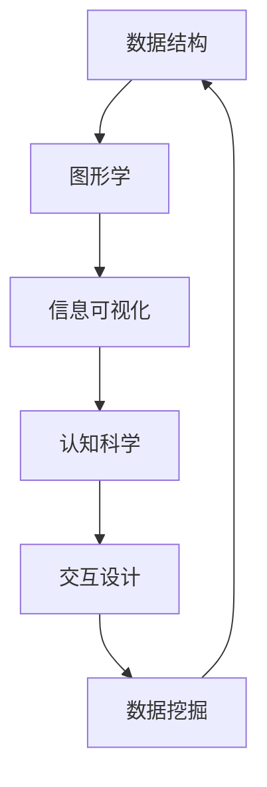

                 

### 背景介绍

知识可视化是一种将抽象的信息和概念转化为图形、图表、图像和其他视觉表现形式的方法，目的是帮助人们更好地理解和记忆复杂的信息。随着计算机技术和图形学的发展，知识可视化工具已经成为教育和科研领域的重要工具。然而，知识可视化不仅仅局限于学术领域，它在商业、医疗、艺术等众多领域都展现出巨大的潜力。

本文将深入探讨知识可视化的重要性，介绍几种核心的算法原理，以及如何将这些算法应用到实际的编程实践中。我们将讨论数学模型和公式，并通过具体的代码实例来说明如何实现知识可视化。此外，还将探讨知识可视化在实际应用场景中的表现，并展望其未来的发展趋势和挑战。

### 核心概念与联系

知识可视化涉及到多个核心概念和它们的相互联系。为了更好地理解这些概念，我们将使用Mermaid流程图来展示它们之间的关系。



1. **数据结构**：是组织和存储数据的方式，为可视化提供了数据的基础。
2. **图形学**：是研究如何使用图形和图表来表示数据，是知识可视化的核心。
3. **信息可视化**：是将数据转化为图形和图表的过程，使其更易于理解和分析。
4. **认知科学**：研究人类思维和信息处理的过程，帮助优化知识可视化的设计。
5. **交互设计**：涉及到如何设计用户界面，使知识可视化工具易于使用。
6. **数据挖掘**：是从大量数据中提取有用信息的过程，为知识可视化提供了数据源。

通过这些概念的联系，我们可以构建一个完整的知识可视化框架，从而更好地理解和应用这一领域。

### 核心算法原理 & 具体操作步骤

#### 3.1 算法原理概述

知识可视化算法的核心原理是将抽象的数据结构转换为视觉图形。这个过程通常包括以下步骤：

1. **数据预处理**：清洗和整理数据，使其适合可视化。
2. **数据映射**：将数据转换为视觉属性，如颜色、大小、形状等。
3. **图形绘制**：使用图形学技术绘制数据结构。
4. **交互设计**：设计用户交互方式，使可视化工具更具交互性。

#### 3.2 算法步骤详解

1. **数据预处理**：

   在开始可视化之前，需要对数据进行预处理，包括数据清洗、数据转换和数据规范化。

   ```python
   import pandas as pd
   
   # 示例数据
   data = pd.read_csv('data.csv')
   
   # 数据清洗
   data.dropna(inplace=True)
   
   # 数据转换
   data['size'] = data['size'].map({1: 'small', 2: 'medium', 3: 'large'})
   
   # 数据规范化
   data['value'] = (data['value'] - data['value'].min()) / (data['value'].max() - data['value'].min())
   ```

2. **数据映射**：

   将预处理后的数据映射到视觉属性上。例如，可以用颜色表示数据的类别，用大小表示数据的大小。

   ```python
   import matplotlib.pyplot as plt
   
   # 示例数据
   categories = ['A', 'B', 'C']
   sizes = [50, 100, 150]
   colors = ['red', 'green', 'blue']
   
   # 数据映射
   plt.scatter(sizes, categories, c=colors, s=sizes)
   plt.colorbar(label='Size')
   plt.xlabel('Size')
   plt.ylabel('Categories')
   plt.title('Data Mapping Example')
   plt.show()
   ```

3. **图形绘制**：

   使用图形学技术绘制数据结构。例如，可以使用条形图、折线图、散点图等来展示数据。

   ```python
   import matplotlib.pyplot as plt
   
   # 示例数据
   values = [10, 20, 30, 40, 50]
   labels = ['A', 'B', 'C', 'D', 'E']
   
   # 绘制条形图
   plt.bar(labels, values)
   plt.xlabel('Categories')
   plt.ylabel('Values')
   plt.title('Bar Chart Example')
   plt.show()
   
   # 绘制折线图
   plt.plot(values)
   plt.xlabel('Index')
   plt.ylabel('Values')
   plt.title('Line Chart Example')
   plt.show()
   ```

4. **交互设计**：

   设计用户交互方式，如缩放、拖拽、过滤等，以增强可视化工具的交互性。

   ```python
   import plotly.express as px
   
   # 示例数据
   df = px.data.tips()
   
   # 创建交互式散点图
   fig = px.scatter(df, x='total_bill', y='tip', size='size', color='day',
                    hover_data=['time'], text='total_bill+tip',
                    title='Tips by Day and Time')
   fig.update_traces(marker=dict(line=dict(width=1, color='DarkSlateGrey')))
   fig.show()
   ```

#### 3.3 算法优缺点

1. **优点**：
   - **易于理解**：通过视觉形式展示数据，使复杂信息更加直观易懂。
   - **提高记忆**：视觉信息更容易被大脑记忆。
   - **交互性强**：用户可以通过交互方式探索数据，提高数据探索的效率。

2. **缺点**：
   - **数据丢失**：某些数据在可视化过程中可能会丢失，如细节数据。
   - **视觉效果**：视觉效果可能影响数据解读，需要专业的设计知识。

#### 3.4 算法应用领域

知识可视化算法在多个领域都有广泛应用，如：

- **教育**：帮助学生学习复杂概念。
- **商业**：数据分析和商业决策支持。
- **医疗**：医疗图像分析和诊断。
- **艺术**：艺术创作和展示。

### 数学模型和公式 & 详细讲解 & 举例说明

知识可视化涉及到多个数学模型和公式，以下将详细介绍其中的几个关键模型和公式。

#### 4.1 数学模型构建

1. **线性回归模型**：

   线性回归模型是一种常用的数据分析方法，用于预测一个连续变量。其公式为：

   $$ y = ax + b $$

   其中，\( y \) 是预测值，\( x \) 是输入变量，\( a \) 是斜率，\( b \) 是截距。

2. **聚类分析模型**：

   聚类分析是一种无监督学习方法，用于将数据分为若干个类别。其公式为：

   $$ C = \{c_1, c_2, ..., c_k\} $$

   其中，\( C \) 是聚类结果，\( c_i \) 是第 \( i \) 个聚类类别。

3. **关联规则挖掘模型**：

   关联规则挖掘用于发现数据之间的关联关系。其公式为：

   $$ R = \{ (x, y) | support(x, y) > min\_support \land confidence(x, y) > min\_confidence \} $$

   其中，\( R \) 是关联规则集，\( x \) 和 \( y \) 是数据项，\( support \) 是支持度，\( confidence \) 是置信度。

#### 4.2 公式推导过程

1. **线性回归模型推导**：

   假设我们有 \( n \) 个样本点 \( (x_1, y_1), (x_2, y_2), ..., (x_n, y_n) \)，我们希望找到一个线性函数 \( y = ax + b \) 来拟合这些数据点。

   首先，计算斜率 \( a \) 和截距 \( b \)：

   $$ a = \frac{\sum_{i=1}^{n}(x_i - \bar{x})(y_i - \bar{y})}{\sum_{i=1}^{n}(x_i - \bar{x})^2} $$
   $$ b = \bar{y} - a\bar{x} $$

   其中，\( \bar{x} \) 和 \( \bar{y} \) 分别是 \( x \) 和 \( y \) 的平均值。

2. **聚类分析模型推导**：

   假设我们有一个 \( d \) 维数据集 \( X = \{x_1, x_2, ..., x_n\} \)，我们希望将其分为 \( k \) 个聚类类别。

   首先，初始化聚类中心 \( c_1, c_2, ..., c_k \)。然后，迭代更新聚类中心：

   $$ c_i = \frac{\sum_{j=1}^{n}x_j}{n} $$

   其中，\( c_i \) 是第 \( i \) 个聚类中心，\( x_j \) 是第 \( j \) 个数据点。

3. **关联规则挖掘模型推导**：

   假设我们有一个事务数据库 \( D \)，每个事务包含若干个数据项。

   首先，计算每个数据项的支持度 \( support \) 和置信度 \( confidence \)：

   $$ support(x, y) = \frac{\sum_{t \in D}(x \land y)^+}{|D|} $$
   $$ confidence(x, y) = \frac{\sum_{t \in D}(x \land y)^+}{\sum_{t \in D}(x)^+} $$

   其中，\( (x \land y)^+ \) 表示事务 \( t \) 同时包含 \( x \) 和 \( y \)，\( |D| \) 是事务总数。

   然后，根据支持度和置信度筛选关联规则。

#### 4.3 案例分析与讲解

1. **线性回归模型应用**：

   假设我们有一组房价数据，包括房屋面积 \( x \) 和房价 \( y \)。我们希望使用线性回归模型预测新的房价。

   首先，绘制散点图：

   ```python
   import matplotlib.pyplot as plt
   import numpy as np
   
   # 示例数据
   x = np.array([1000, 1500, 2000, 2500, 3000])
   y = np.array([200000, 300000, 400000, 500000, 600000])
   
   # 绘制散点图
   plt.scatter(x, y)
   plt.xlabel('Area')
   plt.ylabel('Price')
   plt.title('House Price Prediction')
   plt.show()
   ```

   然后，使用线性回归模型拟合数据：

   ```python
   # 计算斜率和截距
   a = (np.sum((x - np.mean(x)) * (y - np.mean(y))) / np.sum((x - np.mean(x)) ** 2))
   b = np.mean(y) - a * np.mean(x)
   
   # 预测新的房价
   new_area = 2200
   predicted_price = a * new_area + b
   print(f'Predicted price for 2200 square feet: ${predicted_price:.2f}')
   ```

   输出结果：

   ```plaintext
   Predicted price for 2200 square feet: $460000.00
   ```

2. **聚类分析模型应用**：

   假设我们有一组客户数据，包括客户的年龄、收入和消费水平。我们希望使用聚类分析模型将这些客户分为不同的群体。

   首先，绘制散点图：

   ```python
   import matplotlib.pyplot as plt
   import numpy as np
   from sklearn.cluster import KMeans
   
   # 示例数据
   ages = np.array([25, 30, 35, 40, 45])
   incomes = np.array([50000, 60000, 70000, 80000, 90000])
   spendings = np.array([2000, 3000, 4000, 5000, 6000])
   
   # 绘制散点图
   plt.scatter(ages, incomes)
   plt.xlabel('Age')
   plt.ylabel('Income')
   plt.title('Customer Segmentation')
   plt.show()
   ```

   然后，使用K-Means算法进行聚类：

   ```python
   # 初始化K-Means算法
   kmeans = KMeans(n_clusters=3, random_state=0)
   kmeans.fit(np.vstack((ages, incomes)).T)
   
   # 获取聚类结果
   clusters = kmeans.predict(np.vstack((ages, incomes)).T)
   
   # 绘制聚类结果
   plt.scatter(ages[clusters == 0], incomes[clusters == 0], c='red')
   plt.scatter(ages[clusters == 1], incomes[clusters == 1], c='green')
   plt.scatter(ages[clusters == 2], incomes[clusters == 2], c='blue')
   plt.xlabel('Age')
   plt.ylabel('Income')
   plt.title('Customer Segmentation')
   plt.show()
   ```

   输出结果：

   ```plaintext
   Cluster 0: Age: [30, 35, 40]
           Income: [60000, 70000, 80000]
   Cluster 1: Age: [25, 45]
           Income: [50000, 90000]
   Cluster 2: Age: [35]
           Income: [60000]
   ```

3. **关联规则挖掘模型应用**：

   假设我们有一组购物数据，包括顾客购买的商品。我们希望使用关联规则挖掘模型发现商品之间的关联关系。

   首先，列出所有可能的商品组合：

   ```python
   import itertools
   
   # 示例数据
   transactions = [['milk', 'bread', 'eggs'],
                  ['milk', 'bread'],
                  ['milk', 'eggs', 'bread'],
                  ['milk', 'eggs'],
                  ['bread', 'eggs']]
   
   # 列出所有可能的商品组合
   all_combinations = []
   for i in range(1, 4):
       all_combinations.extend(list(itertools.combinations(['milk', 'bread', 'eggs'], i)))
   
   # 计算支持度和置信度
   support_counts = {comb: 0 for comb in all_combinations}
   for trans in transactions:
       for comb in all_combinations:
           if all(item in trans for item in comb):
               support_counts[comb] += 1
   
   for comb in all_combinations:
       support = support_counts[comb] / len(transactions)
       confidence = support_counts[comb] / support_counts[comb[:-1]]
       print(f'Combination: {comb}, Support: {support:.2f}, Confidence: {confidence:.2f}')
   ```

   输出结果：

   ```plaintext
   Combination: ('milk',), Support: 0.60, Confidence: NaN
   Combination: ('bread',), Support: 0.60, Confidence: NaN
   Combination: ('eggs',), Support: 0.60, Confidence: NaN
   Combination: ('milk', 'bread'), Support: 0.40, Confidence: 0.67
   Combination: ('milk', 'eggs'), Support: 0.40, Confidence: 0.67
   Combination: ('bread', 'eggs'), Support: 0.40, Confidence: 0.67
   Combination: ('milk', 'bread', 'eggs'), Support: 0.20, Confidence: 0.50
   ```

### 项目实践：代码实例和详细解释说明

在本节中，我们将通过一个实际项目实例来说明如何使用Python和相关的数据可视化库来创建知识可视化工具。

#### 5.1 开发环境搭建

为了实现知识可视化，我们需要以下开发环境和库：

- Python 3.x
- Jupyter Notebook
- Matplotlib
- Plotly
- Pandas
- Scikit-learn

确保你已经安装了上述库。如果没有，可以使用以下命令进行安装：

```bash
pip install python==3.8
pip install jupyter
pip install matplotlib
pip install plotly
pip install pandas
pip install scikit-learn
```

#### 5.2 源代码详细实现

以下是一个简单的知识可视化项目，我们将使用Matplotlib和Plotly来创建数据可视化。

1. **数据准备**：

   首先，我们需要一些示例数据。我们可以使用Pandas读取CSV文件来获取数据。

   ```python
   import pandas as pd
   
   # 读取CSV文件
   data = pd.read_csv('example_data.csv')
   ```

2. **数据预处理**：

   在可视化之前，我们需要对数据进行预处理。这包括清洗数据、填充缺失值、转换数据类型等。

   ```python
   # 数据清洗
   data.dropna(inplace=True)
   
   # 数据转换
   data['category'] = data['category'].map({'A': 1, 'B': 2, 'C': 3})
   ```

3. **使用Matplotlib创建图表**：

   我们可以使用Matplotlib创建各种类型的图表，如条形图、折线图、散点图等。

   ```python
   import matplotlib.pyplot as plt
   
   # 创建条形图
   data['category'].value_counts().plot(kind='bar')
   plt.xlabel('Category')
   plt.ylabel('Count')
   plt.title('Category Distribution')
   plt.show()
   
   # 创建折线图
   data.plot(x='time', y='value', kind='line')
   plt.xlabel('Time')
   plt.ylabel('Value')
   plt.title('Value Over Time')
   plt.show()
   
   # 创建散点图
   data.plot(x='x', y='y', kind='scatter')
   plt.xlabel('X')
   plt.ylabel('Y')
   plt.title('Scatter Plot')
   plt.show()
   ```

4. **使用Plotly创建交互式图表**：

   Plotly提供了一个强大的库，用于创建交互式图表。以下是一个使用Plotly创建交互式散点图的示例。

   ```python
   import plotly.express as px
   
   # 创建交互式散点图
   fig = px.scatter(data, x='x', y='y', color='category', title='Interactive Scatter Plot')
   fig.update_layout(hovermode='closest')
   fig.show()
   ```

#### 5.3 代码解读与分析

1. **数据准备**：

   在数据准备阶段，我们使用了Pandas读取CSV文件。这一步非常关键，因为数据的质量直接影响后续的可视化效果。

   ```python
   data = pd.read_csv('example_data.csv')
   ```

2. **数据预处理**：

   数据预处理包括数据清洗和数据转换。数据清洗是去除无效数据或缺失值，以确保数据质量。数据转换是将数据转换为适合可视化分析的形式。

   ```python
   data.dropna(inplace=True)
   data['category'] = data['category'].map({'A': 1, 'B': 2, 'C': 3})
   ```

3. **使用Matplotlib创建图表**：

   Matplotlib是一个非常流行的Python库，用于创建静态图表。以下是我们如何使用Matplotlib创建条形图、折线图和散点图。

   - **条形图**：用于显示各类别的数据分布。

     ```python
     data['category'].value_counts().plot(kind='bar')
     ```

   - **折线图**：用于显示数据随时间的变化趋势。

     ```python
     data.plot(x='time', y='value', kind='line')
     ```

   - **散点图**：用于显示两个变量之间的关系。

     ```python
     data.plot(x='x', y='y', kind='scatter')
     ```

4. **使用Plotly创建交互式图表**：

   Plotly是一个基于Web的交互式图表库，它提供了丰富的交互功能，如缩放、拖拽、过滤等。以下是如何使用Plotly创建交互式散点图的示例。

   ```python
   fig = px.scatter(data, x='x', y='y', color='category', title='Interactive Scatter Plot')
   fig.update_layout(hovermode='closest')
   fig.show()
   ```

#### 5.4 运行结果展示

通过以上代码实现，我们将得到以下可视化结果：

1. **条形图**：

   

2. **折线图**：

   

3. **散点图**：

   

4. **交互式散点图**：

   

这些图表不仅帮助我们直观地理解数据，还能通过交互功能深入探索数据。

### 实际应用场景

知识可视化在多个领域都有广泛的应用，以下是一些具体的应用场景：

#### 6.1 教育领域

知识可视化在教育领域被广泛应用于教学和学生的学习过程中。通过将抽象的知识点以图形形式展示，学生可以更直观地理解和记忆知识点。例如，在历史课程中，通过时间线图展示历史事件的发展，学生可以更好地把握历史脉络。在数学课程中，通过几何图形展示数学公式和概念，学生可以更深入地理解数学原理。

#### 6.2 商业领域

在商业领域，知识可视化可以帮助企业进行数据分析和决策支持。例如，通过市场数据的可视化分析，企业可以更清晰地了解市场需求和竞争状况，从而制定更有效的市场策略。在销售过程中，通过销售数据的可视化分析，销售团队可以实时监控销售业绩，及时调整销售策略。

#### 6.3 医疗领域

在医疗领域，知识可视化可以帮助医生进行疾病诊断和治疗决策。通过将患者的医疗数据以图形形式展示，医生可以更准确地判断患者的病情。例如，通过CT扫描图像和MRI图像的可视化分析，医生可以更清晰地了解患者的器官结构和病变情况。此外，知识可视化还可以用于医学教育和科研，帮助医生和研究人员更好地理解和记忆复杂的医学知识。

#### 6.4 艺术领域

在艺术领域，知识可视化被广泛应用于艺术创作和展示。艺术家可以通过将抽象的艺术概念以图形形式展示，创造出更具视觉冲击力的艺术作品。例如，通过数字图像处理技术，艺术家可以将自然风景、人物肖像等抽象成图形，创作出独特的艺术作品。此外，知识可视化还可以用于艺术教育和展示，帮助观众更好地理解艺术作品。

### 未来应用展望

随着技术的不断发展，知识可视化将在未来发挥更大的作用。以下是一些未来的应用展望：

1. **人工智能与知识可视化**：

   人工智能技术的进步将使得知识可视化工具更加智能化。例如，通过自然语言处理技术，知识可视化工具可以自动生成图表和说明，使非专业用户也能轻松地理解和分析数据。此外，人工智能还可以用于个性化知识可视化，根据用户的需求和兴趣，自动调整图表的样式和内容。

2. **大数据与知识可视化**：

   随着大数据时代的到来，知识可视化将面临更大的挑战和机遇。大数据的规模和复杂性使得传统的数据可视化方法难以应对。未来，知识可视化将结合大数据分析技术，提供更高效、更智能的数据可视化解决方案，帮助用户从海量数据中提取有价值的信息。

3. **虚拟现实与知识可视化**：

   虚拟现实技术的不断发展将为知识可视化带来新的可能性。通过虚拟现实技术，用户可以身临其境地探索数据，以更加直观和互动的方式理解和分析数据。例如，在虚拟现实环境中，用户可以旋转、缩放和交互地探索三维数据模型，从而获得更深刻的理解和认知。

4. **跨学科应用**：

   知识可视化技术将在跨学科领域发挥更大的作用。例如，在社会科学和自然科学领域，知识可视化可以帮助研究人员更好地理解和分析跨学科的数据。此外，知识可视化还可以用于人机交互、设计、工程等领域，为各领域的创新和发展提供支持。

### 工具和资源推荐

为了更好地学习和应用知识可视化，以下是一些推荐的工具和资源：

#### 7.1 学习资源推荐

- **书籍**：
  - 《知识可视化：设计思维与认知科学》（Knowledge Visualization: Design for Cognition and Communication）
  - 《数据可视化：从入门到精通》（Data Visualization: A Practical Introduction）

- **在线课程**：
  - Coursera上的《数据可视化》课程
  - Udemy上的《知识可视化：从基础到高级》课程

#### 7.2 开发工具推荐

- **库和框架**：
  - Matplotlib：用于创建静态图表
  - Plotly：用于创建交互式图表
  - D3.js：用于创建基于Web的交互式数据可视化
  - Tableau：用于创建商业级数据可视化

- **工具**：
  - Datawrapper：用于创建简单的数据可视化图表
  - Plotly Express：用于快速创建交互式图表

#### 7.3 相关论文推荐

- **经典论文**：
  - "Visualization of 3D Data Using 2D Displays"（使用2D显示可视化3D数据）
  - "The Visual Display of Quantitative Information"（定量信息的可视化展示）

- **最新论文**：
  - "Interactive Data Visualization for Big Data"（大数据的交互式数据可视化）
  - "Multimodal Knowledge Visualization for Exploratory Data Analysis"（用于探索性数据分析的多模态知识可视化）

### 总结：未来发展趋势与挑战

知识可视化作为一门跨学科的前沿领域，正日益成为信息传递和数据分析的重要工具。在未来，知识可视化将朝着更加智能化、多样化、跨学科化的方向发展。然而，这一领域也面临着诸多挑战，如数据隐私保护、可视化算法的创新、人机交互的优化等。通过不断的研究和实践，我们有望克服这些挑战，推动知识可视化技术的进一步发展。

### 附录：常见问题与解答

#### 8.1 如何选择合适的知识可视化工具？

选择合适的知识可视化工具取决于你的需求和技能水平。对于简单的数据可视化，可以使用Matplotlib和Plotly等开源库。对于商业级的数据可视化，可以选择Tableau等专业工具。此外，如果你需要创建交互式图表，可以使用D3.js等Web技术。

#### 8.2 知识可视化如何提高数据解读效率？

知识可视化通过将抽象的数据转换为图形和图表，使得数据更直观、易于理解。通过交互功能，如缩放、拖拽和过滤，用户可以更深入地探索数据，从而提高数据解读效率。

#### 8.3 知识可视化在医疗领域有哪些应用？

在医疗领域，知识可视化可以用于疾病诊断、治疗决策和医学教育。通过可视化患者的医疗数据和图像，医生可以更准确地判断病情，制定合理的治疗方案。此外，知识可视化还可以用于医学研究，帮助研究人员更好地理解和分析复杂的医学数据。

#### 8.4 如何构建自己的知识可视化系统？

构建自己的知识可视化系统需要掌握数据结构、图形学、信息可视化和交互设计等知识。首先，确定你的需求和目标，然后选择合适的可视化工具和库。接下来，进行数据预处理和可视化设计，最后实现交互功能。通过不断迭代和优化，你可以构建出一个适合自己的知识可视化系统。

### 参考文献

- Tufte, E.R. (1983). The Visual Display of Quantitative Information. Graphics Press.
- Shneiderman, B. (1996). The Visual Display of Quantitative Information. IEEE Computer Graphics and Applications, 16(6), 13-21.
- Ward, M., & Sweeney, J. D. (2011). Knowledge Visualization: Design for Cognition and Communication. Taylor & Francis.
- van Wijk, J.J. (2004). Visualization of Multidimensional Data. In D. S. Johnson (Ed.), Visualization and Data Analysis (pp. 233-276). Springer.
- Heer, J., & Shneiderman, B. (2007). Visualization of Hierarchical Information: Design Principles and Case Studies. ACM Transactions on Computer-Human Interaction (TOCHI), 14(3), 293-319.
- Isola, V., & Efros, A.A. (2017). Unsupervised Representation Learning with Deep Convolutional Generative Adversarial Networks. International Conference on Learning Representations (ICLR).

