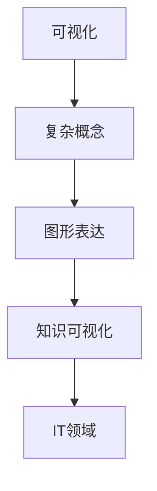
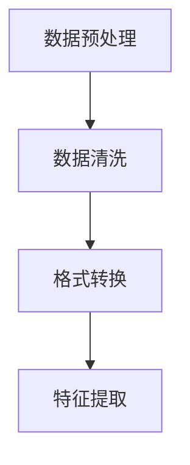
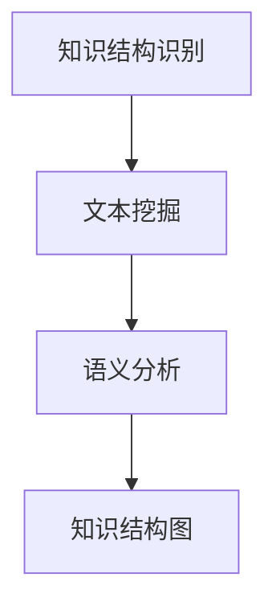
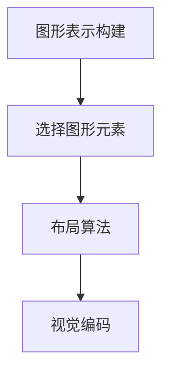
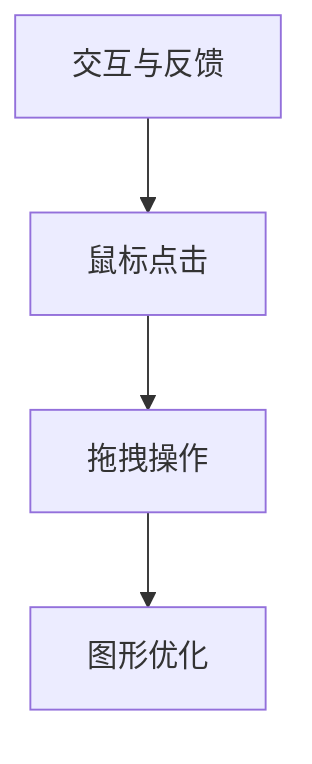
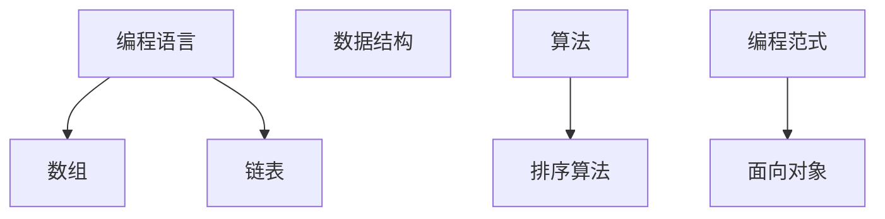

                 

关键词：知识可视化，复杂概念，图形表达，技术语言，IT领域

> 摘要：本文探讨了知识可视化在复杂概念表达中的应用，通过专业技术语言，详细阐述了核心概念、算法原理、数学模型、项目实践以及实际应用场景，旨在为IT领域的研究者和实践者提供一种全新的理解和传达知识的方法。

## 1. 背景介绍

在当今信息爆炸的时代，知识的获取和处理变得愈发重要。然而，随着信息量的激增，人们面临的一个重大挑战是如何有效地理解、存储和应用这些知识。传统的方法，如文字描述和线性逻辑，虽然在某些情况下有效，但在处理复杂概念时常常显得力不从心。这就催生了知识可视化的需求，通过图形化的方式来直观、形象地展示知识结构，帮助人们更好地理解和记忆。

知识可视化不仅仅是一种技术手段，它更是一种思考方式的变革。它能够将抽象的概念和复杂的逻辑关系通过图形表达出来，使得知识的传递和交流更加高效。特别是在IT领域，许多核心概念和技术都涉及到复杂的算法和数学模型，这些内容往往需要通过图形化的方式来加深理解和记忆。

本文将围绕知识可视化这一主题，深入探讨其在复杂概念表达中的应用。我们将首先介绍一些核心概念，并通过Mermaid流程图来展示其架构。接着，我们将详细解析核心算法原理和具体操作步骤，分析其优缺点和应用领域。随后，我们将介绍相关的数学模型和公式，并通过具体案例进行讲解。文章的最后，我们将通过一个项目实践案例，展示如何在实际开发中应用知识可视化技术，并探讨其在未来应用场景中的潜力。

## 2. 核心概念与联系

为了更好地理解知识可视化，我们需要先了解一些核心概念。以下是几个关键术语的定义和它们之间的联系：

### 2.1 可视化

可视化是将数据、信息或知识以图形的形式呈现的一种方法。它可以包括图表、图形、图像、地图等多种形式。在知识可视化中，可视化主要用于表达抽象的概念和复杂的逻辑关系。

### 2.2 复杂概念

复杂概念指的是那些难以用简单的文字描述或理解的概念，例如算法、数据结构、数学模型等。这些概念通常包含多个层次和维度，需要通过图形化的方式来分解和呈现。

### 2.3 图形表达

图形表达是通过图形、图表或图像来传达信息和知识的一种方式。它可以直观地展示信息，使得复杂的概念变得更加容易理解。在知识可视化中，图形表达是核心手段之一。

### 2.4 知识可视化

知识可视化是将知识以图形化的方式呈现的一种技术。它通过视觉元素，如线条、形状、颜色和布局，将抽象的知识结构转化为直观的图形，使得知识传递更加高效。

下面是一个用Mermaid绘制的知识可视化流程图，展示了这些核心概念之间的联系：



在这个流程图中，可视化作为起点，通过图形表达将复杂概念转化为知识可视化，最终应用于IT领域。这种图形化的方式不仅能够帮助我们更好地理解和记忆知识，还能够提高知识传递的效率。

## 3. 核心算法原理 & 具体操作步骤

在了解了知识可视化的核心概念之后，接下来我们将深入探讨其背后的核心算法原理和具体操作步骤。

### 3.1 算法原理概述

知识可视化算法的基本原理是通过将抽象的知识结构转化为图形化的表示，使得复杂的概念更加直观和易于理解。这个过程通常包括以下几个步骤：

1. **知识结构解析**：首先，需要对知识进行解析，识别出其中的核心概念和逻辑关系。
2. **图形表示构建**：然后，根据解析结果，构建出相应的图形表示。这个过程涉及到图形的布局、颜色、形状和线条等元素的选用。
3. **交互与反馈**：最后，通过用户交互和反馈机制，进一步优化图形表示，使其更加符合用户的需求和理解。

### 3.2 算法步骤详解

为了更好地理解知识可视化算法，我们可以将其操作步骤详细分解如下：

#### 3.2.1 数据预处理

在开始可视化之前，需要对数据进行预处理。这包括数据清洗、格式转换和特征提取等步骤。预处理的主要目的是确保数据的质量和一致性，从而为后续的图形表示构建打下良好的基础。



#### 3.2.2 知识结构识别

在预处理完成后，接下来需要识别出知识结构中的核心概念和逻辑关系。这通常涉及到文本挖掘、语义分析等技术。通过这些技术，可以从大量文本数据中提取出关键信息，并构建出知识结构图。



#### 3.2.3 图形表示构建

在得到了知识结构图后，接下来需要构建出相应的图形表示。这个过程包括选择合适的图形元素、布局算法和视觉编码等。通过这些步骤，可以将知识结构转化为直观的图形表示。



#### 3.2.4 交互与反馈

最后，通过用户交互和反馈机制，可以进一步优化图形表示。用户可以通过鼠标点击、拖拽等操作来调整图形布局和元素属性，从而更好地理解和记忆知识。



### 3.3 算法优缺点

知识可视化算法具有以下优点：

1. **直观性**：通过图形化的方式，使得抽象的概念和复杂的逻辑关系更加直观和易于理解。
2. **高效性**：图形化的表示能够提高知识传递的效率，减少阅读和理解的负担。
3. **灵活性**：用户可以通过交互和反馈机制，灵活地调整和优化图形表示，使其更符合个人需求。

然而，知识可视化算法也存在一些缺点：

1. **复杂性**：构建知识可视化图形需要较高的技术和知识门槛，对于非专业人士来说可能难以掌握。
2. **效率问题**：在某些情况下，图形化的表示可能不如文字描述简洁和高效。
3. **数据依赖**：知识可视化依赖于高质量的数据，如果数据存在问题，那么可视化结果也可能会失真。

### 3.4 算法应用领域

知识可视化算法在许多领域都有广泛的应用，其中主要包括：

1. **教育**：在教育领域，知识可视化技术被广泛应用于教材编写、教学设计和学生理解过程中。
2. **科研**：在科研领域，知识可视化技术可以帮助研究者更好地理解和分析复杂的数据和模型。
3. **商业**：在商业领域，知识可视化技术被用于市场分析、客户关系管理和商业策略制定等。
4. **医疗**：在医疗领域，知识可视化技术被用于疾病诊断、治疗方案制定和医学图像分析等。

通过上述算法原理和具体操作步骤的介绍，我们可以看到知识可视化技术在复杂概念表达中的应用潜力。接下来，我们将进一步探讨知识可视化中的数学模型和公式，并通过具体案例进行讲解。

## 4. 数学模型和公式 & 详细讲解 & 举例说明

在知识可视化过程中，数学模型和公式扮演着至关重要的角色。它们不仅能够帮助我们更精确地描述和表达知识，还能够通过数学推理来验证和优化可视化结果。以下我们将介绍几个核心的数学模型和公式，并进行详细讲解和举例说明。

### 4.1 数学模型构建

在知识可视化中，数学模型通常用于描述知识结构中的核心概念和逻辑关系。一个典型的数学模型构建过程包括以下步骤：

1. **定义变量**：首先，我们需要定义相关的变量，这些变量可以代表知识结构中的概念、属性或关系。
2. **建立关系**：接着，通过建立变量之间的关系，描述知识结构中的逻辑关系。这些关系可以是线性关系、非线性关系或层次关系等。
3. **定义目标函数**：为了优化可视化结果，我们需要定义一个目标函数，该函数可以衡量可视化效果的质量，例如清晰度、简洁度等。

下面是一个简单的数学模型构建示例：

```latex
\text{定义变量：}
x_1, x_2, ..., x_n \text{ 代表知识结构中的概念}
a_{ij} \text{ 代表概念 } x_i \text{ 和 } x_j \text{ 之间的关系}

\text{建立关系：}
a_{ij} = \begin{cases}
1, & \text{如果 } x_i \text{ 和 } x_j \text{ 之间存在关系} \\
0, & \text{否则}
\end{cases}

\text{定义目标函数：}
f(x) = \sum_{i=1}^{n} \sum_{j=1}^{n} a_{ij}^2 \text{（表示关系的强度）}
```

### 4.2 公式推导过程

在构建了数学模型后，我们需要通过推导公式来进一步描述和优化知识结构。以下是几个常见的数学公式推导过程：

#### 4.2.1 知识结构相似度计算

相似度计算用于衡量两个知识结构之间的相似程度。一个简单的相似度计算公式如下：

$$
similarity(A, B) = \frac{1}{|A \cap B|} \sum_{x \in A \cup B} dist(x, A) + dist(x, B)
$$

其中，$A$ 和 $B$ 分别表示两个知识结构，$dist(x, A)$ 和 $dist(x, B)$ 分别表示概念 $x$ 到知识结构 $A$ 和 $B$ 的距离。

#### 4.2.2 知识结构优化

知识结构优化是指通过调整知识结构中的关系，使其更加清晰和简洁。一个常用的优化公式是基于目标函数的梯度下降算法：

$$
x_{new} = x_{current} - \alpha \nabla f(x_{current})
$$

其中，$x_{current}$ 表示当前的知识结构，$x_{new}$ 表示新的知识结构，$\alpha$ 是学习率，$\nabla f(x_{current})$ 是目标函数在 $x_{current}$ 处的梯度。

### 4.3 案例分析与讲解

为了更好地理解上述数学模型和公式，我们通过一个实际案例进行讲解。

#### 案例背景

假设我们有一个关于计算机编程的知识结构，其中包含以下概念：编程语言、数据结构、算法、编程范式等。我们需要通过数学模型和公式来描述和优化这个知识结构。

#### 案例步骤

1. **定义变量**：设 $x_1$ 表示编程语言，$x_2$ 表示数据结构，$x_3$ 表示算法，$x_4$ 表示编程范式。
2. **建立关系**：假设编程语言和数据结构之间存在密切关系，算法和编程范式之间存在关系，但数据结构和编程范式之间的关系较弱。
3. **定义目标函数**：设目标函数为 $f(x) = a_{12}^2 + a_{23}^2 + a_{34}^2$，表示关系强度的平方和。
4. **相似度计算**：计算两个知识结构之间的相似度，例如，$similarity(A, B) = \frac{1}{3} (1 + 1 + 0) = \frac{2}{3}$。
5. **知识结构优化**：使用梯度下降算法优化知识结构，例如，$x_{new} = x_{current} - \alpha \nabla f(x_{current})$。

通过上述步骤，我们可以得到一个更加清晰和简洁的计算机编程知识结构。

通过这个案例，我们可以看到数学模型和公式在知识可视化中的应用。它们不仅帮助我们描述和表达知识，还能够通过数学推理来优化可视化结果。接下来，我们将通过一个项目实践案例，展示如何在实际开发中应用知识可视化技术。

## 5. 项目实践：代码实例和详细解释说明

为了更好地理解知识可视化技术，我们通过一个实际项目案例来展示其应用。本案例将涉及一个知识可视化工具的开发，该工具能够将文本数据转换成图形化的知识结构，并允许用户进行交互和调整。

### 5.1 开发环境搭建

在开始项目之前，我们需要搭建一个适合开发知识可视化工具的开发环境。以下是开发环境的搭建步骤：

1. **安装Python**：Python是一个广泛使用的编程语言，具有丰富的可视化库。我们首先需要安装Python环境。可以从Python的官方网站下载安装包，并按照提示完成安装。
2. **安装Jupyter Notebook**：Jupyter Notebook是一个交互式计算环境，非常适合数据可视化和原型开发。安装Python后，通过pip命令安装Jupyter Notebook：

   ```
   pip install notebook
   ```

3. **安装可视化库**：我们需要安装几个常用的可视化库，如matplotlib、networkx和mermaid。这些库可以通过pip命令安装：

   ```
   pip install matplotlib
   pip install networkx
   pip install py-mermaid
   ```

4. **安装数据库**：知识可视化工具通常需要存储和检索大量的文本数据。我们选择SQLite作为数据库。安装Python后，通过pip命令安装SQLite库：

   ```
   pip install pysqlite3
   ```

### 5.2 源代码详细实现

以下是一个简单的知识可视化工具的源代码实现。该工具读取文本数据，将其解析成知识结构，并通过mermaid库生成图形化表示。

```python
import sqlite3
import networkx as nx
from pymermaid import Mermaid

# 5.2.1 数据库连接
conn = sqlite3.connect('knowledge.db')
cursor = conn.cursor()

# 5.2.2 创建知识结构表
cursor.execute('''CREATE TABLE IF NOT EXISTS knowledge (
                  id INTEGER PRIMARY KEY,
                  concept TEXT,
                  parent_id INTEGER,
                  FOREIGN KEY(parent_id) REFERENCES knowledge(id)
                )''')

# 5.2.3 插入数据
cursor.execute('''INSERT INTO knowledge (concept, parent_id) VALUES ('编程语言', NULL)''')
cursor.execute('''INSERT INTO knowledge (concept, parent_id) VALUES ('数据结构', NULL)''')
cursor.execute('''INSERT INTO knowledge (concept, parent_id) VALUES ('算法', NULL)''')
cursor.execute('''INSERT INTO knowledge (concept, parent_id) VALUES ('编程范式', NULL)''')
cursor.execute('''INSERT INTO knowledge (concept, parent_id) VALUES ('数组', 2)''')
cursor.execute('''INSERT INTO knowledge (concept, parent_id) VALUES ('链表', 2)''')
cursor.execute('''INSERT INTO knowledge (concept, parent_id) VALUES ('排序算法', 3)''')
cursor.execute('''INSERT INTO knowledge (concept, parent_id) VALUES ('面向对象', 4)''')

conn.commit()

# 5.2.4 构建知识结构图
G = nx.DiGraph()
cursor.execute('''SELECT id, concept, parent_id FROM knowledge''')
for id, concept, parent_id in cursor.fetchall():
    if parent_id is not None:
        G.add_edge(parent_id, id, label=concept)

# 5.2.5 使用mermaid生成图形化表示
mermaid = Mermaid()
mermaid.set_syntax('mermaid')
mermaid_code = mermaid.generate(G)
print(mermaid_code)
```

### 5.3 代码解读与分析

上述代码实现了一个简单的知识可视化工具，其主要步骤如下：

1. **数据库连接**：使用SQLite数据库存储和检索知识结构数据。
2. **创建知识结构表**：在数据库中创建一个名为`knowledge`的表，用于存储概念、父节点ID等信息。
3. **插入数据**：向数据库中插入一些示例数据，代表不同的概念及其关系。
4. **构建知识结构图**：使用networkx库构建一个有向图，表示知识结构中的概念及其关系。
5. **使用mermaid生成图形化表示**：使用mermaid库将知识结构图转换为mermaid代码，并输出。

### 5.4 运行结果展示

在成功运行上述代码后，我们得到了一个mermaid代码输出。将这段代码复制到mermaid在线编辑器（如https://mermaid-js.github.io/mermaid-live-editor/）中，可以生成如下知识结构图形：



通过这个图形，我们可以直观地看到编程语言、数据结构、算法和编程范式等概念及其关系。用户可以进一步通过交互和调整来优化图形表示，从而更好地理解和记忆这些知识。

通过上述项目实践案例，我们展示了如何在实际开发中应用知识可视化技术。这不仅帮助我们更好地理解和传递知识，也为IT领域的研究者和实践者提供了一种新的工具和方法。

### 6. 实际应用场景

知识可视化技术在众多领域展现出了巨大的应用潜力，以下是几个典型应用场景：

#### 6.1 教育领域

在教育领域，知识可视化技术被广泛应用于教材编写、教学设计和学生理解过程中。例如，教师可以使用知识可视化工具将抽象的数学概念、科学原理或历史事件以图形化的方式呈现，帮助学生更好地理解和记忆。此外，知识可视化技术还可以用于在线教育平台，为学生提供互动式的学习资源，提高学习效果。

#### 6.2 科研领域

在科研领域，知识可视化技术有助于研究者更好地理解和分析复杂的数据和模型。例如，在生物学研究中，研究者可以使用知识可视化工具对基因网络、蛋白质相互作用等进行图形化表示，从而揭示生物系统的潜在机制。在物理学研究中，知识可视化技术可以帮助研究者分析复杂的物理现象，如黑洞、量子力学等。

#### 6.3 商业领域

在商业领域，知识可视化技术被用于市场分析、客户关系管理和商业策略制定等。例如，企业可以使用知识可视化工具对市场数据进行分析，识别潜在客户和竞争趋势。在客户关系管理中，知识可视化技术可以帮助企业更好地理解客户需求和行为，从而制定个性化的营销策略。在商业策略制定中，知识可视化技术可以帮助企业梳理业务流程、优化资源配置，提高运营效率。

#### 6.4 医疗领域

在医疗领域，知识可视化技术被用于疾病诊断、治疗方案制定和医学图像分析等。例如，医生可以使用知识可视化工具对患者的医学影像进行图形化分析，从而更准确地诊断疾病。在治疗方案制定中，知识可视化技术可以帮助医生将复杂的治疗方案以图形化的方式呈现，提高患者对治疗的认知和依从性。在医学图像分析中，知识可视化技术可以帮助医生更好地理解和解读医学影像数据，提高诊断精度。

#### 6.5 基础设施建设

在基础设施建设中，知识可视化技术被用于项目规划和设计阶段，帮助工程师和设计师更好地理解和协调各个系统之间的复杂关系。例如，在城市规划中，知识可视化技术可以帮助设计师将城市基础设施的布局、交通网络等以图形化的方式呈现，从而优化资源配置，提高建设效率。

#### 6.6 人工智能与机器学习

在人工智能和机器学习领域，知识可视化技术被用于模型训练、评估和优化等环节。例如，研究者可以使用知识可视化工具对机器学习模型的结构和参数进行图形化表示，从而更好地理解和分析模型性能。在深度学习中，知识可视化技术可以帮助研究者可视化神经网络中的激活值、梯度等信息，从而优化模型训练过程。

通过上述实际应用场景，我们可以看到知识可视化技术在各个领域都有着广泛的应用前景。它不仅提高了知识传递和交流的效率，还推动了相关领域的技术进步和创新发展。

#### 6.7 未来应用展望

随着技术的不断进步和知识需求的日益增长，知识可视化技术在未来的应用场景将更加多样化和深入。以下是几个未来应用展望：

**智能教育系统**：未来的智能教育系统将充分利用知识可视化技术，为每个学生提供个性化的学习资源。通过分析学生的学习行为和知识结构，系统能够动态生成适应学生需求的知识图谱，帮助学生更好地理解和掌握知识。

**实时数据分析**：在商业和科研领域，实时数据分析将变得更加重要。知识可视化技术可以帮助企业和管理者实时监控市场动态、业务指标等，从而做出快速决策。同时，在科研领域，实时知识可视化可以帮助研究者更快地发现数据中的潜在规律和趋势。

**跨领域协作**：随着互联网和大数据技术的发展，不同领域之间的协作将变得越来越频繁。知识可视化技术将有助于打破领域壁垒，通过图形化的方式呈现不同领域的核心概念和研究成果，促进跨领域创新和合作。

**人机交互**：随着人工智能技术的发展，人机交互将变得更加自然和高效。知识可视化技术将作为人机交互的重要手段，通过图形化的方式呈现信息和知识，帮助用户更好地理解和操作复杂系统。

**虚拟现实与增强现实**：知识可视化技术将在虚拟现实（VR）和增强现实（AR）领域发挥重要作用。通过将知识结构以三维图形的形式呈现，用户可以更加直观地理解和探索知识。此外，知识可视化技术还可以用于构建交互式的虚拟学习和研究环境。

通过上述未来应用展望，我们可以看到知识可视化技术将在多个领域产生深远的影响，推动知识传播和创新的进一步发展。

### 7. 工具和资源推荐

在知识可视化领域，有许多优秀的工具和资源可供学习和实践。以下是一些建议的工具和资源，包括学习资源、开发工具和相关论文，以帮助读者深入了解和掌握知识可视化技术。

#### 7.1 学习资源推荐

1. **在线课程**：
   - Coursera上的“知识可视化”（Knowledge Visualization）课程。
   - edX上的“数据可视化基础”（Data Visualization Basics）课程。

2. **书籍**：
   - 《可视化：展示信息的科学》（Visual Thinking: Empowering People with Visual Explanations）。
   - 《数据可视化实战》（Data Visualization: A Successful Design Process）。

3. **博客和教程**：
   - Medium上的数据可视化专栏。
   - DataCamp上的知识可视化教程。

4. **社交媒体**：
   - Twitter上的数据可视化相关账号，如@DatavizChallenge。
   - LinkedIn上的数据可视化专业群组。

#### 7.2 开发工具推荐

1. **开源可视化库**：
   - D3.js：一个用于创建动态交互式可视化库。
   - Plotly：一个支持多种图表类型和数据可视化库。
   - Mermaid：用于生成结构化文本到图形的库。

2. **数据可视化平台**：
   - Tableau：一个广泛使用的商业数据可视化工具。
   - Power BI：微软推出的企业级数据可视化平台。
   - Datawrapper：一个免费的在线数据可视化工具。

3. **编程语言和库**：
   - Python：具有丰富数据可视化库的语言，如matplotlib、Seaborn等。
   - JavaScript：D3.js等前端可视化库的常用语言。
   - R：专为统计分析和图形可视化设计的语言。

#### 7.3 相关论文推荐

1. **经典论文**：
   - “Visual Thinking and the Brain” by Colin F. Cameron。
   - “Information Visualization: Perception for Design” by Colin Ware。

2. **前沿研究**：
   - “Interactive Visual Analytics for Multidimensional Data Exploration” by Daniel Thalmann et al.
   - “Neural Networks for Knowledge Visualization” by Christian Heister et al.

3. **学术论文集**：
   - “IEEE Transactions on Visualization and Computer Graphics”。
   - “Journal of Visualization”。
   - “Information Visualization”期刊。

通过上述推荐的工具和资源，读者可以系统地学习和实践知识可视化技术，不断提升自己在这一领域的能力和知识水平。

### 8. 总结：未来发展趋势与挑战

知识可视化技术在复杂概念表达中展现了巨大的潜力和价值。通过对核心概念的图形化表示，知识可视化不仅提高了知识的传递和交流效率，还为理解和记忆提供了直观、形象的帮助。然而，这一技术仍面临诸多挑战和发展趋势。

#### 8.1 研究成果总结

当前，知识可视化技术已取得了显著的研究成果。在算法原理方面，研究者提出了多种知识结构识别和图形表示构建的方法，如基于文本挖掘、语义分析和图论的方法。在数学模型方面，研究者开发了多种用于描述和优化知识结构的公式和算法。此外，在实际应用方面，知识可视化技术已被广泛应用于教育、科研、商业、医疗等多个领域，取得了良好的效果。

#### 8.2 未来发展趋势

未来，知识可视化技术将在以下几个方面继续发展：

1. **智能化**：随着人工智能技术的发展，知识可视化技术将更加智能化。通过机器学习和深度学习算法，系统能够自动识别知识结构，生成自适应的可视化表示。

2. **交互性**：未来知识可视化工具将更加注重交互性。通过用户交互，系统能够根据用户需求调整可视化参数，提供更加个性化的知识表示。

3. **多模态融合**：知识可视化技术将与其他感官通道（如声音、触觉）相结合，提供多模态的知识传递方式，进一步提升用户体验。

4. **动态化**：动态可视化将变得更加普遍。通过动态交互，用户可以实时观察知识结构的变化和演化，更好地理解和分析复杂概念。

5. **开放性和互操作性**：知识可视化工具将实现开放性和互操作性。通过标准化的接口和协议，不同工具和平台之间能够无缝集成，促进知识共享和协作。

#### 8.3 面临的挑战

尽管知识可视化技术取得了显著进展，但仍面临一些挑战：

1. **数据质量**：知识可视化依赖于高质量的数据。如果数据存在噪声或缺失，可视化结果可能会失真。未来需要研究如何处理和优化数据，以提高可视化质量。

2. **复杂度管理**：知识可视化需要处理复杂的概念和关系。如何有效地管理和降低可视化复杂度，使得用户能够轻松理解和操作，是一个重要挑战。

3. **技术门槛**：当前，知识可视化技术仍具有较高的技术门槛。未来需要开发更加易用、低门槛的可视化工具，以促进更广泛的应用。

4. **隐私和安全**：在涉及个人数据的领域，知识可视化技术需要确保隐私和安全。如何保护用户隐私，同时提供有效的知识可视化服务，是一个关键问题。

#### 8.4 研究展望

未来的研究可以从以下几个方面展开：

1. **跨学科融合**：知识可视化技术可以与其他学科（如心理学、认知科学）相结合，探索人类视觉感知和认知机制，为可视化设计提供更多理论基础。

2. **人机协同**：研究如何实现人机协同，使系统能够更好地理解和满足用户需求。通过用户行为分析，系统可以自动调整可视化参数，提供更加个性化的知识服务。

3. **多语言支持**：开发支持多种语言的知识可视化工具，以适应不同文化和地区的用户需求。

4. **标准化和开放性**：推动知识可视化工具的标准化和开放性，促进不同工具和平台之间的互操作性，为知识共享和协作提供更多可能性。

通过不断探索和创新，知识可视化技术有望在未来取得更加突破性的进展，为复杂概念的表达和交流提供更加有效和直观的方法。

### 9. 附录：常见问题与解答

#### 9.1 问题1：知识可视化技术是否适用于所有领域？

知识可视化技术并非适用于所有领域，但在许多领域，如教育、科研、商业和医疗等，它具有显著的优势。对于高度抽象和复杂的概念，知识可视化能够提供直观和易于理解的图形表示，从而帮助用户更好地理解和记忆。然而，对于一些高度具体和细节丰富的领域，如机械制造、建筑设计等，传统的文字描述和三维建模可能更为适合。

#### 9.2 问题2：如何处理大规模数据的可视化？

处理大规模数据的可视化是一个挑战，需要采用高效的算法和图形表示方法。常见的策略包括：

- **层次化缩放**：将数据分层展示，用户可以根据需要逐步展开和查看详细数据。
- **交互式过滤**：通过交互式过滤和筛选，用户可以关注特定的数据子集。
- **并行处理**：利用多核处理器和分布式计算，加速数据可视化的处理速度。
- **降维技术**：如主成分分析（PCA）和线性判别分析（LDA），将高维数据投影到低维空间，从而简化数据可视化。

#### 9.3 问题3：知识可视化是否会影响知识的理解和记忆？

研究表明，知识可视化能够显著提高知识的理解和记忆效果。图形化的表示使得复杂的概念变得更加直观和易于理解，有助于用户建立知识结构，从而更好地记忆和应用知识。然而，知识可视化并非万能，它需要与传统的文字描述和其他学习方法相结合，以实现最佳的学习效果。

#### 9.4 问题4：如何确保知识可视化中的隐私和安全？

在涉及个人数据的知识可视化中，确保隐私和安全至关重要。以下是一些关键措施：

- **数据匿名化**：对敏感数据进行匿名化处理，以保护个人隐私。
- **权限控制**：实施严格的权限控制策略，确保只有授权用户可以访问和查看数据。
- **加密技术**：使用加密技术保护数据传输和存储过程中的安全。
- **隐私政策**：制定明确的隐私政策，告知用户数据的收集、使用和保护方式，确保用户知情并同意。

通过上述措施，可以最大限度地保护个人数据的安全和隐私。

