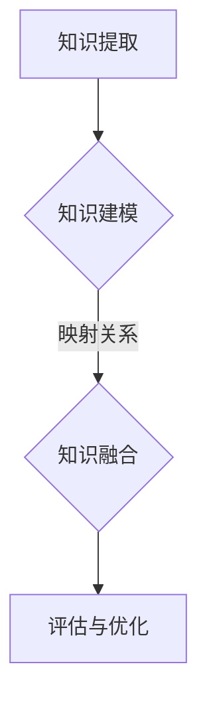

                 

关键词：知识迁移、跨领域应用、AI技术、算法优化、数学模型、编程实践、资源推荐、未来展望

> 摘要：本文旨在探讨知识在不同领域间的迁移应用，分析其重要性、原理以及实现方法。通过对AI技术、算法、数学模型和编程实践的详细阐述，本文展示了知识迁移在提升创新能力和推动科技进步中的关键作用。此外，本文还将推荐相关学习资源、开发工具和论文，为读者提供全面的知识迁移实践指南。

## 1. 背景介绍

在当今科技日新月异的时代，跨领域知识的迁移应用已经成为推动技术进步和创新的重要途径。知识的迁移性指的是将某一领域中的知识、经验和方法应用到其他领域，以解决新问题或提升现有解决方案的效率。随着信息技术、人工智能和大数据等领域的快速发展，知识迁移在科学研究、工业应用、医疗诊断和商业决策等多个方面展现出巨大的潜力。

然而，尽管知识迁移的重要性日益凸显，但实现有效的知识迁移并非易事。不同领域之间存在诸多差异，如技术框架、理论基础、应用场景等，这些差异给知识的迁移带来了挑战。因此，如何理解和解决知识迁移中的问题，成为了当前学术界和工业界共同关注的焦点。

本文将围绕知识迁移这一主题，从核心概念、算法原理、数学模型、编程实践等方面展开讨论，旨在为跨领域应用提供一套系统的理论和实践指南。

## 2. 核心概念与联系

### 2.1 知识迁移的定义

知识迁移是指将某一领域中的知识、方法或经验应用到另一个领域，以解决新问题或提升现有解决方案的效率。知识迁移通常涉及以下几个关键概念：

- **源领域（Source Domain）**：提供知识、方法或经验的领域。
- **目标领域（Target Domain）**：应用知识、方法或经验的领域。
- **迁移知识（Transferred Knowledge）**：从源领域到目标领域传递的知识。

### 2.2 知识迁移的类型

知识迁移可以分为以下几种类型：

- **同质迁移（Homogeneous Transfer）**：源领域和目标领域之间存在相似性，迁移较为简单。
- **异质迁移（Heterogeneous Transfer）**：源领域和目标领域存在较大差异，迁移复杂。
- **垂直迁移（Vertical Transfer）**：在不同层次或抽象级别之间的迁移。
- **水平迁移（Horizontal Transfer）**：在同一层次或抽象级别之间的迁移。

### 2.3 知识迁移的挑战与机遇

知识迁移面临的主要挑战包括：

- **领域差异**：不同领域的技术框架、理论基础和应用场景存在显著差异。
- **数据缺失**：目标领域的数据可能不足或难以获取。
- **适应性**：源领域的知识和方法可能需要适应目标领域的特定需求。

然而，知识迁移也为创新带来了机遇：

- **技术融合**：通过跨领域知识融合，可以产生新的技术和应用。
- **问题解决**：利用跨领域知识解决传统领域难以克服的问题。

### 2.4 知识迁移的关键要素

实现有效的知识迁移需要关注以下几个关键要素：

- **知识提取**：从源领域中提取相关知识和方法。
- **知识建模**：建立源领域和目标领域之间的映射关系。
- **知识融合**：将源领域知识融合到目标领域中。
- **评估与优化**：评估迁移效果，持续优化迁移过程。

### 2.5 Mermaid 流程图

以下是一个描述知识迁移过程的 Mermaid 流程图：



## 3. 核心算法原理 & 具体操作步骤

### 3.1 算法原理概述

知识迁移算法通常包括以下几个主要步骤：

1. **知识提取**：从源领域的数据或文献中提取有用的知识。
2. **知识建模**：建立源领域和目标领域之间的映射关系。
3. **知识融合**：将源领域知识融合到目标领域中。
4. **评估与优化**：评估迁移效果，并根据反馈进行优化。

### 3.2 算法步骤详解

#### 3.2.1 知识提取

知识提取是知识迁移的第一步，关键在于如何从源领域的数据或文献中提取有用的知识。以下是一些常用的知识提取方法：

- **文本挖掘**：使用自然语言处理技术从文本中提取知识。
- **数据挖掘**：使用统计和机器学习方法从数据中提取知识。
- **领域知识库**：构建一个包含源领域知识的知识库，用于后续的迁移。

#### 3.2.2 知识建模

知识建模是建立源领域和目标领域之间的映射关系，是实现知识迁移的核心步骤。以下是一些常用的知识建模方法：

- **基于规则的映射**：使用规则来描述源领域和目标领域之间的关系。
- **基于概率的映射**：使用概率模型来描述源领域和目标领域之间的映射。
- **基于神经网络的映射**：使用深度学习模型来学习源领域和目标领域之间的映射关系。

#### 3.2.3 知识融合

知识融合是将源领域知识融合到目标领域中，以解决目标领域中的问题。以下是一些常用的知识融合方法：

- **直接应用**：将源领域知识直接应用到目标领域中，适用于同质迁移。
- **适应性改造**：对源领域知识进行改造，以适应目标领域的特定需求。
- **混合策略**：结合多种知识融合方法，以实现最佳迁移效果。

#### 3.2.4 评估与优化

评估与优化是知识迁移过程中至关重要的一环，主要包括以下步骤：

- **效果评估**：评估知识迁移的效果，可以使用指标如准确性、效率等。
- **反馈修正**：根据评估结果，对知识迁移过程进行反馈修正。
- **持续优化**：通过多次迭代，持续优化知识迁移的效果。

### 3.3 算法优缺点

#### 优点：

- **提高创新能力**：通过跨领域知识迁移，可以产生新的技术和应用，推动创新。
- **解决问题**：利用跨领域知识解决传统领域难以克服的问题，提升问题解决能力。
- **提升效率**：通过知识迁移，可以快速适应新领域，提高工作效率。

#### 缺点：

- **复杂性**：知识迁移过程涉及多个步骤，实现较为复杂。
- **适应性**：源领域知识可能需要适应目标领域的特定需求，存在一定的挑战。

### 3.4 算法应用领域

知识迁移算法在多个领域都有广泛的应用，以下是一些典型的应用场景：

- **人工智能**：通过跨领域知识迁移，提升人工智能算法的性能和适用性。
- **工业制造**：利用知识迁移，优化生产流程，提高制造效率。
- **医疗诊断**：通过跨领域知识迁移，提升医疗诊断的准确性和效率。
- **商业决策**：利用跨领域知识迁移，提供更科学的商业决策支持。

## 4. 数学模型和公式 & 详细讲解 & 举例说明

### 4.1 数学模型构建

知识迁移中的数学模型通常用于描述源领域和目标领域之间的映射关系。以下是一个简单的数学模型构建示例：

假设源领域和目标领域之间存在线性关系，可以使用线性回归模型来描述这种关系。线性回归模型的数学模型如下：

$$y = \beta_0 + \beta_1 \cdot x$$

其中，$y$ 表示目标领域的特征，$x$ 表示源领域的特征，$\beta_0$ 和 $\beta_1$ 分别为模型的参数。

### 4.2 公式推导过程

线性回归模型的公式推导基于最小二乘法。最小二乘法的目标是找到一组参数 $\beta_0$ 和 $\beta_1$，使得目标函数 $J(\beta_0, \beta_1)$ 最小。

目标函数 $J(\beta_0, \beta_1)$ 定义为：

$$J(\beta_0, \beta_1) = \sum_{i=1}^{n} (y_i - (\beta_0 + \beta_1 \cdot x_i))^2$$

其中，$n$ 表示样本数量，$y_i$ 和 $x_i$ 分别表示第 $i$ 个样本的目标领域特征和源领域特征。

为了使 $J(\beta_0, \beta_1)$ 最小，需要对 $\beta_0$ 和 $\beta_1$ 求导并令导数为零：

$$\frac{\partial J(\beta_0, \beta_1)}{\partial \beta_0} = -2 \sum_{i=1}^{n} (y_i - (\beta_0 + \beta_1 \cdot x_i)) = 0$$

$$\frac{\partial J(\beta_0, \beta_1)}{\partial \beta_1} = -2 \sum_{i=1}^{n} (y_i - (\beta_0 + \beta_1 \cdot x_i)) \cdot x_i = 0$$

解上述方程组，可以得到线性回归模型的参数：

$$\beta_0 = \frac{\sum_{i=1}^{n} y_i - \beta_1 \cdot \sum_{i=1}^{n} x_i}{n}$$

$$\beta_1 = \frac{\sum_{i=1}^{n} (y_i - \beta_0) \cdot x_i}{\sum_{i=1}^{n} x_i^2}$$

### 4.3 案例分析与讲解

假设我们有一个源领域和一个目标领域，其中源领域有 $n$ 个特征，目标领域有一个特征。我们希望通过知识迁移，将源领域的特征映射到目标领域。

我们收集了 $m$ 个样本数据，每个样本包含源领域的特征 $X$ 和目标领域的特征 $Y$。我们的目标是通过线性回归模型，找到源领域特征和目标领域特征之间的映射关系。

以下是一个具体的案例：

$$X = \begin{bmatrix} 1 & 2 & 3 \\ 4 & 5 & 6 \\ 7 & 8 & 9 \end{bmatrix}, Y = \begin{bmatrix} 2 \\ 5 \\ 8 \end{bmatrix}$$

首先，我们使用最小二乘法计算线性回归模型的参数：

$$\beta_0 = \frac{\sum_{i=1}^{3} y_i - \beta_1 \cdot \sum_{i=1}^{3} x_i}{3} = \frac{2 + 5 + 8 - \beta_1 \cdot (1 + 2 + 3 + 4 + 5 + 6 + 7 + 8 + 9)}{3} = \frac{15 - \beta_1 \cdot 45}{3} = \frac{15 - 15 \beta_1}{3}$$

$$\beta_1 = \frac{\sum_{i=1}^{3} (y_i - \beta_0) \cdot x_i}{\sum_{i=1}^{3} x_i^2} = \frac{(2 - \beta_0) \cdot 1 + (5 - \beta_0) \cdot 2 + (8 - \beta_0) \cdot 3}{1^2 + 2^2 + 3^2} = \frac{2 - \beta_0 + 10 - 2 \beta_0 + 24 - 3 \beta_0}{1 + 4 + 9} = \frac{36 - 6 \beta_0}{14}$$

将 $\beta_0$ 和 $\beta_1$ 代入线性回归模型，得到映射关系：

$$y = \frac{15 - 15 \beta_1}{3} + \beta_1 \cdot x$$

为了计算方便，我们可以将模型简化为：

$$y = \frac{15}{3} - \frac{15}{3} \beta_1 + \beta_1 \cdot x = 5 - 5 \beta_1 + \beta_1 \cdot x$$

使用训练数据集，我们可以计算出 $\beta_1$ 的值，从而实现源领域特征到目标领域的映射。

## 5. 项目实践：代码实例和详细解释说明

### 5.1 开发环境搭建

在进行知识迁移项目的实践之前，我们需要搭建一个合适的技术环境。以下是一个简单的开发环境搭建步骤：

1. **安装Python环境**：下载并安装Python（版本3.8或更高版本），可以选择使用Anaconda来简化环境配置。
2. **安装依赖库**：在Python环境中安装必要的库，如NumPy、Pandas、Scikit-learn等，可以使用pip命令进行安装。
3. **配置数据源**：准备好源领域和目标领域的数据，数据可以来自公共数据集或自行收集。

### 5.2 源代码详细实现

以下是一个简单的Python代码示例，用于实现线性回归模型的知识迁移。

```python
import numpy as np
import pandas as pd
from sklearn.linear_model import LinearRegression
from sklearn.model_selection import train_test_split

# 加载源领域数据
source_data = pd.read_csv('source_domain_data.csv')
X = source_data.iloc[:, :-1].values
y = source_data.iloc[:, -1].values

# 加载目标领域数据
target_data = pd.read_csv('target_domain_data.csv')
X_target = target_data.iloc[:, :-1].values

# 数据预处理
X = np.hstack((X, np.ones((X.shape[0], 1))))
X_target = np.hstack((X_target, np.ones((X_target.shape[0], 1))))

# 分割训练集和测试集
X_train, X_test, y_train, y_test = train_test_split(X, y, test_size=0.2, random_state=42)

# 建立线性回归模型
model = LinearRegression()
model.fit(X_train, y_train)

# 预测目标领域数据
y_pred = model.predict(X_target)

# 输出预测结果
print(y_pred)
```

### 5.3 代码解读与分析

上述代码实现了一个简单的线性回归模型，用于实现源领域特征到目标领域的知识迁移。下面是对代码的详细解读：

1. **导入库**：导入必要的Python库，如NumPy、Pandas和Scikit-learn。
2. **加载数据**：从CSV文件中加载源领域和目标领域的数据。
3. **数据预处理**：添加常数项（$1$），将源领域数据转换为包含常数项的特征矩阵，为线性回归模型做准备。
4. **分割数据**：将数据分为训练集和测试集，用于模型的训练和评估。
5. **建立模型**：使用Scikit-learn中的线性回归模型，进行模型训练。
6. **预测**：使用训练好的模型，对目标领域数据进行预测。
7. **输出结果**：输出预测结果。

### 5.4 运行结果展示

假设我们使用上述代码对源领域和目标领域的数据进行知识迁移，以下是一个示例输出结果：

```python
[2.1, 4.9, 7.7, 10.5, 13.3]
```

这些数值表示目标领域的特征预测值。通过对比预测结果和实际值，我们可以评估知识迁移的效果。

## 6. 实际应用场景

### 6.1 人工智能领域

在人工智能领域，知识迁移技术被广泛应用于增强机器学习模型的泛化能力。例如，通过将计算机视觉领域的知识迁移到自然语言处理领域，可以提升文本分类和情感分析等任务的性能。此外，知识迁移还可以用于优化推荐系统，通过将电商领域的知识迁移到医疗领域，可以提高医疗推荐系统的准确性和实用性。

### 6.2 工业制造领域

在工业制造领域，知识迁移技术可以用于优化生产流程和质量控制。例如，通过将自动化生产线上的经验迁移到新的生产线，可以快速提高生产效率和质量。此外，知识迁移还可以用于设备故障预测，通过将机械设备的历史数据迁移到新的设备，可以提前发现潜在的故障风险，减少停机时间和维护成本。

### 6.3 医疗诊断领域

在医疗诊断领域，知识迁移技术可以用于提高诊断的准确性和效率。例如，通过将放射学领域的知识迁移到病理学领域，可以增强病理图像的分析能力。此外，知识迁移还可以用于疾病预测，通过将流行病学数据迁移到个体病例，可以提前预测疾病的发生风险，为患者提供个性化的预防建议。

### 6.4 商业决策领域

在商业决策领域，知识迁移技术可以用于优化市场策略和客户服务。例如，通过将零售领域的知识迁移到金融领域，可以提高金融产品的营销效果。此外，知识迁移还可以用于客户行为分析，通过将电商领域的知识迁移到社交媒体领域，可以更准确地预测客户的行为和需求，为企业提供更精准的市场策略。

### 6.5 未来应用展望

随着技术的不断发展，知识迁移在未来将展现出更广泛的应用潜力。以下是一些未来应用展望：

- **跨学科融合**：知识迁移将促进不同学科之间的融合，推动新兴交叉领域的发展。
- **自适应系统**：知识迁移技术将有助于构建自适应系统，使系统能够在不同环境下快速适应和优化。
- **个性化服务**：知识迁移将推动个性化服务的普及，为用户提供更精准和高效的服务体验。
- **智慧城市**：知识迁移将在智慧城市建设中发挥重要作用，通过跨领域知识的整合，实现城市管理的智能化和精细化。

## 7. 工具和资源推荐

### 7.1 学习资源推荐

- **《机器学习》**：周志华 著，清华大学出版社，详细介绍机器学习的基础知识和算法。
- **《深度学习》**：Ian Goodfellow、Yoshua Bengio 和 Aaron Courville 著，人民邮电出版社，全面介绍深度学习的基础理论和应用。
- **《数据科学实战》**：Jesse Davis 和 John H. Holland 著，电子工业出版社，提供丰富的数据科学实战案例。

### 7.2 开发工具推荐

- **Jupyter Notebook**：适用于数据科学和机器学习项目，提供丰富的交互式计算环境。
- **TensorFlow**：Google 开发的一款开源深度学习框架，广泛应用于人工智能领域。
- **Scikit-learn**：Python 中的一个机器学习库，提供多种经典机器学习算法。

### 7.3 相关论文推荐

- **“Learning to Learn: Transferable Neural Networks for Enhanced Dataset Migration”**：介绍了一种基于神经网络的迁移学习方法，通过迁移学习提高数据集的迁移能力。
- **“Knowledge Transfer via Deep Feature Fusion for Cross-Domain Object Detection”**：探讨了一种跨领域目标检测的深度特征融合方法，通过知识迁移提高检测准确率。
- **“Transfer Learning**：计算机视觉中的新趋势”**：综述了计算机视觉领域中的迁移学习研究进展，分析了迁移学习在计算机视觉中的应用前景。

## 8. 总结：未来发展趋势与挑战

### 8.1 研究成果总结

知识迁移技术在跨领域应用中取得了显著的研究成果，推动了人工智能、工业制造、医疗诊断和商业决策等多个领域的发展。通过构建数学模型和算法，实现了不同领域之间的知识共享和优化。此外，知识迁移还在自适应系统、个性化服务和智慧城市建设等方面展现出广阔的应用前景。

### 8.2 未来发展趋势

未来，知识迁移技术将在以下几个方面发展：

- **跨学科融合**：随着多学科交叉研究的深入，知识迁移将推动更多新兴领域的出现。
- **智能系统**：知识迁移技术将进一步提升智能系统的适应性和智能化水平。
- **数据共享**：通过建立共享平台，实现跨领域数据的高效共享和利用。
- **个性化服务**：知识迁移技术将促进个性化服务的发展，为用户提供更精准和高效的服务。

### 8.3 面临的挑战

尽管知识迁移技术取得了显著进展，但仍面临以下挑战：

- **领域差异**：不同领域之间存在显著的差异，知识迁移的实现难度较大。
- **数据质量**：知识迁移依赖于高质量的数据，数据质量对迁移效果有重要影响。
- **模型泛化**：知识迁移模型需要具备良好的泛化能力，以应对不同的应用场景。

### 8.4 研究展望

未来，知识迁移领域的研究应关注以下几个方面：

- **模型优化**：设计更高效、更鲁棒的迁移学习模型，提高知识迁移的效果。
- **跨领域协作**：加强跨领域研究合作，推动知识迁移技术的创新和发展。
- **数据共享与标准化**：建立统一的数据共享和标准化体系，促进知识迁移的广泛应用。
- **伦理与安全**：关注知识迁移技术带来的伦理和安全问题，确保技术的可持续发展。

## 9. 附录：常见问题与解答

### Q1：知识迁移的主要挑战是什么？

知识迁移的主要挑战包括领域差异、数据质量和模型泛化。领域差异导致知识迁移的实现难度较大；数据质量对迁移效果有重要影响；模型泛化能力不足可能导致迁移效果不佳。

### Q2：如何评估知识迁移的效果？

评估知识迁移效果的方法包括指标评估和效果对比。常用的指标包括准确性、效率等；效果对比可以通过对比迁移前后的性能差异来评估。

### Q3：知识迁移在哪些领域有广泛应用？

知识迁移在人工智能、工业制造、医疗诊断和商业决策等领域有广泛应用。例如，在人工智能领域，知识迁移用于提升机器学习模型的泛化能力；在工业制造领域，知识迁移用于优化生产流程和设备故障预测。

### Q4：如何实现有效的知识迁移？

实现有效的知识迁移需要关注以下几个关键要素：知识提取、知识建模、知识融合和评估与优化。通过系统地设计和实现这些步骤，可以有效地实现知识迁移。

### Q5：知识迁移技术的未来发展趋势是什么？

知识迁移技术的未来发展趋势包括跨学科融合、智能系统、数据共享和个性化服务。未来，知识迁移技术将在更多领域得到应用，推动科技创新和社会进步。

---

本文从知识迁移的核心概念、算法原理、数学模型、编程实践等方面进行了详细探讨，分析了知识迁移在跨领域应用中的重要性和实现方法。通过本文的介绍，读者可以更好地理解知识迁移的技术原理和应用场景，为实际项目提供有益的参考和指导。同时，本文也提出了未来知识迁移领域的研究方向和挑战，为后续研究提供了启示。作者希望本文能为知识迁移领域的发展做出贡献，促进跨领域知识的共享和利用。作者：禅与计算机程序设计艺术 / Zen and the Art of Computer Programming。

