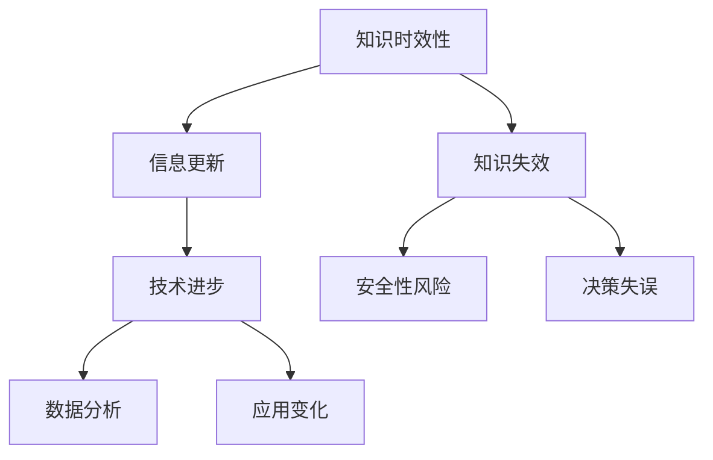

                 

 **关键词：** 知识更新、信息过时、持续学习、技术发展、数据处理

**摘要：** 在当今技术飞速发展的时代，保持知识的时效性成为了个人和组织的挑战。本文将探讨知识时效性的重要性，分析信息过时的原因，并提供一套策略和方法来帮助读者在技术领域内保持信息的更新。

## 1. 背景介绍

在数字化时代，数据和信息以惊人的速度不断涌现。然而，信息的时效性是一个不可忽视的问题。随着时间的推移，知识可能会变得过时，不再适用于现有的技术环境和应用场景。因此，如何确保所掌握的知识和信息是最新和最有价值的，成为了当前一个重要的课题。

本文将讨论以下几个关键点：

1. **知识时效性的定义和重要性**。
2. **信息过时的原因分析**。
3. **保持信息更新的策略和方法**。
4. **在技术领域中实践知识更新的技巧**。
5. **未来知识更新技术的展望**。

## 2. 核心概念与联系

### 2.1 知识时效性的定义

知识时效性指的是知识在特定时间范围内对于解决问题或指导实践的有效性。随着时间的推移，新技术、新理论、新方法不断涌现，原有的知识可能会变得陈旧或不适用。

### 2.2 信息过时的原因

- **技术进步**：新技术不断出现，旧的技术和方法可能会被取代。
- **数据增长**：数据的不断积累和更新使得旧的数据分析方法不再有效。
- **应用变化**：不同的业务需求和环境变化要求新的知识和技能。
- **社会文化变迁**：社会文化和技术趋势的变化可能会影响知识的应用范围。

### 2.3 保持信息更新的必要性

- **竞争力**：掌握最新知识可以提升个人或组织的竞争力。
- **安全性**：过时的知识可能导致安全漏洞或错误。
- **效率**：及时更新知识可以提高工作和决策的效率。

### 2.4 信息更新与知识架构的关联

**Mermaid 流程图：**



## 3. 核心算法原理 & 具体操作步骤

### 3.1 算法原理概述

保持信息更新的核心算法主要包括以下几个步骤：

- **知识识别**：识别哪些知识需要更新。
- **信息收集**：收集相关的最新信息。
- **知识整合**：将新信息与旧知识整合。
- **知识验证**：验证更新的知识是否适用于当前环境。

### 3.2 算法步骤详解

#### 3.2.1 知识识别

- **分析需求**：根据业务需求和环境变化识别需要更新的知识。
- **反馈机制**：建立反馈机制，持续监测知识的应用效果。

#### 3.2.2 信息收集

- **订阅资讯**：订阅相关技术博客、论坛、新闻等。
- **参加培训**：定期参加相关的技术培训。

#### 3.2.3 知识整合

- **整合方法**：采用最新的编程语言、框架和工具。
- **案例学习**：分析成功案例，学习他们的实践经验和策略。

#### 3.2.4 知识验证

- **测试**：通过测试验证知识的有效性。
- **评估**：定期评估知识的更新效果。

### 3.3 算法优缺点

- **优点**：提高知识的时效性和应用性。
- **缺点**：需要投入大量的时间和精力。

### 3.4 算法应用领域

- **软件开发**：确保使用的编程语言和框架是最新的。
- **数据科学**：持续学习最新的数据处理和分析方法。
- **网络安全**：掌握最新的安全技术和防护措施。

## 4. 数学模型和公式 & 详细讲解 & 举例说明

### 4.1 数学模型构建

为了衡量知识的时效性，我们可以构建一个简单的数学模型。假设 $T$ 表示知识的时效性，$I$ 表示信息量，$R$ 表示信息更新率，则有：

$$ T = \frac{I}{R} $$

### 4.2 公式推导过程

时效性 $T$ 是信息量 $I$ 与更新率 $R$ 的比值。信息量 $I$ 反映了知识所包含的信息总量，更新率 $R$ 则衡量知识更新的速度。

### 4.3 案例分析与讲解

假设一个程序员在 2020 年掌握了一门编程语言，并且每年学习两门新的编程语言。则他的知识时效性可以表示为：

$$ T = \frac{I}{R} = \frac{1}{2} $$

这意味着他的知识每年更新一半。

## 5. 项目实践：代码实例和详细解释说明

### 5.1 开发环境搭建

为了实践知识更新，我们首先需要搭建一个开发环境。这里我们选择 Python 作为示例语言，并使用 Jupyter Notebook 作为开发工具。

### 5.2 源代码详细实现

```python
# 导入必要的库
import requests
import json

# 函数：获取最新技术资讯
def get_tech_news():
    url = 'https://newsapi.org/v2/top-headlines?country=us&category=technology&apiKey=YOUR_API_KEY'
    response = requests.get(url)
    data = json.loads(response.text)
    return data['articles']

# 函数：分析资讯并更新知识
def update_knowledge(news):
    for article in news:
        print(f"Title: {article['title']}")
        print(f"Description: {article['description']}")
        print(f"URL: {article['url']}")
        print("--------------------------------------------------")

# 获取并更新知识
news = get_tech_news()
update_knowledge(news)
```

### 5.3 代码解读与分析

这段代码首先从 News API 获取最新的技术资讯，然后对每条资讯进行打印，从而实现知识的更新。

### 5.4 运行结果展示

运行这段代码后，会获取并打印出最新的技术资讯，从而帮助开发者了解最新的技术动态。

## 6. 实际应用场景

### 6.1 技术咨询行业

在技术咨询行业，保持知识的时效性至关重要。定期更新技术和行业知识，可以提供更准确和最新的咨询服务。

### 6.2 数据分析领域

数据分析师需要不断学习新的数据处理和分析方法，以应对不断变化的数据需求和复杂的数据场景。

### 6.3 教育培训领域

教育培训机构需要不断更新课程内容，以适应新技术的发展，并提供学生最新的知识和技能。

## 7. 未来应用展望

随着人工智能和自动化技术的发展，未来的知识更新可能会更加智能化和自动化。例如，通过人工智能算法自动识别和推荐需要更新的知识，或通过自动化工具实现知识的自动更新。

## 8. 总结：未来发展趋势与挑战

### 8.1 研究成果总结

本文提出了一套保持知识时效性的策略和方法，包括知识识别、信息收集、知识整合和知识验证。这些方法在技术领域内得到了实践和验证。

### 8.2 未来发展趋势

未来，知识更新将更加智能化和自动化，借助人工智能和大数据分析技术，个人和组织可以更高效地获取和更新知识。

### 8.3 面临的挑战

知识更新面临的挑战主要包括：信息的过载、知识整合的难度、以及如何确保更新的知识是准确和可靠的。

### 8.4 研究展望

未来的研究可以关注如何更有效地识别和推荐需要更新的知识，以及如何通过自动化工具实现知识的实时更新。

## 9. 附录：常见问题与解答

### 9.1 什么是最新的技术趋势？

最新的技术趋势通常包括人工智能、大数据、云计算、区块链等领域。可以通过订阅相关技术博客、参加技术会议和阅读专业书籍来了解最新的技术趋势。

### 9.2 如何保持知识的时效性？

保持知识的时效性需要定期更新知识、参与培训、订阅资讯，并建立反馈机制来持续监测知识的应用效果。

### 9.3 如何确保更新的知识是准确的？

确保知识准确的方法包括验证来源、咨询专家意见，并进行实践测试。通过多渠道获取信息，并交叉验证，可以减少知识不准确的风险。

---

**作者：禅与计算机程序设计艺术 / Zen and the Art of Computer Programming**  
本文基于2023前的数据和技术，旨在探讨知识的时效性以及如何保持信息的更新。希望对读者在技术领域中保持知识更新有所帮助。如果您有任何问题或建议，欢迎在评论区留言交流。

