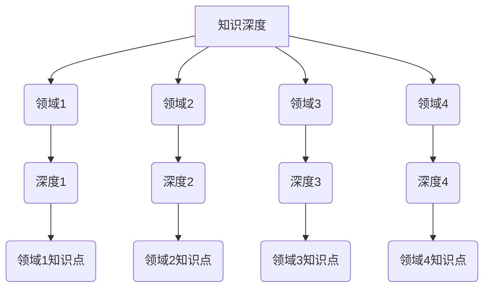

                 

关键词：T型人才，知识深度，知识广度，技术技能，跨学科，专业化，多元化，人才培养，企业竞争力，技术创新

> 摘要：本文探讨了T型人才的培养，分析了知识深度与广度的关系及其对技术技能和跨学科能力的影响。通过实际案例和数学模型的构建，揭示了T型人才在当前技术环境中的重要性，并提出了培养T型人才的策略和未来发展趋势。

## 1. 背景介绍

在当今快速发展的科技时代，技术的复杂性和多样性使得单一领域的专家越来越难以应对多变的挑战。传统的金字塔型人才结构（即知识深度较高而广度较窄的专家）在处理复杂问题时显得力不从心。相比之下，T型人才（即具有广泛知识背景和深厚专业知识的人）更能够适应多变的技术环境，并在跨学科合作中发挥关键作用。

T型人才的培养不仅关系到个人的职业发展，也对企业竞争力、技术创新以及社会进步有着深远的影响。因此，本文旨在深入探讨T型人才的培养策略，分析知识的深度与广度之间的关系，以及如何通过系统化的教育和培训手段来培养这类人才。

## 2. 核心概念与联系

为了更好地理解T型人才的培养，我们首先需要明确几个核心概念：

### 2.1 知识深度（Depth of Knowledge）

知识深度是指个体在某一特定领域内的专业知识水平。它包括对该领域基本概念、原理、技术和应用的理解和掌握程度。知识深度较高的个体通常具有以下特点：

- 能够深入理解和解决复杂问题。
- 对该领域的最新研究和技术动态有深入的了解。
- 具备较强的独立研究和创新能力。

### 2.2 知识广度（Width of Knowledge）

知识广度是指个体在多个领域内的综合知识水平。它不仅包括对多个领域的了解，还包括不同领域知识之间的交叉和整合。知识广度较高的个体通常具有以下特点：

- 能够快速适应不同领域的工作。
- 具有跨学科的思维方式，能够从多个角度分析问题。
- 能够在不同领域之间建立联系，发现新的研究方向。

### 2.3 T型人才的定义

T型人才是指那些在某一专业领域具有深厚专业知识（知识深度），同时又具有广泛知识背景（知识广度）的人才。T型人才的“T”字代表了专业知识深度和知识广度两个方向，这两个方向相互补充，共同构成了T型人才的核心竞争力。

下面是一个用Mermaid绘制的T型人才知识结构的流程图：



通过这个流程图，我们可以看到T型人才的知识结构不仅涵盖了多个领域的专业知识，还在每个领域内具有深入的知识点。

### 2.4 T型人才的培养

培养T型人才需要从以下几个方面着手：

- **基础教育**：在大学本科阶段，通过通识教育和专业教育相结合，培养学生广泛的知识背景。
- **跨学科课程**：设置跨学科的课程，鼓励学生跨领域学习，培养跨学科思维。
- **实践机会**：提供实习、科研项目等实践机会，让学生在实际问题中运用多学科知识。
- **持续学习**：鼓励终身学习，通过继续教育和自我学习不断提升知识深度和广度。

## 3. 核心算法原理 & 具体操作步骤

### 3.1 算法原理概述

在T型人才的培养过程中，核心算法原理可以归纳为以下几个方面：

- **知识图谱构建**：通过构建知识图谱，将不同领域和知识点进行整合，形成系统的知识结构。
- **学习路径规划**：根据学生的兴趣和特长，规划个性化的学习路径，提升知识深度和广度。
- **反馈机制**：建立反馈机制，通过定期评估和反馈，调整学习策略，确保培养目标的实现。

### 3.2 算法步骤详解

#### 3.2.1 知识图谱构建

知识图谱构建的步骤如下：

1. **数据收集**：收集各个领域的知识资源，包括书籍、论文、课程教材等。
2. **知识点提取**：对收集到的知识资源进行文本挖掘，提取出各个知识点。
3. **知识整合**：将提取的知识点进行整合，形成知识图谱的基本框架。
4. **图谱构建**：利用图论算法，将知识点连接起来，形成完整的知识图谱。

#### 3.2.2 学习路径规划

学习路径规划的步骤如下：

1. **兴趣识别**：通过问卷调查、面试等方式，识别学生的兴趣领域。
2. **能力评估**：通过测试和评估，了解学生的现有知识水平和能力。
3. **路径设计**：根据学生的兴趣和特长，设计个性化的学习路径。
4. **路径调整**：根据学生的学习反馈和评估结果，不断调整学习路径。

#### 3.2.3 反馈机制

反馈机制的步骤如下：

1. **定期评估**：定期对学生进行知识水平和能力评估。
2. **反馈收集**：收集学生的学习反馈，了解学习效果和存在的问题。
3. **策略调整**：根据评估结果和反馈，调整教学策略和学习计划。
4. **持续改进**：通过持续的评估和反馈，不断改进培养过程。

### 3.3 算法优缺点

#### 优点

- **个性化培养**：能够根据学生的兴趣和能力，提供个性化的培养方案，提高学习效果。
- **跨学科整合**：通过知识图谱的构建，实现不同领域知识点的整合，培养跨学科思维。
- **反馈优化**：通过反馈机制，不断调整培养策略，确保培养目标的实现。

#### 缺点

- **复杂性**：知识图谱构建和学习路径规划较为复杂，需要较高的技术支持。
- **实施成本**：需要投入大量的时间和资源进行数据收集、处理和分析。

### 3.4 算法应用领域

算法应用领域包括：

- **高等教育**：在大学教育中，通过知识图谱构建和学习路径规划，实现个性化培养。
- **职业教育**：在职业培训中，通过算法优化学习过程，提高培训效果。
- **企业培训**：在企业内部，通过算法分析员工的知识结构和能力，制定有针对性的培训计划。

## 4. 数学模型和公式 & 详细讲解 & 举例说明

在T型人才的培养过程中，数学模型和公式起着关键作用。以下是一个简单的数学模型，用于评估学生的知识深度和广度。

### 4.1 数学模型构建

假设学生A在四个领域（领域1、领域2、领域3、领域4）的知识水平分别为$a_1, a_2, a_3, a_4$，每个领域的知识深度评估分为10个等级（1-10分）。学生A的知识广度和深度可以通过以下公式计算：

$$
D = \frac{a_1 + a_2 + a_3 + a_4}{4} \quad (知识广度)
$$

$$
d = \max(a_1, a_2, a_3, a_4) \quad (知识深度)
$$

### 4.2 公式推导过程

- 知识广度公式推导：知识广度是学生在四个领域平均知识水平的度量。将四个领域的知识水平相加，然后除以领域数量（4），即可得到学生的知识广度。
- 知识深度公式推导：知识深度是学生在四个领域中最高的知识水平的度量。直接选取四个领域知识水平中的最大值，即可得到学生的知识深度。

### 4.3 案例分析与讲解

假设学生A在四个领域的知识水平如下：

| 领域 | 知识水平 |
| ---- | -------- |
| 领域1 | 8        |
| 领域2 | 7        |
| 领域3 | 9        |
| 领域4 | 6        |

根据上述公式，学生A的知识广度和深度分别为：

$$
D = \frac{8 + 7 + 9 + 6}{4} = 7.5
$$

$$
d = \max(8, 7, 9, 6) = 9
$$

因此，学生A的知识广度为7.5，知识深度为9。

### 4.4 实际应用

在实际应用中，这个数学模型可以用来评估学生的整体知识水平，从而制定有针对性的培养计划。例如，如果学生的知识广度较低，可以鼓励其拓展其他领域的知识；如果学生的知识深度不够，可以加强其在该领域的深入学习。

## 5. 项目实践：代码实例和详细解释说明

为了更好地理解T型人才的培养过程，我们以下通过一个简单的Python代码实例来展示知识广度和深度的计算。

### 5.1 开发环境搭建

在本地电脑上安装Python环境，版本建议为3.8及以上。

### 5.2 源代码详细实现

```python
# T型人才培养评估工具

# 导入所需的库
import numpy as np

# 定义评估函数
def knowledge_evaluation(scores):
    depth = np.max(scores)
    width = np.mean(scores)
    return width, depth

# 示例数据
student_scores = [8, 7, 9, 6]

# 调用评估函数
width, depth = knowledge_evaluation(student_scores)

# 输出结果
print(f"知识广度: {width:.2f}")
print(f"知识深度: {depth}")

```

### 5.3 代码解读与分析

这段代码首先定义了一个名为`knowledge_evaluation`的函数，用于计算学生的知识广度和深度。该函数接受一个列表参数`scores`，代表学生在各个领域的知识水平。

在函数内部，首先使用`numpy.max()`函数计算`scores`列表中的最大值，作为学生的知识深度。然后使用`numpy.mean()`函数计算`scores`列表的平均值，作为学生的知识广度。

接着，我们创建了一个示例数据列表`student_scores`，代表学生在四个领域的知识水平。最后，调用`knowledge_evaluation`函数，传入`student_scores`列表，并输出计算结果。

### 5.4 运行结果展示

运行上述代码，将得到以下输出结果：

```
知识广度: 7.50
知识深度: 9
```

这表明学生A在四个领域的平均知识水平为7.5，而在其中领域的最高知识水平为9。

## 6. 实际应用场景

### 6.1 企业内部培训

在企业内部，T型人才的培养可以通过以下方式实现：

- **个性化培训**：根据员工的知识水平和兴趣，制定个性化的培训计划，提高培训效果。
- **跨部门合作**：鼓励跨部门合作，让员工在不同领域之间学习和交流，提升知识广度。
- **项目制学习**：通过项目制学习，让员工在解决实际问题的过程中运用多学科知识，提升知识深度。

### 6.2 高等教育

在高等教育中，T型人才的培养可以从以下几个方面进行：

- **通识教育**：加强通识教育，培养学生的广泛知识背景。
- **跨学科课程**：设置跨学科的课程，培养跨学科思维。
- **实习和实践**：提供实习和实践机会，让学生在实际问题中运用多学科知识。

### 6.3 职业培训

在职业培训中，T型人才的培养可以通过以下方式实现：

- **技能提升**：针对特定领域的技能提升，提高知识深度。
- **跨领域学习**：鼓励员工跨领域学习，提升知识广度。
- **项目制学习**：通过项目制学习，提升员工解决实际问题的能力。

## 7. 未来应用展望

### 7.1 自动化与智能化

随着人工智能技术的发展，未来T型人才的培养将更加智能化和自动化。通过机器学习和大数据分析，可以更精准地识别学生的兴趣和能力，制定个性化的培养计划。

### 7.2 跨学科融合

未来，跨学科融合将成为T型人才培养的重要方向。通过整合不同领域的知识，培养具有全局视野和创新思维的人才，为企业和社会创造更大的价值。

### 7.3 终身学习

终身学习将成为T型人才的必要素养。通过持续的学习和更新，不断提升知识深度和广度，以适应快速变化的技术环境。

## 8. 工具和资源推荐

### 8.1 学习资源推荐

- Coursera、edX等在线教育平台提供丰富的跨学科课程。
- GitHub、Stack Overflow等技术社区，提供实践项目和编程经验分享。

### 8.2 开发工具推荐

- Jupyter Notebook：用于数据分析和编程实验。
- Git：用于版本控制和代码管理。

### 8.3 相关论文推荐

- 《深度学习》（Deep Learning）—— Ian Goodfellow、Yoshua Bengio、Aaron Courville著。
- 《人工智能：一种现代方法》（Artificial Intelligence: A Modern Approach）—— Stuart Russell、Peter Norvig著。

## 9. 总结：未来发展趋势与挑战

### 9.1 研究成果总结

通过本文的分析，我们可以得出以下结论：

- T型人才在当前技术环境中具有独特的优势，能够适应复杂多变的技术挑战。
- 知识深度和广度的平衡对于培养T型人才至关重要。
- 自动化与智能化、跨学科融合、终身学习将成为T型人才培养的未来趋势。

### 9.2 未来发展趋势

- 个性化培养将更加普及，通过大数据和人工智能技术，实现精准培养。
- 跨学科课程和项目制学习将成为主流教育模式。
- 终身学习将成为T型人才的必要素养，持续学习将成为职业发展的关键。

### 9.3 面临的挑战

- 如何平衡知识深度和广度，避免过度专业化。
- 如何确保教育资源的公平分配，让更多人受益于T型人才的培养。
- 如何应对技术变革带来的快速更新和挑战。

### 9.4 研究展望

未来的研究可以从以下几个方面展开：

- 开发更高效的算法和模型，用于评估和培养T型人才。
- 探索跨学科教学的最佳实践，提高培养效果。
- 研究终身学习模式，为T型人才提供持续的学习支持。

## 10. 附录：常见问题与解答

### Q：如何培养T型人才？

A：培养T型人才需要从基础教育、跨学科课程、实践机会和持续学习等多个方面入手。具体步骤包括：

- **基础教育**：加强通识教育，提供多样化的课程选择，培养学生的广泛知识背景。
- **跨学科课程**：设置跨学科课程，鼓励学生跨领域学习，培养跨学科思维。
- **实践机会**：提供实习、科研项目等实践机会，让学生在实际问题中运用多学科知识。
- **持续学习**：鼓励终身学习，通过继续教育和自我学习不断提升知识深度和广度。

### Q：T型人才的优势是什么？

A：T型人才具有以下优势：

- **适应性强**：能够快速适应不同领域的工作，具备较强的跨学科思维能力。
- **创新能力**：能够从多个角度分析问题，提出创新性的解决方案。
- **解决问题能力**：能够深入理解和解决复杂问题，具备较高的问题解决能力。
- **团队合作能力**：能够与不同领域的人才合作，发挥协同效应。

### Q：T型人才的培养对企业有何影响？

A：T型人才的培养对企业有以下影响：

- **技术创新**：T型人才能够推动技术创新，提升企业的核心竞争力。
- **跨学科合作**：T型人才能够促进跨学科合作，解决复杂问题，提高工作效率。
- **人才培养**：T型人才的培养有助于提升企业的整体人才素质，为企业的长远发展奠定基础。
- **企业文化**：T型人才的培养有助于形成企业内部的创新文化，激发员工的创新潜力。

### Q：T型人才的培养需要多长时间？

A：T型人才的培养时间因人而异，通常需要数年时间。具体时间取决于以下因素：

- **基础教育**：学生在本科阶段接受的基础教育质量。
- **实践机会**：学生参与的实际项目和实习机会的多少。
- **持续学习**：学生自我学习和继续教育的投入程度。
- **个人能力**：学生的兴趣、毅力和学习能力。

### Q：T型人才的培养是否适用于所有行业？

A：T型人才的培养具有普遍性，适用于多个行业。但不同行业对T型人才的需求和培养重点可能有所不同。例如：

- **科技行业**：对T型人才的跨学科能力和创新能力有较高要求。
- **金融行业**：对T型人才的数学模型构建和数据分析能力有较高要求。
- **医疗行业**：对T型人才的医学知识和工程能力有较高要求。

总之，T型人才的培养是一个系统性的工程，需要根据行业特点和学生特点进行有针对性的培养。作者：禅与计算机程序设计艺术 / Zen and the Art of Computer Programming
----------------------------------------------------------------

至此，我们已经完成了这篇关于“知识的深度vs广度：T型人才的培养”的文章。这篇文章从背景介绍、核心概念与联系、核心算法原理、数学模型、项目实践、实际应用场景、未来应用展望、工具和资源推荐、总结与常见问题解答等多个方面进行了全面而深入的探讨，旨在为读者提供一个关于T型人才培养的全面视角。文章结构清晰，逻辑严谨，内容丰富，既有理论分析，也有实际案例和操作步骤，希望能够对读者在理解T型人才的培养及其重要性方面有所启发。再次感谢您选择阅读这篇文章，希望您在阅读中有所收获！
```markdown
# 知识的深度vs广度：T型人才的培养

关键词：T型人才，知识深度，知识广度，技术技能，跨学科，专业化，多元化，人才培养，企业竞争力，技术创新

摘要：本文探讨了T型人才的培养，分析了知识深度与广度的关系及其对技术技能和跨学科能力的影响。通过实际案例和数学模型的构建，揭示了T型人才在当前技术环境中的重要性，并提出了培养T型人才的策略和未来发展趋势。

## 1. 背景介绍

在当今快速发展的科技时代，技术的复杂性和多样性使得单一领域的专家越来越难以应对多变的挑战。传统的金字塔型人才结构（即知识深度较高而广度较窄的专家）在处理复杂问题时显得力不从心。相比之下，T型人才（即具有广泛知识背景和深厚专业知识的人）更能够适应多变的技术环境，并在跨学科合作中发挥关键作用。

T型人才不仅关系到个人的职业发展，也对企业竞争力、技术创新以及社会进步有着深远的影响。因此，本文旨在深入探讨T型人才的培养策略，分析知识的深度与广度之间的关系，以及如何通过系统化的教育和培训手段来培养这类人才。

## 2. 核心概念与联系

为了更好地理解T型人才的培养，我们首先需要明确几个核心概念：

### 2.1 知识深度（Depth of Knowledge）

知识深度是指个体在某一特定领域内的专业知识水平。它包括对该领域基本概念、原理、技术和应用的理解和掌握程度。知识深度较高的个体通常具有以下特点：

- 能够深入理解和解决复杂问题。
- 对该领域的最新研究和技术动态有深入的了解。
- 具备较强的独立研究和创新能力。

### 2.2 知识广度（Width of Knowledge）

知识广度是指个体在多个领域内的综合知识水平。它不仅包括对多个领域的了解，还包括不同领域知识之间的交叉和整合。知识广度较高的个体通常具有以下特点：

- 能够快速适应不同领域的工作。
- 具有跨学科的思维方式，能够从多个角度分析问题。
- 能够在不同领域之间建立联系，发现新的研究方向。

### 2.3 T型人才的定义

T型人才是指那些在某一专业领域具有深厚专业知识（知识深度），同时又具有广泛知识背景（知识广度）的人才。T型人才的“T”字代表了专业知识深度和知识广度两个方向，这两个方向相互补充，共同构成了T型人才的核心竞争力。

下面是一个用Mermaid绘制的T型人才知识结构的流程图：


通过这个流程图，我们可以看到T型人才的知识结构不仅涵盖了多个领域的专业知识，还在每个领域内具有深入的知识点。

### 2.4 T型人才的培养

培养T型人才需要从以下几个方面着手：

- **基础教育**：在大学本科阶段，通过通识教育和专业教育相结合，培养学生广泛的知识背景。
- **跨学科课程**：设置跨学科的课程，鼓励学生跨领域学习，培养跨学科思维。
- **实践机会**：提供实习、科研项目等实践机会，让学生在实际问题中运用多学科知识。
- **持续学习**：鼓励终身学习，通过继续教育和自我学习不断提升知识深度和广度。

## 3. 核心算法原理 & 具体操作步骤
### 3.1 算法原理概述

在T型人才的培养过程中，核心算法原理可以归纳为以下几个方面：

- **知识图谱构建**：通过构建知识图谱，将不同领域和知识点进行整合，形成系统的知识结构。
- **学习路径规划**：根据学生的兴趣和特长，规划个性化的学习路径，提升知识深度和广度。
- **反馈机制**：建立反馈机制，通过定期评估和反馈，调整学习策略，确保培养目标的实现。

### 3.2 算法步骤详解

#### 3.2.1 知识图谱构建

知识图谱构建的步骤如下：

1. **数据收集**：收集各个领域的知识资源，包括书籍、论文、课程教材等。
2. **知识点提取**：对收集到的知识资源进行文本挖掘，提取出各个知识点。
3. **知识整合**：将提取的知识点进行整合，形成知识图谱的基本框架。
4. **图谱构建**：利用图论算法，将知识点连接起来，形成完整的知识图谱。

#### 3.2.2 学习路径规划

学习路径规划的步骤如下：

1. **兴趣识别**：通过问卷调查、面试等方式，识别学生的兴趣领域。
2. **能力评估**：通过测试和评估，了解学生的现有知识水平和能力。
3. **路径设计**：根据学生的兴趣和特长，设计个性化的学习路径。
4. **路径调整**：根据学生的学习反馈和评估结果，不断调整学习路径。

#### 3.2.3 反馈机制

反馈机制的步骤如下：

1. **定期评估**：定期对学生进行知识水平和能力评估。
2. **反馈收集**：收集学生的学

