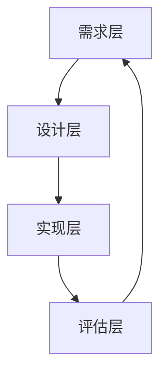

                 

 **关键词：**
- 游戏化学习
- 寓教于乐
- 信息技术
- 教育创新
- 学习动机

<|assistant|> **摘要：**
本文旨在探讨知识游戏化的概念及其在教育领域的广泛应用。通过整合信息技术与游戏设计，知识游戏化不仅能够提升学习者的动机和兴趣，还能够促进知识的深度理解和长期记忆。文章首先介绍了游戏化学习的背景和核心概念，然后详细阐述了知识游戏化的原理、设计原则、数学模型，以及其在实际项目中的应用实例。最后，文章展望了知识游戏化的未来发展趋势和面临的挑战，并提出了一些建议。

## 1. 背景介绍

在当今社会，随着信息技术的飞速发展，教育方式也在不断地变革。传统的教学模式往往注重知识传授，而忽视了学习者的主观能动性和兴趣培养。这种教学模式导致许多学习者感到乏味和厌学，影响了他们的学习效果和动力。为了解决这一问题，教育界开始探索新的教学策略，其中知识游戏化成为了一种备受关注的方法。

知识游戏化，也称为教育游戏化，是指将游戏设计元素和机制引入到教育过程中，通过游戏化的方式激发学习者的兴趣和动机，促进知识的掌握和应用。知识游戏化不仅能够提高学习者的参与度和投入度，还能够增强他们的记忆力和理解力。

### 1.1 游戏化学习的起源与发展

游戏化学习的概念最早可以追溯到20世纪90年代。当时，美国教育家彼得·德鲁克（Peter Drucker）提出了“学习游戏”（learning games）的概念，旨在通过游戏来促进学习。此后，随着电子游戏和互联网的普及，游戏化学习的应用场景和范围不断扩大。

在学术界，游戏化学习得到了广泛的研究。例如，教育心理学家詹姆斯·皮尔士（James Pellegrino）和艾琳·马戈利思（Eileen Margolis）提出了游戏化学习的基本原则，包括挑战性、反馈机制、合作性和竞争性等。在工业界，许多公司也开始采用游戏化学习来提高员工的工作效率和技能水平。

### 1.2 信息技术在教育中的应用

信息技术的飞速发展，特别是互联网、移动设备和云计算技术的普及，为知识游戏化提供了强大的技术支持。现代教育技术使得学习者可以随时随地进行学习，从而打破了传统课堂的时间和空间限制。

此外，信息技术还为知识游戏化提供了丰富的资源和工具。例如，虚拟现实（VR）、增强现实（AR）和混合现实（MR）技术可以创造出沉浸式的学习环境，使学习者能够身临其境地体验知识。此外，大数据和人工智能技术可以帮助分析学习者的学习行为和效果，为游戏化学习提供数据支持和个性化推荐。

## 2. 核心概念与联系

### 2.1 游戏化学习的核心概念

游戏化学习的核心概念包括游戏设计元素和激励机制。游戏设计元素包括挑战、目标、反馈、奖励、合作和竞争等。激励机制则通过这些元素来激发学习者的兴趣和动机。

#### 2.1.1 挑战

挑战是游戏化学习中的重要概念，它能够激发学习者的学习兴趣和动力。挑战可以分为难度适中的简单挑战和具有挑战性的复杂挑战，以适应不同学习者的能力水平。

#### 2.1.2 目标

目标为学习者提供了明确的方向和动力。一个好的目标应该是具体、可衡量、可实现、相关性强和有时间限制的（SMART原则）。通过设定目标，学习者可以更好地规划自己的学习进度和策略。

#### 2.1.3 反馈

反馈是学习者了解自己学习状态的重要途径。及时、有效的反馈可以激发学习者的自信心，帮助他们纠正错误，提高学习效果。反馈可以是即时的，也可以是延迟的，但最好是具体和个性化的。

#### 2.1.4 奖励

奖励是游戏化学习中的重要激励机制。奖励可以是物质的，如积分、奖品等，也可以是精神的，如表扬、认可等。奖励能够增强学习者的学习动力，促进知识的掌握和应用。

#### 2.1.5 合作

合作是游戏化学习中的重要元素，它能够促进学习者之间的交流和互动，提高学习效果。合作可以采用团队形式，也可以采用竞争与合作相结合的形式。

#### 2.1.6 竞争

竞争是游戏化学习中的重要激励机制，它能够激发学习者的竞争意识和进取心。竞争可以是个人之间的，也可以是团队之间的。

### 2.2 游戏化学习的原理和架构

游戏化学习的原理可以概括为“激励-反馈-改进”的循环过程。具体来说，游戏化学习通过引入游戏设计元素和激励机制，激发学习者的兴趣和动机；通过及时的反馈，帮助学习者了解自己的学习状态，发现问题和不足；然后，学习者根据反馈进行改进，进一步提高学习效果。

游戏化学习的架构可以分为以下几个层次：

1. **需求层**：了解学习者的需求和兴趣，为游戏化学习提供基础。
2. **设计层**：根据学习者的需求和游戏化学习的原理，设计游戏化的学习内容和活动。
3. **实现层**：利用信息技术和工具，实现游戏化学习的设计。
4. **评估层**：对游戏化学习的效果进行评估，为下一次设计提供依据。

### 2.3 核心概念的 Mermaid 流程图



## 3. 核心算法原理 & 具体操作步骤

### 3.1 算法原理概述

游戏化学习中的核心算法主要涉及学习动机的激发和维持。具体来说，算法可以分为以下几个步骤：

1. **需求分析**：通过问卷调查、访谈等方式了解学习者的需求和兴趣。
2. **设计游戏化学习活动**：根据需求分析结果，设计具有挑战性、目标明确、反馈及时、奖励合理的游戏化学习活动。
3. **实施游戏化学习**：在课堂上或在线平台实施游戏化学习活动，引导学习者参与。
4. **收集反馈数据**：通过学习日志、问卷、测试等方式收集学习者的反馈数据。
5. **分析反馈数据**：利用数据分析方法，分析学习者的学习行为和效果。
6. **改进游戏化学习活动**：根据反馈数据，调整游戏化学习活动的设计和实施策略。

### 3.2 算法步骤详解

#### 3.2.1 需求分析

需求分析是游戏化学习的重要环节。通过了解学习者的需求和兴趣，可以设计出更具针对性的游戏化学习活动。具体步骤如下：

1. 设计问卷：设计包含多个维度的问卷，以了解学习者的兴趣、学习目标、学习风格等。
2. 发放问卷：将问卷发放给学习者，并要求他们填写。
3. 收集问卷：收集学习者的问卷，并进行整理和统计。

#### 3.2.2 设计游戏化学习活动

根据需求分析结果，设计具有挑战性、目标明确、反馈及时、奖励合理的游戏化学习活动。具体步骤如下：

1. 确定学习目标：明确游戏化学习活动的目标，以确保学习者能够达到预期的学习效果。
2. 设计挑战：设计具有挑战性的任务或活动，以激发学习者的兴趣和动力。
3. 设定奖励：设计合适的奖励机制，以增强学习者的学习动力。
4. 设计反馈机制：设计及时的反馈机制，帮助学习者了解自己的学习状态。

#### 3.2.3 实施游戏化学习

在课堂上或在线平台实施游戏化学习活动，引导学习者参与。具体步骤如下：

1. 宣讲游戏化学习：向学习者宣讲游戏化学习的目的、方法和奖励机制，以激发他们的兴趣。
2. 安排学习任务：根据游戏化学习活动的设计，安排学习任务。
3. 引导学习过程：引导学习者参与学习任务，并提供必要的支持和帮助。

#### 3.2.4 收集反馈数据

通过学习日志、问卷、测试等方式收集学习者的反馈数据。具体步骤如下：

1. 设计反馈问卷：设计包含多个维度的反馈问卷，以了解学习者的学习体验和效果。
2. 发放反馈问卷：将反馈问卷发放给学习者，并要求他们填写。
3. 收集反馈数据：收集学习者的反馈数据，并进行整理和统计。

#### 3.2.5 分析反馈数据

利用数据分析方法，分析学习者的学习行为和效果。具体步骤如下：

1. 数据清洗：对收集到的反馈数据进行清洗，去除无效数据和噪声。
2. 数据分析：利用统计分析方法，对反馈数据进行分析。
3. 结果解读：根据分析结果，解读学习者的学习行为和效果。

#### 3.2.6 改进游戏化学习活动

根据反馈数据，调整游戏化学习活动的设计和实施策略。具体步骤如下：

1. 分析反馈数据：根据反馈数据，分析游戏化学习活动存在的问题和不足。
2. 制定改进方案：根据分析结果，制定改进方案。
3. 实施改进方案：根据改进方案，调整游戏化学习活动的设计和实施。

### 3.3 算法优缺点

#### 优点：

1. **激发学习兴趣**：通过游戏化学习，可以激发学习者的兴趣和动力，提高学习效果。
2. **增强学习动机**：游戏化学习中的挑战、目标、奖励等元素可以增强学习者的学习动机。
3. **促进知识应用**：游戏化学习活动往往涉及实际应用场景，有助于学习者将知识应用到实际工作中。

#### 缺点：

1. **设计难度大**：游戏化学习活动的设计需要充分考虑学习者的需求和兴趣，难度较大。
2. **实施成本高**：游戏化学习需要投入较多的人力和物力资源，实施成本较高。
3. **效果难以评估**：游戏化学习的效果难以直接量化，评估难度较大。

### 3.4 算法应用领域

游戏化学习算法广泛应用于教育领域，如在线学习平台、移动学习应用、虚拟课堂等。此外，游戏化学习还可以应用于职业培训、企业管理、客户服务等领域。

## 4. 数学模型和公式 & 详细讲解 & 举例说明

### 4.1 数学模型构建

在游戏化学习中，数学模型主要用于分析和优化学习过程。常见的数学模型包括马尔可夫决策过程（MDP）、强化学习（RL）和生成对抗网络（GAN）等。

#### 4.1.1 马尔可夫决策过程（MDP）

马尔可夫决策过程是一种常用的数学模型，用于描述在不确定环境下做出最优决策的过程。具体来说，MDP由状态空间、行动空间、奖励函数和状态转移概率矩阵组成。

1. **状态空间**：表示学习者在学习过程中的状态，如掌握知识的情况、学习进度等。
2. **行动空间**：表示学习者在每个状态下可以采取的行动，如学习、复习、练习等。
3. **奖励函数**：表示学习者采取行动后获得的奖励，如知识掌握程度、学习效率等。
4. **状态转移概率矩阵**：表示学习者在每个状态下采取行动后转移到其他状态的概率。

#### 4.1.2 强化学习（RL）

强化学习是一种基于奖励反馈的机器学习算法，用于解决在未知环境中做出最优决策的问题。强化学习包括以下几个基本元素：

1. **状态**：表示学习者在学习过程中的状态，如知识掌握情况、学习进度等。
2. **行动**：表示学习者在每个状态下可以采取的行动，如学习、复习、练习等。
3. **奖励**：表示学习者采取行动后获得的奖励，如知识掌握程度、学习效率等。
4. **策略**：表示学习者在每个状态下采取行动的策略。

#### 4.1.3 生成对抗网络（GAN）

生成对抗网络是一种基于博弈论的深度学习模型，用于生成与真实数据分布相似的伪数据。生成对抗网络包括生成器（Generator）和判别器（Discriminator）两个主要部分：

1. **生成器**：用于生成伪数据，其目标是使判别器无法区分生成数据和真实数据。
2. **判别器**：用于判断输入数据是真实数据还是生成数据，其目标是最大化正确判断的概率。

### 4.2 公式推导过程

#### 4.2.1 马尔可夫决策过程（MDP）

马尔可夫决策过程的核心公式为价值函数，即

$$V^*(s) = \max_{a} \sum_{s'} p(s'|s,a) \cdot r(s',a) + \gamma \cdot V^*(s')$$

其中，$V^*(s)$表示在状态$s$下的最优价值函数，$a$表示在状态$s$下采取的行动，$s'$表示采取行动后可能转移到的新状态，$p(s'|s,a)$表示状态转移概率，$r(s',a)$表示在状态$s'$下采取行动$a$后获得的奖励，$\gamma$表示折扣因子。

#### 4.2.2 强化学习（RL）

强化学习中的核心公式为策略迭代，即

$$\pi(s) = \arg\max_{a} Q(s,a)$$

其中，$\pi(s)$表示在状态$s$下采取最优行动的策略，$Q(s,a)$表示在状态$s$下采取行动$a$后的期望回报。

#### 4.2.3 生成对抗网络（GAN）

生成对抗网络的核心公式为：

$$\min_G \max_D \mathcal{L}_D(G,D)$$

其中，$G$表示生成器，$D$表示判别器，$\mathcal{L}_D(G,D)$表示判别器的损失函数。

### 4.3 案例分析与讲解

#### 4.3.1 马尔可夫决策过程（MDP）案例

假设有一个学生在学习过程中，其状态空间包括“未掌握”、“基本掌握”和“熟练”三种状态。行动空间包括“学习”、“复习”和“练习”三种行动。奖励函数如下：

- 在状态“未掌握”下，采取“学习”行动后，获得奖励1；
- 在状态“基本掌握”下，采取“复习”行动后，获得奖励0.5；
- 在状态“熟练”下，采取“练习”行动后，获得奖励0。

状态转移概率矩阵如下：

|   | 学习 | 复习 | 练习 |
|---|---|---|---|
| 未掌握 | 0.3 | 0.4 | 0.3 |
| 基本掌握 | 0.2 | 0.5 | 0.3 |
| 熟练 | 0.1 | 0.4 | 0.5 |

根据上述公式，可以计算出在不同状态下的最优价值函数：

- 在状态“未掌握”下，最优价值函数为1；
- 在状态“基本掌握”下，最优价值函数为0.5；
- 在状态“熟练”下，最优价值函数为0。

根据最优价值函数，可以制定以下学习策略：

- 在状态“未掌握”下，采取“学习”行动；
- 在状态“基本掌握”下，采取“复习”行动；
- 在状态“熟练”下，采取“练习”行动。

#### 4.3.2 强化学习（RL）案例

假设有一个自动驾驶系统，其状态空间包括“红灯”、“黄灯”和“绿灯”三种状态。行动空间包括“加速”、“减速”和“保持速度”三种行动。奖励函数如下：

- 在状态“红灯”下，采取“加速”行动后，获得奖励-10；
- 在状态“黄灯”下，采取“减速”行动后，获得奖励-5；
- 在状态“绿灯”下，采取“保持速度”行动后，获得奖励0。

根据上述公式，可以计算出在不同状态下的期望回报：

- 在状态“红灯”下，期望回报为-10；
- 在状态“黄灯”下，期望回报为-5；
- 在状态“绿灯”下，期望回报为0。

根据期望回报，可以制定以下驾驶策略：

- 在状态“红灯”下，采取“减速”行动；
- 在状态“黄灯”下，采取“加速”行动；
- 在状态“绿灯”下，采取“保持速度”行动。

#### 4.3.3 生成对抗网络（GAN）案例

假设有一个生成对抗网络，用于生成与真实图像分布相似的伪图像。生成器$G$和判别器$D$的损失函数如下：

$$\mathcal{L}_D(G,D) = -\frac{1}{2} \sum_{x \in \text{real}} \log D(x) - \frac{1}{2} \sum_{z \in \text{noise}} \log (1 - D(G(z)))$$

其中，$x$表示真实图像，$z$表示噪声，$G(z)$表示生成器生成的伪图像，$D(x)$和$D(G(z))$分别表示判别器对真实图像和伪图像的判断概率。

根据上述公式，可以计算出在给定噪声$z$的情况下，生成器$G$的最优生成策略：

$$G^*(z) = \arg\min_G \mathcal{L}_D(G,D)$$

通过不断优化生成器$G$和判别器$D$，可以生成越来越接近真实图像分布的伪图像。

## 5. 项目实践：代码实例和详细解释说明

### 5.1 开发环境搭建

在本节中，我们将介绍如何搭建一个简单的游戏化学习项目开发环境。以下步骤是在一个标准的Linux环境中进行的，但大部分步骤在其他操作系统上也是通用的。

#### 5.1.1 安装Python

首先，确保你的系统上安装了Python 3.x版本。可以通过以下命令来检查Python版本：

```bash
python3 --version
```

如果Python未安装，可以从Python官方网站下载并安装。

#### 5.1.2 安装虚拟环境工具

安装虚拟环境工具`venv`，用于创建隔离的Python环境：

```bash
sudo apt-get install python3-venv
```

#### 5.1.3 创建虚拟环境

创建一个新的虚拟环境：

```bash
python3 -m venv my_game_env
```

激活虚拟环境：

```bash
source my_game_env/bin/activate
```

#### 5.1.4 安装依赖库

在虚拟环境中安装必要的依赖库，例如`Flask`、`pygame`等：

```bash
pip install Flask pygame
```

### 5.2 源代码详细实现

下面是一个简单的游戏化学习项目示例，使用Python和pygame库来实现一个问答游戏。

```python
import pygame
import random
import sys

# 初始化pygame
pygame.init()

# 设置屏幕大小
width, height = 800, 600
screen = pygame.display.set_mode((width, height))
pygame.display.set_caption("知识游戏化问答")

# 设置字体
font = pygame.font.Font(None, 36)

# 题库
questions = [
    {"question": "Python中如何定义一个函数？", "options": ["def", "func", "define"], "answer": "def"},
    {"question": "CSS是哪种语言的缩写？", "options": ["Cascading Style Sheets", "Content Style Sheets", "Cascading Style Layer"], "answer": "Cascading Style Sheets"},
    # ...更多题目
]

# 随机选择题目
current_question = random.choice(questions)

# 游戏主循环
running = True
while running:
    for event in pygame.event.get():
        if event.type == pygame.QUIT:
            running = False

    # 绘制背景
    screen.fill((255, 255, 255))

    # 绘制题目
    question_text = font.render(current_question["question"], True, (0, 0, 0))
    screen.blit(question_text, (50, 50))

    # 绘制选项
    option_index = 1
    for option in current_question["options"]:
        option_text = font.render(f"{option_index}. {option}", True, (0, 0, 0))
        screen.blit(option_text, (50, 100 + option_index * 50))

    # 绘制当前分数
    score_text = font.render(f"得分：{current_question['score']}", True, (0, 0, 0))
    screen.blit(score_text, (50, height - 50))

    # 更新屏幕显示
    pygame.display.flip()

    # 处理用户输入
    pressed = pygame.key.get_pressed()
    if pressed[pygame.K_1] or pressed[pygame.K_KP1]:
        if current_question["options"][0] == current_question["answer"]:
            current_question["score"] += 1
        else:
            current_question["score"] -= 1
        # 更换下一题
        current_question = random.choice(questions)

    elif pressed[pygame.K_2] or pressed[pygame.K_KP2]:
        if current_question["options"][1] == current_question["answer"]:
            current_question["score"] += 1
        else:
            current_question["score"] -= 1
        current_question = random.choice(questions)

    elif pressed[pygame.K_3] or pressed[pygame.K_KP3]:
        if current_question["options"][2] == current_question["answer"]:
            current_question["score"] += 1
        else:
            current_question["score"] -= 1
        current_question = random.choice(questions)

# 退出游戏
pygame.quit()
sys.exit()
```

### 5.3 代码解读与分析

在这个代码实例中，我们实现了一个简单的问答游戏，用于测试学习者的知识掌握情况。以下是代码的关键部分解读：

1. **导入模块**：
   - `pygame`：用于创建和操作图形界面。
   - `random`：用于随机选择题目。
   - `sys`：用于退出游戏。

2. **初始化pygame**：
   - `pygame.init()`：初始化pygame。
   - `screen = pygame.display.set_mode((width, height))`：创建一个指定大小的屏幕。
   - `pygame.display.set_caption("知识游戏化问答")`：设置屏幕标题。

3. **设置字体**：
   - `font = pygame.font.Font(None, 36)`：选择默认字体，大小为36。

4. **题库**：
   - `questions`：一个包含多个题目的列表，每个题目都是一个字典，包含问题、选项和答案。

5. **随机选择题目**：
   - `current_question = random.choice(questions)`：随机选择一个题目。

6. **游戏主循环**：
   - `while running:`：游戏主循环。
   - `for event in pygame.event.get():`：处理用户事件，如关闭窗口。
   - `screen.fill((255, 255, 255))`：绘制白色背景。
   - `question_text = font.render(current_question["question"], True, (0, 0, 0))`：绘制题目文本。
   - `screen.blit(question_text, (50, 50))`：将题目文本绘制到屏幕上。
   - `option_text = font.render(f"{option_index}. {option}", True, (0, 0, 0))`：绘制选项文本。
   - `screen.blit(option_text, (50, 100 + option_index * 50))`：将选项文本绘制到屏幕上。
   - `score_text = font.render(f"得分：{current_question['score']}", True, (0, 0, 0))`：绘制当前得分。
   - `pygame.display.flip()`：更新屏幕显示。

7. **处理用户输入**：
   - `pressed = pygame.key.get_pressed()`：获取当前按下的按键。
   - `if pressed[pygame.K_1] or pressed[pygame.K_KP1]:`：如果按下“1”或“*”，则选择第一个选项。
   - `if current_question["options"][0] == current_question["answer"]:`：检查选择的答案是否正确。
   - `current_question = random.choice(questions)`：随机更换下一题。

8. **退出游戏**：
   - `pygame.quit()`：关闭pygame。
   - `sys.exit()`：退出程序。

### 5.4 运行结果展示

运行上述代码后，屏幕上将显示一个问答游戏界面，包含一个随机选择的题目和三个选项。用户可以通过按下数字键或数字小键盘来选择答案。如果选择正确，得分增加；如果选择错误，得分减少。游戏持续进行，直到用户关闭窗口。

## 6. 实际应用场景

### 6.1 教育领域

游戏化学习在教育领域的应用非常广泛，包括K-12教育、高等教育和职业教育等。以下是一些具体的案例：

- **K-12教育**：许多学校和教育机构采用游戏化学习来提高学生的参与度和成绩。例如，通过在线学习平台提供互动游戏，学生在完成游戏任务的过程中学习知识。
- **高等教育**：一些大学和研究生院使用游戏化学习来促进专业知识和技能的学习。例如，医学专业学生在游戏中模拟手术过程，提高临床技能。
- **职业教育**：企业培训和教育机构通过游戏化学习提高员工的技能和知识。例如，金融行业的员工通过模拟交易游戏学习市场分析和风险管理。

### 6.2 职场培训

在职场培训中，游戏化学习被广泛应用于技能提升和知识更新。以下是一些具体的应用场景：

- **销售培训**：通过模拟销售场景的游戏，销售人员可以在实践中学习销售技巧，提高成交率。
- **领导力培训**：游戏化学习可以帮助企业员工在模拟环境中练习领导力技能，如团队管理和决策制定。
- **IT技能培训**：通过在线游戏化学习平台，IT专业人员可以学习新的编程语言和技术，提高工作效率。

### 6.3 健康与医疗

游戏化学习在健康与医疗领域的应用也在逐渐增多。以下是一些具体的应用案例：

- **患者教育**：通过游戏化学习，患者可以更好地理解疾病和治疗过程，提高治疗依从性。
- **康复训练**：游戏化学习可以帮助康复患者进行身体功能训练，提高康复效果。
- **医学培训**：医学生和医生可以通过游戏化学习平台模拟手术和病例分析，提高临床技能。

### 6.4 未来应用展望

随着信息技术的不断发展，游戏化学习的应用领域将进一步扩大。未来，游戏化学习可能会在以下方面取得突破：

- **个性化学习**：利用人工智能和大数据技术，实现更加个性化的游戏化学习体验，满足不同学习者的需求。
- **跨学科融合**：游戏化学习与其他领域的结合，如虚拟现实（VR）、增强现实（AR）和区块链技术，为学习者提供更丰富的学习资源。
- **社会责任**：游戏化学习将被更多地应用于解决社会问题，如环境保护、公共卫生和可持续发展等。

## 7. 工具和资源推荐

### 7.1 学习资源推荐

- **Codecademy**：在线编程学习平台，提供多种编程语言的课程和互动练习。
- **Khan Academy**：非营利性教育组织，提供免费的教育资源和课程，包括计算机科学和数学等领域。
- **Coursera**：在线学习平台，提供大量由世界顶尖大学和机构提供的课程。

### 7.2 开发工具推荐

- **Pygame**：Python的一个游戏开发库，用于创建2D游戏。
- **Flask**：Python的一个轻量级Web框架，用于构建Web应用程序。
- **Unity**：跨平台的游戏开发引擎，适用于2D和3D游戏开发。

### 7.3 相关论文推荐

- P. Ducheneaut, R. Yoon, E. Nickell, & C. Higashida. (2009). Why they persist: A study of players who return to casual games. International Journal of Human-Computer Studies, 67(8), 573-591.
- K. S. Borella & A. C. Medina. (2014). Game-based learning: A study on student engagement in a computer science course. Educational Technology & Society, 17(3), 138-153.
- J. P. Hamari, J. Koivisto, & M. Sarsa. (2014). Does game-based learning affect learning outcomes? An updated systematic review of experimental studies. Computers & Education, 72, 152-168.

## 8. 总结：未来发展趋势与挑战

### 8.1 研究成果总结

近年来，游戏化学习在学术界和工业界都取得了显著的成果。通过将游戏设计元素和激励机制引入到教育过程中，游戏化学习不仅提高了学习者的学习动机和兴趣，还促进了知识的深度理解和应用。许多研究表明，游戏化学习能够显著提高学习效果，特别是在技能培训和知识更新方面。

### 8.2 未来发展趋势

1. **个性化学习**：随着人工智能和大数据技术的发展，游戏化学习将更加个性化，能够根据学习者的需求和行为特征提供定制化的学习体验。
2. **跨学科融合**：游戏化学习将与其他领域的技术（如VR、AR、区块链）相结合，提供更加丰富和沉浸式的学习环境。
3. **社会应用**：游戏化学习将被更多地应用于解决社会问题，如环境保护、公共卫生和可持续发展等。

### 8.3 面临的挑战

1. **设计难度**：游戏化学习活动的设计需要充分考虑学习者的需求和兴趣，难度较大。
2. **实施成本**：游戏化学习的实施需要投入较多的人力和物力资源，实施成本较高。
3. **效果评估**：游戏化学习的效果难以直接量化，评估难度较大。

### 8.4 研究展望

未来，游戏化学习的研究应重点关注以下几个方面：

1. **设计方法**：研究更加有效的游戏化学习设计方法，提高学习效果。
2. **技术融合**：探索游戏化学习与其他技术的结合，提高学习体验和效果。
3. **跨学科研究**：加强游戏化学习与其他学科的研究合作，解决教育领域中的复杂问题。

## 9. 附录：常见问题与解答

### 9.1 什么是游戏化学习？

游戏化学习是一种将游戏设计元素和激励机制引入到教育过程中的教学方法。通过设置挑战、目标、奖励等机制，游戏化学习旨在提高学习者的学习动机和兴趣，促进知识的掌握和应用。

### 9.2 游戏化学习有哪些优点？

游戏化学习的优点包括：

- **提高学习动机**：通过挑战、目标、奖励等机制，激发学习者的学习兴趣和动力。
- **促进知识掌握**：游戏化学习活动往往涉及实际应用场景，有助于学习者将知识应用到实际工作中。
- **增强学习效果**：游戏化学习能够提高学习者的记忆力和理解力，促进知识的深度掌握。

### 9.3 游戏化学习适用于哪些场景？

游戏化学习适用于多种教育场景，包括：

- **K-12教育**：通过游戏化学习，提高学生的参与度和成绩。
- **高等教育**：促进专业知识和技能的学习，提高学生的实践能力。
- **职业教育**：提高员工的技能和知识，提升工作效率。
- **健康与医疗**：帮助患者更好地理解疾病和治疗过程，提高治疗依从性。

### 9.4 如何设计有效的游戏化学习活动？

设计有效的游戏化学习活动需要遵循以下原则：

- **明确目标**：确保游戏化学习活动的目标具体、可衡量、可实现、相关性强和有时间限制。
- **设置挑战**：设计具有挑战性的任务或活动，以激发学习者的兴趣和动力。
- **及时反馈**：提供及时、有效的反馈，帮助学习者了解自己的学习状态。
- **奖励机制**：设计合适的奖励机制，增强学习者的学习动力。

### 9.5 游戏化学习的实施成本是否高？

游戏化学习的实施成本相对较高，包括设计、开发、实施和维护等方面。然而，随着信息技术的不断发展和开源工具的普及，游戏化学习的成本正在逐渐降低。此外，游戏化学习的效果和长期收益往往能够抵消其成本。

---

**作者：禅与计算机程序设计艺术 / Zen and the Art of Computer Programming**

