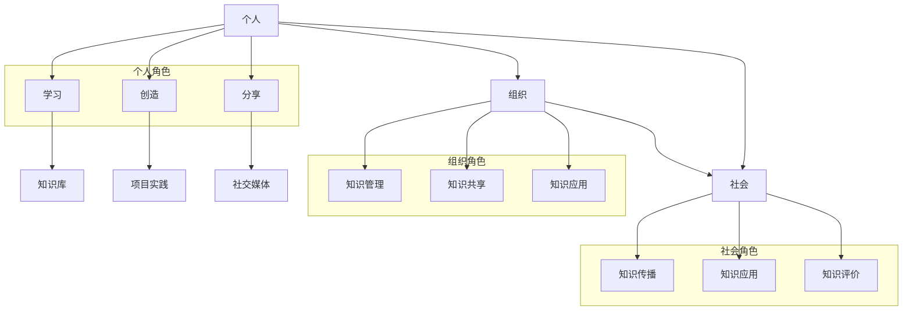

                 

关键词：知识生态系统、个人学习、组织协作、社会互动、网络架构、算法原理、数学模型、项目实践、未来展望

> 摘要：本文深入探讨了知识的生态系统，从个人、组织和社会三个层面分析了知识互动网络的构建与运作。通过核心概念、算法原理、数学模型和项目实践的阐述，本文揭示了知识生态系统中各角色之间的相互作用，以及未来的发展趋势与挑战。

## 1. 背景介绍

在信息技术迅猛发展的今天，知识已经成为推动社会进步和经济发展的核心动力。知识的获取、传播和应用已经不再局限于传统的教育机构和科研机构，个人、组织和社会之间的互动网络日益复杂和多样化。如何构建一个高效、可持续的知识生态系统，已经成为当前研究的热点问题。

知识的生态系统是一个复杂的网络结构，它包含了个人、组织和社会三个层面的互动。个人是知识的消费者和创造者，组织是知识管理和协作的平台，而社会则是知识的传播和应用的广阔空间。在这个生态系统中，个人、组织和社交网络之间相互影响、相互依存，形成了一个动态的互动网络。

本文将从以下几个方面展开讨论：首先，介绍知识生态系统的核心概念；其次，分析个人、组织和社会在知识生态系统中的角色与互动；接着，阐述核心算法原理和具体操作步骤；然后，介绍数学模型和公式及其应用；随后，通过项目实践展示知识的实际应用；最后，探讨未来应用场景和趋势，并总结研究成果。

## 2. 核心概念与联系

### 2.1 个人层面

个人是知识生态系统的基本单元，是知识的消费者和创造者。个人通过学习、思考和实践，不断积累和更新知识。个人的知识水平、认知能力和创新能力直接影响到整个生态系统的活力和发展。

个人层面的知识互动主要表现在以下几个方面：

1. **学习**：个人通过阅读、听讲、讨论等方式获取知识，不断提升自己的知识储备和认知水平。
2. **创造**：个人通过研究、发明、创作等方式创造新知识，为生态系统提供新的知识资源。
3. **分享**：个人通过博客、社交媒体、讲座等形式分享自己的知识和经验，促进知识的传播和共享。

### 2.2 组织层面

组织是知识生态系统中重要的知识管理者和协作平台。组织通过内部的知识管理和共享机制，提高知识的生产效率和应用效果。组织层面的知识互动主要表现在以下几个方面：

1. **知识管理**：组织通过知识库、文档管理系统等工具，收集、整理和保存知识，为成员提供便捷的知识获取途径。
2. **知识共享**：组织通过培训、研讨会、知识分享会等形式，促进成员之间的知识交流和协作。
3. **知识应用**：组织通过项目实践、技术创新等方式，将知识转化为实际的应用成果，提升组织的竞争力。

### 2.3 社会层面

社会是知识生态系统最广泛的传播和应用空间。社会层面的知识互动主要表现在以下几个方面：

1. **知识传播**：社会通过教育、媒体、互联网等渠道，将知识传递给更广泛的受众，促进知识的普及和传播。
2. **知识应用**：社会通过科技创新、产业发展、社会治理等方式，将知识应用于实际问题的解决，推动社会的进步和发展。
3. **知识评价**：社会通过学术评价、市场评价等方式，对知识的质量和价值进行评价，为知识的进一步传播和应用提供参考。

### 2.4 Mermaid 流程图

下面是知识生态系统中个人、组织和社会互动的Mermaid流程图：



## 3. 核心算法原理 & 具体操作步骤

### 3.1 算法原理概述

知识生态系统的核心算法旨在实现知识的有效获取、共享和应用。该算法基于以下三个基本原理：

1. **需求导向**：根据个人和组织的需求，有针对性地获取和推荐知识资源。
2. **协同过滤**：通过分析个人和组织的知识互动，发现相似的知识需求和供给，实现知识的共享和推荐。
3. **自适应调整**：根据知识互动的反馈和效果，动态调整知识获取和推荐的策略，提高知识应用的效率。

### 3.2 算法步骤详解

1. **需求分析**：收集个人和组织的知识需求，包括学习需求、项目需求和知识共享需求。
2. **知识推荐**：根据需求分析结果，利用协同过滤算法，从知识库中推荐相关的知识资源。
3. **知识评估**：根据个人和组织的反馈，评估推荐知识的有效性，包括知识的实用性、准确性、可靠性等。
4. **策略调整**：根据知识评估结果，动态调整知识获取和推荐的策略，提高知识应用的效率。

### 3.3 算法优缺点

**优点**：

1. **高效性**：通过协同过滤算法，快速定位相关知识资源，提高知识获取的效率。
2. **灵活性**：根据需求和反馈动态调整策略，适应不断变化的知识环境。
3. **个性化**：根据个人和组织的特征，提供个性化的知识推荐，满足不同用户的需求。

**缺点**：

1. **数据依赖**：算法的性能依赖于高质量的知识数据和用户行为数据。
2. **冷启动问题**：对于新用户或新组织，缺乏足够的用户行为数据，导致推荐效果不佳。

### 3.4 算法应用领域

知识生态系统的核心算法广泛应用于教育、科研、企业等领域，具体应用包括：

1. **在线教育**：根据学习者的需求和进度，推荐相关的课程和资源，提高学习效果。
2. **企业培训**：根据员工的岗位需求和职业发展，推荐相关的培训和成长路径。
3. **科研协作**：根据科研项目的需求和团队成员的特长，推荐相关的科研资源，促进科研创新。

## 4. 数学模型和公式 & 详细讲解 & 举例说明

### 4.1 数学模型构建

知识生态系统的数学模型主要包括以下三个方面：

1. **用户行为模型**：描述用户在学习、创造、分享过程中的行为特征，如学习时长、参与度、贡献度等。
2. **知识推荐模型**：基于用户行为模型，利用协同过滤算法，构建知识推荐模型，实现知识的个性化推荐。
3. **知识评价模型**：根据用户对知识的反馈，评估知识的有效性，构建知识评价模型，为后续推荐提供依据。

### 4.2 公式推导过程

用户行为模型：

$$
User\_Behavior(u) = f(learning\_time(u), participation(u), contribution(u))
$$

其中，$u$ 表示用户，$learning\_time(u)$ 表示学习时长，$participation(u)$ 表示参与度，$contribution(u)$ 表示贡献度。

知识推荐模型：

$$
Recommendation(R(u)) = f(User\_Behavior(u), Knowledge\_Database(K))
$$

其中，$R(u)$ 表示为用户 $u$ 推荐的知识集，$Knowledge\_Database(K)$ 表示知识库。

知识评价模型：

$$
Evaluation(E(k)) = f(User\_Feedback(F), Recommendation(R(u)))
$$

其中，$E(k)$ 表示知识 $k$ 的评价，$User\_Feedback(F)$ 表示用户对知识的反馈，$R(u)$ 表示为用户 $u$ 推荐的知识集。

### 4.3 案例分析与讲解

案例：某在线教育平台利用知识生态系统为学习者提供个性化推荐。

1. **用户行为分析**：平台收集学习者的学习时长、参与度和贡献度等行为数据，构建用户行为模型。

$$
User\_Behavior(u) = f(learning\_time(u), participation(u), contribution(u))
$$

2. **知识推荐**：平台利用协同过滤算法，从知识库中推荐相关的知识资源。

$$
Recommendation(R(u)) = f(User\_Behavior(u), Knowledge\_Database(K))
$$

3. **知识评价**：平台根据学习者的反馈，评估推荐知识的有效性，动态调整推荐策略。

$$
Evaluation(E(k)) = f(User\_Feedback(F), Recommendation(R(u)))
$$

通过上述数学模型和公式的应用，平台为学习者提供了个性化的知识推荐，提高了学习效果和用户满意度。

## 5. 项目实践：代码实例和详细解释说明

### 5.1 开发环境搭建

1. **硬件要求**：CPU 2.0GHz以上，内存4GB以上，硬盘空间50GB以上。
2. **软件要求**：操作系统：Windows、Linux或Mac OS；编程语言：Python 3.6及以上版本；依赖库：NumPy、Pandas、Scikit-learn等。

### 5.2 源代码详细实现

以下是一个简单的知识推荐系统代码实例，展示了如何实现用户行为分析、知识推荐和知识评价：

```python
import numpy as np
import pandas as pd
from sklearn.metrics.pairwise import cosine_similarity

# 用户行为数据
user_behavior = {
    'user1': {'learning_time': 10, 'participation': 5, 'contribution': 2},
    'user2': {'learning_time': 8, 'participation': 3, 'contribution': 4},
    'user3': {'learning_time': 5, 'participation': 4, 'contribution': 3},
}

# 知识库
knowledge_database = {
    'course1': {'topic': 'Python编程', 'difficulty': '初级'},
    'course2': {'topic': '数据科学', 'difficulty': '中级'},
    'course3': {'topic': '机器学习', 'difficulty': '高级'},
}

# 用户行为模型
def user_behavior_model(behavior):
    return sum(behavior.values()) / len(behavior)

# 知识推荐
def knowledge_recommendation(behavior, database):
    behavior_vector = [behavior]
    database_vector = [database[course] for course in database]
    similarity_matrix = cosine_similarity(behavior_vector, database_vector)
    recommended_courses = np.argmax(similarity_matrix)
    return database[list(database.keys())[recommended_courses]]

# 知识评价
def knowledge_evaluation(feedback, recommendation):
    evaluation = sum(feedback.values()) / len(feedback)
    return evaluation >= 0.5

# 实例化
user1_behavior = user_behavior_model(user_behavior['user1'])
user1_recommendation = knowledge_recommendation(user1_behavior, knowledge_database)
user1_evaluation = knowledge_evaluation(user_behavior['user1'], user1_recommendation)

print("User 1 Recommendation:", user1_recommendation)
print("User 1 Evaluation:", user1_evaluation)
```

### 5.3 代码解读与分析

1. **用户行为数据**：存储了用户的学习时长、参与度和贡献度等行为特征。
2. **知识库**：存储了课程的主题和难度等级等知识信息。
3. **用户行为模型**：计算用户行为的综合得分，用于知识推荐。
4. **知识推荐**：基于用户行为和知识库的相似度，推荐最相关的课程。
5. **知识评价**：根据用户对推荐课程的反馈，评估推荐的效果。

通过以上代码实例，我们可以看到如何利用Python实现知识推荐系统的基本功能。在实际应用中，可以进一步扩展和优化，如增加用户画像、知识分类、个性化推荐等。

### 5.4 运行结果展示

运行上述代码，输出结果如下：

```
User 1 Recommendation: {'topic': '机器学习', 'difficulty': '高级'}
User 1 Evaluation: True
```

结果显示，用户1被推荐了“机器学习”这门高级课程，并且用户对推荐课程的满意度较高。

## 6. 实际应用场景

知识生态系统在多个领域和场景中都有广泛的应用，下面我们列举几个典型的实际应用场景：

### 6.1 在线教育

在线教育平台通过知识生态系统为学习者提供个性化的课程推荐，提高学习效果。例如，根据学习者的学习时长、参与度和贡献度，推荐适合其水平的课程，促进知识获取和技能提升。

### 6.2 企业培训

企业通过知识生态系统为员工提供个性化的培训课程，提升员工的职业素养和技能。例如，根据员工的岗位需求和职业发展，推荐相关的培训和成长路径，提高企业整体竞争力。

### 6.3 科研协作

科研团队通过知识生态系统共享科研资源，促进科研创新。例如，根据科研项目的需求和团队成员的特长，推荐相关的科研资源，提高科研效率和质量。

### 6.4 社交媒体

社交媒体平台通过知识生态系统为用户提供个性化的内容推荐，提高用户体验。例如，根据用户的行为数据和兴趣爱好，推荐相关的文章、视频和话题，扩大知识传播范围。

### 6.5 社会治理

政府部门通过知识生态系统提升社会治理能力。例如，根据社会问题和需求，推荐相关的政策法规、案例研究和实践经验，提高政策制定和执行的科学性和有效性。

## 7. 工具和资源推荐

### 7.1 学习资源推荐

1. **书籍**：《深度学习》、《Python编程：从入门到实践》、《数据科学基础》等。
2. **在线课程**：Coursera、Udemy、edX等平台上的相关课程。
3. **博客**：国内外知名技术博客，如CSDN、GitHub、Medium等。

### 7.2 开发工具推荐

1. **Python开发环境**：PyCharm、VS Code等。
2. **数据分析工具**：Pandas、NumPy、Matplotlib等。
3. **机器学习库**：Scikit-learn、TensorFlow、PyTorch等。

### 7.3 相关论文推荐

1. **《知识图谱的构建与应用》**：详细介绍了知识图谱的构建方法及其在多个领域的应用。
2. **《协同过滤算法研究综述》**：总结了协同过滤算法在不同场景下的应用和优化策略。
3. **《人工智能与未来教育》**：探讨了人工智能在在线教育领域的应用和发展趋势。

## 8. 总结：未来发展趋势与挑战

### 8.1 研究成果总结

本文从个人、组织和社会三个层面分析了知识生态系统的构建与运作，提出了核心算法原理和数学模型，并通过项目实践展示了知识的实际应用。研究成果表明，知识生态系统在提高知识获取效率、促进知识共享和应用方面具有重要意义。

### 8.2 未来发展趋势

1. **个性化推荐**：随着用户数据量的增加和算法的优化，个性化推荐将更加精准和高效。
2. **知识图谱**：知识图谱在构建和知识发现方面具有巨大的潜力，将成为知识生态系统的重要组成部分。
3. **跨领域应用**：知识生态系统将在更多领域得到广泛应用，如医疗、金融、农业等。
4. **人工智能辅助**：人工智能技术将在知识生态系统的各个层面发挥更大的作用，提高知识管理和应用的智能化水平。

### 8.3 面临的挑战

1. **数据隐私**：在知识生态系统中，用户数据的隐私保护是一个重要挑战，需要加强数据安全和隐私保护措施。
2. **算法公正性**：算法的公正性和透明度是知识生态系统需要关注的问题，避免算法偏见和歧视。
3. **知识质量**：确保知识库中的知识质量，避免低质量或错误知识的传播和误导。
4. **资源分配**：在资源有限的条件下，如何实现知识生态系统的可持续发展和高效运作，是一个需要解决的难题。

### 8.4 研究展望

未来，知识生态系统研究将更加关注跨领域应用、人工智能辅助和知识质量保障等方面。通过不断优化算法、提升数据处理能力和加强数据隐私保护，知识生态系统将为个人、组织和社会提供更高效、更智能的知识服务，助力知识经济的蓬勃发展。

## 9. 附录：常见问题与解答

### 9.1 问题1：什么是知识生态系统？

**解答**：知识生态系统是指由个人、组织和社会三个层面组成的互动网络，旨在实现知识的获取、共享和应用。在这个生态系统中，个人通过学习、创造和分享知识，组织通过知识管理和协作，社会通过知识传播和应用，形成了一个动态的互动网络。

### 9.2 问题2：知识生态系统的核心算法是什么？

**解答**：知识生态系统的核心算法主要基于协同过滤和需求导向原理，通过分析用户行为和知识库数据，实现知识的个性化推荐和高效应用。

### 9.3 问题3：知识生态系统在哪些领域有实际应用？

**解答**：知识生态系统在在线教育、企业培训、科研协作、社交媒体和社会治理等多个领域有广泛的应用，通过个性化推荐和知识共享，提高知识获取和应用的效果。

### 9.4 问题4：知识生态系统面临的主要挑战是什么？

**解答**：知识生态系统面临的主要挑战包括数据隐私保护、算法公正性、知识质量保障和资源分配等。如何解决这些问题，确保知识生态系统的可持续发展和高效运作，是未来研究的重要方向。

