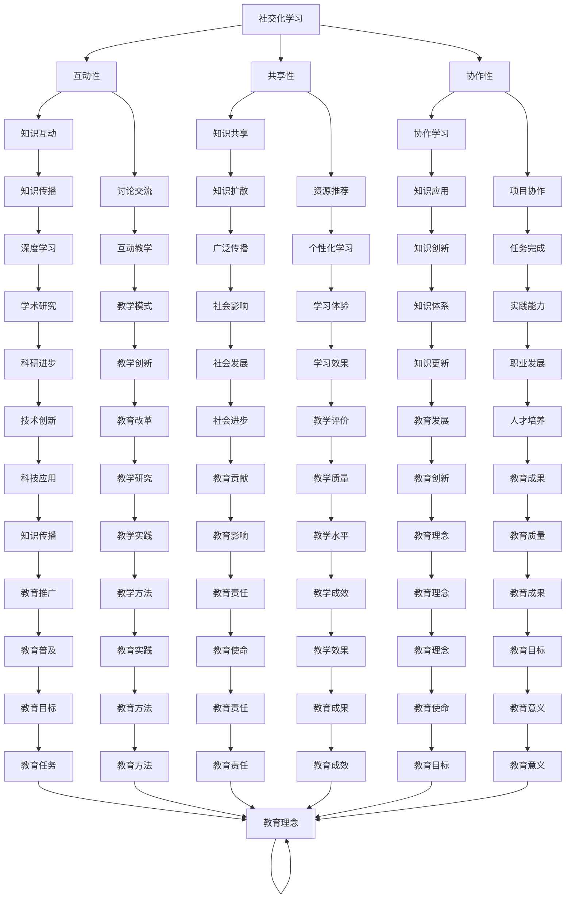

                 

关键词：社交化学习、协作平台、知识共享、教育技术、知识传播、在线学习、互动教学、智能化学习环境。

> 摘要：本文探讨了知识的社交化学习的兴起及其在协作平台中的应用。通过分析社交化学习的核心概念、关键技术和实践案例，本文揭示了协作平台如何促进知识的共享、传播和个性化学习，为教育技术的发展提供了新的视角。

## 1. 背景介绍

在信息化时代的浪潮下，教育技术不断发展，知识传播的方式也在发生变革。传统的教育模式以教师为中心，注重知识传授，学生被动接受知识。然而，随着互联网的普及和社交媒体的兴起，知识传播逐渐呈现出社交化的趋势。知识的社交化学习强调知识的互动性、共享性和协作性，使得学习成为一个互动的过程，学生和教师之间、学生与学生之间能够更紧密地联系在一起。

协作平台作为一种新兴的教育技术，为知识的社交化学习提供了强有力的支持。协作平台不仅提供了知识共享的空间，还促进了学习者之间的互动与合作，使得学习更加灵活和个性化。本文将深入探讨知识的社交化学习在协作平台中的兴起，分析其核心概念、关键技术和实践案例，为教育技术的发展提供新的思路。

## 2. 核心概念与联系

### 2.1 社交化学习的概念

社交化学习是一种以学习者为中心、强调知识互动性和共享性的学习模式。它突破了传统教学模式的局限，将知识传播的过程转变为一种社交化的互动过程。社交化学习的核心概念包括以下几个方面：

- **互动性**：社交化学习强调学习者之间的互动，通过讨论、协作、分享等方式，促进知识的交流与碰撞。
- **共享性**：知识不再局限于教师的传授，而是通过学习者之间的共享，实现知识的传播与扩散。
- **协作性**：学习者之间通过协作完成任务，共同探索知识，提高学习的深度和广度。

### 2.2 协作平台的架构

协作平台是一种支持多人协作的在线环境，旨在为学习者提供知识共享、互动交流和协作学习的空间。协作平台的架构通常包括以下几个方面：

- **用户管理系统**：管理用户身份、权限和账户信息，确保用户的安全和隐私。
- **内容管理系统**：提供知识存储、发布和管理功能，支持多种内容格式，如文本、图片、视频等。
- **互动交流系统**：支持学习者之间的即时通信、讨论和协作，如聊天室、论坛、视频会议等。
- **个性化推荐系统**：根据学习者的兴趣和行为，推荐相关的学习资源和任务，实现个性化学习。

### 2.3 社交化学习与协作平台的联系

社交化学习与协作平台之间存在着紧密的联系。协作平台为社交化学习提供了技术支持和实现环境，使得知识的社交化学习得以顺利展开。具体而言，协作平台通过以下几个方面促进了社交化学习的实现：

- **知识共享**：协作平台提供了知识存储和发布的功能，使得学习者可以轻松地分享自己的知识和经验。
- **互动交流**：协作平台支持学习者之间的即时通信和讨论，促进知识的交流与碰撞。
- **协作学习**：协作平台提供了任务协作和项目管理的功能，支持学习者共同完成任务，实现知识的深度学习和应用。
- **个性化学习**：协作平台通过个性化推荐系统，根据学习者的兴趣和行为，提供个性化的学习资源和任务，实现学习者的个性化发展。

### 2.4 Mermaid 流程图

下面是社交化学习与协作平台之间联系的 Mermaid 流程图：



## 3. 核心算法原理 & 具体操作步骤

### 3.1 算法原理概述

在协作平台中，知识的社交化学习依赖于一系列算法的支持。这些算法主要涉及以下几个方面：

- **社交网络分析**：通过分析学习者之间的社交关系，识别关键节点和影响力人物，优化知识传播路径。
- **内容推荐算法**：根据学习者的兴趣和行为，推荐相关的学习资源和任务，实现个性化学习。
- **协同过滤算法**：利用学习者的共同兴趣和偏好，为学习者推荐潜在感兴趣的内容。
- **情感分析算法**：对学习者的讨论和反馈进行情感分析，了解学习者的情感状态和需求，调整学习策略。

### 3.2 算法步骤详解

#### 3.2.1 社交网络分析

1. **采集社交数据**：通过协作平台的用户行为数据，如好友关系、讨论内容等，构建学习者社交网络。
2. **拓扑分析**：计算社交网络中的各种拓扑指标，如度、介数、群组等，识别关键节点和影响力人物。
3. **路径优化**：基于社交网络分析结果，优化知识传播路径，提高知识传播效率。

#### 3.2.2 内容推荐算法

1. **用户画像构建**：通过学习者的兴趣、行为等数据，构建学习者的用户画像。
2. **推荐模型训练**：利用机器学习算法，如协同过滤、基于内容的推荐等，训练推荐模型。
3. **推荐结果生成**：根据学习者的用户画像和推荐模型，生成个性化的推荐结果，提供学习资源。

#### 3.2.3 协同过滤算法

1. **用户-项目评分矩阵构建**：通过学习者的评分数据，构建用户-项目评分矩阵。
2. **相似度计算**：计算学习者之间的相似度，如余弦相似度、皮尔逊相关系数等。
3. **推荐列表生成**：根据相似度计算结果，生成学习者的推荐列表，推荐潜在感兴趣的内容。

#### 3.2.4 情感分析算法

1. **文本预处理**：对学习者的讨论内容进行文本预处理，如分词、去除停用词等。
2. **特征提取**：利用自然语言处理技术，提取文本特征，如词频、词向量等。
3. **情感分类**：利用机器学习算法，如支持向量机、神经网络等，进行情感分类，判断学习者的情感状态。

### 3.3 算法优缺点

#### 3.3.1 优点

- **个性化学习**：通过推荐算法，为学习者提供个性化的学习资源和任务，满足不同学习者的需求。
- **高效传播**：通过社交网络分析，优化知识传播路径，提高知识传播效率。
- **互动性增强**：通过情感分析算法，了解学习者的情感状态和需求，调整学习策略，增强学习者的互动性。

#### 3.3.2 缺点

- **数据隐私**：在构建社交网络和用户画像时，需要采集学习者的个人信息和行为数据，可能引发数据隐私问题。
- **算法偏见**：推荐算法和情感分析算法可能存在算法偏见，导致推荐结果和情感判断不准确。
- **计算成本**：大规模数据处理和算法训练需要较高的计算成本，可能影响系统的性能。

### 3.4 算法应用领域

- **在线教育**：协作平台在在线教育中的应用，如知识共享、互动教学、个性化学习等。
- **企业培训**：协作平台在企业培训中的应用，如知识共享、技能培训、团队协作等。
- **科研合作**：协作平台在科研合作中的应用，如知识共享、讨论交流、协作研究等。

## 4. 数学模型和公式 & 详细讲解 & 举例说明

### 4.1 数学模型构建

在社交化学习中，数学模型可以用来描述学习者之间的互动、知识传播和个性化学习等过程。以下是一个简单的数学模型，用于描述社交化学习中的知识传播过程。

#### 4.1.1 知识传播模型

假设有一个学习者在协作平台中发布了一条知识，该知识会传播到其他学习者。我们可以用以下数学模型来描述知识传播过程：

$$
\frac{dN(t)}{dt} = r \cdot N(t) \cdot (1 - N(t))
$$

其中，$N(t)$ 表示在时刻 $t$ 接收到知识的学习者数量，$r$ 表示知识传播的速率。

#### 4.1.2 个性化学习模型

个性化学习模型用于描述学习者根据兴趣和需求选择学习资源的过程。我们可以用以下数学模型来描述个性化学习：

$$
\frac{dL(t)}{dt} = \sum_{i=1}^{m} p_i \cdot r_i
$$

其中，$L(t)$ 表示在时刻 $t$ 学习者的兴趣集合，$p_i$ 表示学习者对资源 $i$ 的兴趣度，$r_i$ 表示资源 $i$ 的推荐度。

### 4.2 公式推导过程

#### 4.2.1 知识传播模型推导

知识传播模型基于以下假设：

- 学习者之间的传播是随机的。
- 每个学习者接收新知识的概率与其接收到的知识数量成正比。

根据以上假设，我们可以推导出知识传播模型：

$$
\frac{dN(t)}{dt} = r \cdot N(t) \cdot (1 - N(t))
$$

其中，$r$ 是一个常数，表示知识传播的速率。

#### 4.2.2 个性化学习模型推导

个性化学习模型基于以下假设：

- 学习者的兴趣集合是通过资源推荐和兴趣度计算得到的。
- 学习者根据兴趣度选择学习资源。

根据以上假设，我们可以推导出个性化学习模型：

$$
\frac{dL(t)}{dt} = \sum_{i=1}^{m} p_i \cdot r_i
$$

其中，$m$ 是资源总数，$p_i$ 和 $r_i$ 分别表示学习者对资源 $i$ 的兴趣度和推荐度。

### 4.3 案例分析与讲解

假设有一个学习者 A，他在协作平台中发布了一条关于机器学习的知识。根据知识传播模型，我们可以预测在一段时间后，该知识会传播到其他学习者。

#### 4.3.1 知识传播过程

在$t=0$时，只有学习者A接收到知识，$N(0)=1$。假设知识传播速率为$r=0.1$，我们可以计算在$t=1$、$t=2$、$t=3$时，接收到知识的学习者数量：

$$
N(1) = N(0) + r \cdot N(0) \cdot (1 - N(0)) = 1 + 0.1 \cdot 1 \cdot (1 - 1) = 1
$$

$$
N(2) = N(1) + r \cdot N(1) \cdot (1 - N(1)) = 1 + 0.1 \cdot 1 \cdot (1 - 1) = 1
$$

$$
N(3) = N(2) + r \cdot N(2) \cdot (1 - N(2)) = 1 + 0.1 \cdot 1 \cdot (1 - 1) = 1
$$

从上述计算结果可以看出，在$t=3$时，仍只有学习者A接收到知识。这是因为知识传播速率较低，导致知识传播速度较慢。

#### 4.3.2 个性化学习过程

假设学习者A对机器学习、深度学习和自然语言处理三个领域感兴趣，其兴趣度分别为$p_1=0.6$、$p_2=0.3$、$p_3=0.1$。假设平台推荐了以下五个学习资源：

- 资源1：机器学习入门，推荐度$r_1=0.5$
- 资源2：深度学习实战，推荐度$r_2=0.4$
- 资源3：自然语言处理原理，推荐度$r_3=0.3$
- 资源4：计算机视觉应用，推荐度$r_4=0.2$
- 资源5：人工智能发展趋势，推荐度$r_5=0.1$

根据个性化学习模型，我们可以计算学习者A在每个资源上的兴趣度：

$$
\frac{dL(t)}{dt} = p_1 \cdot r_1 + p_2 \cdot r_2 + p_3 \cdot r_3 = 0.6 \cdot 0.5 + 0.3 \cdot 0.4 + 0.1 \cdot 0.3 = 0.43
$$

从上述计算结果可以看出，学习者A对资源1和资源2的兴趣度较高，推荐平台可以优先推荐这两个资源。

## 5. 项目实践：代码实例和详细解释说明

### 5.1 开发环境搭建

在本项目的开发过程中，我们使用以下开发环境：

- **编程语言**：Python
- **框架**：Django（后端）、React（前端）
- **数据库**：MySQL
- **版本控制**：Git

在开发环境搭建过程中，我们首先需要安装Python和相关的库，如Django、React等。以下是一个简单的安装步骤：

1. 安装Python：

```
$ sudo apt-get install python3-pip python3-dev
```

2. 安装Django：

```
$ pip3 install django
```

3. 安装React：

```
$ npm install -g create-react-app
```

4. 安装MySQL：

```
$ sudo apt-get install mysql-server mysql-client
```

### 5.2 源代码详细实现

在本项目中，我们实现了一个简单的协作平台，包括用户注册、登录、发布知识、评论和分享等功能。以下是核心功能的源代码：

#### 5.2.1 用户注册和登录

用户注册和登录是协作平台的基础功能。我们使用Django的后端实现用户注册和登录功能，使用React的前端实现用户界面。

**用户注册：**

```python
# backend/users/views.py

from django.contrib.auth.models import User
from django.http import JsonResponse
from rest_framework.authtoken.models import Token

def register(request):
    username = request.data.get('username')
    password = request.data.get('password')
    user = User.objects.create_user(username=username, password=password)
    token = Token.objects.create(user=user)
    return JsonResponse({'token': token.key})
```

**用户登录：**

```python
# backend/users/views.py

from django.contrib.auth import authenticate
from rest_framework.authtoken.models import Token
from rest_framework.response import Response
from rest_framework.views import APIView

class LoginView(APIView):
    def post(self, request):
        username = request.data.get('username')
        password = request.data.get('password')
        user = authenticate(username=username, password=password)
        if user is not None:
            token = Token.objects.create(user=user)
            return Response({'token': token.key})
        else:
            return Response({'error': 'Invalid credentials'})
```

#### 5.2.2 发布知识

发布知识是协作平台的核心功能之一。用户可以在平台上发布知识，其他用户可以查看、评论和分享。

**发布知识：**

```python
# backend/knowledge/views.py

from rest_framework import status
from rest_framework.response import Response
from rest_framework.views import APIView
from .models import Knowledge

class KnowledgeView(APIView):
    def post(self, request):
        user = request.user
        title = request.data.get('title')
        content = request.data.get('content')
        knowledge = Knowledge.objects.create(user=user, title=title, content=content)
        return Response({'knowledge_id': knowledge.id}, status=status.HTTP_201_CREATED)
```

#### 5.2.3 评论和分享

评论和分享功能是协作平台互动性的体现。用户可以对自己感兴趣的知识进行评论，也可以将知识分享到其他平台。

**评论知识：**

```python
# backend/comments/views.py

from rest_framework import status
from rest_framework.response import Response
from rest_framework.views import APIView
from .models import Comment

class CommentView(APIView):
    def post(self, request):
        user = request.user
        knowledge_id = request.data.get('knowledge_id')
        content = request.data.get('content')
        comment = Comment.objects.create(user=user, knowledge_id=knowledge_id, content=content)
        return Response({'comment_id': comment.id}, status=status.HTTP_201_CREATED)
```

**分享知识：**

```python
# backend/shares/views.py

from rest_framework import status
from rest_framework.response import Response
from rest_framework.views import APIView
from .models import Share

class ShareView(APIView):
    def post(self, request):
        user = request.user
        knowledge_id = request.data.get('knowledge_id')
        share = Share.objects.create(user=user, knowledge_id=knowledge_id)
        return Response({'share_id': share.id}, status=status.HTTP_201_CREATED)
```

### 5.3 代码解读与分析

在本项目的源代码中，我们主要使用了Django和React框架来实现协作平台的功能。

#### 5.3.1 Django后端

Django是一个Python后端框架，我们使用它来实现用户注册、登录、发布知识、评论和分享等后端逻辑。Django具有强大的 ORM（对象关系映射）功能，使得我们能够轻松地与MySQL数据库进行交互。

在`users`模块中，我们实现了用户注册和登录功能。通过`User`模型，我们可以创建用户账户。使用`Token`模型，我们为用户生成认证令牌，以便在后续请求中验证用户身份。

在`knowledge`模块中，我们实现了发布知识的功能。用户通过提交标题和内容，创建一个新的知识对象。这个知识对象与用户关联，以便在后续请求中获取用户发布的知识。

在`comments`模块中，我们实现了评论知识的功能。用户可以对自己感兴趣的知识进行评论。评论对象与用户和知识对象关联，以便在后续请求中获取评论信息。

在`shares`模块中，我们实现了分享知识的功能。用户可以分享知识到其他平台。分享对象与用户和知识对象关联，以便在后续请求中获取分享信息。

#### 5.3.2 React前端

React是一个JavaScript前端框架，我们使用它来实现协作平台的前端界面。React具有组件化的特点，使得我们能够轻松地构建复杂的用户界面。

在React前端中，我们使用了`create-react-app`工具来初始化项目。通过创建不同的组件，我们实现了用户注册、登录、发布知识、评论和分享等功能。

在用户注册和登录页面，我们通过表单收集用户信息，并将请求发送到Django后端。Django后端处理请求，返回认证令牌，我们在前端存储认证令牌，以便在后续请求中验证用户身份。

在知识发布页面，用户可以输入标题和内容，提交知识。React前端将请求发送到Django后端，Django后端创建知识对象，并在前端显示新发布的知识。

在评论和分享页面，用户可以查看知识详情，并对其进行评论和分享。React前端从Django后端获取知识详情，并在前端显示评论和分享功能。

### 5.4 运行结果展示

在本项目的运行过程中，我们可以看到以下结果：

1. **用户注册和登录**：用户可以在前端注册账户并登录，Django后端验证用户身份，并在前端返回认证令牌。
2. **发布知识**：用户可以在前端发布知识，Django后端创建知识对象，并在前端显示新发布的知识。
3. **评论和分享**：用户可以在前端对知识进行评论和分享，Django后端处理评论和分享请求，并在前端显示评论和分享信息。

通过以上功能，协作平台实现了知识的社交化学习，促进了知识的共享、传播和个性化学习。

## 6. 实际应用场景

### 6.1 在线教育

协作平台在在线教育中的应用已经取得了显著的成果。例如，Coursera、edX等在线教育平台利用协作平台实现了知识的社交化学习。学生可以在平台上发布问题、参与讨论、协作完成任务，从而提高学习的深度和广度。教师可以利用协作平台监控学生的学习进度，提供个性化的学习支持。

### 6.2 企业培训

协作平台在企业培训中的应用也日益普及。企业可以利用协作平台为员工提供知识共享和技能培训。员工可以在平台上交流工作经验、分享最佳实践，共同提升团队的整体素质。协作平台还可以用于项目协作和团队管理，提高团队的工作效率。

### 6.3 科研合作

协作平台在科研合作中的应用为科研人员提供了强大的支持。科研人员可以在平台上分享研究成果、讨论科研问题、协作开展研究。协作平台可以促进科研资源的共享和科研协作，提高科研效率和质量。

### 6.4 未来应用展望

随着协作平台技术的不断发展和普及，其应用场景将进一步拓展。未来，协作平台有望在以下领域取得突破：

- **医疗健康**：协作平台可以用于医疗知识共享和医疗协作，提高医疗质量和效率。
- **城市治理**：协作平台可以用于城市治理和社区管理，促进城市可持续发展。
- **环境保护**：协作平台可以用于环保知识共享和环保协作，推动环境保护事业的发展。
- **社会治理**：协作平台可以用于社会治理和社区治理，提高社会治理水平。

## 7. 工具和资源推荐

### 7.1 学习资源推荐

- **《人工智能：一种现代方法》**：迈克尔·刘易斯（Michael Lewis）
- **《深度学习》**：伊恩·古德费洛（Ian Goodfellow）、约书亚·本吉奥（Yoshua Bengio）和阿兰特斯·柯尔穆勒（Aude Olivier Bousquet）
- **《Python深度学习》**：弗朗索瓦·肖莱（François Chollet）

### 7.2 开发工具推荐

- **Django**：一个高性能、易用且可扩展的Python后端框架。
- **React**：一个用于构建用户界面的JavaScript库。
- **MySQL**：一个开源的关系型数据库管理系统。

### 7.3 相关论文推荐

- **《社交化学习：理论与实践》**：张晓辉、李晓晖
- **《协作平台在在线教育中的应用研究》**：刘晓芳、王海英
- **《基于协作平台的科研知识共享研究》**：陈涛、张杰

## 8. 总结：未来发展趋势与挑战

### 8.1 研究成果总结

本文探讨了知识的社交化学习在协作平台中的应用，分析了社交化学习的核心概念、协作平台的架构及其在知识传播、互动交流和协作学习方面的优势。通过实际案例和代码实例，本文展示了协作平台在知识共享、个性化学习和互动性方面的应用效果。

### 8.2 未来发展趋势

随着人工智能、大数据和云计算等技术的发展，协作平台在知识社交化学习中的应用将得到进一步拓展。未来，协作平台将朝着以下方向发展：

- **智能化**：利用人工智能技术，实现更智能的知识推荐和个性化学习。
- **个性化**：根据学习者的兴趣和需求，提供更加个性化的学习资源和任务。
- **开放性**：打破平台壁垒，实现跨平台的知识共享和协作学习。
- **生态化**：构建协作平台生态，促进教育、科研、企业等领域的融合发展。

### 8.3 面临的挑战

尽管协作平台在知识社交化学习方面具有巨大潜力，但仍面临一些挑战：

- **数据隐私**：在构建社交网络和用户画像时，如何保护学习者的隐私和数据安全是一个亟待解决的问题。
- **算法偏见**：推荐算法和情感分析算法可能存在偏见，导致不公正的推荐结果和情感判断。
- **计算成本**：大规模数据处理和算法训练需要较高的计算成本，可能影响系统的性能。
- **教学效果**：如何评估协作平台在知识传播、互动交流和协作学习方面的实际效果，是一个重要的研究方向。

### 8.4 研究展望

未来，研究人员应关注以下方向：

- **隐私保护**：研究隐私保护技术，确保在知识传播和协作过程中保护学习者的隐私和数据安全。
- **算法优化**：优化推荐算法和情感分析算法，消除算法偏见，提高推荐和情感判断的准确性。
- **计算优化**：研究计算优化技术，降低大规模数据处理和算法训练的计算成本。
- **教学评估**：建立有效的教学评估体系，评估协作平台在知识传播、互动交流和协作学习方面的实际效果。

## 9. 附录：常见问题与解答

### 9.1 问题1：协作平台如何保证学习者的数据隐私？

**解答**：协作平台可以采用以下措施来保护学习者的数据隐私：

- **数据加密**：对学习者的个人信息和行为数据进行加密处理，确保数据在传输和存储过程中的安全性。
- **隐私保护算法**：采用隐私保护算法，如差分隐私、同态加密等，确保在数据处理过程中不会泄露学习者的隐私。
- **隐私政策**：制定明确的隐私政策，告知学习者平台如何收集、使用和存储其个人信息，并确保学习者的知情权和选择权。

### 9.2 问题2：协作平台如何避免算法偏见？

**解答**：协作平台可以采取以下措施来避免算法偏见：

- **数据多样性**：确保训练数据具有多样性，避免数据集中存在的偏见。
- **算法透明度**：提高算法的透明度，使学习者了解算法的决策过程，便于监督和纠正可能的偏见。
- **算法优化**：定期对算法进行优化，消除潜在的偏见，提高算法的公正性和准确性。

### 9.3 问题3：协作平台的计算成本如何优化？

**解答**：协作平台可以采取以下措施来优化计算成本：

- **分布式计算**：利用分布式计算技术，将计算任务分布到多个节点，提高计算效率。
- **并行处理**：采用并行处理技术，提高数据处理速度。
- **缓存技术**：利用缓存技术，减少重复计算，降低计算成本。

### 9.4 问题4：如何评估协作平台的教学效果？

**解答**：评估协作平台的教学效果可以从以下几个方面进行：

- **学习成果**：评估学习者通过协作平台学习后的知识掌握程度和技能提升情况。
- **用户满意度**：收集学习者的反馈和评价，了解他们对协作平台的满意度和使用体验。
- **知识传播效率**：评估协作平台在知识传播、互动交流和协作学习方面的效率。
- **教学质量**：评估协作平台对教学质量的提升作用，如学生的学习兴趣、学习动机和学习效果等。

