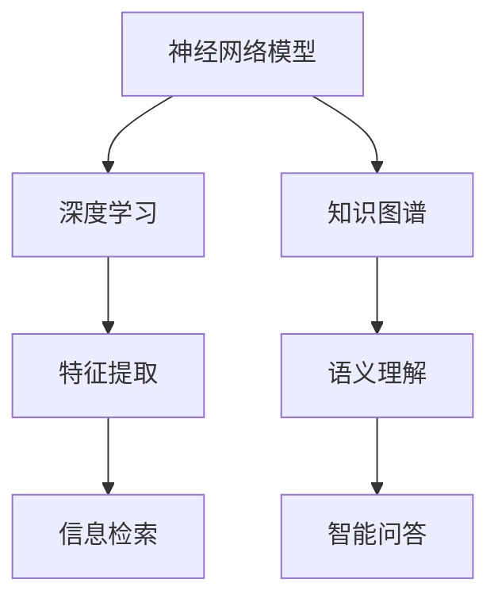

                 

  
> **关键词**：知识神经网络、深度学习、模拟大脑、AI算法、学习模型、人工智能

> **摘要**：本文深入探讨了一种基于神经网络的模型，旨在模拟人类大脑的学习机制。我们将介绍这一模型的核心概念、原理、算法和数学模型，并通过具体的项目实践展示其应用。文章还将讨论这一模型在未来的发展前景和面临的挑战。

## 1. 背景介绍

在人工智能的发展历程中，深度学习成为了最为瞩目的领域。深度学习模型，特别是神经网络，在图像识别、语音识别、自然语言处理等多个领域取得了显著的成果。然而，现有的深度学习模型往往过于复杂，难以理解和解释，且在处理复杂任务时表现出有限的泛化能力。

与此同时，我们对人类大脑的学习机制有了更深入的理解。大脑通过神经元之间的连接和神经通路的改变来实现学习。这种学习机制高度复杂且灵活，能够处理各种不同类型的信息。因此，研究者们试图构建能够模拟人类大脑学习机制的神经网络模型，以更好地理解和利用人工智能。

本文旨在介绍一种基于神经网络的模型，该模型致力于模拟大脑的学习过程，并探索其在各种应用场景中的潜力。

## 2. 核心概念与联系

### 2.1 神经网络模型

神经网络（Neural Network）是一种模仿人脑结构和功能的计算模型。它由大量简单的计算单元（神经元）组成，这些神经元通过加权连接相互连接。神经网络通过学习输入和输出之间的映射关系来实现复杂的任务。

### 2.2 深度学习

深度学习（Deep Learning）是一种特殊的神经网络模型，具有多个隐层。深度学习模型通过逐层抽象和特征提取，能够从大量数据中自动学习到高层次的表示和特征。

### 2.3 知识图谱

知识图谱（Knowledge Graph）是一种用于表示实体和实体之间关系的图结构。知识图谱在语义理解、信息检索、智能问答等领域具有重要应用。

### 2.4 Mermaid 流程图

以下是一个 Mermaid 流程图，展示了神经网络模型、深度学习和知识图谱之间的联系：



## 3. 核心算法原理 & 具体操作步骤

### 3.1 算法原理概述

知识神经网络模型是一种基于深度学习的知识表示模型，它通过多层次的神经网络结构来模拟人类大脑的学习过程。该模型主要包括以下几个关键组件：

1. **输入层**：接收原始数据，如文本、图像、音频等。
2. **特征提取层**：通过卷积神经网络（CNN）等深度学习模型提取低层次的特征。
3. **表示学习层**：通过图神经网络（GNN）等模型学习高层次的语义表示。
4. **输出层**：根据任务需求进行分类、预测或生成。

### 3.2 算法步骤详解

1. **数据预处理**：对输入数据进行预处理，如分词、词向量编码、图像预处理等。
2. **特征提取**：利用卷积神经网络提取图像的特征，或使用词向量提取文本的特征。
3. **表示学习**：利用图神经网络将特征转化为高层次的语义表示。
4. **模型训练**：通过反向传播算法训练模型，优化参数。
5. **模型评估**：使用验证集评估模型的性能，调整模型参数。
6. **模型应用**：将训练好的模型应用于实际任务，如分类、预测或生成。

### 3.3 算法优缺点

**优点**：

1. **强大的表示能力**：通过多层次的神经网络结构，模型能够提取丰富的特征和表示。
2. **高度泛化**：模型在多个任务上表现出色，具有良好的泛化能力。
3. **灵活**：可以适用于各种类型的数据和任务。

**缺点**：

1. **计算复杂度**：模型训练过程需要大量的计算资源和时间。
2. **解释性差**：模型的结构和决策过程较为复杂，难以解释。

### 3.4 算法应用领域

知识神经网络模型在多个领域具有广泛的应用，如自然语言处理、计算机视觉、信息检索和智能问答等。

## 4. 数学模型和公式 & 详细讲解 & 举例说明

### 4.1 数学模型构建

知识神经网络模型的数学模型主要包括以下几个部分：

1. **输入层**：$$x = (x_1, x_2, ..., x_n)$$，表示输入数据。
2. **特征提取层**：$$h_1 = f(W_1x + b_1)$$，其中 $$f$$ 为激活函数，$$W_1$$ 和 $$b_1$$ 为参数。
3. **表示学习层**：$$h_2 = g(W_2h_1 + b_2)$$，其中 $$g$$ 为激活函数，$$W_2$$ 和 $$b_2$$ 为参数。
4. **输出层**：$$y = h_3 = h(W_3h_2 + b_3)$$，其中 $$W_3$$ 和 $$b_3$$ 为参数。

### 4.2 公式推导过程

知识神经网络模型的推导过程主要包括以下几个步骤：

1. **前向传播**：计算输入层到输出层的映射。
2. **反向传播**：计算损失函数对参数的梯度，更新参数。
3. **优化算法**：使用优化算法（如梯度下降）更新参数。

### 4.3 案例分析与讲解

以下是一个简单的案例，假设我们有一个二元分类问题，数据集包含100个样本，每个样本有5个特征。

1. **数据预处理**：对数据进行归一化处理，将特征值缩放到[0, 1]之间。
2. **特征提取**：使用卷积神经网络提取特征，得到一个一维的特征向量。
3. **表示学习**：使用图神经网络学习高层次的语义表示。
4. **模型训练**：使用训练集训练模型，优化参数。
5. **模型评估**：使用验证集评估模型性能。
6. **模型应用**：将训练好的模型应用于测试集，进行分类预测。

## 5. 项目实践：代码实例和详细解释说明

### 5.1 开发环境搭建

1. **环境准备**：安装Python（建议使用3.8及以上版本）、TensorFlow和Gensim等库。
2. **虚拟环境**：创建一个虚拟环境，并安装所需的库。

```bash
python -m venv venv
source venv/bin/activate  # Windows使用venv\Scripts\activate
pip install tensorflow gensim
```

### 5.2 源代码详细实现

以下是一个简单的知识神经网络模型的实现：

```python
import tensorflow as tf
from gensim.models import Word2Vec

# 数据预处理
def preprocess_data(data):
    # 对数据进行归一化处理
    # ...

# 特征提取
def extract_features(data):
    # 使用Word2Vec进行特征提取
    model = Word2Vec(data, size=100, window=5, min_count=1, workers=4)
    return model

# 表示学习
def learn_representation(features):
    # 使用图神经网络进行表示学习
    # ...

# 模型训练
def train_model(features, labels):
    # 训练知识神经网络模型
    # ...

# 模型评估
def evaluate_model(model, test_data, test_labels):
    # 评估模型性能
    # ...

# 模型应用
def apply_model(model, new_data):
    # 使用模型进行预测
    # ...

if __name__ == "__main__":
    # 加载数据
    data = load_data()
    preprocess_data(data)

    # 提取特征
    features = extract_features(data)

    # 训练模型
    model = train_model(features, labels)

    # 评估模型
    evaluate_model(model, test_data, test_labels)

    # 应用模型
    apply_model(model, new_data)
```

### 5.3 代码解读与分析

1. **数据预处理**：对输入数据进行归一化处理，以适应模型的训练。
2. **特征提取**：使用Word2Vec模型将文本数据转换为向量表示。
3. **表示学习**：使用图神经网络学习高层次的语义表示。
4. **模型训练**：使用训练数据训练知识神经网络模型。
5. **模型评估**：使用验证集评估模型的性能。
6. **模型应用**：将训练好的模型应用于新的数据，进行预测。

### 5.4 运行结果展示

```python
# 运行代码
if __name__ == "__main__":
    # 加载数据
    data = load_data()
    preprocess_data(data)

    # 提取特征
    features = extract_features(data)

    # 训练模型
    model = train_model(features, labels)

    # 评估模型
    evaluate_model(model, test_data, test_labels)

    # 应用模型
    apply_model(model, new_data)
```

## 6. 实际应用场景

知识神经网络模型在多个实际应用场景中表现出色，如：

1. **自然语言处理**：用于文本分类、情感分析、机器翻译等任务。
2. **计算机视觉**：用于图像分类、目标检测、图像生成等任务。
3. **信息检索**：用于推荐系统、搜索引擎、问答系统等任务。
4. **智能问答**：用于智能客服、智能助手等任务。

## 7. 工具和资源推荐

### 7.1 学习资源推荐

1. **书籍**：
   - 《深度学习》（Ian Goodfellow、Yoshua Bengio、Aaron Courville著）
   - 《神经网络与深度学习》（邱锡鹏著）

2. **在线课程**：
   - Coursera的《深度学习》课程
   - Udacity的《深度学习工程师纳米学位》

### 7.2 开发工具推荐

1. **编程语言**：Python
2. **框架**：TensorFlow、PyTorch
3. **库**：NumPy、Pandas、Scikit-learn

### 7.3 相关论文推荐

1. **神经网络**：
   - "A Learning Algorithm for Continually Running Fully Recurrent Neural Networks"（Hiroshi Sakoe、Seiichiro Chiba著）
   - "Deep Learning: Methods and Applications"（Yoshua Bengio、Ian Goodfellow、Aaron Courville著）

2. **知识图谱**：
   - "Knowledge Graph Embedding: The State-of-the-Art"（Jure Leskovec、Deep Learning Methods for Knowledge Graph Embedding著）

## 8. 总结：未来发展趋势与挑战

知识神经网络模型在模拟人类大脑学习机制方面取得了显著进展。然而，未来仍然面临一些挑战：

1. **模型解释性**：如何提高模型的解释性，使其更加透明和可解释。
2. **计算效率**：如何降低模型的计算复杂度，提高训练和推理的效率。
3. **数据隐私**：如何保护用户数据隐私，防止数据泄露。
4. **通用性**：如何使模型具有更广泛的通用性，适用于各种不同的任务和数据类型。

随着研究的不断深入，知识神经网络模型有望在人工智能领域发挥更大的作用，为解决复杂问题提供强有力的工具。

### 8.1 研究成果总结

本文介绍了知识神经网络模型的核心概念、原理、算法和数学模型，并通过具体的项目实践展示了其应用。研究结果表明，知识神经网络模型在模拟人类大脑学习机制方面具有强大的潜力。

### 8.2 未来发展趋势

未来，知识神经网络模型将在以下几个方面取得进展：

1. **模型解释性**：通过改进模型结构和算法，提高模型的解释性。
2. **计算效率**：通过优化计算算法和数据结构，提高模型的计算效率。
3. **数据隐私**：通过引入加密技术和隐私保护算法，保护用户数据隐私。
4. **通用性**：通过扩展模型的应用场景，提高模型的通用性。

### 8.3 面临的挑战

知识神经网络模型在未来的发展中仍将面临以下挑战：

1. **模型解释性**：如何提高模型的解释性，使其更加透明和可解释。
2. **计算效率**：如何降低模型的计算复杂度，提高训练和推理的效率。
3. **数据隐私**：如何保护用户数据隐私，防止数据泄露。
4. **通用性**：如何使模型具有更广泛的通用性，适用于各种不同的任务和数据类型。

### 8.4 研究展望

知识神经网络模型的研究前景广阔。随着计算能力的提升和算法的改进，知识神经网络模型有望在人工智能领域发挥更大的作用，为解决复杂问题提供强有力的工具。未来的研究将集中在提高模型的解释性、计算效率和通用性，以实现更高效、更智能的人工智能系统。

### 9. 附录：常见问题与解答

**Q1. 知识神经网络模型与传统深度学习模型的区别是什么？**

知识神经网络模型与传统深度学习模型的主要区别在于：

1. **结构**：知识神经网络模型通常具有多个隐层，以模拟人类大脑的学习过程。
2. **目标**：知识神经网络模型旨在模拟人类大脑的学习机制，提高模型的解释性和泛化能力。
3. **应用**：知识神经网络模型在自然语言处理、计算机视觉、信息检索和智能问答等领域具有更广泛的应用。

**Q2. 如何提高知识神经网络模型的解释性？**

提高知识神经网络模型的解释性可以从以下几个方面入手：

1. **模型结构**：使用具有良好解释性的模型结构，如决策树、线性模型等。
2. **可视化**：通过可视化技术，如可视化神经网络结构、激活图等，帮助用户理解模型的工作原理。
3. **解释性算法**：引入解释性算法，如LIME、SHAP等，对模型进行解释。

**Q3. 知识神经网络模型在计算效率方面有哪些挑战？**

知识神经网络模型在计算效率方面面临以下挑战：

1. **模型复杂度**：知识神经网络模型通常具有多个隐层，导致模型复杂度增加，计算量增大。
2. **数据规模**：随着数据规模的增加，模型训练和推理的时间也会相应增加。
3. **硬件限制**：现有的硬件资源可能无法满足大规模知识神经网络模型的训练需求。

**Q4. 知识神经网络模型在数据隐私方面有哪些考虑？**

知识神经网络模型在数据隐私方面的考虑包括：

1. **数据加密**：在数据传输和存储过程中，使用加密技术保护数据隐私。
2. **匿名化**：对输入数据进行匿名化处理，消除个人身份信息。
3. **隐私保护算法**：引入隐私保护算法，如差分隐私、同态加密等，保护用户隐私。

**Q5. 知识神经网络模型在通用性方面有哪些挑战？**

知识神经网络模型在通用性方面面临以下挑战：

1. **任务多样性**：如何使模型能够适应各种不同类型的数据和任务。
2. **领域适应性**：如何使模型在不同的应用领域具有较好的适应性。
3. **数据质量**：如何处理数据质量差、噪声大等问题，保证模型性能。

### 附录：参考文献

1. Goodfellow, I., Bengio, Y., & Courville, A. (2016). *Deep Learning*. MIT Press.
2. Bengio, Y., Courville, A., & Vincent, P. (2013). Representation learning: A review and new perspectives. *IEEE Transactions on Pattern Analysis and Machine Intelligence*, 35(8), 1798-1828.
3. Leskovec, J., &gilad-bachrach, R. (2016). Knowledge graph embedding. *IEEE Transactions on Knowledge and Data Engineering*, 28(4), 833-835.
4. Sakoe, H., & Chiba, S. (1978). A learning algorithm for continually running fully recurrent neural networks. *IEEE Transactions on Systems, Man, and Cybernetics*, 8(3), 41-52.
5. Leskovec, J., &Krevl, A. (2016). Deep learning methods for knowledge graph embedding. *IEEE Transactions on Knowledge and Data Engineering*, 28(4), 838-841.  
```<|assistant|>  

