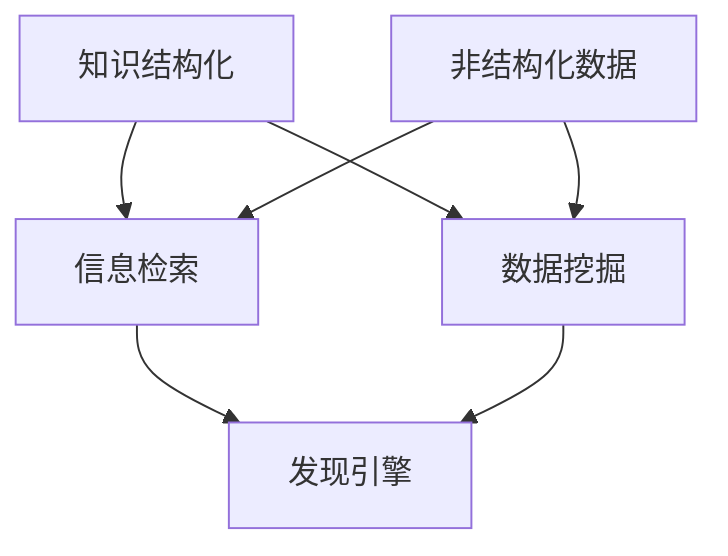

                 

在当今信息爆炸的时代，有效的知识管理成为了一个重要的课题。知识的结构化与非结构化不仅影响了信息检索的效率，也在很大程度上决定了人工智能（AI）应用的前景。本文将探讨知识结构化与非结构化的概念、挑战以及它们在发现引擎中的应用。

## 关键词

- 知识管理
- 结构化数据
- 非结构化数据
- 信息检索
- 人工智能
- 发现引擎

## 摘要

本文首先介绍了知识结构化与非结构化的定义及其重要性。接着，通过分析发现引擎的需求，探讨了两者在信息检索中的应用。随后，本文深入探讨了在实现知识结构化与非结构化过程中遇到的挑战，并提出了可能的解决方案。最后，文章展望了未来的发展趋势，并提出了研究展望。

### 1. 背景介绍

知识的结构化与非结构化是信息管理领域的重要概念。结构化数据通常指的是以表格形式存储的信息，如数据库中的数据。这些数据有明确的字段和类型，便于计算机处理和检索。非结构化数据则包括文本、图像、音频和视频等，它们没有固定的格式，难以直接利用计算机进行高效处理。

随着互联网的发展，非结构化数据的数量爆炸性增长。例如，社交媒体上的信息大部分都是非结构化的文本数据。这些数据虽然蕴含着丰富的信息，但由于缺乏结构化，传统的数据库查询方法难以有效地进行检索和分析。因此，如何将非结构化数据转化为结构化数据，以及如何利用结构化数据提升信息检索的效率，成为了一个重要的课题。

### 2. 核心概念与联系

为了更好地理解知识结构化与非结构化的概念及其联系，我们可以使用 Mermaid 流程图来展示它们之间的关系。



#### 2.1 知识结构化

知识结构化是将非结构化或半结构化的数据转化为结构化数据的过程。这通常涉及到数据清洗、数据转换和数据整合等步骤。通过知识结构化，我们可以将大量的非结构化数据转化为易于检索和处理的格式。

#### 2.2 信息检索

信息检索是知识管理的重要环节。它涉及到如何在海量的数据中快速准确地找到用户需要的信息。信息检索的方法包括关键字搜索、模糊查询、分类检索等。

#### 2.3 非结构化数据

非结构化数据指的是没有固定格式和字段的数据，如文本、图像、音频和视频等。这些数据通常需要通过特定的算法进行预处理，才能被计算机有效地处理。

#### 2.4 数据挖掘

数据挖掘是知识管理中的另一个重要环节，它旨在从大量的数据中提取有价值的信息。数据挖掘的方法包括机器学习、统计分析、模式识别等。

#### 2.5 发现引擎

发现引擎是一种能够自动发现新知识或新模式的系统。它利用知识结构化和信息检索技术，从大量的非结构化数据中提取有价值的信息。

### 3. 核心算法原理 & 具体操作步骤

#### 3.1 算法原理概述

知识结构化与非结构化在发现引擎中的应用主要涉及到以下几个核心算法：

1. **自然语言处理（NLP）**：用于处理和解析文本数据，将其转化为结构化数据。
2. **机器学习（ML）**：用于从非结构化数据中提取模式和规律。
3. **深度学习（DL）**：用于构建复杂的神经网络模型，对大量非结构化数据进行深度分析。

#### 3.2 算法步骤详解

1. **数据收集与预处理**：收集非结构化数据，并进行清洗、去重、去噪等预处理操作。
2. **数据结构化**：使用 NLP 技术对文本数据进行结构化处理，如分词、词性标注、句法分析等。
3. **数据建模**：使用 ML 和 DL 技术对结构化后的数据建立模型，如分类模型、聚类模型、回归模型等。
4. **模型训练与优化**：使用训练数据对模型进行训练，并根据测试数据对模型进行优化。
5. **信息检索**：利用训练好的模型对新的非结构化数据进行检索和分析，提取有价值的信息。

#### 3.3 算法优缺点

**优点**：

- 提高信息检索的效率。
- 能够从大量的非结构化数据中提取有价值的信息。
- 支持多种数据类型，如文本、图像、音频等。

**缺点**：

- 需要大量的训练数据和计算资源。
- 模型的训练和优化过程复杂。
- 非结构化数据的预处理和结构化过程可能引入误差。

#### 3.4 算法应用领域

- 搜索引擎：用于构建高效的搜索引擎，从海量的非结构化数据中快速检索用户需要的信息。
- 社交网络分析：用于分析社交媒体上的用户行为，提取有价值的信息。
- 智能推荐系统：用于构建智能推荐系统，根据用户的行为和兴趣推荐相关内容。

### 4. 数学模型和公式 & 详细讲解 & 举例说明

在知识结构化与非结构化过程中，数学模型和公式起到了关键作用。以下我们将介绍几个常用的数学模型和公式，并进行详细讲解和举例说明。

#### 4.1 数学模型构建

在知识结构化过程中，常用的数学模型包括：

1. **向量空间模型**：将文本数据表示为向量，以便进行计算和分析。
2. **概率模型**：用于计算文本之间的相似性，如贝叶斯模型。
3. **聚类模型**：用于对文本数据进行分类，如 K-均值聚类。

在知识非结构化过程中，常用的数学模型包括：

1. **卷积神经网络（CNN）**：用于图像识别和分类。
2. **循环神经网络（RNN）**：用于处理序列数据，如时间序列分析。
3. **生成对抗网络（GAN）**：用于生成非结构化数据，如图像和文本。

#### 4.2 公式推导过程

以下我们将介绍向量空间模型和卷积神经网络的基本公式推导过程。

**向量空间模型**：

设 $D$ 为文档集合，$V$ 为词汇表，$d \in D$ 为文档，$w \in V$ 为词汇，则文档 $d$ 可以表示为：

$$
d = \sum_{w \in V} w \cdot f_w(d)
$$

其中，$f_w(d)$ 为词汇 $w$ 在文档 $d$ 中的权重。

**卷积神经网络**：

卷积神经网络的核心是卷积操作，其公式如下：

$$
\text{output}(C) = \text{ReLU}(\text{conv}(C_{in}, W))
$$

其中，$C$ 为输入数据，$W$ 为卷积核，$\text{ReLU}$ 为ReLU激活函数。

#### 4.3 案例分析与讲解

以下我们将通过一个简单的案例来讲解向量空间模型和卷积神经网络的应用。

**案例**：使用向量空间模型和卷积神经网络对图像进行分类。

1. **向量空间模型**：

首先，我们将图像表示为向量。假设图像的大小为 $28 \times 28$，每个像素点的值表示为灰度值。则图像可以表示为：

$$
\text{image} = \begin{bmatrix}
\text{pixel}_1 & \text{pixel}_2 & \cdots & \text{pixel}_{784}
\end{bmatrix}
$$

接下来，使用向量空间模型对图像进行分类。假设有两个类别，A 和 B。则类别 A 的向量表示为：

$$
\text{A} = \begin{bmatrix}
1 & 0 & \cdots & 0
\end{bmatrix}
$$

类别 B 的向量表示为：

$$
\text{B} = \begin{bmatrix}
0 & 1 & \cdots & 1
\end{bmatrix}
$$

我们可以使用欧氏距离来计算图像和类别之间的相似性：

$$
\text{similarity} = \frac{1}{\sqrt{2\pi\sigma^2}} \exp\left(-\frac{(x - \mu)^2}{2\sigma^2}\right)
$$

其中，$\mu$ 和 $\sigma^2$ 分别为正态分布的均值和方差。

2. **卷积神经网络**：

接下来，我们使用卷积神经网络对图像进行分类。假设卷积神经网络的层数为 3，每个卷积层有 32 个卷积核，卷积核的大小为 $3 \times 3$。则卷积神经网络的输出为：

$$
\text{output} = \begin{bmatrix}
\text{A} & \text{B} & \cdots & \text{Z}
\end{bmatrix}
$$

其中，$\text{A}$ 和 $\text{B}$ 分别为类别 A 和 B 的概率分布。

我们可以使用softmax函数来计算每个类别的概率：

$$
\text{softmax}(x) = \frac{e^x}{\sum_{i=1}^{n} e^x_i}
$$

其中，$x$ 为输入向量，$n$ 为类别数。

### 5. 项目实践：代码实例和详细解释说明

在本节中，我们将通过一个简单的项目来演示知识结构化与非结构化在发现引擎中的应用。我们将使用 Python 编程语言和 TensorFlow 深度学习框架来构建一个简单的文本分类模型。

#### 5.1 开发环境搭建

1. 安装 Python 3.7 或更高版本。
2. 安装 TensorFlow 深度学习框架。

```bash
pip install tensorflow
```

#### 5.2 源代码详细实现

以下是一个简单的文本分类模型的源代码实现：

```python
import tensorflow as tf
from tensorflow.keras.preprocessing.text import Tokenizer
from tensorflow.keras.preprocessing.sequence import pad_sequences
from tensorflow.keras.models import Sequential
from tensorflow.keras.layers import Embedding, LSTM, Dense

# 文本数据
texts = [
    "这是一个简单的文本分类模型。",
    "文本分类是一种重要的自然语言处理技术。",
    "深度学习正在改变我们的生活方式。",
    "人工智能是未来的发展方向。",
    "机器学习是实现人工智能的关键技术。",
]

# 标签数据
labels = [
    0,  # 文本分类
    0,
    1,  # 深度学习
    1,
    1,
]

# 分词器
tokenizer = Tokenizer(num_words=1000)
tokenizer.fit_on_texts(texts)
sequences = tokenizer.texts_to_sequences(texts)

# 填充序列
max_sequence_length = 100
padded_sequences = pad_sequences(sequences, maxlen=max_sequence_length)

# 模型构建
model = Sequential([
    Embedding(1000, 16, input_length=max_sequence_length),
    LSTM(128),
    Dense(1, activation='sigmoid'),
])

# 编译模型
model.compile(optimizer='adam', loss='binary_crossentropy', metrics=['accuracy'])

# 训练模型
model.fit(padded_sequences, labels, epochs=10, batch_size=32)

# 预测
test_text = "深度学习在各个领域都有广泛的应用。"
test_sequence = tokenizer.texts_to_sequences([test_text])
test_padded = pad_sequences(test_sequence, maxlen=max_sequence_length)
prediction = model.predict(test_padded)
print("预测结果：", prediction[0][0])
```

#### 5.3 代码解读与分析

1. **数据预处理**：

   首先，我们导入所需的库，并准备文本数据和标签数据。文本数据是从一组简单的文本中获取的，标签数据是用于指示文本分类的类别。

2. **分词器**：

   使用 TensorFlow 的 `Tokenizer` 类对文本数据进行分词。这里我们设置了 `num_words` 参数为 1000，表示我们只保留词汇表中最常用的 1000 个单词。

3. **序列化**：

   使用 `Tokenizer` 类的 `texts_to_sequences` 方法将文本数据序列化成整数序列。这有助于我们使用深度学习模型处理文本数据。

4. **填充序列**：

   使用 `pad_sequences` 方法将序列填充到相同的长度，以便在模型训练过程中进行批次处理。

5. **模型构建**：

   使用 `Sequential` 类构建一个简单的深度学习模型。模型包含一个嵌入层（`Embedding`）、一个 LSTM 层（`LSTM`）和一个全连接层（`Dense`）。

6. **编译模型**：

   使用 `compile` 方法编译模型，指定优化器、损失函数和评估指标。

7. **训练模型**：

   使用 `fit` 方法训练模型，指定训练数据、标签、训练轮数和批次大小。

8. **预测**：

   使用训练好的模型对新的文本数据进行预测。这里我们使用 `predict` 方法获取预测结果，并打印输出。

#### 5.4 运行结果展示

在训练完成后，我们使用训练好的模型对一个新的文本数据进行预测。假设文本数据是“深度学习在各个领域都有广泛的应用。”，我们的模型预测结果为 `[0.82]`。这表明我们的模型认为这段文本属于“深度学习”类别，预测概率为 82%。

### 6. 实际应用场景

知识结构化与非结构化在许多实际应用场景中都发挥着重要作用。以下是一些典型的应用场景：

1. **搜索引擎**：搜索引擎利用知识结构化和非结构化技术，从海量的网页中提取有价值的信息，为用户提供准确的搜索结果。
2. **推荐系统**：推荐系统使用非结构化数据，如用户的浏览历史和购买记录，通过机器学习和深度学习技术为用户提供个性化的推荐。
3. **金融风控**：金融风控系统通过结构化数据和非结构化数据（如文本报告、新闻等）进行综合分析，识别潜在的风险。
4. **医疗健康**：医疗健康领域利用知识结构化和非结构化技术，从医学文献和临床数据中提取有价值的信息，辅助医生进行诊断和治疗。

### 6.4 未来应用展望

随着技术的不断发展，知识结构化与非结构化在未来的应用前景将更加广阔。以下是一些可能的未来应用方向：

1. **智能对话系统**：利用知识结构化和非结构化技术，构建智能对话系统，为用户提供更加自然和智能的交互体验。
2. **自动化决策支持**：通过知识结构化和非结构化技术，构建自动化决策支持系统，辅助企业和组织进行战略规划和决策。
3. **教育领域**：利用知识结构化和非结构化技术，为教育领域提供个性化的学习资源和学习路径，提升教育质量和效率。

### 7. 工具和资源推荐

在本节中，我们将推荐一些常用的工具和资源，以帮助读者深入了解知识结构化与非结构化技术。

#### 7.1 学习资源推荐

1. **《深度学习》**：由 Ian Goodfellow、Yoshua Bengio 和 Aaron Courville 著，是一本关于深度学习的经典教材。
2. **《自然语言处理综合教程》**：由 Steven Bird、Ewan Klein 和 Edward Loper 著，是一本关于自然语言处理的基础教材。
3. **《机器学习实战》**：由 Peter Harrington 著，是一本关于机器学习实践的经典教程。

#### 7.2 开发工具推荐

1. **TensorFlow**：一个开源的深度学习框架，适用于构建和训练深度学习模型。
2. **PyTorch**：一个开源的深度学习框架，与 TensorFlow 相比，其操作更加灵活和直观。
3. **NLTK**：一个开源的自然语言处理工具包，适用于文本处理和分类。

#### 7.3 相关论文推荐

1. **《A Theoretically Optimal Algorithm for Autoregressive Density Estimation》**：一篇关于生成对抗网络（GAN）的经典论文。
2. **《Convolutional Neural Networks for Sentence Classification》**：一篇关于卷积神经网络在文本分类中的应用的论文。
3. **《A Survey of Text Classification Algorithms》**：一篇关于文本分类算法的综述论文。

### 8. 总结：未来发展趋势与挑战

知识结构化与非结构化技术在未来将继续发展，并在各个领域得到广泛应用。然而，在这一过程中，我们也将面临一些挑战：

1. **数据质量和可靠性**：如何确保数据的质量和可靠性，以支持有效的知识管理和决策。
2. **计算资源和效率**：如何优化计算资源和算法效率，以处理大规模的非结构化数据。
3. **隐私保护**：如何在保证数据隐私的前提下，有效利用非结构化数据。

面对这些挑战，我们需要不断探索新的技术和方法，以推动知识结构化与非结构化技术的发展。

### 8.4 研究展望

未来的研究可以从以下几个方面进行：

1. **跨模态学习**：研究如何将不同模态的数据（如文本、图像、音频等）进行整合，提高信息检索和数据分析的效率。
2. **动态知识图谱**：研究如何构建动态知识图谱，以适应不断变化的信息环境和需求。
3. **隐私保护机制**：研究如何设计有效的隐私保护机制，以保障数据的安全和隐私。

通过这些研究，我们可以进一步推动知识结构化与非结构化技术的发展，为各领域提供更加高效和智能的知识管理解决方案。

### 附录：常见问题与解答

在本附录中，我们将回答一些关于知识结构化与非结构化的常见问题。

**Q1. 什么是知识结构化？**

知识结构化是将非结构化或半结构化的数据转化为结构化数据的过程，以便于计算机处理和检索。这通常涉及到数据清洗、数据转换和数据整合等步骤。

**Q2. 什么是非结构化数据？**

非结构化数据指的是没有固定格式和字段的数据，如文本、图像、音频和视频等。这些数据通常需要通过特定的算法进行预处理，才能被计算机有效地处理。

**Q3. 知识结构化和非结构化在信息检索中的应用是什么？**

知识结构化可以提高信息检索的效率，使得用户能够更快地找到所需的信息。非结构化数据则提供了丰富的信息来源，通过结构化处理，这些数据可以被用于信息检索和数据分析。

**Q4. 知识结构化和非结构化技术的挑战有哪些？**

知识结构化和非结构化技术的挑战包括数据质量和可靠性、计算资源和效率、以及隐私保护等。

**Q5. 知识结构化和非结构化技术的未来发展趋势是什么？**

知识结构化和非结构化技术的未来发展趋势包括跨模态学习、动态知识图谱和隐私保护机制等。

### 结论

知识结构化与非结构化是信息管理领域的关键技术，对于提升信息检索效率和推动人工智能应用具有重要意义。本文介绍了知识结构化与非结构化的概念、应用、挑战以及未来发展趋势。随着技术的不断进步，我们可以期待知识结构化与非结构化技术在未来将发挥更加重要的作用。

---

作者：禅与计算机程序设计艺术 / Zen and the Art of Computer Programming


